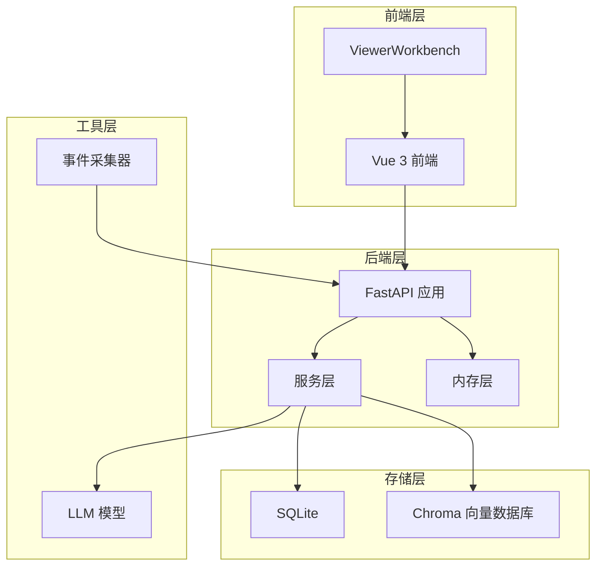
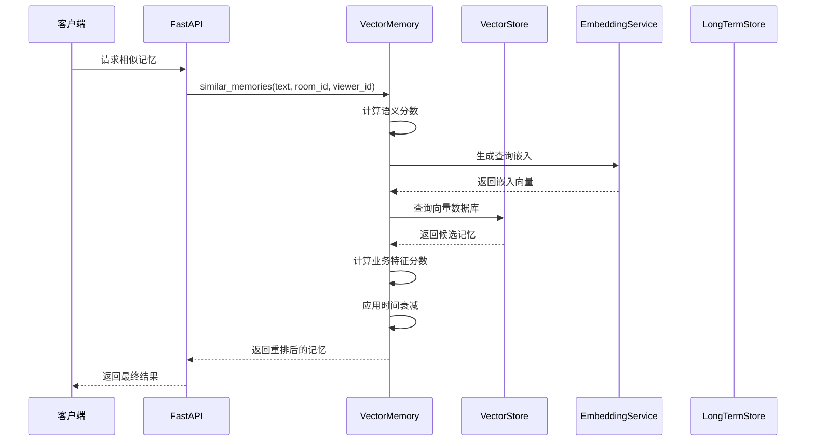
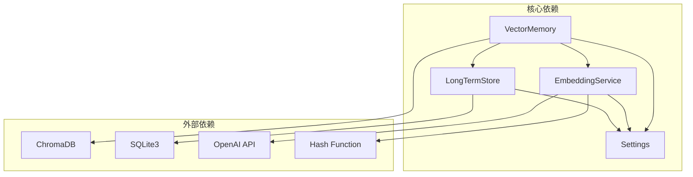

# 2026-04-20-特征驱动记忆重排实现计划

<cite>
**本文档引用的文件**
- [vector_store.py](file://backend/memory/vector_store.py)
- [rebuild_embeddings.py](file://backend/memory/rebuild_embeddings.py)
- [embedding_service.py](file://backend/memory/embedding_service.py)
- [long_term.py](file://backend/memory/long_term.py)
- [memory_extractor.py](file://backend/services/memory_extractor.py)
- [memory_confidence_service.py](file://backend/services/memory_confidence_service.py)
- [live.py](file://backend/schemas/live.py)
- [config.py](file://backend/config.py)
- [2026-04-20-memory-rerank.md](file://docs/superpowers/plans/2026-04-20-memory-rerank.md)
- [test_vector_store.py](file://tests/test_vector_store.py)
- [README.md](file://README.md)
</cite>

## 目录
1. [简介](#简介)
2. [项目结构](#项目结构)
3. [核心组件](#核心组件)
4. [架构概览](#架构概览)
5. [详细组件分析](#详细组件分析)
6. [依赖分析](#依赖分析)
7. [性能考虑](#性能考虑)
8. [故障排除指南](#故障排除指南)
9. [结论](#结论)
10. [附录](#附录)

## 简介

本文档详细分析了"特征驱动记忆重排实现计划"的技术方案和实施方案。该项目旨在重构观众记忆排序系统，将语义相似度与业务特征分离，建立明确的特征驱动重排机制，确保对直播提词最有价值的记忆能够优先显示。

项目基于抖音直播场景，通过实时事件采集、观众记忆抽取、语义召回和提词生成的完整链路，为主播提供实时辅助系统。当前版本已经实现了基于语义向量的召回系统，但需要进一步优化排序算法，使其更加符合直播场景的实际需求。

## 项目结构

项目采用模块化的架构设计，主要分为以下几个层次：



**图表来源**
- [README.md:35-45](file://README.md#L35-L45)

**章节来源**
- [README.md:207-220](file://README.md#L207-L220)

## 核心组件

### 向量记忆存储(VectorMemory)

VectorMemory是整个记忆重排系统的核心组件，负责：
- 管理Chroma向量数据库连接
- 维护观众记忆的语义索引
- 实现特征驱动的记忆重排算法
- 支持严格模式和回退机制

### 嵌入服务(EmbeddingService)

EmbeddingService提供统一的嵌入生成接口：
- 支持云端嵌入API调用
- 提供本地哈希嵌入回退
- 实现严格模式控制
- 处理嵌入失败的异常情况

### 长期存储(LongTermStore)

LongTermStore负责持久化存储：
- SQLite数据库操作
- 观众记忆的增删改查
- 记忆生命周期管理
- 与向量存储的数据同步

**章节来源**
- [vector_store.py:60-445](file://backend/memory/vector_store.py#L60-L445)
- [embedding_service.py:13-86](file://backend/memory/embedding_service.py#L13-L86)
- [long_term.py:48-800](file://backend/memory/long_term.py#L48-L800)

## 架构概览



**图表来源**
- [vector_store.py:372-445](file://backend/memory/vector_store.py#L372-L445)
- [embedding_service.py:28-58](file://backend/memory/embedding_service.py#L28-L58)

## 详细组件分析

### 特征驱动重排算法

#### 语义分数计算(_semantic_score)

语义分数基于向量相似度计算，使用余弦距离转换为相似度分数：
- 输入：向量查询结果中的距离值
- 输出：0-1之间的相似度分数
- 公式：score = 1/(1+distance)

#### 业务特征重排(_business_rerank_score)

业务特征重排综合考虑多个质量信号：

```mermaid
flowchart TD
A[输入记忆项] --> B[提取质量信号]
B --> C[稳定性评分(stability_score)]
B --> D[互动价值(interaction_value_score)]
B --> E[清晰度(clarity_score)]
B --> F[证据量(evidence_score)]
B --> G[置信度(confidence)]
B --> H[来源类型(source_kind)]
B --> I[置顶状态(is_pinned)]
B --> J[召回次数(recall_count)]
C --> K[加权求和]
D --> K
E --> K
F --> K
G --> K
H --> K
I --> K
J --> K
K --> L[最终业务分数]
```

**图表来源**
- [vector_store.py:272-320](file://backend/memory/vector_store.py#L272-L320)

#### 最终排序键(_final_rank_key)

最终排序采用加权组合的方式：
- 语义分数权重：0.55
- 业务特征分数权重：0.45
- 时间衰减因子：根据半衰期计算

#### 时间衰减机制

时间衰减确保记忆的新鲜度：
- 半衰期可通过配置参数调整
- 置顶记忆不受时间衰减影响
- 基于最后更新时间和最后召回时间计算

**章节来源**
- [vector_store.py:272-320](file://backend/memory/vector_store.py#L272-L320)

### 记忆生命周期管理

#### 生命周期类型

- **长期记忆(long_term)**：稳定的个人偏好和背景信息
- **短期记忆(short_term)**：当前直播场次内的临时信息
- **混合记忆(mixed)**：同时具备长期和短期特征的记忆

#### 过期机制

- `expires_at`字段存储过期时间戳
- 自动过滤过期记忆
- 支持手动设置和自动更新

**章节来源**
- [long_term.py:166-199](file://backend/memory/long_term.py#L166-L199)

### 嵌入服务与回退机制

#### 云端嵌入API

支持通过OpenAI兼容接口调用：
- 动态模型选择
- API密钥认证
- 超时控制
- 错误重试

#### 本地哈希嵌入

当云端服务不可用时的回退方案：
- 基于字符令牌的哈希算法
- 固定维度向量生成
- 保证基本的语义相似度

#### 严格模式

启用严格模式时：
- 禁止任何回退机制
- 必须使用真实的语义嵌入
- 向量查询失败时抛出异常

**章节来源**
- [embedding_service.py:13-86](file://backend/memory/embedding_service.py#L13-L86)

### 记忆抽取与置信度评分

#### 记忆抽取器

支持多种抽取策略：
- **LLM抽取**：使用大语言模型进行语义理解
- **规则抽取**：基于关键词和模式的启发式规则
- **混合策略**：LLM失败时自动回退到规则

#### 置信度评分

多维度质量信号：
- **稳定性**：记忆的持久性和一致性
- **互动价值**：对直播互动的帮助程度
- **清晰度**：表达的明确性和简洁性
- **证据量**：支持该记忆的事实依据数量

**章节来源**
- [memory_extractor.py:104-269](file://backend/services/memory_extractor.py#L104-L269)
- [memory_confidence_service.py:4-118](file://backend/services/memory_confidence_service.py#L4-L118)

## 依赖分析



**图表来源**
- [vector_store.py:11-17](file://backend/memory/vector_store.py#L11-L17)
- [embedding_service.py:3-7](file://backend/memory/embedding_service.py#L3-L7)

### 关键依赖关系

1. **VectorMemory依赖EmbeddingService**：用于生成和查询嵌入向量
2. **VectorMemory依赖LongTermStore**：用于获取记忆元数据
3. **EmbeddingService依赖Settings**：用于配置嵌入参数
4. **LongTermStore依赖SQLite**：用于持久化存储

**章节来源**
- [vector_store.py:11-17](file://backend/memory/vector_store.py#L11-L17)
- [embedding_service.py:3-7](file://backend/memory/embedding_service.py#L3-L7)

## 性能考虑

### 向量查询优化

- **批处理查询**：支持批量向量查询减少网络往返
- **索引优化**：合理使用Chroma的索引机制
- **查询限制**：通过`semantic_memory_query_limit`控制查询数量
- **缓存策略**：内存中的最近记忆缓存

### 内存管理

- **缓存大小限制**：最多保持3000条最近记忆
- **批量写入**：64条记录为一批进行upsert操作
- **增量更新**：只更新发生变化的记忆

### 并发处理

- **线程安全**：向量存储操作的并发控制
- **连接池**：Chroma客户端连接管理
- **超时控制**：嵌入查询和数据库操作的超时设置

## 故障排除指南

### 常见问题及解决方案

#### 向量召回失败

**症状**：向量查询抛出异常，但系统应该回退到词项匹配

**排查步骤**：
1. 检查Chroma服务状态
2. 验证嵌入服务配置
3. 确认严格模式设置

**解决方案**：
- 确保Chroma服务正常运行
- 检查网络连接和防火墙设置
- 调整超时参数

#### 嵌入服务异常

**症状**：嵌入生成失败，系统回退到哈希嵌入

**排查步骤**：
1. 检查API密钥有效性
2. 验证网络连接
3. 查看超时设置

**解决方案**：
- 更新有效的API密钥
- 增加超时时间
- 检查代理设置

#### 记忆重排不符合预期

**症状**：重要记忆没有优先显示

**排查步骤**：
1. 检查记忆的业务特征分数
2. 验证时间衰减设置
3. 确认置顶状态

**解决方案**：
- 调整业务特征权重
- 修改半衰期参数
- 检查记忆状态

**章节来源**
- [vector_store.py:415-419](file://backend/memory/vector_store.py#L415-L419)
- [embedding_service.py:40-58](file://backend/memory/embedding_service.py#L40-L58)

## 结论

特征驱动记忆重排实现计划为直播场景下的观众记忆系统提供了更加科学和实用的排序机制。通过将语义相似度与业务特征分离，系统能够更好地平衡技术准确性和业务实用性。

主要成果包括：
1. **明确的排序框架**：语义分数与业务特征分数的分离设计
2. **可调的权重系统**：支持根据业务需求调整各特征的重要性
3. **完善的回退机制**：严格模式下的异常处理和回退策略
4. **生命周期管理**：支持长期和短期记忆的差异化处理

该实现为后续的深度学习重排器集成奠定了基础，也为直播场景下的智能记忆系统提供了可靠的工程实践参考。

## 附录

### 配置参数说明

| 参数名 | 类型 | 默认值 | 说明 |
|--------|------|--------|------|
| `semantic_memory_min_score` | float | 0.35 | 最小语义分数阈值 |
| `semantic_memory_query_limit` | int | 6 | 查询返回的记忆数量 |
| `semantic_final_k` | int | 3 | 最终返回的记忆数量 |
| `memory_decay_halflife_hours` | float | 168.0 | 记忆时间衰减半衰期(小时) |
| `embedding_strict` | bool | False | 是否启用严格模式 |

### 测试用例覆盖

- **语义分数计算**：验证向量相似度转换的正确性
- **业务特征评分**：测试多维度质量信号的综合效果
- **时间衰减机制**：验证记忆新鲜度的衰减逻辑
- **回退机制**：确保在异常情况下系统行为正确
- **生命周期管理**：测试过期记忆的过滤功能

**章节来源**
- [config.py:65-164](file://backend/config.py#L65-L164)
- [test_vector_store.py:10-18](file://tests/test_vector_store.py#L10-L18)