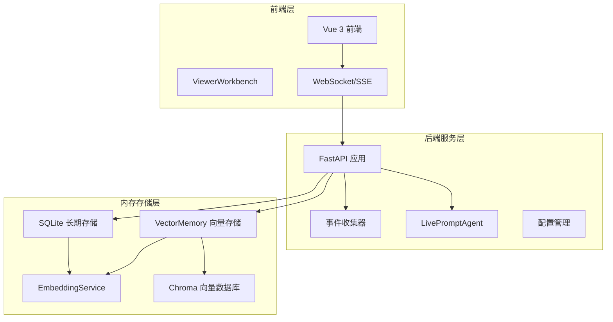
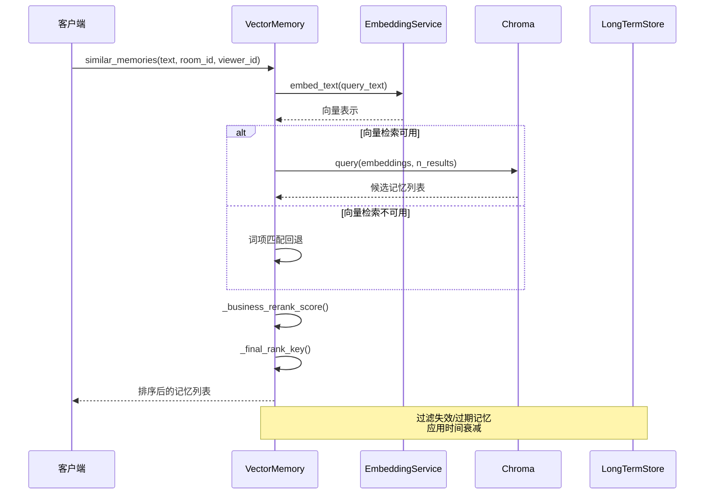
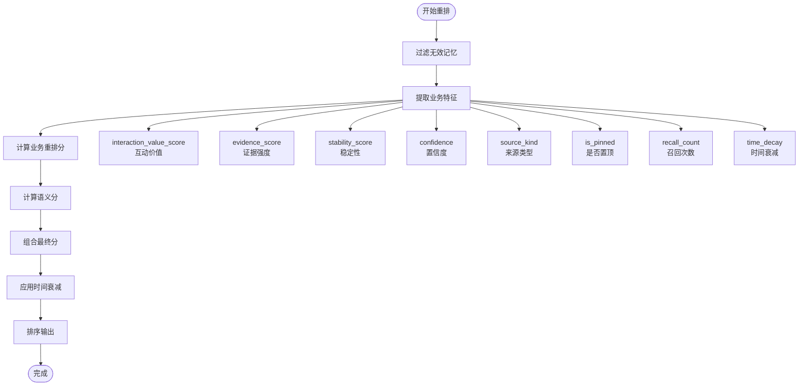
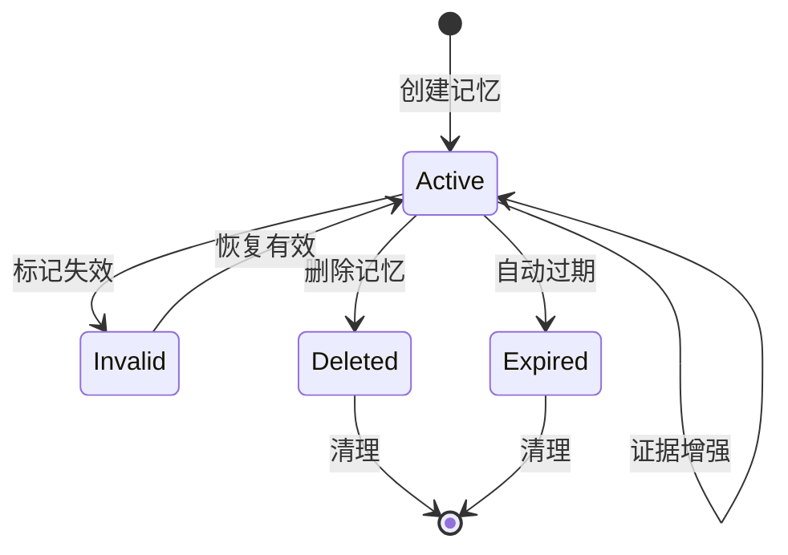
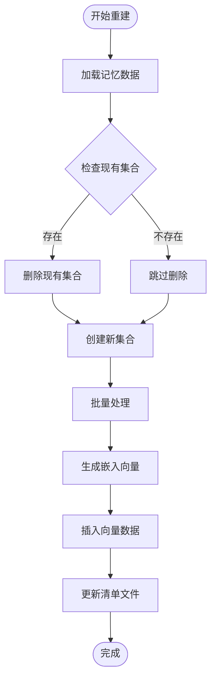
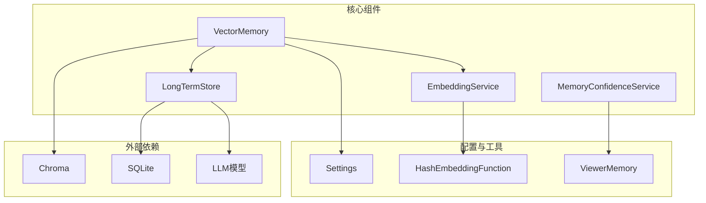
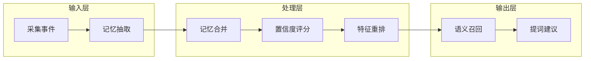

# 2026-04-20-特征驱动记忆重排设计

<cite>
**本文档引用的文件**
- [vector_store.py](file://backend/memory/vector_store.py)
- [rebuild_embeddings.py](file://backend/memory/rebuild_embeddings.py)
- [embedding_service.py](file://backend/memory/embedding_service.py)
- [long_term.py](file://backend/memory/long_term.py)
- [live.py](file://backend/schemas/live.py)
- [config.py](file://backend/config.py)
- [memory_confidence_service.py](file://backend/services/memory_confidence_service.py)
- [2026-04-20-memory-rerank-design.md](file://docs/superpowers/specs/2026-04-20-memory-rerank-design.md)
- [2026-04-20-memory-rerank.md](file://docs/superpowers/plans/2026-04-20-memory-rerank.md)
- [test_vector_store.py](file://tests/test_vector_store.py)
- [README.md](file://README.md)
</cite>

## 目录
1. [简介](#简介)
2. [项目结构](#项目结构)
3. [核心组件](#核心组件)
4. [架构概览](#架构概览)
5. [详细组件分析](#详细组件分析)
6. [依赖关系分析](#依赖关系分析)
7. [性能考虑](#性能考虑)
8. [故障排查指南](#故障排查指南)
9. [结论](#结论)
10. [附录](#附录)

## 简介

本文档详细阐述了"特征驱动记忆重排设计"的实现方案，这是抖音直播场景下观众记忆召回系统的重要升级。该设计将传统的"语义相似度 + 少量权重修正"排序方式，升级为"围绕提词价值的特征重排"，让真正对主播接话有帮助的记忆稳定排在前面。

本次设计的核心目标是：
- 让高提词价值的记忆优先于普通背景记忆
- 让多次确认、人工确认、近期再次证实的记忆更容易靠前
- 在不引入新 rerank 模型的前提下，把现有质量信号充分利用

## 项目结构

该项目采用模块化的三层架构设计，主要分为后端服务层、内存存储层和前端交互层：



**图表来源**
- [README.md:35-45](file://README.md#L35-L45)
- [backend/app.py](file://backend/app.py)

**章节来源**
- [README.md:207-220](file://README.md#L207-L220)

## 核心组件

### VectorMemory 类
VectorMemory 是整个记忆重排系统的核心组件，负责：
- 向量检索和语义召回
- 特征重排评分计算
- 记忆生命周期管理
- 严格模式下的回退机制

### MemoryConfidenceService
负责多维置信度打分，包括：
- 稳定性评分 (stability_score)
- 互动价值评分 (interaction_value_score)
- 清晰度评分 (clarity_score)
- 证据评分 (evidence_score)

### EmbeddingService
提供嵌入向量生成服务，支持：
- 云端模型调用
- 本地哈希回退
- 严格模式控制

**章节来源**
- [vector_store.py:60-86](file://backend/memory/vector_store.py#L60-L86)
- [memory_confidence_service.py:4-118](file://backend/services/memory_confidence_service.py#L4-L118)
- [embedding_service.py:13-86](file://backend/memory/embedding_service.py#L13-L86)

## 架构概览

特征驱动记忆重排系统采用"语义召回 + 业务重排"的两阶段架构：



**图表来源**
- [vector_store.py:372-445](file://backend/memory/vector_store.py#L372-L445)
- [vector_store.py:272-320](file://backend/memory/vector_store.py#L272-L320)

## 详细组件分析

### 业务重排评分算法

系统采用特征驱动的业务重排评分，将语义相似度与业务特征分离：



**图表来源**
- [vector_store.py:276-319](file://backend/memory/vector_store.py#L276-L319)
- [vector_store.py:196-203](file://backend/memory/vector_store.py#L196-L203)

### 重排评分公式

系统采用加权组合的方式计算最终得分：

**业务重排分 (business_rerank_score)**：
```
0.35 × interaction_value_score +
0.20 × evidence_score +
0.15 × stability_score +
0.10 × confidence +
0.08 × manual_bonus +
0.07 × pin_bonus +
0.05 × recall_bonus
```

**最终分 (final_score)**：
```
0.55 × semantic_score + 0.45 × business_rerank_score
```

**时间衰减**：`final_score × time_decay`

### 记忆生命周期管理

系统实现了完整的记忆生命周期管理，包括：



**图表来源**
- [long_term.py:166-199](file://backend/memory/long_term.py#L166-L199)
- [vector_store.py:151-174](file://backend/memory/vector_store.py#L151-L174)

**章节来源**
- [vector_store.py:272-319](file://backend/memory/vector_store.py#L272-L319)
- [long_term.py:751-787](file://backend/memory/long_term.py#L751-L787)

### 向量重建与索引管理

系统提供了完整的向量重建功能，支持增量重建和全量重建：



**图表来源**
- [rebuild_embeddings.py:120-157](file://backend/memory/rebuild_embeddings.py#L120-L157)
- [rebuild_embeddings.py:160-194](file://backend/memory/rebuild_embeddings.py#L160-L194)

**章节来源**
- [rebuild_embeddings.py:120-194](file://backend/memory/rebuild_embeddings.py#L120-L194)

## 依赖关系分析

### 组件耦合关系



**图表来源**
- [vector_store.py:60-86](file://backend/memory/vector_store.py#L60-L86)
- [embedding_service.py:13-17](file://backend/memory/embedding_service.py#L13-L17)
- [long_term.py:48-58](file://backend/memory/long_term.py#L48-L58)

### 数据流分析

系统中的数据流向呈现典型的"事件驱动"模式：



**图表来源**
- [README.md:302-322](file://README.md#L302-L322)

**章节来源**
- [config.py:65-164](file://backend/config.py#L65-L164)
- [live.py:65-99](file://backend/schemas/live.py#L65-L99)

## 性能考虑

### 向量检索优化

系统采用了多种优化策略来提升性能：

1. **批处理优化**：向量生成采用批量处理，减少网络往返
2. **索引缓存**：内存中缓存最近使用的记忆项
3. **采样匹配**：通过采样验证集合一致性，避免不必要的重建
4. **严格模式**：在严格模式下禁用回退，确保性能一致性

### 内存管理

- **批量大小控制**：默认批处理大小为64，可根据硬件调整
- **内存限制**：最多缓存3000条最近记忆项
- **连接池管理**：合理管理数据库和向量数据库连接

### 并发处理

系统支持高并发场景：
- 向量检索使用异步查询
- 记忆更新采用原子操作
- 配置参数可调优并发度

## 故障排查指南

### 常见问题诊断

1. **向量检索失败**
   - 检查 Chroma 服务状态
   - 验证嵌入模型配置
   - 查看严格模式设置

2. **记忆重排异常**
   - 检查业务特征数据完整性
   - 验证评分权重配置
   - 确认时间衰减参数

3. **性能问题**
   - 监控批处理大小
   - 检查索引重建频率
   - 优化查询限制参数

### 调试工具

系统提供了完善的调试接口：
- 健康检查端点
- 详细日志输出
- 性能指标监控
- 错误追踪机制

**章节来源**
- [README.md:185-206](file://README.md#L185-L206)

## 结论

特征驱动记忆重排设计成功地将传统的语义排序升级为更加智能化的业务排序。通过将语义相似度与业务特征分离，系统能够：
- 更好地区分高价值记忆和普通背景记忆
- 优先展示经过多次确认和人工验证的记忆
- 在不引入复杂机器学习模型的前提下，充分利用现有质量信号

该设计体现了"启发式 + 特征工程"的务实思路，在保证系统可解释性和可维护性的同时，显著提升了直播场景下的实际效果。未来可以在以下几个方面继续优化：
- 引入更精细的业务反馈机制
- 增强对弱信号和边界样本的处理能力
- 完善长期/短期记忆的双层架构

## 附录

### 配置参数说明

| 参数名称 | 默认值 | 说明 |
|---------|--------|------|
| semantic_memory_min_score | 0.35 | 语义召回最低分数阈值 |
| semantic_memory_query_limit | 6 | 查询限制数量 |
| semantic_final_k | 3 | 最终返回数量 |
| memory_decay_halflife_hours | 168.0 | 时间衰减半衰期(小时) |
| embedding_strict | False | 严格模式开关 |

### 评分权重配置

| 特征类型 | 权重 | 说明 |
|---------|------|------|
| interaction_value_score | 0.35 | 互动价值 |
| evidence_score | 0.20 | 证据强度 |
| stability_score | 0.15 | 稳定性 |
| confidence | 0.10 | 置信度 |
| manual_bonus | 0.08 | 人工来源奖励 |
| pin_bonus | 0.07 | 置顶奖励 |
| recall_bonus | 0.05 | 召回次数奖励 |
| semantic_weight | 0.55 | 语义分数权重 |
| business_weight | 0.45 | 业务分数权重 |

**章节来源**
- [config.py:101-126](file://backend/config.py#L101-L126)
- [vector_store.py:291-319](file://backend/memory/vector_store.py#L291-L319)