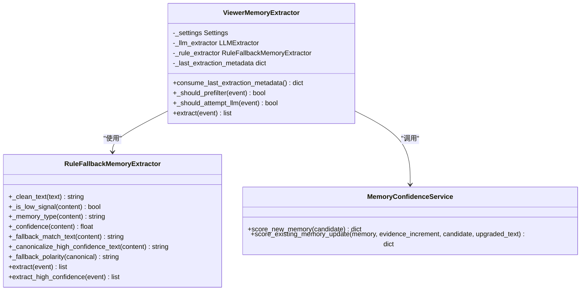
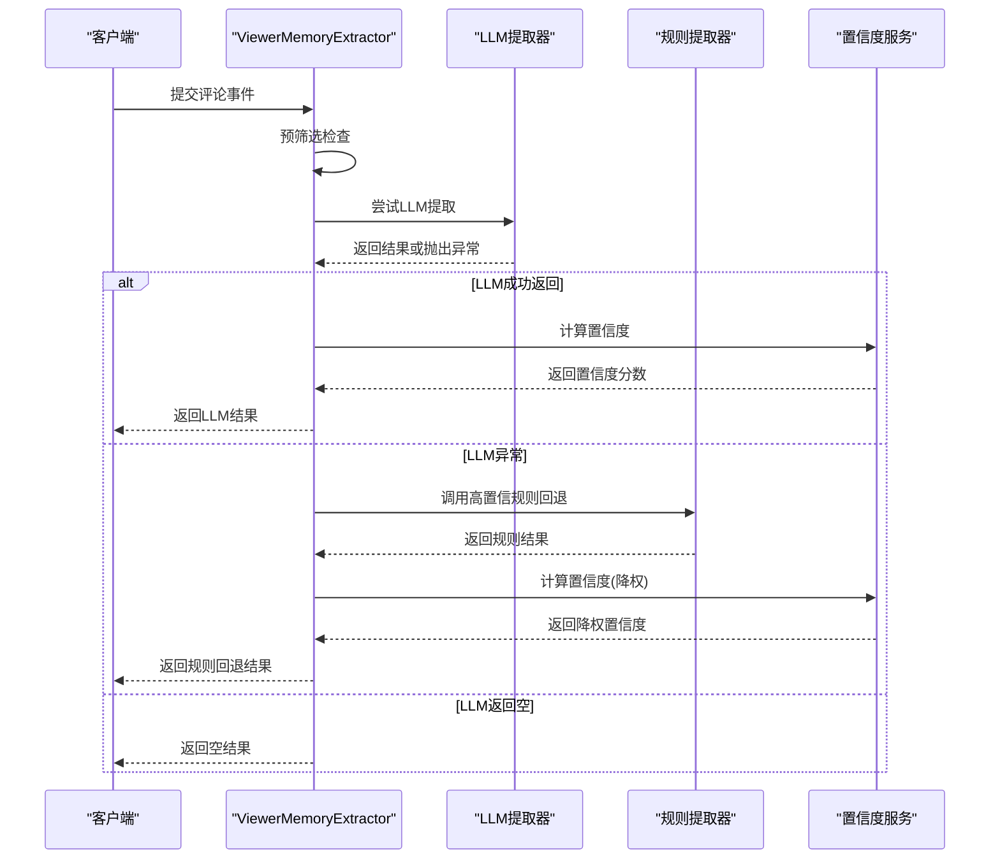
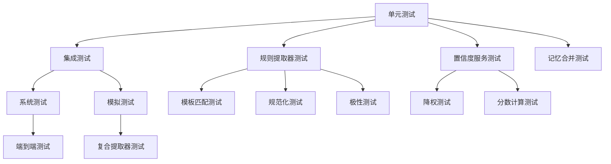

# 2026-04-20 规则回退强化实施计划

<cite>
**本文档引用的文件**
- [2026-04-20-rule-fallback-hardening.md](file://docs/superpowers/plans/2026-04-20-rule-fallback-hardening.md)
- [memory_extractor.py](file://backend/services/memory_extractor.py)
- [memory_confidence_service.py](file://backend/services/memory_confidence_service.py)
- [test_llm_memory_extractor.py](file://tests/test_llm_memory_extractor.py)
- [test_memory_confidence_service.py](file://tests/test_memory_confidence_service.py)
- [README.md](file://README.md)
- [vector_store.py](file://backend/memory/vector_store.py)
- [memory_merge_service.py](file://backend/services/memory_merge_service.py)
- [config.py](file://backend/config.py)
</cite>

## 目录
1. [项目概述](#项目概述)
2. [实施计划总览](#实施计划总览)
3. [核心组件分析](#核心组件分析)
4. [架构设计](#架构设计)
5. [详细实施方案](#详细实施方案)
6. [测试策略](#测试策略)
7. [性能考量](#性能考量)
8. [故障排除指南](#故障排除指南)
9. [结论](#结论)

## 项目概述

"2026-04-20 规则回退强化实施计划"旨在提升规则驱动的记忆抽取回退路径质量，确保当大语言模型(LLM)路径失败时，系统仍能产生保守且最小可复用的观众记忆，而非原始低质量句子。

该项目基于抖音直播场景的实时提词与观众记忆工作台，核心目标是为主播提供实时辅助系统，通过沉淀观众长期记忆、真实语义召回，帮助主播更好地接话、识别老观众和维护互动关系。

## 实施计划总览

该实施计划包含五个核心任务，每个任务都有明确的目标、文件修改范围和测试要求：

### 任务分解

1. **锁定回退资格和基础输出形态**
2. **保守扩展高置信模板集**
3. **添加保守的规则回退规范化器**
4. **推断负极性和降低回退质量分数**
5. **更新README以反映强化后的回退状态**

## 核心组件分析

### 规则回退提取器 (RuleFallbackMemoryExtractor)

规则回退提取器是整个实施计划的核心组件，负责在LLM失败时提供高质量的记忆抽取。



**图表来源**
- [memory_extractor.py:111-296](file://backend/services/memory_extractor.py#L111-L296)
- [memory_confidence_service.py:4-130](file://backend/services/memory_confidence_service.py#L4-L130)

### 高置信模板集

当前高置信模板集包含以下模式：
- 上班/工作相关：`^我?在.+上班$`、`^我?在.+做.+$`
- 宠物/家庭：`^我?家里养了.+$`
- 偏好：`^我?一直都?只用.+$`、`^我?一直都喜欢.+$`、`^我?平时都喝.+$`
- 位置：`^我?(?:租房)?住在.+附近(?:，.*)?$`
- 饮食限制：`^我?不太能吃.+$`、`^我?不能吃.+$`、`^我?忌口.+$`、`^我?不喜欢.+$`

**章节来源**
- [memory_extractor.py:69-81](file://backend/services/memory_extractor.py#L69-L81)

## 架构设计

系统采用"LLM主路径 + 规则回退"的混合架构，保持"仅在LLM异常时回退"的现有规则不变。



**图表来源**
- [memory_extractor.py:263-296](file://backend/services/memory_extractor.py#L263-L296)

## 详细实施方案

### 任务1：锁定回退资格和基础输出形态

**目标**：确保规则回退仅在LLM异常时触发，且拒绝问句类内容

**实现要点**：
- 仅在LLM提取器抛出异常时调用`extract_high_confidence()`
- 空但成功的LLM结果不应触发规则回退
- 问句类内容在回退路径中仍应被拒绝

**测试验证**：
- `test_rule_fallback_only_runs_when_llm_raises()`
- `test_rule_fallback_does_not_run_when_llm_returns_empty()`
- `test_rule_fallback_rejects_question_like_content()`

**章节来源**
- [test_llm_memory_extractor.py:270-322](file://tests/test_llm_memory_extractor.py#L270-L322)
- [memory_extractor.py:274-285](file://backend/services/memory_extractor.py#L274-L285)

### 任务2：保守扩展高置信模板集

**目标**：在保持严格限制的前提下，扩展高置信模板集

**新增模板**：
- 饮食限制：`^我不太能吃.+$`、`^我不能吃.+$`、`^我忌口.+$`
- 偏好：`^我不喜欢.+$`
- 工作：`^我在.+做.+$`

**实现策略**：
- 保持模板的明确性和稳定性
- 避免宽泛模糊的模式
- 仅接受明显稳定的模式

**章节来源**
- [memory_extractor.py:117-125](file://backend/services/memory_extractor.py#L117-L125)
- [test_llm_memory_extractor.py:323-349](file://tests/test_llm_memory_extractor.py#L323-L349)

### 任务3：添加保守的规则回退规范化器

**目标**：防止规则回退直接存储原始句子到规范字段

**规范化规则**：
- 移除明显的填充词："我其实吧"、"其实吧"、"我吧"、"其实"
- 移除尾部解释："这样通勤方便点"、"通勤方便点"
- 保持核心约束和主体
- 保留"我"的移除以避免第一人称痕迹

**实现示例**：
- 输入："我其实吧不太能吃辣"
- 输出："不太能吃辣"

**章节来源**
- [memory_extractor.py:152-157](file://backend/services/memory_extractor.py#L152-L157)
- [test_llm_memory_extractor.py:350-368](file://tests/test_llm_memory_extractor.py#L350-L368)

### 任务4：推断负极性和降低回退质量分数

**目标**：为规则回退结果正确标注极性并进行质量降权

**负极性推断**：
- 包含"不喜欢"、"不能吃"、"不太能吃"、"忌口"的文本标记为负极性

**质量降权策略**：
- `interaction_value_score` 最大值：0.65
- `clarity_score` 最大值：0.7
- `confidence` 最大值：0.75

**章节来源**
- [memory_extractor.py:159-163](file://backend/services/memory_extractor.py#L159-L163)
- [memory_confidence_service.py:77-88](file://backend/services/memory_confidence_service.py#L77-L88)
- [test_llm_memory_extractor.py:369-377](file://tests/test_llm_memory_extractor.py#L369-L377)
- [test_memory_confidence_service.py:81-108](file://tests/test_memory_confidence_service.py#L81-L108)

### 任务5：更新README以反映强化后的回退状态

**更新内容**：
- 规则回退质量已提升
- 仍只覆盖少量高置信模板
- 继续采取保守降权策略
- 不再默认将简单高置信案例的原句完整存储到长期记忆池

**章节来源**
- [README.md:309-310](file://README.md#L309-L310)

## 测试策略

### 测试金字塔结构



**图表来源**
- [test_llm_memory_extractor.py:1-381](file://tests/test_llm_memory_extractor.py#L1-L381)
- [test_memory_confidence_service.py:1-112](file://tests/test_memory_confidence_service.py#L1-L112)

### 关键测试用例

1. **回退触发条件测试**
   - LLM异常时触发规则回退
   - LLM返回空时不触发规则回退
   - 问句类内容在回退路径中被拒绝

2. **模板扩展测试**
   - 饮食限制模板匹配
   - 偏好模板匹配
   - 工作模式模板匹配

3. **规范化测试**
   - 饮食限制规范化
   - 位置描述规范化
   - 去除填充词

4. **质量降权测试**
   - 负极性推断
   - 置信度降权
   - 分数对比测试

**章节来源**
- [test_llm_memory_extractor.py:314-377](file://tests/test_llm_memory_extractor.py#L314-L377)
- [test_memory_confidence_service.py:81-108](file://tests/test_memory_confidence_service.py#L81-L108)

## 性能考量

### 时间复杂度分析

1. **规则匹配**：O(n)，其中n为模板数量
2. **文本规范化**：O(m)，其中m为文本长度
3. **置信度计算**：O(k)，其中k为特征数量

### 空间复杂度
- 模板编译：O(n)
- 文本处理：O(m)
- 缓存：O(1)

### 优化策略

1. **模板预编译**：所有正则表达式在模块加载时编译
2. **早期退出**：在预筛选阶段快速拒绝明显噪声
3. **缓存机制**：对常用模式进行缓存

## 故障排除指南

### 常见问题诊断

1. **规则回退未触发**
   - 检查LLM提取器是否正确抛出异常
   - 验证`extract_high_confidence()`方法是否存在
   - 确认事件类型为"comment"

2. **模板匹配失败**
   - 检查正则表达式语法
   - 验证输入文本格式
   - 确认模板顺序和优先级

3. **规范化效果不佳**
   - 检查规范化规则逻辑
   - 验证文本清理步骤
   - 确认边界情况处理

### 调试技巧

```python
# 启用详细日志
import logging
logging.basicConfig(level=logging.DEBUG)

# 检查提取器状态
extractor = ViewerMemoryExtractor(settings, llm_extractor, rule_extractor)
result = extractor.extract(event)
metadata = extractor.consume_last_extraction_metadata()
print(f"提取元数据: {metadata}")
```

**章节来源**
- [memory_extractor.py:276-285](file://backend/services/memory_extractor.py#L276-L285)

## 结论

"2026-04-20 规则回退强化实施计划"成功实现了以下关键改进：

1. **严格的回退控制**：保持"仅在LLM异常时回退"的现有规则
2. **保守的质量提升**：通过扩展高置信模板集和添加规范化器，显著提升回退质量
3. **智能的极性推断**：为规则回退结果正确标注负极性
4. **合理的质量降权**：确保回退结果明显低于等价的LLM输出
5. **完善的测试覆盖**：建立了全面的测试策略确保质量

这些改进确保了系统在面对LLM异常时能够提供高质量、可复用的观众记忆，同时保持了系统的稳定性和可靠性。通过保守的扩展策略，系统能够在保证质量的同时逐步扩大规则回退的覆盖范围。