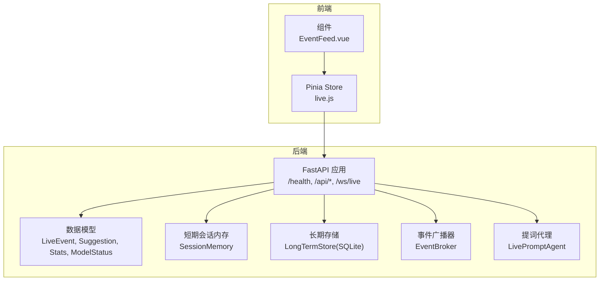
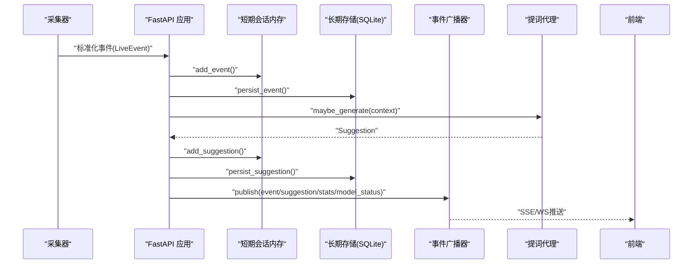
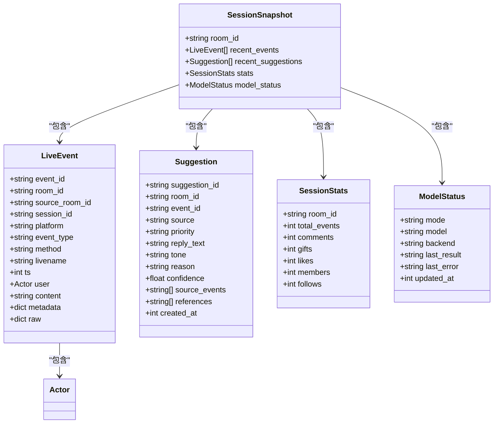

# API参考文档

<cite>
**本文档引用的文件**
- [backend/app.py](file://backend/app.py)
- [backend/config.py](file://backend/config.py)
- [backend/schemas/live.py](file://backend/schemas/live.py)
- [backend/memory/session_memory.py](file://backend/memory/session_memory.py)
- [backend/memory/long_term.py](file://backend/memory/long_term.py)
- [backend/services/broker.py](file://backend/services/broker.py)
- [backend/services/agent.py](file://backend/services/agent.py)
- [frontend/src/stores/live.js](file://frontend/src/stores/live.js)
- [frontend/src/components/EventFeed.vue](file://frontend/src/components/EventFeed.vue)
- [README.md](file://README.md)
- [USAGE.md](file://USAGE.md)
</cite>

## 目录
1. [简介](#简介)
2. [项目结构](#项目结构)
3. [核心组件](#核心组件)
4. [架构总览](#架构总览)
5. [详细API规范](#详细api规范)
6. [依赖关系分析](#依赖关系分析)
7. [性能考虑](#性能考虑)
8. [故障排除指南](#故障排除指南)
9. [结论](#结论)

## 简介
本项目是一个面向抖音直播场景的实时提词系统，后端基于FastAPI提供REST API、Server-Sent Events（SSE）和WebSocket接口，前端基于Vue 3实时消费事件流并展示提词建议。本文档详细说明所有公共接口，包括健康检查、初始化快照、房间切换、事件注入与流式推送、用户管理等，并提供请求/响应示例、认证方式、错误处理策略以及客户端实现指南。

## 项目结构
后端采用分层设计：
- 应用入口与路由：FastAPI应用，定义REST、SSE、WebSocket接口
- 数据模型：统一的直播事件、建议、统计、模型状态等数据结构
- 内存层：短期会话内存（支持Redis退化）
- 长期存储：SQLite持久化，含事件、建议、用户画像、会话、笔记等表
- 广播器：事件发布/订阅，供SSE与WebSocket使用
- 代理器：提词建议生成器，支持在线模型与本地规则回退

**图表来源**
- [backend/app.py:104-220](file://backend/app.py#L104-L220)
- [backend/schemas/live.py:29-95](file://backend/schemas/live.py#L29-L95)
- [backend/memory/session_memory.py:17-113](file://backend/memory/session_memory.py#L17-L113)
- [backend/memory/long_term.py:36-750](file://backend/memory/long_term.py#L36-L750)
- [backend/services/broker.py:10-40](file://backend/services/broker.py#L10-L40)
- [backend/services/agent.py:23-393](file://backend/services/agent.py#L23-L393)
- [frontend/src/stores/live.js:70-310](file://frontend/src/stores/live.js#L70-L310)

**章节来源**
- [backend/app.py:104-220](file://backend/app.py#L104-L220)
- [README.md:208-275](file://README.md#L208-L275)

## 核心组件
- 健康检查接口：返回服务状态、当前房间号与活动会话
- 初始化接口：获取前端启动快照（最近事件、建议、统计、模型状态）
- 房间切换接口：切换采集房间并返回新房间快照
- 事件注入接口：手动注入标准化直播事件
- 事件流接口：SSE实时推送事件、建议、统计、模型状态
- WebSocket接口：实时推送快照与增量事件
- 用户管理接口：用户详情查询、用户笔记增删改查、会话查询与当前会话
- 配置中心：环境变量驱动的运行配置

**章节来源**
- [backend/app.py:104-220](file://backend/app.py#L104-L220)
- [backend/config.py:39-94](file://backend/config.py#L39-L94)
- [backend/schemas/live.py:29-95](file://backend/schemas/live.py#L29-L95)

## 架构总览
后端处理流程：
1. 采集器从本地WebSocket接收直播事件
2. 标准化为统一LiveEvent
3. 写入短期会话内存与长期存储
4. 向量检索相似历史，构建上下文
5. 生成提词建议，写入存储并广播
6. SSE/WS向前端推送事件、建议、统计、模型状态

**图表来源**
- [backend/app.py:61-78](file://backend/app.py#L61-L78)
- [backend/memory/session_memory.py:42-64](file://backend/memory/session_memory.py#L42-L64)
- [backend/memory/long_term.py:420-454](file://backend/memory/long_term.py#L420-L454)
- [backend/services/broker.py:28-40](file://backend/services/broker.py#L28-L40)
- [backend/services/agent.py:73-94](file://backend/services/agent.py#L73-L94)

## 详细API规范

### 健康检查接口
- 方法：GET
- URL：/health
- 功能：返回服务健康状态、当前房间号与活动会话
- 请求参数：无
- 成功响应：包含状态、房间号、活动会话信息
- 错误处理：无特定错误码，健康检查不抛异常
- 示例：
  - 请求：GET /health
  - 响应：{"status":"ok","room_id":"32137571630","active_session":{"session_id":"...","status":"active",...}}

**章节来源**
- [backend/app.py:104-107](file://backend/app.py#L104-L107)
- [README.md:210-217](file://README.md#L210-L217)

### 初始化接口
- 方法：GET
- URL：/api/bootstrap
- 功能：获取前端启动快照，包含最近事件、最近建议、统计、模型状态
- 查询参数：
  - room_id：目标房间号（可选，未提供时使用配置中的默认房间）
- 成功响应：SessionSnapshot对象
- 错误处理：无特定错误码
- 示例：
  - 请求：GET /api/bootstrap?room_id=32137571630
  - 响应：包含recent_events、recent_suggestions、stats、model_status

**章节来源**
- [backend/app.py:109-113](file://backend/app.py#L109-L113)
- [backend/app.py:49-58](file://backend/app.py#L49-L58)
- [README.md:218-230](file://README.md#L218-L230)

### 房间切换接口
- 方法：POST
- URL：/api/room
- 功能：切换当前采集房间，关闭旧会话并开启新房间的会话
- 请求头：Content-Type: application/json
- 请求体：RoomSwitchRequest
  - room_id：目标房间号（必填）
- 成功响应：新的SessionSnapshot
- 错误处理：
  - 400：room_id为空
  - 200：成功切换并返回新快照
- 示例：
  - 请求：POST /api/room
  - 请求体：{"room_id":"32137571630"}
  - 响应：SessionSnapshot

**章节来源**
- [backend/app.py:115-127](file://backend/app.py#L115-L127)
- [backend/app.py:32-34](file://backend/app.py#L32-L34)
- [README.md:231-245](file://README.md#L231-L245)

### 事件注入接口
- 方法：POST
- URL：/api/events
- 功能：手动注入标准化直播事件，用于联调或替换采集端
- 请求头：Content-Type: application/json
- 请求体：LiveEvent（见数据模型）
- 成功响应：包含事件接受状态、事件ID、会话ID及建议（如有）
- 错误处理：无特定错误码
- 示例：
  - 请求：POST /api/events
  - 请求体：LiveEvent对象
  - 响应：{"accepted":true,"event_id":"...","session_id":"...","suggestion":{...}}

**章节来源**
- [backend/app.py:129-133](file://backend/app.py#L129-L133)
- [backend/app.py:61-78](file://backend/app.py#L61-L78)
- [README.md:246-254](file://README.md#L246-L254)

### SSE事件流接口
- 方法：GET
- URL：/api/events/stream
- 功能：SSE实时推送事件、建议、统计、模型状态
- 查询参数：
  - room_id：目标房间号（可选，未提供时推送所有房间）
- 事件类型：
  - event：LiveEvent
  - suggestion：Suggestion
  - stats：SessionStats
  - model_status：ModelStatus
- 连接特性：心跳重连（retry: 1500），按房间过滤
- 示例：
  - 请求：GET /api/events/stream?room_id=32137571630
  - 响应：SSE事件流，事件类型分别为event/suggestion/stats/model_status

**章节来源**
- [backend/app.py:187-206](file://backend/app.py#L187-L206)
- [README.md:255-267](file://README.md#L255-L267)

### WebSocket实时接口
- 方法：GET
- URL：/ws/live
- 功能：WebSocket实时推送快照与增量事件
- 连接流程：
  1. 建立连接后立即发送bootstrap事件（SessionSnapshot）
  2. 持续推送event/suggestion/stats/model_status事件
- 断开处理：捕获WebSocketDisconnect并清理订阅
- 示例：
  - 连接：GET /ws/live
  - 首次消息：{"type":"bootstrap","data":SessionSnapshot}
  - 后续消息：{"type":"event","data":LiveEvent} 等

**章节来源**
- [backend/app.py:209-220](file://backend/app.py#L209-L220)
- [README.md:268-275](file://README.md#L268-L275)

### 用户详情查询接口
- 方法：GET
- URL：/api/viewer
- 功能：查询用户详情（基于viewer_id或nickname）
- 查询参数：
  - room_id：房间号（可选）
  - viewer_id：用户标识（可选）
  - nickname：用户昵称（可选）
- 成功响应：用户详情（包含最近评论、加入、礼物事件、礼物历史、近期会话、笔记等）
- 错误处理：
  - 404：未找到用户
- 示例：
  - 请求：GET /api/viewer?room_id=32137571630&viewer_id=...
  - 响应：用户详情对象

**章节来源**
- [backend/app.py:135-142](file://backend/app.py#L135-L142)
- [backend/memory/long_term.py:736-749](file://backend/memory/long_term.py#L736-L749)
- [README.md:276-297](file://README.md#L276-L297)

### 用户笔记管理接口
- 查询笔记列表
  - 方法：GET
  - URL：/api/viewer/notes
  - 查询参数：
    - room_id：房间号（可选）
    - viewer_id：用户标识（必填）
    - limit：数量限制（默认20）
  - 成功响应：{"items":[...]}
  - 错误处理：400（缺少viewer_id）

- 新增/更新笔记
  - 方法：POST
  - URL：/api/viewer/notes
  - 请求头：Content-Type: application/json
  - 请求体：ViewerNoteUpsertRequest
    - room_id：房间号（必填）
    - viewer_id：用户标识（必填）
    - content：笔记内容（必填）
    - author：作者（可选，默认"主播"）
    - is_pinned：是否置顶（可选）
    - note_id：笔记ID（可选，为空则新增）
  - 成功响应：笔记记录
  - 错误处理：400（缺少必要字段）

- 删除笔记
  - 方法：DELETE
  - URL：/api/viewer/notes/{note_id}
  - 成功响应：{"deleted":true,"note_id":"..."}
  - 错误处理：404（笔记不存在）

**章节来源**
- [backend/app.py:144-171](file://backend/app.py#L144-L171)
- [backend/app.py:36-42](file://backend/app.py#L36-L42)
- [backend/memory/long_term.py:620-661](file://backend/memory/long_term.py#L620-L661)

### 会话管理接口
- 查询会话列表
  - 方法：GET
  - URL：/api/sessions
  - 查询参数：
    - room_id：房间号（可选）
    - status：会话状态（可选）
    - limit：数量限制（默认20，最大200）
  - 成功响应：{"items":[...]}

- 查询当前会话
  - 方法：GET
  - URL：/api/sessions/current
  - 查询参数：
    - room_id：房间号（可选）
  - 成功响应：当前活动会话或空对象

**章节来源**
- [backend/app.py:174-185](file://backend/app.py#L174-L185)
- [backend/memory/long_term.py:663-698](file://backend/memory/long_term.py#L663-L698)

## 依赖关系分析

**图表来源**
- [backend/schemas/live.py:29-95](file://backend/schemas/live.py#L29-L95)

**章节来源**
- [backend/schemas/live.py:29-95](file://backend/schemas/live.py#L29-L95)

## 性能考虑
- SSE连接池与订阅管理：广播器维护订阅队列，避免阻塞；前端使用EventSource自动重连
- Redis退化：短期会话内存支持Redis，未安装时自动退化为进程内内存，保证基本可用
- 事件窗口限制：短期内存限制最近事件与建议数量，避免内存膨胀
- 数据库索引：SQLite建立多处索引，优化查询性能
- 模型回退：在线模型失败时自动回退本地规则，确保稳定性
- 前端缓存：前端Pinia store缓存最近事件与建议，减少重复渲染

[本节为通用性能建议，无需具体文件分析]

## 故障排除指南
- 健康检查失败
  - 检查后端服务是否启动
  - 确认配置中的房间号与采集器一致
- SSE连接断开
  - 查看前端EventSource错误回调，自动重连
  - 检查网络与防火墙设置
- WebSocket连接异常
  - 捕获WebSocketDisconnect并清理订阅
  - 检查后端广播器订阅状态
- 用户查询404
  - 确认viewer_id或nickname是否正确
  - 检查长期存储中是否存在该用户数据
- 笔记操作400/404
  - 确认请求体字段完整性
  - 检查note_id是否存在

**章节来源**
- [backend/app.py:135-142](file://backend/app.py#L135-L142)
- [backend/app.py:167-171](file://backend/app.py#L167-L171)
- [frontend/src/stores/live.js:186-205](file://frontend/src/stores/live.js#L186-L205)

## 结论
本API参考文档覆盖了后端提供的全部公共接口，包括REST、SSE与WebSocket，满足直播场景下的实时事件处理、提词建议生成与前端展示需求。通过清晰的错误处理策略、可选的Redis与Chroma增强、以及完善的用户管理与会话管理能力，系统在保证稳定性的同时提供了良好的扩展性。建议在生产环境中结合监控与日志，持续优化模型参数与前端交互体验。