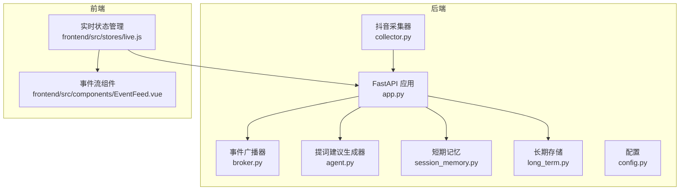
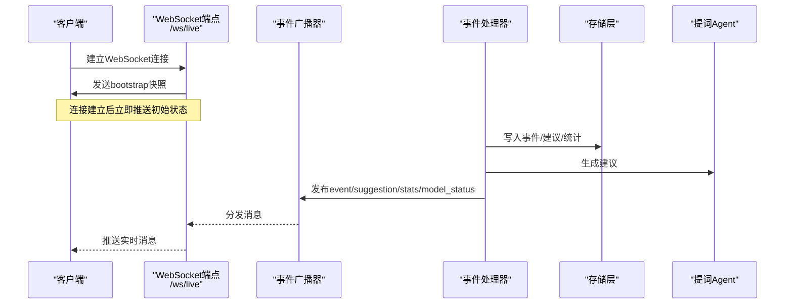
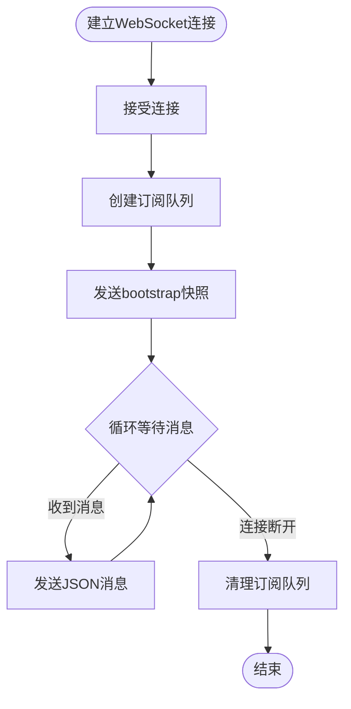
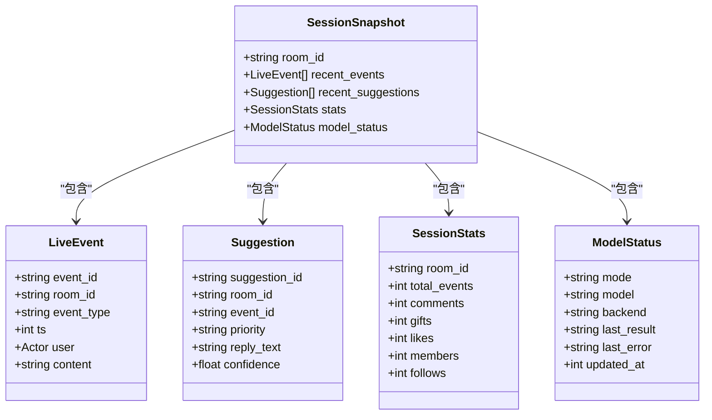
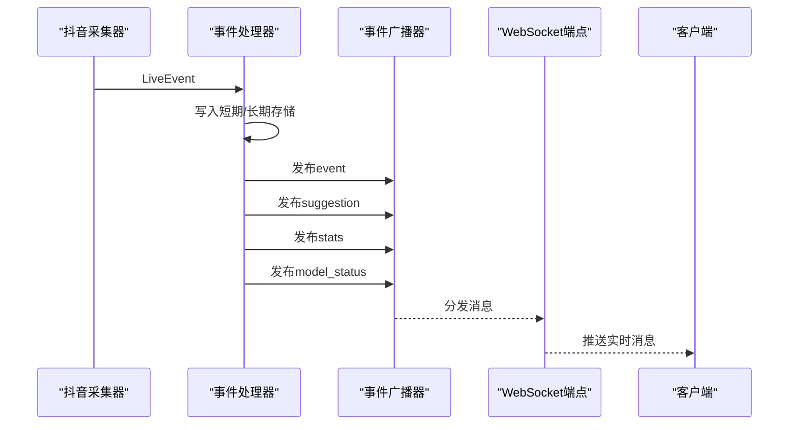
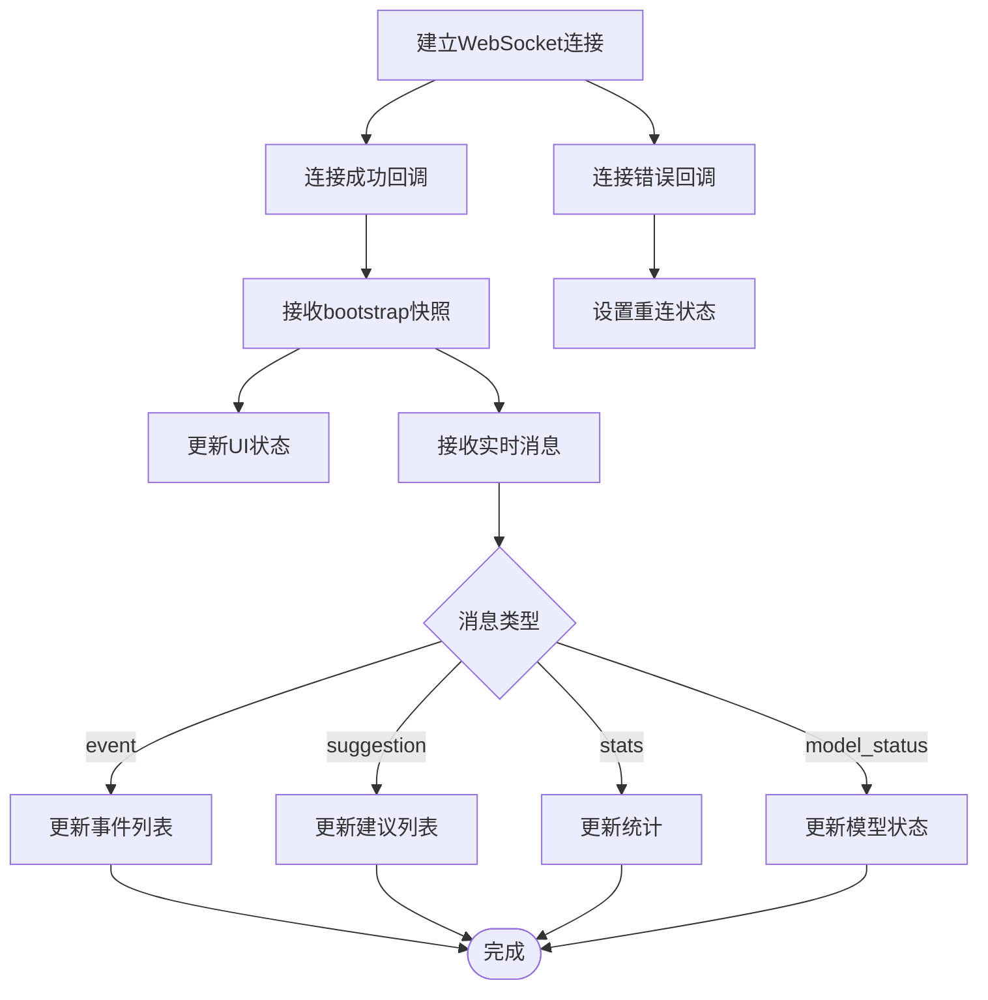
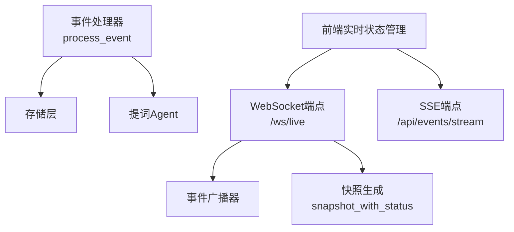

# WebSocket实时接口

<cite>
**本文档引用的文件**
- [backend/app.py](file://backend/app.py)
- [backend/schemas/live.py](file://backend/schemas/live.py)
- [backend/services/broker.py](file://backend/services/broker.py)
- [backend/services/collector.py](file://backend/services/collector.py)
- [backend/services/agent.py](file://backend/services/agent.py)
- [backend/memory/session_memory.py](file://backend/memory/session_memory.py)
- [backend/memory/long_term.py](file://backend/memory/long_term.py)
- [backend/config.py](file://backend/config.py)
- [frontend/src/stores/live.js](file://frontend/src/stores/live.js)
- [frontend/src/components/EventFeed.vue](file://frontend/src/components/EventFeed.vue)
- [README.md](file://README.md)
</cite>

## 目录
1. [简介](#简介)
2. [项目结构](#项目结构)
3. [核心组件](#核心组件)
4. [架构总览](#架构总览)
5. [详细组件分析](#详细组件分析)
6. [依赖关系分析](#依赖关系分析)
7. [性能考虑](#性能考虑)
8. [故障排除指南](#故障排除指南)
9. [结论](#结论)
10. [附录](#附录)

## 简介
本文件详细说明 `/ws/live` WebSocket 实时接口的实现，包括连接建立、消息格式、实时数据推送等功能。重点解释 bootstrap 消息的结构和作用，以及如何在连接建立时获取初始状态。同时说明事件推送的格式，包括 event、suggestion、stats、model_status 等不同类型消息的处理方式。最后提供完整的客户端连接示例，涵盖错误处理、断线重连、消息订阅等实现细节，并对比 WebSocket 与 SSE 的区别及适用场景。

## 项目结构
后端采用 FastAPI 提供 REST、SSE 和 WebSocket 接口，前端使用 Vue 3 + Pinia 实现实时交互。WebSocket 与 SSE 共享同一事件广播器，确保两种推送方式的一致性。

**图表来源**
- [backend/app.py:209-220](file://backend/app.py#L209-L220)
- [backend/services/broker.py:10-40](file://backend/services/broker.py#L10-L40)
- [backend/services/collector.py:38-284](file://backend/services/collector.py#L38-L284)
- [backend/services/agent.py:23-393](file://backend/services/agent.py#L23-L393)
- [backend/memory/session_memory.py:17-113](file://backend/memory/session_memory.py#L17-L113)
- [backend/memory/long_term.py:36-750](file://backend/memory/long_term.py#L36-L750)
- [backend/config.py:39-94](file://backend/config.py#L39-L94)
- [frontend/src/stores/live.js:70-310](file://frontend/src/stores/live.js#L70-L310)
- [frontend/src/components/EventFeed.vue:1-183](file://frontend/src/components/EventFeed.vue#L1-L183)

**章节来源**
- [backend/app.py:1-220](file://backend/app.py#L1-L220)
- [frontend/src/stores/live.js:1-310](file://frontend/src/stores/live.js#L1-L310)

## 核心组件
- WebSocket端点：`/ws/live`，连接后立即发送 bootstrap 快照，随后持续推送实时事件。
- 事件广播器：`EventBroker`，维护订阅队列并广播消息给所有订阅者（SSE/WS）。
- 事件处理器：`process_event`，处理 LiveEvent，生成建议、统计和模型状态，并通过广播器发布。
- 数据模型：`LiveEvent`、`Suggestion`、`SessionStats`、`ModelStatus`、`SessionSnapshot`。
- 配置：`Settings`，包含房间号、采集器参数、模型服务配置等。

**章节来源**
- [backend/app.py:45-78](file://backend/app.py#L45-L78)
- [backend/schemas/live.py:8-95](file://backend/schemas/live.py#L8-L95)
- [backend/services/broker.py:10-40](file://backend/services/broker.py#L10-L40)
- [backend/config.py:39-94](file://backend/config.py#L39-L94)

## 架构总览
WebSocket 与 SSE 共用相同的事件源，通过 `EventBroker` 广播消息。WebSocket 在连接建立时发送一次 bootstrap 快照，随后按类型推送 event、suggestion、stats、model_status。

**图表来源**
- [backend/app.py:209-220](file://backend/app.py#L209-L220)
- [backend/app.py:61-78](file://backend/app.py#L61-L78)
- [backend/services/broker.py:28-40](file://backend/services/broker.py#L28-L40)

## 详细组件分析

### WebSocket端点 `/ws/live`
- 连接建立：接受 WebSocket 连接，创建订阅队列，发送 bootstrap 快照。
- 消息推送：从订阅队列获取消息并发送给客户端，直到连接断开。
- 断线处理：捕获断开异常，清理订阅队列。

**图表来源**
- [backend/app.py:209-220](file://backend/app.py#L209-L220)

**章节来源**
- [backend/app.py:209-220](file://backend/app.py#L209-L220)

### bootstrap消息结构与作用
- 结构：包含 room_id、recent_events、recent_suggestions、stats、model_status。
- 作用：在连接建立时提供初始状态，确保前端无需额外请求即可显示完整界面。
- 来源：`snapshot_with_status` 组合短期记忆和长期存储中的数据，并附加当前模型状态。

**图表来源**
- [backend/schemas/live.py:87-95](file://backend/schemas/live.py#L87-L95)
- [backend/schemas/live.py:29-44](file://backend/schemas/live.py#L29-L44)
- [backend/schemas/live.py:47-62](file://backend/schemas/live.py#L47-L62)
- [backend/schemas/live.py:64-74](file://backend/schemas/live.py#L64-L74)
- [backend/schemas/live.py:76-84](file://backend/schemas/live.py#L76-L84)

**章节来源**
- [backend/app.py:49-58](file://backend/app.py#L49-L58)
- [backend/schemas/live.py:87-95](file://backend/schemas/live.py#L87-L95)

### 事件推送格式与处理
- event：标准化后的直播事件，包含用户身份、事件类型、时间戳、内容等。
- suggestion：基于事件生成的提词建议，包含优先级、回复文本、语气、置信度等。
- stats：基于短期窗口生成的轻量统计，包含各类事件计数。
- model_status：当前模型后端状态，包含模式、模型名、后端地址、最后结果、错误信息等。

**图表来源**
- [backend/services/collector.py:225-284](file://backend/services/collector.py#L225-L284)
- [backend/app.py:61-78](file://backend/app.py#L61-L78)
- [backend/services/broker.py:28-40](file://backend/services/broker.py#L28-L40)

**章节来源**
- [backend/app.py:61-78](file://backend/app.py#L61-L78)
- [backend/schemas/live.py:29-62](file://backend/schemas/live.py#L29-L62)

### 客户端连接示例与实现细节
- 连接建立：使用浏览器原生 WebSocket API 连接到 `/ws/live`。
- 错误处理：监听连接错误，设置重连状态，必要时降级到 SSE。
- 断线重连：检测连接断开，延迟重试，恢复订阅。
- 消息订阅：根据消息类型更新前端状态（事件、建议、统计、模型状态）。

**图表来源**
- [frontend/src/stores/live.js:173-205](file://frontend/src/stores/live.js#L173-L205)

**章节来源**
- [frontend/src/stores/live.js:173-205](file://frontend/src/stores/live.js#L173-L205)

### WebSocket与SSE的区别与适用场景
- WebSocket：全双工通信，低延迟，适合需要双向交互和实时性的场景。
- SSE：单向服务器推送，简单易用，适合只需要服务器向客户端推送的场景。
- 本项目中，WebSocket 与 SSE 共用同一事件源，前端可根据网络状况和需求选择合适的推送方式。

**章节来源**
- [README.md:255-275](file://README.md#L255-L275)
- [backend/app.py:187-206](file://backend/app.py#L187-L206)

## 依赖关系分析
- WebSocket端点依赖事件广播器进行消息分发。
- 事件处理器依赖短期记忆、长期存储、向量检索和提词Agent。
- 前端实时状态管理依赖后端 REST、SSE 和 WebSocket 接口。

**图表来源**
- [backend/app.py:209-220](file://backend/app.py#L209-L220)
- [backend/app.py:49-58](file://backend/app.py#L49-L58)
- [backend/app.py:61-78](file://backend/app.py#L61-L78)
- [frontend/src/stores/live.js:158-205](file://frontend/src/stores/live.js#L158-L205)

**章节来源**
- [backend/app.py:1-220](file://backend/app.py#L1-L220)
- [frontend/src/stores/live.js:1-310](file://frontend/src/stores/live.js#L1-L310)

## 性能考虑
- 订阅队列容量：事件广播器对满载队列进行清理，避免内存泄漏。
- 短期记忆：支持 Redis 或进程内内存，Redis 模式下可提升并发性能。
- 统计计算：基于短期窗口生成轻量统计，减少数据库查询压力。
- 建议生成：优先使用在线模型，失败时回退到本地规则，平衡性能与质量。

## 故障排除指南
- 连接失败：检查后端日志，确认 WebSocket 端点可用性和网络连通性。
- 消息缺失：确认事件广播器订阅数量和消息发布频率，检查队列满载情况。
- 状态不同步：确认 bootstrap 快照是否正确下发，前端是否正确解析和应用。
- 模型异常：检查模型服务配置和网络连通性，查看模型状态更新日志。

**章节来源**
- [backend/services/broker.py:31-40](file://backend/services/broker.py#L31-L40)
- [backend/services/agent.py:44-54](file://backend/services/agent.py#L44-L54)

## 结论
WebSocket 实时接口通过 bootstrap 快照和增量推送的方式，为前端提供了完整的初始状态和持续的实时更新。与 SSE 共享的事件源确保了两种推送方式的一致性，前端可根据场景选择合适的推送方式。通过合理的数据模型设计和性能优化，系统能够在高并发场景下保持稳定的实时体验。

## 附录
- 客户端连接示例：使用浏览器原生 WebSocket API 连接到 `/ws/live`，监听连接成功、错误和消息事件，根据消息类型更新 UI。
- 错误处理：在连接错误时设置重连状态，必要时降级到 SSE；在连接断开时清理订阅队列。
- 断线重连：检测连接断开，延迟重试，恢复订阅；在重新连接后再次接收 bootstrap 快照。

**章节来源**
- [frontend/src/stores/live.js:173-205](file://frontend/src/stores/live.js#L173-L205)