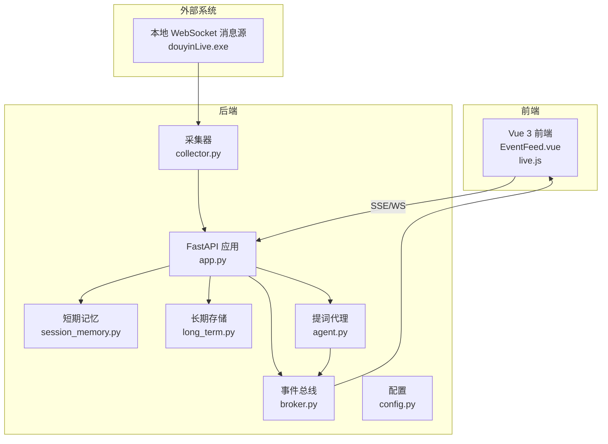
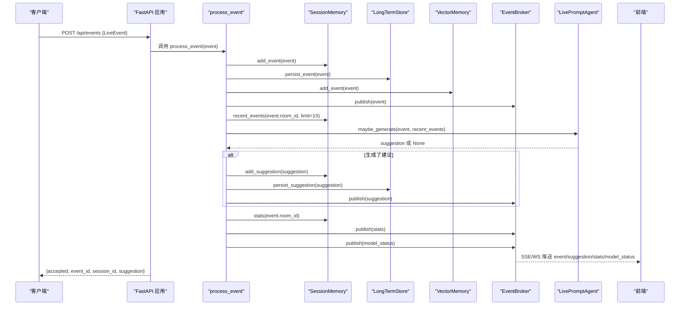
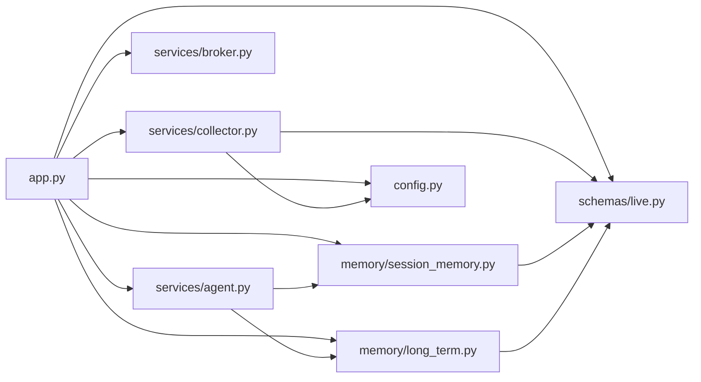

# 事件处理接口

<cite>
**本文档引用的文件**
- [app.py](file://backend/app.py)
- [live.py](file://backend/schemas/live.py)
- [broker.py](file://backend/services/broker.py)
- [collector.py](file://backend/services/collector.py)
- [agent.py](file://backend/services/agent.py)
- [session_memory.py](file://backend/memory/session_memory.py)
- [long_term.py](file://backend/memory/long_term.py)
- [config.py](file://backend/config.py)
- [README.md](file://README.md)
- [live.js](file://frontend/src/stores/live.js)
- [EventFeed.vue](file://frontend/src/components/EventFeed.vue)
</cite>

## 目录
1. [简介](#简介)
2. [项目结构](#项目结构)
3. [核心组件](#核心组件)
4. [架构总览](#架构总览)
5. [详细组件分析](#详细组件分析)
6. [依赖关系分析](#依赖关系分析)
7. [性能考虑](#性能考虑)
8. [故障排除指南](#故障排除指南)
9. [结论](#结论)
10. [附录](#附录)

## 简介
本文档详细说明了直播事件处理接口，特别是 POST /api/events 端点的功能与实现。该接口用于注入和处理直播事件，涵盖从接收事件到存储、建议生成、实时推送的完整流程。文档还解释了 LiveEvent 请求体的数据结构、事件处理流程中的各个字段含义（如 accepted、event_id、session_id、suggestion），并提供了多种直播事件类型的示例数据和使用场景。

## 项目结构
后端采用 FastAPI 提供 REST、SSE 和 WebSocket 接口，核心处理流程围绕事件收集、短期记忆、长期存储、向量检索和建议生成展开。前端通过 SSE/WS 实时接收事件、建议、统计和模型状态。

**图表来源**
- [app.py:94-220](file://backend/app.py#L94-L220)
- [collector.py:38-284](file://backend/services/collector.py#L38-L284)
- [broker.py:10-40](file://backend/services/broker.py#L10-L40)
- [agent.py:23-393](file://backend/services/agent.py#L23-L393)
- [session_memory.py:17-113](file://backend/memory/session_memory.py#L17-L113)
- [long_term.py:36-750](file://backend/memory/long_term.py#L36-L750)
- [config.py:39-94](file://backend/config.py#L39-L94)

**章节来源**
- [README.md:21-349](file://README.md#L21-L349)
- [app.py:94-220](file://backend/app.py#L94-L220)

## 核心组件
- FastAPI 应用：提供健康检查、房间切换、事件注入、SSE/WS 实时流等接口。
- 事件收集器：连接本地 WebSocket 消息源，将原始消息标准化为 LiveEvent 并提交到事件循环。
- 事件总线：负责将事件广播给 SSE/WS 订阅者。
- 提词代理：根据事件类型生成建议，支持在线模型和启发式规则两种模式。
- 短期记忆：优先使用 Redis，否则使用进程内内存，保存最近事件和建议。
- 长期存储：基于 SQLite，持久化事件、建议、用户画像、会话等数据。
- 配置：读取环境变量，解析 LLM 模式、模型名、超时等参数。

**章节来源**
- [app.py:61-78](file://backend/app.py#L61-L78)
- [collector.py:38-284](file://backend/services/collector.py#L38-L284)
- [broker.py:10-40](file://backend/services/broker.py#L10-L40)
- [agent.py:23-393](file://backend/services/agent.py#L23-L393)
- [session_memory.py:17-113](file://backend/memory/session_memory.py#L17-L113)
- [long_term.py:36-750](file://backend/memory/long_term.py#L36-L750)
- [config.py:39-94](file://backend/config.py#L39-L94)

## 架构总览
POST /api/events 是手动注入事件的主要入口，其处理流程如下：

**图表来源**
- [app.py:129-133](file://backend/app.py#L129-L133)
- [app.py:61-78](file://backend/app.py#L61-L78)
- [broker.py:28-40](file://backend/services/broker.py#L28-L40)
- [agent.py:73-94](file://backend/services/agent.py#L73-L94)
- [session_memory.py:42-102](file://backend/memory/session_memory.py#L42-L102)
- [long_term.py:420-454](file://backend/memory/long_term.py#L420-L454)

## 详细组件分析

### POST /api/events 端点
- 功能：接收标准化的 LiveEvent，触发完整的事件处理流程，返回处理结果。
- 请求体：LiveEvent 对象（见下一节）。
- 返回值：
  - accepted：布尔值，表示事件是否被接受处理。
  - event_id：事件唯一标识符。
  - session_id：事件所属会话的唯一标识符。
  - suggestion：建议对象（可能为 null，当未生成建议时）。

**章节来源**
- [app.py:129-133](file://backend/app.py#L129-L133)

### LiveEvent 请求体数据结构
LiveEvent 是统一的直播事件模型，字段定义如下：

- event_id：字符串，事件唯一标识符。
- room_id：字符串，房间标识符。
- source_room_id：字符串，事件来源房间标识符（默认为空）。
- session_id：字符串，会话标识符（默认为空）。
- platform：字符串，平台标识（默认 "douyin"）。
- event_type：字符串，事件类型（如 comment/gift/follow 等）。
- method：字符串，原始方法名（默认 "unknown"）。
- livename：字符串，直播间名称（默认 "未知直播间"）。
- ts：整数，时间戳（毫秒）。
- user：Actor 对象，用户身份信息。
- content：字符串，事件内容。
- metadata：字典，附加元数据。
- raw：字典，原始消息。

Actor 字段：
- id：字符串，用户 ID。
- short_id：字符串，短 ID。
- sec_uid：字符串，加密用户 ID。
- nickname：字符串，用户昵称。
- viewer_id：属性，根据 id/sec_uid/short_id/nickname 生成的唯一标识。

**章节来源**
- [live.py:29-44](file://backend/schemas/live.py#L29-L44)
- [live.py:8-27](file://backend/schemas/live.py#L8-L27)

### 事件处理流程详解
- 接收事件：FastAPI 调用 process_event(event)。
- 写入短期记忆：SessionMemory.add_event(event)。
- 写入长期存储：LongTermStore.persist_event(event)，并确保/分配会话 ID。
- 写入向量存储：VectorMemory.add_event(event)。
- 广播事件：EventBroker.publish({"type": "event", "data": event})。
- 生成建议：根据最近事件窗口调用 LivePromptAgent.maybe_generate(event, recent_events)。
- 写入建议：若生成建议，则写入短期/长期存储并广播。
- 统计与状态：计算房间统计并广播 stats/model_status。

**章节来源**
- [app.py:61-78](file://backend/app.py#L61-L78)
- [session_memory.py:42-102](file://backend/memory/session_memory.py#L42-L102)
- [long_term.py:420-454](file://backend/memory/long_term.py#L420-L454)
- [agent.py:73-94](file://backend/services/agent.py#L73-L94)
- [broker.py:28-40](file://backend/services/broker.py#L28-L40)

### 建议生成逻辑
- 触发条件：仅对 comment、gift、follow 事件生成建议。
- 上下文构建：最近事件窗口、相似历史片段、用户画像。
- 生成策略：
  - 优先调用 OpenAI 兼容接口（可配置模式）。
  - 失败时自动回退到本地启发式规则。
- 建议字段：suggestion_id、room_id、event_id、source、priority、reply_text、tone、reason、confidence、source_events、references、created_at。

**章节来源**
- [agent.py:73-94](file://backend/services/agent.py#L73-L94)
- [agent.py:96-182](file://backend/services/agent.py#L96-L182)
- [agent.py:183-393](file://backend/services/agent.py#L183-L393)
- [live.py:47-62](file://backend/schemas/live.py#L47-L62)

### 实时推送机制
- SSE：/api/events/stream，按事件类型推送 event/suggestion/stats/model_status。
- WebSocket：/ws/live，连接后先发送 bootstrap 快照，随后持续推送实时事件。
- 订阅管理：EventBroker 维护订阅队列，发布时广播给所有订阅者。

**章节来源**
- [app.py:187-206](file://backend/app.py#L187-L206)
- [app.py:209-220](file://backend/app.py#L209-L220)
- [broker.py:16-40](file://backend/services/broker.py#L16-L40)

### 各类直播事件示例与使用场景
- 弹幕事件（comment）
  - 场景：观众提问、互动评论。
  - 建议：根据评论关键词生成回复建议，如价格、购买路径、健身话题等。
  - 示例字段：event_type="comment"，content 包含具体评论内容。
- 礼物事件（gift）
  - 场景：观众赠送礼物。
  - 建议：感谢型回复，强调互动与支持。
  - 示例字段：event_type="gift"，metadata.gift_name/gift_count 等。
- 关注事件（follow）
  - 场景：新观众关注直播间。
  - 建议：欢迎型回复，引导后续互动。
  - 示例字段：event_type="follow"。
- 成员进入（member）
  - 场景：观众进入直播间。
  - 建议：欢迎型回复，营造氛围。
  - 示例字段：event_type="member"。
- 点赞（like）
  - 场景：观众点赞。
  - 建议：根据上下文生成自然接话。
  - 示例字段：event_type="like"。

**章节来源**
- [README.md:276-307](file://README.md#L276-L307)
- [collector.py:22-28](file://backend/services/collector.py#L22-L28)
- [agent.py:121-141](file://backend/services/agent.py#L121-L141)

## 依赖关系分析
- 组件耦合：
  - app.py 依赖 schemas/live.py、services/*、memory/*、config.py。
  - services/collector.py 依赖 config.py 和 schemas/live.py。
  - services/agent.py 依赖 memory/*。
  - memory/session_memory.py 依赖 schemas/live.py，可选依赖 redis。
  - memory/long_term.py 依赖 schemas/live.py，使用 sqlite3。
- 外部依赖：
  - websocket-client：用于连接本地消息源。
  - fastapi/uvicorn：提供 Web 服务。
  - redis/chromadb：可选增强短期记忆与向量检索。

**图表来源**
- [app.py:17-29](file://backend/app.py#L17-L29)
- [collector.py:16-17](file://backend/services/collector.py#L16-L17)
- [agent.py:24-29](file://backend/services/agent.py#L24-L29)
- [session_memory.py:9](file://backend/memory/session_memory.py#L9)
- [long_term.py:8](file://backend/memory/long_term.py#L8)

**章节来源**
- [app.py:17-29](file://backend/app.py#L17-L29)
- [collector.py:16-17](file://backend/services/collector.py#L16-L17)
- [agent.py:24-29](file://backend/services/agent.py#L24-L29)
- [session_memory.py:9](file://backend/memory/session_memory.py#L9)
- [long_term.py:8](file://backend/memory/long_term.py#L8)

## 性能考虑
- 短期记忆：SessionMemory 支持 Redis，可显著提升并发读写性能；若无 Redis，使用进程内 deque，容量有限。
- 长期存储：SQLite 写入采用批量更新与索引优化，建议合理设置索引以提升查询性能。
- 建议生成：OpenAI 兼容接口受网络与超时限制，建议配置合理的超时与重试策略。
- 实时推送：EventBroker 使用 asyncio.Queue，注意队列满载时的清理与去订阅。

[本节为通用性能讨论，无需特定文件来源]

## 故障排除指南
- 事件未显示：
  - 检查 SSE/WS 连接状态（前端 live.js 中的连接状态）。
  - 确认房间过滤设置，确保 event_type 未被隐藏。
- 建议未生成：
  - 确认事件类型为 comment/gift/follow。
  - 检查 LLM 模式与 API Key 配置。
- 事件重复或丢失：
  - 检查 Redis 配置与连接状态。
  - 查看 SQLite 表结构与索引是否正确。
- 房间切换异常：
  - 确认 /api/room 接口返回的快照是否正确。
  - 检查本地消息源连接状态。

**章节来源**
- [live.js:173-205](file://frontend/src/stores/live.js#L173-L205)
- [config.py:56-61](file://backend/config.py#L56-L61)
- [session_memory.py:11-31](file://backend/memory/session_memory.py#L11-L31)
- [long_term.py:50-154](file://backend/memory/long_term.py#L50-L154)

## 结论
POST /api/events 端点提供了灵活的事件注入能力，结合短期记忆、长期存储、向量检索与建议生成，实现了从事件接收、处理到实时推送的完整闭环。通过标准化的 LiveEvent 结构与可配置的建议策略，系统能够适配多种直播场景并提供高质量的实时提词支持。

[本节为总结性内容，无需特定文件来源]

## 附录

### 返回值字段说明
- accepted：布尔值，表示事件是否被成功接受处理。
- event_id：事件唯一标识符，用于关联建议与事件。
- session_id：会话唯一标识符，用于区分不同直播会话。
- suggestion：建议对象，包含建议文本、语气、置信度等字段；可能为 null。

**章节来源**
- [app.py:129-133](file://backend/app.py#L129-L133)

### 前端集成要点
- SSE/WS：前端通过 EventSource 与 /api/events/stream 或 /ws/live 接收实时事件。
- 过滤与主题：前端支持事件类型过滤、主题切换与本地持久化。
- 快照：首次连接时通过 /api/bootstrap 获取初始状态。

**章节来源**
- [live.js:173-205](file://frontend/src/stores/live.js#L173-L205)
- [live.js:158-163](file://frontend/src/stores/live.js#L158-L163)
- [EventFeed.vue:1-183](file://frontend/src/components/EventFeed.vue#L1-L183)