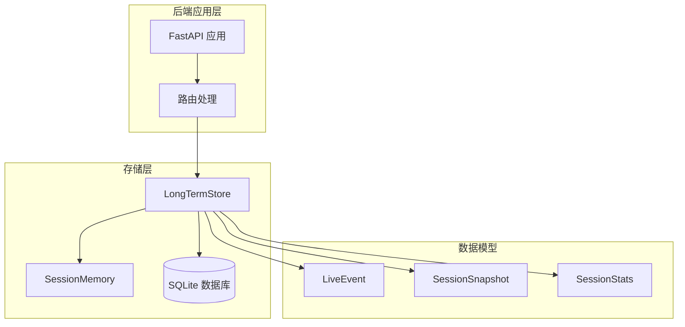
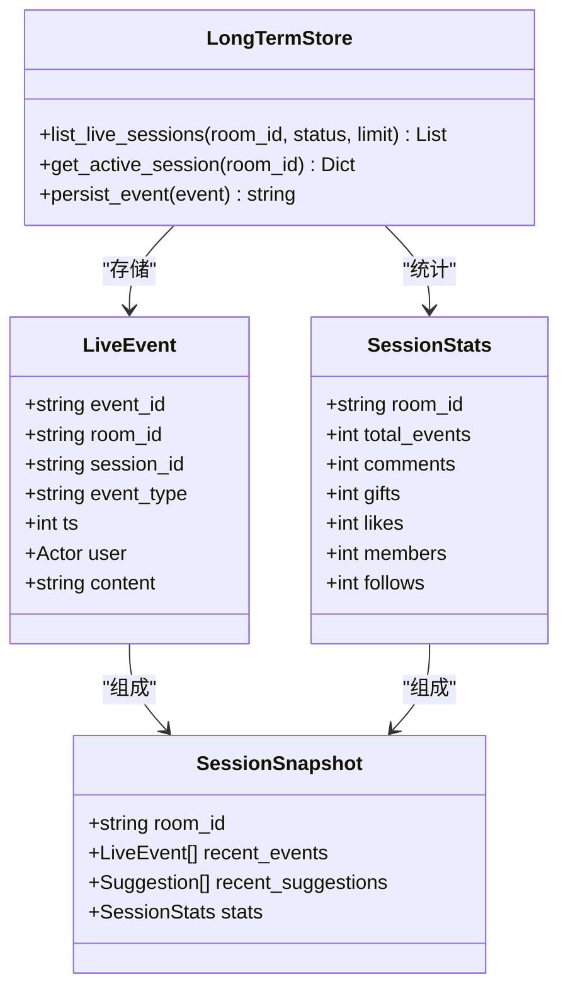
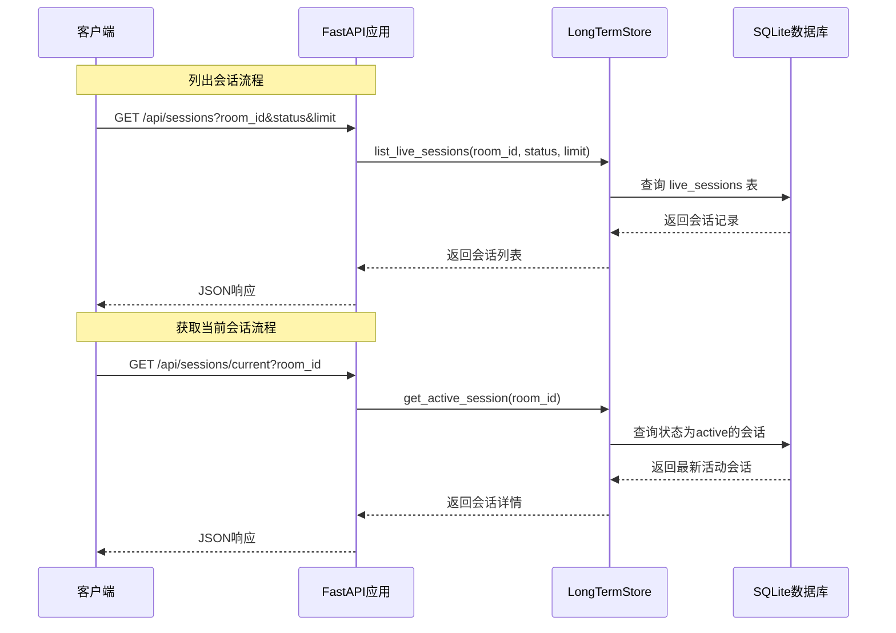
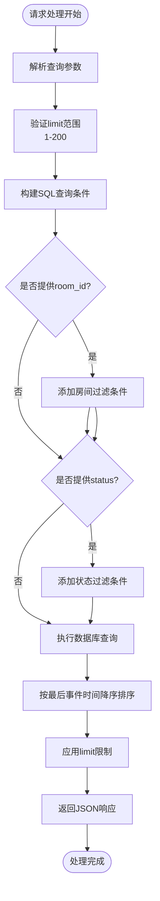
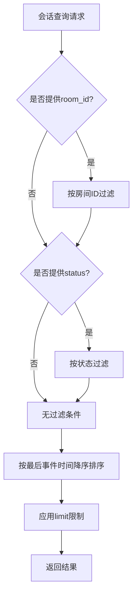
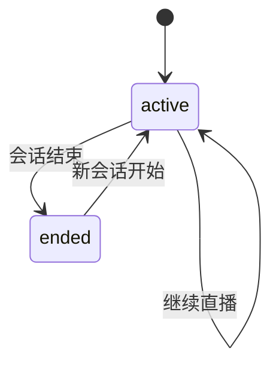
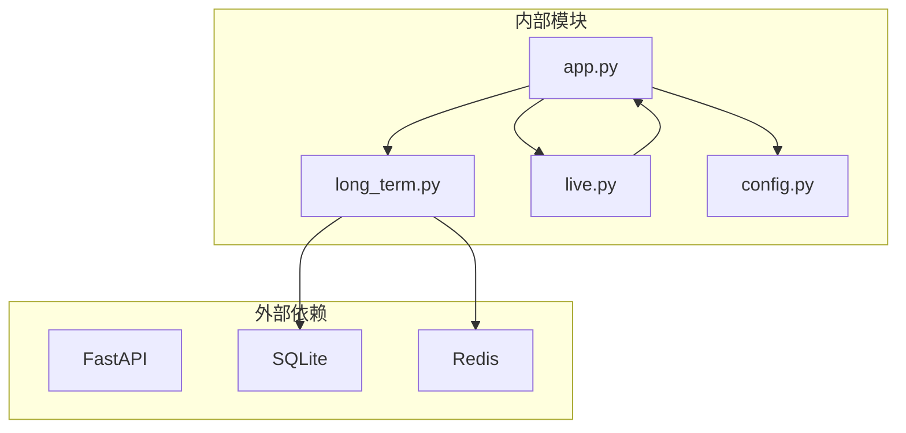

# 会话管理接口

<cite>
**本文档引用的文件**
- [backend/app.py](file://backend/app.py)
- [backend/memory/long_term.py](file://backend/memory/long_term.py)
- [backend/schemas/live.py](file://backend/schemas/live.py)
- [backend/config.py](file://backend/config.py)
- [README.md](file://README.md)
</cite>

## 目录
1. [简介](#简介)
2. [项目结构](#项目结构)
3. [核心组件](#核心组件)
4. [架构概览](#架构概览)
5. [详细组件分析](#详细组件分析)
6. [依赖分析](#依赖分析)
7. [性能考虑](#性能考虑)
8. [故障排除指南](#故障排除指南)
9. [结论](#结论)

## 简介

本文档详细说明了直播会话管理接口，包括两个核心端点：
- `GET /api/sessions` - 列出直播会话
- `GET /api/sessions/current` - 获取当前会话信息

这些接口提供了对直播会话的完整生命周期管理，包括会话状态跟踪、历史记录查询和实时状态监控。

## 项目结构

后端采用FastAPI框架构建，主要组件包括：



**图表来源**
- [backend/app.py:174-184](file://backend/app.py#L174-L184)
- [backend/memory/long_term.py:36-39](file://backend/memory/long_term.py#L36-L39)

**章节来源**
- [backend/app.py:1-220](file://backend/app.py#L1-L220)
- [backend/memory/long_term.py:1-750](file://backend/memory/long_term.py#L1-L750)

## 核心组件

### 会话状态管理

系统维护两种主要的会话状态：
- **active**: 当前正在进行的直播会话
- **ended**: 已结束的历史会话

会话状态通过数据库中的`live_sessions`表进行持久化存储，每个会话包含以下关键字段：
- `session_id`: 唯一会话标识符
- `room_id`: 直播间ID
- `status`: 会话状态（active/ended）
- `started_at`: 会话开始时间
- `last_event_at`: 最后事件时间
- `ended_at`: 会话结束时间

### 数据模型

会话相关的数据模型定义如下：



**图表来源**
- [backend/schemas/live.py:29-95](file://backend/schemas/live.py#L29-L95)
- [backend/memory/long_term.py:36-39](file://backend/memory/long_term.py#L36-L39)

**章节来源**
- [backend/schemas/live.py:1-95](file://backend/schemas/live.py#L1-L95)
- [backend/memory/long_term.py:663-698](file://backend/memory/long_term.py#L663-L698)

## 架构概览

会话管理接口的完整架构流程：



**图表来源**
- [backend/app.py:174-184](file://backend/app.py#L174-L184)
- [backend/memory/long_term.py:663-698](file://backend/memory/long_term.py#L663-L698)

## 详细组件分析

### GET /api/sessions - 列出直播会话

#### 接口定义
- **方法**: GET
- **路径**: `/api/sessions`
- **功能**: 列出指定房间的直播会话，支持按状态过滤

#### 查询参数

| 参数名 | 类型 | 必需 | 默认值 | 描述 |
|--------|------|------|--------|------|
| room_id | string | 否 | 当前房间ID | 直播间标识符，用于筛选特定房间的会话 |
| status | string | 否 | 无限制 | 会话状态过滤器，支持'active'或'ended' |
| limit | integer | 否 | 20 | 返回结果数量上限，范围1-200 |

#### 过滤逻辑

会话过滤遵循以下规则：
1. **房间过滤**: 当提供`room_id`时，仅返回该房间的会话
2. **状态过滤**: 当提供`status`时，仅返回指定状态的会话
3. **组合过滤**: 两者同时提供时，返回满足所有条件的会话
4. **无过滤**: 未提供任何参数时，返回所有会话

#### 响应数据结构

响应包含一个`items`数组，每个元素代表一个会话记录：



**图表来源**
- [backend/app.py:174-178](file://backend/app.py#L174-L178)
- [backend/memory/long_term.py:663-686](file://backend/memory/long_term.py#L663-L686)

#### 实际使用示例

**示例1: 获取所有房间的活动会话**
```bash
curl "http://localhost:8010/api/sessions?status=active&limit=50"
```

**示例2: 获取特定房间的历史会话**
```bash
curl "http://localhost:8010/api/sessions?room_id=32137571630&status=ended&limit=100"
```

**示例3: 获取当前房间的所有会话**
```bash
curl "http://localhost:8010/api/sessions?limit=20"
```

**章节来源**
- [backend/app.py:174-178](file://backend/app.py#L174-L178)
- [backend/memory/long_term.py:663-686](file://backend/memory/long_term.py#L663-L686)

### GET /api/sessions/current - 获取当前会话信息

#### 接口定义
- **方法**: GET
- **路径**: `/api/sessions/current`
- **功能**: 获取指定房间的当前活动会话信息

#### 查询参数

| 参数名 | 类型 | 必需 | 默认值 | 描述 |
|--------|------|------|--------|------|
| room_id | string | 否 | 配置中的房间ID | 直播间标识符，未提供时使用配置默认值 |

#### 处理逻辑

当前会话获取遵循以下流程：
1. **房间ID解析**: 优先使用查询参数，否则使用配置中的默认房间ID
2. **状态查询**: 严格查找状态为'active'的会话
3. **时间排序**: 按会话开始时间降序排列，返回最新的活动会话
4. **结果处理**: 如果找到会话则返回详细信息，否则返回空对象

#### 响应数据结构

返回的会话信息包含以下字段：

| 字段名 | 类型 | 描述 |
|--------|------|------|
| session_id | string | 唯一会话标识符 |
| room_id | string | 直播间ID |
| source_room_id | string | 源房间ID |
| livename | string | 直播间名称 |
| status | string | 会话状态（固定为'active'） |
| started_at | integer | 会话开始时间戳 |
| last_event_at | integer | 最后事件时间戳 |
| ended_at | integer | 会话结束时间戳（活动会话通常为空） |
| event_count | integer | 总事件数 |
| comment_count | integer | 评论事件数 |
| gift_event_count | integer | 礼物事件数 |
| join_count | integer | 加入事件数 |

#### 实际使用示例

**示例1: 获取当前活动会话**
```bash
curl "http://localhost:8010/api/sessions/current"
```

**示例2: 获取指定房间的活动会话**
```bash
curl "http://localhost:8010/api/sessions/current?room_id=32137571630"
```

**章节来源**
- [backend/app.py:181-184](file://backend/app.py#L181-L184)
- [backend/memory/long_term.py:688-698](file://backend/memory/long_term.py#L688-L698)

### 会话状态含义和过滤逻辑

#### 状态定义

| 状态 | 含义 | 特征 |
|------|------|------|
| active | 活动中 | 当前正在直播，有实时事件产生 |
| ended | 已结束 | 直播已结束，不再有新事件 |

#### 过滤逻辑详解



**图表来源**
- [backend/memory/long_term.py:663-686](file://backend/memory/long_term.py#L663-L686)

#### 状态转换流程



**图表来源**
- [backend/memory/long_term.py:289-300](file://backend/memory/long_term.py#L289-L300)
- [backend/memory/long_term.py:700-716](file://backend/memory/long_term.py#L700-L716)

**章节来源**
- [backend/memory/long_term.py:289-300](file://backend/memory/long_term.py#L289-L300)
- [backend/memory/long_term.py:700-716](file://backend/memory/long_term.py#L700-L716)

## 依赖分析

会话管理接口的依赖关系：



**图表来源**
- [backend/app.py:8-29](file://backend/app.py#L8-L29)
- [backend/memory/long_term.py:36-39](file://backend/memory/long_term.py#L36-L39)

**章节来源**
- [backend/app.py:8-29](file://backend/app.py#L8-L29)
- [backend/memory/long_term.py:36-39](file://backend/memory/long_term.py#L36-L39)

## 性能考虑

### 数据库优化

1. **索引设计**: `live_sessions`表具有复合索引`idx_live_sessions_room_status_last_event`，优化查询性能
2. **查询限制**: 默认limit为20，最大限制为200，防止大量数据传输
3. **排序优化**: 按`last_event_at`降序排序，利用数据库索引提高查询效率

### 缓存策略

1. **短期会话缓存**: 使用Redis或内存队列缓存最近事件和建议
2. **会话统计缓存**: 基于短期事件窗口生成轻量统计
3. **TTL管理**: Redis模式下设置会话数据生存时间

### 并发处理

1. **异步处理**: 使用FastAPI的异步特性处理并发请求
2. **连接池**: SQLite连接自动管理，避免连接泄漏
3. **资源清理**: 应用生命周期管理，确保资源正确释放

## 故障排除指南

### 常见问题及解决方案

#### 1. 会话查询无结果

**可能原因**:
- 房间ID不存在或错误
- 会话尚未开始或已结束
- 数据库连接问题

**解决步骤**:
1. 验证房间ID格式和有效性
2. 检查会话状态是否为'active'
3. 确认数据库连接正常

#### 2. 性能问题

**症状**: 查询响应缓慢

**解决方法**:
1. 减少limit参数值
2. 添加适当的过滤条件
3. 检查数据库索引是否正常

#### 3. 状态不一致

**症状**: 当前会话状态与预期不符

**排查步骤**:
1. 检查会话状态转换逻辑
2. 验证数据库状态更新操作
3. 确认会话结束流程

**章节来源**
- [backend/memory/long_term.py:688-698](file://backend/memory/long_term.py#L688-L698)
- [backend/app.py:174-184](file://backend/app.py#L174-L184)

## 结论

会话管理接口提供了完整的直播会话生命周期管理功能，包括：

1. **灵活的查询能力**: 支持按房间、状态和数量的多维过滤
2. **实时状态监控**: 提供当前活动会话的实时信息
3. **高性能设计**: 通过索引优化和合理的限制机制确保查询效率
4. **健壮的状态管理**: 完整的会话状态转换和持久化机制

这些接口为直播数据分析和实时监控提供了坚实的基础，支持从简单的会话查询到复杂的多维度分析场景。