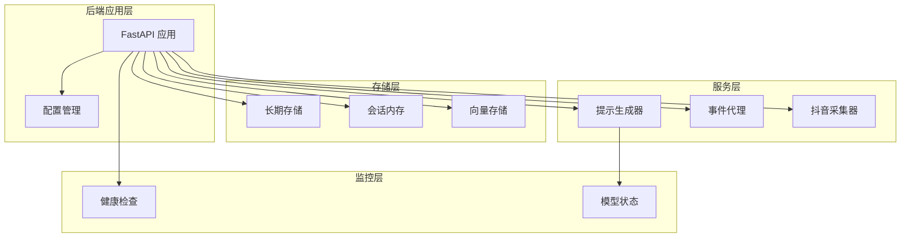
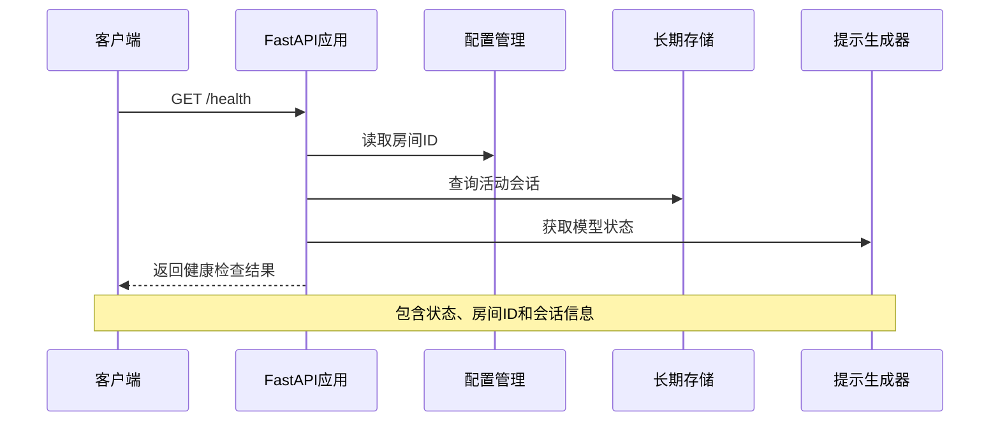
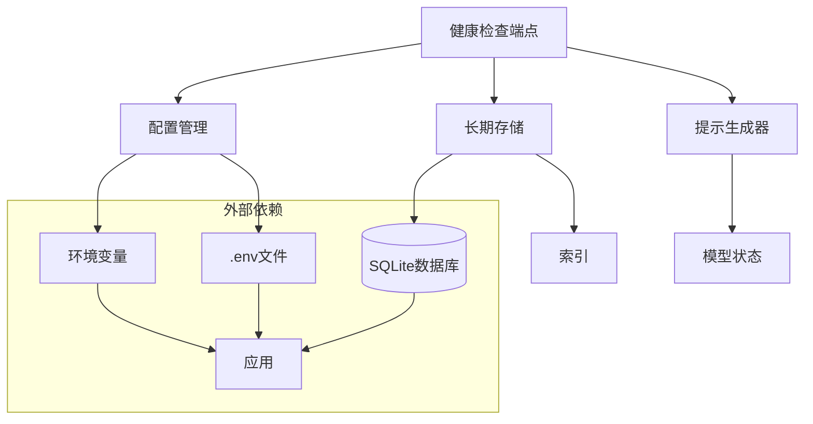

# 健康检查接口

<cite>
**本文档引用的文件**
- [backend/app.py](file://backend/app.py)
- [backend/config.py](file://backend/config.py)
- [backend/memory/long_term.py](file://backend/memory/long_term.py)
- [backend/schemas/live.py](file://backend/schemas/live.py)
- [backend/services/agent.py](file://backend/services/agent.py)
- [README.md](file://README.md)
</cite>

## 目录
1. [简介](#简介)
2. [项目结构](#项目结构)
3. [核心组件](#核心组件)
4. [架构概览](#架构概览)
5. [详细组件分析](#详细组件分析)
6. [依赖分析](#依赖分析)
7. [性能考虑](#性能考虑)
8. [故障排除指南](#故障排除指南)
9. [结论](#结论)

## 简介

健康检查接口是直播提示器后端系统的重要监控工具，用于实时检查系统运行状态、房间ID验证和活动会话确认。该接口提供了一个简单的HTTP端点，能够快速验证后端服务的可用性和关键组件的工作状态。

本接口特别设计用于生产环境的健康监控，支持自动化监控系统集成，能够帮助运维人员快速识别和诊断系统问题。

## 项目结构

直播提示器项目采用模块化的架构设计，主要由以下核心组件构成：



**图表来源**
- [backend/app.py:104-107](file://backend/app.py#L104-L107)
- [backend/config.py:39-94](file://backend/config.py#L39-L94)

**章节来源**
- [backend/app.py:1-220](file://backend/app.py#L1-L220)
- [backend/config.py:1-94](file://backend/config.py#L1-L94)

## 核心组件

健康检查接口的核心功能由以下几个关键组件协同完成：

### 健康检查端点
- **端点路径**: `/health`
- **HTTP方法**: GET
- **响应格式**: JSON
- **响应时间**: 几乎瞬时

### 关键依赖组件
1. **配置管理**: 读取房间ID设置
2. **长期存储**: 检查活动会话状态
3. **模型状态**: 提供AI模型运行状态

**章节来源**
- [backend/app.py:104-107](file://backend/app.py#L104-L107)
- [backend/config.py:45](file://backend/config.py#L45)

## 架构概览

健康检查接口在整个系统架构中的位置和作用：



**图表来源**
- [backend/app.py:104-107](file://backend/app.py#L104-L107)
- [backend/app.py:49-58](file://backend/app.py#L49-L58)

## 详细组件分析

### 健康检查端点实现

健康检查端点位于FastAPI应用中，实现了简洁高效的健康检查逻辑：

#### 端点定义
- **路由**: `/health`
- **方法**: GET
- **返回值**: 字典对象，包含状态信息

#### 响应数据结构
```json
{
  "status": "ok",
  "room_id": "32137571630",
  "active_session": {
    "session_id": "live:32137571630:1775218578225:abc123",
    "room_id": "32137571630",
    "status": "active",
    "started_at": 1775218578225,
    "last_event_at": 1775218578225
  }
}
```

#### 数据来源分析
1. **状态检查**: 返回固定的"ok"字符串，表示服务可用
2. **房间ID验证**: 从配置中读取当前房间ID
3. **活动会话确认**: 查询数据库中的活动会话状态

**章节来源**
- [backend/app.py:104-107](file://backend/app.py#L104-L107)
- [backend/memory/long_term.py:688-698](file://backend/memory/long_term.py#L688-L698)

### 配置管理集成

健康检查接口与配置管理系统的集成确保了房间ID的正确性：

#### 配置项说明
- **房间ID**: `ROOM_ID`环境变量或`.env`文件中的房间标识符
- **默认值**: `"32137571630"`
- **类型**: 字符串

#### 配置加载机制
- 从环境变量读取
- 支持`.env`文件配置
- 提供默认值确保本地开发可用

**章节来源**
- [backend/config.py:45](file://backend/config.py#L45)
- [backend/config.py:11-36](file://backend/config.py#L11-L36)

### 长期存储集成

健康检查接口通过长期存储层验证数据库连接和会话状态：

#### 活动会话查询
- **查询条件**: 当前房间ID且状态为"active"
- **排序规则**: 按开始时间降序排列
- **返回限制**: 仅返回最新的一条记录

#### 数据库连接验证
- 确保SQLite数据库正常连接
- 验证`live_sessions`表结构完整性
- 检查索引和约束条件

**章节来源**
- [backend/memory/long_term.py:688-698](file://backend/memory/long_term.py#L688-L698)
- [backend/memory/long_term.py:290-300](file://backend/memory/long_term.py#L290-L300)

### 模型状态监控

虽然健康检查端点不直接返回模型状态，但系统集成了完整的模型状态监控机制：

#### 模型状态结构
```json
{
  "mode": "heuristic",
  "model": "heuristic",
  "backend": "local",
  "last_result": "idle",
  "last_error": "",
  "updated_at": 1699123456789
}
```

#### 状态更新机制
- 自动更新模型运行状态
- 记录错误信息和时间戳
- 支持多种运行模式（heuristic、qwen、openai）

**章节来源**
- [backend/schemas/live.py:76-84](file://backend/schemas/live.py#L76-L84)
- [backend/services/agent.py:39-54](file://backend/services/agent.py#L39-L54)

## 依赖分析

健康检查接口的依赖关系图：



**图表来源**
- [backend/app.py:104-107](file://backend/app.py#L104-L107)
- [backend/config.py:39-94](file://backend/config.py#L39-L94)

**章节来源**
- [backend/app.py:13-29](file://backend/app.py#L13-L29)
- [backend/config.py:39-94](file://backend/config.py#L39-L94)

## 性能考虑

健康检查接口在设计时充分考虑了性能要求：

### 响应时间优化
- **查询复杂度**: O(log n) - 使用索引查询活动会话
- **内存使用**: 极低 - 仅返回必要的状态信息
- **CPU消耗**: 几乎为零 - 简单的数据库查询和配置读取

### 缓存策略
- **配置缓存**: 配置对象在应用启动时创建并复用
- **数据库连接**: SQLite连接池优化
- **响应缓存**: 健康检查结果不进行缓存，确保实时性

### 并发处理
- **异步处理**: 使用FastAPI的异步特性
- **连接池**: 数据库连接池管理
- **线程安全**: 配置读取操作线程安全

## 故障排除指南

### 常见问题及解决方案

#### 1. 连接失败
**症状**: 健康检查返回500错误或超时

**可能原因**:
- SQLite数据库文件损坏
- 数据库文件权限不足
- 数据库被其他进程锁定

**解决步骤**:
1. 检查数据库文件是否存在和可访问
2. 验证数据库文件权限设置
3. 关闭可能占用数据库的其他进程
4. 重启后端服务

#### 2. 房间ID无效
**症状**: 健康检查返回的房间ID与预期不符

**可能原因**:
- 环境变量配置错误
- `.env`文件格式问题
- 配置文件加载失败

**解决步骤**:
1. 检查`.env`文件中的`ROOM_ID`设置
2. 验证环境变量是否正确加载
3. 确认配置文件语法正确
4. 重启服务使新配置生效

#### 3. 活动会话状态异常
**症状**: `active_session`字段为空或状态不正确

**可能原因**:
- 采集器未启动或连接失败
- 数据库连接问题
- 会话管理逻辑异常

**解决步骤**:
1. 检查采集器服务状态
2. 验证数据库连接正常
3. 查看系统日志中的错误信息
4. 重新启动采集器服务

#### 4. 模型状态异常
**症状**: 模型状态显示错误或超时

**可能原因**:
- LLM API连接失败
- 网络连接问题
- API密钥配置错误

**解决步骤**:
1. 检查网络连接状态
2. 验证API密钥配置
3. 测试LLM服务可用性
4. 查看详细的错误日志

### 监控和告警

#### 健康检查最佳实践
1. **检查频率**: 建议每30秒到1分钟检查一次
2. **超时设置**: 设置合理的超时时间（通常2-5秒）
3. **重试机制**: 配置适当的重试次数和间隔
4. **告警阈值**: 设置合理的失败阈值和告警级别

#### 自动化监控集成
```bash
# 示例：使用curl进行健康检查
curl -s -o /dev/null -w "%{http_code}" http://localhost:8010/health

# 示例：使用Python脚本进行监控
#!/usr/bin/env python3
import requests
import time

def health_check():
    try:
        response = requests.get('http://localhost:8010/health', timeout=5)
        return response.status_code == 200
    except:
        return False

while True:
    if not health_check():
        print(f"[{time.strftime('%Y-%m-%d %H:%M:%S')}] Health check failed!")
    time.sleep(60)
```

**章节来源**
- [backend/services/agent.py:258-285](file://backend/services/agent.py#L258-L285)
- [README.md:208-266](file://README.md#L208-L266)

## 结论

健康检查接口作为直播提示器后端系统的重要组成部分，提供了简单而有效的系统监控能力。通过结合配置管理、存储层和模型状态监控，该接口能够全面反映系统的运行状态。

### 主要优势
1. **实现简单**: 仅需一个端点即可完成全面监控
2. **性能优异**: 几乎零延迟的响应时间
3. **覆盖全面**: 涵盖配置、存储、模型等多个关键组件
4. **易于集成**: 标准化的JSON响应格式便于各种监控系统集成

### 使用建议
1. **生产环境部署**: 建议在所有生产实例上启用健康检查
2. **监控告警**: 配置适当的告警阈值和通知机制
3. **定期检查**: 建立定期健康检查的运维流程
4. **日志记录**: 结合系统日志进行综合故障诊断

该健康检查接口为直播提示器系统的稳定运行提供了重要的保障机制，是运维监控体系中不可或缺的一部分。