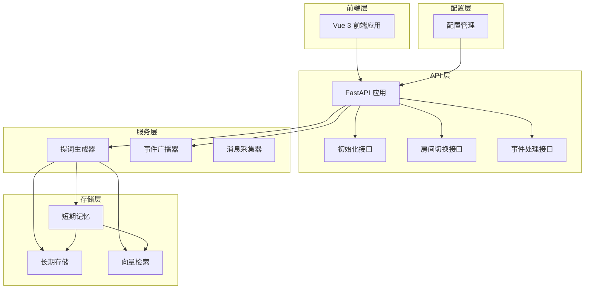
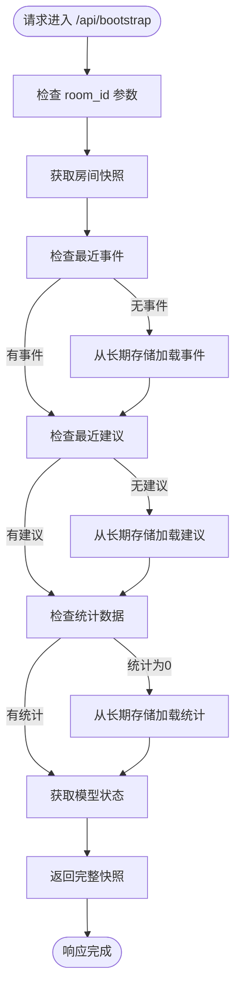
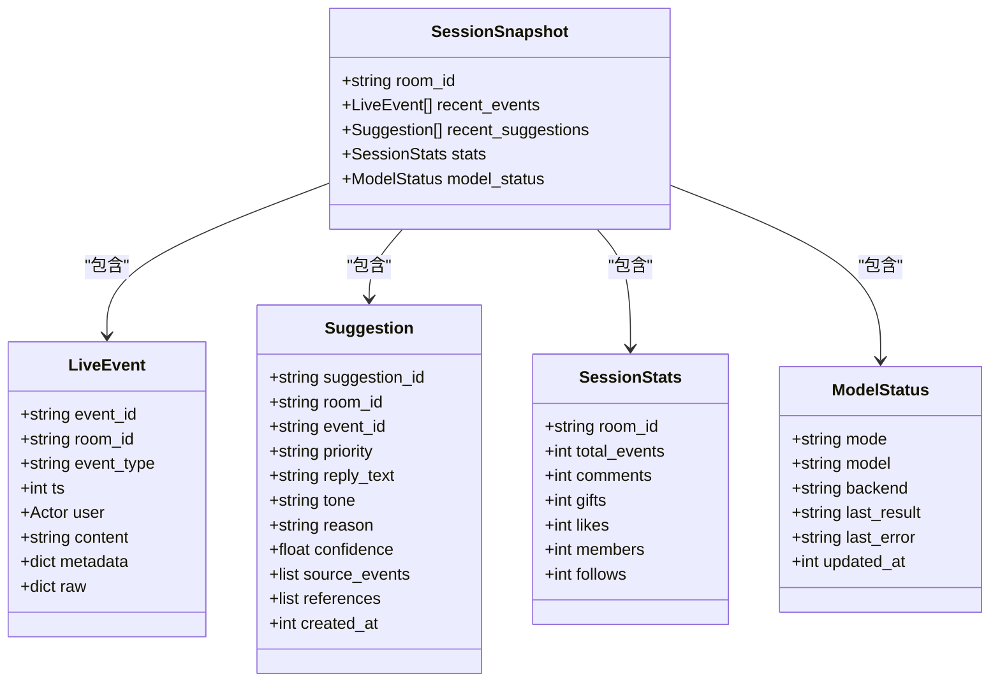
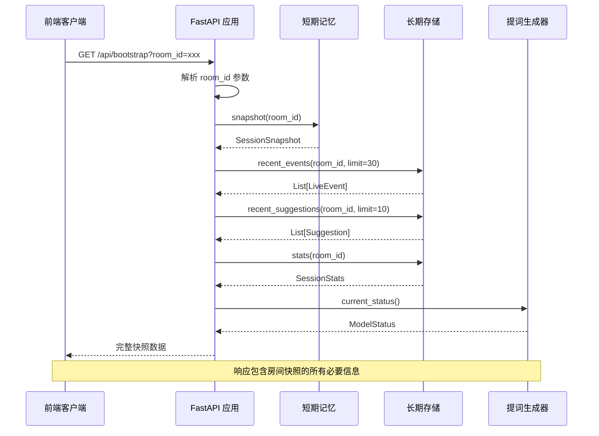
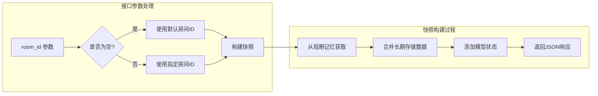
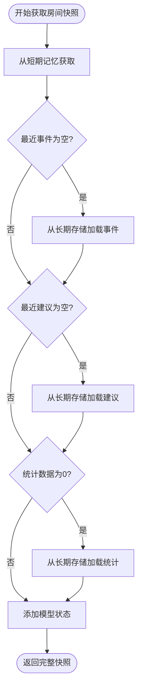
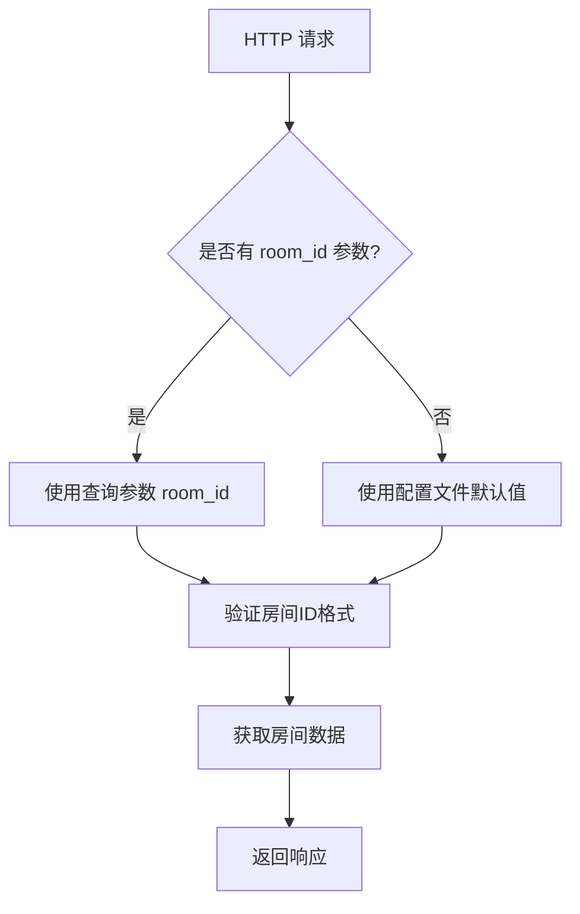
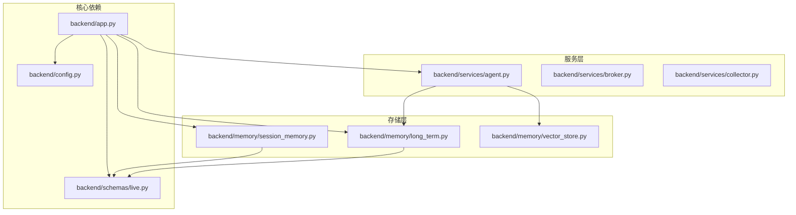
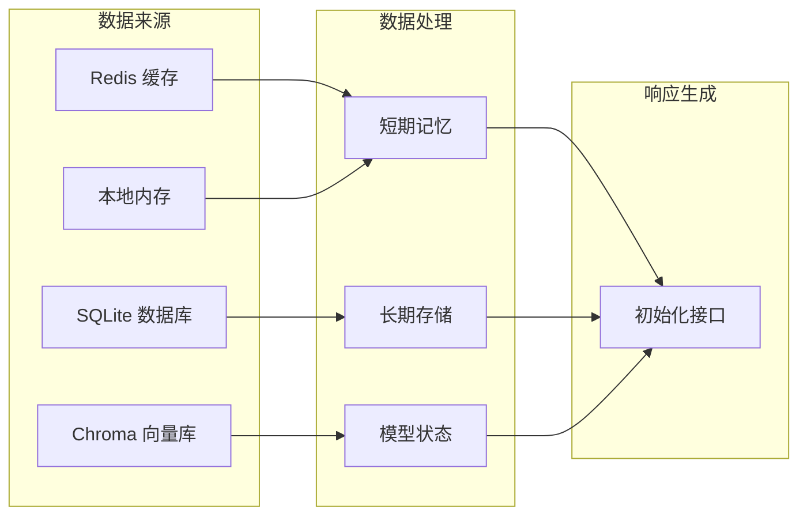

# 初始化接口

<cite>
**本文档引用的文件**
- [backend/app.py](file://backend/app.py)
- [backend/schemas/live.py](file://backend/schemas/live.py)
- [backend/memory/session_memory.py](file://backend/memory/session_memory.py)
- [backend/memory/long_term.py](file://backend/memory/long_term.py)
- [backend/services/agent.py](file://backend/services/agent.py)
- [backend/config.py](file://backend/config.py)
- [README.md](file://README.md)
</cite>

## 目录
1. [简介](#简介)
2. [项目结构](#项目结构)
3. [核心组件](#核心组件)
4. [架构概览](#架构概览)
5. [详细组件分析](#详细组件分析)
6. [依赖关系分析](#依赖关系分析)
7. [性能考虑](#性能考虑)
8. [故障排除指南](#故障排除指南)
9. [结论](#结论)

## 简介

初始化接口（GET /api/bootstrap）是直播提词系统的核心入口点，负责为前端提供房间的完整初始状态信息。该接口整合了短期记忆、长期存储和模型状态，为用户提供实时的直播互动环境。

该接口的主要功能包括：
- 获取房间快照（房间ID、最近事件、最近建议）
- 合并统计数据（总事件数、评论数、礼物数、点赞数、成员数、关注数）
- 查询模型状态（当前推理模式、模型名称、后端服务状态）

## 项目结构

直播提词系统采用分层架构设计，主要分为以下层次：



**图表来源**
- [backend/app.py:94-220](file://backend/app.py#L94-L220)
- [backend/config.py:39-94](file://backend/config.py#L39-L94)

**章节来源**
- [backend/app.py:1-220](file://backend/app.py#L1-L220)
- [backend/config.py:1-94](file://backend/config.py#L1-L94)

## 核心组件

### 初始化接口核心实现

初始化接口的核心实现位于 `backend/app.py` 文件中，通过 `snapshot_with_status` 函数实现完整的房间状态快照生成：



**图表来源**
- [backend/app.py:49-58](file://backend/app.py#L49-L58)

### 数据模型结构

系统使用 Pydantic 模型定义数据结构，确保类型安全和数据验证：



**图表来源**
- [backend/schemas/live.py:87-95](file://backend/schemas/live.py#L87-L95)

**章节来源**
- [backend/app.py:49-58](file://backend/app.py#L49-L58)
- [backend/schemas/live.py:1-95](file://backend/schemas/live.py#L1-L95)

## 架构概览

初始化接口在整个系统架构中的位置和作用：



**图表来源**
- [backend/app.py:109-112](file://backend/app.py#L109-L112)
- [backend/app.py:49-58](file://backend/app.py#L49-L58)

## 详细组件分析

### 初始化接口实现详解

#### 接口定义和参数处理

初始化接口通过 FastAPI 定义，支持可选的 `room_id` 参数：



**图表来源**
- [backend/app.py:109-112](file://backend/app.py#L109-L112)

#### 房间快照获取机制

房间快照的获取遵循"短期优先，长期补充"的原则：



**图表来源**
- [backend/app.py:49-58](file://backend/app.py#L49-L58)

### 数据结构详细说明

#### SessionSnapshot 数据模型

SessionSnapshot 是初始化接口的核心响应数据结构，包含以下字段：

| 字段名 | 类型 | 描述 | 默认值 |
|--------|------|------|--------|
| room_id | string | 房间标识符 | - |
| recent_events | List[LiveEvent] | 最近30条事件 | [] |
| recent_suggestions | List[Suggestion] | 最近10条建议 | [] |
| stats | SessionStats | 房间统计信息 | 自动生成 |
| model_status | ModelStatus | 模型状态信息 | 自动生成 |

#### LiveEvent 事件数据模型

LiveEvent 表示直播平台的标准事件格式：

| 字段名 | 类型 | 描述 | 示例 |
|--------|------|------|------|
| event_id | string | 事件唯一标识 | "7624505524721748020" |
| room_id | string | 房间ID | "32137571630" |
| event_type | string | 事件类型 | "comment/gift/follow/member/like" |
| ts | int | 时间戳（毫秒） | 1775218578225 |
| user | Actor | 用户身份信息 | 包含用户基本信息 |
| content | string | 事件内容 | "这是一条评论内容" |
| metadata | dict | 元数据 | 事件相关的额外信息 |
| raw | dict | 原始数据 | 平台原始消息 |

#### Suggestion 建议数据模型

Suggestion 表示系统生成的提词建议：

| 字段名 | 类型 | 描述 | 示例 |
|--------|------|------|------|
| suggestion_id | string | 建议唯一标识 | "uuid字符串" |
| room_id | string | 房间ID | "32137571630" |
| event_id | string | 关联事件ID | "关联的LiveEvent ID" |
| priority | string | 建议优先级 | "high/medium/low" |
| reply_text | string | 回复文本 | "感谢您的支持！" |
| tone | string | 语调风格 | "热情感谢/欢迎互动" |
| reason | string | 生成原因 | "礼物消息优先级高" |
| confidence | float | 置信度 | 0.91 |
| source_events | list | 源事件列表 | ["event_id1", "event_id2"] |
| references | list | 引用历史 | ["历史相似内容"] |
| created_at | int | 创建时间戳 | 毫秒时间戳 |

#### SessionStats 统计数据模型

SessionStats 提供房间的实时统计信息：

| 字段名 | 类型 | 描述 | 默认值 |
|--------|------|------|--------|
| room_id | string | 房间ID | - |
| total_events | int | 总事件数 | 0 |
| comments | int | 评论数 | 0 |
| gifts | int | 礼物数 | 0 |
| likes | int | 点赞数 | 0 |
| members | int | 成员加入数 | 0 |
| follows | int | 关注数 | 0 |

#### ModelStatus 模型状态模型

ModelStatus 描述当前模型的运行状态：

| 字段名 | 类型 | 描述 | 默认值 |
|--------|------|------|--------|
| mode | string | 推理模式 | "heuristic" |
| model | string | 模型名称 | "heuristic" |
| backend | string | 后端服务地址 | "local" |
| last_result | string | 最后结果状态 | "idle" |
| last_error | string | 最后错误信息 | "" |
| updated_at | int | 更新时间戳 | 0 |

**章节来源**
- [backend/schemas/live.py:87-95](file://backend/schemas/live.py#L87-L95)
- [backend/schemas/live.py:29-45](file://backend/schemas/live.py#L29-L45)
- [backend/schemas/live.py:47-62](file://backend/schemas/live.py#L47-L62)
- [backend/schemas/live.py:64-74](file://backend/schemas/live.py#L64-L74)
- [backend/schemas/live.py:76-85](file://backend/schemas/live.py#L76-L85)

### 房间参数使用方法

#### room_id 参数的处理逻辑

初始化接口支持两种房间ID的获取方式：

1. **URL参数传递**：通过 `GET /api/bootstrap?room_id=xxx` 显式指定房间
2. **配置文件默认**：当未提供 `room_id` 参数时，使用配置文件中的默认房间ID



**图表来源**
- [backend/app.py:109-112](file://backend/app.py#L109-L112)

#### 房间ID验证和处理

系统对房间ID进行严格的验证和处理：

1. **去除空白字符**：自动清理输入的房间ID两端空白
2. **格式验证**：确保房间ID为非空字符串
3. **类型转换**：保持房间ID为字符串类型
4. **默认值处理**：当参数缺失时使用配置文件中的默认值

**章节来源**
- [backend/app.py:109-112](file://backend/app.py#L109-L112)

### 响应数据结构详解

#### 完整响应示例

初始化接口返回的完整JSON响应结构如下：

```json
{
  "room_id": "32137571630",
  "recent_events": [
    {
      "event_id": "7624505524721748020",
      "room_id": "32137571630",
      "platform": "douyin",
      "event_type": "comment",
      "method": "WebcastChatMessage",
      "livename": "直播间名称",
      "ts": 1775218578225,
      "user": {
        "id": "",
        "short_id": "",
        "sec_uid": "",
        "nickname": "观众昵称"
      },
      "content": "这是一条评论内容",
      "metadata": {},
      "raw": {}
    }
  ],
  "recent_suggestions": [
    {
      "suggestion_id": "uuid字符串",
      "room_id": "32137571630",
      "event_id": "关联事件ID",
      "source": "heuristic",
      "priority": "high",
      "reply_text": "感谢您的支持！",
      "tone": "热情感谢",
      "reason": "礼物消息优先级高",
      "confidence": 0.91,
      "source_events": ["event_id1"],
      "references": [],
      "created_at": 1775218578225
    }
  ],
  "stats": {
    "room_id": "32137571630",
    "total_events": 150,
    "comments": 85,
    "gifts": 45,
    "likes": 12,
    "members": 8,
    "follows": 0
  },
  "model_status": {
    "mode": "heuristic",
    "model": "heuristic",
    "backend": "local",
    "last_result": "idle",
    "last_error": "",
    "updated_at": 1775218578225
  }
}
```

#### 字段详细说明

每个字段都有其特定的作用和数据来源：

1. **room_id**：标识当前房间的唯一ID，用于区分不同的直播房间
2. **recent_events**：包含最近30条直播事件，按时间倒序排列
3. **recent_suggestions**：包含最近10条系统生成的提词建议
4. **stats**：提供房间的实时统计信息，帮助主播了解互动情况
5. **model_status**：显示当前模型的运行状态，包括推理模式、模型名称和最后结果

**章节来源**
- [backend/app.py:49-58](file://backend/app.py#L49-L58)
- [backend/schemas/live.py:87-95](file://backend/schemas/live.py#L87-L95)

### 使用场景和最佳实践

#### 典型使用场景

1. **页面初始化**：前端页面加载时调用，获取完整的房间状态
2. **房间切换**：用户切换不同房间时重新获取状态
3. **手动刷新**：用户主动刷新页面获取最新状态
4. **调试模式**：开发调试时获取特定房间的状态信息

#### 最佳实践建议

1. **参数验证**：始终验证 room_id 参数的有效性
2. **错误处理**：妥善处理数据库连接异常和数据缺失情况
3. **性能优化**：合理设置缓存策略，避免频繁重复查询
4. **数据一致性**：确保短期记忆和长期存储的数据一致性

**章节来源**
- [backend/app.py:109-112](file://backend/app.py#L109-L112)

## 依赖关系分析

### 组件依赖图



**图表来源**
- [backend/app.py:13-29](file://backend/app.py#L13-L29)
- [backend/services/agent.py:23-30](file://backend/services/agent.py#L23-L30)

### 数据流依赖

初始化接口的数据流依赖关系：



**图表来源**
- [backend/memory/session_memory.py:17-31](file://backend/memory/session_memory.py#L17-L31)
- [backend/memory/long_term.py:36-40](file://backend/memory/long_term.py#L36-L40)
- [backend/services/agent.py:23-30](file://backend/services/agent.py#L23-L30)

**章节来源**
- [backend/app.py:13-29](file://backend/app.py#L13-L29)
- [backend/memory/session_memory.py:17-31](file://backend/memory/session_memory.py#L17-L31)
- [backend/memory/long_term.py:36-40](file://backend/memory/long_term.py#L36-L40)
- [backend/services/agent.py:23-30](file://backend/services/agent.py#L23-L30)

## 性能考虑

### 性能优化策略

1. **缓存策略**：利用短期记忆的Redis缓存减少数据库查询
2. **数据分页**：限制最近事件和建议的数量，避免大数据量传输
3. **懒加载**：只有在短期记忆为空时才查询长期存储
4. **异步处理**：使用异步I/O提高并发处理能力

### 性能监控指标

- **响应时间**：初始化请求的平均响应时间
- **数据库查询次数**：每次请求涉及的数据库查询数量
- **内存使用**：短期记忆和长期存储的内存占用
- **网络延迟**：Redis和数据库的网络延迟

## 故障排除指南

### 常见问题和解决方案

#### 房间ID无效

**问题描述**：传入的 room_id 为空或格式不正确

**解决方案**：
1. 验证 room_id 参数是否为空
2. 清理房间ID两端的空白字符
3. 使用配置文件中的默认房间ID

#### 数据库连接失败

**问题描述**：无法连接到 SQLite 数据库

**解决方案**：
1. 检查数据库文件路径是否存在
2. 验证数据库文件权限
3. 确认数据库文件未被其他进程锁定

#### Redis 连接异常

**问题描述**：Redis 服务器不可用

**解决方案**：
1. 检查 Redis 服务器状态
2. 验证 Redis 连接URL配置
3. 使用本地内存模式作为后备方案

**章节来源**
- [backend/app.py:109-112](file://backend/app.py#L109-L112)
- [backend/memory/session_memory.py:11-14](file://backend/memory/session_memory.py#L11-L14)

## 结论

初始化接口（GET /api/bootstrap）是直播提词系统的核心入口，通过整合短期记忆、长期存储和模型状态，为前端提供了完整的房间状态信息。该接口的设计体现了以下特点：

1. **完整性**：提供房间快照的所有必要信息
2. **灵活性**：支持动态房间切换和参数化查询
3. **健壮性**：具备完善的错误处理和降级机制
4. **性能**：通过缓存和懒加载优化响应速度

通过合理的配置和使用，初始化接口能够为直播主播提供准确、及时的互动环境，提升直播质量和用户体验。