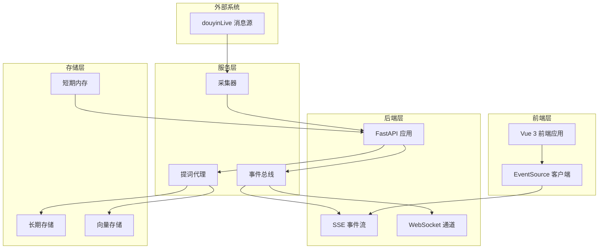
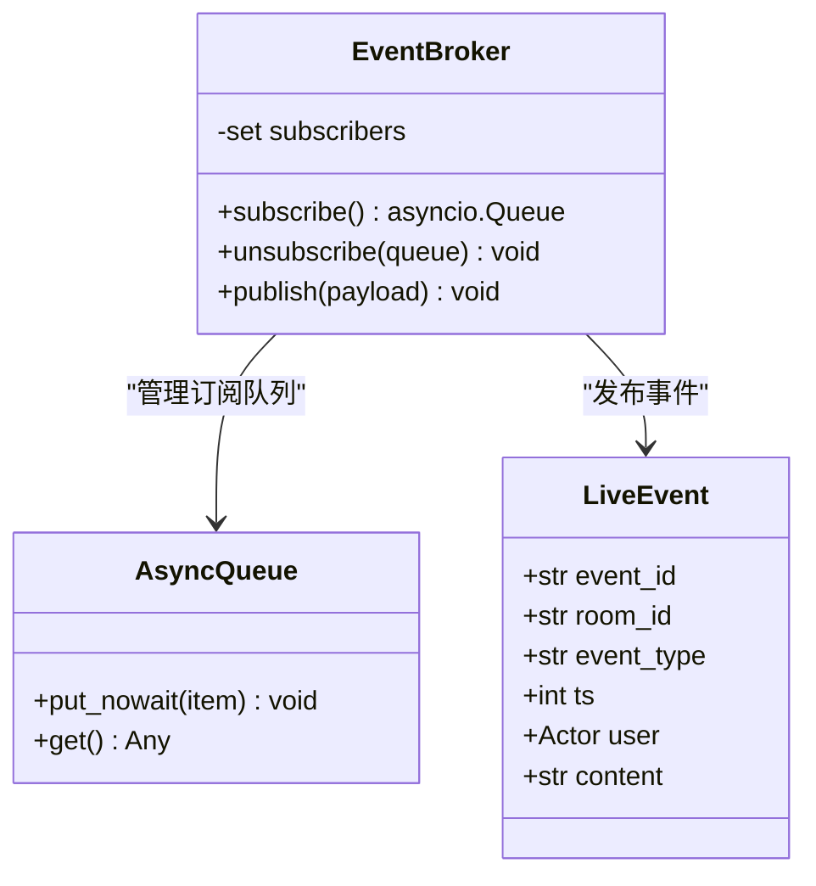
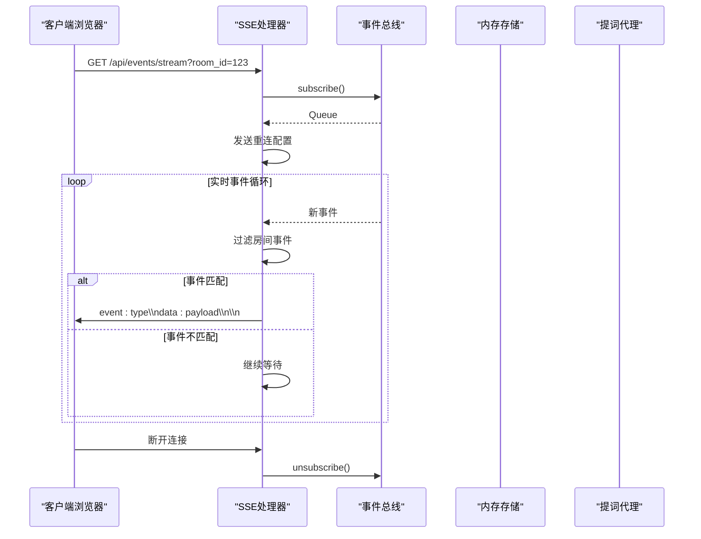
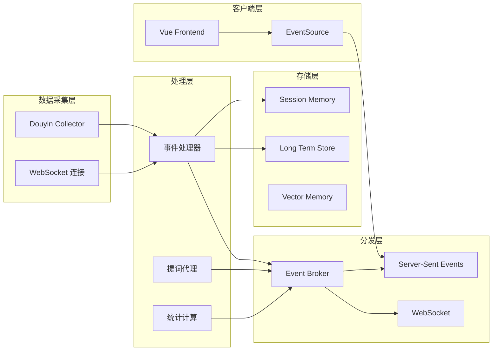
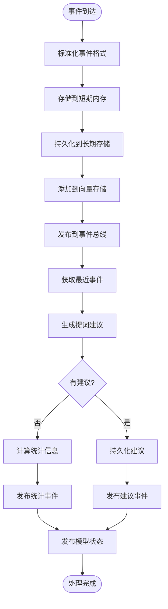
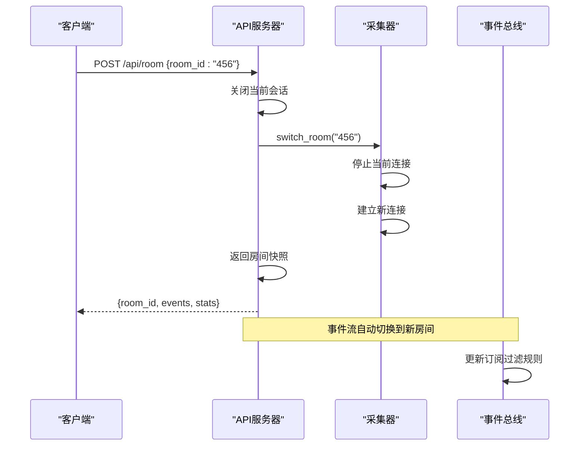
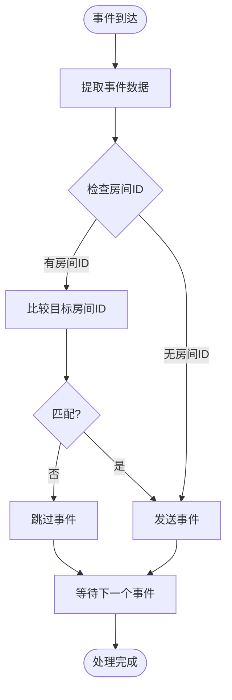

# 实时事件流接口

<cite>
**本文档引用的文件**
- [backend/app.py](file://backend/app.py)
- [backend/schemas/live.py](file://backend/schemas/live.py)
- [backend/services/broker.py](file://backend/services/broker.py)
- [backend/memory/session_memory.py](file://backend/memory/session_memory.py)
- [backend/memory/long_term.py](file://backend/memory/long_term.py)
- [backend/services/agent.py](file://backend/services/agent.py)
- [backend/services/collector.py](file://backend/services/collector.py)
- [backend/config.py](file://backend/config.py)
- [frontend/src/stores/live.js](file://frontend/src/stores/live.js)
- [frontend/src/components/EventFeed.vue](file://frontend/src/components/EventFeed.vue)
- [README.md](file://README.md)
</cite>

## 目录
1. [简介](#简介)
2. [项目结构](#项目结构)
3. [核心组件](#核心组件)
4. [架构概览](#架构概览)
5. [详细组件分析](#详细组件分析)
6. [事件类型详解](#事件类型详解)
7. [房间过滤机制](#房间过滤机制)
8. [客户端连接示例](#客户端连接示例)
9. [性能考虑](#性能考虑)
10. [故障排除指南](#故障排除指南)
11. [结论](#结论)

## 简介

实时事件流接口是本AI直播提词系统的核心功能模块，基于Server-Sent Events (SSE)技术实现实时数据推送。该接口为前端提供了一个持久的HTTP连接，能够实时接收直播间的各种事件，包括弹幕、礼物、关注、成员进入等互动事件，以及系统生成的提词建议、统计数据和模型状态信息。

本系统采用事件驱动架构，通过事件总线模式实现了高效的实时通信，支持多房间同时监控和选择性事件过滤，为直播运营提供了强大的实时数据支撑。

## 项目结构

系统采用分层架构设计，主要分为以下层次：



**图表来源**
- [backend/app.py:94-220](file://backend/app.py#L94-L220)
- [backend/services/broker.py:10-40](file://backend/services/broker.py#L10-L40)

**章节来源**
- [backend/app.py:1-220](file://backend/app.py#L1-L220)
- [README.md:35-48](file://README.md#L35-L48)

## 核心组件

### 事件总线 (EventBroker)

事件总线是整个实时事件流系统的核心枢纽，负责管理所有订阅者的连接和消息分发。



**图表来源**
- [backend/services/broker.py:10-40](file://backend/services/broker.py#L10-L40)
- [backend/schemas/live.py:29-44](file://backend/schemas/live.py#L29-L44)

### SSE 事件流处理器

SSE事件流处理器实现了标准的Server-Sent Events协议，提供持久的双向通信通道。



**图表来源**
- [backend/app.py:187-206](file://backend/app.py#L187-L206)
- [backend/services/broker.py:16-21](file://backend/services/broker.py#L16-L21)

**章节来源**
- [backend/services/broker.py:1-40](file://backend/services/broker.py#L1-L40)
- [backend/app.py:187-206](file://backend/app.py#L187-L206)

## 架构概览

系统的实时事件流架构采用了事件驱动的设计模式，确保了高并发和低延迟的特性：



**图表来源**
- [backend/app.py:61-78](file://backend/app.py#L61-L78)
- [backend/services/collector.py:38-53](file://backend/services/collector.py#L38-L53)

## 详细组件分析

### 事件处理器 (process_event)

事件处理器是实时事件流的核心处理逻辑，负责事件的标准化、存储、分析和分发。



**图表来源**
- [backend/app.py:61-78](file://backend/app.py#L61-L78)

### 房间切换机制

系统支持动态房间切换，确保事件流能够适应不同的直播场景：



**图表来源**
- [backend/app.py:115-126](file://backend/app.py#L115-L126)
- [backend/services/collector.py:80-97](file://backend/services/collector.py#L80-L97)

**章节来源**
- [backend/app.py:61-78](file://backend/app.py#L61-L78)
- [backend/app.py:115-126](file://backend/app.py#L115-L126)

## 事件类型详解

系统支持四种主要的事件类型，每种事件都有特定的数据格式和触发条件：

### 事件类型 (event)

**触发条件：**
- 所有从直播平台接收到的原始事件
- 包括弹幕、礼物、关注、成员进入等

**数据格式：**
```json
{
  "type": "event",
  "data": {
    "event_id": "字符串",
    "room_id": "字符串",
    "source_room_id": "字符串",
    "session_id": "字符串",
    "platform": "字符串",
    "event_type": "字符串",
    "method": "字符串",
    "livename": "字符串",
    "ts": 整数,
    "user": {
      "id": "字符串",
      "short_id": "字符串", 
      "sec_uid": "字符串",
      "nickname": "字符串"
    },
    "content": "字符串",
    "metadata": 对象,
    "raw": 对象
  }
}
```

**触发逻辑：**
- 每当采集器接收到新的直播事件时触发
- 事件经过标准化处理后立即发布

### 建议类型 (suggestion)

**触发条件：**
- 仅对特定类型的事件生成建议：弹幕(comment)、礼物(gift)、关注(follow)
- 建议生成器根据上下文和历史数据决定是否生成

**数据格式：**
```json
{
  "type": "suggestion",
  "data": {
    "suggestion_id": "字符串",
    "room_id": "字符串", 
    "event_id": "字符串",
    "source": "字符串",
    "priority": "字符串",
    "reply_text": "字符串",
    "tone": "字符串",
    "reason": "字符串",
    "confidence": 浮点数,
    "source_events": 数组,
    "references": 数组,
    "created_at": 整数
  }
}
```

**触发逻辑：**
- 建议生成器分析事件的重要性和上下文
- 优先使用远程模型，失败时回退到本地启发式规则

### 统计类型 (stats)

**触发条件：**
- 每次事件处理后计算房间统计信息
- 基于短期内存中的事件窗口进行统计

**数据格式：**
```json
{
  "type": "stats",
  "data": {
    "room_id": "字符串",
    "total_events": 整数,
    "comments": 整数,
    "gifts": 整数,
    "likes": 整数,
    "members": 整数,
    "follows": 整数
  }
}
```

**触发逻辑：**
- 统计最近120个事件中的各类事件数量
- 实时更新房间活动指标

### 模型状态类型 (model_status)

**触发条件：**
- 模型状态发生变化时触发
- 包括模型切换、错误状态、成功响应等

**数据格式：**
```json
{
  "type": "model_status", 
  "data": {
    "mode": "字符串",
    "model": "字符串",
    "backend": "字符串",
    "last_result": "字符串",
    "last_error": "字符串",
    "updated_at": 整数
  }
}
```

**触发逻辑：**
- 模型调用成功或失败时更新状态
- 提供模型运行的健康状况信息

**章节来源**
- [backend/schemas/live.py:29-95](file://backend/schemas/live.py#L29-L95)
- [backend/app.py:61-78](file://backend/app.py#L61-L78)

## 房间过滤机制

房间过滤机制允许客户端只接收特定房间的事件，提高系统的可扩展性和资源利用率：

### 过滤逻辑



**图表来源**
- [backend/app.py:191-204](file://backend/app.py#L191-L204)

### 过滤规则

1. **房间ID提取**：从事件数据中提取`room_id`字段
2. **目标房间检查**：如果URL参数包含`room_id`，则启用过滤
3. **特殊事件处理**：`model_status`事件不进行房间过滤
4. **精确匹配**：只有完全匹配的目标房间才会被推送

### 配置选项

- **room_id参数**：可选的房间ID过滤器
- **默认行为**：不指定房间ID时接收所有事件
- **性能优化**：过滤在服务器端完成，减少网络传输

**章节来源**
- [backend/app.py:187-206](file://backend/app.py#L187-L206)

## 客户端连接示例

### JavaScript 客户端实现

```javascript
// 基础连接示例
const connectToStream = (roomId = null) => {
    const params = new URLSearchParams();
    if (roomId) {
        params.append('room_id', roomId);
    }
    
    const eventSource = new EventSource(`/api/events/stream?${params.toString()}`);
    
    // 连接状态管理
    eventSource.onopen = () => {
        console.log('SSE 连接已建立');
        updateConnectionState('connected');
    };
    
    eventSource.onerror = (error) => {
        console.error('SSE 连接错误:', error);
        updateConnectionState('disconnected');
        
        // 自动重连机制
        setTimeout(() => {
            console.log('尝试重新连接...');
            connectToStream(roomId);
        }, 3000);
    };
    
    // 事件监听器
    eventSource.addEventListener('event', (message) => {
        const event = JSON.parse(message.data);
        handleLiveEvent(event);
    });
    
    eventSource.addEventListener('suggestion', (message) => {
        const suggestion = JSON.parse(message.data);
        handleSuggestion(suggestion);
    });
    
    eventSource.addEventListener('stats', (message) => {
        const stats = JSON.parse(message.data);
        updateStats(stats);
    });
    
    eventSource.addEventListener('model_status', (message) => {
        const status = JSON.parse(message.data);
        updateModelStatus(status);
    });
    
    return eventSource;
};

// 房间切换示例
const switchRoom = async (newRoomId) => {
    try {
        // 1. 发送房间切换请求
        const response = await fetch('/api/room', {
            method: 'POST',
            headers: {
                'Content-Type': 'application/json',
            },
            body: JSON.stringify({ room_id: newRoomId })
        });
        
        const snapshot = await response.json();
        
        // 2. 关闭现有连接
        if (currentEventSource) {
            currentEventSource.close();
        }
        
        // 3. 建立新连接
        currentEventSource = connectToStream(newRoomId);
        
        // 4. 更新UI状态
        updateUI(snapshot);
        
    } catch (error) {
        console.error('房间切换失败:', error);
        // 回滚到原房间
        reconnectToOriginalRoom();
    }
};
```

### Python 客户端实现

```python
import requests
import json
from typing import Generator, Dict, Any
import time

class LiveEventClient:
    def __init__(self, base_url: str = "http://localhost:8010"):
        self.base_url = base_url
        self.session = requests.Session()
        
    def connect_stream(self, room_id: str = None) -> Generator[Dict[str, Any], None, None]:
        """
        连接到实时事件流
        
        Args:
            room_id: 可选的房间ID过滤器
            
        Yields:
            事件字典，包含事件类型和数据
        """
        url = f"{self.base_url}/api/events/stream"
        params = {}
        if room_id:
            params['room_id'] = room_id
            
        with requests.get(url, params=params, stream=True) as response:
            response.raise_for_status()
            
            for line in response.iter_lines():
                if line:
                    decoded_line = line.decode('utf-8')
                    
                    # 解析SSE格式
                    if decoded_line.startswith('event:'):
                        event_type = decoded_line.split(':')[1].strip()
                    elif decoded_line.startswith('data:'):
                        data = json.loads(decoded_line.split(':', 1)[1].strip())
                        
                        # 发送事件
                        yield {
                            'type': event_type,
                            'data': data,
                            'timestamp': time.time()
                        }
    
    def connect_with_retry(self, room_id: str = None, max_retries: int = 5) -> Generator[Dict[str, Any], None, None]:
        """
        带重试机制的连接
        """
        retry_count = 0
        
        while retry_count < max_retries:
            try:
                for event in self.connect_stream(room_id):
                    yield event
                    
            except requests.exceptions.RequestException as e:
                retry_count += 1
                print(f"连接失败 (尝试 {retry_count}/{max_retries}): {e}")
                
                if retry_count < max_retries:
                    time.sleep(2 ** retry_count)  # 指数退避
                else:
                    raise Exception(f"无法建立连接，已重试 {max_retries} 次")
    
    def get_room_snapshot(self, room_id: str = None) -> Dict[str, Any]:
        """
        获取房间快照（一次性数据）
        """
        url = f"{self.base_url}/api/bootstrap"
        params = {}
        if room_id:
            params['room_id'] = room_id
            
        response = self.session.get(url, params=params)
        response.raise_for_status()
        
        return response.json()

# 使用示例
def main():
    client = LiveEventClient()
    
    # 获取房间快照
    snapshot = client.get_room_snapshot("32137571630")
    print("房间快照:", snapshot)
    
    # 连接到实时事件流
    try:
        for event in client.connect_with_retry("32137571630", max_retries=3):
            print(f"收到事件: {event['type']}")
            print(f"事件数据: {event['data']}")
            
            # 根据事件类型处理
            if event['type'] == 'event':
                handle_live_event(event['data'])
            elif event['type'] == 'suggestion':
                handle_suggestion(event['data'])
            elif event['type'] == 'stats':
                update_stats_display(event['data'])
            elif event['type'] == 'model_status':
                update_model_status_display(event['data'])
                
    except KeyboardInterrupt:
        print("客户端已停止")
    except Exception as e:
        print(f"连接异常: {e}")

def handle_live_event(event_data: Dict[str, Any]):
    """处理直播事件"""
    print(f"直播事件: {event_data['event_type']} - {event_data['content']}")

def handle_suggestion(suggestion_data: Dict[str, Any]):
    """处理提词建议"""
    print(f"建议: {suggestion_data['reply_text']} (置信度: {suggestion_data['confidence']})")

def update_stats_display(stats_data: Dict[str, Any]):
    """更新统计显示"""
    print(f"统计: 总事件 {stats_data['total_events']}, 弹幕 {stats_data['comments']}")

def update_model_status_display(status_data: Dict[str, Any]):
    """更新模型状态显示"""
    print(f"模型状态: {status_data['last_result']} ({status_data['model']})")

if __name__ == "__main__":
    main()
```

### 前端集成示例

```javascript
// Vue 3 + Pinia 状态管理
import { defineStore } from 'pinia'

export const useLiveStore = defineStore('live', {
    state: () => ({
        events: [],
        suggestions: [],
        stats: { total_events: 0, comments: 0, gifts: 0 },
        modelStatus: { mode: 'heuristic', model: 'heuristic' },
        connectionState: 'connecting'
    }),
    
    actions: {
        connect(targetRoomId = this.roomId) {
            // 关闭现有连接
            this.closeStream();
            
            // 建立新的SSE连接
            const query = new URLSearchParams({ room_id: targetRoomId });
            this.eventSource = new EventSource(`/api/events/stream?${query.toString()}`);
            
            this.connectionState = 'connecting';
            
            // 设置事件监听器
            this.eventSource.onopen = () => {
                this.connectionState = 'live';
            };
            
            this.eventSource.onerror = () => {
                this.connectionState = 'reconnecting';
            };
            
            this.eventSource.addEventListener('event', (message) => {
                this.ingestEvent(JSON.parse(message.data));
            });
            
            this.eventSource.addEventListener('suggestion', (message) => {
                this.ingestSuggestion(JSON.parse(message.data));
            });
            
            this.eventSource.addEventListener('stats', (message) => {
                this.stats = JSON.parse(message.data);
            });
            
            this.eventSource.addEventListener('model_status', (message) => {
                this.modelStatus = JSON.parse(message.data);
            });
        },
        
        closeStream() {
            if (this.eventSource) {
                this.eventSource.close();
                this.eventSource = undefined;
            }
        }
    }
});
```

**章节来源**
- [frontend/src/stores/live.js:173-205](file://frontend/src/stores/live.js#L173-L205)
- [frontend/src/stores/live.js:137-142](file://frontend/src/stores/live.js#L137-L142)

## 性能考虑

### 连接池管理

系统采用异步事件驱动架构，每个SSE连接都是独立的异步任务：

- **内存占用**：每个订阅者使用独立的asyncio.Queue
- **CPU效率**：事件发布采用非阻塞的队列操作
- **连接复用**：同一房间内的多个客户端共享相同的事件流

### 缓存策略

短期内存层提供了灵活的缓存机制：

- **Redis模式**：生产环境使用Redis集群，支持水平扩展
- **进程内模式**：开发环境使用deque，保证基本功能可用
- **TTL管理**：短期事件自动过期，避免内存泄漏

### 错误处理和重连

系统实现了完善的错误处理机制：

- **指数退避**：客户端重连间隔按指数增长
- **优雅降级**：Redis不可用时自动切换到进程内模式
- **连接监控**：实时监控连接状态和错误信息

## 故障排除指南

### 常见问题诊断

**连接问题：**
1. 检查后端服务是否正常运行
2. 验证SSE端点可达性
3. 查看浏览器开发者工具的Network面板

**事件过滤问题：**
1. 确认room_id参数格式正确
2. 检查目标房间ID是否存在
3. 验证房间切换是否成功

**性能问题：**
1. 监控Redis连接池状态
2. 检查队列积压情况
3. 分析事件处理时间

### 调试工具

```bash
# 检查服务状态
curl http://localhost:8010/health

# 测试SSE连接
curl -N http://localhost:8010/api/events/stream

# 查看Redis状态（如果使用）
redis-cli info memory
redis-cli info clients
```

### 日志分析

系统提供了详细的日志记录：

- **采集器日志**：WebSocket连接状态、消息处理结果
- **事件处理器日志**：事件标准化、存储过程、建议生成
- **SSE处理器日志**：连接建立、事件过滤、客户端断开

**章节来源**
- [backend/app.py:104-106](file://backend/app.py#L104-L106)
- [backend/services/collector.py:140-180](file://backend/services/collector.py#L140-L180)

## 结论

实时事件流接口为直播提词系统提供了强大而灵活的实时数据推送能力。通过采用SSE技术和事件总线架构，系统实现了高并发、低延迟的事件分发，支持多房间监控和选择性事件过滤。

### 主要优势

1. **实时性强**：毫秒级事件推送，确保主播能够及时获得反馈
2. **可扩展性好**：支持水平扩展，能够处理大量并发连接
3. **灵活性高**：支持房间过滤、事件类型过滤等高级功能
4. **可靠性强**：完善的错误处理和重连机制

### 技术特点

- 基于标准SSE协议，兼容性好
- 事件驱动架构，资源利用率高  
- 多层存储架构，数据持久化可靠
- 前后端分离，便于维护和扩展

该接口为直播运营提供了坚实的技术基础，能够有效提升直播间的互动质量和运营效率。