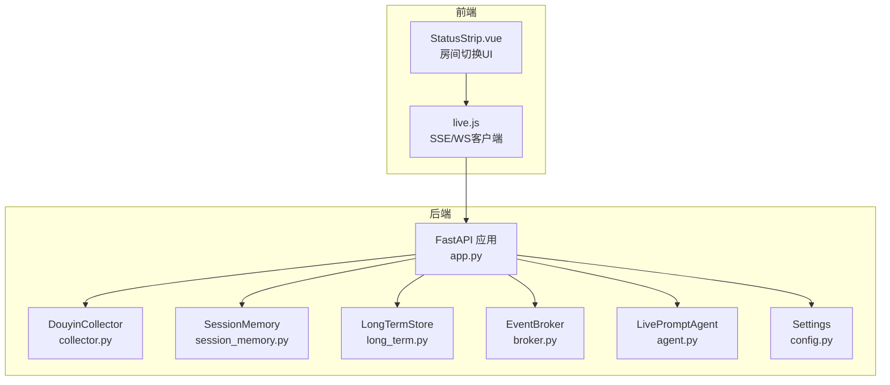
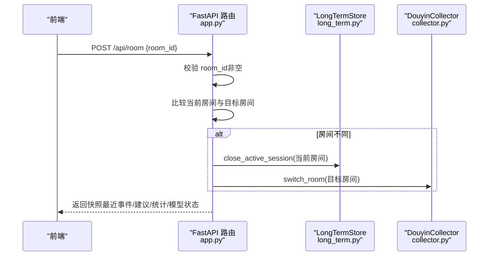
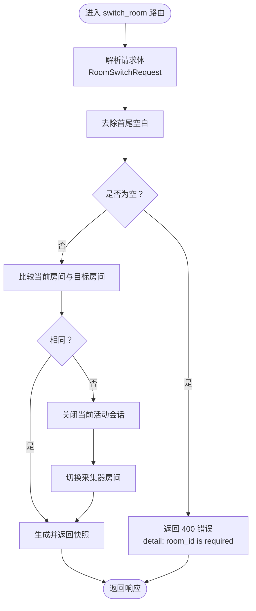
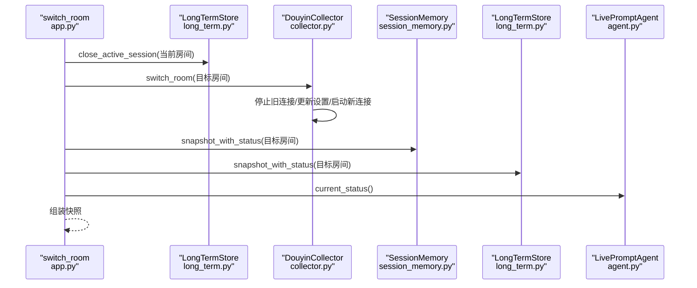
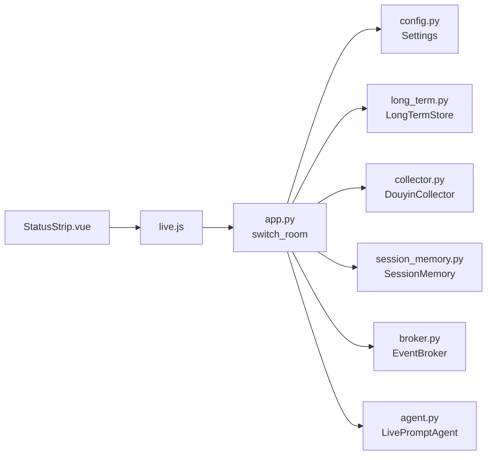

# 房间管理接口

<cite>
**本文档引用的文件**
- [backend/app.py](file://backend/app.py)
- [backend/schemas/live.py](file://backend/schemas/live.py)
- [backend/services/collector.py](file://backend/services/collector.py)
- [backend/services/broker.py](file://backend/services/broker.py)
- [backend/memory/session_memory.py](file://backend/memory/session_memory.py)
- [backend/memory/long_term.py](file://backend/memory/long_term.py)
- [backend/config.py](file://backend/config.py)
- [backend/services/agent.py](file://backend/services/agent.py)
- [backend/memory/vector_store.py](file://backend/memory/vector_store.py)
- [README.md](file://README.md)
- [frontend/src/components/StatusStrip.vue](file://frontend/src/components/StatusStrip.vue)
- [frontend/src/stores/live.js](file://frontend/src/stores/live.js)
</cite>

## 目录
1. [简介](#简介)
2. [项目结构](#项目结构)
3. [核心组件](#核心组件)
4. [架构总览](#架构总览)
5. [详细组件分析](#详细组件分析)
6. [依赖关系分析](#依赖关系分析)
7. [性能考虑](#性能考虑)
8. [故障排除指南](#故障排除指南)
9. [结论](#结论)
10. [附录](#附录)

## 简介
本文件聚焦于房间管理接口，特别是 POST /api/room 端点的用途与实现细节。该接口用于切换直播房间，其核心职责包括：
- 验证请求体中的房间标识
- 关闭当前活动会话
- 切换采集器的目标房间
- 返回新房间的快照状态

同时，文档将详细说明 RoomSwitchRequest 请求体字段、房间切换的内部处理流程（会话关闭、采集器切换、新房间状态初始化），并提供完整的请求/响应示例，帮助开发者安全地进行房间切换。

## 项目结构
后端采用 FastAPI 提供 REST、SSE、WebSocket 接口，核心组件围绕“事件采集—短期记忆—长期存储—向量检索—提词建议”展开。房间切换涉及以下关键模块：
- 应用入口与路由：FastAPI 应用、健康检查、房间切换、事件注入、SSE/WS 流
- 采集器：DouyinCollector，负责连接本地 WebSocket 并将消息标准化为 LiveEvent
- 内存层：SessionMemory（短期）、LongTermStore（长期）
- 广播器：EventBroker，用于事件/建议/统计/模型状态的分发
- 提词代理：LivePromptAgent，生成建议并维护模型状态
- 配置：Settings，提供 ROOM_ID、采集器参数等



**图表来源**
- [backend/app.py:115-126](file://backend/app.py#L115-L126)
- [backend/services/collector.py:80-97](file://backend/services/collector.py#L80-L97)
- [backend/memory/session_memory.py:104-112](file://backend/memory/session_memory.py#L104-L112)
- [backend/memory/long_term.py:700-716](file://backend/memory/long_term.py#L700-L716)
- [backend/services/broker.py:28](file://backend/services/broker.py#L28)
- [backend/services/agent.py:39-42](file://backend/services/agent.py#L39-L42)
- [backend/config.py:45](file://backend/config.py#L45)

**章节来源**
- [backend/app.py:115-126](file://backend/app.py#L115-L126)
- [backend/services/collector.py:80-97](file://backend/services/collector.py#L80-L97)
- [backend/memory/session_memory.py:104-112](file://backend/memory/session_memory.py#L104-L112)
- [backend/memory/long_term.py:700-716](file://backend/memory/long_term.py#L700-L716)
- [backend/services/broker.py:28](file://backend/services/broker.py#L28)
- [backend/services/agent.py:39-42](file://backend/services/agent.py#L39-L42)
- [backend/config.py:45](file://backend/config.py#L45)

## 核心组件
- RoomSwitchRequest：定义房间切换请求体，包含 room_id 字段
- switch_room 路由：处理房间切换逻辑，执行会话关闭、采集器切换、快照返回
- DouyinCollector.switch_room：负责停止当前连接、更新设置、重新启动采集
- LongTermStore.close_active_session：将当前房间的活动会话标记为结束
- snapshot_with_status：聚合短期/长期数据与模型状态，生成前端快照

**章节来源**
- [backend/app.py:32-33](file://backend/app.py#L32-L33)
- [backend/app.py:115-126](file://backend/app.py#L115-L126)
- [backend/services/collector.py:80-97](file://backend/services/collector.py#L80-L97)
- [backend/memory/long_term.py:700-716](file://backend/memory/long_term.py#L700-L716)
- [backend/app.py:49-58](file://backend/app.py#L49-L58)

## 架构总览
POST /api/room 的调用序列如下：
1. 前端发起请求，携带 RoomSwitchRequest
2. 后端路由 switch_room 解析并验证 room_id
3. 若目标房间不同于当前房间：
   - 关闭当前活动会话
   - 切换采集器目标房间
4. 返回新房间的快照状态



**图表来源**
- [backend/app.py:115-126](file://backend/app.py#L115-L126)
- [backend/memory/long_term.py:700-716](file://backend/memory/long_term.py#L700-L716)
- [backend/services/collector.py:80-97](file://backend/services/collector.py#L80-L97)

## 详细组件分析

### RoomSwitchRequest 请求体
- 字段定义
  - room_id: 字符串，表示目标房间标识
- 校验规则
  - 必填且不能为空字符串（去除首尾空白后）
  - 若为空，返回 400 错误并提示“room_id is required”
- 前端交互
  - 前端 StatusStrip.vue 提供输入框与切换按钮
  - 前端 live.js 发起 /api/room 请求并处理响应



**图表来源**
- [backend/app.py:115-126](file://backend/app.py#L115-L126)
- [frontend/src/components/StatusStrip.vue:94-111](file://frontend/src/components/StatusStrip.vue#L94-L111)
- [frontend/src/stores/live.js:207-237](file://frontend/src/stores/live.js#L207-L237)

**章节来源**
- [backend/app.py:32-33](file://backend/app.py#L32-L33)
- [backend/app.py:115-126](file://backend/app.py#L115-L126)
- [frontend/src/components/StatusStrip.vue:94-111](file://frontend/src/components/StatusStrip.vue#L94-L111)
- [frontend/src/stores/live.js:207-237](file://frontend/src/stores/live.js#L207-L237)

### 房间切换内部处理流程
- 会话关闭
  - 调用 LongTermStore.close_active_session(current_room_id)，将当前房间的活动会话标记为结束
- 采集器切换
  - 调用 DouyinCollector.switch_room(target_room_id)
  - 若目标房间与当前房间相同且采集器已在运行，则直接返回
  - 否则停止现有连接，更新 Settings.room_id，重新启动采集器
- 新房间状态初始化
  - 调用 snapshot_with_status(target_room_id) 聚合短期/长期数据与模型状态
  - 返回包含最近事件、最近建议、统计信息、模型状态的快照



**图表来源**
- [backend/app.py:115-126](file://backend/app.py#L115-L126)
- [backend/memory/long_term.py:700-716](file://backend/memory/long_term.py#L700-L716)
- [backend/services/collector.py:80-97](file://backend/services/collector.py#L80-L97)
- [backend/app.py:49-58](file://backend/app.py#L49-L58)

**章节来源**
- [backend/app.py:115-126](file://backend/app.py#L115-L126)
- [backend/memory/long_term.py:700-716](file://backend/memory/long_term.py#L700-L716)
- [backend/services/collector.py:80-97](file://backend/services/collector.py#L80-L97)
- [backend/app.py:49-58](file://backend/app.py#L49-L58)

### 数据模型与状态
- SessionSnapshot：前端快照包含
  - room_id
  - recent_events（最近事件列表）
  - recent_suggestions（最近建议列表）
  - stats（会话统计）
  - model_status（模型状态）
- 模型状态：包含模式、模型名、后端地址、最后结果、错误信息、更新时间

**章节来源**
- [backend/schemas/live.py:87-95](file://backend/schemas/live.py#L87-L95)
- [backend/schemas/live.py:76-84](file://backend/schemas/live.py#L76-L84)
- [backend/app.py:49-58](file://backend/app.py#L49-L58)

### 请求/响应示例
- 请求
  - 方法：POST
  - 路径：/api/room
  - Content-Type：application/json
  - 示例请求体：
    ```json
    {
      "room_id": "32137571630"
    }
    ```
- 成功响应
  - 状态码：200
  - 示例响应体（简化）：
    ```json
    {
      "room_id": "32137571630",
      "recent_events": [...],
      "recent_suggestions": [...],
      "stats": {
        "room_id": "32137571630",
        "total_events": 0,
        "comments": 0,
        "gifts": 0,
        "likes": 0,
        "members": 0,
        "follows": 0
      },
      "model_status": {
        "mode": "heuristic",
        "model": "heuristic",
        "backend": "local",
        "last_result": "idle",
        "last_error": "",
        "updated_at": 1710000000000
      }
    }
    ```
- 错误响应
  - 当 room_id 为空时，返回 400，示例：
    ```json
    {
      "detail": "room_id is required"
    }
    ```

**章节来源**
- [README.md:231-244](file://README.md#L231-L244)
- [backend/app.py:115-126](file://backend/app.py#L115-L126)

## 依赖关系分析
- 路由依赖
  - switch_room 依赖 Settings.room_id、LongTermStore、DouyinCollector、SessionMemory
- 采集器依赖
  - DouyinCollector 依赖 Settings（主机、端口、房间号、重连间隔等）
- 存储与广播
  - 事件处理流程中，SessionMemory、LongTermStore、VectorMemory、EventBroker 协同工作
- 前端依赖
  - StatusStrip.vue 与 live.js 通过 /api/room 与 SSE/WS 进行交互



**图表来源**
- [backend/app.py:115-126](file://backend/app.py#L115-L126)
- [backend/config.py:45](file://backend/config.py#L45)
- [backend/memory/long_term.py:700-716](file://backend/memory/long_term.py#L700-L716)
- [backend/services/collector.py:80-97](file://backend/services/collector.py#L80-L97)
- [backend/memory/session_memory.py:104-112](file://backend/memory/session_memory.py#L104-L112)
- [backend/services/broker.py:28](file://backend/services/broker.py#L28)
- [backend/services/agent.py:39-42](file://backend/services/agent.py#L39-L42)
- [frontend/src/components/StatusStrip.vue:94-111](file://frontend/src/components/StatusStrip.vue#L94-L111)
- [frontend/src/stores/live.js:207-237](file://frontend/src/stores/live.js#L207-L237)

**章节来源**
- [backend/app.py:115-126](file://backend/app.py#L115-L126)
- [backend/config.py:45](file://backend/config.py#L45)
- [backend/memory/long_term.py:700-716](file://backend/memory/long_term.py#L700-L716)
- [backend/services/collector.py:80-97](file://backend/services/collector.py#L80-L97)
- [backend/memory/session_memory.py:104-112](file://backend/memory/session_memory.py#L104-L112)
- [backend/services/broker.py:28](file://backend/services/broker.py#L28)
- [backend/services/agent.py:39-42](file://backend/services/agent.py#L39-L42)
- [frontend/src/components/StatusStrip.vue:94-111](file://frontend/src/components/StatusStrip.vue#L94-L111)
- [frontend/src/stores/live.js:207-237](file://frontend/src/stores/live.js#L207-L237)

## 性能考虑
- 会话关闭与切换
  - 关闭当前活动会话避免数据污染，确保新房间的统计与建议从零开始
- 采集器切换
  - 通过 stop/start 机制确保资源释放与新连接建立，减少并发冲突
- 快照聚合
  - snapshot_with_status 优先从短期内存获取最近事件/建议，必要时回退到长期存储，降低查询延迟
- 广播与分发
  - EventBroker 使用异步队列，避免阻塞事件处理主循环

[本节为通用性能讨论，无需特定文件来源]

## 故障排除指南
- 常见错误
  - room_id 为空：返回 400，提示“room_id is required”
  - 采集器连接异常：检查 COLLECTOR_HOST/PORT/ROOM_ID 配置
  - 模型服务不可达：检查 LLM_MODE、LLM_BASE_URL、LLM_API_KEY
- 建议排查步骤
  - 确认 /health 返回的 active_session 与预期一致
  - 查看 SSE /api/events/stream 是否能按房间过滤
  - 检查 /api/sessions/current 是否返回目标房间的活动会话
  - 在前端 StatusStrip.vue 中确认房间号输入与切换按钮状态

**章节来源**
- [backend/app.py:115-126](file://backend/app.py#L115-L126)
- [backend/config.py:45-50](file://backend/config.py#L45-L50)
- [backend/services/agent.py:183-329](file://backend/services/agent.py#L183-L329)
- [frontend/src/components/StatusStrip.vue:94-111](file://frontend/src/components/StatusStrip.vue#L94-L111)

## 结论
POST /api/room 提供了安全、可控的房间切换能力。通过严格的请求体校验、会话关闭与采集器切换，以及快照聚合，系统能够在多房间场景下保持数据一致性与低延迟。结合前端 StatusStrip.vue 与 live.js，用户可以直观地完成房间切换并实时看到新房间的状态。

[本节为总结性内容，无需特定文件来源]

## 附录

### API 定义
- 端点：POST /api/room
- 请求体：RoomSwitchRequest
  - room_id: string（必填，非空）
- 响应：SessionSnapshot（包含 room_id、recent_events、recent_suggestions、stats、model_status）

**章节来源**
- [backend/app.py:32-33](file://backend/app.py#L32-L33)
- [backend/app.py:115-126](file://backend/app.py#L115-L126)
- [backend/schemas/live.py:87-95](file://backend/schemas/live.py#L87-L95)

### 配置要点
- ROOM_ID：默认房间号，采集器初始连接使用
- COLLECTOR_*：采集器连接参数（主机、端口、心跳间隔、重连延迟）
- LLM_*：模型服务配置（模式、基础URL、模型名、API密钥、超时等）

**章节来源**
- [backend/config.py:45-61](file://backend/config.py#L45-L61)