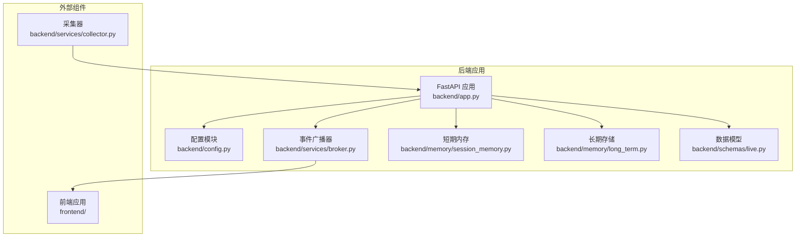
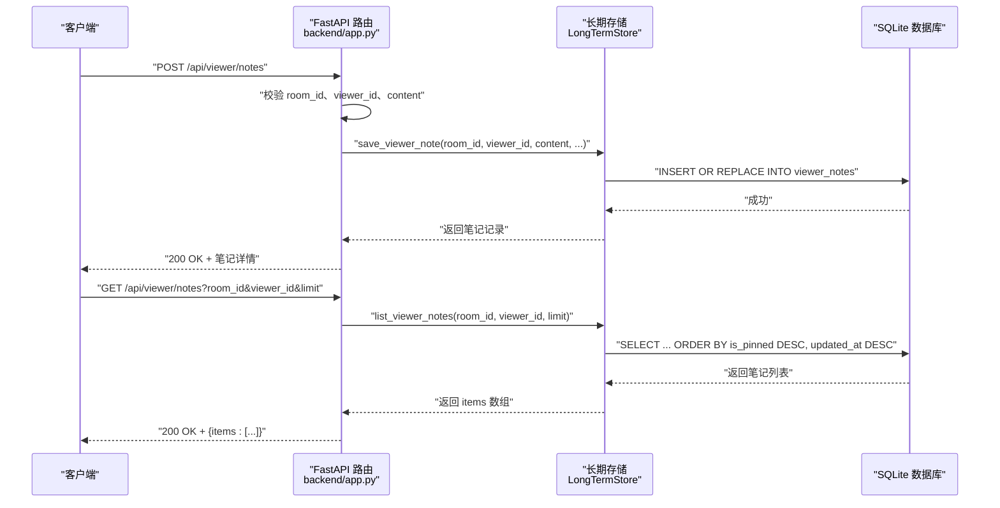
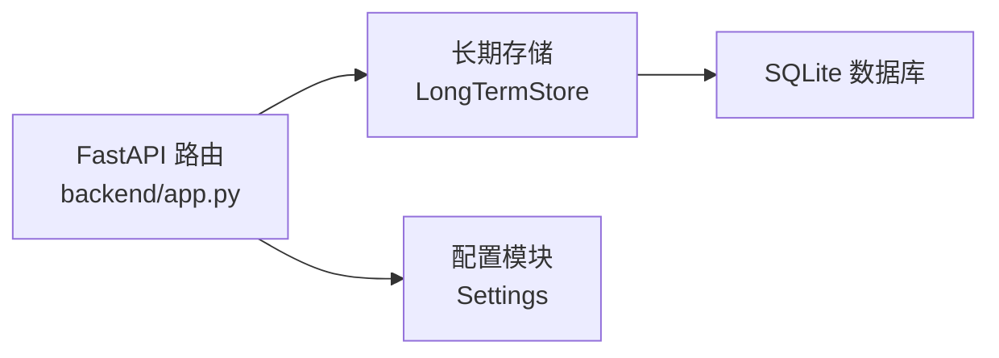

# 用户管理接口

<cite>
**本文档引用的文件**
- [backend/app.py](file://backend/app.py)
- [backend/memory/long_term.py](file://backend/memory/long_term.py)
- [backend/schemas/live.py](file://backend/schemas/live.py)
- [backend/config.py](file://backend/config.py)
- [backend/memory/session_memory.py](file://backend/memory/session_memory.py)
- [backend/services/broker.py](file://backend/services/broker.py)
- [README.md](file://README.md)
- [USAGE.md](file://USAGE.md)
</cite>

## 目录
1. [简介](#简介)
2. [项目结构](#项目结构)
3. [核心组件](#核心组件)
4. [架构总览](#架构总览)
5. [详细组件分析](#详细组件分析)
6. [依赖关系分析](#依赖关系分析)
7. [性能考虑](#性能考虑)
8. [故障排查指南](#故障排查指南)
9. [结论](#结论)
10. [附录](#附录)

## 简介
本文件聚焦于用户管理相关的三个接口：获取用户详情、获取用户笔记列表、保存/更新用户笔记、删除用户笔记。文档详细说明了各端点的请求参数、响应结构、数据验证规则、存储机制以及错误处理策略，并给出完整的请求/响应示例与最佳实践建议。

## 项目结构
后端采用 FastAPI 提供 REST 接口，结合短期内存（可选 Redis）、SQLite 长期存储、向量检索与事件广播器，形成完整的直播事件处理链路。用户笔记功能位于长期存储层，通过 SQLite 表 viewer_notes 实现持久化。

图表来源
- [backend/app.py:94-220](file://backend/app.py#L94-L220)
- [backend/memory/long_term.py:36-155](file://backend/memory/long_term.py#L36-L155)
- [backend/services/broker.py:10-40](file://backend/services/broker.py#L10-L40)
- [backend/memory/session_memory.py:17-113](file://backend/memory/session_memory.py#L17-L113)
- [backend/schemas/live.py:1-95](file://backend/schemas/live.py#L1-L95)
- [backend/config.py:39-94](file://backend/config.py#L39-L94)

章节来源
- [backend/app.py:94-220](file://backend/app.py#L94-L220)
- [README.md:21-34](file://README.md#L21-L34)

## 核心组件
- FastAPI 应用层：定义用户管理相关端点，负责参数校验、错误处理与响应封装。
- 长期存储层：提供用户笔记的增删改查能力，使用 SQLite 表 viewer_notes 持久化。
- 数据模型：定义 ViewerNoteUpsertRequest 请求体结构，确保输入规范化。
- 配置模块：提供运行时配置，如数据库路径、Redis 地址等。

章节来源
- [backend/app.py:36-43](file://backend/app.py#L36-L43)
- [backend/memory/long_term.py:138-147](file://backend/memory/long_term.py#L138-L147)
- [backend/config.py:51-69](file://backend/config.py#L51-L69)

## 架构总览
用户笔记接口的调用链如下：客户端发起请求 → FastAPI 路由 → 参数校验与清理 → 调用长期存储层 → 返回标准化响应。

图表来源
- [backend/app.py:153-164](file://backend/app.py#L153-L164)
- [backend/app.py:144-150](file://backend/app.py#L144-L150)
- [backend/memory/long_term.py:642-656](file://backend/memory/long_term.py#L642-L656)
- [backend/memory/long_term.py:620-632](file://backend/memory/long_term.py#L620-L632)

## 详细组件分析

### GET /api/viewer
- 功能：获取指定房间中某位用户的详细信息。
- 查询参数：
  - room_id：目标房间标识（可选）
  - viewer_id：用户唯一标识（可选）
  - nickname：用户昵称（可选）
- 返回：用户详情对象（若未找到则返回 404）。
- 错误处理：当找不到用户时返回 404。

章节来源
- [backend/app.py:135-141](file://backend/app.py#L135-L141)

### GET /api/viewer/notes
- 功能：获取指定房间中某位用户的笔记列表。
- 查询参数：
  - room_id：目标房间标识（可选）
  - viewer_id：用户唯一标识（必填）
  - limit：返回数量上限（默认 20）
- 返回：包含 items 数组的对象。
- 数据排序：按 is_pinned 降序、updated_at 降序排列。
- 错误处理：当缺少 viewer_id 时返回 400。

章节来源
- [backend/app.py:144-150](file://backend/app.py#L144-L150)
- [backend/memory/long_term.py:620-632](file://backend/memory/long_term.py#L620-L632)

### POST /api/viewer/notes
- 功能：保存或更新用户笔记。
- 请求体：ViewerNoteUpsertRequest
  - room_id：房间标识（必填）
  - viewer_id：用户标识（必填）
  - content：笔记内容（必填）
  - author：作者（默认“主播”）
  - is_pinned：是否置顶（默认 false）
  - note_id：笔记 ID（可选，若为空则自动生成）
- 返回：保存后的笔记记录。
- 数据验证与清洗：
  - 对 room_id、viewer_id、content 进行 strip 并校验非空。
  - author 若为空则回退为“主播”。
  - is_pinned 转换为布尔值。
  - note_id 为空时生成 UUID。
- 存储机制：使用 INSERT OR REPLACE，保持 created_at 不变，更新 updated_at。

章节来源
- [backend/app.py:36-43](file://backend/app.py#L36-L43)
- [backend/app.py:153-164](file://backend/app.py#L153-L164)
- [backend/memory/long_term.py:642-656](file://backend/memory/long_term.py#L642-L656)

### DELETE /api/viewer/notes/{note_id}
- 功能：删除指定笔记。
- 路径参数：note_id（笔记唯一标识）。
- 返回：删除成功标记与 note_id。
- 错误处理：若笔记不存在返回 404。

章节来源
- [backend/app.py:167-171](file://backend/app.py#L167-L171)
- [backend/memory/long_term.py:658-661](file://backend/memory/long_term.py#L658-L661)

### 数据模型：ViewerNoteUpsertRequest
- 字段定义：
  - room_id：字符串，必填
  - viewer_id：字符串，必填
  - content：字符串，必填
  - author：字符串，可选，默认“主播”
  - is_pinned：布尔值，可选，默认 false
  - note_id：字符串，可选，若为空则自动生成
- 校验规则：
  - 必填字段不能为空白
  - is_pinned 会被转换为整数存储（0/1）

章节来源
- [backend/app.py:36-43](file://backend/app.py#L36-L43)

### 存储表结构：viewer_notes
- 主键：note_id
- 关键字段：
  - room_id：房间标识
  - viewer_id：用户标识
  - author：作者
  - content：笔记内容
  - is_pinned：是否置顶（0/1）
  - created_at：创建时间（毫秒）
  - updated_at：更新时间（毫秒）
- 索引：
  - idx_viewer_notes_room_viewer_updated：按房间、用户、更新时间排序查询

章节来源
- [backend/memory/long_term.py:138-147](file://backend/memory/long_term.py#L138-L147)
- [backend/memory/long_term.py:193](file://backend/memory/long_term.py#L193)

### 权限与安全
- 当前实现未包含鉴权逻辑，所有请求均直接进入业务处理。
- 建议在生产环境中增加鉴权中间件，确保仅允许用户访问其自身的笔记。

章节来源
- [backend/app.py:135-171](file://backend/app.py#L135-L171)

### 错误处理与响应
- 400：缺少必要参数（如 viewer_id、content）。
- 404：用户不存在或笔记不存在。
- 200：成功返回相应数据。

章节来源
- [backend/app.py:139-141](file://backend/app.py#L139-L141)
- [backend/app.py:148-150](file://backend/app.py#L148-L150)
- [backend/app.py:160-163](file://backend/app.py#L160-L163)
- [backend/app.py:168-171](file://backend/app.py#L168-L171)

## 依赖关系分析
- FastAPI 路由依赖长期存储层进行数据持久化。
- 长期存储层依赖 SQLite 进行数据持久化。
- 配置模块提供数据库路径等运行时参数。

图表来源
- [backend/app.py:94-220](file://backend/app.py#L94-L220)
- [backend/memory/long_term.py:36-155](file://backend/memory/long_term.py#L36-L155)
- [backend/config.py:39-94](file://backend/config.py#L39-L94)

章节来源
- [backend/app.py:94-220](file://backend/app.py#L94-L220)
- [backend/memory/long_term.py:36-155](file://backend/memory/long_term.py#L36-L155)
- [backend/config.py:39-94](file://backend/config.py#L39-L94)

## 性能考虑
- 查询排序：按 is_pinned 降序、updated_at 降序，利用索引提升查询效率。
- 分页限制：limit 默认 20，最大 200，避免一次性返回过多数据。
- 存储策略：INSERT OR REPLACE 保证幂等性，减少重复插入成本。
- 建议：在高并发场景下，可考虑引入缓存层或数据库连接池优化。

章节来源
- [backend/memory/long_term.py:620-632](file://backend/memory/long_term.py#L620-L632)
- [backend/memory/long_term.py:663-686](file://backend/memory/long_term.py#L663-L686)

## 故障排查指南
- 无法获取用户详情
  - 检查 room_id、viewer_id、nickname 组合是否正确
  - 确认用户是否存在
- 获取笔记列表为空
  - 检查 viewer_id 是否传入
  - 确认 limit 设置是否合理
- 保存笔记失败
  - 确认 room_id、viewer_id、content 是否非空
  - 检查 note_id 是否合法（若提供）
- 删除笔记失败
  - 确认 note_id 是否存在

章节来源
- [backend/app.py:135-171](file://backend/app.py#L135-L171)
- [backend/memory/long_term.py:620-661](file://backend/memory/long_term.py#L620-L661)

## 结论
用户管理接口围绕用户笔记的 CRUD 操作构建，具备清晰的参数校验、稳定的存储机制与良好的扩展性。建议在生产环境中补充鉴权与速率限制，以保障系统的安全性与稳定性。

## 附录

### 请求/响应示例

- 获取用户详情
  - 请求
    - GET /api/viewer?room_id=32137571630&viewer_id=xxx
  - 响应
    - 200 OK：返回用户详情对象
    - 404 Not Found：用户不存在

- 获取用户笔记列表
  - 请求
    - GET /api/viewer/notes?room_id=32137571630&viewer_id=xxx&limit=20
  - 响应
    - 200 OK：{"items": [...]}
    - 400 Bad Request：缺少 viewer_id

- 保存用户笔记
  - 请求
    - POST /api/viewer/notes
    - Content-Type: application/json
    - 请求体：
      - room_id: "32137571630"
      - viewer_id: "xxx"
      - content: "笔记内容"
      - author: "主播"
      - is_pinned: false
      - note_id: "可选"
  - 响应
    - 200 OK：返回保存后的笔记记录
    - 400 Bad Request：缺少必要字段

- 删除用户笔记
  - 请求
    - DELETE /api/viewer/notes/{note_id}
  - 响应
    - 200 OK：{"deleted": true, "note_id": "..."}
    - 404 Not Found：笔记不存在

章节来源
- [backend/app.py:135-171](file://backend/app.py#L135-L171)
- [backend/memory/long_term.py:620-661](file://backend/memory/long_term.py#L620-L661)