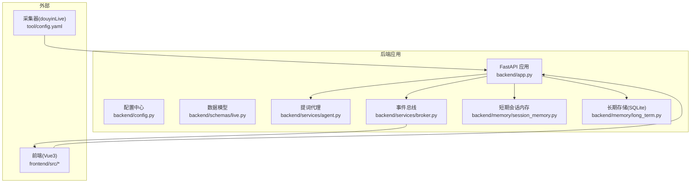
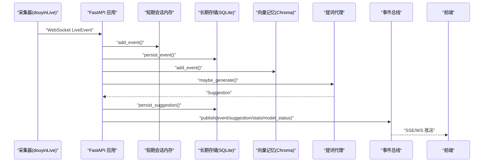
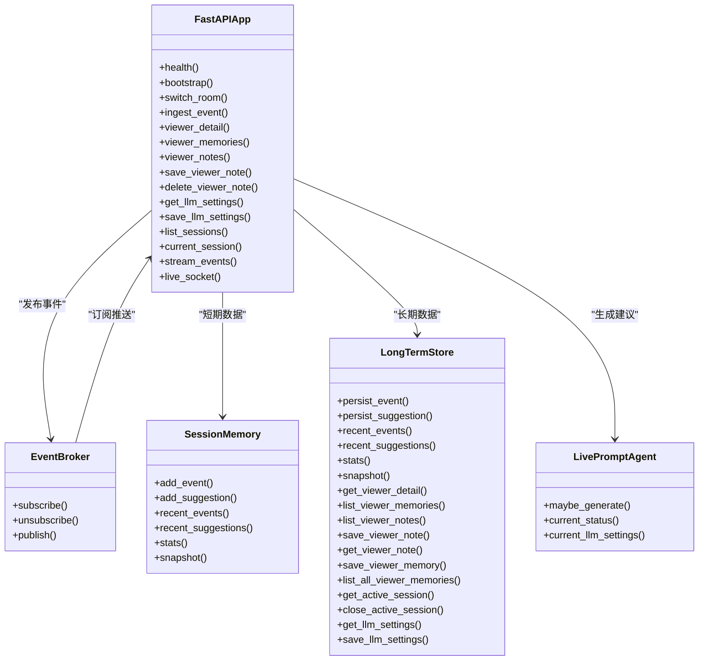

# API接口参考

<cite>
**本文引用的文件**
- [backend/app.py](file://backend/app.py)
- [backend/config.py](file://backend/config.py)
- [backend/schemas/live.py](file://backend/schemas/live.py)
- [backend/services/agent.py](file://backend/services/agent.py)
- [backend/services/broker.py](file://backend/services/broker.py)
- [backend/memory/session_memory.py](file://backend/memory/session_memory.py)
- [backend/memory/long_term.py](file://backend/memory/long_term.py)
- [README.md](file://README.md)
- [USAGE.md](file://USAGE.md)
- [requirements.txt](file://requirements.txt)
- [tests/test_agent.py](file://tests/test_agent.py)
- [tests/test_llm_settings.py](file://tests/test_llm_settings.py)
- [tool/config.yaml](file://tool/config.yaml)
</cite>

## 目录
1. [简介](#简介)
2. [项目结构](#项目结构)
3. [核心组件](#核心组件)
4. [架构总览](#架构总览)
5. [详细接口说明](#详细接口说明)
6. [依赖关系分析](#依赖关系分析)
7. [性能与容量规划](#性能与容量规划)
8. [故障排查与调试](#故障排查与调试)
9. [安全与合规](#安全与合规)
10. [版本与迁移](#版本与迁移)
11. [结论](#结论)

## 简介
本文件为 DouYin_llm 后端 API 的完整接口参考，覆盖 RESTful API 与 WebSocket 实时推送接口，涵盖健康检查、房间切换、事件注入、观众画像与笔记、LLM 设置、SSE 实时流等核心能力。文档同时提供协议特定示例、错误处理策略、安全考虑、性能优化建议与调试方法，帮助开发者快速集成与稳定运行。

## 项目结构
后端采用 FastAPI 提供 REST API 与实时推送，核心模块包括：
- 应用入口与路由：backend/app.py
- 配置中心：backend/config.py
- 数据模型：backend/schemas/live.py
- 业务逻辑：backend/services/agent.py、backend/services/broker.py
- 存储层：backend/memory/session_memory.py（短期会话）、backend/memory/long_term.py（长期存储）
- 工具与采集：tool/config.yaml（采集器配置）

图表来源
- [backend/app.py:108-285](file://backend/app.py#L108-L285)
- [backend/config.py:40-113](file://backend/config.py#L40-L113)
- [backend/services/broker.py:10-40](file://backend/services/broker.py#L10-L40)
- [backend/memory/session_memory.py:17-113](file://backend/memory/session_memory.py#L17-L113)
- [backend/memory/long_term.py:44-967](file://backend/memory/long_term.py#L44-L967)

章节来源
- [README.md:32-44](file://README.md#L32-L44)
- [backend/app.py:108-285](file://backend/app.py#L108-L285)

## 核心组件
- FastAPI 应用与生命周期：健康检查、房间切换、事件注入、SSE/WS 实时推送、观众与设置相关接口
- 配置中心：环境变量优先于代码默认值，支持 LLM 模式、嵌入模式、Redis/Chroma 等可选依赖
- 数据模型：LiveEvent、Suggestion、ViewerMemory、SessionStats、ModelStatus、SessionSnapshot
- 事件总线：进程内广播，支持 SSE 与 WebSocket 订阅
- 存储层：短期会话内存（可选 Redis）、长期存储（SQLite）、向量记忆（Chroma）
- 提词代理：OpenAI 兼容/规则双通道，具备降级与状态上报

章节来源
- [backend/app.py:13-36](file://backend/app.py#L13-L36)
- [backend/config.py:40-113](file://backend/config.py#L40-L113)
- [backend/schemas/live.py:8-111](file://backend/schemas/live.py#L8-L111)
- [backend/services/broker.py:10-40](file://backend/services/broker.py#L10-L40)
- [backend/memory/session_memory.py:17-113](file://backend/memory/session_memory.py#L17-L113)
- [backend/memory/long_term.py:44-967](file://backend/memory/long_term.py#L44-L967)
- [backend/services/agent.py:23-496](file://backend/services/agent.py#L23-L496)

## 架构总览
后端通过 FastAPI 提供 REST API 与实时推送，采集器将抖音直播流标准化为 LiveEvent，经短期/长期存储与向量记忆沉淀，再由提词代理生成建议并通过 SSE/WS 推送至前端。

图表来源
- [backend/app.py:73-102](file://backend/app.py#L73-L102)
- [backend/services/broker.py:28-40](file://backend/services/broker.py#L28-L40)
- [backend/services/agent.py:105-142](file://backend/services/agent.py#L105-L142)
- [backend/memory/session_memory.py:42-64](file://backend/memory/session_memory.py#L42-L64)
- [backend/memory/long_term.py:454-488](file://backend/memory/long_term.py#L454-L488)

## 详细接口说明

### 健康检查
- 方法：GET
- 路径：/health
- 请求参数：无
- 响应：包含运行状态、当前房间与活动会话摘要
- 示例：curl http://127.0.0.1:8010/health

章节来源
- [backend/app.py:129-135](file://backend/app.py#L129-L135)

### 房间管理

#### 初始化/引导
- 方法：GET
- 路径：/api/bootstrap
- 查询参数：
  - room_id：可选，目标房间ID
- 响应：SessionSnapshot（最近事件、建议、统计、模型状态）
- 示例：curl "http://127.0.0.1:8010/api/bootstrap?room_id=ROOM_ID"

章节来源
- [backend/app.py:138-141](file://backend/app.py#L138-L141)
- [backend/schemas/live.py:103-111](file://backend/schemas/live.py#L103-L111)

#### 切换房间
- 方法：POST
- 路径：/api/room
- 请求体：RoomSwitchRequest（room_id）
- 响应：SessionSnapshot
- 行为：关闭当前活动会话、切换采集器房间、返回新快照
- 示例：curl -X POST http://127.0.0.1:8010/api/room -H "Content-Type: application/json" -d '{"room_id":"NEW_ROOM_ID"}'

章节来源
- [backend/app.py:144-155](file://backend/app.py#L144-L155)
- [backend/app.py:38-39](file://backend/app.py#L38-L39)

### 事件处理

#### 手动注入事件（联调/回放）
- 方法：POST
- 路径：/api/events
- 请求体：LiveEvent
- 响应：包含 accepted、event_id、session_id、建议（如有）
- 示例：curl -X POST http://127.0.0.1:8010/api/events -H "Content-Type: application/json" -d '{...LiveEvent JSON...}'

章节来源
- [backend/app.py:158-166](file://backend/app.py#L158-L166)
- [backend/schemas/live.py:29-44](file://backend/schemas/live.py#L29-L44)

#### 实时事件流（SSE）
- 方法：GET
- 路径：/api/events/stream
- 查询参数：
  - room_id：可选，过滤房间
- 响应：SSE 流，事件类型包括 event、suggestion、stats、model_status
- 示例：curl "http://127.0.0.1:8010/api/events/stream?room_id=ROOM_ID"

章节来源
- [backend/app.py:252-271](file://backend/app.py#L252-L271)

#### 实时事件流（WebSocket）
- 方法：WS
- 路径：/ws/live
- 握手：接受连接后立即下发 bootstrap（SessionSnapshot）
- 消息类型：
  - event：LiveEvent
  - suggestion：Suggestion
  - stats：SessionStats
  - model_status：ModelStatus
- 示例：ws://127.0.0.1:8010/ws/live

章节来源
- [backend/app.py:274-285](file://backend/app.py#L274-L285)
- [backend/services/broker.py:10-40](file://backend/services/broker.py#L10-L40)

### 观众管理

#### 获取观众详情
- 方法：GET
- 路径：/api/viewer
- 查询参数：
  - room_id：可选
  - viewer_id：可选
  - nickname：可选
- 响应：观众详情（含画像、记忆、笔记、会话历史等）
- 错误：404 未找到

章节来源
- [backend/app.py:169-175](file://backend/app.py#L169-L175)
- [backend/memory/long_term.py:559-598](file://backend/memory/long_term.py#L559-L598)

#### 观众记忆列表
- 方法：GET
- 路径：/api/viewer/memories
- 查询参数：
  - room_id：可选
  - viewer_id：必填
  - limit：默认20
- 响应：items 数组（ViewerMemory 字典）

章节来源
- [backend/app.py:178-184](file://backend/app.py#L178-L184)
- [backend/memory/long_term.py:706-720](file://backend/memory/long_term.py#L706-L720)

#### 观众笔记列表
- 方法：GET
- 路径：/api/viewer/notes
- 查询参数：
  - room_id：可选
  - viewer_id：必填
  - limit：默认20
- 响应：items 数组（笔记字典）

章节来源
- [backend/app.py:187-193](file://backend/app.py#L187-L193)
- [backend/memory/long_term.py:654-666](file://backend/memory/long_term.py#L654-L666)

#### 创建/更新观众笔记
- 方法：POST
- 路径：/api/viewer/notes
- 请求体：ViewerNoteUpsertRequest（room_id、viewer_id、content、author、is_pinned、note_id）
- 响应：保存后的笔记详情
- 错误：400 缺少必要字段

章节来源
- [backend/app.py:196-221](file://backend/app.py#L196-L221)
- [backend/app.py:42-48](file://backend/app.py#L42-L48)
- [backend/memory/long_term.py:800-840](file://backend/memory/long_term.py#L800-L840)

#### 删除观众笔记
- 方法：DELETE
- 路径：/api/viewer/notes/{note_id}
- 响应：{"deleted": true, "note_id": note_id}
- 错误：404 未找到

章节来源
- [backend/app.py:217-221](file://backend/app.py#L217-L221)
- [backend/memory/long_term.py:800-840](file://backend/memory/long_term.py#L800-L840)

### 设置管理

#### 获取 LLM 设置
- 方法：GET
- 路径：/api/settings/llm
- 响应：当前模型与系统提示词（保存在 app_settings）

章节来源
- [backend/app.py:224-226](file://backend/app.py#L224-L226)
- [backend/services/agent.py:48-59](file://backend/services/agent.py#L48-L59)

#### 更新 LLM 设置
- 方法：PUT
- 路径：/api/settings/llm
- 请求体：LlmSettingsUpdateRequest（model、system_prompt）
- 响应：保存结果
- 错误：400 缺少 model

章节来源
- [backend/app.py:229-234](file://backend/app.py#L229-L234)
- [backend/services/agent.py:48-59](file://backend/services/agent.py#L48-L59)

### 会话与统计

#### 会话列表
- 方法：GET
- 路径：/api/sessions
- 查询参数：
  - room_id：可选
  - status：可选
  - limit：默认20
- 响应：items 数组（会话记录）

章节来源
- [backend/app.py:237-241](file://backend/app.py#L237-L241)
- [backend/memory/long_term.py:136-149](file://backend/memory/long_term.py#L136-L149)

#### 当前会话
- 方法：GET
- 路径：/api/sessions/current
- 查询参数：
  - room_id：可选
- 响应：当前活动会话或空对象

章节来源
- [backend/app.py:244-249](file://backend/app.py#L244-L249)
- [backend/memory/long_term.py:323-334](file://backend/memory/long_term.py#L323-L334)

## 依赖关系分析

图表来源
- [backend/app.py:108-285](file://backend/app.py#L108-L285)
- [backend/services/broker.py:10-40](file://backend/services/broker.py#L10-L40)
- [backend/memory/session_memory.py:17-113](file://backend/memory/session_memory.py#L17-L113)
- [backend/memory/long_term.py:44-967](file://backend/memory/long_term.py#L44-L967)
- [backend/services/agent.py:23-496](file://backend/services/agent.py#L23-L496)

## 性能与容量规划
- SSE/WS 订阅端：事件总线采用 asyncio.Queue，支持多订阅并发；当队列满时会移除过期订阅，避免内存泄漏
- Redis 可选：短期会话内存可退化为进程内内存，Redis 模式下支持 TTL 控制热数据生命周期
- SQLite：事件/建议/观众画像/笔记/会话等表均建立索引，支持按房间、时间、事件类型等高效查询
- 向量检索：Chroma 向量库支持相似度召回，结合语义事件/记忆阈值与查询上限控制延迟与吞吐
- LLM 调用：OpenAI 兼容接口支持超时、网络错误、JSON 解析失败等降级策略，失败时自动回退规则

章节来源
- [backend/services/broker.py:10-40](file://backend/services/broker.py#L10-L40)
- [backend/memory/session_memory.py:17-113](file://backend/memory/session_memory.py#L17-L113)
- [backend/memory/long_term.py:216-229](file://backend/memory/long_term.py#L216-L229)
- [backend/services/agent.py:200-217](file://backend/services/agent.py#L200-L217)

## 故障排查与调试
- 健康检查：访问 /health 确认房间与会话状态
- 日志：后端启动日志包含关键信息，采集器与前端日志位于 logs/
- 常见问题：
  - 页面无建议：检查采集器是否启动、ROOM_ID 是否正确、直播间是否开播
  - 模型降级：检查 LLM API Key、网络可达性、超时与限流
  - 前端无法打开：检查前端端口占用与启动脚本
- 联调工具：可使用测试用例中的 Mock 与断言辅助验证接口行为

章节来源
- [USAGE.md:130-256](file://USAGE.md#L130-L256)
- [tests/test_agent.py:116-172](file://tests/test_agent.py#L116-L172)
- [tests/test_llm_settings.py:24-60](file://tests/test_llm_settings.py#L24-L60)

## 安全与合规
- 认证与授权：当前实现为本地开发用途，未内置鉴权与多租户隔离，不建议直接暴露公网
- 传输安全：建议在生产环境中启用 HTTPS 与反向代理
- 数据保护：敏感配置通过环境变量注入，避免硬编码；注意不要上传 Cookie 至仓库
- 速率限制：未内置全局限流，建议在网关层或反向代理层添加限流策略

章节来源
- [README.md:209-211](file://README.md#L209-L211)
- [tool/config.yaml:10-15](file://tool/config.yaml#L10-L15)

## 版本与迁移
- 版本：后端应用版本号在 FastAPI 应用定义中声明
- 迁移指南：当前版本为最小可用版本，后续可能引入多房间调度、跨平台采集、观测面与模型管理策略
- 向后兼容：当前接口保持稳定，新增字段将遵循向后兼容原则

章节来源
- [backend/app.py:119](file://backend/app.py#L119)
- [README.md:205-213](file://README.md#L205-L213)

## 结论
本接口文档覆盖了 DouYin_llm 后端的核心能力：健康检查、房间管理、事件处理、观众管理与设置管理，并提供了实时推送（SSE/WS）与存储层细节。建议在本地开发与单人排练场景下使用，生产部署时补充鉴权、限流与可观测性方案。