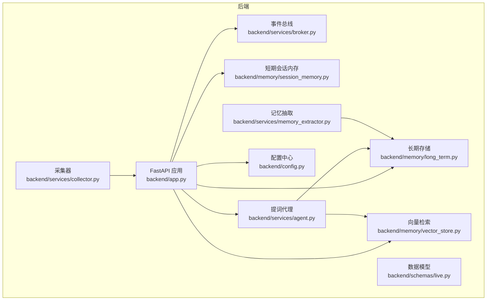
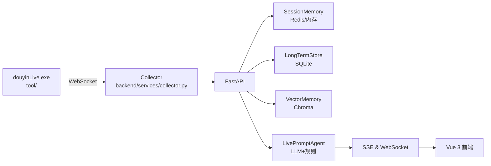
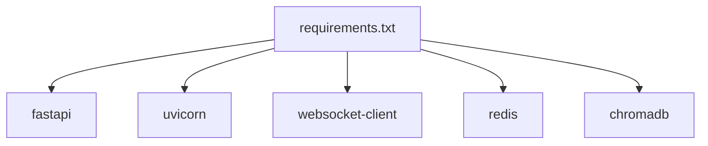
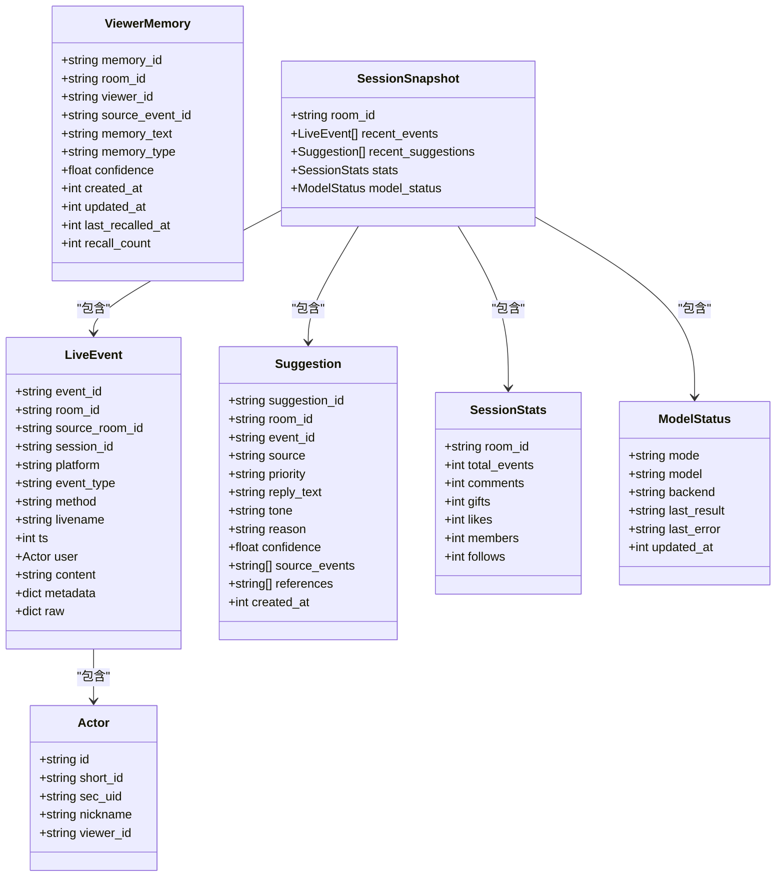
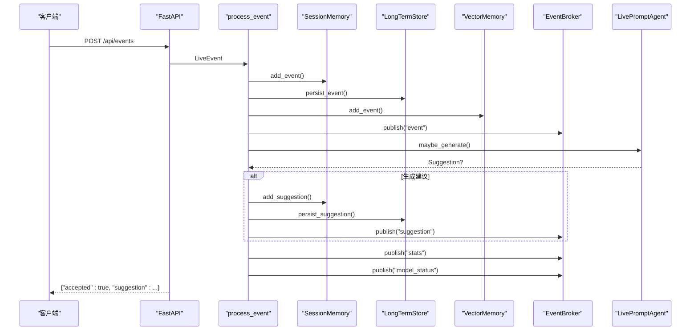
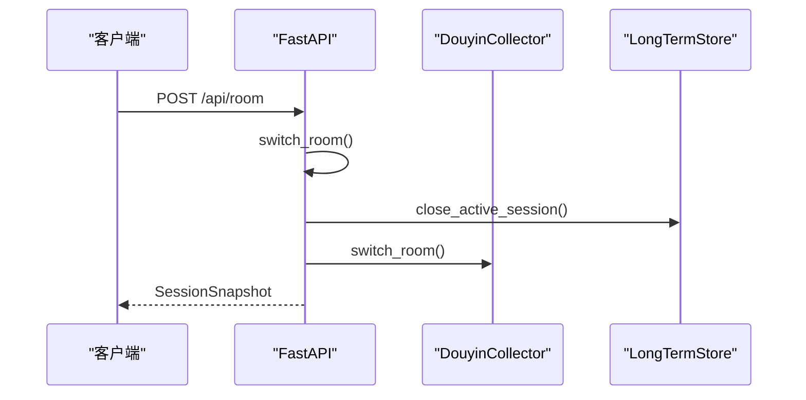
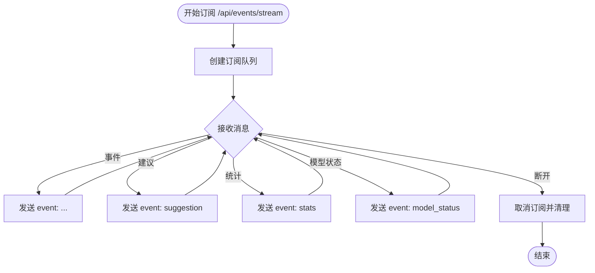

# HTTP REST API

<cite>
**本文引用的文件**
- [backend/app.py](file://backend/app.py)
- [backend/config.py](file://backend/config.py)
- [backend/schemas/live.py](file://backend/schemas/live.py)
- [backend/services/broker.py](file://backend/services/broker.py)
- [backend/services/collector.py](file://backend/services/collector.py)
- [backend/services/agent.py](file://backend/services/agent.py)
- [backend/services/memory_extractor.py](file://backend/services/memory_extractor.py)
- [backend/memory/session_memory.py](file://backend/memory/session_memory.py)
- [backend/memory/long_term.py](file://backend/memory/long_term.py)
- [backend/memory/vector_store.py](file://backend/memory/vector_store.py)
- [README.md](file://README.md)
- [requirements.txt](file://requirements.txt)
- [tests/test_agent.py](file://tests/test_agent.py)
- [tests/test_llm_settings.py](file://tests/test_llm_settings.py)
</cite>

## 目录
1. [简介](#简介)
2. [项目结构](#项目结构)
3. [核心组件](#核心组件)
4. [架构总览](#架构总览)
5. [详细接口规范](#详细接口规范)
6. [依赖关系分析](#依赖关系分析)
7. [性能考量](#性能考量)
8. [故障排查指南](#故障排查指南)
9. [结论](#结论)
10. [附录](#附录)

## 简介
本文件为 DouYin_llm 后端 HTTP REST API 的权威接口文档，覆盖健康检查、启动引导、房间切换、事件注入、观众管理、LLM 设置管理、会话管理、实时数据流（SSE 与 WebSocket）等核心接口。文档同时说明请求/响应结构、参数校验、状态码、错误处理、认证与安全注意事项，并给出关键流程的时序图与数据模型图。

## 项目结构
后端采用 FastAPI 提供 REST/SSE/WebSocket 接口，核心模块职责如下：
- 应用入口与路由：backend/app.py
- 配置中心：backend/config.py
- 数据模型：backend/schemas/live.py
- 事件总线：backend/services/broker.py
- 采集器：backend/services/collector.py
- 提词代理：backend/services/agent.py
- 记忆抽取：backend/services/memory_extractor.py
- 短期会话内存：backend/memory/session_memory.py
- 长期存储：backend/memory/long_term.py
- 向量检索：backend/memory/vector_store.py

图表来源
- [backend/app.py:108-285](file://backend/app.py#L108-L285)
- [backend/config.py:40-113](file://backend/config.py#L40-L113)
- [backend/schemas/live.py:8-111](file://backend/schemas/live.py#L8-L111)
- [backend/services/broker.py:10-40](file://backend/services/broker.py#L10-L40)
- [backend/services/collector.py:38-266](file://backend/services/collector.py#L38-L266)
- [backend/services/agent.py:23-496](file://backend/services/agent.py#L23-L496)
- [backend/services/memory_extractor.py:62-118](file://backend/services/memory_extractor.py#L62-L118)
- [backend/memory/session_memory.py:17-113](file://backend/memory/session_memory.py#L17-L113)
- [backend/memory/long_term.py:44-967](file://backend/memory/long_term.py#L44-L967)
- [backend/memory/vector_store.py:59-317](file://backend/memory/vector_store.py#L59-L317)

章节来源
- [README.md:32-44](file://README.md#L32-L44)
- [backend/app.py:108-285](file://backend/app.py#L108-L285)

## 核心组件
- FastAPI 应用与生命周期：注册 CORS、启动采集器、定义路由与处理器。
- 事件总线：进程内广播器，统一发布事件、建议、统计与模型状态。
- 提词代理：根据事件类型与上下文选择 LLM 或启发式规则生成建议。
- 记忆抽取：从评论中提取语义记忆，写入长期存储与向量库。
- 存储层：短期会话内存（Redis/内存）、长期 SQLite、向量 Chroma。
- 配置中心：集中管理运行参数与默认值。

章节来源
- [backend/app.py:27-36](file://backend/app.py#L27-L36)
- [backend/services/broker.py:10-40](file://backend/services/broker.py#L10-L40)
- [backend/services/agent.py:23-60](file://backend/services/agent.py#L23-L60)
- [backend/services/memory_extractor.py:99-118](file://backend/services/memory_extractor.py#L99-L118)
- [backend/memory/session_memory.py:17-113](file://backend/memory/session_memory.py#L17-L113)
- [backend/memory/long_term.py:44-187](file://backend/memory/long_term.py#L44-L187)
- [backend/memory/vector_store.py:59-84](file://backend/memory/vector_store.py#L59-L84)
- [backend/config.py:40-113](file://backend/config.py#L40-L113)

## 架构总览

图表来源
- [README.md:7-17](file://README.md#L7-L17)
- [backend/services/collector.py:38-60](file://backend/services/collector.py#L38-L60)
- [backend/app.py:108-126](file://backend/app.py#L108-L126)

## 详细接口规范

### 健康检查 /health
- 方法：GET
- 路径：/health
- 查询参数：无
- 请求体：无
- 成功响应：200 OK
  - 结构：包含状态、当前房间号、活动会话摘要
- 错误响应：无显式错误码；异常情况由框架返回
- 示例请求：GET http://127.0.0.1:8010/health
- 示例响应：
  - {
      "status": "ok",
      "room_id": "123456",
      "active_session": { "session_id": "...", "started_at": 1700000000000, ... }
    }

章节来源
- [backend/app.py:129-136](file://backend/app.py#L129-L136)

### 启动引导 /api/bootstrap
- 方法：GET
- 路径：/api/bootstrap
- 查询参数：
  - room_id: 字符串，可选；用于指定房间快照
- 请求体：无
- 成功响应：200 OK
  - 结构：SessionSnapshot（包含最近事件、最近建议、统计、模型状态）
- 错误响应：
  - 400 Bad Request：当 room_id 传入但为空字符串时
- 示例请求：GET http://127.0.0.1:8010/api/bootstrap?room_id=123456
- 示例响应：
  - {
      "room_id": "123456",
      "recent_events": [...],
      "recent_suggestions": [...],
      "stats": { "total_events": 120, "comments": 80, "gifts": 30, "likes": 5, "members": 2, "follows": 3 },
      "model_status": { "mode": "heuristic", "model": "heuristic", "backend": "local", ... }
    }

章节来源
- [backend/app.py:138-142](file://backend/app.py#L138-L142)
- [backend/schemas/live.py:103-111](file://backend/schemas/live.py#L103-L111)

### 房间切换 /api/room
- 方法：POST
- 路径：/api/room
- 查询参数：无
- 请求体：RoomSwitchRequest（JSON）
  - room_id: 字符串，必填
- 成功响应：200 OK
  - 结构：SessionSnapshot（切换后的房间快照）
- 错误响应：
  - 400 Bad Request：room_id 缺失或为空
- 行为说明：
  - 若目标房间不同于当前房间，关闭当前活动会话并切换采集器房间
- 示例请求：POST http://127.0.0.1:8010/api/room
  - Body: {"room_id": "123456"}
- 示例响应：同 /api/bootstrap

章节来源
- [backend/app.py:144-156](file://backend/app.py#L144-L156)
- [backend/services/collector.py:81-98](file://backend/services/collector.py#L81-L98)

### 事件注入 /api/events
- 方法：POST
- 路径：/api/events
- 查询参数：无
- 请求体：LiveEvent（JSON）
  - 包含事件标识、房间号、事件类型、用户身份、内容、时间戳、元数据等
- 成功响应：200 OK
  - 结构：{
      "accepted": true,
      "event_id": "事件ID",
      "session_id": "会话ID",
      "suggestion": 建议对象或 null
    }
- 错误响应：无显式错误码；异常由框架处理
- 行为说明：
  - 处理流程：写入短期/长期存储、向量库、生成建议、发布事件/建议/统计/模型状态
- 示例请求：POST http://127.0.0.1:8010/api/events
  - Body: 见数据模型 LiveEvent
- 示例响应：
  - {
      "accepted": true,
      "event_id": "evt-1",
      "session_id": "sess-1",
      "suggestion": { "suggestion_id": "...", "priority": "high", "reply_text": "...", ... } 或 null
    }

章节来源
- [backend/app.py:158-167](file://backend/app.py#L158-L167)
- [backend/schemas/live.py:29-44](file://backend/schemas/live.py#L29-L44)

### 观众详情 /api/viewer
- 方法：GET
- 路径：/api/viewer
- 查询参数：
  - room_id: 字符串，可选
  - viewer_id: 字符串，可选
  - nickname: 字符串，可选
- 请求体：无
- 成功响应：200 OK
  - 结构：观众详情（包含画像、互动历史、礼物历史、会话历史等）
- 错误响应：
  - 404 Not Found：找不到观众
- 示例请求：GET http://127.0.0.1:8010/api/viewer?room_id=123456&viewer_id=v1
- 示例响应：见长期存储中的观众详情结构

章节来源
- [backend/app.py:169-176](file://backend/app.py#L169-L176)
- [backend/memory/long_term.py:559-598](file://backend/memory/long_term.py#L559-L598)

### 观众记忆列表 /api/viewer/memories
- 方法：GET
- 路径：/api/viewer/memories
- 查询参数：
  - room_id: 字符串，可选
  - viewer_id: 字符串，必填
  - limit: 整数，默认 20，最大 200
- 请求体：无
- 成功响应：200 OK
  - 结构：{
      "items": [ 观众记忆对象 ... ]
    }
- 错误响应：
  - 400 Bad Request：缺少 viewer_id
- 示例请求：GET http://127.0.0.1:8010/api/viewer/memories?room_id=123456&viewer_id=v1&limit=50
- 示例响应：
  - {
      "items": [
        { "memory_id": "...", "memory_text": "...", "memory_type": "fact", "confidence": 0.8, ... },
        ...
      ]
    }

章节来源
- [backend/app.py:178-185](file://backend/app.py#L178-L185)
- [backend/memory/long_term.py:706-721](file://backend/memory/long_term.py#L706-L721)

### 观众笔记列表 /api/viewer/notes
- 方法：GET
- 路径：/api/viewer/notes
- 查询参数：
  - room_id: 字符串，可选
  - viewer_id: 字符串，必填
  - limit: 整数，默认 20，最大 200
- 请求体：无
- 成功响应：200 OK
  - 结构：{
      "items": [ 笔记对象 ... ]
    }
- 错误响应：
  - 400 Bad Request：缺少 viewer_id
- 示例请求：GET http://127.0.0.1:8010/api/viewer/notes?room_id=123456&viewer_id=v1&limit=30
- 示例响应：
  - {
      "items": [
        { "note_id": "...", "author": "主播", "content": "...", "is_pinned": false, "created_at": 1700000000000, "updated_at": 1700000000000 },
        ...
      ]
    }

章节来源
- [backend/app.py:187-194](file://backend/app.py#L187-L194)
- [backend/memory/long_term.py:654-666](file://backend/memory/long_term.py#L654-L666)

### 新增/更新观众笔记 /api/viewer/notes
- 方法：POST
- 路径：/api/viewer/notes
- 查询参数：无
- 请求体：ViewerNoteUpsertRequest（JSON）
  - room_id: 字符串，必填
  - viewer_id: 字符串，必填
  - content: 字符串，必填
  - author: 字符串，可选，默认“主播”
  - is_pinned: 布尔，可选，默认 false
  - note_id: 字符串，可选；存在时表示更新
- 成功响应：200 OK
  - 结构：保存后的笔记对象
- 错误响应：
  - 400 Bad Request：缺少必要字段
- 示例请求：POST http://127.0.0.1:8010/api/viewer/notes
  - Body: 见请求模型
- 示例响应：保存后的笔记对象

章节来源
- [backend/app.py:196-222](file://backend/app.py#L196-L222)
- [backend/schemas/live.py:42-49](file://backend/schemas/live.py#L42-L49)

### 删除观众笔记 /api/viewer/notes/{note_id}
- 方法：DELETE
- 路径：/api/viewer/notes/{note_id}
- 查询参数：无
- 请求体：无
- 成功响应：200 OK
  - 结构：{
      "deleted": true,
      "note_id": "笔记ID"
    }
- 错误响应：
  - 404 Not Found：笔记不存在
- 示例请求：DELETE http://127.0.0.1:8010/api/viewer/notes/note-1
- 示例响应：
  - {
      "deleted": true,
      "note_id": "note-1"
    }

章节来源
- [backend/app.py:217-222](file://backend/app.py#L217-L222)
- [backend/memory/long_term.py:668-675](file://backend/memory/long_term.py#L668-L675)

### LLM 设置查询 /api/settings/llm
- 方法：GET
- 路径：/api/settings/llm
- 查询参数：无
- 请求体：无
- 成功响应：200 OK
  - 结构：{
      "model": "模型名",
      "system_prompt": "系统提示词",
      "default_model": "默认模型名",
      "default_system_prompt": "默认提示词"
    }
- 错误响应：无显式错误码
- 示例请求：GET http://127.0.0.1:8010/api/settings/llm
- 示例响应：
  - {
      "model": "qwen-plus-latest",
      "system_prompt": "你是直播间实时提词器...",
      "default_model": "gpt-4.1-mini",
      "default_system_prompt": "你是直播间实时提词器..."
    }

章节来源
- [backend/app.py:224-227](file://backend/app.py#L224-L227)
- [backend/services/agent.py:48-60](file://backend/services/agent.py#L48-L60)

### 更新 LLM 设置 /api/settings/llm
- 方法：PUT
- 路径：/api/settings/llm
- 查询参数：无
- 请求体：LlmSettingsUpdateRequest（JSON）
  - model: 字符串，必填
  - system_prompt: 字符串，可选
- 成功响应：200 OK
  - 结构：保存后的设置对象
- 错误响应：
  - 400 Bad Request：缺少 model
- 示例请求：PUT http://127.0.0.1:8010/api/settings/llm
  - Body: {"model": "qwen-max", "system_prompt": "自定义提示词"}
- 示例响应：保存后的设置对象

章节来源
- [backend/app.py:229-235](file://backend/app.py#L229-L235)
- [backend/schemas/live.py:51-54](file://backend/schemas/live.py#L51-L54)

### 会话列表 /api/sessions
- 方法：GET
- 路径：/api/sessions
- 查询参数：
  - room_id: 字符串，可选
  - status: 字符串，可选
  - limit: 整数，默认 20，最大 200
- 请求体：无
- 成功响应：200 OK
  - 结构：{
      "items": [ 会话对象 ... ]
    }
- 错误响应：无显式错误码
- 示例请求：GET http://127.0.0.1:8010/api/sessions?room_id=123456&status=active&limit=50
- 示例响应：
  - {
      "items": [
        { "session_id": "...", "room_id": "123456", "status": "active", "started_at": 1700000000000, "last_event_at": 1700000000000, ... },
        ...
      ]
    }

章节来源
- [backend/app.py:237-242](file://backend/app.py#L237-L242)
- [backend/memory/long_term.py:634-652](file://backend/memory/long_term.py#L634-L652)

### 当前会话 /api/sessions/current
- 方法：GET
- 路径：/api/sessions/current
- 查询参数：
  - room_id: 字符串，可选
- 请求体：无
- 成功响应：200 OK
  - 结构：当前活动会话对象或空对象
- 错误响应：无显式错误码
- 示例请求：GET http://127.0.0.1:8010/api/sessions/current?room_id=123456
- 示例响应：
  - {
      "session_id": "...",
      "room_id": "123456",
      "status": "active",
      "started_at": 1700000000000,
      "last_event_at": 1700000000000,
      "event_count": 120,
      "comment_count": 80,
      "gift_event_count": 30,
      "join_count": 2
    }

章节来源
- [backend/app.py:244-250](file://backend/app.py#L244-L250)
- [backend/memory/long_term.py:323-358](file://backend/memory/long_term.py#L323-L358)

### 实时事件流（SSE）/api/events/stream
- 方法：GET
- 路径：/api/events/stream
- 查询参数：
  - room_id: 字符串，可选；过滤房间
- 请求体：无
- 成功响应：200 OK，text/event-stream
  - 事件类型：event、suggestion、stats、model_status
  - 数据格式：JSON 字符串
  - 连接保持：心跳与重试
- 错误响应：无显式错误码
- 示例请求：GET http://127.0.0.1:8010/api/events/stream?room_id=123456
- 示例响应片段：
  - event: event
    data: {"event_id":"evt-1","room_id":"123456",...}
  - event: suggestion
    data: {"suggestion_id":"sugg-1","priority":"high",...}
  - event: stats
    data: {"room_id":"123456","total_events":120,...}
  - event: model_status
    data: {"mode":"heuristic","model":"heuristic",...}

章节来源
- [backend/app.py:252-272](file://backend/app.py#L252-L272)
- [backend/services/broker.py:28-40](file://backend/services/broker.py#L28-L40)

### 实时事件流（WebSocket）/ws/live
- 方法：WS
- 路径：/ws/live
- 握手：WebSocket 握手成功后立即推送 bootstrap 快照
- 消息格式：JSON
  - 类型：bootstrap、event、suggestion、stats、model_status
  - 数据：对应实体的 JSON
- 连接管理：断开自动取消订阅
- 示例消息：
  - {"type": "bootstrap", "data": {...}}
  - {"type": "event", "data": {...}}
  - {"type": "suggestion", "data": {...}}
  - {"type": "stats", "data": {...}}
  - {"type": "model_status", "data": {...}}

章节来源
- [backend/app.py:274-285](file://backend/app.py#L274-L285)
- [backend/services/broker.py:16-27](file://backend/services/broker.py#L16-L27)

## 依赖关系分析
- FastAPI 依赖项：websocket-client、fastapi、uvicorn、redis、chromadb
- 运行时依赖：Redis（可选）、Chroma（可选）、SQLite（必需）

图表来源
- [requirements.txt:1-6](file://requirements.txt#L1-L6)

章节来源
- [requirements.txt:1-6](file://requirements.txt#L1-L6)

## 性能考量
- SSE/WS 广播：事件总线采用异步队列，避免阻塞；当队列满时会移除陈旧订阅。
- 短期会话内存：Redis 模式下 TTL 控制热数据生命周期；内存模式下使用固定长度双端队列。
- 向量检索：Chroma 可选；无 Chroma 时使用内存级近似检索，受查询令牌集与阈值影响。
- LLM 推理：超时与降级策略；失败时回退至启发式规则，保障时延与稳定性。
- 数据库索引：SQLite 创建多处索引以优化查询性能。

章节来源
- [backend/services/broker.py:31-40](file://backend/services/broker.py#L31-L40)
- [backend/memory/session_memory.py:24-64](file://backend/memory/session_memory.py#L24-L64)
- [backend/memory/vector_store.py:86-134](file://backend/memory/vector_store.py#L86-L134)
- [backend/services/agent.py:200-217](file://backend/services/agent.py#L200-L217)
- [backend/memory/long_term.py:216-229](file://backend/memory/long_term.py#L216-L229)

## 故障排查指南
- 健康检查失败
  - 检查后端进程是否启动、端口是否正确
  - 查看日志定位异常
- SSE/WS 无数据
  - 确认采集器已连接且房间号一致
  - 检查事件总线订阅是否建立
- LLM 推理失败
  - 检查 API Key、Base URL、超时设置
  - 查看模型状态返回的错误码
- 观众数据缺失
  - 确认 viewer_id 与 nickname 参数组合是否正确
  - 检查长期存储表是否存在对应记录

章节来源
- [backend/app.py:129-136](file://backend/app.py#L129-L136)
- [backend/services/broker.py:16-27](file://backend/services/broker.py#L16-L27)
- [backend/services/agent.py:330-393](file://backend/services/agent.py#L330-L393)
- [backend/memory/long_term.py:559-598](file://backend/memory/long_term.py#L559-L598)

## 结论
本文档系统性梳理了 DouYin_llm 后端 HTTP REST API 的全部核心接口，涵盖数据模型、实时流实现、错误处理与性能要点。建议在生产环境中结合 Redis 与 Chroma 以提升并发与检索能力，并完善鉴权与可观测性建设。

## 附录

### 数据模型与关系

图表来源
- [backend/schemas/live.py:8-111](file://backend/schemas/live.py#L8-L111)

### 关键流程时序图

#### 事件注入与建议生成

图表来源
- [backend/app.py:73-102](file://backend/app.py#L73-L102)
- [backend/memory/session_memory.py:42-84](file://backend/memory/session_memory.py#L42-L84)
- [backend/memory/long_term.py:454-488](file://backend/memory/long_term.py#L454-L488)
- [backend/memory/vector_store.py:149-171](file://backend/memory/vector_store.py#L149-L171)
- [backend/services/broker.py:28-40](file://backend/services/broker.py#L28-L40)
- [backend/services/agent.py:105-142](file://backend/services/agent.py#L105-L142)

#### 房间切换流程

图表来源
- [backend/app.py:144-156](file://backend/app.py#L144-L156)
- [backend/services/collector.py:81-98](file://backend/services/collector.py#L81-L98)
- [backend/memory/long_term.py:323-334](file://backend/memory/long_term.py#L323-L334)

#### SSE 实时流

图表来源
- [backend/app.py:252-272](file://backend/app.py#L252-L272)
- [backend/services/broker.py:16-27](file://backend/services/broker.py#L16-L27)