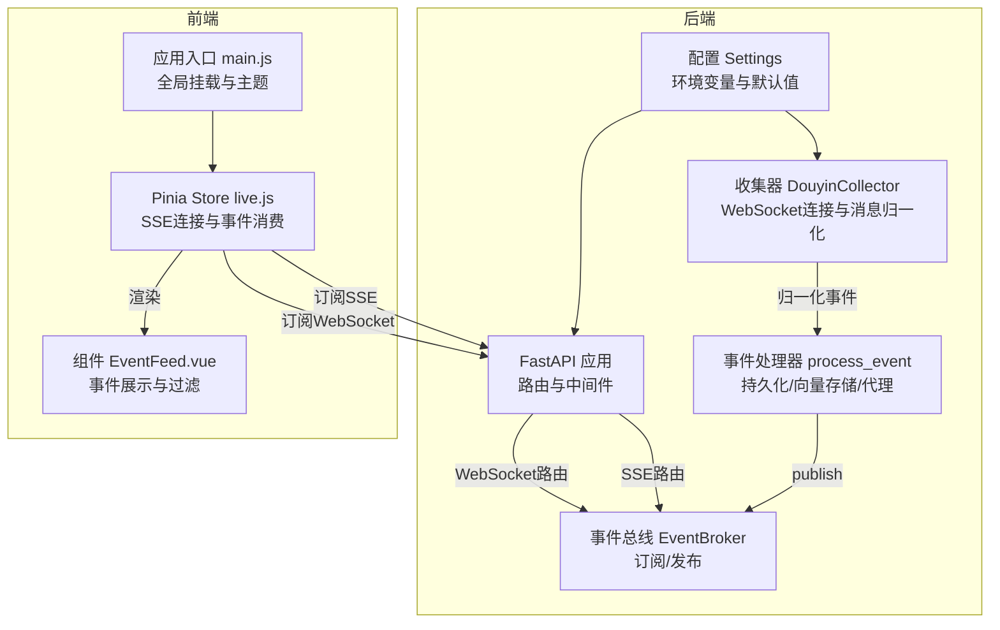
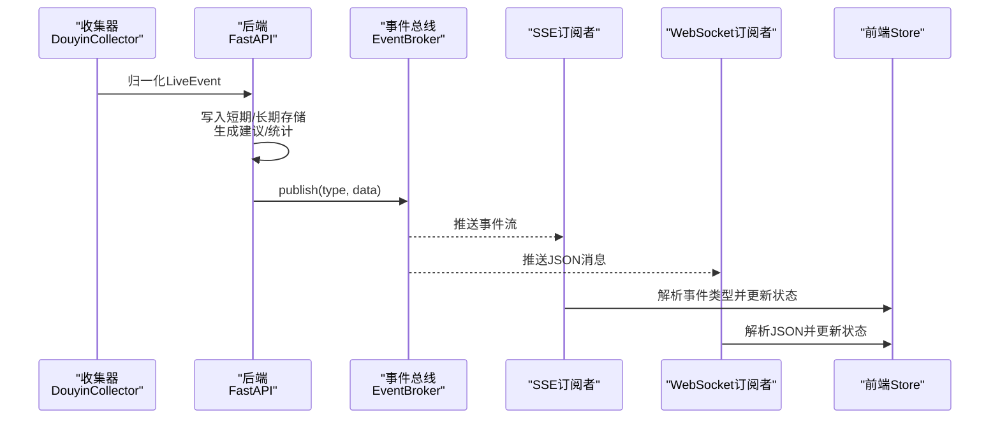
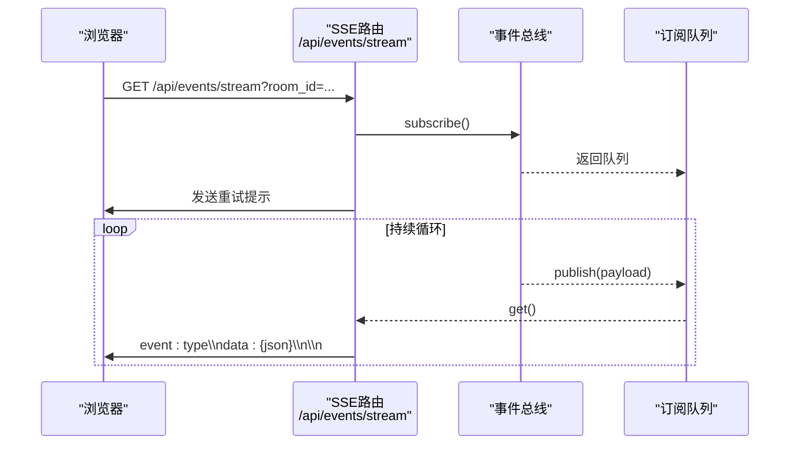
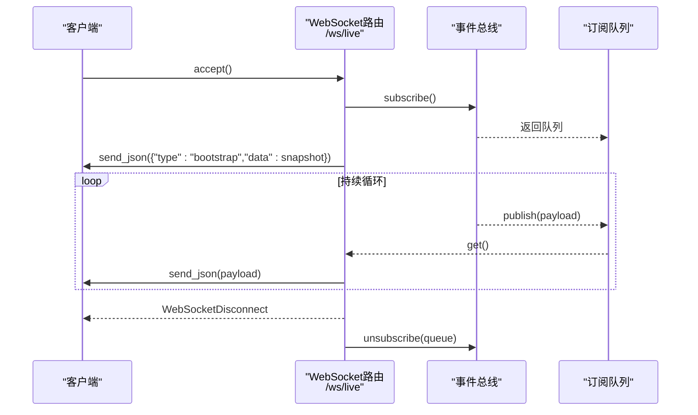
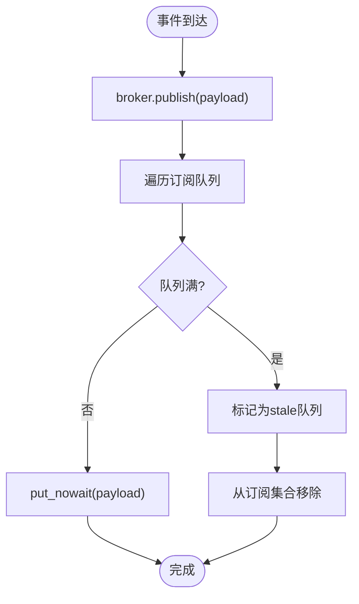
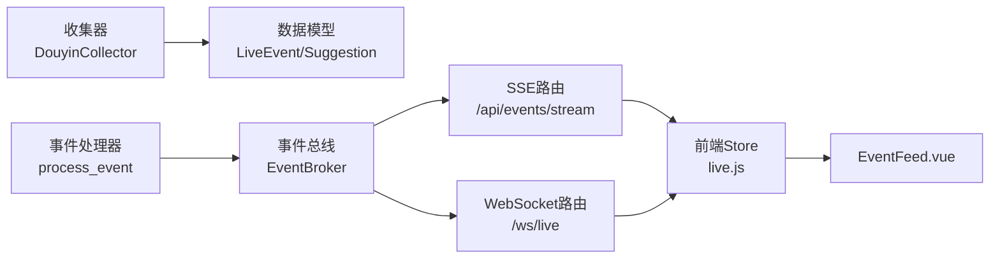

# 实时通信接口

<cite>
**本文档引用的文件**
- [backend/app.py](file://backend/app.py)
- [backend/schemas/live.py](file://backend/schemas/live.py)
- [backend/services/broker.py](file://backend/services/broker.py)
- [backend/services/collector.py](file://backend/services/collector.py)
- [backend/services/agent.py](file://backend/services/agent.py)
- [backend/memory/session_memory.py](file://backend/memory/session_memory.py)
- [backend/config.py](file://backend/config.py)
- [frontend/src/stores/live.js](file://frontend/src/stores/live.js)
- [frontend/src/components/EventFeed.vue](file://frontend/src/components/EventFeed.vue)
- [frontend/src/main.js](file://frontend/src/main.js)
- [tool/README.md](file://tool/README.md)
- [deprecated/client.py](file://deprecated/client.py)
</cite>

## 目录
1. [简介](#简介)
2. [项目结构](#项目结构)
3. [核心组件](#核心组件)
4. [架构总览](#架构总览)
5. [详细组件分析](#详细组件分析)
6. [依赖关系分析](#依赖关系分析)
7. [性能考虑](#性能考虑)
8. [故障排查指南](#故障排查指南)
9. [结论](#结论)
10. [附录](#附录)

## 简介
本文件面向DouYin_llm项目的实时通信接口，系统性说明两类实时通信能力：
- Server-Sent Events (SSE)：通过HTTP流式接口向浏览器推送事件与建议等数据。
- WebSocket：通过持久连接提供双向通信，用于前端与后端之间的即时交互。

文档覆盖事件发布订阅模式、消息队列工作原理、事件流格式与事件类型、消息格式规范、心跳与断线重连策略、客户端实现示例、错误处理机制、性能优化建议以及调试工具使用方法。

## 项目结构
后端采用FastAPI框架，前端使用Vue+Pinia进行状态管理与UI渲染。实时通信接口位于后端路由中，事件通过内部事件总线分发至SSE与WebSocket订阅者。

图表来源
- [backend/app.py:274-285](file://backend/app.py#L274-L285)
- [backend/services/broker.py:10-40](file://backend/services/broker.py#L10-L40)
- [backend/services/collector.py:38-266](file://backend/services/collector.py#L38-L266)
- [frontend/src/stores/live.js:474-523](file://frontend/src/stores/live.js#L474-L523)

章节来源
- [backend/app.py:108-127](file://backend/app.py#L108-L127)
- [backend/config.py:40-113](file://backend/config.py#L40-L113)
- [frontend/src/main.js:1-17](file://frontend/src/main.js#L1-17)

## 核心组件
- 事件总线(EventBroker)：维护订阅队列集合，负责将消息广播给所有订阅者，并清理阻塞队列。
- 事件处理器(process_event)：接收LiveEvent，写入短期/长期存储，触发向量记忆，生成建议与统计，同时通过总线发布多类事件。
- SSE路由(/api/events/stream)：基于StreamingResponse返回text/event-stream，按事件类型分发数据。
- WebSocket路由(/ws/live)：接受WebSocket连接，向订阅者推送JSON消息。
- 前端Store(live.js)：封装SSE连接、事件解析与状态更新，提供房间切换、过滤与错误处理。
- 数据模型(schemas/live.py)：定义LiveEvent、Suggestion、SessionStats、ModelStatus等核心数据结构。

章节来源
- [backend/services/broker.py:10-40](file://backend/services/broker.py#L10-L40)
- [backend/app.py:73-102](file://backend/app.py#L73-L102)
- [backend/app.py:252-271](file://backend/app.py#L252-L271)
- [backend/app.py:274-285](file://backend/app.py#L274-L285)
- [frontend/src/stores/live.js:474-523](file://frontend/src/stores/live.js#L474-L523)
- [backend/schemas/live.py:29-111](file://backend/schemas/live.py#L29-L111)

## 架构总览
实时通信整体流程如下：
- 外部WebSocket收集器(DouyinCollector)连接本地服务，接收原始直播消息并归一化为LiveEvent。
- 后端事件处理器将事件写入短期/长期存储，触发向量记忆，生成建议与统计。
- 事件通过EventBroker发布，SSE与WebSocket订阅者分别消费。
- 前端通过SSE或WebSocket接收事件，更新UI与状态。

图表来源
- [backend/services/collector.py:145-159](file://backend/services/collector.py#L145-L159)
- [backend/app.py:73-102](file://backend/app.py#L73-L102)
- [backend/services/broker.py:28-40](file://backend/services/broker.py#L28-L40)
- [frontend/src/stores/live.js:496-522](file://frontend/src/stores/live.js#L496-L522)

## 详细组件分析

### SSE接口：/api/events/stream
- 连接与参数
  - 查询参数room_id用于房间级过滤，未提供时推送全房间事件。
  - 初始发送重试提示，确保客户端正确处理重连。
- 事件流格式
  - 使用Server-Sent Events标准格式，事件类型通过event字段标识，数据通过data字段承载。
  - 数据为JSON字符串，包含type与data键，其中data为后端业务对象的字典表示。
- 事件类型
  - event：来自直播事件的标准化事件。
  - suggestion：AI生成的提词建议。
  - stats：房间统计（事件总数、评论数、礼物数、点赞数、成员数、关注数）。
  - model_status：模型运行状态（模式、模型名、后端、最后结果、错误、更新时间）。
- 客户端连接管理
  - 前端使用EventSource连接，监听open/error与自定义事件类型，自动进入重连状态。
  - 当房间切换时，前端关闭现有连接并重新建立新连接。
- 数据传输协议
  - 服务器端通过异步生成器yield事件行，客户端逐行解析事件类型与数据。
  - 房间过滤逻辑：仅转发与目标房间匹配的非model_status事件。

图表来源
- [backend/app.py:252-271](file://backend/app.py#L252-L271)
- [backend/services/broker.py:16-21](file://backend/services/broker.py#L16-L21)

章节来源
- [backend/app.py:252-271](file://backend/app.py#L252-L271)
- [frontend/src/stores/live.js:474-523](file://frontend/src/stores/live.js#L474-L523)

### WebSocket接口：/ws/live
- 连接建立
  - 服务器接受WebSocket连接后，订阅事件总线并将房间快照作为bootstrap消息发送给客户端。
- 消息格式规范
  - 服务器向订阅者推送JSON对象，包含type与data键。
  - 客户端收到消息后，根据type分发到对应的处理逻辑。
- 事件类型
  - 与SSE一致：event、suggestion、stats、model_status。
- 心跳机制
  - 后端未实现显式心跳；前端可通过SSE的重连机制感知连接异常。
- 断线重连策略
  - 前端在SSE连接错误时进入reconnecting状态，等待自动重连。
  - WebSocket侧通过WebSocketDisconnect异常处理取消订阅，避免资源泄漏。

图表来源
- [backend/app.py:274-285](file://backend/app.py#L274-L285)
- [backend/services/broker.py:23-26](file://backend/services/broker.py#L23-L26)

章节来源
- [backend/app.py:274-285](file://backend/app.py#L274-L285)

### 事件发布订阅模式与消息队列
- 发布订阅链路
  - 事件处理器调用broker.publish，将payload广播给所有订阅队列。
  - SSE与WebSocket各自subscribe，获得独立队列，互不影响。
- 队列与背压处理
  - 订阅队列为asyncio.Queue，若队列满则标记为stale并从订阅集合中移除，防止内存膨胀。
- 房间级过滤
  - SSE在生成器中对非model_status事件进行房间过滤，确保只推送目标房间事件。

图表来源
- [backend/services/broker.py:28-40](file://backend/services/broker.py#L28-L40)

章节来源
- [backend/services/broker.py:10-40](file://backend/services/broker.py#L10-L40)
- [backend/app.py:256-269](file://backend/app.py#L256-L269)

### 数据模型与事件类型
- LiveEvent：标准化直播事件，包含事件ID、房间ID、来源房间ID、会话ID、平台、事件类型、方法、直播间名称、时间戳、用户信息、内容、元数据与原始数据。
- Suggestion：AI生成的提词建议，包含建议ID、房间ID、事件ID、来源、优先级、回复文本、语调、原因、置信度、源事件与引用等。
- SessionStats：房间统计，包含总事件数与各类事件计数。
- ModelStatus：模型运行状态，包含模式、模型名、后端、最后结果、错误与更新时间。
- 事件类型映射
  - WebcastChatMessage → comment
  - WebcastGiftMessage → gift
  - WebcastLikeMessage → like
  - WebcastMemberMessage → member
  - WebcastSocialMessage → follow

章节来源
- [backend/schemas/live.py:29-111](file://backend/schemas/live.py#L29-L111)
- [backend/services/collector.py:22-28](file://backend/services/collector.py#L22-L28)

### 前端实现要点
- SSE连接
  - 使用EventSource连接SSE路由，监听open/error与自定义事件类型，解析JSON并更新状态。
  - 过滤器与主题持久化，支持用户选择显示的事件类型与主题切换。
- 房间切换
  - 通过POST /api/room切换房间，成功后关闭旧连接并建立新连接。
- 错误处理
  - SSE连接错误时进入reconnecting状态，避免UI冻结。
  - 房间切换失败时回滚并重连。

章节来源
- [frontend/src/stores/live.js:474-523](file://frontend/src/stores/live.js#L474-L523)
- [frontend/src/stores/live.js:525-569](file://frontend/src/stores/live.js#L525-L569)
- [frontend/src/stores/live.js:175-184](file://frontend/src/stores/live.js#L175-L184)
- [frontend/src/components/EventFeed.vue:1-214](file://frontend/src/components/EventFeed.vue#L1-L214)
- [frontend/src/main.js:1-17](file://frontend/src/main.js#L1-L17)

## 依赖关系分析
- 后端依赖
  - FastAPI：提供路由、中间件与异步上下文。
  - asyncio：事件总线与SSE生成器。
  - Redis(可选)：短期会话内存的持久化存储。
- 前端依赖
  - Vue/Pinia：状态管理与响应式更新。
  - 浏览器原生EventSource/WebSocket：实时通信。

图表来源
- [backend/services/collector.py:207-266](file://backend/services/collector.py#L207-L266)
- [backend/app.py:73-102](file://backend/app.py#L73-L102)
- [backend/services/broker.py:10-40](file://backend/services/broker.py#L10-L40)
- [frontend/src/stores/live.js:474-523](file://frontend/src/stores/live.js#L474-L523)

章节来源
- [backend/app.py:108-127](file://backend/app.py#L108-L127)
- [backend/config.py:40-113](file://backend/config.py#L40-L113)

## 性能考虑
- 队列容量与背压
  - 订阅队列满时标记stale并移除，避免内存膨胀；建议合理设置队列容量与超时。
- 房间过滤
  - SSE在服务端进行房间过滤，减少无效事件传输。
- 缓存与存储
  - SessionMemory优先使用Redis，否则使用进程内容器；Redis模式下具备TTL控制。
- 并发与线程
  - 收集器使用独立线程与ping线程，避免阻塞主事件循环。
- 建议
  - 前端限制事件列表长度，避免DOM过大。
  - 合理设置SSE重连间隔与WebSocket ping间隔，平衡实时性与资源消耗。

[本节为通用性能指导，无需特定文件引用]

## 故障排查指南
- SSE连接问题
  - 检查SSE路由是否正确返回text/event-stream，确认事件行格式。
  - 前端EventSource是否正确监听open/error与自定义事件类型。
- WebSocket连接问题
  - 确认WebSocket路由是否accept连接，检查订阅与取消订阅逻辑。
  - 观察WebSocketDisconnect异常，确保资源释放。
- 事件丢失或延迟
  - 检查EventBroker的stale队列清理逻辑，适当增大队列容量。
  - 确认process_event是否及时publish事件。
- 房间切换失败
  - 查看前端POST /api/room响应与错误信息，确认房间ID有效性。
- 配置问题
  - 检查collector_host/port/room_id等配置项，确保收集器可访问本地WebSocket服务。

章节来源
- [backend/app.py:252-271](file://backend/app.py#L252-L271)
- [backend/app.py:274-285](file://backend/app.py#L274-L285)
- [backend/services/broker.py:31-40](file://backend/services/broker.py#L31-L40)
- [frontend/src/stores/live.js:525-569](file://frontend/src/stores/live.js#L525-L569)

## 结论
DouYin_llm的实时通信接口通过事件总线实现了SSE与WebSocket的统一发布与多路分发，结合短期/长期存储与向量记忆，为直播场景提供了高效、可扩展的事件驱动架构。前端通过EventSource与WebSocket实现低耦合的实时订阅，配合过滤与主题持久化，提供良好的用户体验。建议在生产环境中关注队列容量、房间过滤与配置项校验，以确保稳定性与性能。

[本节为总结性内容，无需特定文件引用]

## 附录

### 客户端实现示例
- JavaScript(SSE)
  - 使用EventSource连接SSE路由，监听事件类型并解析JSON。
  - 参考路径：[frontend/src/stores/live.js:474-523](file://frontend/src/stores/live.js#L474-L523)
- JavaScript(WebSocket)
  - 使用WebSocket连接后端路由，接收JSON消息并分发到对应处理逻辑。
  - 参考路径：[backend/app.py:274-285](file://backend/app.py#L274-L285)
- 本地工具
  - 工具README提供了JavaScript与Go的客户端示例，便于快速接入本地WebSocket服务。
  - 参考路径：[tool/README.md:275-412](file://tool/README.md#L275-L412)

章节来源
- [frontend/src/stores/live.js:474-523](file://frontend/src/stores/live.js#L474-L523)
- [backend/app.py:274-285](file://backend/app.py#L274-L285)
- [tool/README.md:275-412](file://tool/README.md#L275-L412)

### 调试工具使用方法
- 浏览器开发者工具
  - Network面板观察SSE与WebSocket请求与响应。
  - Console查看事件解析与错误信息。
- 后端日志
  - 关注收集器连接、消息归一化与事件处理的日志输出。
  - 参考路径：[backend/services/collector.py:141-180](file://backend/services/collector.py#L141-L180)
- 前端状态
  - 通过Pinia DevTools观察connectionState、events、suggestions等状态变化。
  - 参考路径：[frontend/src/stores/live.js:75-800](file://frontend/src/stores/live.js#L75-L800)

章节来源
- [backend/services/collector.py:141-180](file://backend/services/collector.py#L141-L180)
- [frontend/src/stores/live.js:75-800](file://frontend/src/stores/live.js#L75-L800)