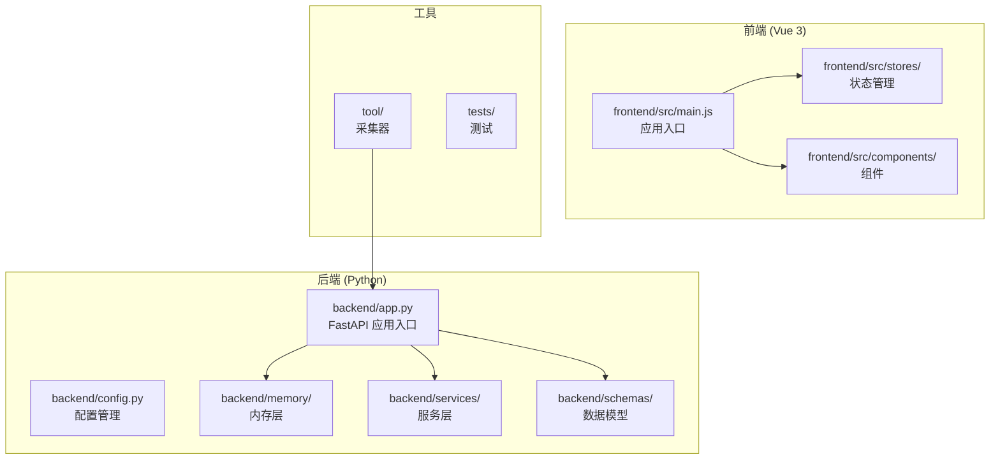
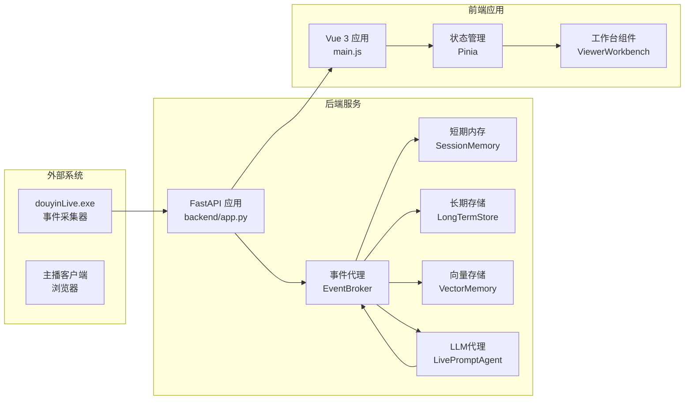
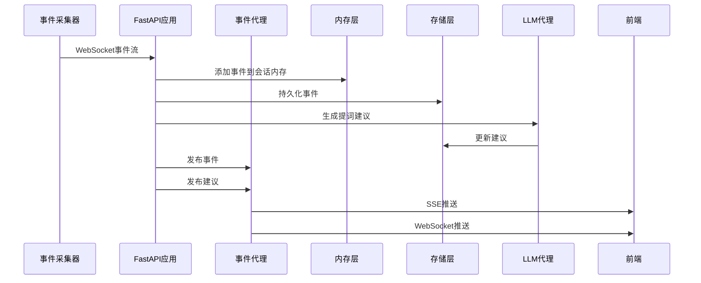
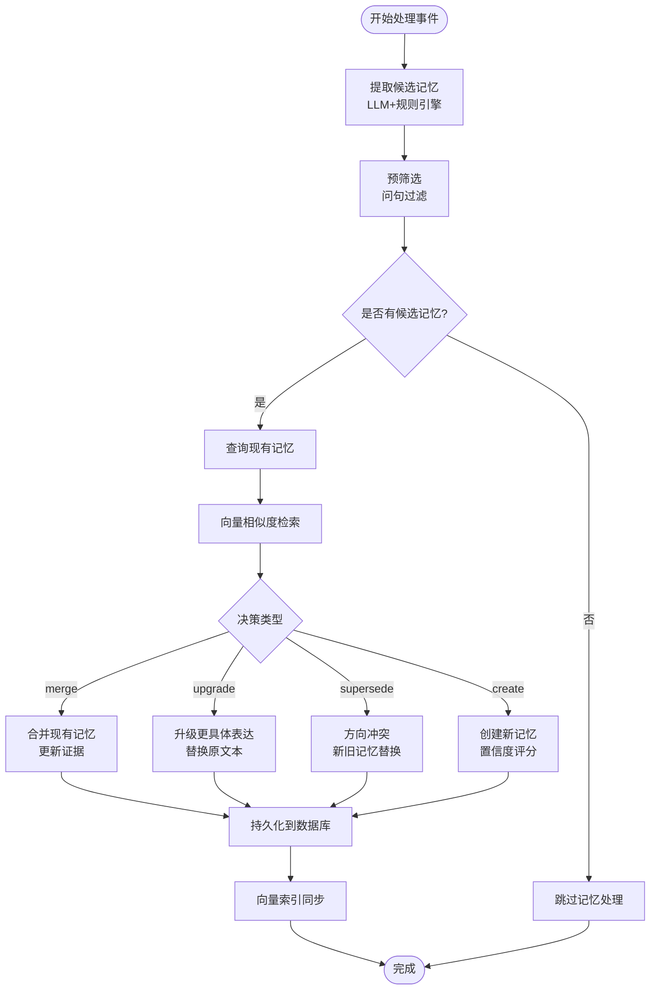
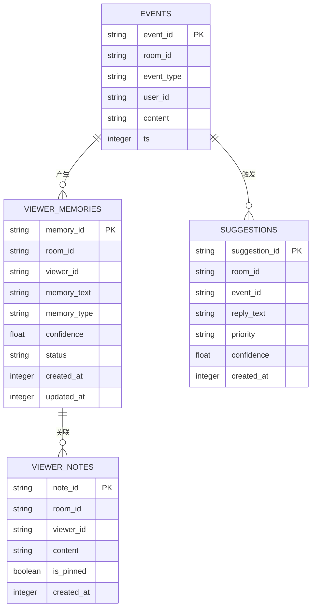
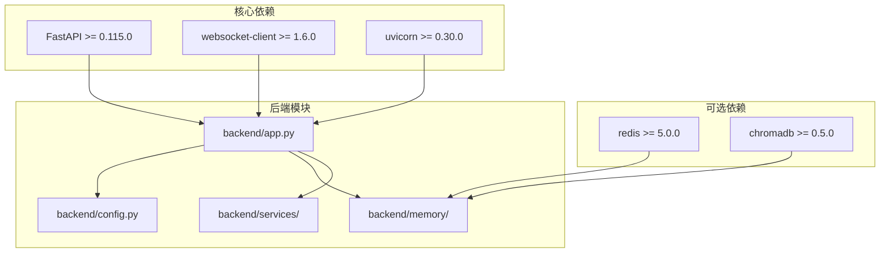
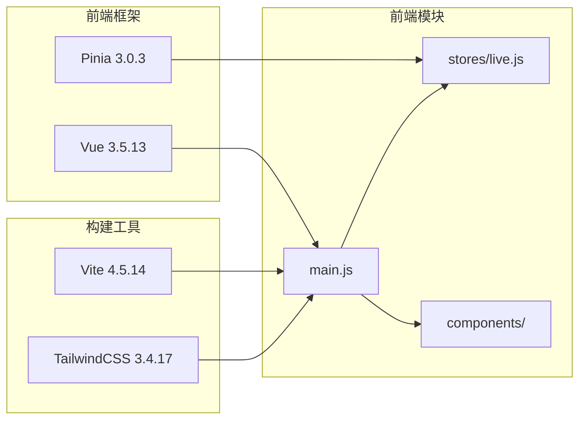

# DouYin_llm 项目文档

<cite>
**本文档引用的文件**
- [README.md](file://README.md)
- [backend/app.py](file://backend/app.py)
- [backend/config.py](file://backend/config.py)
- [backend/memory/session_memory.py](file://backend/memory/session_memory.py)
- [backend/memory/long_term.py](file://backend/memory/long_term.py)
- [backend/memory/vector_store.py](file://backend/memory/vector_store.py)
- [backend/services/agent.py](file://backend/services/agent.py)
- [backend/services/broker.py](file://backend/services/broker.py)
- [backend/schemas/live.py](file://backend/schemas/live.py)
- [frontend/src/main.js](file://frontend/src/main.js)
- [frontend/src/stores/live.js](file://frontend/src/stores/live.js)
- [frontend/src/components/ViewerWorkbench.vue](file://frontend/src/components/ViewerWorkbench.vue)
- [requirements.txt](file://requirements.txt)
- [frontend/package.json](file://frontend/package.json)
</cite>

## 目录
1. [项目概述](#项目概述)
2. [项目结构](#项目结构)
3. [核心组件](#核心组件)
4. [架构概览](#架构概览)
5. [详细组件分析](#详细组件分析)
6. [依赖关系分析](#依赖关系分析)
7. [性能考虑](#性能考虑)
8. [故障排除指南](#故障排除指南)
9. [结论](#结论)

## 项目概述

DouYin_llm 是一个面向抖音直播场景的实时提词与观众记忆工作台。该项目的核心目标不是"自动开播"，而是为主播提供一套实时辅助系统，通过接收直播间事件、沉淀观众长期记忆、进行真实语义召回，再把可操作的信息反馈到前端工作台，帮助主播更自然地接话、识别老观众、维护互动关系。

### 项目定位

该系统最适合以下直播场景：
- 聊天型直播
- 陪伴型直播  
- 人设型直播
- 需要"记住观众、理解上下文、给出下一句建议"的互动场景

### 已实现功能

- **直播事件采集**：接入 `douyinLive` 的 WebSocket 事件流，归一化为统一 `LiveEvent`
- **后端实时处理**：FastAPI 负责事件入库、观众画像聚合、记忆抽取、语义召回、提词生成与 SSE/WebSocket 推送
- **长期记忆存储**：`SQLite + Chroma` 保存观众记忆、观众备注、会话数据
- **真语义召回链路**：支持真实 embedding 与向量检索，不再依赖"历史事件召回"
- **严格语义模式**：`EMBEDDING_STRICT=true` 时，禁用 hash fallback，确保不是"口头上的语义召回"

## 项目结构

**图表来源**
- [backend/app.py:1-702](file://backend/app.py#L1-L702)
- [frontend/src/main.js:1-17](file://frontend/src/main.js#L1-L17)

**章节来源**
- [README.md:207-220](file://README.md#L207-L220)

## 核心组件

### 后端核心组件

#### FastAPI 应用入口
`backend/app.py` 是整个后端系统的核心入口点，负责：
- 初始化所有服务组件（内存、存储、向量检索、LLM代理等）
- 提供 REST API 接口
- 处理实时事件流
- 管理组件生命周期

#### 配置管理系统
`backend/config.py` 提供集中化的配置管理，包括：
- LLM 模型配置（OpenAI、DashScope、Qwen等）
- 向量嵌入配置（Cloud/OpenAI兼容接口）
- 记忆提取器配置（Ollama/规则引擎）
- 存储路径和超时参数

#### 内存管理层
系统采用分层内存架构：

**短期会话内存** (`backend/memory/session_memory.py`)
- 使用 Redis 作为首选存储，支持热数据缓存
- 无 Redis 时自动降级到进程内 deque
- 存储最近事件和建议，支持 TTL 过期

**长期存储** (`backend/memory/long_term.py`)
- 基于 SQLite 的持久化存储
- 支持复杂的业务表结构（事件、建议、观众记忆、备注等）
- 提供完整的 CRUD 操作和查询接口

**向量存储** (`backend/memory/vector_store.py`)
- 基于 Chroma 的向量数据库
- 支持语义相似度检索
- 实现严格模式下的错误处理

#### 服务层组件

**LivePromptAgent** (`backend/services/agent.py`)
- 负责生成直播提词建议
- 集成 LLM 和启发式规则
- 管理模型状态和错误处理

**事件代理** (`backend/services/broker.py`)
- 进程内事件广播器
- 支持 SSE 和 WebSocket 实时推送

### 前端核心组件

#### 应用入口
`frontend/src/main.js` 创建 Vue 应用实例，注册 Pinia 状态管理，加载全局样式。

#### 状态管理
`frontend/src/stores/live.js` 使用 Pinia 管理：
- 房间状态和切换
- SSE 连接状态
- 事件流和建议列表
- 观众工作台状态
- LLM 设置管理

#### 观众工作台
`frontend/src/components/ViewerWorkbench.vue` 提供：
- 观众详情展示
- 记忆纠偏界面
- 备注管理
- 时间线查看

**章节来源**
- [backend/app.py:183-237](file://backend/app.py#L183-L237)
- [backend/config.py:65-164](file://backend/config.py#L65-L164)
- [frontend/src/main.js:1-17](file://frontend/src/main.js#L1-L17)

## 架构概览

**图表来源**
- [backend/app.py:433-702](file://backend/app.py#L433-L702)
- [backend/services/broker.py:10-40](file://backend/services/broker.py#L10-L40)
- [frontend/src/main.js:1-17](file://frontend/src/main.js#L1-L17)

## 详细组件分析

### 事件处理流程

**图表来源**
- [backend/app.py:257-418](file://backend/app.py#L257-L418)
- [backend/services/broker.py:28-40](file://backend/services/broker.py#L28-L40)

### 记忆抽取与合并流程

**图表来源**
- [backend/app.py:314-405](file://backend/app.py#L314-L405)
- [backend/memory/vector_store.py:366-371](file://backend/memory/vector_store.py#L366-L371)

### 数据模型关系

**图表来源**
- [backend/memory/long_term.py:71-226](file://backend/memory/long_term.py#L71-L226)
- [backend/schemas/live.py:29-100](file://backend/schemas/live.py#L29-L100)

**章节来源**
- [backend/app.py:257-418](file://backend/app.py#L257-L418)
- [backend/memory/long_term.py:48-800](file://backend/memory/long_term.py#L48-L800)

## 依赖关系分析

### 后端依赖

**图表来源**
- [requirements.txt:1-6](file://requirements.txt#L1-L6)
- [backend/app.py:8-29](file://backend/app.py#L8-L29)

### 前端依赖

**图表来源**
- [frontend/package.json:1-23](file://frontend/package.json#L1-L23)
- [frontend/src/main.js:1-17](file://frontend/src/main.js#L1-L17)

**章节来源**
- [requirements.txt:1-6](file://requirements.txt#L1-L6)
- [frontend/package.json:1-23](file://frontend/package.json#L1-L23)

## 性能考虑

### 内存管理优化

系统采用分层内存架构来平衡性能和资源使用：

1. **短期内存优化**
   - Redis 优先：支持热数据缓存和 TTL 过期
   - 自动降级：无 Redis 时使用进程内 deque
   - 窗口限制：事件和建议列表都有最大长度限制

2. **向量检索优化**
   - 分页批量处理：支持大容量记忆的增量索引
   - 查询限制：可配置的查询结果数量和最终返回数量
   - 缓存策略：最近记忆的本地缓存

### 并发处理

- **异步事件处理**：使用 asyncio 支持异步事件流
- **队列管理**：EventBroker 使用 asyncio.Queue 管理订阅者
- **连接池**：Redis 和数据库连接使用连接池管理

### 配置优化建议

1. **内存配置**
   - Redis URL：启用 Redis 可显著提升性能
   - TTL 设置：根据直播时长调整会话内存过期时间

2. **向量检索配置**
   - 查询限制：根据硬件性能调整 `SEMANTIC_MEMORY_QUERY_LIMIT`
   - 最终返回：`SEMANTIC_FINAL_K` 控制最终结果数量
   - 最小分数：`SEMANTIC_MEMORY_MIN_SCORE` 平衡召回质量和性能

## 故障排除指南

### 常见问题诊断

#### 语义召回失败

**症状**：`/health` 接口显示 `semantic_backend_ready: false`

**可能原因**：
1. Chroma 向量数据库不可用
2. Redis 连接失败
3. 配置错误

**解决步骤**：
1. 检查 Chroma 目录权限
2. 验证 Redis 服务状态
3. 确认配置文件中的路径设置

#### LLM 模型调用失败

**症状**：模型状态显示 `last_result: error`

**可能原因**：
1. API 密钥配置错误
2. 网络连接问题
3. 模型参数配置不当

**解决步骤**：
1. 验证 `LLM_API_KEY` 或 `DASHSCOPE_API_KEY`
2. 检查网络连接和防火墙设置
3. 调整 `LLM_TIMEOUT_SECONDS` 和 `LLM_MAX_TOKENS`

#### 记忆抽取异常

**症状**：评论处理状态显示 `memory_extraction_attempted: true` 但无记忆保存

**可能原因**：
1. LLM 返回格式不符合要求
2. 记忆类型过滤
3. 问句检测失败

**解决步骤**：
1. 检查 LLM 返回的 JSON 格式
2. 验证记忆类型是否在允许范围内
3. 确认问句检测逻辑

### 日志分析

系统提供了详细的日志输出：
- **错误级别**：记录异常和错误信息
- **警告级别**：记录潜在问题
- **信息级别**：记录正常处理流程

**章节来源**
- [backend/app.py:443-454](file://backend/app.py#L443-L454)
- [backend/services/agent.py:173-183](file://backend/services/agent.py#L173-L183)

## 结论

DouYin_llm 项目是一个功能完整、架构清晰的直播实时辅助系统。其主要优势包括：

### 技术优势

1. **模块化设计**：清晰的分层架构，便于维护和扩展
2. **实时处理**：完整的 SSE/WebSocket 实时推送机制
3. **语义智能**：基于向量检索的真实语义召回
4. **人工纠偏**：完整的观众记忆人工纠偏工作流

### 架构特点

1. **分层内存**：短期内存 + 长期存储 + 向量检索的混合架构
2. **配置驱动**：灵活的配置系统支持多种部署场景
3. **严格模式**：支持严格语义模式确保系统可靠性
4. **可观测性**：完整的健康检查和状态监控

### 改进建议

1. **异步处理**：引入消息队列支持高并发场景
2. **缓存优化**：增强 Redis 缓存策略
3. **监控完善**：添加更详细的运维监控指标
4. **安全加固**：实现用户认证和权限控制

该项目为直播场景提供了强大的技术支持，通过合理的架构设计和丰富的功能特性，能够有效提升主播的直播体验和互动效果。