# 测试评论处理状态

<cite>
**本文档引用的文件**
- [test_comment_processing_status.py](file://tests/test_comment_processing_status.py)
- [test_memory_extractor_client.py](file://tests/test_memory_extractor_client.py)
- [2026-04-15-comment-processing-status.md](file://docs/superpowers/plans/2026-04-15-comment-processing-status.md)
- [2026-04-15-comment-processing-status-design.md](file://docs/superpowers/specs/2026-04-15-comment-processing-status-design.md)
- [2026-04-18-memory-extractor-ollama.md](file://docs/superpowers/plans/2026-04-18-memory-extractor-ollama.md)
- [2026-04-18-memory-extractor-ollama-design.md](file://docs/superpowers/specs/2026-04-18-memory-extractor-ollama-design.md)
- [app.py](file://backend/app.py)
- [live.py](file://backend/schemas/live.py)
- [agent.py](file://backend/services/agent.py)
- [memory_extractor.py](file://backend/services/memory_extractor.py)
- [memory_extractor_client.py](file://backend/services/memory_extractor_client.py)
- [memory_extractor_client.py](file://backend/services/memory_extractor_client.py)
- [broker.py](file://backend/services/broker.py)
- [config.py](file://backend/config.py)
- [event-feed-processing-presenter.js](file://frontend/src/components/event-feed-processing-presenter.js)
- [EventFeed.vue](file://frontend/src/components/EventFeed.vue)
</cite>

## 更新摘要
**变更内容**
- 新增Ollama内存提取器初始化失败回退测试用例
- 新增memory_extractor_mode配置验证测试场景
- 新增错误处理场景的测试覆盖
- 新增memory_extractor_client.py实现OpenAI兼容HTTP客户端
- 更新记忆提取器组件的架构说明
- **新增** 完整的记忆持久化功能测试验证，包括saved_memory_ids字段的正确传递和使用

## 目录
1. [简介](#简介)
2. [项目结构](#项目结构)
3. [核心组件](#核心组件)
4. [架构概览](#架构概览)
5. [详细组件分析](#详细组件分析)
6. [依赖关系分析](#依赖关系分析)
7. [性能考虑](#性能考虑)
8. [故障排除指南](#故障排除指南)
9. [结论](#结论)

## 简介

本文档详细分析了DouYin直播平台评论处理状态测试系统。该系统旨在为前端事件流中的每一条新评论提供完整的后端处理轨迹跟踪，包括落库、记忆抽取/保存、记忆召回、提词生成等关键处理步骤的状态可视化。

该测试框架通过模拟真实的直播评论处理流程，验证后端系统在各种场景下的表现，确保评论处理状态的准确性和完整性。测试覆盖了从基础的评论处理到复杂的异常情况处理，为系统的稳定性和可靠性提供了重要保障。

**更新** 新增了对Ollama内存提取器初始化失败的回退机制测试，以及memory_extractor_mode配置验证和错误处理场景的全面测试覆盖。**特别新增** 对记忆持久化功能的完整测试验证，确保saved_memory_ids字段在记忆保存过程中的正确传递和使用。

## 项目结构

该项目采用前后端分离的架构设计，主要包含以下核心模块：

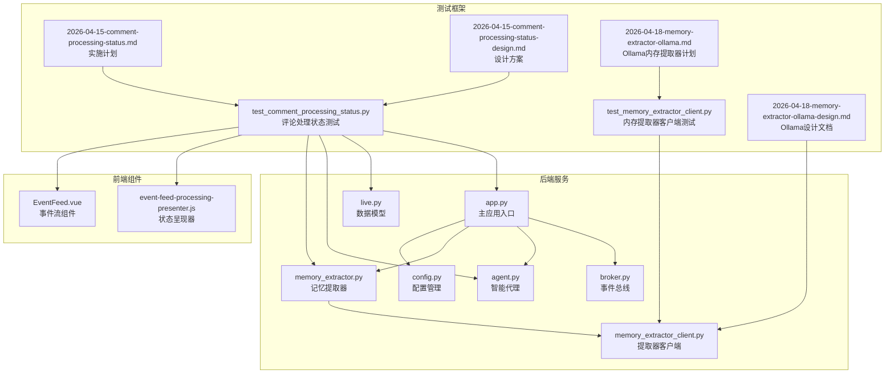

**图表来源**
- [test_comment_processing_status.py:1-1033](file://tests/test_comment_processing_status.py#L1-L1033)
- [test_memory_extractor_client.py:1-233](file://tests/test_memory_extractor_client.py#L1-L233)
- [app.py:1-691](file://backend/app.py#L1-L691)
- [live.py:1-175](file://backend/schemas/live.py#L1-L175)

**章节来源**
- [test_comment_processing_status.py:1-1033](file://tests/test_comment_processing_status.py#L1-L1033)
- [test_memory_extractor_client.py:1-233](file://tests/test_memory_extractor_client.py#L1-L233)
- [2026-04-15-comment-processing-status.md:1-300](file://docs/superpowers/plans/2026-04-15-comment-processing-status.md#L1-L300)

## 核心组件

### 评论处理状态模型

系统的核心是`CommentProcessingStatus`模型，它定义了评论处理过程中的各个关键节点状态：

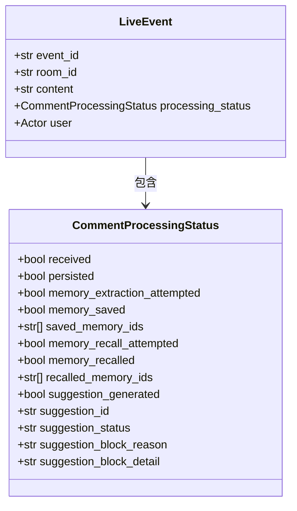

**图表来源**
- [live.py:121-142](file://backend/schemas/live.py#L121-L142)
- [live.py:29-46](file://backend/schemas/live.py#L29-L46)

### 处理流程控制器

`process_event`函数是整个评论处理流程的核心控制器，负责协调各个组件的工作：

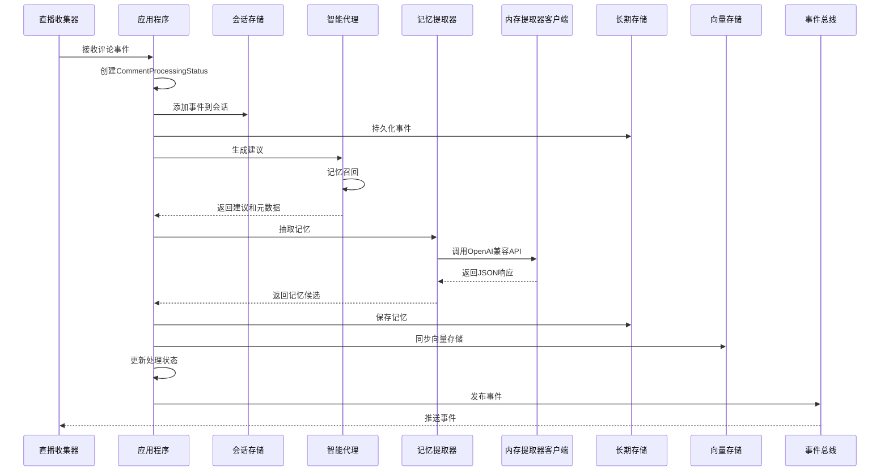

**图表来源**
- [app.py:249-400](file://backend/app.py#L249-L400)
- [agent.py:131-200](file://backend/services/agent.py#L131-L200)

**章节来源**
- [live.py:121-142](file://backend/schemas/live.py#L121-L142)
- [app.py:249-400](file://backend/app.py#L249-L400)
- [agent.py:131-200](file://backend/services/agent.py#L131-L200)

## 架构概览

系统采用事件驱动的微服务架构，通过异步事件流实现松耦合的数据处理：

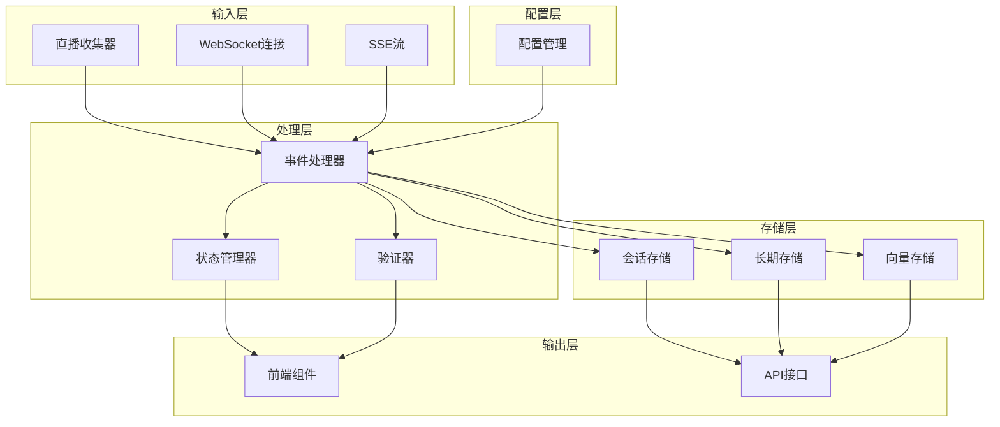

**图表来源**
- [app.py:125-175](file://backend/app.py#L125-L175)
- [broker.py:10-39](file://backend/services/broker.py#L10-L39)

## 详细组件分析

### 后端处理流程测试

测试系统通过多种场景验证评论处理状态的正确性：

#### 基础处理流程测试

测试验证了从事件接收到最终发布的完整流程：

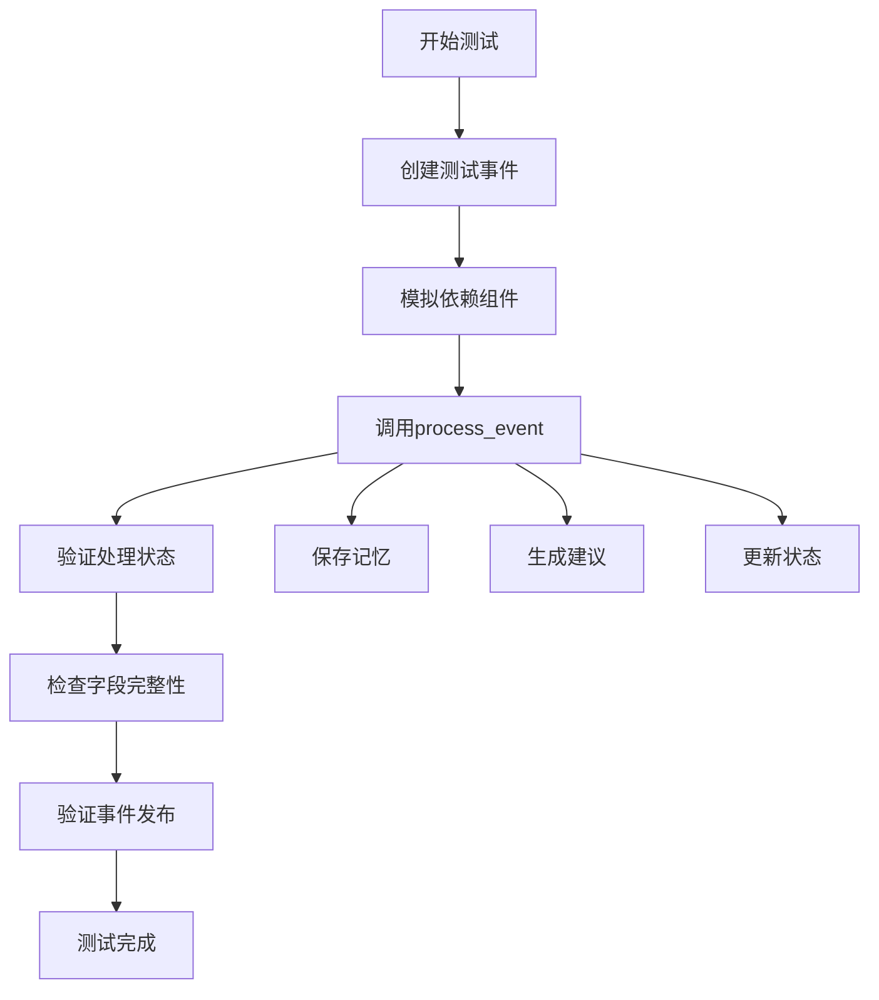

**图表来源**
- [test_comment_processing_status.py:324-420](file://tests/test_comment_processing_status.py#L324-L420)

#### Ollama内存提取器回退测试

**新增** 系统能够正确处理Ollama内存提取器初始化失败的情况，并自动回退到规则提取器：

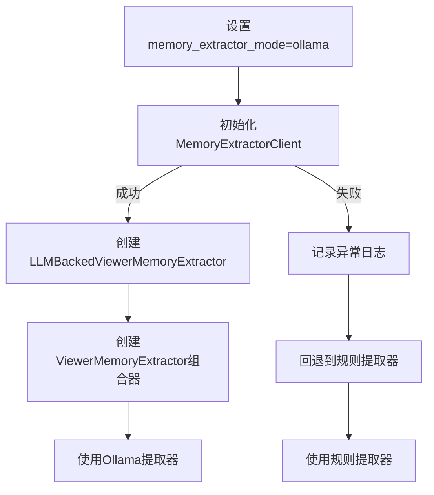

**图表来源**
- [test_comment_processing_status.py:178-250](file://tests/test_comment_processing_status.py#L178-L250)

#### 异常处理测试

系统能够正确处理各种异常情况：

| 异常类型 | 触发条件 | 预期行为 |
|---------|---------|---------|
| 记忆提取失败 | memory_extractor.extract抛出RuntimeError | 标记memory_extraction_attempted为True，memory_saved为False |
| 存储失败 | long_term_store.save_viewer_memory抛出异常 | 标记memory_saved为False，记录错误状态 |
| 同步失败 | vector_memory.sync_memory抛出异常 | 标记同步失败，但继续后续处理 |
| 提示生成失败 | 语义召回后端不可用 | 设置suggestion_status为"failed" |
| Ollama初始化失败 | MemoryExtractorClient构造函数抛出异常 | 自动回退到规则提取器，记录异常日志 |
| 不支持的模式 | memory_extractor_mode不是"ollama"或"rule" | 使用规则提取器并记录警告 |

**新增** **记忆持久化功能测试验证**

系统对记忆持久化功能进行了全面测试，确保saved_memory_ids字段的正确传递和使用：

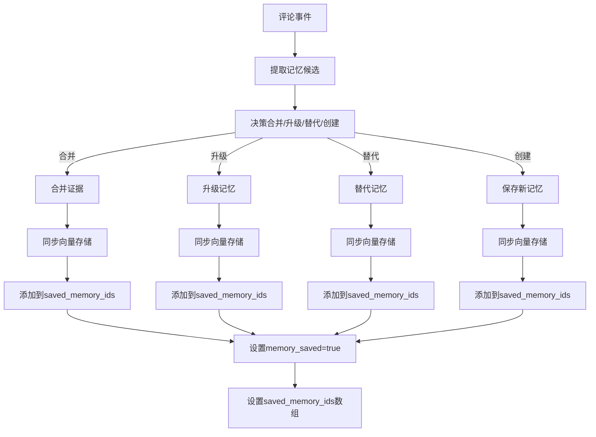

**图表来源**
- [test_comment_processing_status.py:445-564](file://tests/test_comment_processing_status.py#L445-L564)

**章节来源**
- [test_comment_processing_status.py:582-1033](file://tests/test_comment_processing_status.py#L582-L1033)

### 前端状态展示组件

前端组件负责将后端传递的处理状态转换为用户友好的界面元素：

#### 状态呈现器

状态呈现器提供了统一的接口来处理不同类型的处理状态：

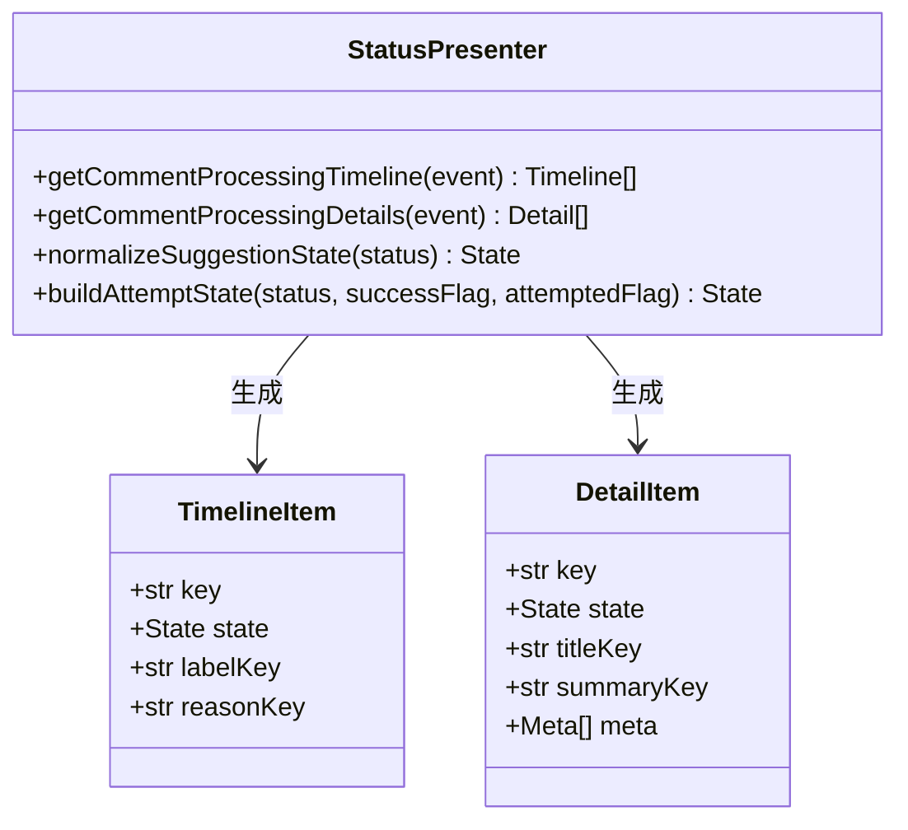

**图表来源**
- [event-feed-processing-presenter.js:92-194](file://frontend/src/components/event-feed-processing-presenter.js#L92-L194)

#### 事件流组件

EventFeed组件集成了状态展示功能，提供直观的用户界面：

| 状态类型 | 显示样式 | 用户交互 |
|---------|---------|---------|
| 成功状态 | 绿色勾选标记 | 显示详细信息按钮 |
| 跳过状态 | 灰色虚线标记 | 显示原因说明 |
| 失败状态 | 红色叉号标记 | 显示错误详情 |
| 未确定状态 | 黄色问号标记 | 显示处理进度 |

**章节来源**
- [EventFeed.vue:283-360](file://frontend/src/components/EventFeed.vue#L283-L360)
- [event-feed-processing-presenter.js:140-194](file://frontend/src/components/event-feed-processing-presenter.js#L140-L194)

### 记忆提取器组件

系统实现了多层次的记忆提取策略，包括新的OpenAI兼容HTTP客户端：

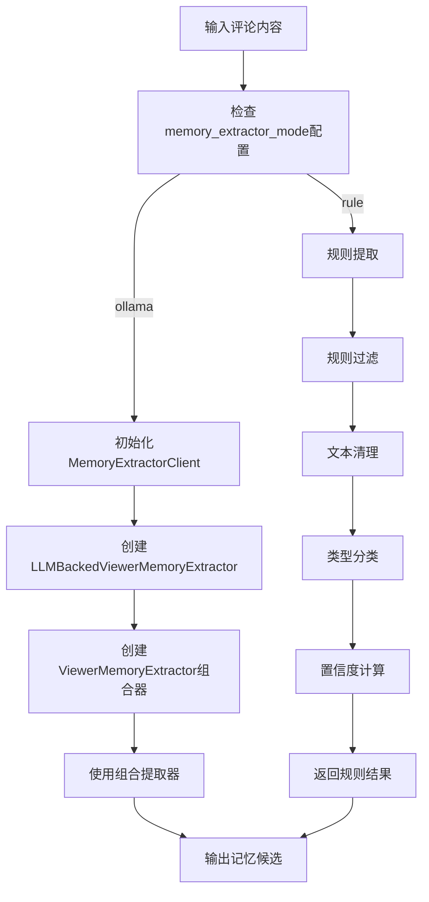

**图表来源**
- [app.py:153-172](file://backend/app.py#L153-L172)
- [memory_extractor_client.py:19-115](file://backend/services/memory_extractor_client.py#L19-L115)

**章节来源**
- [app.py:153-172](file://backend/app.py#L153-L172)
- [memory_extractor_client.py:19-115](file://backend/services/memory_extractor_client.py#L19-L115)

### OpenAI兼容HTTP客户端

**新增** memory_extractor_client.py实现了OpenAI兼容的HTTP客户端，用于与Ollama等本地LLM服务通信：

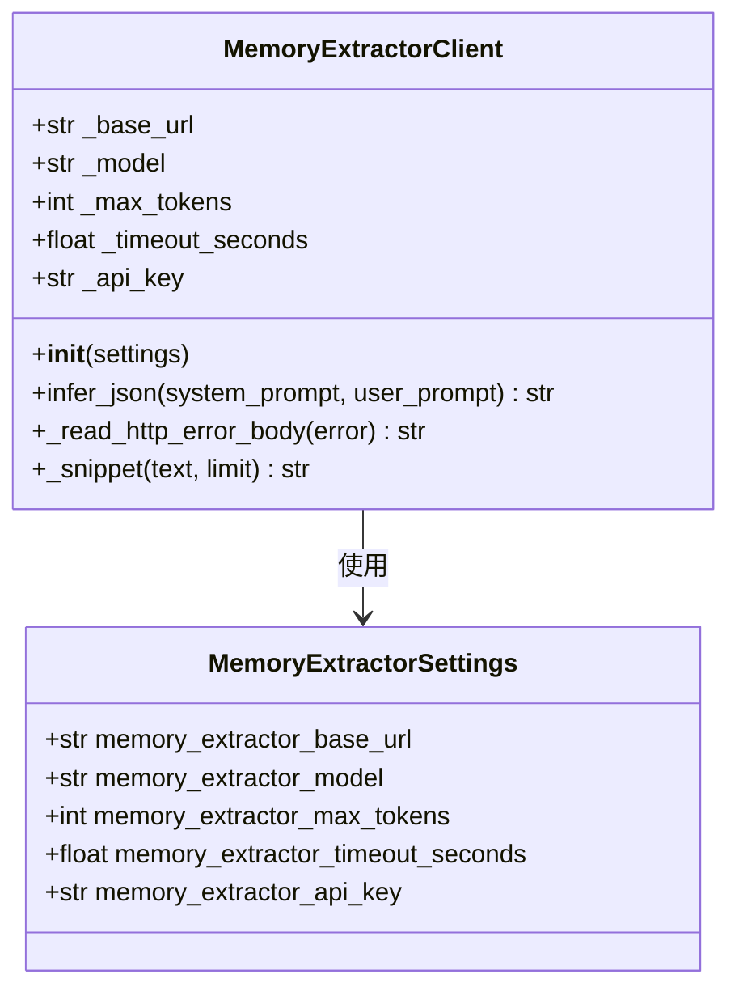

**图表来源**
- [memory_extractor_client.py:19-115](file://backend/services/memory_extractor_client.py#L19-L115)

**章节来源**
- [memory_extractor_client.py:19-115](file://backend/services/memory_extractor_client.py#L19-L115)

## 依赖关系分析

系统各组件之间的依赖关系如下：

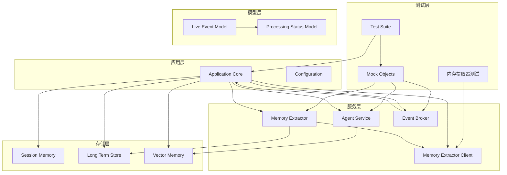

**图表来源**
- [test_comment_processing_status.py:30-107](file://tests/test_comment_processing_status.py#L30-L107)
- [app.py:125-175](file://backend/app.py#L125-L175)

**章节来源**
- [test_comment_processing_status.py:30-107](file://tests/test_comment_processing_status.py#L30-L107)
- [app.py:125-175](file://backend/app.py#L125-L175)

## 性能考虑

系统在设计时充分考虑了性能优化：

### 异步处理机制

- 使用asyncio实现非阻塞的事件处理
- 事件总线采用异步队列模式，避免阻塞主线程
- WebSocket连接支持并发处理多个客户端

### 内存管理

- 会话存储限制最近事件数量，防止内存泄漏
- 长期存储使用分页查询，避免一次性加载大量数据
- 向量存储索引采用增量更新策略

### 缓存策略

- 会话状态缓存最近的事件和统计信息
- 模型状态缓存当前的处理状态
- 建议缓存基于事件ID进行去重

### 错误处理优化

**新增** 系统实现了智能的错误处理和回退机制：
- Ollama初始化失败时自动回退到规则提取器
- 支持多种memory_extractor_mode配置的验证
- 完善的日志记录和异常传播机制
- **新增** 记忆持久化过程中的异常处理和状态回滚

## 故障排除指南

### 常见问题及解决方案

| 问题类型 | 症状描述 | 解决方案 |
|---------|---------|---------|
| 处理状态缺失 | 评论事件缺少processing_status字段 | 检查process_event函数是否正确初始化状态对象 |
| 记忆提取失败 | memory_extraction_attempted为True但memory_saved为False | 验证记忆提取器配置和网络连接 |
| 建议生成失败 | suggestion_status为failed | 检查语义召回后端状态和模型配置 |
| 前端显示异常 | 处理状态标签不显示 | 验证EventFeed组件的props传递和状态检查逻辑 |
| Ollama连接失败 | 记录"Ollama memory extractor initialization failed"日志 | 检查MEMORY_EXTRACTOR_BASE_URL和MEMORY_EXTRACTOR_MODEL配置 |
| 不支持的模式 | 记录"Unsupported memory_extractor_mode"警告 | 确保MEMORY_EXTRACTOR_MODE设置为"ollama"或"rule" |
| HTTP请求错误 | MemoryExtractorClient抛出ValueError | 检查网络连接和API端点配置 |
| **新增** 记忆持久化失败 | saved_memory_ids为空但memory_saved为True | 检查long_term_store.save_viewer_memory的返回值和异常处理 |
| **新增** 记忆ID丢失 | saved_memory_ids数组长度为0 | 验证vector_memory.sync_memory的调用和异常捕获 |

### 调试技巧

1. **日志分析**：启用详细的日志记录，跟踪每个处理步骤的状态变化
2. **单元测试**：运行独立的测试用例，隔离问题定位范围
3. **状态监控**：使用健康检查接口监控系统的整体状态
4. **性能分析**：监控处理延迟和资源使用情况
5. **配置验证**：使用test_memory_extractor_client.py验证配置正确性
6. ****新增** 记忆持久化测试**：运行test_comment_processing_status.py中的记忆持久化相关测试，验证saved_memory_ids字段的正确性

**章节来源**
- [test_comment_processing_status.py:582-1033](file://tests/test_comment_processing_status.py#L582-L1033)

## 结论

DouYin评论处理状态测试系统是一个设计精良的监控和验证框架。通过全面的测试覆盖，系统能够有效确保评论处理流程的正确性和可靠性。

### 主要成就

1. **完整的状态跟踪**：实现了从事件接收到最终发布的全流程状态监控
2. **灵活的异常处理**：能够优雅地处理各种异常情况，保持系统的稳定性
3. **用户友好的界面**：前端组件提供了直观的状态展示和交互体验
4. **可扩展的架构**：模块化的组件设计便于功能扩展和维护
5. **智能回退机制**：实现了Ollama内存提取器初始化失败的自动回退
6. **完善的配置验证**：提供了memory_extractor_mode配置的全面测试覆盖
7. ****新增** 记忆持久化功能验证**：通过完整的测试套件确保saved_memory_ids字段在记忆保存过程中的正确传递和使用

### 未来改进方向

1. **增强监控能力**：添加更详细的性能指标和告警机制
2. **优化用户体验**：改进前端界面的响应速度和交互流畅性
3. **提升系统韧性**：增强系统的容错能力和自动恢复机制
4. **扩展测试覆盖**：增加更多边界情况和压力测试场景
5. **优化错误处理**：进一步完善错误处理和回退机制的测试
6. ****新增** 记忆持久化优化**：针对saved_memory_ids的性能和一致性进行进一步优化

该测试系统为直播平台的评论处理功能提供了坚实的技术基础，确保了系统的高质量运行和服务的持续改进。

**更新** 最新的变更增强了系统的健壮性和可靠性，通过新增的Ollama内存提取器回退测试和配置验证测试，确保了系统在各种异常情况下的稳定运行。**特别新增** 的记忆持久化功能测试验证，确保了saved_memory_ids字段在实际生产环境中的正确性和完整性，为系统的状态追踪和调试提供了强有力的支持。