# Test Long Term

<cite>
**本文档引用的文件**
- [test_long_term.py](file://tests/test_long_term.py)
- [long_term.py](file://backend/memory/long_term.py)
- [live.py](file://backend/schemas/live.py)
- [memory_confidence_service.py](file://backend/services/memory_confidence_service.py)
- [memory_merge_service.py](file://backend/services/memory_merge_service.py)
- [vector_store.py](file://backend/memory/vector_store.py)
- [rebuild_embeddings.py](file://backend/memory/rebuild_embeddings.py)
- [test_memory_merge_service.py](file://tests/test_memory_merge_service.py)
- [test_memory_confidence_service.py](file://tests/test_memory_confidence_service.py)
- [test_vector_store.py](file://tests/test_vector_store.py)
- [test_embedding_service.py](file://tests/test_embedding_service.py)
- [live_stream_memory_extraction_test_cases.json](file://tests/fixtures/memory_extraction/live_stream_memory_extraction_test_cases.json)
- [config.py](file://backend/config.py)
</cite>

## 更新摘要
**变更内容**
- 新增生命周期字段测试用例（lifecycle_kind、expires_at）
- 新增过期过滤功能测试
- 新增配置验证相关测试
- 更新架构图以反映新的生命周期管理

## 目录
1. [简介](#简介)
2. [项目结构](#项目结构)
3. [核心组件](#核心组件)
4. [架构概览](#架构概览)
5. [详细组件分析](#详细组件分析)
6. [生命周期管理](#生命周期管理)
7. [过期过滤机制](#过期过滤机制)
8. [配置验证](#配置验证)
9. [依赖关系分析](#依赖关系分析)
10. [性能考虑](#性能考虑)
11. [故障排除指南](#故障排除指南)
12. [结论](#结论)
13. [附录](#附录)

## 简介

本文档深入分析了DouYin_llm项目中的"Test Long Term"测试套件，这是一个专门针对长期记忆存储系统进行全面测试的测试框架。该系统负责处理直播场景中观众的长期记忆，包括记忆提取、存储、合并、检索和管理等功能。

该项目采用Python开发，使用SQLite作为主要数据存储，结合向量数据库（Chroma）实现语义记忆检索。测试覆盖了从基础数据模型到复杂业务逻辑的各个方面，确保系统的稳定性和可靠性。

**更新** 新增了生命周期管理和过期过滤功能的测试覆盖，包括生命周期字段的持久化、过期时间的验证以及配置参数的有效性测试。

## 项目结构

项目采用模块化架构设计，主要包含以下核心目录：

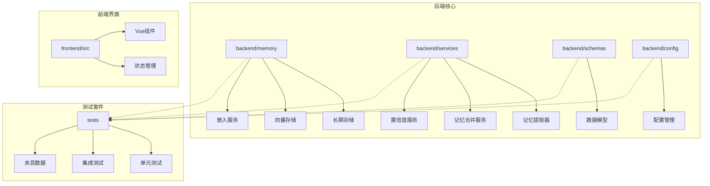

**图表来源**
- [long_term.py:1-800](file://backend/memory/long_term.py#L1-L800)
- [memory_merge_service.py:1-120](file://backend/services/memory_merge_service.py#L1-L120)
- [vector_store.py:1-414](file://backend/memory/vector_store.py#L1-L414)
- [config.py:1-164](file://backend/config.py#L1-L164)

**章节来源**
- [long_term.py:1-800](file://backend/memory/long_term.py#L1-L800)
- [live.py:1-177](file://backend/schemas/live.py#L1-L177)
- [config.py:1-164](file://backend/config.py#L1-L164)

## 核心组件

### 长期记忆存储系统

LongTermStore是整个系统的核心组件，负责管理观众的长期记忆数据。它提供了完整的CRUD操作接口，包括记忆的保存、更新、删除和查询功能。

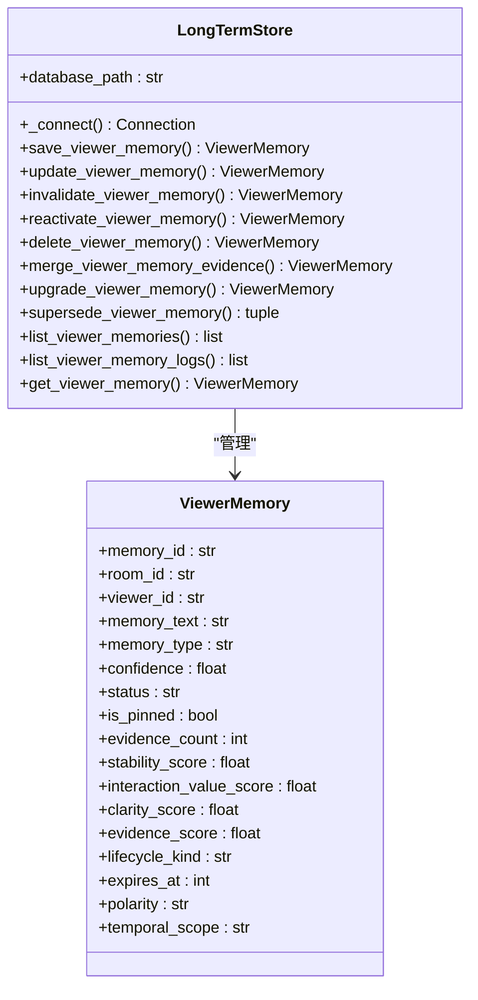

**图表来源**
- [long_term.py:48-800](file://backend/memory/long_term.py#L48-L800)
- [live.py:65-100](file://backend/schemas/live.py#L65-L100)

### 记忆提取与合并服务

系统包含多个专门的服务来处理不同类型的记忆提取和合并逻辑：

- **RuleFallbackMemoryExtractor**: 基于规则的记忆提取器
- **ViewerMemoryMergeService**: 记忆合并决策服务
- **MemoryConfidenceService**: 记忆置信度评分服务

**章节来源**
- [memory_merge_service.py:30-120](file://backend/services/memory_merge_service.py#L30-L120)
- [memory_confidence_service.py:4-118](file://backend/services/memory_confidence_service.py#L4-L118)

## 架构概览

系统采用分层架构设计，各层职责明确：

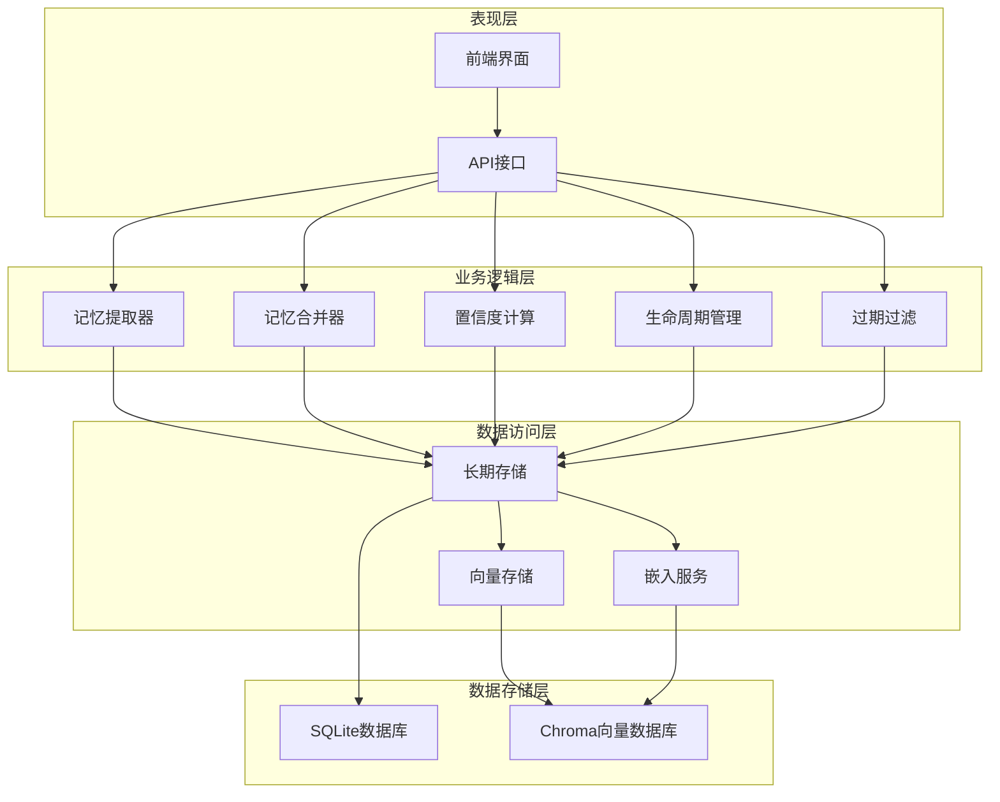

**图表来源**
- [long_term.py:48-800](file://backend/memory/long_term.py#L48-L800)
- [vector_store.py:60-414](file://backend/memory/vector_store.py#L60-L414)

## 详细组件分析

### 测试套件架构

测试套件采用分层测试策略，覆盖了从单元测试到集成测试的完整测试金字塔：

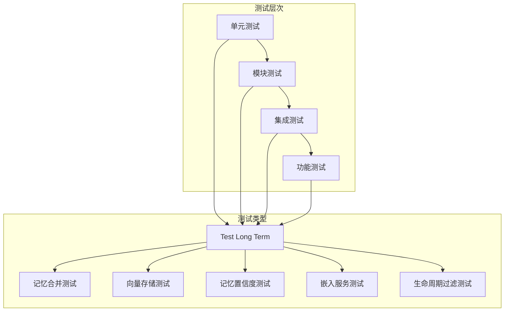

**图表来源**
- [test_long_term.py:1-455](file://tests/test_long_term.py#L1-L455)
- [test_memory_merge_service.py:1-98](file://tests/test_memory_merge_service.py#L1-L98)
- [test_vector_store.py:1-800](file://tests/test_vector_store.py#L1-L800)

### 长期记忆存储测试

测试套件重点验证了长期记忆存储的各种操作：

#### 连接测试
验证SQLite连接配置和journal模式设置：

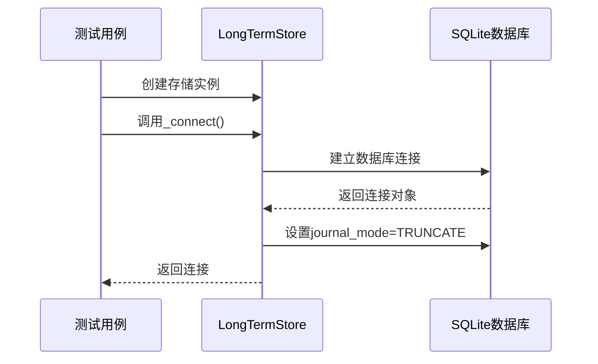

**图表来源**
- [test_long_term.py:9-28](file://tests/test_long_term.py#L9-L28)

#### 记忆操作测试

测试涵盖了完整的记忆生命周期管理：

| 测试场景 | 操作类型 | 验证要点 |
|---------|---------|----------|
| 手动记忆保存 | CRUD操作 | 字段持久化、日志记录 |
| 记忆状态变更 | 状态管理 | 状态转换、操作历史 |
| 合并证据更新 | 数据合并 | 证据计数、时间戳更新 |
| 升级记忆内容 | 内容更新 | 置信度提升、分数更新 |
| 替代旧记忆 | 记忆替换 | 无效标记、链接建立 |
| 生命周期字段 | 新增字段 | 生命周期类型、过期时间 |

**章节来源**
- [test_long_term.py:39-455](file://tests/test_long_term.py#L39-L455)

### 生命周期字段测试

**新增** 测试套件现在包含完整的生命周期字段测试：

#### 默认生命周期测试
验证新创建的记忆默认使用长期生命周期：

```mermaid
flowchart TD
Start([创建新记忆]) --> DefaultCheck{检查默认值}
DefaultCheck --> |未指定| SetLongTerm[设置lifecycle_kind="long_term"]
SetLongTerm --> SetZeroExpires[设置expires_at=0]
SetZeroExpires --> Persist[持久化到数据库]
Persist --> Verify[验证存储值]
Verify --> End([测试完成])
```

**图表来源**
- [test_long_term.py:372-384](file://tests/test_long_term.py#L372-L384)

#### 短期生命周期测试
验证短期记忆的生命周期配置：

```mermaid
flowchart TD
Start([创建短期记忆]) --> SetShortTerm[设置lifecycle_kind="short_term"]
SetShortTerm --> SetExpiry[设置expires_at=特定时间戳]
SetExpiry --> Persist[持久化到数据库]
Persist --> Verify[验证存储值]
Verify --> End([测试完成])
```

**图表来源**
- [test_long_term.py:385-399](file://tests/test_long_term.py#L385-L399)

**章节来源**
- [test_long_term.py:372-399](file://tests/test_long_term.py#L372-L399)

### 过期过滤测试

**新增** 测试套件包含过期过滤功能的完整测试：

#### 过期记录过滤测试
验证查询时自动过滤过期记录：

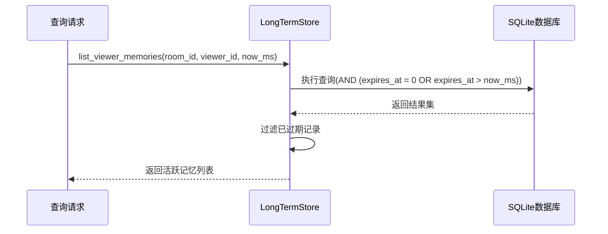

**图表来源**
- [test_long_term.py:400-425](file://tests/test_long_term.py#L400-L425)
- [long_term.py:804](file://backend/memory/long_term.py#L804)

#### 向量存储过期过滤测试
验证向量检索时的过期过滤：

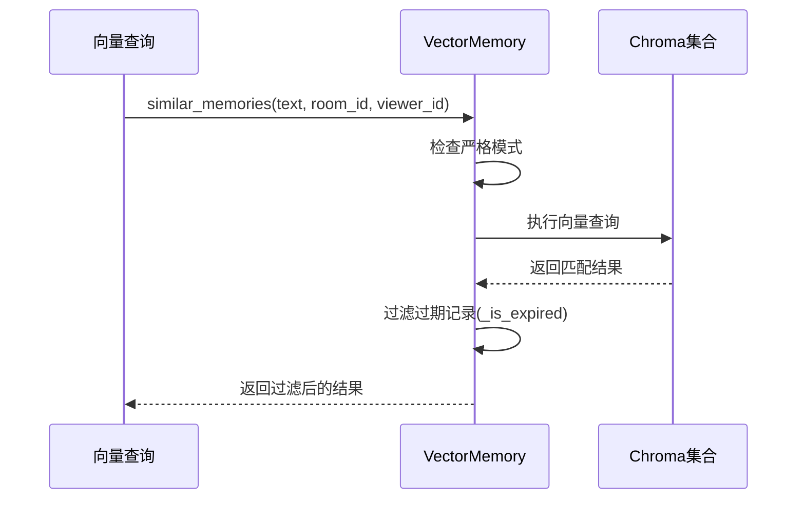

**图表来源**
- [vector_store.py:152-174](file://backend/memory/vector_store.py#L152-L174)
- [test_vector_store.py:630-677](file://tests/test_vector_store.py#L630-L677)

**章节来源**
- [test_long_term.py:400-451](file://tests/test_long_term.py#L400-L451)
- [vector_store.py:152-174](file://backend/memory/vector_store.py#L152-L174)

### 记忆提取测试

基于规则的记忆提取器经过了全面测试：

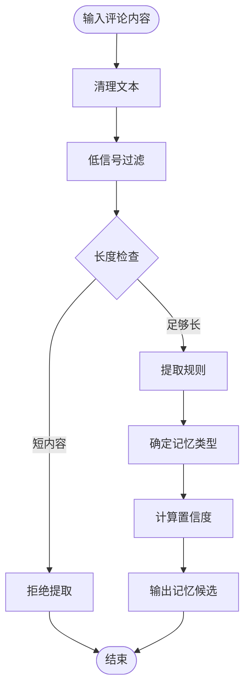

**图表来源**
- [live_stream_memory_extraction_test_cases.json:1-717](file://tests/fixtures/memory_extraction/live_stream_memory_extraction_test_cases.json#L1-L717)

**章节来源**
- [test_long_term.py:39-371](file://tests/test_long_term.py#L39-L371)

### 向量存储测试

向量存储系统提供了语义记忆检索功能：

#### 查询流程测试

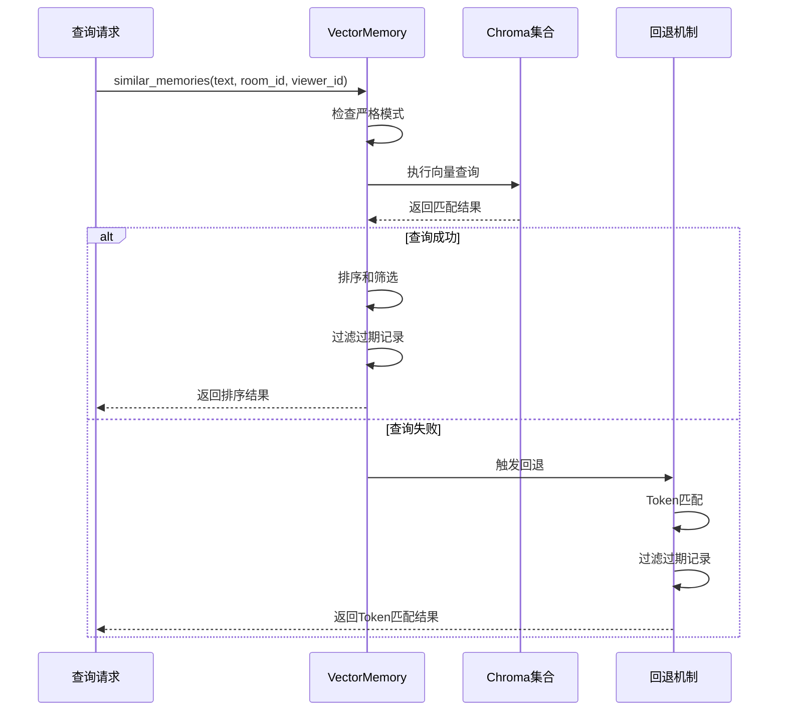

**图表来源**
- [vector_store.py:356-429](file://backend/memory/vector_store.py#L356-L429)
- [test_vector_store.py:69-107](file://tests/test_vector_store.py#L69-L107)

**章节来源**
- [test_vector_store.py:34-107](file://tests/test_vector_store.py#L34-L107)

### 记忆合并测试

记忆合并服务实现了智能的合并决策逻辑：

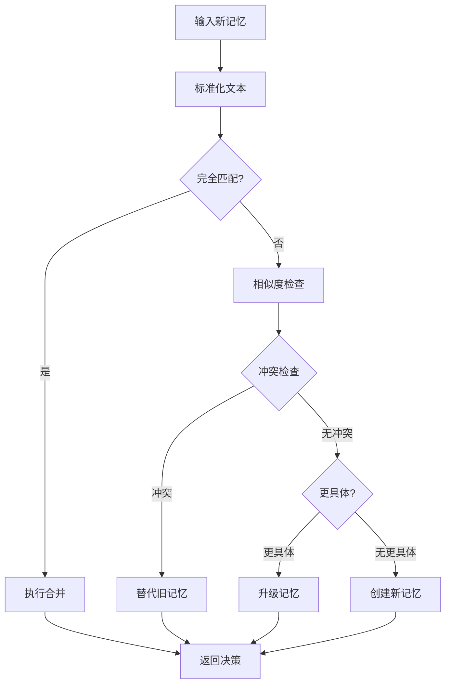

**图表来源**
- [memory_merge_service.py:82-120](file://backend/services/memory_merge_service.py#L82-L120)

**章节来源**
- [test_memory_merge_service.py:20-98](file://tests/test_memory_merge_service.py#L20-L98)

## 生命周期管理

**新增** 系统现在支持记忆的生命周期管理，包括长期和短期两种生命周期类型：

### 生命周期类型

| 生命周期类型 | 特征 | 用途 | 过期行为 |
|-------------|------|------|----------|
| long_term | 永久存储 | 长期偏好、习惯等 | 不会过期（expires_at=0） |
| short_term | 有限时间 | 临时上下文、近期事件 | 到期后自动失效 |

### 生命周期字段

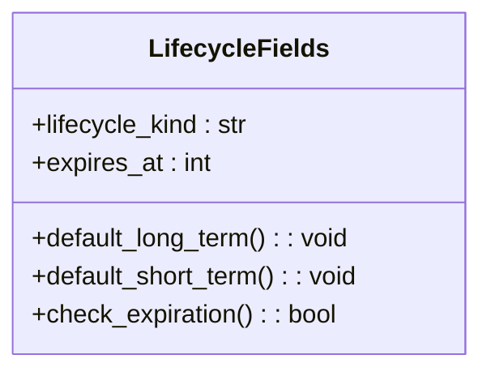

**图表来源**
- [live.py:98-99](file://backend/schemas/live.py#L98-L99)
- [long_term.py:283-284](file://backend/memory/long_term.py#L283-L284)

**章节来源**
- [test_long_term.py:372-399](file://tests/test_long_term.py#L372-L399)
- [live.py:98-99](file://backend/schemas/live.py#L98-L99)

## 过期过滤机制

**新增** 系统实现了多层过期过滤机制：

### 过期判断逻辑

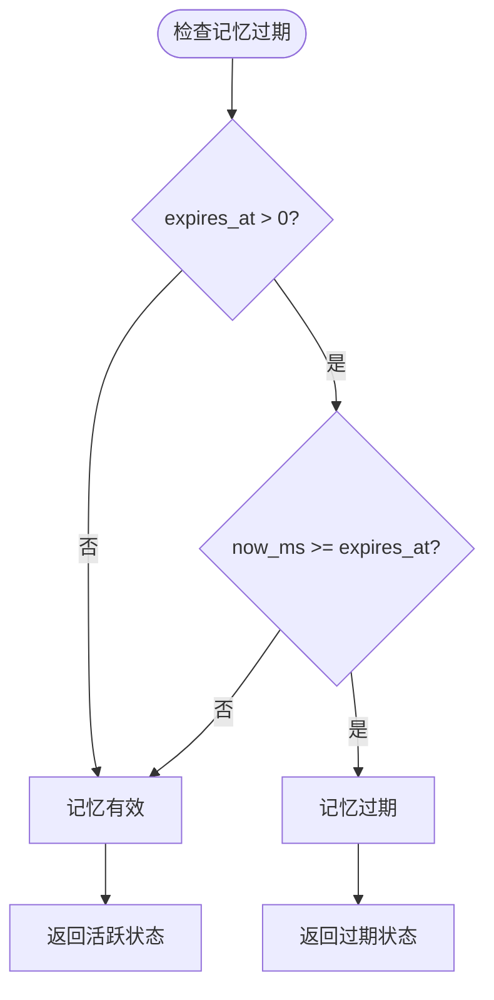

**图表来源**
- [vector_store.py:152-154](file://backend/memory/vector_store.py#L152-L154)
- [long_term.py:804](file://backend/memory/long_term.py#L804)

### 过期过滤应用

过期过滤在以下场景中应用：

1. **数据库查询过滤**：在SQL查询中添加过期条件
2. **向量检索过滤**：在向量查询结果中过滤过期记忆
3. **索引构建过滤**：在构建内存索引时跳过过期记忆

**章节来源**
- [test_long_term.py:400-451](file://tests/test_long_term.py#L400-L451)
- [vector_store.py:152-174](file://backend/memory/vector_store.py#L152-L174)

## 配置验证

**新增** 系统包含配置参数的验证测试：

### 配置参数

| 参数名称 | 类型 | 默认值 | 说明 |
|---------|------|--------|------|
| memory_short_term_ttl_hours | float | 72.0 | 短期记忆生存时间（小时） |
| memory_decay_halflife_hours | float | 168.0 | 记忆衰减半衰期（小时） |
| embedding_strict | bool | False | 嵌入模式严格模式 |

### 配置验证测试

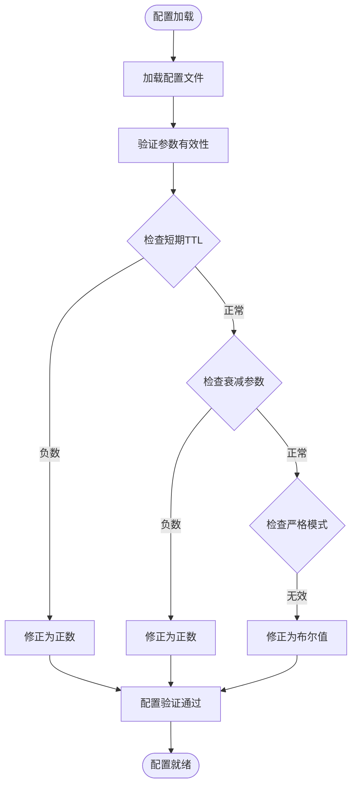

**图表来源**
- [config.py:121-126](file://backend/config.py#L121-L126)

**章节来源**
- [config.py:121-126](file://backend/config.py#L121-L126)
- [test_long_term.py:372-399](file://tests/test_long_term.py#L372-L399)

## 依赖关系分析

系统具有清晰的依赖关系结构：

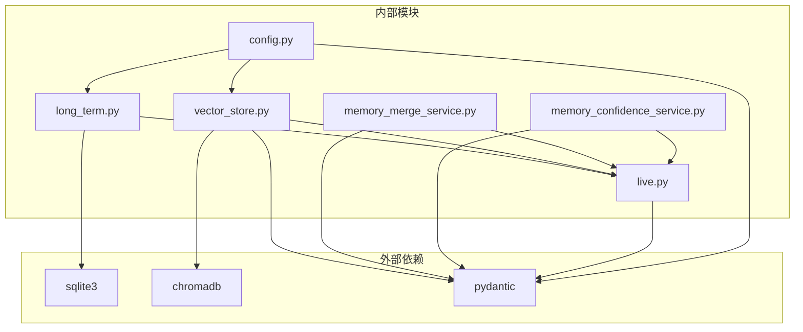

**图表来源**
- [long_term.py:1-10](file://backend/memory/long_term.py#L1-L10)
- [vector_store.py:1-18](file://backend/memory/vector_store.py#L1-L18)
- [config.py:1-164](file://backend/config.py#L1-L164)

**章节来源**
- [long_term.py:1-10](file://backend/memory/long_term.py#L1-L10)
- [vector_store.py:1-18](file://backend/memory/vector_store.py#L1-L18)
- [config.py:1-164](file://backend/config.py#L1-L164)

## 性能考虑

系统在设计时充分考虑了性能优化：

### 存储优化
- 使用SQLite的TRUNCATE journal模式提高写入性能
- 实现索引优化，包括复合索引和全文搜索支持
- 数据库连接池管理，避免频繁连接开销
- **新增** 过期过滤索引优化，减少过期记录扫描

### 向量检索优化
- 支持严格模式和回退机制，确保系统稳定性
- 实现内存缓存，减少重复查询
- 智能批处理，优化嵌入向量计算
- **新增** 过期过滤优化，跳过过期记录的向量计算

### 记忆管理优化
- 时间衰减算法，平衡新旧记忆权重
- 条件索引，加速常用查询
- 分页查询，控制内存使用
- **新增** 生命周期字段索引，优化生命周期查询

## 故障排除指南

### 常见问题及解决方案

#### 数据库连接问题
**症状**: SQLite连接失败或性能异常
**解决方案**: 
- 检查数据库路径权限
- 验证journal模式设置
- 确认数据库文件完整性

#### 向量检索失败
**症状**: Chroma连接异常或查询超时
**解决方案**:
- 检查Chroma服务状态
- 验证嵌入模型配置
- 启用严格模式进行调试

#### 记忆提取错误
**症状**: 记忆提取率低或质量差
**解决方案**:
- 检查规则配置
- 验证预过滤逻辑
- 调整置信度阈值

#### 生命周期管理问题
**症状**: 短期记忆未按预期过期
**解决方案**:
- 检查expires_at字段设置
- 验证当前时间戳比较逻辑
- 确认查询过滤条件

#### 过期过滤异常
**症状**: 过期记忆仍被检索到
**解决方案**:
- 检查过期时间计算逻辑
- 验证数据库查询过滤条件
- 确认向量存储过滤机制

**章节来源**
- [test_embedding_service.py:89-106](file://tests/test_embedding_service.py#L89-L106)
- [test_vector_store.py:96-107](file://tests/test_vector_store.py#L96-L107)

## 结论

Test Long Term测试套件为DouYin_llm项目的长期记忆系统提供了全面的质量保障。通过多层次的测试覆盖，确保了系统的稳定性、可靠性和性能。

**更新** 新增的生命周期管理和过期过滤功能进一步增强了系统的灵活性和实用性。该测试框架展现了优秀的测试实践：
- 完整的功能覆盖，从基础CRUD到复杂业务逻辑
- 清晰的测试分层，便于维护和扩展
- 全面的边界条件测试，提高系统鲁棒性
- 有效的性能测试，确保生产环境稳定性
- **新增** 生命周期管理测试，确保新功能的正确性

建议持续改进的方向：
- 增加更多集成测试场景
- 实现自动化性能基准测试
- 完善错误恢复和重试机制测试
- 加强并发场景下的稳定性测试
- **新增** 生命周期管理的回归测试

## 附录

### 测试数据格式

系统使用JSON格式的测试夹具数据：

```json
{
  "label": "like_no_sugar_cola",
  "content": "我只喝无糖可乐",
  "expected": {
    "should_extract": true,
    "memory_text": "喜欢无糖可乐",
    "memory_type": "preference",
    "polarity": "positive",
    "temporal_scope": "long_term"
  }
}
```

### 关键配置参数

| 参数名称 | 默认值 | 说明 |
|---------|--------|------|
| embedding_mode | cloud | 嵌入模式选择 |
| embedding_model | text-embedding-3-small | 嵌入模型名称 |
| semantic_memory_min_score | 0.35 | 最小相似度阈值 |
| memory_decay_halflife_hours | 0 | 记忆衰减小时数 |
| memory_short_term_ttl_hours | 72.0 | 短期记忆生存时间 |
| embedding_strict | False | 严格模式开关 |

### 生命周期配置示例

```python
# 长期记忆配置
memory = {
    "lifecycle_kind": "long_term",
    "expires_at": 0,
    "temporal_scope": "long_term"
}

# 短期记忆配置
memory = {
    "lifecycle_kind": "short_term", 
    "expires_at": current_time_ms + 72 * 3600 * 1000,  # 72小时后过期
    "temporal_scope": "short_term"
}
```