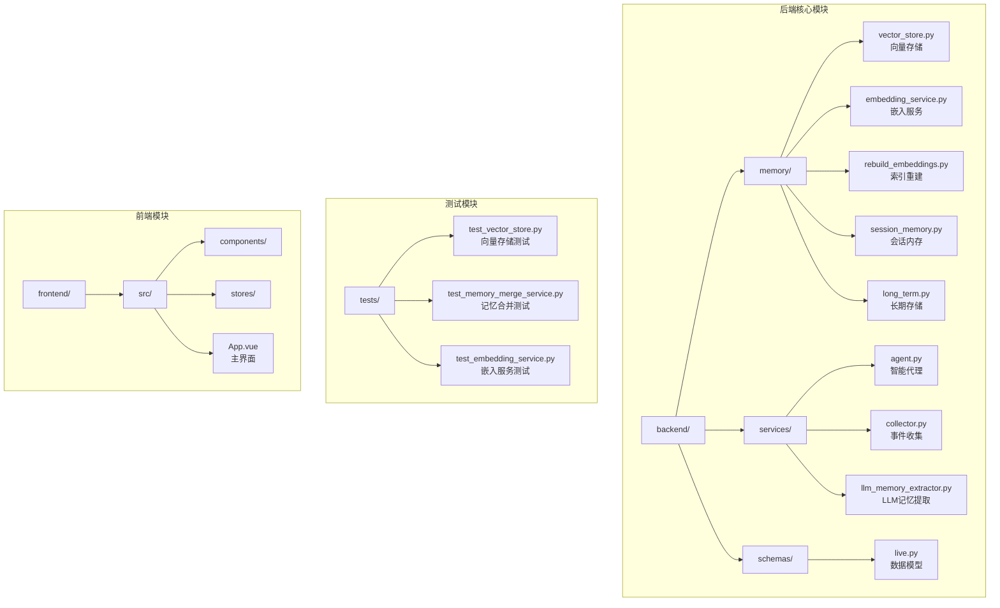
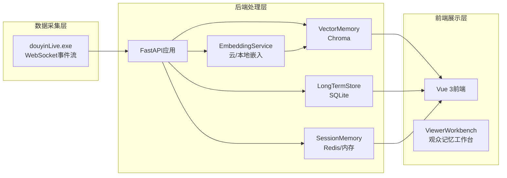
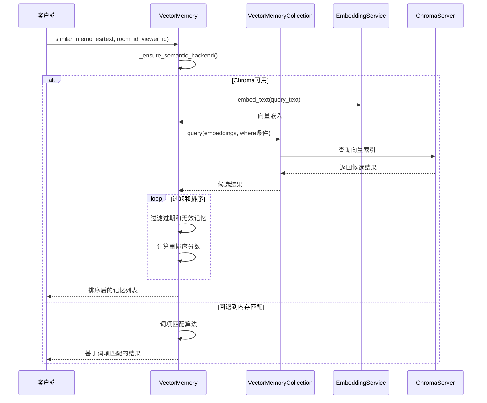
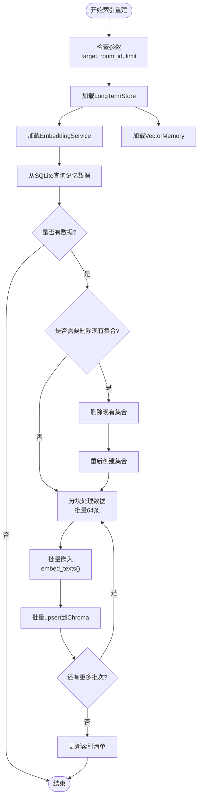
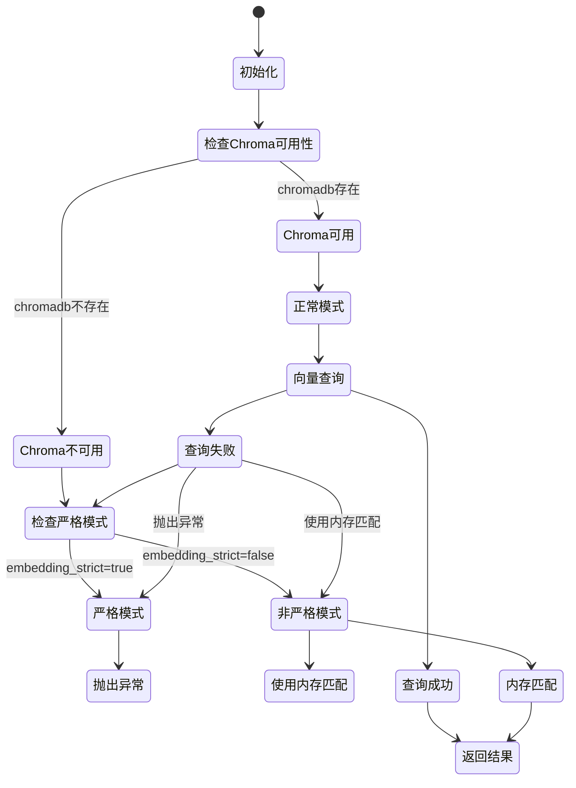
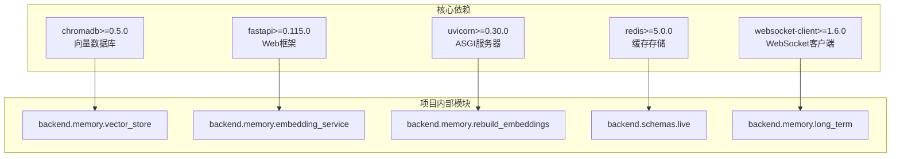
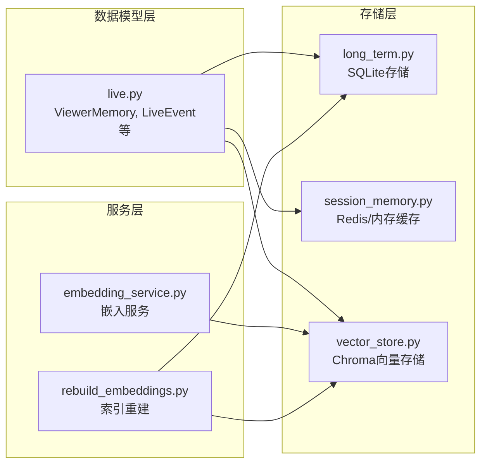

# 测试向量存储

<cite>
**本文档引用的文件**
- [vector_store.py](file://backend/memory/vector_store.py)
- [test_vector_store.py](file://tests/test_vector_store.py)
- [embedding_service.py](file://backend/memory/embedding_service.py)
- [rebuild_embeddings.py](file://backend/memory/rebuild_embeddings.py)
- [README.md](file://README.md)
- [live.py](file://backend/schemas/live.py)
- [session_memory.py](file://backend/memory/session_memory.py)
- [long_term.py](file://backend/memory/long_term.py)
- [requirements.txt](file://requirements.txt)
- [config.py](file://backend/config.py)
</cite>

## 更新摘要
**变更内容**
- 新增业务重排分数计算测试用例
- 新增高证据记忆优先级测试用例
- 新增人工确认和置顶记忆优先级测试用例
- 新增强语义匹配优先于人工/置顶记忆测试用例
- 新增交互价值分数优先级测试用例
- 新增时间衰减和记忆回收测试用例
- 大幅扩展了测试覆盖范围，涵盖所有重排优先级规则

## 目录
1. [简介](#简介)
2. [项目结构](#项目结构)
3. [核心组件](#核心组件)
4. [架构概览](#架构概览)
5. [详细组件分析](#详细组件分析)
6. [依赖关系分析](#依赖关系分析)
7. [性能考虑](#性能考虑)
8. [故障排除指南](#故障排除指南)
9. [测试覆盖范围](#测试覆盖范围)
10. [结论](#结论)

## 简介

测试向量存储是抖音直播场景中观众记忆语义召回系统的核心组件。该项目旨在为主播提供实时辅助系统，通过接收直播间事件、沉淀观众长期记忆、进行真实语义召回，并将可操作信息反馈到前端工作台，帮助主播更自然地接话、识别老观众、维护互动关系。

该项目专注于"观众记忆召回"这一主语义链路，移除了"历史事件向量召回"，专门优化了向量存储和语义检索功能。系统采用 SQLite + Chroma 的混合存储架构，结合严格语义模式和回退机制，确保在各种环境下都能提供可靠的语义召回服务。

**更新** 新增了全面的特征重排测试用例，涵盖了业务重排分数计算、优先级排序、时间衰减等多个关键功能模块。

## 项目结构

项目采用模块化的后端架构，主要包含以下核心模块：

**图表来源**
- [README.md:33-46](file://README.md#L33-L46)
- [requirements.txt:1-6](file://requirements.txt#L1-L6)

**章节来源**
- [README.md:207-220](file://README.md#L207-L220)

## 核心组件

### VectorMemory 类

VectorMemory 是系统的核心向量存储组件，负责：

- **向量索引管理**：使用 Chroma 作为向量数据库，支持持久化存储
- **语义召回**：基于嵌入向量进行相似度搜索
- **回退机制**：当向量后端不可用时，自动切换到内存中的词项匹配
- **严格模式**：支持严格语义模式，禁止回退到非真实语义召回
- **业务重排**：实现复杂的业务优先级排序算法

### HashEmbeddingFunction 类

提供本地哈希嵌入功能，作为向量嵌入的回退方案：

- **令牌化处理**：支持中英文混合文本的令牌化
- **哈希嵌入**：使用 SHA-256 哈希生成固定维度的向量
- **维度配置**：可配置嵌入维度，默认 256 维

### EmbeddingService 类

管理嵌入服务的创建和回退逻辑：

- **云嵌入支持**：通过 HTTP 接口调用云端嵌入服务
- **严格模式控制**：根据配置决定是否允许回退
- **错误处理**：优雅处理嵌入服务失败情况

**章节来源**
- [vector_store.py:60-429](file://backend/memory/vector_store.py#L60-L429)
- [embedding_service.py:13-86](file://backend/memory/embedding_service.py#L13-L86)

## 架构概览

系统采用三层存储架构，结合实时处理和语义召回：

**图表来源**
- [README.md:35-45](file://README.md#L35-L45)
- [vector_store.py:60-96](file://backend/memory/vector_store.py#L60-L96)

## 详细组件分析

### 向量存储核心流程

**图表来源**
- [vector_store.py:356-429](file://backend/memory/vector_store.py#L356-L429)
- [embedding_service.py:28-58](file://backend/memory/embedding_service.py#L28-L58)

### 记忆索引重建流程

**图表来源**
- [rebuild_embeddings.py:120-157](file://backend/memory/rebuild_embeddings.py#L120-L157)
- [rebuild_embeddings.py:160-194](file://backend/memory/rebuild_embeddings.py#L160-L194)

### 严格模式与回退机制

**图表来源**
- [vector_store.py:87-106](file://backend/memory/vector_store.py#L87-L106)
- [vector_store.py:399-403](file://backend/memory/vector_store.py#L399-L403)

**章节来源**
- [vector_store.py:238-270](file://backend/memory/vector_store.py#L238-L270)
- [rebuild_embeddings.py:197-219](file://backend/memory/rebuild_embeddings.py#L197-L219)

## 依赖关系分析

### 外部依赖

项目的主要外部依赖包括：

**图表来源**
- [requirements.txt:1-6](file://requirements.txt#L1-L6)

### 内部模块依赖

**图表来源**
- [live.py:65-100](file://backend/schemas/live.py#L65-L100)
- [long_term.py:48-51](file://backend/memory/long_term.py#L48-L51)

**章节来源**
- [requirements.txt:1-6](file://requirements.txt#L1-L6)
- [vector_store.py:9](file://backend/memory/vector_store.py#L9)

## 性能考虑

### 向量查询优化

系统实现了多种性能优化策略：

1. **批处理优化**：索引重建和查询都采用批量处理，减少网络往返
2. **采样验证**：通过采样验证集合一致性，避免不必要的重建
3. **内存缓存**：维护最近的记忆条目缓存，提高查询速度
4. **维度配置**：可配置嵌入维度，在精度和性能间平衡

### 存储优化

- **索引设计**：为常用查询字段建立索引，提高查询效率
- **分区存储**：按房间和观众ID分区存储，支持高效范围查询
- **生命周期管理**：支持记忆过期和自动清理

### 回退策略

系统提供了多层次的回退机制：
- **Chroma不可用**：自动切换到内存匹配
- **嵌入服务失败**：使用哈希嵌入作为回退
- **严格模式**：可选择完全禁用回退以确保语义真实性

## 故障排除指南

### 常见问题诊断

1. **Chroma连接失败**
   - 检查 chromadb 依赖是否正确安装
   - 验证 Chroma 服务器是否正常运行
   - 检查存储路径权限

2. **嵌入服务异常**
   - 验证 API 密钥和基础 URL 配置
   - 检查网络连接和防火墙设置
   - 确认模型名称和维度配置正确

3. **索引重建失败**
   - 检查 SQLite 数据库连接
   - 验证记忆数据格式
   - 确认磁盘空间充足

### 调试技巧

- **启用详细日志**：通过环境变量控制日志级别
- **监控健康状态**：使用 `/health` 端点检查系统状态
- **测试向量查询**：使用单元测试验证核心功能

**章节来源**
- [vector_store.py:87-106](file://backend/memory/vector_store.py#L87-L106)
- [README.md:185-206](file://README.md#L185-L206)

## 测试覆盖范围

### 业务重排分数计算测试

新增了全面的业务重排分数计算测试用例，涵盖以下关键功能：

#### 业务重排分数计算
- **交互价值分数**：测试 `interaction_value_score` 对最终排名的影响
- **证据分数**：验证 `evidence_score` 在重排中的权重
- **稳定性分数**：检查 `stability_score` 对记忆优先级的作用
- **置顶记忆**：确认置顶标记 (`is_pinned`) 的优先级提升
- **人工确认**：验证手动标记 (`source_kind="manual"`) 的加分效果

#### 优先级排序测试
- **强语义匹配优先**：确保语义相似度高的记忆优先于人工/置顶记忆
- **高证据记忆优先**：验证证据分数高的记忆获得更高优先级
- **交互价值优先**：检查交互价值分数对排序的影响
- **人工确认和置顶组合**：测试人工确认和置顶记忆的综合优先级

#### 时间衰减和记忆回收测试
- **时间衰减机制**：验证记忆随时间推移的衰减效果
- **记忆回收**：检查过期记忆的过滤和回收
- **最后召回时间影响**：确认 `last_recalled_at` 对衰减速度的影响
- **置顶记忆豁免**：验证置顶记忆不受时间衰减影响

#### 严格模式和回退测试
- **严格模式异常处理**：测试严格模式下的错误处理
- **非严格模式回退**：验证回退到内存匹配的功能
- **词项匹配算法**：确认基于词项的匹配逻辑

**新增测试用例详情**：
- `test_business_rerank_score_uses_interaction_evidence_and_stability`：验证业务重排分数计算
- `test_similar_memories_prefers_higher_confidence_when_scores_are_close`：测试置信度优先级
- `test_similar_memories_prefers_manual_and_pinned_when_scores_are_close`：验证人工确认和置顶优先级
- `test_similar_memories_prefers_higher_interaction_value_when_scores_are_close`：测试交互价值优先级
- `test_similar_memories_prefers_higher_evidence_memory_when_scores_are_close`：验证证据分数优先级
- `test_manual_and_pinned_bonus_do_not_beat_far_better_semantic_match`：确保强语义匹配优先
- `test_decay_makes_older_memory_rank_lower_than_recent_one`：测试时间衰减
- `test_pinned_memory_is_exempt_from_decay`：验证置顶豁免
- `test_last_recalled_at_slows_decay`：检查最后召回时间影响

**章节来源**
- [test_vector_store.py:34-78](file://tests/test_vector_store.py#L34-L78)
- [test_vector_store.py:283-322](file://tests/test_vector_store.py#L283-L322)
- [test_vector_store.py:553-596](file://tests/test_vector_store.py#L553-L596)
- [test_vector_store.py:598-641](file://tests/test_vector_store.py#L598-L641)
- [test_vector_store.py:643-686](file://tests/test_vector_store.py#L643-L686)
- [test_vector_store.py:813-858](file://tests/test_vector_store.py#L813-L858)
- [test_vector_store.py:860-905](file://tests/test_vector_store.py#L860-L905)
- [test_vector_store.py:958-1005](file://tests/test_vector_store.py#L958-L1005)

## 结论

测试向量存储项目展现了现代实时直播场景下语义召回系统的最佳实践。通过精心设计的三层存储架构、严格的回退机制和完善的测试覆盖，系统能够在各种环境下提供可靠的记忆语义召回服务。

**更新** 新增的特征重排测试用例大幅扩展了系统的测试覆盖范围，确保了以下关键功能的可靠性：

### 主要测试改进

1. **业务重排算法验证**：全面验证了业务重排分数计算的准确性
2. **优先级排序规则**：确保强语义匹配、高证据、人工确认等优先级规则正确执行
3. **时间衰减机制**：验证记忆随时间推移的合理衰减和回收
4. **置顶记忆豁免**：确认置顶记忆不受时间衰减影响的正确实现
5. **严格模式测试**：完善了严格模式和回退机制的测试覆盖

### 项目优势

1. **模块化设计**：清晰的组件分离和职责划分
2. **容错机制**：多层次的回退策略确保系统稳定性
3. **性能优化**：批处理、缓存和索引优化提升查询效率
4. **严格模式**：支持完全真实的语义召回验证
5. **完整测试**：全面的单元测试覆盖核心功能，包括新增的特征重排测试用例

### 未来优化方向

- 实现更精细的记忆生命周期管理
- 增强提词价值评估的准确性
- 扩展多房间和权限体系支持
- 完善可观测性和告警机制

**章节来源**
- [vector_store.py:275-319](file://backend/memory/vector_store.py#L275-L319)
- [config.py:101-123](file://backend/config.py#L101-L123)
- [test_vector_store.py:1-1012](file://tests/test_vector_store.py#L1-L1012)