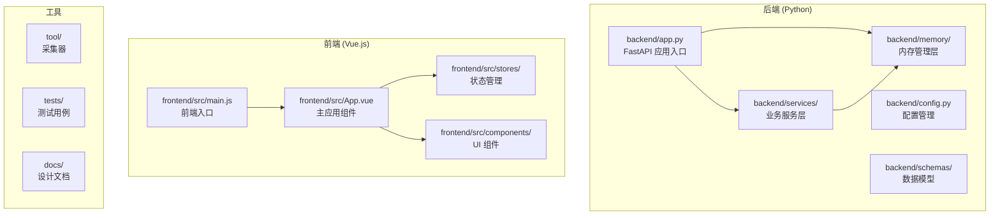
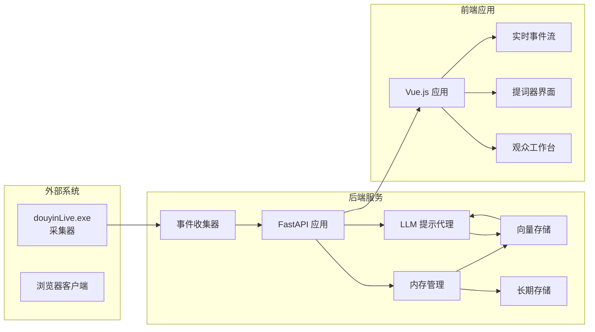
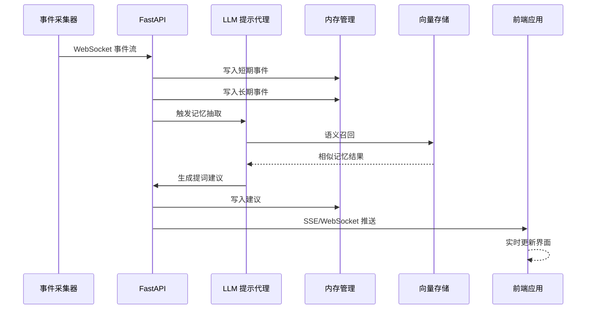
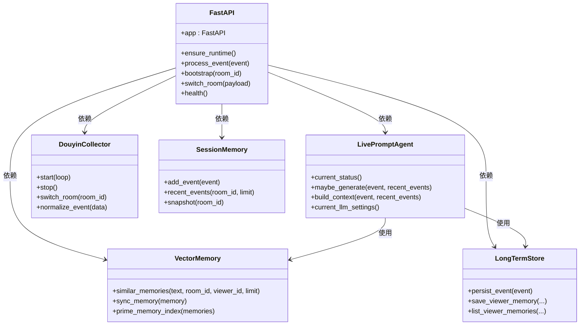
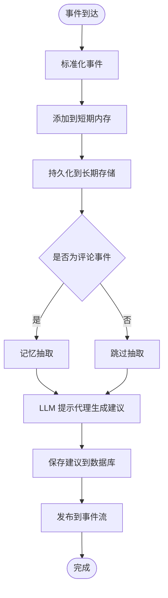
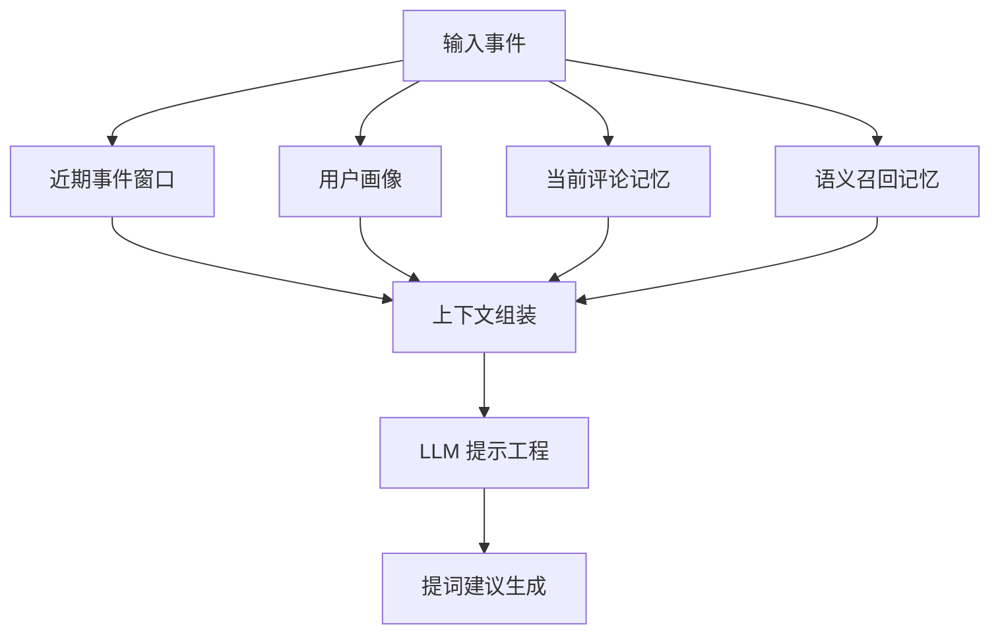
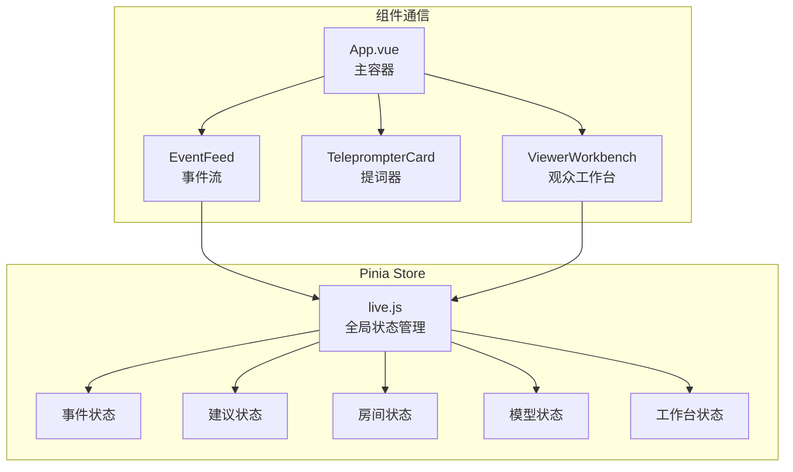
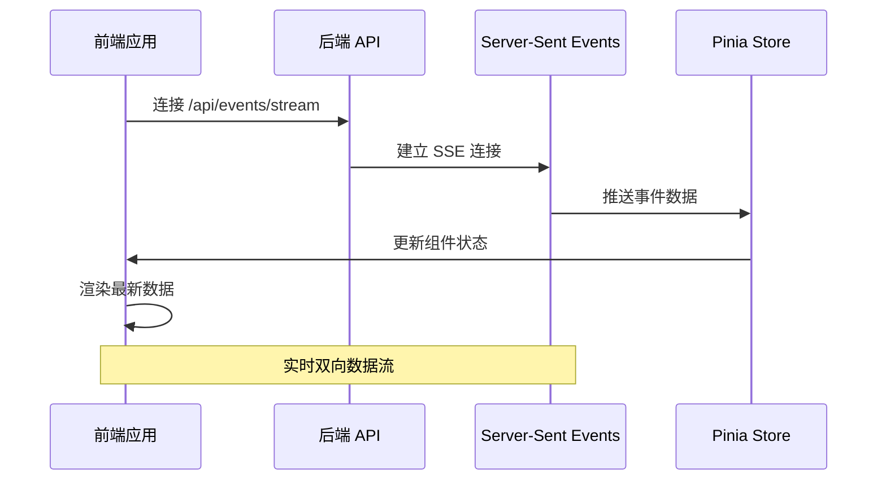
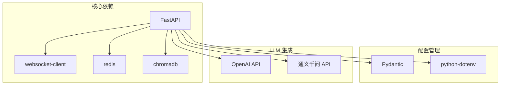

# 使用指南

<cite>
**本文档引用的文件**
- [README.md](file://README.md)
- [backend/app.py](file://backend/app.py)
- [backend/config.py](file://backend/config.py)
- [backend/services/agent.py](file://backend/services/agent.py)
- [backend/services/collector.py](file://backend/services/collector.py)
- [backend/memory/vector_store.py](file://backend/memory/vector_store.py)
- [backend/memory/session_memory.py](file://backend/memory/session_memory.py)
- [backend/memory/long_term.py](file://backend/memory/long_term.py)
- [frontend/src/App.vue](file://frontend/src/App.vue)
- [frontend/src/main.js](file://frontend/src/main.js)
- [frontend/src/stores/live.js](file://frontend/src/stores/live.js)
- [frontend/src/components/ViewerWorkbench.vue](file://frontend/src/components/ViewerWorkbench.vue)
- [frontend/src/components/EventFeed.vue](file://frontend/src/components/EventFeed.vue)
- [start_all.ps1](file://start_all.ps1)
- [requirements.txt](file://requirements.txt)
</cite>

## 目录
1. [简介](#简介)
2. [项目结构](#项目结构)
3. [核心组件](#核心组件)
4. [架构概览](#架构概览)
5. [详细组件分析](#详细组件分析)
6. [依赖关系分析](#依赖关系分析)
7. [性能考虑](#性能考虑)
8. [故障排除指南](#故障排除指南)
9. [结论](#结论)
10. [附录](#附录)

## 简介

DouYin_llm 是一个面向抖音直播场景的实时提词与观众记忆工作台。该项目的核心目标不是"自动开播"，而是为主播提供一套实时辅助系统，通过接收直播间事件、沉淀观众长期记忆、进行真实语义召回，再把可操作的信息反馈到前端工作台，帮助主播更自然地接话、识别老观众、维护互动关系。

### 项目定位

该项目特别适合以下直播场景：
- 聊天型直播
- 陪伴型直播  
- 人设型直播
- 需要"记住观众、理解上下文、给出下一句建议"的互动场景

### 主要特性

- **直播事件采集**：接入 `douyinLive` 的 WebSocket 事件流，归一化为统一 `LiveEvent`
- **后端实时处理**：FastAPI 负责事件入库、观众画像聚合、记忆抽取、语义召回、提词生成与 SSE/WebSocket 推送
- **长期记忆存储**：`SQLite + Chroma` 保存观众记忆、观众备注、会话数据
- **真语义召回链路**：支持真实 embedding 与向量检索，不再依赖"历史事件召回"
- **严格语义模式**：`EMBEDDING_STRICT=true` 时，禁用 hash fallback，确保不是"口头上的语义召回"

## 项目结构



**图表来源**
- [backend/app.py:1-689](file://backend/app.py#L1-L689)
- [frontend/src/App.vue:1-156](file://frontend/src/App.vue#L1-L156)

**章节来源**
- [README.md:207-220](file://README.md#L207-L220)

## 核心组件

### 后端核心组件

#### FastAPI 应用入口
`backend/app.py` 是整个后端系统的核心入口点，负责：
- 初始化所有依赖组件（内存管理、向量存储、LLM 提示代理等）
- 提供 REST API 接口
- 处理实时事件流
- 管理 SSE 和 WebSocket 连接

#### 配置管理系统
`backend/config.py` 提供集中化的配置管理，包括：
- LLM 模型配置（OpenAI、通义千问等）
- 向量嵌入配置
- Redis 连接配置
- 房间 ID 和其他运行时参数

#### 业务服务层
- **LivePromptAgent** (`backend/services/agent.py`)：负责提词生成、语义召回上下文拼装、模型状态输出
- **DouyinCollector** (`backend/services/collector.py`)：对接 douyinLive WebSocket，转换并分发事件
- **ViewerMemoryExtractor**：观众记忆抽取服务

#### 内存管理层
- **SessionMemory** (`backend/memory/session_memory.py`)：短期会话内存，支持 Redis 或进程内存储
- **LongTermStore** (`backend/memory/long_term.py`)：SQLite 长期存储，管理事件、建议、观众记忆等
- **VectorMemory** (`backend/memory/vector_store.py`)：Chroma 向量存储，支持语义召回

### 前端核心组件

#### 主应用组件
`frontend/src/App.vue` 是前端的根组件，负责：
- 状态栏显示（房间号、连接状态、模型状态）
- 主要内容区域布局（提词器卡片、事件流、观众工作台）
- 侧边栏工作台的显示和隐藏

#### 状态管理
`frontend/src/stores/live.js` 使用 Pinia 管理全局状态，包括：
- 房间切换和连接状态
- 实时事件流数据
- 提词建议列表
- 观众工作台数据
- LLM 设置管理

#### UI 组件
- **EventFeed** (`frontend/src/components/EventFeed.vue`)：直播事件流展示组件
- **ViewerWorkbench** (`frontend/src/components/ViewerWorkbench.vue`)：观众记忆纠偏工作台
- **TeleprompterCard**：实时提词器显示组件

**章节来源**
- [backend/app.py:175-230](file://backend/app.py#L175-L230)
- [frontend/src/App.vue:1-156](file://frontend/src/App.vue#L1-L156)
- [frontend/src/stores/live.js:82-210](file://frontend/src/stores/live.js#L82-L210)

## 架构概览



**图表来源**
- [README.md:35-45](file://README.md#L35-L45)
- [backend/app.py:420-441](file://backend/app.py#L420-L441)

### 数据流处理



**图表来源**
- [backend/app.py:249-405](file://backend/app.py#L249-L405)
- [backend/services/agent.py:139-216](file://backend/services/agent.py#L139-L216)

## 详细组件分析

### FastAPI 应用架构



**图表来源**
- [backend/app.py:175-230](file://backend/app.py#L175-L230)
- [backend/services/agent.py:23-61](file://backend/services/agent.py#L23-L61)

#### 事件处理流程



**图表来源**
- [backend/app.py:249-405](file://backend/app.py#L249-L405)

**章节来源**
- [backend/app.py:249-405](file://backend/app.py#L249-L405)

### LLM 提示代理

`LivePromptAgent` 是系统的核心智能组件，负责：

#### 提词生成逻辑
- **事件类型判断**：支持评论、礼物、关注等事件类型
- **上下文构建**：整合近期事件、用户画像、历史记忆
- **LLM 调用**：通过 OpenAI 兼容接口生成提词建议
- **启发式回退**：当 LLM 失败时使用启发式规则

#### 上下文构建



**图表来源**
- [backend/services/agent.py:117-137](file://backend/services/agent.py#L117-L137)

**章节来源**
- [backend/services/agent.py:139-216](file://backend/services/agent.py#L139-L216)

### 内存管理系统

#### 短期内存层
`SessionMemory` 提供高性能的短期数据存储：

- **Redis 支持**：生产环境推荐使用 Redis
- **进程内回退**：无 Redis 时自动使用内存存储
- **TTL 管理**：控制数据生命周期
- **事件窗口**：维护最近的事件和建议列表

#### 长期存储层
`LongTermStore` 基于 SQLite 提供持久化存储：

- **多表结构**：事件、建议、观众记忆、备注等
- **索引优化**：为常用查询建立索引
- **数据完整性**：通过外键约束保证数据一致性
- **增量更新**：支持事件的增量处理和重算

#### 向量存储层
`VectorMemory` 使用 Chroma 实现语义召回：

- **嵌入生成**：支持外部嵌入服务和本地哈希回退
- **严格模式**：支持 `EMBEDDING_STRICT` 严格模式
- **相似度计算**：基于向量距离的相似度评分
- **内存优化**：维护最近的内存条目以提高性能

**章节来源**
- [backend/memory/session_memory.py:17-113](file://backend/memory/session_memory.py#L17-L113)
- [backend/memory/long_term.py:48-800](file://backend/memory/long_term.py#L48-L800)
- [backend/memory/vector_store.py:59-396](file://backend/memory/vector_store.py#L59-L396)

### 前端应用架构

#### 状态管理架构



**图表来源**
- [frontend/src/stores/live.js:82-210](file://frontend/src/stores/live.js#L82-L210)
- [frontend/src/App.vue:72-112](file://frontend/src/App.vue#L72-L112)

#### 实时数据流



**图表来源**
- [frontend/src/stores/live.js:506-555](file://frontend/src/stores/live.js#L506-L555)

**章节来源**
- [frontend/src/stores/live.js:468-501](file://frontend/src/stores/live.js#L468-L501)

### 观众工作台功能

#### 记忆管理
`ViewerWorkbench` 提供完整的观众记忆管理功能：

- **记忆创建**：支持手动添加观众记忆
- **记忆编辑**：支持编辑现有记忆内容
- **状态管理**：支持失效、恢复、删除等状态操作
- **置顶功能**：支持重要记忆的置顶显示
- **时间线追踪**：显示记忆的操作历史

#### 备注管理
- **人工备注**：支持主播添加个人备注
- **置顶备注**：重要备注可以置顶显示
- **备注编辑**：支持备注内容的编辑和删除

**章节来源**
- [frontend/src/components/ViewerWorkbench.vue:172-358](file://frontend/src/components/ViewerWorkbench.vue#L172-L358)

## 依赖关系分析

### 后端依赖图



**图表来源**
- [requirements.txt:1-6](file://requirements.txt#L1-L6)

### 前端依赖图

```mermaid
graph TB
subgraph "核心框架"
A[Vue 3]
B[Pinia]
end
subgraph "构建工具"
C[Vite]
D[Tailwind CSS]
E[PostCSS]
end
subgraph "开发工具"
F[@vitejs/plugin-vue]
G[tailwindcss]
H[autoprefixer]
end
A --> B
C --> D
C --> E
C --> F
D --> G
E --> H
```

**图表来源**
- [frontend/package.json:1-23](file://frontend/package.json#L1-L23)

**章节来源**
- [requirements.txt:1-6](file://requirements.txt#L1-L6)
- [frontend/package.json:1-23](file://frontend/package.json#L1-L23)

## 性能考虑

### 内存优化策略

1. **短期内存限制**：SessionMemory 使用固定大小的队列，避免内存无限增长
2. **向量索引优化**：VectorMemory 只维护最近的内存条目，提高查询性能
3. **批处理机制**：LongTermStore 支持批量写入，减少数据库操作开销

### 并发处理

1. **异步事件处理**：使用 asyncio 处理 WebSocket 事件，避免阻塞
2. **线程安全**：内存组件设计考虑多线程访问的安全性
3. **连接池管理**：Redis 和数据库连接使用连接池优化资源使用

### 缓存策略

1. **Redis 缓存**：生产环境推荐使用 Redis 作为缓存层
2. **向量索引缓存**：Chroma 自动管理向量索引的缓存
3. **前端状态缓存**：Pinia 状态管理提供响应式缓存机制

## 故障排除指南

### 常见问题诊断

#### 后端启动问题
1. **依赖缺失**：检查 `requirements.txt` 中的依赖是否正确安装
2. **端口占用**：确保 8010 端口未被其他程序占用
3. **环境变量**：检查 `.env` 文件中的配置是否正确

#### 前端连接问题
1. **CORS 错误**：检查后端 CORS 配置
2. **SSE 连接**：确认 `/api/events/stream` 路径可访问
3. **WebSocket 连接**：检查 `/ws/live` 路径的连接状态

#### 数据库问题
1. **SQLite 权限**：确保 `data/live_prompter.db` 文件具有写入权限
2. **Chroma 目录**：检查 `data/chroma/` 目录的可写权限
3. **表结构**：运行数据库初始化脚本确保表结构完整

### 调试技巧

1. **健康检查**：访问 `/health` 端点检查系统状态
2. **日志查看**：检查 `logs/` 目录中的日志文件
3. **实时监控**：使用前端界面观察事件流和建议生成状态

**章节来源**
- [backend/app.py:430-441](file://backend/app.py#L430-L441)

## 结论

DouYin_llm 是一个功能完整、架构清晰的直播实时辅助系统。它通过模块化的组件设计，实现了从事件采集、智能处理到实时反馈的完整闭环。

### 系统优势

1. **模块化设计**：清晰的组件分离便于维护和扩展
2. **实时性**：基于 SSE 和 WebSocket 的实时数据推送
3. **智能化**：结合 LLM 和语义召回的智能提词系统
4. **可扩展性**：支持多种 LLM 服务和嵌入模型
5. **用户友好**：提供直观的前端工作台和丰富的交互功能

### 发展方向

1. **性能优化**：进一步优化向量检索和 LLM 调用性能
2. **功能增强**：扩展更多直播场景的支持
3. **部署优化**：提供更简便的部署和配置方案
4. **监控完善**：增强系统的可观测性和告警能力

## 附录

### 快速启动指南

1. **启动采集器**
   ```powershell
   .\tool\douyinLive-windows-amd64.exe
   ```

2. **复制环境变量**
   ```powershell
   Copy-Item .env.example .env
   ```

3. **安装后端依赖**
   ```powershell
   pip install -r requirements.txt
   ```

4. **启动后端服务**
   ```powershell
   python -m uvicorn backend.app:app --host 127.0.0.1 --port 8010 --reload
   ```

5. **启动前端应用**
   ```powershell
   cd frontend
   npm install
   npm run dev -- --host 127.0.0.1 --strictPort --port 5173
   ```

6. **使用启动脚本**
   ```powershell
   .\start_all.ps1
   ```

### 配置选项

#### LLM 相关配置
- `LLM_MODE`: LLM 模式（heuristic/openai/qwen）
- `LLM_BASE_URL`: LLM API 基础 URL
- `LLM_MODEL`: LLM 模型名称
- `LLM_API_KEY`: LLM API 密钥
- `DASHSCOPE_API_KEY`: 通义千问 API 密钥

#### 向量和嵌入配置
- `DATA_DIR`: 数据目录
- `DATABASE_PATH`: SQLite 数据库路径
- `CHROMA_DIR`: Chroma 向量数据库目录
- `EMBEDDING_MODE`: 嵌入模式（cloud/local）
- `EMBEDDING_MODEL`: 嵌入模型名称
- `EMBEDDING_API_KEY`: 嵌入 API 密钥

#### 严格语义模式
```powershell
EMBEDDING_STRICT=true
```

启用后：
- 禁用 hash embedding 回退
- 禁用向量召回回退
- 更严格的语义后端检查