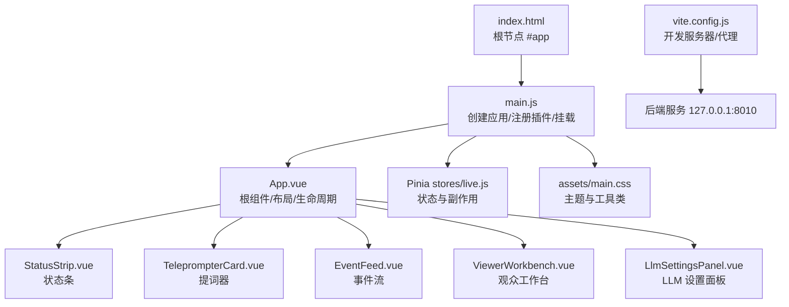
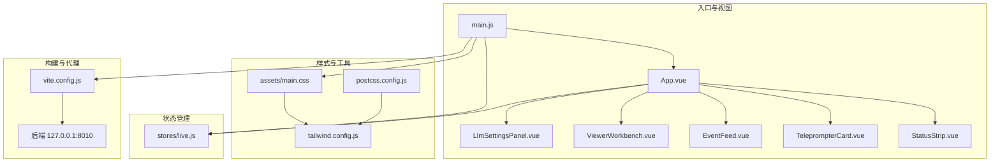
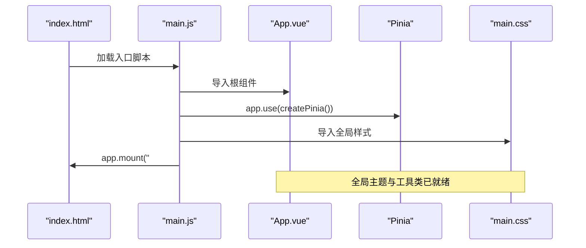
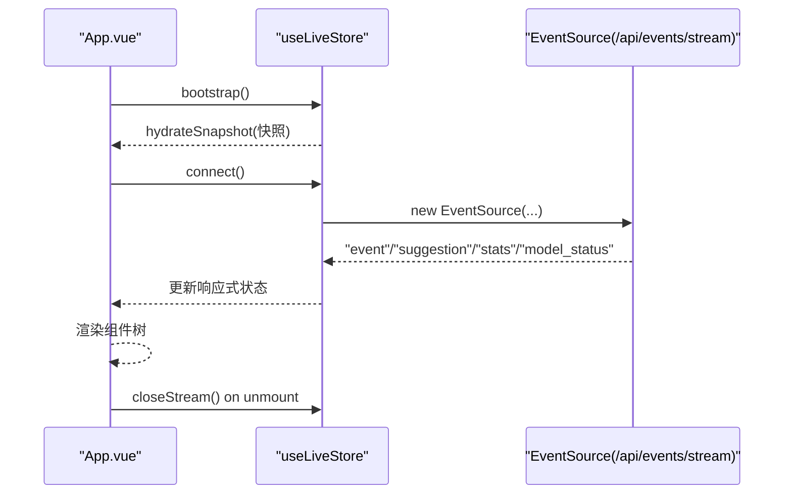
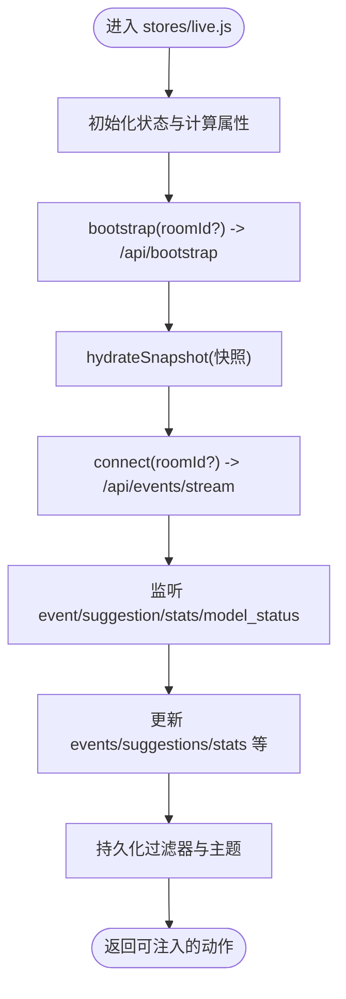
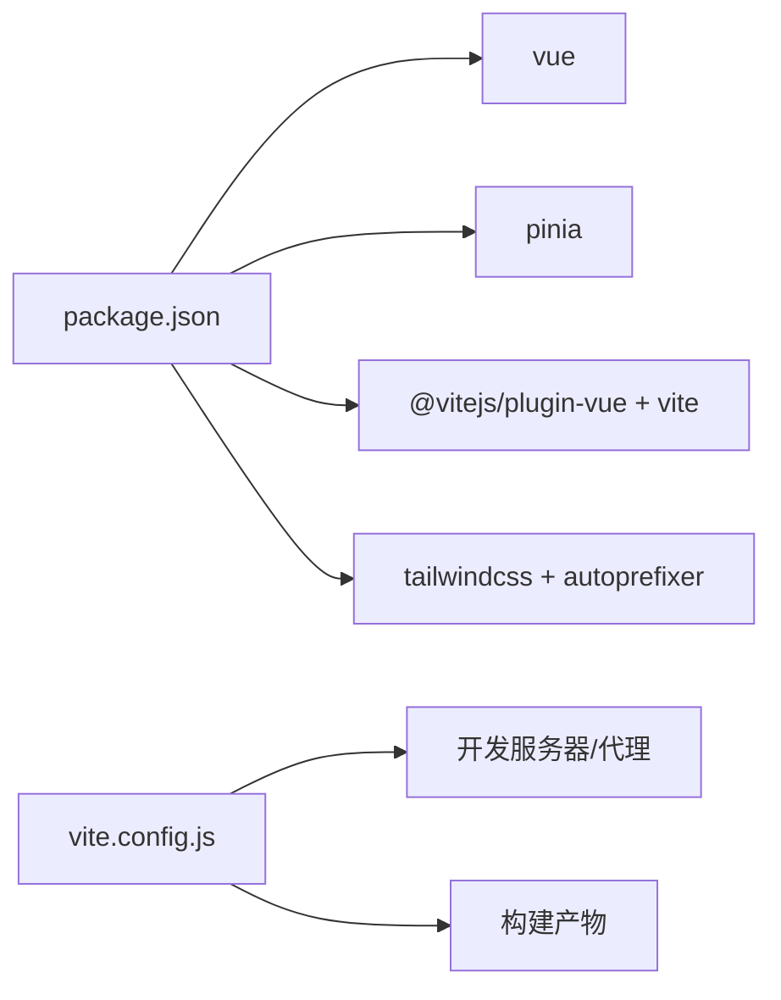

# Vue 3 应用架构

<cite>
**本文引用的文件**
- [frontend/src/main.js](file://frontend/src/main.js)
- [frontend/src/App.vue](file://frontend/src/App.vue)
- [frontend/index.html](file://frontend/index.html)
- [frontend/vite.config.js](file://frontend/vite.config.js)
- [frontend/package.json](file://frontend/package.json)
- [frontend/src/assets/main.css](file://frontend/src/assets/main.css)
- [frontend/tailwind.config.js](file://frontend/tailwind.config.js)
- [frontend/postcss.config.js](file://frontend/postcss.config.js)
- [frontend/src/stores/live.js](file://frontend/src/stores/live.js)
- [frontend/src/i18n.js](file://frontend/src/i18n.js)
- [frontend/src/components/EventFeed.vue](file://frontend/src/components/EventFeed.vue)
- [frontend/src/components/TeleprompterCard.vue](file://frontend/src/components/TeleprompterCard.vue)
- [frontend/src/components/StatusStrip.vue](file://frontend/src/components/StatusStrip.vue)
- [frontend/src/components/ViewerWorkbench.vue](file://frontend/src/components/ViewerWorkbench.vue)
- [frontend/src/components/LlmSettingsPanel.vue](file://frontend/src/components/LlmSettingsPanel.vue)
</cite>

## 目录
1. [引言](#引言)
2. [项目结构](#项目结构)
3. [核心组件](#核心组件)
4. [架构总览](#架构总览)
5. [详细组件分析](#详细组件分析)
6. [依赖关系分析](#依赖关系分析)
7. [性能考虑](#性能考虑)
8. [故障排查指南](#故障排查指南)
9. [结论](#结论)
10. [附录](#附录)

## 引言
本文件面向 DouYin_llm 的前端 Vue 3 应用，系统性梳理从应用入口到组件树、状态管理、构建与样式体系、生命周期与错误处理、以及开发与生产的差异与性能优化策略。目标是帮助开发者快速理解并高效维护该应用。

## 项目结构
前端位于 frontend 目录，采用典型的 Vue 3 单页应用（SPA）结构：
- 入口与挂载：index.html 提供根节点，main.js 创建并挂载 Vue 应用。
- 根组件：App.vue 负责布局与子组件编排，并在挂载阶段触发直播状态引导与连接。
- 组件层：按功能拆分至 components 子目录，如状态条、事件流、提词器、观众工作台、LLM 设置面板等。
- 状态管理：Pinia stores 定义在 stores 子目录，集中管理直播相关状态与副作用。
- 样式与主题：Tailwind + 自定义 CSS 变量，支持明暗主题切换与过渡动画。
- 构建与工具链：Vite 作为开发服务器与打包工具，PostCSS/Tailwind 处理样式。

图表来源
- [frontend/index.html:1-16](file://frontend/index.html#L1-L16)
- [frontend/src/main.js:1-17](file://frontend/src/main.js#L1-L17)
- [frontend/src/App.vue:1-139](file://frontend/src/App.vue#L1-L139)
- [frontend/src/assets/main.css:1-144](file://frontend/src/assets/main.css#L1-L144)
- [frontend/vite.config.js:1-23](file://frontend/vite.config.js#L1-L23)

章节来源
- [frontend/index.html:1-16](file://frontend/index.html#L1-L16)
- [frontend/src/main.js:1-17](file://frontend/src/main.js#L1-L17)
- [frontend/src/App.vue:1-139](file://frontend/src/App.vue#L1-L139)

## 核心组件
- 应用入口 main.js：创建 Vue 应用实例，注册 Pinia，导入全局样式，最后挂载到 index.html 的 #app。
- 根组件 App.vue：负责布局与子组件编排；在 onMounted 生命周期内执行直播引导与连接；在 onBeforeUnmount 清理资源。
- Pinia 状态 stores/live.js：集中管理房间号、事件流、SSE 连接、过滤器、统计、LLM 设置、观众工作台等状态与异步操作。
- 国际化 i18n.js：提供多语言翻译函数与错误文本转换。
- 组件族：StatusStrip、TeleprompterCard、EventFeed、ViewerWorkbench、LlmSettingsPanel，分别承担状态展示、提词建议呈现、事件筛选与查看、观众详情与笔记、LLM 参数配置。

章节来源
- [frontend/src/main.js:1-17](file://frontend/src/main.js#L1-L17)
- [frontend/src/App.vue:1-139](file://frontend/src/App.vue#L1-L139)
- [frontend/src/stores/live.js:1-846](file://frontend/src/stores/live.js#L1-L846)
- [frontend/src/i18n.js:1-316](file://frontend/src/i18n.js#L1-L316)

## 架构总览
应用采用“根组件 + Pinia 状态 + 组件树”的分层架构：
- 入口层：main.js 负责应用实例创建与插件注册。
- 视图层：App.vue 作为容器，承载多个功能区域组件。
- 状态层：Pinia stores/live.js 统一管理直播状态、事件与 SSE 连接。
- 工具链层：Vite、Tailwind、PostCSS 提供开发体验与样式体系。
- 后端集成：通过 /api 与 /ws 代理到本地后端服务，实现引导、事件流与设置读写。

图表来源
- [frontend/src/main.js:1-17](file://frontend/src/main.js#L1-L17)
- [frontend/src/App.vue:1-139](file://frontend/src/App.vue#L1-L139)
- [frontend/src/stores/live.js:1-846](file://frontend/src/stores/live.js#L1-L846)
- [frontend/src/assets/main.css:1-144](file://frontend/src/assets/main.css#L1-L144)
- [frontend/tailwind.config.js:1-23](file://frontend/tailwind.config.js#L1-L23)
- [frontend/postcss.config.js:1-9](file://frontend/postcss.config.js#L1-L9)
- [frontend/vite.config.js:1-23](file://frontend/vite.config.js#L1-L23)

## 详细组件分析

### 应用入口 main.js 初始化流程
- 创建应用实例并引入 App.vue 根组件。
- 注册 Pinia，使全应用共享同一份直播状态。
- 导入全局样式，确保主题与工具类在挂载前生效。
- 将应用挂载到 index.html 中的 #app 根节点。

图表来源
- [frontend/index.html:1-16](file://frontend/index.html#L1-L16)
- [frontend/src/main.js:1-17](file://frontend/src/main.js#L1-L17)
- [frontend/src/assets/main.css:1-144](file://frontend/src/assets/main.css#L1-L144)

章节来源
- [frontend/src/main.js:1-17](file://frontend/src/main.js#L1-L17)
- [frontend/index.html:1-16](file://frontend/index.html#L1-L16)

### 根组件 App.vue 结构与生命周期
- 组件职责：布局两列区段（提词器 + 事件流），承载状态条、观众工作台与 LLM 设置面板。
- 生命周期：
  - onMounted：调用直播引导方法，建立 SSE 连接；绑定 beforeunload 清理资源。
  - onBeforeUnmount：断开 SSE，移除窗口事件监听。
- 状态来源：通过 Pinia 的 useLiveStore 获取响应式状态与动作，驱动子组件渲染与交互。

图表来源
- [frontend/src/App.vue:47-64](file://frontend/src/App.vue#L47-L64)
- [frontend/src/stores/live.js:440-523](file://frontend/src/stores/live.js#L440-L523)

章节来源
- [frontend/src/App.vue:1-139](file://frontend/src/App.vue#L1-L139)
- [frontend/src/stores/live.js:1-846](file://frontend/src/stores/live.js#L1-L846)

### Pinia 状态 stores/live.js 设计要点
- 状态域划分：房间号、草稿、主题、连接状态、事件过滤器、事件与建议队列、统计、LLM 设置、观众工作台、笔记草稿与编辑态等。
- 计算属性：活跃建议、活跃事件、下一主题标签、是否全选、过滤后的事件列表等。
- 副作用与网络交互：
  - 引导接口：bootstrap -> /api/bootstrap
  - 切房接口：/api/room (POST)
  - SSE 事件：event/suggestion/stats/model_status
  - LLM 设置：/api/settings/llm (GET/PUT)
  - 观众详情：/api/viewer?room_id&viewer_id&nickname
  - 观众笔记：/api/viewer/notes (POST)，/api/viewer/notes/{id} (DELETE)
- 本地持久化：事件类型过滤器与主题偏好存储于 localStorage。
- 热更新清理：Vite HMR dispose 关闭 SSE，避免内存泄漏。

图表来源
- [frontend/src/stores/live.js:75-800](file://frontend/src/stores/live.js#L75-L800)

章节来源
- [frontend/src/stores/live.js:1-846](file://frontend/src/stores/live.js#L1-L846)

### 组件树设计原则与模块化组织
- 功能解耦：每个组件聚焦单一职责，通过 props 与 emits 与父组件或 Pinia 通信。
- 响应式驱动：组件内部不直接管理复杂状态，而是消费 Pinia 计算结果与动作。
- 样式复用：统一使用 Tailwind 工具类与自定义 CSS 变量，配合主题切换。
- 国际化：所有文案通过 i18n.js 的 translate 函数提供，错误信息通过 translateError 转换。

章节来源
- [frontend/src/components/StatusStrip.vue:1-316](file://frontend/src/components/StatusStrip.vue#L1-L316)
- [frontend/src/components/TeleprompterCard.vue:1-97](file://frontend/src/components/TeleprompterCard.vue#L1-L97)
- [frontend/src/components/EventFeed.vue:1-214](file://frontend/src/components/EventFeed.vue#L1-L214)
- [frontend/src/components/ViewerWorkbench.vue:1-302](file://frontend/src/components/ViewerWorkbench.vue#L1-L302)
- [frontend/src/components/LlmSettingsPanel.vue:1-122](file://frontend/src/components/LlmSettingsPanel.vue#L1-L122)
- [frontend/src/i18n.js:1-316](file://frontend/src/i18n.js#L1-L316)

### 错误边界与异常处理
- 网络错误：/api/* 与 /ws* 请求通过代理到后端，错误通过响应体解析或状态文本转换为用户可读错误。
- SSE 错误：连接状态 onerror 映射为“重连中”，并在 onopen 后恢复为“已连接”。
- 观众工作台：加载/保存/删除笔记均包含错误捕获与 loading 状态控制。
- 全局清理：beforeunload 与 onBeforeUnmount 统一关闭 SSE，避免资源泄漏。

章节来源
- [frontend/src/stores/live.js:201-212](file://frontend/src/stores/live.js#L201-L212)
- [frontend/src/stores/live.js:492-508](file://frontend/src/stores/live.js#L492-L508)
- [frontend/src/App.vue:43-64](file://frontend/src/App.vue#L43-L64)

## 依赖关系分析
- 运行时依赖：vue、pinia。
- 开发依赖：@vitejs/plugin-vue、vite、tailwindcss、autoprefixer、postcss。
- 构建产物：index.html 作为壳，main.js 作为入口，其余资源由 Vite 打包。

图表来源
- [frontend/package.json:1-23](file://frontend/package.json#L1-L23)
- [frontend/vite.config.js:1-23](file://frontend/vite.config.js#L1-L23)

章节来源
- [frontend/package.json:1-23](file://frontend/package.json#L1-L23)
- [frontend/vite.config.js:1-23](file://frontend/vite.config.js#L1-L23)

## 性能考虑
- 事件与建议上限：限制事件与建议数组长度，避免内存膨胀。
- 过滤与懒渲染：仅渲染可见事件数量，滚动容器限制高度。
- 主题切换与过渡：CSS 变量与过渡动画平滑，减少重绘。
- 构建优化：Vite 默认启用模块热替换与按需打包；Tailwind 通过 content 白名单裁剪未使用样式。
- SSE 连接管理：在切换房间与卸载时及时关闭，避免重复连接与内存泄漏。

章节来源
- [frontend/src/stores/live.js:5-6](file://frontend/src/stores/live.js#L5-L6)
- [frontend/src/components/EventFeed.vue:162-211](file://frontend/src/components/EventFeed.vue#L162-L211)
- [frontend/src/assets/main.css:82-85](file://frontend/src/assets/main.css#L82-L85)
- [frontend/src/stores/live.js:474-523](file://frontend/src/stores/live.js#L474-L523)

## 故障排查指南
- 无法连接后端：检查 vite.config.js 代理配置是否指向正确地址与端口。
- 事件流不更新：确认 SSE 连接状态与 onerror/onopen 分支逻辑。
- 切房失败：查看 /api/room 返回的错误信息，核对房间号与后端状态。
- 主题切换无效：确认 CSS 变量与 dataset.theme 是否正确写入。
- 国际化文案缺失：检查 i18n.js 中对应键是否存在，回退逻辑是否生效。

章节来源
- [frontend/vite.config.js:10-21](file://frontend/vite.config.js#L10-L21)
- [frontend/src/stores/live.js:492-508](file://frontend/src/stores/live.js#L492-L508)
- [frontend/src/stores/live.js:544-568](file://frontend/src/stores/live.js#L544-L568)
- [frontend/src/assets/main.css:66-73](file://frontend/src/assets/main.css#L66-L73)
- [frontend/src/i18n.js:278-316](file://frontend/src/i18n.js#L278-L316)

## 结论
该应用以 Vue 3 + Pinia 为核心，结合 Vite、Tailwind 与自定义 CSS 变量，构建了清晰的组件化与状态化前端架构。通过明确的生命周期管理与错误处理策略，保证了直播场景下的稳定性与可维护性。建议在后续迭代中持续关注事件上限与渲染性能、SSE 连接的健壮性以及国际化文案的完整性。

## 附录

### 开发与生产差异
- 开发模式：Vite 提供热更新与代理，/api 与 /ws 代理至后端 127.0.0.1:8010。
- 生产模式：使用 vite build 产出静态资源，部署于 Nginx/Apache 等静态服务器，index.html 作为 SPA 入口。

章节来源
- [frontend/vite.config.js:1-23](file://frontend/vite.config.js#L1-L23)
- [frontend/package.json:6-10](file://frontend/package.json#L6-L10)