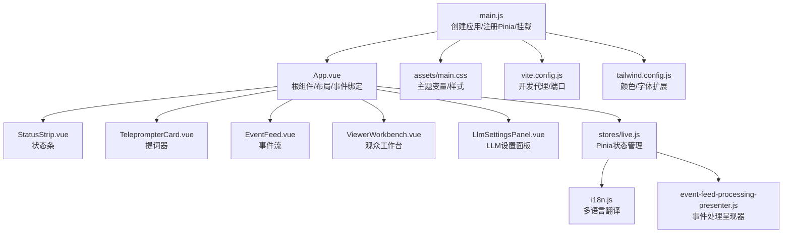
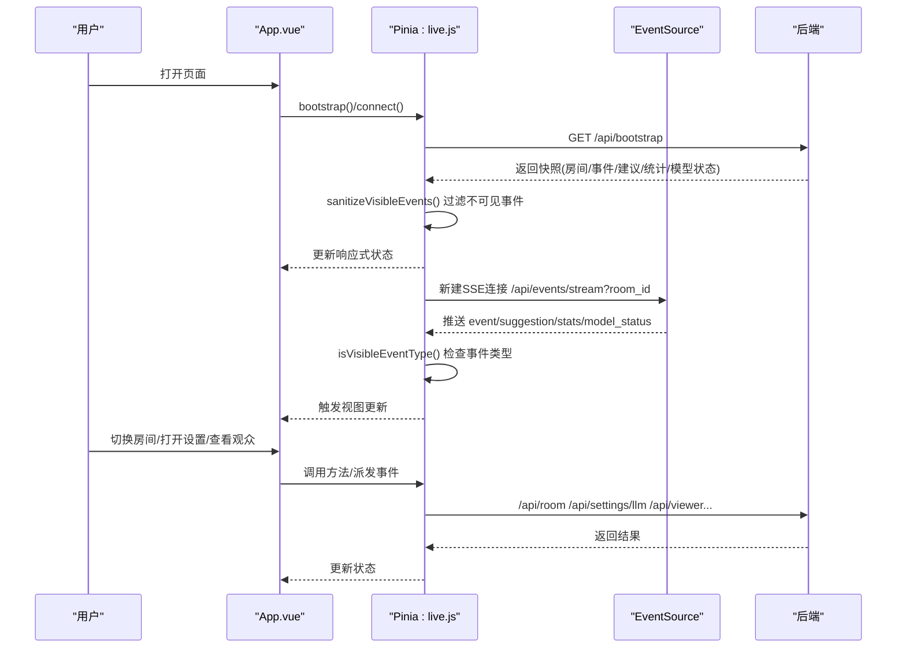
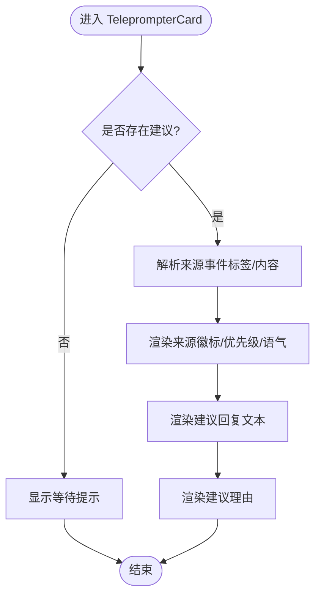
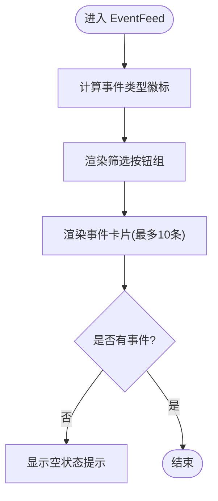
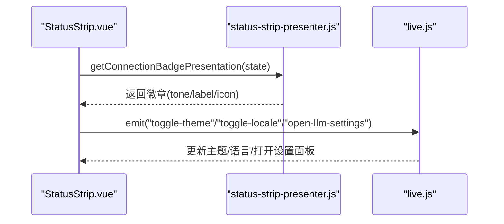
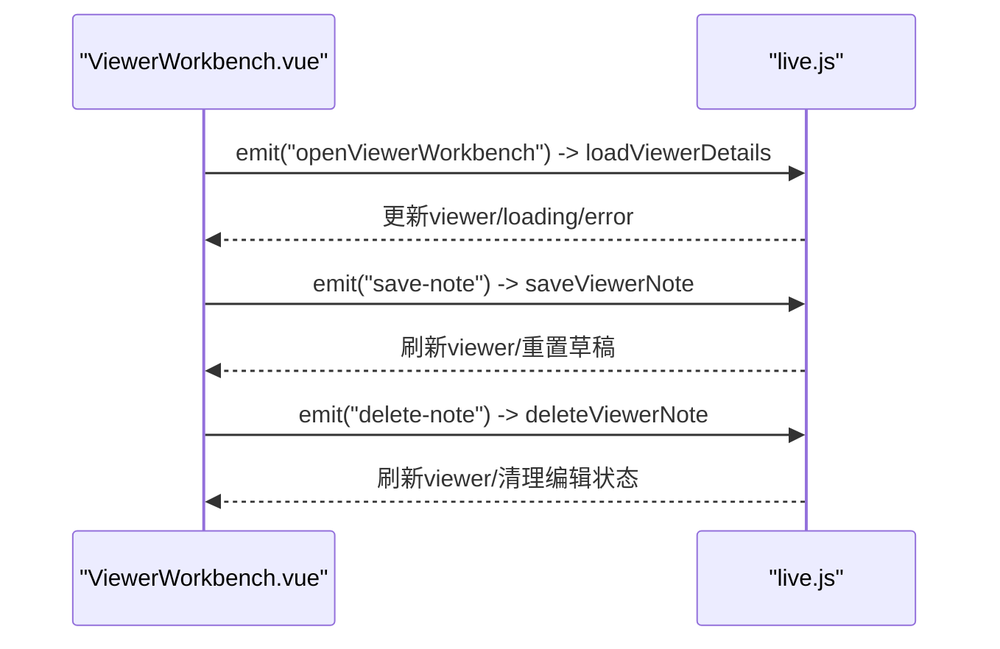
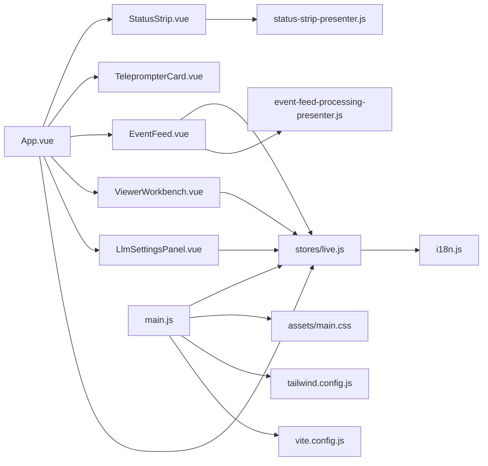
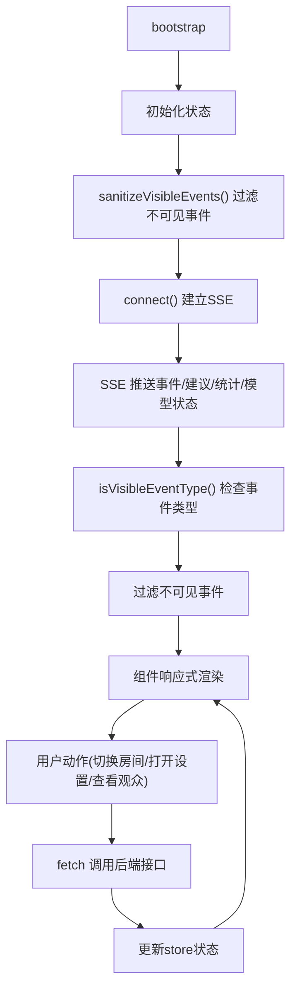

# 前端应用

<cite>
**本文引用的文件**
- [frontend/src/main.js](file://frontend/src/main.js)
- [frontend/src/App.vue](file://frontend/src/App.vue)
- [frontend/src/components/TeleprompterCard.vue](file://frontend/src/components/TeleprompterCard.vue)
- [frontend/src/components/EventFeed.vue](file://frontend/src/components/EventFeed.vue)
- [frontend/src/components/StatusStrip.vue](file://frontend/src/components/StatusStrip.vue)
- [frontend/src/components/ViewerWorkbench.vue](file://frontend/src/components/ViewerWorkbench.vue)
- [frontend/src/components/LlmSettingsPanel.vue](file://frontend/src/components/LlmSettingsPanel.vue)
- [frontend/src/stores/live.js](file://frontend/src/stores/live.js)
- [frontend/src/i18n.js](file://frontend/src/i18n.js)
- [frontend/src/assets/main.css](file://frontend/src/assets/main.css)
- [frontend/src/components/status-strip-presenter.js](file://frontend/src/components/status-strip-presenter.js)
- [frontend/src/components/event-feed-processing-presenter.js](file://frontend/src/components/event-feed-processing-presenter.js)
- [frontend/vite.config.js](file://frontend/vite.config.js)
- [frontend/tailwind.config.js](file://frontend/tailwind.config.js)
- [frontend/package.json](file://frontend/package.json)
- [frontend/src/stores/live.test.mjs](file://frontend/src/stores/live.test.mjs)
- [frontend/src/stores/live-event-feed.test.mjs](file://frontend/src/stores/live-event-feed.test.mjs)
- [frontend/src/components/status-strip-layout.test.mjs](file://frontend/src/components/status-strip-layout.test.mjs)
- [frontend/src/components/status-strip-presenter.test.mjs](file://frontend/src/components/status-strip-presenter.test.mjs)
</cite>

## 目录
1. [引言](#引言)
2. [项目结构](#项目结构)
3. [核心组件](#核心组件)
4. [架构总览](#架构总览)
5. [组件详解](#组件详解)
6. [依赖关系分析](#依赖关系分析)
7. [性能考量](#性能考量)
8. [故障排查指南](#故障排查指南)
9. [结论](#结论)
10. [附录](#附录)

## 引言
本文件面向DouYin_llm前端应用，围绕Vue 3与Pinia构建的直播场景交互界面，提供从整体架构、组件树、状态管理到组件通信与集成方式的系统化文档。重点覆盖以下组件：TeleprompterCard（提词器卡片）、EventFeed（事件流）、StatusStrip（状态条）、ViewerWorkbench（观众工作台）与LlmSettingsPanel（大模型设置面板）。同时阐述Pinia状态管理的数据流、响应式设计与可访问性实践、样式定制与主题支持、以及跨浏览器与性能优化策略。

**更新** 新增可见事件类型过滤和事件净化功能，改善直播流显示体验，通过`VISIBLE_EVENT_TYPES`配置和`sanitizeVisibleEvents()`函数实现智能事件过滤，提升用户体验和系统性能。

## 项目结构
前端采用Vite + Vue 3 + Pinia + TailwindCSS技术栈，入口在main.js中创建应用并注册Pinia；App.vue作为根组件组织各业务组件，并通过Pinia store统一管理直播状态（房间、SSE连接、事件列表、建议回复、模型状态、过滤器、主题与语言等）。

图表来源
- [frontend/src/main.js:1-17](file://frontend/src/main.js#L1-L17)
- [frontend/src/App.vue:1-139](file://frontend/src/App.vue#L1-L139)
- [frontend/src/stores/live.js:1-1128](file://frontend/src/stores/live.js#L1-L1128)
- [frontend/src/i18n.js:1-316](file://frontend/src/i18n.js#L1-L316)
- [frontend/src/assets/main.css:1-144](file://frontend/src/assets/main.css#L1-L144)
- [frontend/vite.config.js:1-23](file://frontend/vite.config.js#L1-L23)
- [frontend/tailwind.config.js:1-23](file://frontend/tailwind.config.js#L1-L23)

章节来源
- [frontend/src/main.js:1-17](file://frontend/src/main.js#L1-L17)
- [frontend/src/App.vue:1-139](file://frontend/src/App.vue#L1-L139)
- [frontend/package.json:1-23](file://frontend/package.json#L1-L23)

## 核心组件
- TeleprompterCard：展示当前最高优先级的回复建议，包含来源事件摘要与建议回复文本，支持多语言。
- EventFeed：实时事件流展示与筛选，支持按事件类型过滤、清空、查看观众详情，**新增事件净化功能**，自动过滤不可见事件类型。
- StatusStrip：顶部状态条，包含房间切换、连接状态徽章、模型状态、统计信息与工具按钮（语言/主题切换、打开LLM设置）。
- ViewerWorkbench：侧边抽屉式观众详情与备注工作台，支持加载、查看记忆、写入/编辑/删除备注。
- LlmSettingsPanel：侧边抽屉式LLM设置面板，支持修改模型名与系统提示词、保存/重置、错误提示。

章节来源
- [frontend/src/components/TeleprompterCard.vue:1-97](file://frontend/src/components/TeleprompterCard.vue#L1-L97)
- [frontend/src/components/EventFeed.vue:1-375](file://frontend/src/components/EventFeed.vue#L1-L375)
- [frontend/src/components/StatusStrip.vue:1-316](file://frontend/src/components/StatusStrip.vue#L1-L316)
- [frontend/src/components/ViewerWorkbench.vue:1-302](file://frontend/src/components/ViewerWorkbench.vue#L1-L302)
- [frontend/src/components/LlmSettingsPanel.vue:1-122](file://frontend/src/components/LlmSettingsPanel.vue#L1-L122)

## 架构总览
应用采用"根组件集中布局 + Pinia单仓状态"的架构。根组件负责生命周期与事件订阅，Pinia store负责数据持久化与跨组件共享。组件间通过props与事件进行松耦合通信，状态变更驱动UI更新。

图表来源
- [frontend/src/App.vue:47-64](file://frontend/src/App.vue#L47-L64)
- [frontend/src/stores/live.js:204-206](file://frontend/src/stores/live.js#L204-L206)
- [frontend/src/stores/live.js:481-487](file://frontend/src/stores/live.js#L481-L487)
- [frontend/src/stores/live.js:528-554](file://frontend/src/stores/live.js#L528-L554)

## 组件详解

### TeleprompterCard 组件
- 功能要点
  - 展示当前最高优先级建议回复与来源事件摘要。
  - 支持根据来源类型与优先级/语气标签渲染。
  - 多语言支持，动态翻译标签与占位文案。
- 关键实现
  - 使用props接收locale、suggestion与sourceEvent。
  - 通过translate函数与本地化字典进行文案翻译。
  - 根据sourceEvent构造显示内容，未知用户回退至通用文案。
- 可访问性与样式
  - 使用语义化标题与分层排版，确保屏幕阅读器友好。
  - 基于Tailwind与CSS变量的主题适配，保证深浅色对比度。

图表来源
- [frontend/src/components/TeleprompterCard.vue:19-36](file://frontend/src/components/TeleprompterCard.vue#L19-L36)
- [frontend/src/components/TeleprompterCard.vue:49-95](file://frontend/src/components/TeleprompterCard.vue#L49-L95)

章节来源
- [frontend/src/components/TeleprompterCard.vue:1-97](file://frontend/src/components/TeleprompterCard.vue#L1-L97)
- [frontend/src/i18n.js:58-69](file://frontend/src/i18n.js#L58-L69)

### EventFeed 组件
- 功能要点
  - 实时展示事件列表，支持按事件类型筛选与全选/清空。
  - 提供"查看观众"能力，触发父组件打开ViewerWorkbench。
  - 对不同事件类型提供差异化边框与背景色，增强可读性。
  - **新增事件净化功能**，自动过滤不可见事件类型，提升显示效率。
- 关键实现
  - 通过props接收events、filters、selectedEventTypes与areAllEventTypesSelected。
  - 事件过滤逻辑基于computed与本地存储的筛选集合。
  - 事件卡片样式根据事件类型映射颜色，避免视觉混淆。
  - **新增processingDetails和processingTimeline方法**，提供事件处理流程的详细信息。
- 用户交互
  - 清空按钮禁用条件：事件为空。
  - 全选按钮禁用条件：已全选。
  - 单个过滤器禁用条件：仅剩一个被选中时不可取消。

图表来源
- [frontend/src/components/EventFeed.vue:34-53](file://frontend/src/components/EventFeed.vue#L34-L53)
- [frontend/src/components/EventFeed.vue:140-161](file://frontend/src/components/EventFeed.vue#L140-L161)
- [frontend/src/components/EventFeed.vue:162-211](file://frontend/src/components/EventFeed.vue#L162-L211)

章节来源
- [frontend/src/components/EventFeed.vue:1-375](file://frontend/src/components/EventFeed.vue#L1-L375)

### StatusStrip 组件
- 功能要点
  - 房间号输入与切换、错误提示、连接状态徽章与脉冲动画。
  - 模型状态展示与"打开LLM设置"入口。
  - 工具区：语言切换（EN/中文）、主题切换（明/暗），并根据主题动态调整按钮样式。
- 关键实现
  - 使用presenter模块将连接状态映射为徽章呈现（图标/色调/标签）。
  - computed属性将枚举值翻译为本地化文案。
  - 通过emit向上派发事件，由父组件调用store方法。

图表来源
- [frontend/src/components/StatusStrip.vue:58-89](file://frontend/src/components/StatusStrip.vue#L58-L89)
- [frontend/src/components/StatusStrip.vue:100-111](file://frontend/src/components/StatusStrip.vue#L100-L111)
- [frontend/src/components/status-strip-presenter.js:29-34](file://frontend/src/components/status-strip-presenter.js#L29-L34)

章节来源
- [frontend/src/components/StatusStrip.vue:1-316](file://frontend/src/components/StatusStrip.vue#L1-L316)
- [frontend/src/components/status-strip-presenter.js:1-35](file://frontend/src/components/status-strip-presenter.js#L1-L35)

### ViewerWorkbench 组件
- 功能要点
  - 抽屉式侧栏，展示观众昵称、ID与统计信息。
  - 展示语义记忆、近期评论/礼物事件、最近场次。
  - 备注编辑：草稿、置顶、保存/更新/删除，支持错误提示与加载态。
- 关键实现
  - 通过props接收locale、open、viewer、loading、error、noteDraft、notePinned、saving、editingNoteId。
  - 通过emit向上派发关闭、更新草稿、置顶切换、保存、编辑、删除等事件。
  - 加载/错误处理与请求去重（requestId）保障并发安全。

图表来源
- [frontend/src/components/ViewerWorkbench.vue:45-52](file://frontend/src/components/ViewerWorkbench.vue#L45-L52)
- [frontend/src/stores/live.js:214-283](file://frontend/src/stores/live.js#L214-L283)
- [frontend/src/stores/live.js:609-635](file://frontend/src/stores/live.js#L609-L635)
- [frontend/src/stores/live.js:727-772](file://frontend/src/stores/live.js#L727-L772)

章节来源
- [frontend/src/components/ViewerWorkbench.vue:1-302](file://frontend/src/components/ViewerWorkbench.vue#L1-L302)
- [frontend/src/stores/live.js:214-283](file://frontend/src/stores/live.js#L214-L283)

### LlmSettingsPanel 组件
- 功能要点
  - 展示与编辑模型名与系统提示词，支持保存与重置。
  - 默认值提示与错误信息展示。
- 关键实现
  - 通过props接收locale、open、draft、defaults、saving、error。
  - 通过emit向上派发关闭、更新模型、更新系统提示词、保存、重置。

章节来源
- [frontend/src/components/LlmSettingsPanel.vue:1-122](file://frontend/src/components/LlmSettingsPanel.vue#L1-L122)
- [frontend/src/stores/live.js:354-368](file://frontend/src/stores/live.js#L354-L368)

## 依赖关系分析
- 组件依赖
  - App.vue依赖所有业务组件并通过Pinia store暴露的响应式状态驱动渲染。
  - 各组件均依赖i18n.js进行本地化。
  - StatusStrip依赖status-strip-presenter.js进行连接状态徽章映射。
  - **EventFeed依赖event-feed-processing-presenter.js进行事件处理流程呈现**。
- 状态管理
  - live.js定义Pinia store，集中管理房间、事件、建议、模型状态、筛选器、主题、语言、ViewerWorkbench状态与LLM设置草稿。
  - 通过localStorage持久化筛选器与主题偏好。
  - 通过EventSource与fetch与后端交互，实现SSE与REST接口对接。
  - **新增事件净化功能，通过sanitizeVisibleEvents()和isVisibleEventType()函数实现智能事件过滤**。

图表来源
- [frontend/src/App.vue:5-12](file://frontend/src/App.vue#L5-L12)
- [frontend/src/stores/live.js:75-1128](file://frontend/src/stores/live.js#L75-L1128)
- [frontend/src/components/status-strip-presenter.js:1-35](file://frontend/src/components/status-strip-presenter.js#L1-L35)
- [frontend/src/components/event-feed-processing-presenter.js:1-194](file://frontend/src/components/event-feed-processing-presenter.js#L1-L194)
- [frontend/src/i18n.js:1-316](file://frontend/src/i18n.js#L1-L316)
- [frontend/src/main.js:6-16](file://frontend/src/main.js#L6-L16)
- [frontend/tailwind.config.js:1-23](file://frontend/tailwind.config.js#L1-L23)
- [frontend/vite.config.js:1-23](file://frontend/vite.config.js#L1-L23)

章节来源
- [frontend/src/stores/live.js:1-1128](file://frontend/src/stores/live.js#L1-L1128)

## 性能考量
- 数据截断与滚动
  - 事件与建议列表上限控制，避免内存膨胀与渲染压力。
- **事件净化与过滤**
  - **新增VISIBLE_EVENT_TYPES配置，通过sanitizeVisibleEvents()函数在bootstrap和SSE事件注入时过滤不可见事件，减少DOM渲染负担**。
  - **isVisibleEventType()函数使用Set数据结构进行O(1)时间复杂度的事件类型检查**。
- 请求去重与并发控制
  - ViewerWorkbench使用requestId去重，防止竞态导致的UI错乱。
- SSRF与资源释放
  - 组件卸载与beforeunload时关闭SSE与清理状态，避免资源泄漏。
- 样式与主题
  - CSS变量与Tailwind扩展减少重复样式，主题切换通过dataset切换，避免重绘抖动。
- 开发体验
  - Vite代理将/api与/ws转发至后端，降低跨域与联调成本。

章节来源
- [frontend/src/stores/live.js:5-7](file://frontend/src/stores/live.js#L5-L7)
- [frontend/src/stores/live.js:74-80](file://frontend/src/stores/live.js#L74-L80)
- [frontend/src/stores/live.js:193-199](file://frontend/src/stores/live.js#L193-L199)
- [frontend/src/stores/live.js:474-523](file://frontend/src/stores/live.js#L474-L523)
- [frontend/src/main.js:43-64](file://frontend/src/main.js#L43-L64)
- [frontend/tailwind.config.js:4-22](file://frontend/tailwind.config.js#L4-L22)
- [frontend/src/assets/main.css:5-64](file://frontend/src/assets/main.css#L5-L64)
- [frontend/vite.config.js:10-21](file://frontend/vite.config.js#L10-L21)

## 故障排查指南
- 切换房间失败
  - 现象：房间号为空或切换失败时显示错误信息。
  - 处理：检查后端返回的错误详情，必要时回滚到bootstrap状态并重新连接SSE。
- LLM设置加载/保存失败
  - 现象：设置面板显示错误信息。
  - 处理：确认后端接口可用，检查网络与CORS配置。
- 观众备注保存/删除失败
  - 现象：ViewerWorkbench显示错误信息。
  - 处理：确认viewer_id存在且内容非空，检查后端返回的错误详情。
- 连接状态异常
  - 现象：连接状态徽章显示警告或错误。
  - 处理：检查SSE连接是否建立成功，关注onerror与重连逻辑。
- **事件显示异常**
  - **现象：某些事件类型未显示或显示不完整**。
  - **处理：检查VISIBLE_EVENT_TYPES配置，确认事件净化功能正常工作，验证isVisibleEventType()函数的事件类型检查逻辑**。

章节来源
- [frontend/src/stores/live.js:525-569](file://frontend/src/stores/live.js#L525-L569)
- [frontend/src/stores/live.js:354-368](file://frontend/src/stores/live.js#L354-L368)
- [frontend/src/stores/live.js:609-635](file://frontend/src/stores/live.js#L609-L635)
- [frontend/src/stores/live.js:727-772](file://frontend/src/stores/live.js#L727-L772)
- [frontend/src/components/StatusStrip.vue:137-169](file://frontend/src/components/StatusStrip.vue#L137-L169)

## 结论
该前端应用以Vue 3 + Pinia为核心，结合TailwindCSS与自定义主题变量，实现了直播场景下的高可用状态管理与组件化UI。通过清晰的组件边界与事件通信机制，配合完善的本地化与错误处理，满足了实时事件展示、提词建议、观众工作台与LLM设置等核心需求。

**更新** 新增的可见事件类型过滤和事件净化功能显著提升了直播流显示体验，通过智能过滤不可见事件类型，减少了不必要的渲染负担，提高了应用性能和用户体验。建议持续完善可访问性与自动化测试覆盖，进一步提升稳定性与可维护性。

## 附录

### 状态管理模式与数据流
- 状态来源
  - bootstrap：初始化房间、事件、建议、统计与模型状态。
  - SSE：实时推送事件、建议、统计与模型状态。
  - REST：房间切换、LLM设置读取/保存、观众详情与备注操作。
- 数据持久化
  - 事件类型筛选与主题偏好通过localStorage持久化。
- 响应式更新
  - computed派生状态（如活跃建议、过滤后的事件、主题标签等）自动驱动UI。
- **事件净化流程**
  - **bootstrap阶段：sanitizeVisibleEvents()过滤不可见事件**。
  - **SSE事件注入：isVisibleEventType()检查事件类型，仅添加可见事件**。

图表来源
- [frontend/src/stores/live.js:204-206](file://frontend/src/stores/live.js#L204-L206)
- [frontend/src/stores/live.js:481-487](file://frontend/src/stores/live.js#L481-L487)
- [frontend/src/stores/live.js:528-554](file://frontend/src/stores/live.js#L528-L554)

### 组件通信与集成方式
- 父子通信
  - App.vue通过props向子组件传递状态与回调，子组件通过emit向上派发事件。
- 状态共享
  - Pinia store集中管理，storeToRefs在根组件解构使用，确保响应式更新。
- 集成点
  - Vite代理将前端请求转发至后端，便于开发调试。

章节来源
- [frontend/src/App.vue:67-138](file://frontend/src/App.vue#L67-L138)
- [frontend/src/main.js:6-16](file://frontend/src/main.js#L6-L16)
- [frontend/vite.config.js:10-21](file://frontend/vite.config.js#L10-L21)

### 响应式设计与可访问性
- 响应式设计
  - 使用Tailwind栅格与断点类实现自适应布局，StatusStrip与EventFeed区域在不同尺寸下保持良好可读性。
- 可访问性
  - 使用语义化标签与aria属性（如图标中的aria-hidden），按钮具备title/aria-label，确保键盘导航与屏幕阅读器友好。
- 文案与本地化
  - i18n.js提供中英文双语支持，组件内部通过translate函数进行文案渲染。

章节来源
- [frontend/src/components/StatusStrip.vue:118-314](file://frontend/src/components/StatusStrip.vue#L118-L314)
- [frontend/src/components/EventFeed.vue:109-375](file://frontend/src/components/EventFeed.vue#L109-L375)
- [frontend/src/i18n.js:278-315](file://frontend/src/i18n.js#L278-L315)

### 样式定制与主题支持
- 主题变量
  - CSS变量定义深浅两套主题，通过:root与[data-theme="dark"/"light"]切换。
- 组件样式
  - TeleprompterCard等组件使用CSS变量实现主题一致的背景、边框与阴影。
- Tailwind扩展
  - tailwind.config.js扩展颜色与字体族，统一设计语言。

章节来源
- [frontend/src/assets/main.css:5-64](file://frontend/src/assets/main.css#L5-L64)
- [frontend/src/components/TeleprompterCard.vue:39-95](file://frontend/src/components/TeleprompterCard.vue#L39-L95)
- [frontend/tailwind.config.js:4-22](file://frontend/tailwind.config.js#L4-L22)

### 跨浏览器兼容性与性能优化
- 兼容性
  - 使用现代浏览器特性（如dataset、CSS变量、EventSource），在受限环境中提供降级与错误提示。
- 性能
  - 限制事件与建议数量、请求去重、卸载时清理资源、主题切换使用CSS变量减少重排。
  - **新增事件净化功能，通过Set数据结构和过滤函数提升事件处理性能**。
- 开发与构建
  - Vite提供快速热更新与代理，Tailwind按需生成样式，减少体积。

章节来源
- [frontend/src/stores/live.js:193-199](file://frontend/src/stores/live.js#L193-L199)
- [frontend/src/stores/live.js:474-523](file://frontend/src/stores/live.js#L474-L523)
- [frontend/vite.config.js:10-21](file://frontend/vite.config.js#L10-L21)
- [frontend/package.json:15-21](file://frontend/package.json#L15-L21)

### 测试与验证
- 单元测试
  - live.test.mjs验证bootstrap/connect行为与fetch/SSE模拟。
  - **新增live-event-feed.test.mjs验证事件净化功能，确保只显示可见事件类型**。
  - status-strip-layout.test.mjs验证布局断点与关键选择器。
  - status-strip-presenter.test.mjs验证连接状态映射。
- 行为验证
  - 通过断言确保组件渲染符合预期，避免回归。

章节来源
- [frontend/src/stores/live.test.mjs:1-74](file://frontend/src/stores/live.test.mjs#L1-L74)
- [frontend/src/stores/live-event-feed.test.mjs:1-138](file://frontend/src/stores/live-event-feed.test.mjs#L1-L138)
- [frontend/src/components/status-strip-layout.test.mjs:1-18](file://frontend/src/components/status-strip-layout.test.mjs#L1-L18)
- [frontend/src/components/status-strip-presenter.test.mjs:1-50](file://frontend/src/components/status-strip-presenter.test.mjs#L1-L50)

### 事件净化功能详解
**新增** 事件净化功能通过以下机制实现智能事件过滤：

- **可见事件类型配置**
  - `VISIBLE_EVENT_TYPES = ["comment", "gift", "member"]` 定义默认可见事件类型
  - `EVENT_FILTERS`提供事件类型的本地化标签映射
  - `DEFAULT_VISIBLE_EVENT_TYPES`确保至少有一个事件类型被选中

- **事件净化函数**
  - `sanitizeVisibleEvents(events)`：在bootstrap阶段过滤不可见事件
  - `isVisibleEventType(eventType)`：检查事件类型是否在可见列表中
  - `ingestEvent(event)`：在SSE事件注入时进行实时过滤

- **性能优化**
  - 使用`VISIBLE_EVENT_TYPE_SET`（Set数据结构）实现O(1)时间复杂度的事件类型检查
  - 通过`MAX_EVENTS`限制事件列表长度，避免内存膨胀
  - 事件净化在数据进入应用层时执行，减少后续渲染负担

**章节来源**
- [frontend/src/stores/live.js:8-16](file://frontend/src/stores/live.js#L8-L16)
- [frontend/src/stores/live.js:74-80](file://frontend/src/stores/live.js#L74-L80)
- [frontend/src/stores/live.js:481-487](file://frontend/src/stores/live.js#L481-L487)
- [frontend/src/stores/live-event-feed.test.mjs:86-95](file://frontend/src/stores/live-event-feed.test.mjs#L86-L95)