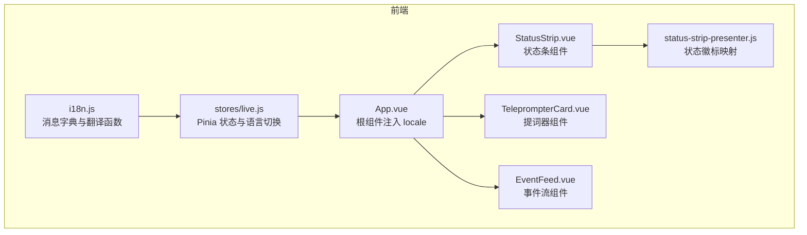
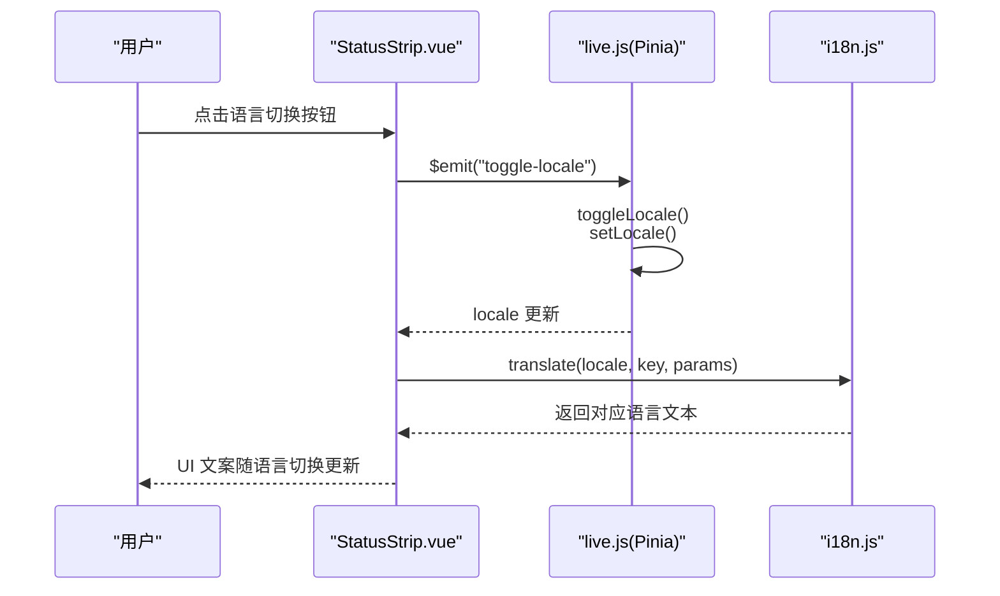
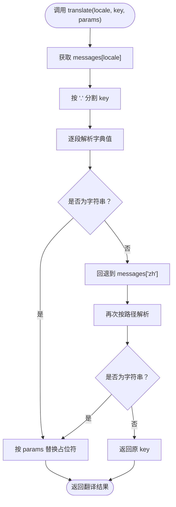
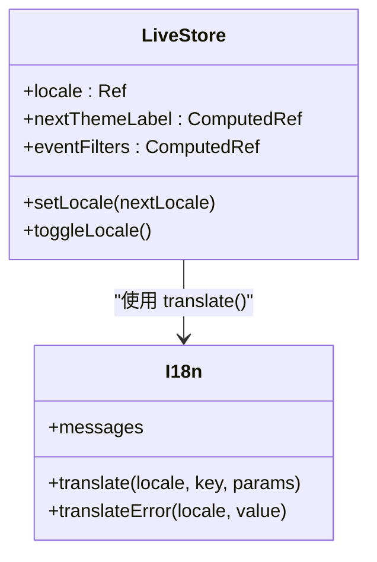
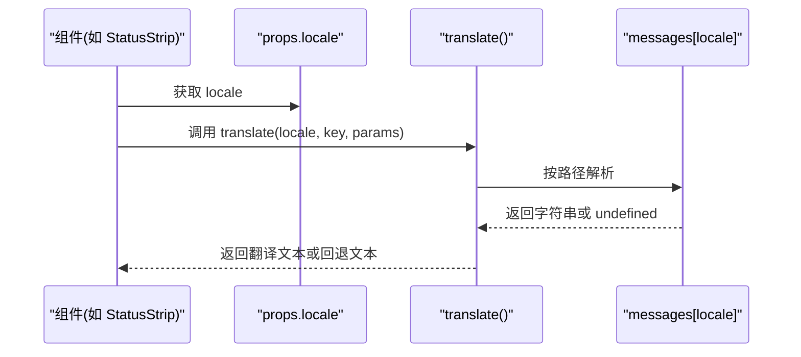
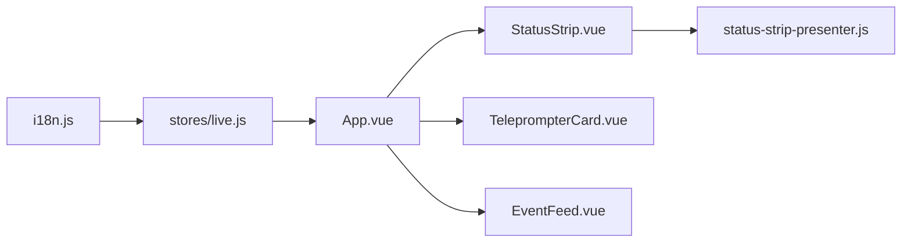

# 国际化（i18n）

<cite>
**本文引用的文件**
- [frontend/src/i18n.js](file://frontend/src/i18n.js)
- [frontend/src/App.vue](file://frontend/src/App.vue)
- [frontend/src/components/StatusStrip.vue](file://frontend/src/components/StatusStrip.vue)
- [frontend/src/components/TeleprompterCard.vue](file://frontend/src/components/TeleprompterCard.vue)
- [frontend/src/components/EventFeed.vue](file://frontend/src/components/EventFeed.vue)
- [frontend/src/components/status-strip-presenter.js](file://frontend/src/components/status-strip-presenter.js)
- [frontend/src/stores/live.js](file://frontend/src/stores/live.js)
- [frontend/src/stores/locale.test.mjs](file://frontend/src/stores/locale.test.mjs)
- [frontend/package.json](file://frontend/package.json)
</cite>

## 目录
1. [简介](#简介)
2. [项目结构](#项目结构)
3. [核心组件](#核心组件)
4. [架构总览](#架构总览)
5. [详细组件分析](#详细组件分析)
6. [依赖关系分析](#依赖关系分析)
7. [性能考量](#性能考量)
8. [故障排查指南](#故障排查指南)
9. [结论](#结论)
10. [附录](#附录)

## 简介
本文件系统性梳理 DouYin_llm 前端的国际化（i18n）体系，重点围绕 frontend/src/i18n.js 的配置与实现机制，解释多语言支持的架构设计、语言切换逻辑、语言资源组织与命名规范、动态加载与缓存策略、语言环境状态管理、新增/维护语言的操作指南、文本提取与翻译管理流程、测试策略与验证方法，以及跨语言兼容性与字符编码处理方案。

## 项目结构
前端国际化相关代码主要分布在以下位置：
- 国际化资源与工具：frontend/src/i18n.js
- 状态与语言切换：frontend/src/stores/live.js
- 视图层调用与渲染：frontend/src/App.vue、frontend/src/components/*.vue
- 测试：frontend/src/stores/locale.test.mjs
- 构建与依赖：frontend/package.json

**图表来源**
- [frontend/src/i18n.js:1-316](file://frontend/src/i18n.js#L1-L316)
- [frontend/src/stores/live.js:75-329](file://frontend/src/stores/live.js#L75-L329)
- [frontend/src/App.vue:67-139](file://frontend/src/App.vue#L67-L139)
- [frontend/src/components/StatusStrip.vue:1-316](file://frontend/src/components/StatusStrip.vue#L1-L316)
- [frontend/src/components/TeleprompterCard.vue:1-97](file://frontend/src/components/TeleprompterCard.vue#L1-L97)
- [frontend/src/components/EventFeed.vue:1-214](file://frontend/src/components/EventFeed.vue#L1-L214)
- [frontend/src/components/status-strip-presenter.js:1-35](file://frontend/src/components/status-strip-presenter.js#L1-L35)

**章节来源**
- [frontend/src/i18n.js:1-316](file://frontend/src/i18n.js#L1-L316)
- [frontend/src/stores/live.js:75-329](file://frontend/src/stores/live.js#L75-L329)
- [frontend/src/App.vue:67-139](file://frontend/src/App.vue#L67-L139)
- [frontend/src/components/StatusStrip.vue:1-316](file://frontend/src/components/StatusStrip.vue#L1-L316)
- [frontend/src/components/TeleprompterCard.vue:1-97](file://frontend/src/components/TeleprompterCard.vue#L1-L97)
- [frontend/src/components/EventFeed.vue:1-214](file://frontend/src/components/EventFeed.vue#L1-L214)
- [frontend/src/components/status-strip-presenter.js:1-35](file://frontend/src/components/status-strip-presenter.js#L1-L35)
- [frontend/package.json:1-23](file://frontend/package.json#L1-L23)

## 核心组件
- 消息字典与翻译函数
  - messages：包含 zh 与 en 两套键空间，按模块分组（common、status、theme、teleprompter、feed、viewerWorkbench、llmSettings、locale、errors）
  - translate(locale, key, params)：根据点号路径解析字典，支持占位符替换；若目标语言缺失则回退至 zh；仍非字符串则返回原 key
  - translateError(locale, value)：识别以“errors.”开头的错误键并进行翻译，否则原样返回
- Pinia 状态与语言切换
  - locale：初始值为 "zh"，提供 setLocale 与 toggleLocale 两个操作
  - nextThemeLabel、eventFilters 等计算属性均通过 translate(locale, key) 实时渲染
- 视图层组件
  - StatusStrip、TeleprompterCard、EventFeed 等组件接收 locale 并通过 t(key, params) 或 translate(locale, key) 渲染文案
- 测试
  - locale.test.mjs 验证 locale 初始值、切换行为、翻译结果一致性

**章节来源**
- [frontend/src/i18n.js:1-316](file://frontend/src/i18n.js#L1-L316)
- [frontend/src/stores/live.js:75-329](file://frontend/src/stores/live.js#L75-L329)
- [frontend/src/stores/locale.test.mjs:1-35](file://frontend/src/stores/locale.test.mjs#L1-L35)

## 架构总览
国际化系统采用“集中式消息字典 + 分发式渲染”的轻量架构：
- 资源层：i18n.js 提供 zh/en 双语字典与翻译函数
- 状态层：Pinia store 维护 locale，并驱动视图层的即时渲染
- 视图层：各组件通过 props 接收 locale，调用翻译函数渲染 UI
- 错误层：translateError 对后端返回的错误键进行统一翻译

**图表来源**
- [frontend/src/components/StatusStrip.vue:50-87](file://frontend/src/components/StatusStrip.vue#L50-L87)
- [frontend/src/stores/live.js:323-329](file://frontend/src/stores/live.js#L323-L329)
- [frontend/src/i18n.js:278-303](file://frontend/src/i18n.js#L278-L303)

## 详细组件分析

### i18n.js：消息字典与翻译机制
- 消息组织
  - 顶层键：语言标识（如 zh、en）
  - 二级键：模块域（如 common、status、theme、teleprompter、feed、viewerWorkbench、llmSettings、locale、errors）
  - 三级键：具体文案键（如 status.connectionState.live）
- 翻译流程
  - translate：按点号路径逐段解析；若目标语言不存在或解析结果非字符串，则回退至 zh 再次解析；最终仍非字符串则返回原 key
  - 占位符替换：对 params 中的键值对进行字符串替换
  - translateError：仅对以“errors.”开头的键执行翻译
- 设计要点
  - 低耦合：翻译函数独立于组件，便于复用
  - 容错：缺失键不崩溃，回退至 zh，避免白屏
  - 可扩展：新增语言只需在 messages 中添加对应键空间

**图表来源**
- [frontend/src/i18n.js:278-303](file://frontend/src/i18n.js#L278-L303)

**章节来源**
- [frontend/src/i18n.js:1-316](file://frontend/src/i18n.js#L1-L316)

### Pinia 状态与语言切换（live.js）
- 状态字段
  - locale：ref("zh")
- 行为接口
  - setLocale(nextLocale)：限定 en/zh
  - toggleLocale()：在 zh/en 间切换
- 计算属性
  - nextThemeLabel：基于 locale 动态翻译主题切换文案
  - eventFilters：遍历过滤器，将 labelKey 通过 translate(locale, key) 解析为本地化标签
- 其他
  - 本地存储：主题与事件过滤偏好持久化（与 i18n 无关），但 locale 未持久化

**图表来源**
- [frontend/src/stores/live.js:75-329](file://frontend/src/stores/live.js#L75-L329)
- [frontend/src/i18n.js:278-303](file://frontend/src/i18n.js#L278-L303)

**章节来源**
- [frontend/src/stores/live.js:75-329](file://frontend/src/stores/live.js#L75-L329)

### 视图层组件与翻译调用
- StatusStrip.vue
  - 接收 locale，内部封装 t(key, params)，用于渲染房间号、连接状态、模型结果、语言切换按钮等
  - 使用 translateError 对错误进行翻译
- TeleprompterCard.vue
  - 接收 locale，翻译提词器标题、来源类型等
- EventFeed.vue
  - 接收 locale，翻译标题、按钮、占位文案等
- status-strip-presenter.js
  - 将连接状态映射为 labelKey，交由翻译层统一处理

**图表来源**
- [frontend/src/components/StatusStrip.vue:58-89](file://frontend/src/components/StatusStrip.vue#L58-L89)
- [frontend/src/components/TeleprompterCard.vue:19-27](file://frontend/src/components/TeleprompterCard.vue#L19-L27)
- [frontend/src/components/EventFeed.vue:34-53](file://frontend/src/components/EventFeed.vue#L34-L53)
- [frontend/src/components/status-strip-presenter.js:29-34](file://frontend/src/components/status-strip-presenter.js#L29-L34)
- [frontend/src/i18n.js:278-303](file://frontend/src/i18n.js#L278-L303)

**章节来源**
- [frontend/src/components/StatusStrip.vue:1-316](file://frontend/src/components/StatusStrip.vue#L1-L316)
- [frontend/src/components/TeleprompterCard.vue:1-97](file://frontend/src/components/TeleprompterCard.vue#L1-L97)
- [frontend/src/components/EventFeed.vue:1-214](file://frontend/src/components/EventFeed.vue#L1-L214)
- [frontend/src/components/status-strip-presenter.js:1-35](file://frontend/src/components/status-strip-presenter.js#L1-L35)

### 错误文案翻译（translateError）
- 仅对以“errors.”开头的键进行翻译，其他值原样返回
- 适用于后端返回的错误 detail 字段，统一走 i18n 管道

**章节来源**
- [frontend/src/i18n.js:305-315](file://frontend/src/i18n.js#L305-L315)
- [frontend/src/stores/live.js:201-212](file://frontend/src/stores/live.js#L201-L212)

## 依赖关系分析
- 组件依赖 i18n.js 的 translate 与 translateError
- 组件依赖 Pinia store 的 locale 与 computed 属性
- 状态层依赖 i18n.js 的翻译能力
- presenter 仅负责状态到 labelKey 的映射，不涉及翻译

**图表来源**
- [frontend/src/i18n.js:278-303](file://frontend/src/i18n.js#L278-L303)
- [frontend/src/stores/live.js:83-88](file://frontend/src/stores/live.js#L83-L88)
- [frontend/src/App.vue:67-139](file://frontend/src/App.vue#L67-L139)
- [frontend/src/components/StatusStrip.vue:1-316](file://frontend/src/components/StatusStrip.vue#L1-L316)
- [frontend/src/components/TeleprompterCard.vue:1-97](file://frontend/src/components/TeleprompterCard.vue#L1-L97)
- [frontend/src/components/EventFeed.vue:1-214](file://frontend/src/components/EventFeed.vue#L1-L214)
- [frontend/src/components/status-strip-presenter.js:1-35](file://frontend/src/components/status-strip-presenter.js#L1-L35)

**章节来源**
- [frontend/src/i18n.js:278-303](file://frontend/src/i18n.js#L278-L303)
- [frontend/src/stores/live.js:83-88](file://frontend/src/stores/live.js#L83-L88)
- [frontend/src/App.vue:67-139](file://frontend/src/App.vue#L67-L139)
- [frontend/src/components/StatusStrip.vue:1-316](file://frontend/src/components/StatusStrip.vue#L1-L316)
- [frontend/src/components/TeleprompterCard.vue:1-97](file://frontend/src/components/TeleprompterCard.vue#L1-L97)
- [frontend/src/components/EventFeed.vue:1-214](file://frontend/src/components/EventFeed.vue#L1-L214)
- [frontend/src/components/status-strip-presenter.js:1-35](file://frontend/src/components/status-strip-presenter.js#L1-L35)

## 性能考量
- 翻译复杂度
  - translate：线性时间解析路径，最坏 O(k)（k 为路径段数），常数空间
  - translateError：O(k) 路径解析 + 前缀判断，额外开销极小
- 渲染性能
  - eventFilters 与 nextThemeLabel 均为 computed，依赖 locale 的响应式更新，避免重复翻译
- 缓存策略
  - 当前未实现消息字典缓存；由于字典体积较小且解析简单，通常无需缓存
- I/O 与懒加载
  - 未实现按需动态加载语言包；可在需要时引入动态导入与按需加载策略

[本节为通用指导，不直接分析特定文件]

## 故障排查指南
- 问题：切换语言后部分文案未更新
  - 检查组件是否正确接收 locale props
  - 确认 store 的 locale 是否被更新
  - 核对 translate(locale, key) 调用是否传入正确 key
- 问题：错误文案未翻译
  - 确认后端返回的 detail 是否以“errors.”开头
  - 检查 translateError 的使用位置
- 问题：新增语言后无法显示
  - 确保在 messages 中添加对应语言键空间
  - 确认 setLocale/toggleLocale 仅接受 en/zh
- 问题：占位符未替换
  - 检查 params 结构与占位符名称一致

**章节来源**
- [frontend/src/stores/locale.test.mjs:1-35](file://frontend/src/stores/locale.test.mjs#L1-L35)
- [frontend/src/i18n.js:278-303](file://frontend/src/i18n.js#L278-L303)
- [frontend/src/stores/live.js:323-329](file://frontend/src/stores/live.js#L323-L329)

## 结论
该国际化系统以简洁的集中式字典与函数为核心，配合 Pinia 的响应式状态与组件的 props 注入，实现了高效的多语言渲染。其容错与回退机制确保了稳定性，测试覆盖了关键行为。未来可考虑引入动态加载与缓存策略以进一步优化性能与扩展性。

## 附录

### 语言资源文件组织与命名规范
- 组织结构
  - 顶层键：语言标识（zh、en）
  - 二级键：模块域（common、status、theme、teleprompter、feed、viewerWorkbench、llmSettings、locale、errors）
  - 三级键：具体文案键（如 status.connectionState.live）
- 命名规范
  - 采用层级点号路径（如 feed.eventType.comment）
  - 错误键统一以 errors. 开头（如 errors.roomRequired）
  - 语言切换键位于 locale 域（如 locale.switchToEnglish、locale.switchToChinese）

**章节来源**
- [frontend/src/i18n.js:1-276](file://frontend/src/i18n.js#L1-L276)

### 动态语言加载与缓存策略
- 当前实现
  - 静态字典内嵌，无需运行时加载
- 建议方案
  - 按需加载：根据 locale 动态 import 对应语言文件
  - 缓存策略：将已加载语言包缓存在内存，避免重复请求
  - 失败回退：加载失败时回退至 zh

[本节为通用指导，不直接分析特定文件]

### 语言环境状态管理
- 状态字段：locale（初始 zh）
- 更新方式：setLocale/toggleLocale
- 影响范围：所有通过 translate(locale, key) 渲染的文案
- 持久化：当前未持久化 locale（可选加入 localStorage）

**章节来源**
- [frontend/src/stores/live.js:75-329](file://frontend/src/stores/live.js#L75-L329)

### 新语言添加与现有语言维护
- 添加新语言步骤
  1. 在 messages 中新增语言键空间（如 fr）
  2. 填充对应模块域与文案键
  3. 在 setLocale/toggleLocale 中允许新语言标识
  4. 在组件中确认 translate(locale, key) 调用
- 维护建议
  - 保持模块域与键空间一致
  - 为新增键补充错误键与 locale 切换键
  - 使用测试覆盖新增语言的关键路径

**章节来源**
- [frontend/src/i18n.js:1-276](file://frontend/src/i18n.js#L1-L276)
- [frontend/src/stores/live.js:323-329](file://frontend/src/stores/live.js#L323-L329)

### 文本提取与翻译管理流程
- 提取流程
  - 在组件中以固定键（如 feed.title）调用 translate
  - 将键提交至翻译管理系统，生成各语言版本
- 管理流程
  - 后端返回错误 detail 时，前端以 errors.* 键调用 translateError
  - 统一在 i18n.js 中维护与校验

**章节来源**
- [frontend/src/i18n.js:278-315](file://frontend/src/i18n.js#L278-L315)
- [frontend/src/stores/live.js:201-212](file://frontend/src/stores/live.js#L201-L212)

### 测试策略与验证方法
- 单元测试
  - 验证 locale 初始值与切换行为
  - 验证 translate 结果与 eventFilters 标签
- 集成测试
  - 从 UI 触发语言切换，观察组件文案变化
- 自动化建议
  - 为 translateError 与 translate 边界条件增加断言
  - 增加错误键缺失场景的回退测试

**章节来源**
- [frontend/src/stores/locale.test.mjs:1-35](file://frontend/src/stores/locale.test.mjs#L1-L35)

### 跨语言兼容性与字符编码
- 字符集
  - 项目使用 UTF-8 编码，支持中英文混合
- 兼容性
  - 翻译函数对非字符串键回退至原 key，避免乱码
  - 错误键统一以 errors.* 前缀，便于识别与处理

**章节来源**
- [frontend/src/i18n.js:278-315](file://frontend/src/i18n.js#L278-L315)