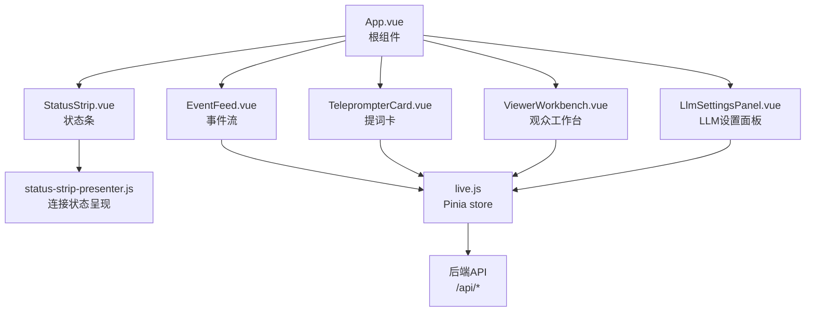
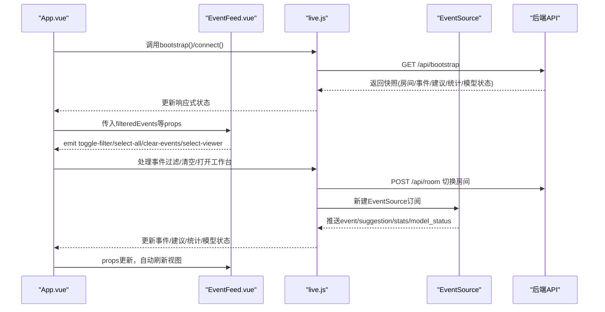
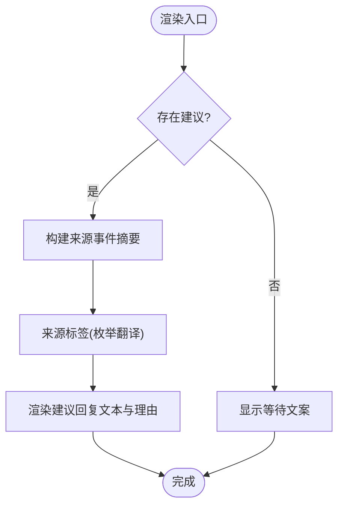
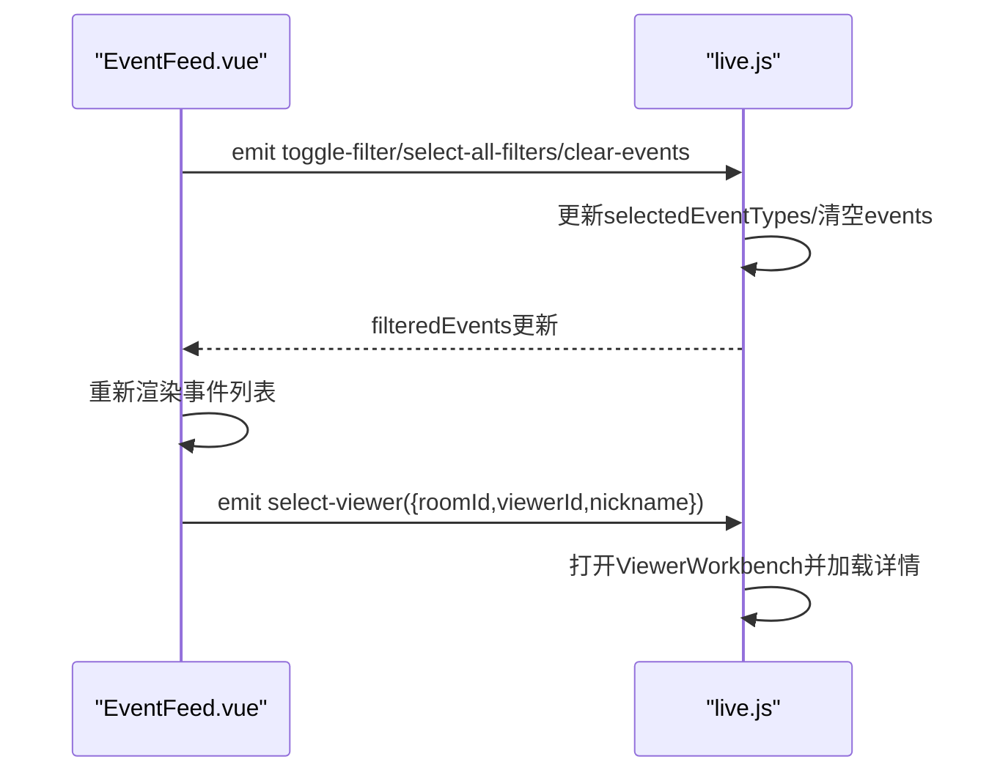
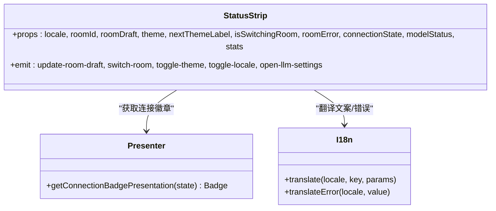
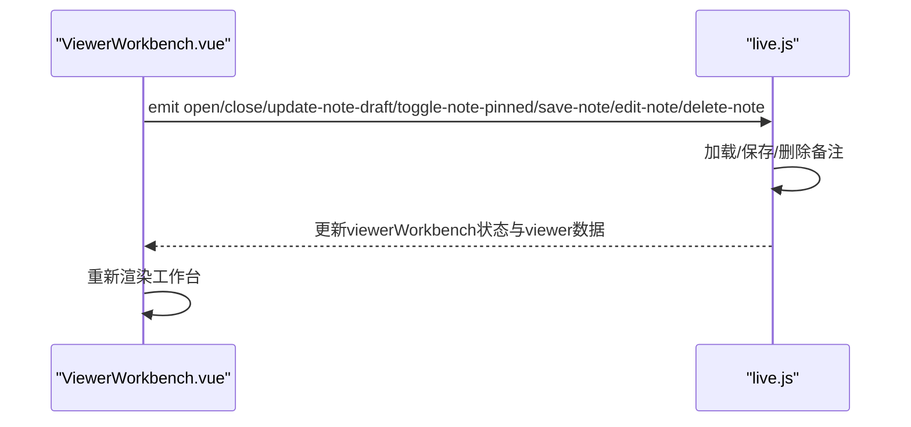
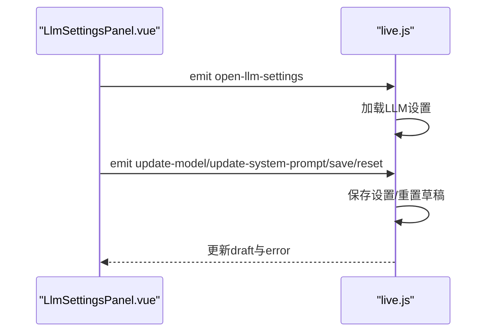
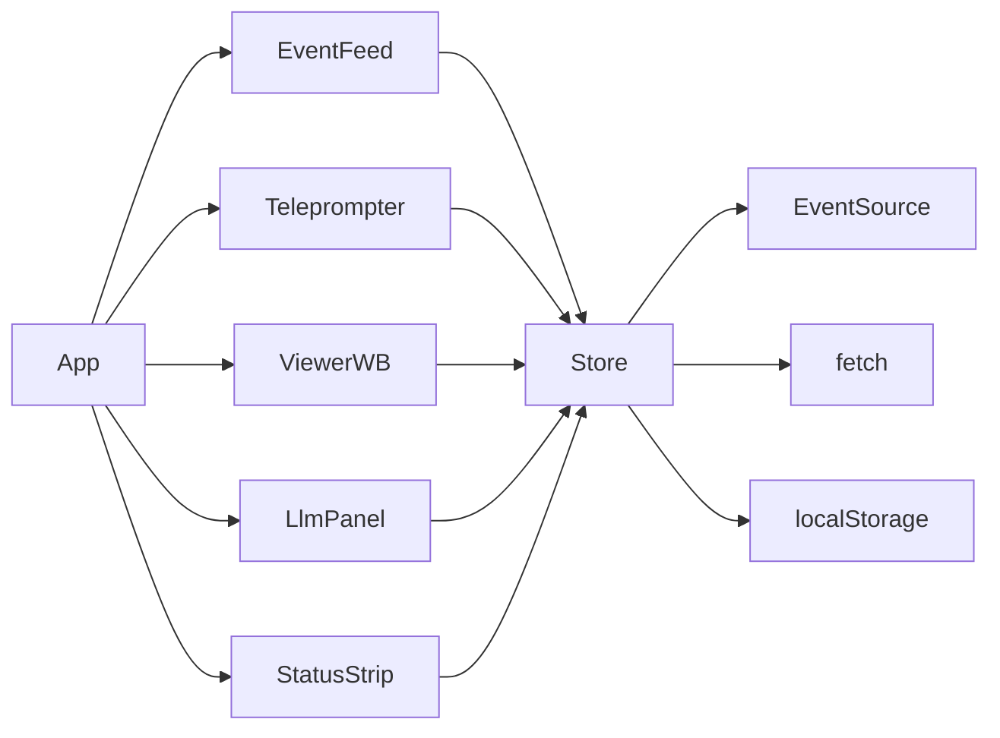

# 核心UI组件

<cite>
**本文引用的文件**
- [App.vue](file://frontend/src/App.vue)
- [TeleprompterCard.vue](file://frontend/src/components/TeleprompterCard.vue)
- [EventFeed.vue](file://frontend/src/components/EventFeed.vue)
- [StatusStrip.vue](file://frontend/src/components/StatusStrip.vue)
- [ViewerWorkbench.vue](file://frontend/src/components/ViewerWorkbench.vue)
- [LlmSettingsPanel.vue](file://frontend/src/components/LlmSettingsPanel.vue)
- [status-strip-presenter.js](file://frontend/src/components/status-strip-presenter.js)
- [i18n.js](file://frontend/src/i18n.js)
- [live.js](file://frontend/src/stores/live.js)
- [status-strip-layout.test.mjs](file://frontend/src/components/status-strip-layout.test.mjs)
- [status-strip-presenter.test.mjs](file://frontend/src/components/status-strip-presenter.test.mjs)
- [live.test.mjs](file://frontend/src/stores/live.test.mjs)
</cite>

## 目录
1. [简介](#简介)
2. [项目结构](#项目结构)
3. [核心组件](#核心组件)
4. [架构总览](#架构总览)
5. [组件详解](#组件详解)
6. [依赖关系分析](#依赖关系分析)
7. [性能考量](#性能考量)
8. [故障排查指南](#故障排查指南)
9. [结论](#结论)
10. [附录](#附录)

## 简介
本文件面向DouYin_llm前端核心UI组件，系统性梳理TeleprompterCard（实时提词显示）、EventFeed（事件流渲染与实时更新）、StatusStrip（状态指示器与交互反馈）、ViewerWorkbench（观众工作台与数据可视化）、LlmSettingsPanel（LLM配置面板）的设计目标、实现细节与组件间通信模式，并给出可复用与扩展的最佳实践。

## 项目结构
- 前端采用Vue 3 + Pinia架构，组件位于frontend/src/components，状态管理位于frontend/src/stores。
- App.vue作为根组件，聚合各子组件并通过Pinia store进行数据与行为绑定。
- 组件通过props接收数据，通过$emit向外派发事件，由store统一处理副作用与网络请求。

图表来源
- [App.vue:67-139](file://frontend/src/App.vue#L67-L139)
- [live.js:75-846](file://frontend/src/stores/live.js#L75-L846)

章节来源
- [App.vue:1-139](file://frontend/src/App.vue#L1-139)

## 核心组件
- TeleprompterCard：展示当前最高优先级的回复建议，包含来源事件摘要、来源标签、优先级与语气、建议回复文本及理由。
- EventFeed：实时事件流列表，支持事件类型过滤、全选/清空、查看用户详情。
- StatusStrip：顶部状态条，包含房间号输入与切换、连接状态徽章、统计信息、模型状态、语言/主题切换、打开LLM设置入口。
- ViewerWorkbench：右侧抽屉式工作台，展示观众画像、记忆、备注、最近互动与会话摘要。
- LlmSettingsPanel：固定侧边抽屉，提供模型名与系统提示词的编辑、保存与重置。

章节来源
- [TeleprompterCard.vue:1-97](file://frontend/src/components/TeleprompterCard.vue#L1-L97)
- [EventFeed.vue:1-214](file://frontend/src/components/EventFeed.vue#L1-L214)
- [StatusStrip.vue:1-316](file://frontend/src/components/StatusStrip.vue#L1-L316)
- [ViewerWorkbench.vue:1-302](file://frontend/src/components/ViewerWorkbench.vue#L1-L302)
- [LlmSettingsPanel.vue:1-122](file://frontend/src/components/LlmSettingsPanel.vue#L1-L122)

## 架构总览
- 数据流：App.vue通过Pinia store暴露响应式状态与计算属性，子组件以props接收数据，通过$emit触发动作，store执行副作用（网络请求、EventSource订阅、本地存储）。
- 国际化：i18n.js提供多语言翻译与错误文案映射。
- 连接状态：status-strip-presenter.js将连接状态映射为视觉徽章（颜色、图标、文案键）。

图表来源
- [App.vue:47-64](file://frontend/src/App.vue#L47-L64)
- [live.js:440-523](file://frontend/src/stores/live.js#L440-L523)
- [live.js:496-522](file://frontend/src/stores/live.js#L496-L522)

## 组件详解

### TeleprompterCard（实时提词显示）
- 功能定位：在直播场景中向主播展示“当前最高优先级”的回复建议，帮助快速应答。
- 设计目的：将AI生成或规则生成的建议以高可读性卡片形式呈现，同时标注来源事件与生成来源，便于溯源与判断。
- 实现要点：
  - props：locale、suggestion、sourceEvent。
  - 来源事件标签：根据事件类型动态翻译；若无内容则回退到备用字段。
  - 来源来源标签：优先从枚举映射翻译，否则回退为原始值。
  - 当无建议时显示“等待中”占位文案。
- 与store的关系：由App.vue将store的activeSuggestion与activeSourceEvent注入props；store通过EventSource推送suggestion事件更新。

图表来源
- [TeleprompterCard.vue:19-35](file://frontend/src/components/TeleprompterCard.vue#L19-L35)
- [TeleprompterCard.vue:38-96](file://frontend/src/components/TeleprompterCard.vue#L38-L96)

章节来源
- [TeleprompterCard.vue:1-97](file://frontend/src/components/TeleprompterCard.vue#L1-L97)
- [live.js:128-140](file://frontend/src/stores/live.js#L128-L140)

### EventFeed（事件流渲染与实时更新）
- 功能定位：展示直播过程中的实时事件流，支持按事件类型筛选、全选/清空、查看用户详情。
- 设计目的：提供直观的事件浏览体验，便于主播快速定位关键互动。
- 实现要点：
  - props：locale、events、eventFilters、selectedEventTypes、areAllEventTypesSelected。
  - 事件卡片样式：按事件类型返回边框与背景色，增强可读性。
  - 交互：
    - 清空事件：emit clear-events。
    - 全选/反选：emit select-all-filters/toggle-filter。
    - 查看用户：emit select-viewer，携带房间号与用户标识。
  - 性能：仅渲染前若干条事件，配合滚动容器提升渲染效率。
- 与store的关系：store维护events数组与selectedEventTypes，通过computed导出filteredEvents；store负责EventSource订阅与事件入队。

图表来源
- [EventFeed.vue:27-32](file://frontend/src/components/EventFeed.vue#L27-L32)
- [EventFeed.vue:140-211](file://frontend/src/components/EventFeed.vue#L140-L211)
- [live.js:571-596](file://frontend/src/stores/live.js#L571-L596)
- [live.js:598-607](file://frontend/src/stores/live.js#L598-L607)

章节来源
- [EventFeed.vue:1-214](file://frontend/src/components/EventFeed.vue#L1-L214)
- [live.js:83-88](file://frontend/src/stores/live.js#L83-L88)
- [live.js:144-149](file://frontend/src/stores/live.js#L144-L149)

### StatusStrip（状态指示器与交互反馈）
- 功能定位：顶部状态条，集中展示房间号、连接状态、统计信息、模型状态、语言/主题切换与LLM设置入口。
- 设计目的：提供全局状态概览与关键操作入口，降低认知负担。
- 实现要点：
  - props：locale、roomId、roomDraft、theme、nextThemeLabel、isSwitchingRoom、roomError、connectionState、modelStatus、stats。
  - 连接状态徽章：通过status-strip-presenter.js将connectionState映射为色调、图标与文案键，再由i18n.js翻译。
  - 交互：
    - 房间号输入与切换：emit update-room-draft/switch-room。
    - 切换语言/主题：emit toggle-locale/toggle-theme。
    - 打开LLM设置：emit open-llm-settings。
  - 视觉：根据主题动态切换按钮样式，连接状态徽章按tone应用不同颜色与图标。
- 与store的关系：store维护connectionState、stats、modelStatus、theme、locale等，App.vue直接绑定到props并转发事件。

图表来源
- [StatusStrip.vue:1-316](file://frontend/src/components/StatusStrip.vue#L1-L316)
- [status-strip-presenter.js:1-35](file://frontend/src/components/status-strip-presenter.js#L1-L35)
- [i18n.js:278-316](file://frontend/src/i18n.js#L278-L316)

章节来源
- [StatusStrip.vue:1-316](file://frontend/src/components/StatusStrip.vue#L1-L316)
- [status-strip-presenter.js:1-35](file://frontend/src/components/status-strip-presenter.js#L1-L35)
- [i18n.js:1-316](file://frontend/src/i18n.js#L1-316)

### ViewerWorkbench（观众工作台与数据可视化）
- 功能定位：右侧抽屉式工作台，展示观众画像、记忆、备注、最近互动与会话摘要。
- 设计目的：帮助主播快速了解观众特征与历史互动，辅助个性化互动。
- 实现要点：
  - props：locale、open、viewer、loading、error、noteDraft、notePinned、saving、editingNoteId。
  - 交互：
    - 关闭：emit close。
    - 备注编辑：emit update-note-draft/toggle-note-pinned/save-note/edit-note/delete-note。
  - 数据可视化：
    - 基础信息：昵称、viewer_id、评论/礼物/钻石统计。
    - 记忆：内存文本、类型、置信度、召回次数。
    - 备注：草稿、置顶、保存/更新/删除。
    - 最近互动：最近评论、最近送礼事件、最近会话摘要。
- 与store的关系：store负责加载viewer详情、维护viewerWorkbench状态、处理备注增删改查与刷新。

图表来源
- [ViewerWorkbench.vue:45-52](file://frontend/src/components/ViewerWorkbench.vue#L45-L52)
- [ViewerWorkbench.vue:107-300](file://frontend/src/components/ViewerWorkbench.vue#L107-L300)
- [live.js:608-772](file://frontend/src/stores/live.js#L608-L772)

章节来源
- [ViewerWorkbench.vue:1-302](file://frontend/src/components/ViewerWorkbench.vue#L1-L302)
- [live.js:114-123](file://frontend/src/stores/live.js#L114-L123)

### LlmSettingsPanel（LLM配置面板）
- 功能定位：固定侧边抽屉，提供模型名与系统提示词的编辑、保存与重置。
- 设计目的：允许主播在本地持久化LLM配置，即时影响后续提词建议。
- 实现要点：
  - props：locale、open、draft、defaults、saving、error。
  - 交互：
    - 关闭：emit close。
    - 更新模型名/系统提示词：emit update-model/update-system-prompt。
    - 保存/重置：emit save/reset。
  - 错误处理：通过translateError映射后端错误码。
- 与store的关系：store负责加载/保存LLM设置，维护isLlmSettingsOpen、llmSettingsDraft、isSavingLlmSettings、llmSettingsError。

图表来源
- [LlmSettingsPanel.vue:33-39](file://frontend/src/components/LlmSettingsPanel.vue#L33-L39)
- [LlmSettingsPanel.vue:53-122](file://frontend/src/components/LlmSettingsPanel.vue#L53-L122)
- [live.js:370-438](file://frontend/src/stores/live.js#L370-L438)

章节来源
- [LlmSettingsPanel.vue:1-122](file://frontend/src/components/LlmSettingsPanel.vue#L1-L122)
- [live.js:98-110](file://frontend/src/stores/live.js#L98-L110)

## 依赖关系分析
- 组件耦合：
  - App.vue作为协调者，将store状态与事件转发给子组件，降低组件间直接耦合。
  - TeleprompterCard与EventFeed共享store的filteredEvents与activeSuggestion，形成数据驱动的单向流。
  - StatusStrip与ViewerWorkbench/LlmSettingsPanel均依赖store提供的状态与方法。
- 外部依赖：
  - EventSource用于实时事件流订阅。
  - fetch用于REST API调用。
  - localStorage用于主题与事件类型过滤偏好持久化。
- 潜在循环依赖：组件间通过props/$emit通信，未见直接导入循环。

图表来源
- [App.vue:67-139](file://frontend/src/App.vue#L67-L139)
- [live.js:124-126](file://frontend/src/stores/live.js#L124-L126)

章节来源
- [App.vue:1-139](file://frontend/src/App.vue#L1-139)
- [live.js:1-846](file://frontend/src/stores/live.js#L1-L846)

## 性能考量
- 渲染限制：
  - EventFeed仅渲染前若干条事件，避免长列表渲染压力。
  - TeleprompterCard在无建议时显示占位，减少复杂DOM。
- 计算属性：
  - filteredEvents与activeSuggestion通过computed缓存，减少重复计算。
- 存储与主题：
  - 主题与事件类型过滤偏好通过localStorage持久化，避免每次初始化IO。
- 实时流：
  - EventSource按房间ID建立连接，断线自动重连；切换房间时先关闭旧连接再建立新连接，防止并发污染。

章节来源
- [EventFeed.vue:162-166](file://frontend/src/components/EventFeed.vue#L162-L166)
- [live.js:144-149](file://frontend/src/stores/live.js#L144-L149)
- [live.js:128-140](file://frontend/src/stores/live.js#L128-L140)
- [live.js:474-523](file://frontend/src/stores/live.js#L474-L523)

## 故障排查指南
- 连接状态异常：
  - 检查connectionState是否为reconnecting；确认网络与后端服务可用。
  - 使用status-strip-presenter的映射验证徽章呈现逻辑。
- 房间切换失败：
  - 检查roomError是否为空；确认房间号非空且格式正确。
  - 切换流程：先POST /api/room，成功后再bootstrap并connect。
- 事件流不更新：
  - 确认EventSource已建立且未被关闭；检查filteredEvents是否为空。
- LLM设置保存失败：
  - 检查llmSettingsError是否包含后端错误码；确认网络请求返回JSON并包含detail。
- 观众备注保存/删除失败：
  - 检查viewerWorkbench.error与viewerId是否存在；确保内容非空。

章节来源
- [status-strip-presenter.js:1-35](file://frontend/src/components/status-strip-presenter.js#L1-L35)
- [live.js:525-569](file://frontend/src/stores/live.js#L525-L569)
- [live.js:400-431](file://frontend/src/stores/live.js#L400-L431)
- [live.js:682-772](file://frontend/src/stores/live.js#L682-L772)

## 结论
上述核心UI组件围绕Pinia store构建了清晰的数据流与事件流，TeleprompterCard与EventFeed共同构成直播场景下的“建议-事件”双轴视图；StatusStrip提供全局状态与入口；ViewerWorkbench与LlmSettingsPanel分别承担“人-事-言”的深度洞察与配置能力。组件间通过props/$emit解耦，结合EventSource与REST API实现低延迟、可扩展的实时交互体验。

## 附录

### 组件间通信与数据传递
- App.vue作为协调者，将store状态映射为props，将用户交互转化为store动作。
- TeleprompterCard与EventFeed消费store的计算属性与响应式数据，自动响应变化。
- StatusStrip、ViewerWorkbench、LlmSettingsPanel通过emit与store交互，实现配置、查询与操作闭环。

章节来源
- [App.vue:67-139](file://frontend/src/App.vue#L67-L139)
- [live.js:75-846](file://frontend/src/stores/live.js#L75-L846)

### 组件复用与扩展最佳实践
- 单向数据流：始终通过store驱动UI，避免跨组件直接修改状态。
- 可测试性：为Presenter与store编写单元测试，覆盖边界条件与错误路径。
- 可维护性：将连接状态映射、i18n键与样式常量抽取为独立模块，降低耦合。
- 可扩展性：新增事件类型时，扩展EVENT_FILTERS与样式映射；新增设置项时，在store中添加draft与持久化逻辑。

章节来源
- [status-strip-presenter.test.mjs:1-50](file://frontend/src/components/status-strip-presenter.test.mjs#L1-L50)
- [status-strip-layout.test.mjs:1-18](file://frontend/src/components/status-strip-layout.test.mjs#L1-L18)
- [live.test.mjs:1-68](file://frontend/src/stores/live.test.mjs#L1-L68)