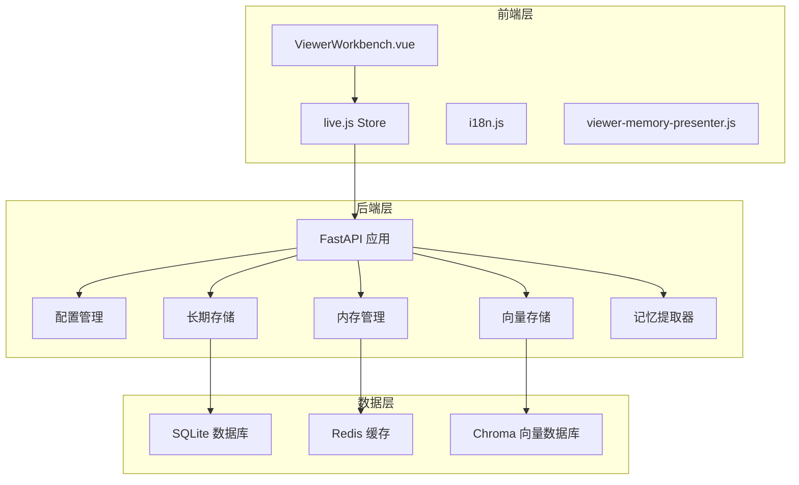
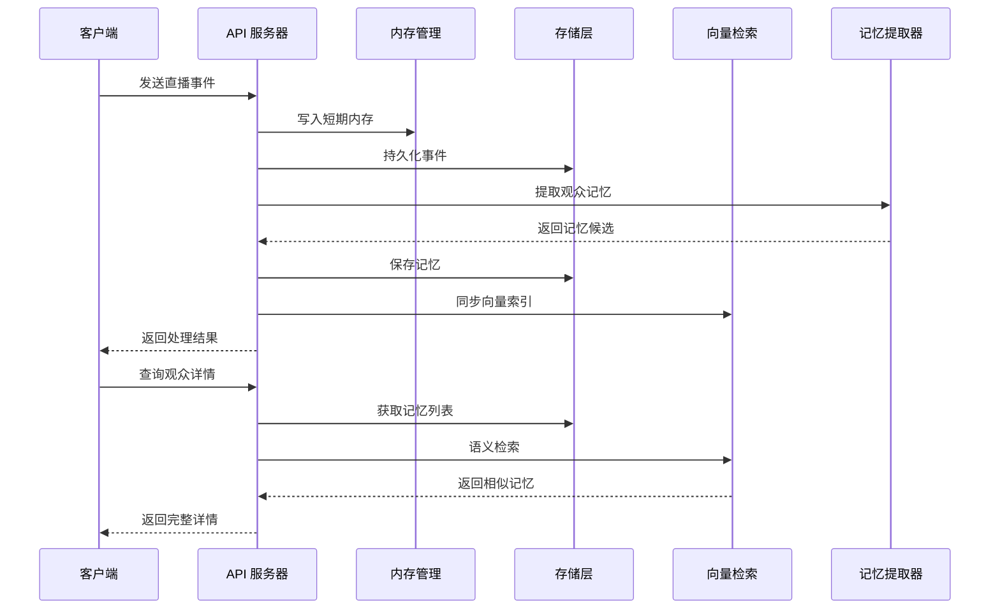
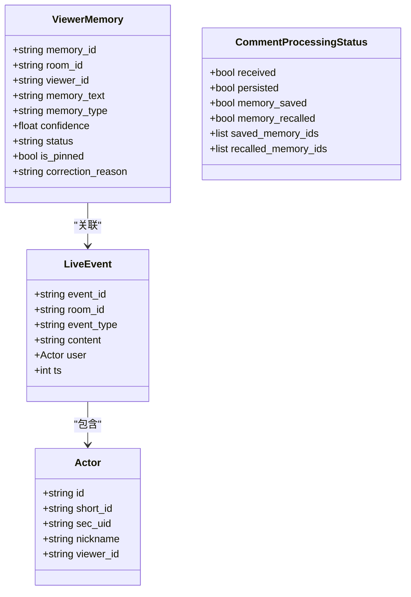
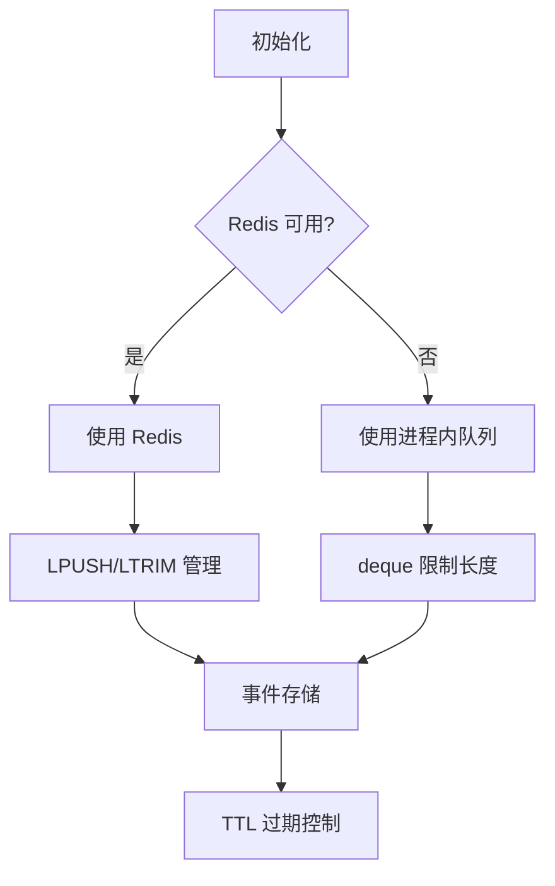
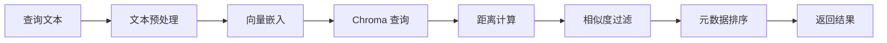
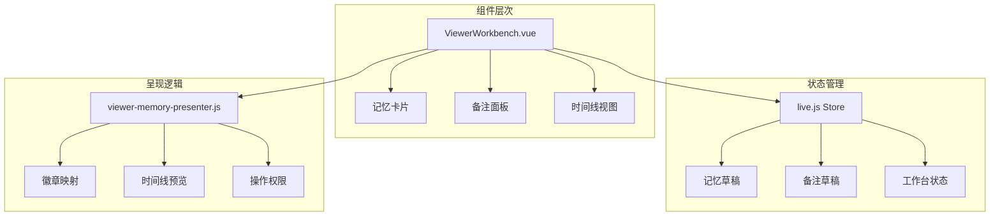
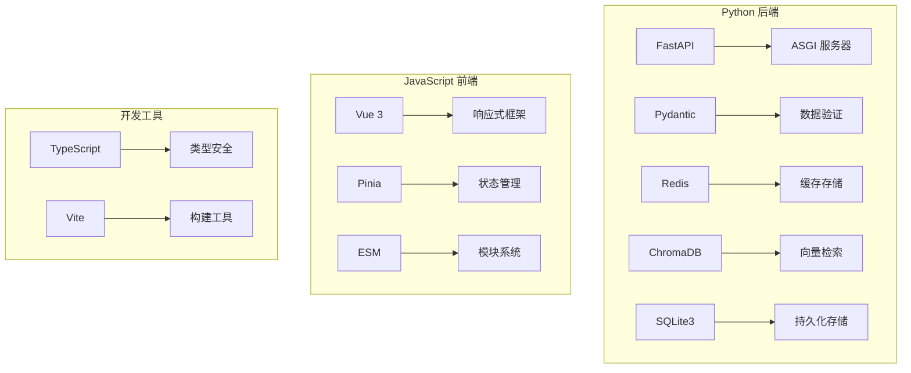
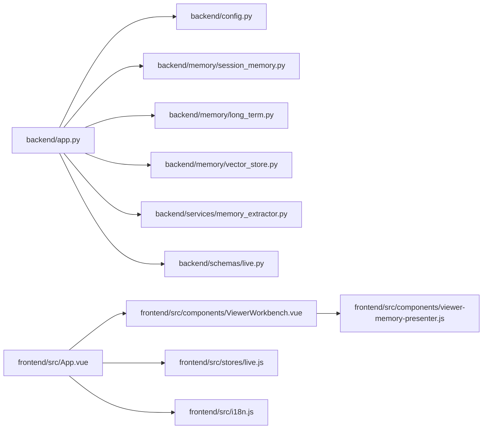

# 观众记忆纠正工作台

<cite>
**本文档引用的文件**
- [backend/app.py](file://backend/app.py)
- [backend/config.py](file://backend/config.py)
- [backend/memory/session_memory.py](file://backend/memory/session_memory.py)
- [backend/memory/long_term.py](file://backend/memory/long_term.py)
- [backend/memory/vector_store.py](file://backend/memory/vector_store.py)
- [backend/memory/rebuild_embeddings.py](file://backend/memory/rebuild_embeddings.py)
- [backend/services/memory_extractor.py](file://backend/services/memory_extractor.py)
- [backend/schemas/live.py](file://backend/schemas/live.py)
- [frontend/src/components/ViewerWorkbench.vue](file://frontend/src/components/ViewerWorkbench.vue)
- [frontend/src/components/viewer-memory-presenter.js](file://frontend/src/components/viewer-memory-presenter.js)
- [frontend/src/stores/live.js](file://frontend/src/stores/live.js)
- [frontend/src/i18n.js](file://frontend/src/i18n.js)
- [USAGE.md](file://USAGE.md)
- [requirements.txt](file://requirements.txt)
- [docs/superpowers/plans/2026-04-16-viewer-memory-correction.md](file://docs/superpowers/plans/2026-04-16-viewer-memory-correction.md)
</cite>

## 目录
1. [项目概述](#项目概述)
2. [项目结构](#项目结构)
3. [核心组件](#核心组件)
4. [架构概览](#架构概览)
5. [详细组件分析](#详细组件分析)
6. [依赖关系分析](#依赖关系分析)
7. [性能考虑](#性能考虑)
8. [故障排除指南](#故障排除指南)
9. [结论](#结论)

## 项目概述

"观众记忆纠正工作台"是一个专为抖音直播场景设计的智能观众管理工具。该项目的核心目标是提供一个完整的解决方案，让主播能够有效地管理和纠正直播过程中的观众记忆，包括自动抽取的记忆、人工补充的记忆以及完整的纠偏时间线追踪。

该系统集成了实时消息流处理、语义记忆存储、向量检索、以及直观的前端工作台，为直播运营提供了强大的技术支持。

## 项目结构

项目采用前后端分离的架构设计，主要分为以下层次：



**图表来源**
- [backend/app.py:1-500](file://backend/app.py#L1-L500)
- [frontend/src/components/ViewerWorkbench.vue:1-519](file://frontend/src/components/ViewerWorkbench.vue#L1-L519)

**章节来源**
- [backend/app.py:1-500](file://backend/app.py#L1-L500)
- [USAGE.md:1-256](file://USAGE.md#L1-L256)

## 核心组件

### 后端核心组件

#### FastAPI 应用服务器
后端采用 FastAPI 构建，提供了完整的 RESTful API 接口，支持实时事件流和 WebSocket 连接。

#### 配置管理系统
统一的配置管理模块，支持环境变量和 .env 文件配置，涵盖 LLM 模型、嵌入模型、Redis、Chroma 等所有外部依赖的配置。

#### 内存管理层
实现了多层缓存策略：
- **短期会话内存**：使用 Redis 或进程内队列存储最近的直播事件和建议
- **长期存储**：基于 SQLite 的持久化存储
- **向量存储**：基于 Chroma 的语义记忆检索

#### 记忆提取器
智能的观众记忆提取算法，能够从直播评论中自动识别和抽取有价值的观众记忆。

**章节来源**
- [backend/app.py:1-500](file://backend/app.py#L1-L500)
- [backend/config.py:1-112](file://backend/config.py#L1-L112)
- [backend/memory/session_memory.py:1-113](file://backend/memory/session_memory.py#L1-L113)
- [backend/memory/long_term.py:1-800](file://backend/memory/long_term.py#L1-L800)
- [backend/memory/vector_store.py:1-388](file://backend/memory/vector_store.py#L1-L388)
- [backend/services/memory_extractor.py:1-118](file://backend/services/memory_extractor.py#L1-L118)

### 前端核心组件

#### 观众工作台组件
Vue 3 组件，提供完整的观众记忆管理界面，支持记忆的创建、编辑、纠偏、置顶等操作。

#### 状态管理
基于 Pinia 的状态管理，统一管理直播状态、模型设置、事件流等数据。

#### 国际化支持
完整的中英文双语支持，包含丰富的 UI 文案和错误提示。

**章节来源**
- [frontend/src/components/ViewerWorkbench.vue:1-519](file://frontend/src/components/ViewerWorkbench.vue#L1-L519)
- [frontend/src/stores/live.js:1-800](file://frontend/src/stores/live.js#L1-L800)
- [frontend/src/i18n.js:1-606](file://frontend/src/i18n.js#L1-L606)

## 架构概览

系统采用分层架构设计，确保各组件职责清晰、耦合度低：



**图表来源**
- [backend/app.py:154-216](file://backend/app.py#L154-L216)
- [backend/memory/long_term.py:497-531](file://backend/memory/long_term.py#L497-L531)
- [backend/memory/vector_store.py:314-318](file://backend/memory/vector_store.py#L314-L318)

系统的关键特性包括：

1. **实时性**：通过 SSE 和 WebSocket 实现实时事件推送
2. **可靠性**：多层缓存和持久化确保数据不丢失
3. **可扩展性**：模块化设计支持功能扩展
4. **智能化**：语义记忆检索提升用户体验

## 详细组件分析

### 后端应用架构

#### API 路由设计
系统提供了完整的 API 接口体系：

```mermaid
graph LR
subgraph "直播相关"
A[/api/events] --> B[事件处理]
C[/api/room] --> D[房间切换]
E[/api/bootstrap] --> F[启动引导]
end
subgraph "观众记忆"
G[/api/viewer/memories] --> H[记忆 CRUD]
I[/api/viewer/memories/{id}] --> J[记忆更新]
K[/api/viewer/memories/{id}/invalidate] --> L[标记失效]
M[/api/viewer/memories/{id}/reactivate] --> N[恢复有效]
end
subgraph "备注管理"
O[/api/viewer/notes] --> P[备注 CRUD]
Q[/api/viewer/notes/{id}] --> R[备注删除]
end
subgraph "实时流"
S[/api/events/stream] --> T[SSE 流]
U[/ws/live] --> V[WebSocket]
end
```

**图表来源**
- [backend/app.py:277-391](file://backend/app.py#L277-L391)

#### 数据模型设计
系统采用 Pydantic 模型定义，确保数据的完整性和一致性：



**图表来源**
- [backend/schemas/live.py:29-158](file://backend/schemas/live.py#L29-L158)

**章节来源**
- [backend/app.py:241-486](file://backend/app.py#L241-L486)
- [backend/schemas/live.py:1-158](file://backend/schemas/live.py#L1-L158)

### 内存管理机制

#### 短期会话内存
实现了灵活的内存管理策略，支持 Redis 和进程内两种模式：



**图表来源**
- [backend/memory/session_memory.py:17-113](file://backend/memory/session_memory.py#L17-L113)

#### 长期存储层
基于 SQLite 的持久化存储，支持复杂的数据查询和事务处理：

**章节来源**
- [backend/memory/session_memory.py:1-113](file://backend/memory/session_memory.py#L1-L113)
- [backend/memory/long_term.py:1-800](file://backend/memory/long_term.py#L1-L800)

### 向量检索系统

#### 语义记忆检索
实现了基于 Chroma 的向量检索系统，支持语义相似度匹配：



**图表来源**
- [backend/memory/vector_store.py:320-388](file://backend/memory/vector_store.py#L320-L388)

**章节来源**
- [backend/memory/vector_store.py:1-388](file://backend/memory/vector_store.py#L1-L388)

### 前端组件架构

#### 观众工作台组件
Vue 3 组件提供了完整的观众记忆管理界面：



**图表来源**
- [frontend/src/components/ViewerWorkbench.vue:1-519](file://frontend/src/components/ViewerWorkbench.vue#L1-L519)
- [frontend/src/stores/live.js:120-137](file://frontend/src/stores/live.js#L120-L137)

**章节来源**
- [frontend/src/components/ViewerWorkbench.vue:1-519](file://frontend/src/components/ViewerWorkbench.vue#L1-L519)
- [frontend/src/components/viewer-memory-presenter.js:1-35](file://frontend/src/components/viewer-memory-presenter.js#L1-L35)
- [frontend/src/stores/live.js:1-800](file://frontend/src/stores/live.js#L1-L800)

## 依赖关系分析

### 外部依赖

项目使用了现代化的技术栈，主要依赖包括：



**图表来源**
- [requirements.txt:1-6](file://requirements.txt#L1-L6)

### 内部模块依赖



**图表来源**
- [backend/app.py:13-24](file://backend/app.py#L13-L24)
- [frontend/src/App.vue:1-200](file://frontend/src/App.vue#L1-L200)

**章节来源**
- [requirements.txt:1-6](file://requirements.txt#L1-L6)
- [backend/app.py:1-500](file://backend/app.py#L1-L500)

## 性能考虑

### 缓存策略
系统采用了多层次的缓存策略来优化性能：

1. **短期缓存**：Redis 或进程内队列，存储最近的直播事件（最多 120 条）
2. **建议缓存**：Redis 或进程内队列，存储最近的建议（最多 40 条）
3. **向量索引**：Chroma 持久化存储，支持大规模语义检索

### 数据库优化
- SQLite 使用适当的索引优化查询性能
- 支持动态列添加，适应业务需求变化
- 事务处理确保数据一致性

### 网络通信优化
- SSE 流式传输减少网络开销
- WebSocket 实现实时双向通信
- 自动重连机制提高连接稳定性

## 故障排除指南

### 常见问题及解决方案

#### 后端启动问题
1. **依赖缺失**：确保安装了所有 Python 依赖
2. **端口冲突**：检查 8010 端口是否被占用
3. **配置错误**：验证 .env 文件中的配置项

#### 前端连接问题
1. **CORS 错误**：检查后端 CORS 配置
2. **WebSocket 连接失败**：确认后端服务正常运行
3. **静态资源加载失败**：检查 Vite 构建配置

#### 数据同步问题
1. **Redis 连接失败**：检查 Redis 服务状态
2. **Chroma 向量库问题**：确认 Chroma 安装和配置正确
3. **SQLite 锁定**：避免并发写入导致的锁竞争

**章节来源**
- [USAGE.md:198-256](file://USAGE.md#L198-L256)

## 结论

"观众记忆纠正工作台"项目展现了现代直播运营系统的最佳实践。通过精心设计的架构和完善的组件实现，该项目成功地解决了直播场景下的观众记忆管理难题。

### 主要优势

1. **技术先进性**：采用最新的技术栈，包括 FastAPI、Vue 3、Chroma 等
2. **功能完整性**：从数据采集到前端展示的完整解决方案
3. **用户体验**：直观的工作台界面和流畅的交互体验
4. **可扩展性**：模块化设计便于功能扩展和定制

### 技术亮点

- **实时性**：通过 SSE 和 WebSocket 实现真正的实时交互
- **智能化**：语义记忆检索提升内容相关性
- **可靠性**：多层缓存和持久化确保系统稳定运行
- **国际化**：完整的中英文支持满足不同用户需求

该项目为直播运营提供了强有力的技术支撑，是构建智能直播生态系统的优秀范例。