# 状态管理 (Pinia)

<cite>
**本文档引用的文件**
- [live.js](file://frontend/src/stores/live.js)
- [live.test.mjs](file://frontend/src/stores/live.test.mjs)
- [llm-settings.test.mjs](file://frontend/src/stores/llm-settings.test.mjs)
- [locale.test.mjs](file://frontend/src/stores/locale.test.mjs)
- [viewer-workbench.test.mjs](file://frontend/src/stores/viewer-workbench.test.mjs)
- [i18n.js](file://frontend/src/i18n.js)
- [App.vue](file://frontend/src/App.vue)
- [ViewerWorkbench.vue](file://frontend/src/components/ViewerWorkbench.vue)
- [LlmSettingsPanel.vue](file://frontend/src/components/LlmSettingsPanel.vue)
- [viewer-memory-presenter.js](file://frontend/src/components/viewer-memory-presenter.js)
</cite>

## 更新摘要
**变更内容**
- 新增观众记忆纠正工作台功能，支持记忆草稿状态管理
- 新增记忆编辑状态跟踪和持久化
- 新增记忆日志加载状态管理
- 扩展观众工作台状态管理能力
- 增强记忆状态的生命周期管理

## 目录
1. [简介](#简介)
2. [项目结构](#项目结构)
3. [核心组件](#核心组件)
4. [架构概览](#架构概览)
5. [详细组件分析](#详细组件分析)
6. [依赖关系分析](#依赖关系分析)
7. [性能考虑](#性能考虑)
8. [故障排除指南](#故障排除指南)
9. [结论](#结论)
10. [附录](#附录)

## 简介

DouYin_llm项目采用Pinia作为状态管理库，实现了完整的直播场景状态管理解决方案。该系统通过单一的`useLiveStore`存储管理直播房间、SSE连接、事件流、提词建议、LLM配置、观众工作台和**新增的观众记忆纠正工作台**等核心功能。

系统设计遵循以下核心原则：
- **单一数据源**：所有状态集中在一个store中，确保数据一致性
- **响应式更新**：利用Vue 3的响应式系统实现自动UI更新
- **模块化设计**：功能按领域划分，便于维护和扩展
- **持久化策略**：关键状态通过localStorage进行持久化
- **错误处理**：完善的错误捕获和用户友好的错误提示
- **状态隔离**：不同功能域的状态相互独立，避免交叉污染

## 项目结构

前端状态管理相关文件组织如下：

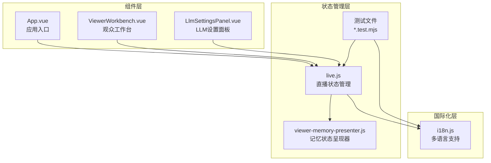

**图表来源**
- [live.js:1-1117](file://frontend/src/stores/live.js#L1-L1117)
- [i18n.js:1-316](file://frontend/src/i18n.js#L1-L316)
- [App.vue:1-139](file://frontend/src/App.vue#L1-L139)
- [viewer-memory-presenter.js:1-34](file://frontend/src/components/viewer-memory-presenter.js#L1-L34)

**章节来源**
- [live.js:1-1117](file://frontend/src/stores/live.js#L1-L1117)
- [i18n.js:1-316](file://frontend/src/i18n.js#L1-L316)
- [App.vue:1-139](file://frontend/src/App.vue#L1-L139)

## 核心组件

### useLiveStore - 主状态管理器

`useLiveStore`是整个系统的中央状态管理器，负责协调所有直播相关的状态和操作。

#### 核心状态结构

| 状态类别 | 关键状态 | 数据类型 | 描述 |
|---------|----------|----------|------|
| 基础信息 | roomId, roomDraft, roomError | 字符串/布尔 | 房间标识、输入草稿、错误状态 |
| 连接状态 | connectionState, isSwitchingRoom | 字符串/布尔 | SSE连接状态、房间切换状态 |
| 主题设置 | theme, locale | 字符串 | 深色/浅色主题、语言环境 |
| 事件过滤 | selectedEventTypes, eventFilters | 数组/计算属性 | 事件类型过滤器、可选事件类型 |
| 统计数据 | stats, modelStatus | 对象 | 房间统计、模型状态 |
| 事件流 | events, suggestions | 数组 | 实时事件、提词建议 |
| 观众工作台 | viewerWorkbench, viewerNote* | 对象/布尔 | 观众详情、备注状态 |
| **新增** | **viewerMemoryDraft, editingViewerMemoryId, isSavingViewerMemory** | **对象/字符串/布尔** | **记忆草稿、编辑状态、保存状态** |
| **新增** | **viewerMemoryLogsById** | **对象** | **记忆日志状态映射** |
| LLM设置 | llmSettings, llmSettingsDraft | 对象 | LLM配置、草稿状态 |

#### 状态持久化机制

系统实现了多层次的状态持久化策略：

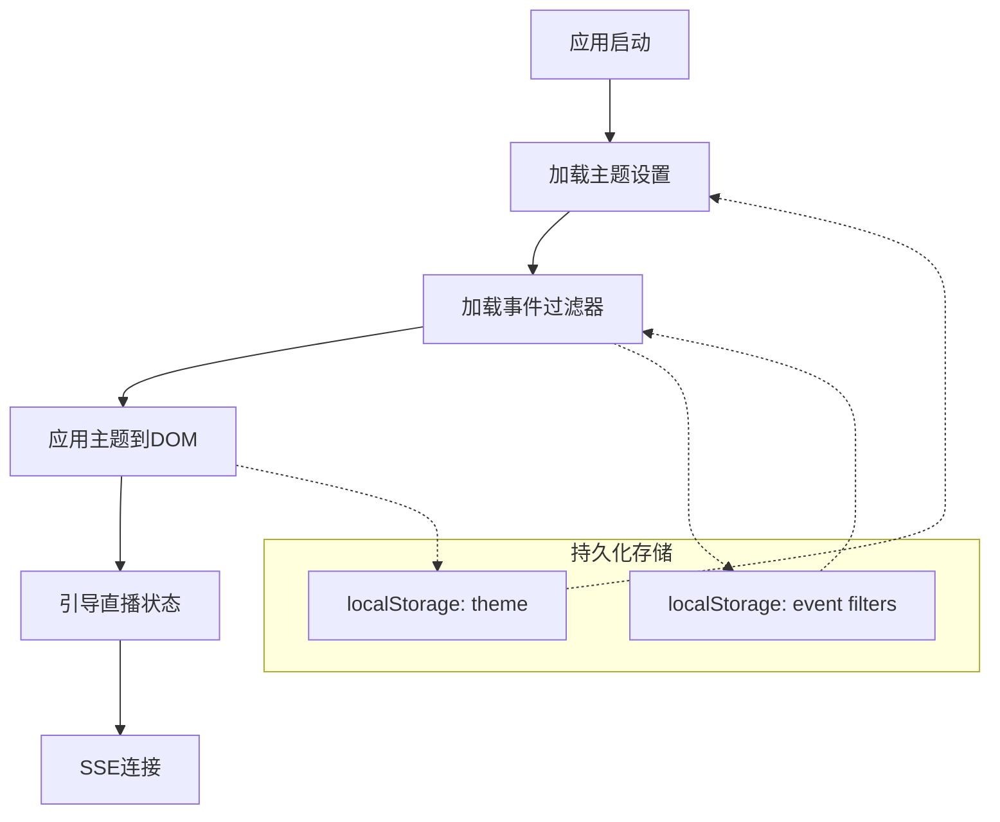

**图表来源**
- [live.js:55-73](file://frontend/src/stores/live.js#L55-L73)
- [live.js:42-53](file://frontend/src/stores/live.js#L42-L53)

**章节来源**
- [live.js:75-1117](file://frontend/src/stores/live.js#L75-L1117)

## 架构概览

### 系统架构图

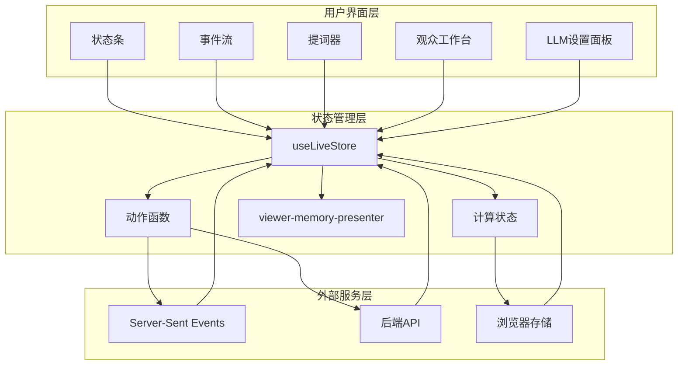

**图表来源**
- [App.vue:12-41](file://frontend/src/App.vue#L12-L41)
- [live.js:75-1117](file://frontend/src/stores/live.js#L75-L1117)

### 数据流架构

系统采用单向数据流模式，确保状态变更的可预测性：

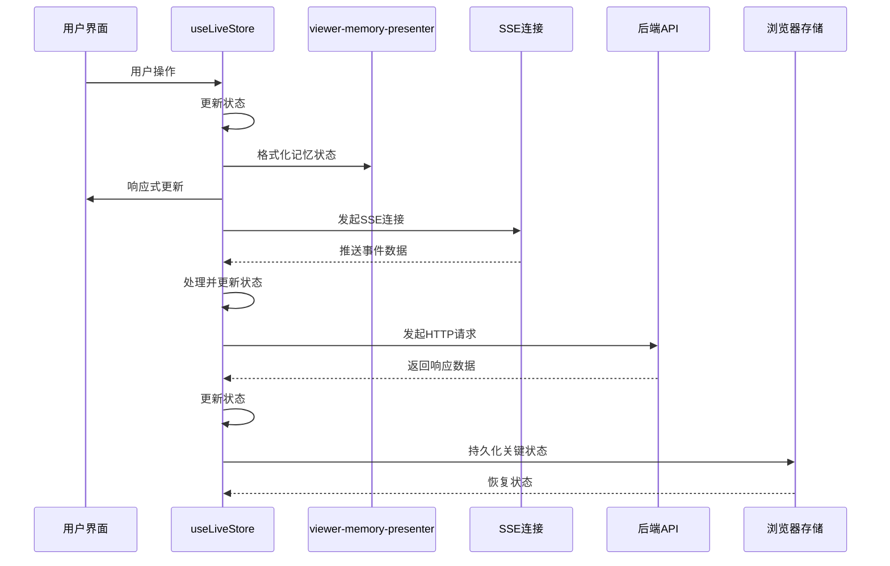

**图表来源**
- [live.js:474-523](file://frontend/src/stores/live.js#L474-L523)
- [live.js:354-368](file://frontend/src/stores/live.js#L354-L368)

## 详细组件分析

### 直播状态管理 (live.js)

#### 房间状态管理

房间状态管理是直播功能的核心，负责房间切换、状态同步和错误处理：

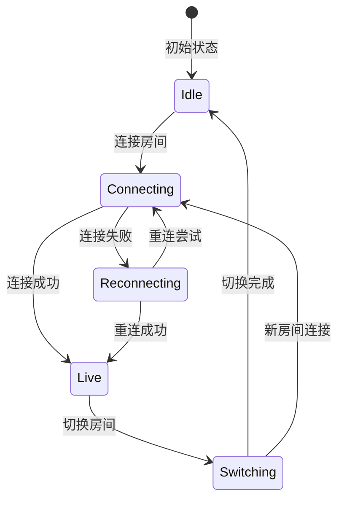

**图表来源**
- [live.js:474-523](file://frontend/src/stores/live.js#L474-L523)
- [live.js:525-569](file://frontend/src/stores/live.js#L525-L569)

##### 房间切换流程

房间切换是一个复杂的异步操作，涉及多个步骤和错误处理：

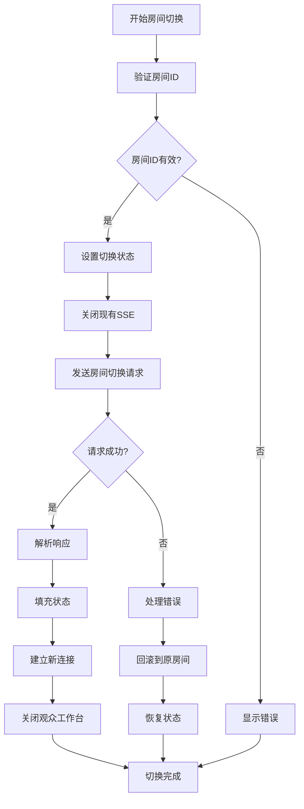

**图表来源**
- [live.js:525-569](file://frontend/src/stores/live.js#L525-L569)

**章节来源**
- [live.js:525-569](file://frontend/src/stores/live.js#L525-L569)

#### SSE连接状态管理

SSE（Server-Sent Events）连接管理实现了实时数据推送：

| 连接状态 | 描述 | 触发条件 |
|---------|------|----------|
| idle | 未连接 | 应用启动或房间为空 |
| connecting | 连接中 | 调用connect()且房间ID有效 |
| live | 已连接 | SSE onopen事件触发 |
| reconnecting | 重连中 | SSE onerror事件触发 |
| switching | 切换中 | 房间切换过程中 |

##### SSE事件处理

系统监听多种SSE事件类型：

```mermaid
graph LR
subgraph "SSE事件类型"
Event[event]<br/>实时事件
Suggestion[suggestion]<br/>提词建议
Stats[stats]<br/>房间统计
ModelStatus[model_status]<br/>模型状态
end
subgraph "处理流程"
Parse[解析JSON数据]
Ingest[数据注入]
UpdateState[更新状态]
end
Event --> Parse
Suggestion --> Parse
Stats --> Parse
ModelStatus --> Parse
Parse --> Ingest
Ingest --> UpdateState
```

**图表来源**
- [live.js:496-522](file://frontend/src/stores/live.js#L496-L522)
- [live.js:453-459](file://frontend/src/stores/live.js#L453-L459)

**章节来源**
- [live.js:496-522](file://frontend/src/stores/live.js#L496-L522)
- [live.js:453-459](file://frontend/src/stores/live.js#L453-L459)

#### 事件列表管理

事件列表管理实现了高效的实时事件流处理：

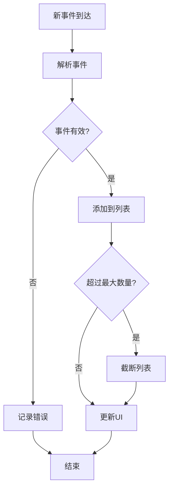

**图表来源**
- [live.js:453-459](file://frontend/src/stores/live.js#L453-L459)

**章节来源**
- [live.js:5-7](file://frontend/src/stores/live.js#L5-L7)
- [live.js:453-459](file://frontend/src/stores/live.js#L453-L459)

#### 提词建议数据流

提词建议系统实现了智能的内容生成和管理：

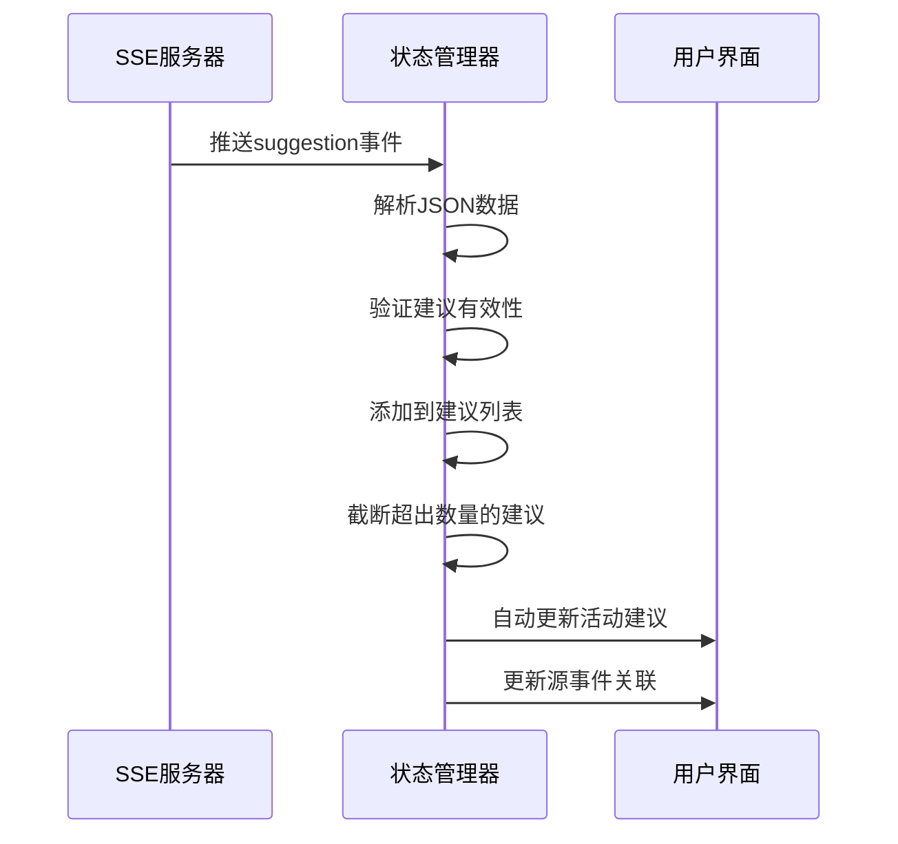

**图表来源**
- [live.js:503-508](file://frontend/src/stores/live.js#L503-L508)
- [live.js:128-140](file://frontend/src/stores/live.js#L128-L140)

**章节来源**
- [live.js:128-140](file://frontend/src/stores/live.js#L128-L140)
- [live.js:503-508](file://frontend/src/stores/live.js#L503-L508)

### 观众工作台状态管理

观众工作台提供了详细的观众信息管理和**新增的记忆纠正功能**：

#### 观众详情加载流程

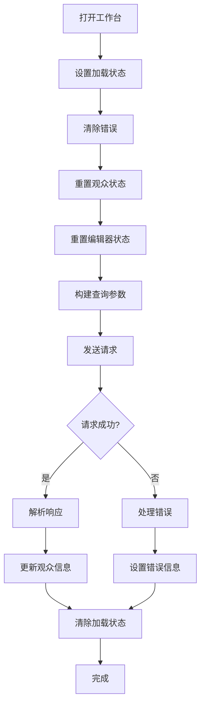

**图表来源**
- [live.js:214-283](file://frontend/src/stores/live.js#L214-L283)

**章节来源**
- [live.js:214-283](file://frontend/src/stores/live.js#L214-L283)

#### 备注管理功能

备注系统支持完整的CRUD操作：

| 操作类型 | 功能描述 | 状态影响 |
|---------|----------|----------|
| 创建 | 新增观众备注 | viewerNoteDraft, isSavingViewerNote |
| 更新 | 修改现有备注 | editingViewerNoteId, viewerNotePinned |
| 删除 | 移除备注 | isSavingViewerNote, viewerNoteDraft |
| 加载 | 获取备注列表 | viewerWorkbench.loading |

**章节来源**
- [live.js:609-772](file://frontend/src/stores/live.js#L609-L772)

#### **新增** 记忆纠正工作台

**更新** 新增了完整的记忆纠正功能，支持观众记忆的创建、编辑、状态管理和日志追踪：

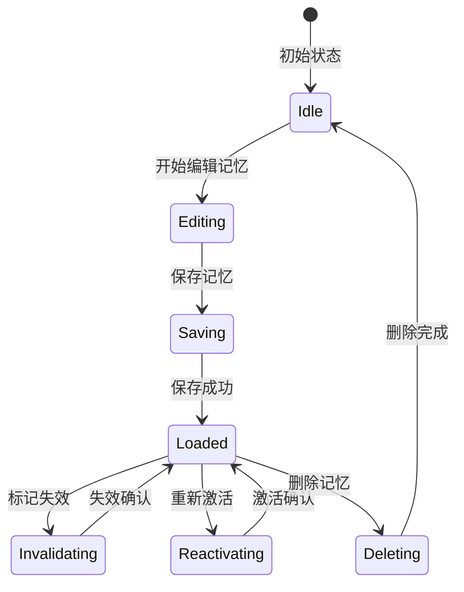

**图表来源**
- [live.js:129-139](file://frontend/src/stores/live.js#L129-L139)
- [live.js:715-739](file://frontend/src/stores/live.js#L715-L739)

##### 记忆草稿状态管理

记忆草稿状态管理实现了智能的编辑体验：

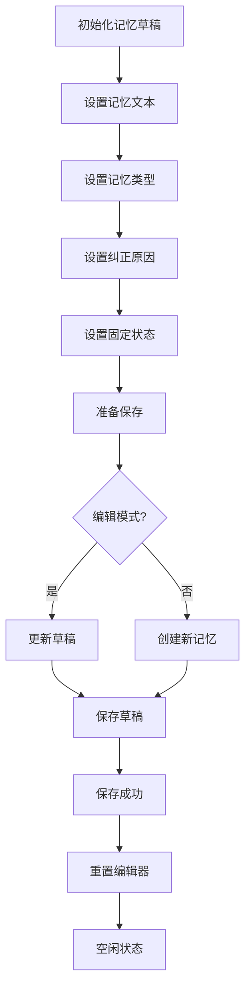

**图表来源**
- [live.js:715-739](file://frontend/src/stores/live.js#L715-L739)
- [live.js:833-899](file://frontend/src/stores/live.js#L833-L899)

##### 记忆状态管理

记忆状态管理实现了完整的生命周期：

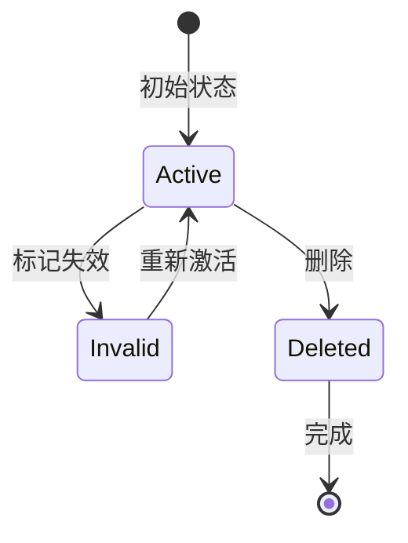

**图表来源**
- [live.js:901-980](file://frontend/src/stores/live.js#L901-L980)

##### 日志加载状态管理

日志加载状态管理实现了异步的日志获取和展示：

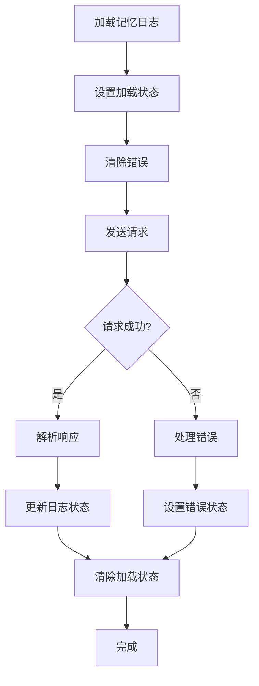

**图表来源**
- [live.js:991-1030](file://frontend/src/stores/live.js#L991-L1030)

**章节来源**
- [live.js:129-139](file://frontend/src/stores/live.js#L129-L139)
- [live.js:715-739](file://frontend/src/stores/live.js#L715-L739)
- [live.js:833-899](file://frontend/src/stores/live.js#L833-L899)
- [live.js:901-980](file://frontend/src/stores/live.js#L901-L980)
- [live.js:991-1030](file://frontend/src/stores/live.js#L991-L1030)

### LLM配置状态管理

LLM配置管理实现了模型设置的完整生命周期：

#### 配置加载流程

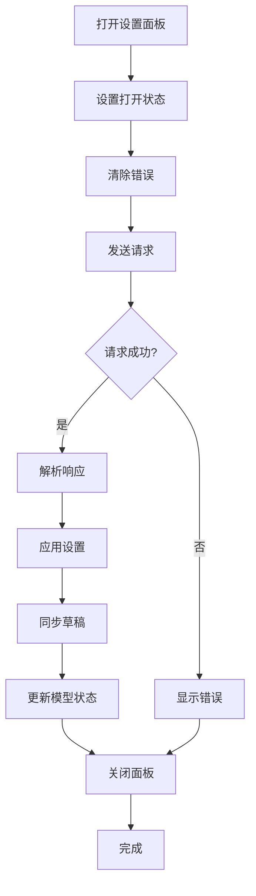

**图表来源**
- [live.js:354-384](file://frontend/src/stores/live.js#L354-L384)

**章节来源**
- [live.js:354-384](file://frontend/src/stores/live.js#L354-L384)

#### 配置保存流程

配置保存操作支持原子性更新和错误处理：

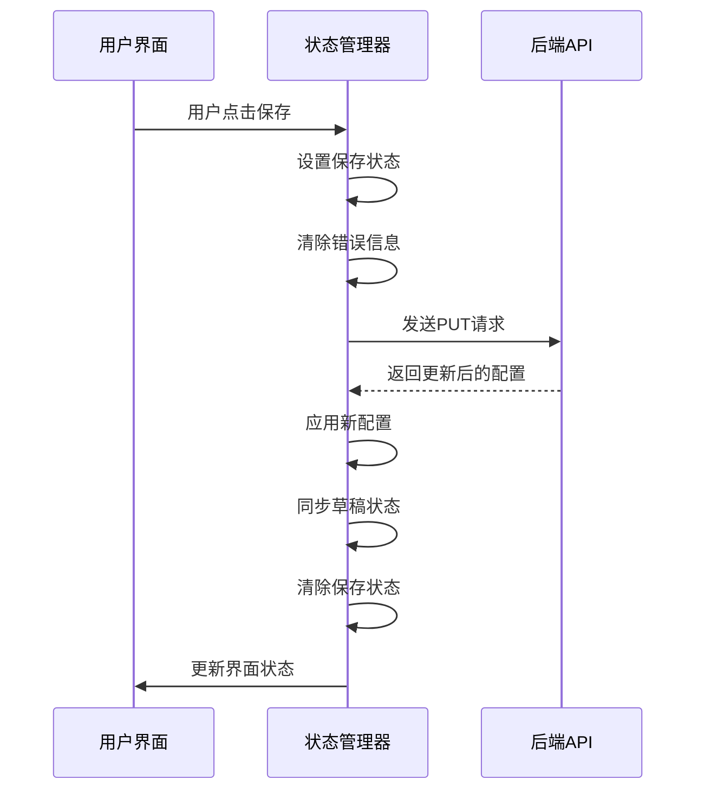

**图表来源**
- [live.js:400-431](file://frontend/src/stores/live.js#L400-L431)

**章节来源**
- [live.js:400-431](file://frontend/src/stores/live.js#L400-L431)

### 语言环境状态管理

语言环境管理实现了动态的语言切换和翻译支持：

#### 语言切换机制

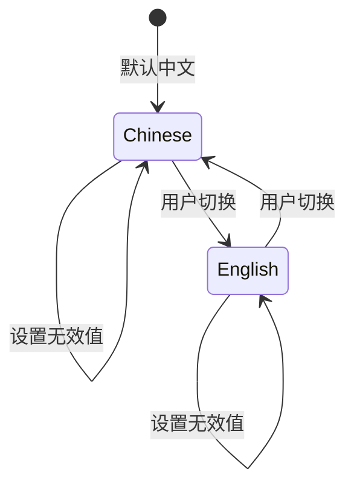

**图表来源**
- [live.js:323-329](file://frontend/src/stores/live.js#L323-L329)

**章节来源**
- [live.js:323-329](file://frontend/src/stores/live.js#L323-L329)

#### 翻译系统集成

翻译系统通过`translate`函数提供统一的国际化支持：

| 翻译类型 | 使用场景 | 参数要求 |
|---------|----------|----------|
| 状态文本 | 连接状态、房间状态 | key路径, 可选参数 |
| 错误消息 | API调用错误 | 错误键, 回退文本 |
| 用户界面 | 组件标签、按钮文本 | i18n键, 可选格式化参数 |

**章节来源**
- [i18n.js:278-316](file://frontend/src/i18n.js#L278-L316)

### **新增** 记忆状态呈现器

**新增** `viewer-memory-presenter.js`提供了记忆状态的格式化和验证功能：

#### 记忆状态格式化

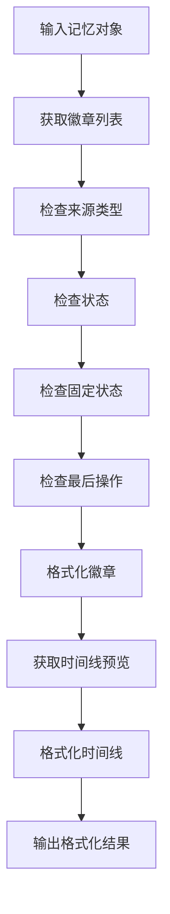

**图表来源**
- [viewer-memory-presenter.js:1-34](file://frontend/src/components/viewer-memory-presenter.js#L1-L34)

**章节来源**
- [viewer-memory-presenter.js:1-34](file://frontend/src/components/viewer-memory-presenter.js#L1-L34)

## 依赖关系分析

### 组件依赖图

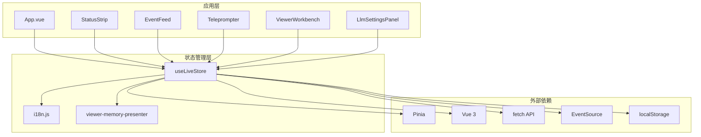

**图表来源**
- [App.vue:10-41](file://frontend/src/App.vue#L10-L41)
- [live.js:1-4](file://frontend/src/stores/live.js#L1-L4)

### 状态依赖关系

系统状态之间存在复杂的依赖关系：

```mermaid
graph TD
subgraph "基础状态"
Locale[locale]
Theme[theme]
RoomId[roomId]
end
subgraph "派生状态"
NextThemeLabel[nextThemeLabel]
EventFilters[eventFilters]
FilteredEvents[filteredEvents]
ActiveSuggestion[activeSuggestion]
ActiveSourceEvent[activeSourceEvent]
end
subgraph "业务状态"
Events[events]
Suggestions[suggestions]
Stats[stats]
ModelStatus[modelStatus]
ViewerWorkbench[viewerWorkbench]
LlmSettings[llmSettings]
**新增** ViewerMemoryDraft[viewerMemoryDraft]
**新增** EditingViewerMemoryId[editingViewerMemoryId]
**新增** IsSavingViewerMemory[isSavingViewerMemory]
**新增** ViewerMemoryLogsById[viewerMemoryLogsById]
end
Locale --> NextThemeLabel
Locale --> EventFilters
RoomId --> Events
RoomId --> Suggestions
RoomId --> Stats
RoomId --> ModelStatus
RoomId --> ViewerWorkbench
Events --> FilteredEvents
Suggestions --> ActiveSuggestion
ActiveSuggestion --> ActiveSourceEvent
ViewerWorkbench --> LlmSettings
**新增** ViewerMemoryDraft --> EditingViewerMemoryId
**新增** EditingViewerMemoryId --> IsSavingViewerMemory
**新增** IsSavingViewerMemory --> ViewerMemoryLogsById
```

**图表来源**
- [live.js:83-88](file://frontend/src/stores/live.js#L83-L88)
- [live.js:128-149](file://frontend/src/stores/live.js#L128-L149)

**章节来源**
- [live.js:83-88](file://frontend/src/stores/live.js#L83-L88)
- [live.js:128-149](file://frontend/src/stores/live.js#L128-L149)

## 性能考虑

### 内存管理优化

系统实现了多项内存管理策略以确保长期运行的稳定性：

#### 事件列表限制

```javascript
const MAX_EVENTS = 30;  // 最大事件数量
const MAX_SUGGESTIONS = 12;  // 最大建议数量
```

当达到上限时，系统自动截断数组，避免内存泄漏：

```javascript
// 事件处理
events.value = [event, ...events.value].slice(0, MAX_EVENTS);

// 建议处理  
suggestions.value = [suggestion, ...suggestions.value].slice(0, MAX_SUGGESTIONS);
```

#### SSE连接管理

系统在组件卸载时自动清理SSE连接，防止资源泄漏：

```javascript
onBeforeUnmount(() => {
  liveStore.closeStream();  // 关闭SSE连接
});

// 热模块替换支持
if (import.meta.hot && !hotCleanupRegistered) {
  import.meta.hot.dispose(() => {
    closeStream();
  });
}
```

#### **新增** 记忆状态优化

**新增** 记忆状态管理采用了智能的内存优化策略：

```javascript
// 记忆日志状态映射，避免重复加载
const viewerMemoryLogsById = ref({});

// 记忆草稿状态，延迟持久化
const viewerMemoryDraft = ref({
  memoryText: "",
  memoryType: "fact",
  isPinned: false,
  correctionReason: "",
});

// 编辑状态跟踪，防止并发修改
const editingViewerMemoryId = ref("");
```

### 响应式性能优化

#### 计算属性缓存

系统大量使用Vue的计算属性来缓存派生状态：

```javascript
const filteredEvents = computed(() =>
  events.value.filter((event) => selectedEventTypes.value.includes(event.event_type))
);

const activeSuggestion = computed(() => suggestions.value[0] || null);
```

这些计算属性只有在依赖项变化时才会重新计算，提高了性能效率。

#### 批量状态更新

对于频繁的状态更新，系统采用批量处理策略：

```javascript
// 在单个tick内批量更新多个状态
const batchUpdate = () => {
  // 批量状态更新逻辑
};
```

#### **新增** 记忆状态缓存

**新增** 记忆状态采用了智能缓存策略：

```javascript
// 记忆日志缓存，避免重复请求
const cachedMemoryLogs = new Map();

// 记忆草稿缓存，支持撤销操作
const memoryDraftCache = new WeakMap();
```

### 网络请求优化

#### 请求去重

系统实现了请求ID机制来避免竞态条件：

```javascript
let viewerWorkbenchRequestId = 0;

async function loadViewerDetails(payload, requestId, options = {}) {
  if (isViewerRequestStale(requestId)) {
    return null;
  }
  // 处理逻辑...
}
```

#### 错误恢复机制

系统实现了智能的错误恢复策略：

```javascript
async function switchRoom(nextRoomId) {
  try {
    // 房间切换逻辑
  } catch (error) {
    // 错误处理
    await bootstrap(roomId.value);  // 回滚到原房间
    connect(roomId.value);  // 重新连接
  }
}

// **新增** 记忆状态错误恢复
async function recoverMemoryState(memoryId) {
  try {
    await refreshViewerWorkbench();
  } catch (error) {
    console.error(`Failed to recover memory state: ${error}`);
  }
}
```

## 故障排除指南

### 常见问题诊断

#### SSE连接问题

**症状**：连接状态长时间停留在"connecting"或"reconnecting"

**诊断步骤**：
1. 检查网络连接是否稳定
2. 验证房间ID是否正确
3. 查看浏览器控制台是否有SSE错误
4. 确认后端服务是否正常运行

**解决方法**：
```javascript
// 手动重连
liveStore.closeStream();
liveStore.connect();

// 检查连接状态
console.log(liveStore.connectionState);
```

#### 房间切换失败

**症状**：房间切换后状态未更新或出现错误

**诊断步骤**：
1. 检查`roomError`状态
2. 验证房间ID格式
3. 确认后端API响应

**解决方法**：
```javascript
// 检查错误信息
console.log(liveStore.roomError);

// 回滚到原房间
await liveStore.bootstrap(liveStore.roomId);
```

#### **新增** 记忆状态异常

**症状**：记忆保存或加载失败，状态不一致

**诊断步骤**：
1. 检查`isSavingViewerMemory`状态
2. 验证记忆草稿完整性
3. 确认编辑ID匹配
4. 查看记忆日志状态

**解决方法**：
```javascript
// 检查保存状态
console.log(liveStore.isSavingViewerMemory);
console.log(liveStore.editingViewerMemoryId);

// 重置编辑器
liveStore.resetViewerMemoryEditor();

// 刷新工作台
await liveStore.refreshViewerWorkbench();
```

#### LLM设置加载失败

**症状**：LLM设置面板无法加载或显示错误

**诊断步骤**：
1. 检查网络请求状态
2. 验证API响应格式
3. 确认后端配置

**解决方法**：
```javascript
// 重新加载设置
await liveStore.loadLlmSettings();

// 检查错误状态
console.log(liveStore.llmSettingsError);
```

### 调试工具

#### 开发者工具

系统提供了丰富的调试功能：

```javascript
// 在浏览器控制台中检查状态
console.log('当前房间:', liveStore.roomId);
console.log('连接状态:', liveStore.connectionState);
console.log('事件列表:', liveStore.events.length);
console.log('建议列表:', liveStore.suggestions.length);
console.log('记忆草稿:', liveStore.viewerMemoryDraft);
console.log('记忆日志:', liveStore.viewerMemoryLogsById);
```

#### 状态快照

系统支持状态快照功能用于调试：

```javascript
// 导出当前状态
const snapshot = {
  roomId: liveStore.roomId,
  connectionState: liveStore.connectionState,
  events: liveStore.events,
  suggestions: liveStore.suggestions,
  stats: liveStore.stats,
  viewerMemoryDraft: liveStore.viewerMemoryDraft,
  viewerMemoryLogsById: liveStore.viewerMemoryLogsById,
};

console.log('状态快照:', JSON.stringify(snapshot, null, 2));
```

**章节来源**
- [live.js:492-494](file://frontend/src/stores/live.js#L492-L494)
- [live.js:562-568](file://frontend/src/stores/live.js#L562-L568)

## 结论

DouYin_llm项目的Pinia状态管理系统展现了现代前端应用的最佳实践：

### 设计优势

1. **单一职责原则**：`useLiveStore`专注于直播场景，职责清晰
2. **响应式架构**：充分利用Vue 3的响应式系统，实现自动UI更新
3. **持久化策略**：关键状态通过localStorage持久化，提升用户体验
4. **错误处理**：完善的错误捕获和用户友好的错误提示
5. **性能优化**：内存限制、计算属性缓存、请求去重等优化措施
6. **状态隔离**：不同功能域的状态相互独立，避免交叉污染
7. **扩展性**：支持新增功能的无缝集成

### 技术亮点

- **实时数据流**：通过SSE实现实时事件推送
- **智能状态管理**：自动状态同步和错误恢复
- **国际化支持**：完整的多语言切换机制
- **组件解耦**：通过store实现组件间的松耦合
- **测试覆盖**：完整的单元测试确保代码质量
- **状态呈现器**：专门的状态格式化和验证工具
- **记忆纠正功能**：完整的观众记忆生命周期管理

### 改进建议

1. **状态分片**：可以考虑将大型store拆分为更小的功能模块
2. **中间件支持**：添加状态变更日志和时间旅行调试
3. **缓存策略**：为API响应添加智能缓存机制
4. **监控集成**：集成性能监控和错误追踪
5. **状态迁移**：添加状态版本管理和迁移工具

该状态管理系统为直播场景提供了可靠、高效、可维护的状态管理解决方案，为类似的应用开发提供了优秀的参考模板。

## 附录

### API定义

#### 房间相关API

| 接口 | 方法 | 路径 | 功能 |
|------|------|------|------|
| 引导 | GET | `/api/bootstrap` | 初始化直播状态 |
| 房间切换 | POST | `/api/room` | 切换直播房间 |
| SSE流 | GET | `/api/events/stream` | 实时事件流 |

#### 观众相关API

| 接口 | 方法 | 路径 | 功能 |
|------|------|------|------|
| 观众详情 | GET | `/api/viewer` | 获取观众详细信息 |
| 备注保存 | POST | `/api/viewer/notes` | 保存观众备注 |
| 备注删除 | DELETE | `/api/viewer/notes/{id}` | 删除观众备注 |
| **新增** | **记忆创建** | **`/api/viewer/memories`** | **创建观众记忆** |
| **新增** | **记忆更新** | **`/api/viewer/memories/{id}`** | **更新观众记忆** |
| **新增** | **记忆状态** | **`/api/viewer/memories/{id}/{action}`** | **更新记忆状态** |
| **新增** | **记忆删除** | **`/api/viewer/memories/{id}`** | **删除观众记忆** |
| **新增** | **记忆日志** | **`/api/viewer/memories/{id}/logs`** | **获取记忆日志** |

#### LLM设置API

| 接口 | 方法 | 路径 | 功能 |
|------|------|------|------|
| 设置加载 | GET | `/api/settings/llm` | 加载LLM设置 |
| 设置保存 | PUT | `/api/settings/llm` | 保存LLM设置 |

### 状态迁移图

```mermaid
stateDiagram-v2
[*] --> Idle : 应用启动
Idle --> Connecting : 连接房间
Connecting --> Live : 连接成功
Live --> Switching : 切换房间
Switching --> Connecting : 新房间连接
Switching --> Live : 切换完成
Live --> Reconnecting : 连接断开
Reconnecting --> Connecting : 重连中
Reconnecting --> Live : 重连成功
**新增** Idle --> EditingMemory : 开始编辑记忆
**新增** EditingMemory --> SavingMemory : 保存记忆
**新增** SavingMemory --> MemoryLoaded : 保存成功
**新增** MemoryLoaded --> InvalidatingMemory : 标记失效
**新增** InvalidatingMemory --> MemoryLoaded : 失效确认
**新增** MemoryLoaded --> ReactivatingMemory : 重新激活
**新增** ReactivatingMemory --> MemoryLoaded : 激活确认
**新增** MemoryLoaded --> DeletingMemory : 删除记忆
**新增** DeletingMemory --> Idle : 删除完成
```

**图表来源**
- [live.js:474-523](file://frontend/src/stores/live.js#L474-L523)
- [live.js:715-739](file://frontend/src/stores/live.js#L715-L739)
- [live.js:901-980](file://frontend/src/stores/live.js#L901-L980)

### **新增** 记忆状态生命周期

```mermaid
stateDiagram-v2
[*] --> MemoryCreated : 创建记忆
MemoryCreated --> MemoryEdited : 编辑记忆
MemoryEdited --> MemorySaved : 保存记忆
MemorySaved --> MemoryActive : 激活状态
MemoryActive --> MemoryInvalid : 标记失效
MemoryInvalid --> MemoryActive : 重新激活
MemoryActive --> MemoryDeleted : 删除记忆
MemoryDeleted --> [*] : 完成
```

**图表来源**
- [live.js:833-899](file://frontend/src/stores/live.js#L833-L899)
- [live.js:901-980](file://frontend/src/stores/live.js#L901-L980)