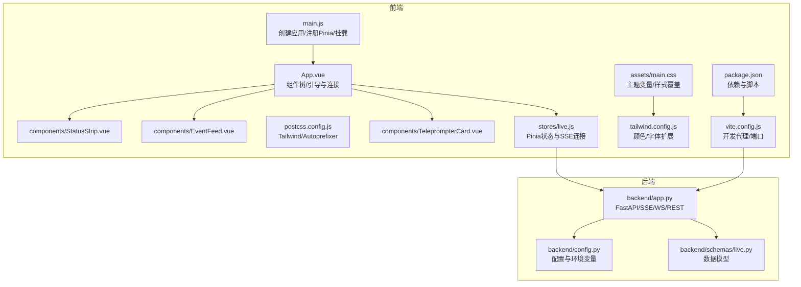
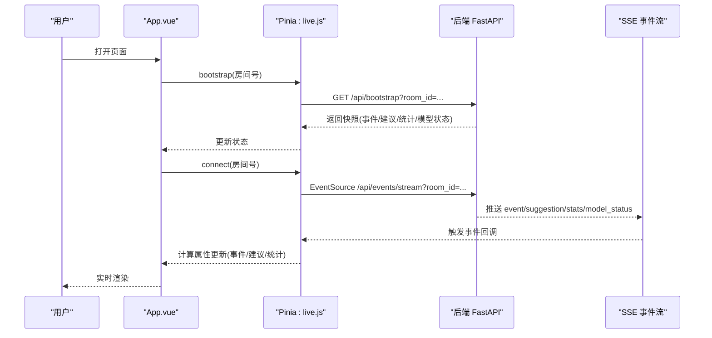
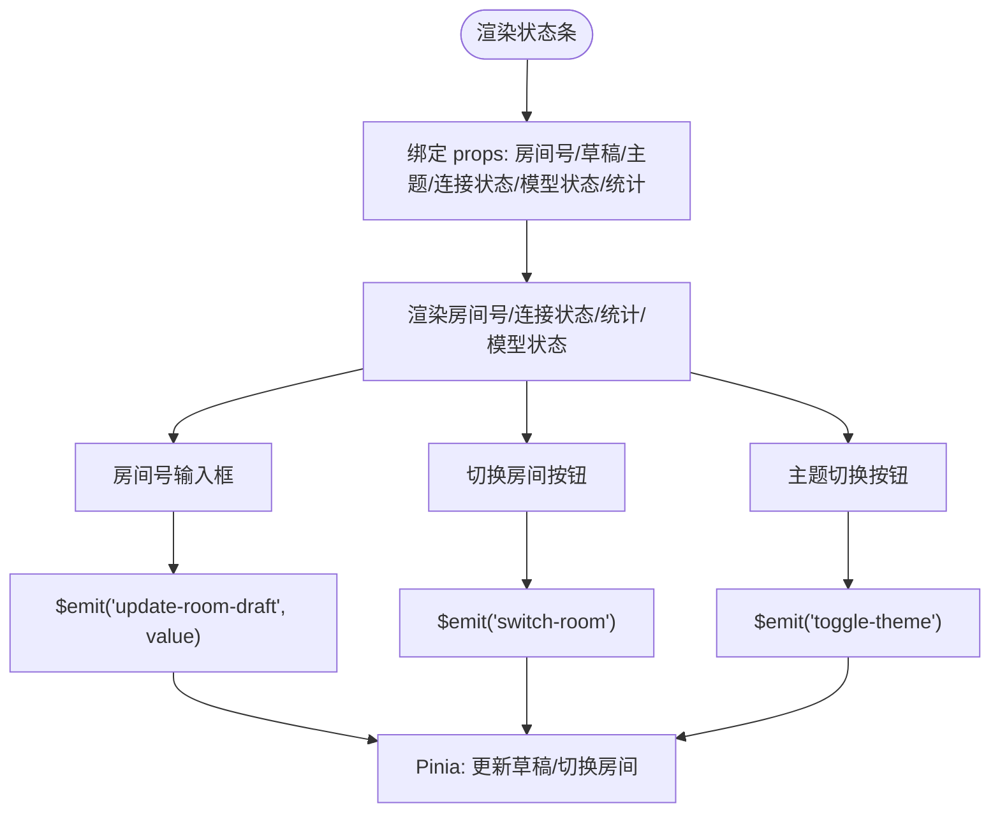
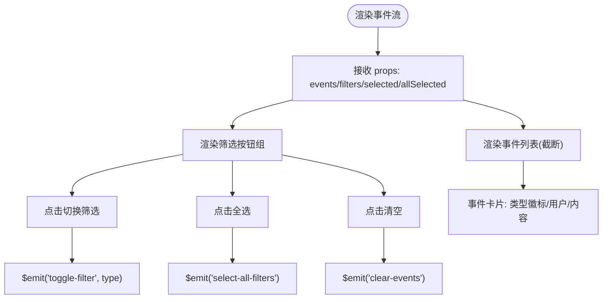
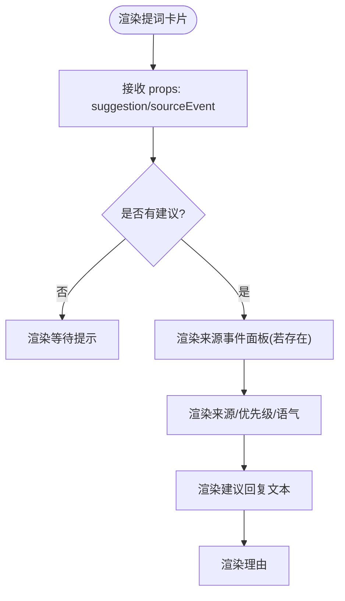
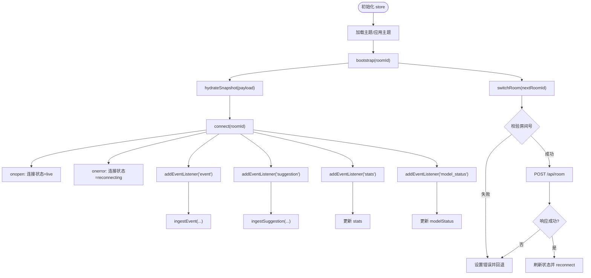
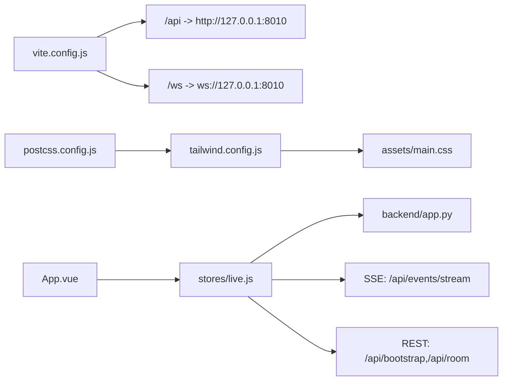

# 前端系统

<cite>
**本文引用的文件**
- [frontend/src/main.js](file://frontend/src/main.js)
- [frontend/src/App.vue](file://frontend/src/App.vue)
- [frontend/src/stores/live.js](file://frontend/src/stores/live.js)
- [frontend/src/components/StatusStrip.vue](file://frontend/src/components/StatusStrip.vue)
- [frontend/src/components/EventFeed.vue](file://frontend/src/components/EventFeed.vue)
- [frontend/src/components/TeleprompterCard.vue](file://frontend/src/components/TeleprompterCard.vue)
- [frontend/src/assets/main.css](file://frontend/src/assets/main.css)
- [frontend/tailwind.config.js](file://frontend/tailwind.config.js)
- [frontend/postcss.config.js](file://frontend/postcss.config.js)
- [frontend/vite.config.js](file://frontend/vite.config.js)
- [frontend/package.json](file://frontend/package.json)
- [backend/app.py](file://backend/app.py)
- [backend/config.py](file://backend/config.py)
- [backend/schemas/live.py](file://backend/schemas/live.py)
</cite>

## 目录
1. [简介](#简介)
2. [项目结构](#项目结构)
3. [核心组件](#核心组件)
4. [架构总览](#架构总览)
5. [详细组件分析](#详细组件分析)
6. [依赖关系分析](#依赖关系分析)
7. [性能考虑](#性能考虑)
8. [故障排查指南](#故障排查指南)
9. [结论](#结论)
10. [附录](#附录)

## 简介
本文件面向Vue 3前端应用，系统性梳理应用入口、组件树、路由与全局状态管理；深入解析Pinia状态管理设计（实时状态同步、事件过滤、数据流）；详解三大核心组件（状态条、事件流、提词卡片）的功能与实现；说明样式系统（Tailwind CSS、主题切换、响应式）；阐述WebSocket与SSE集成以实现实时数据更新与用户交互；并总结组件间通信与数据传递机制。

## 项目结构
前端采用Vite构建，使用Vue 3与Pinia进行状态管理，Tailwind CSS提供原子化样式与主题系统。后端通过FastAPI提供REST与SSE/WS接口，前端通过代理统一转发至后端。

**图表来源**
- [frontend/src/main.js:1-17](file://frontend/src/main.js#L1-L17)
- [frontend/src/App.vue:1-66](file://frontend/src/App.vue#L1-L66)
- [frontend/src/stores/live.js:1-310](file://frontend/src/stores/live.js#L1-L310)
- [frontend/src/assets/main.css:1-144](file://frontend/src/assets/main.css#L1-L144)
- [frontend/tailwind.config.js:1-23](file://frontend/tailwind.config.js#L1-L23)
- [frontend/postcss.config.js:1-9](file://frontend/postcss.config.js#L1-L9)
- [frontend/vite.config.js:1-23](file://frontend/vite.config.js#L1-L23)
- [frontend/package.json:1-23](file://frontend/package.json#L1-L23)
- [backend/app.py:1-220](file://backend/app.py#L1-L220)
- [backend/config.py:1-94](file://backend/config.py#L1-L94)
- [backend/schemas/live.py:1-95](file://backend/schemas/live.py#L1-L95)

**章节来源**
- [frontend/src/main.js:1-17](file://frontend/src/main.js#L1-L17)
- [frontend/src/App.vue:1-66](file://frontend/src/App.vue#L1-L66)
- [frontend/vite.config.js:1-23](file://frontend/vite.config.js#L1-L23)
- [frontend/package.json:1-23](file://frontend/package.json#L1-L23)

## 核心组件
- 应用入口与挂载：创建Vue应用、注册Pinia、加载全局样式并挂载根节点。
- 根组件：负责初始化状态、发起引导与连接、渲染状态条、事件流与提词卡片。
- Pinia状态：集中管理房间号、主题、连接状态、事件过滤、统计数据、事件与建议队列、SSE连接。
- 核心组件：
  - 状态条：显示房间号、连接状态、模型状态、统计信息，支持切换主题、切换房间、输入草稿。
  - 事件流：展示最近事件，支持筛选类型、全选、清空。
  - 提词卡片：展示当前最优建议及来源事件，标注来源与语气等元信息。

**章节来源**
- [frontend/src/main.js:1-17](file://frontend/src/main.js#L1-L17)
- [frontend/src/App.vue:1-66](file://frontend/src/App.vue#L1-L66)
- [frontend/src/stores/live.js:1-310](file://frontend/src/stores/live.js#L1-L310)
- [frontend/src/components/StatusStrip.vue:1-144](file://frontend/src/components/StatusStrip.vue#L1-L144)
- [frontend/src/components/EventFeed.vue:1-183](file://frontend/src/components/EventFeed.vue#L1-L183)
- [frontend/src/components/TeleprompterCard.vue:1-83](file://frontend/src/components/TeleprompterCard.vue#L1-L83)

## 架构总览
前端通过Pinia集中管理状态，使用SSE订阅后端推送的事件、建议与统计；同时在挂载时先拉取快照（bootstrap），随后建立长连接保持实时更新。组件树扁平清晰，根组件负责协调与调度。

**图表来源**
- [frontend/src/App.vue:29-32](file://frontend/src/App.vue#L29-L32)
- [frontend/src/stores/live.js:158-205](file://frontend/src/stores/live.js#L158-L205)
- [backend/app.py:109-112](file://backend/app.py#L109-L112)
- [backend/app.py:187-206](file://backend/app.py#L187-L206)

## 详细组件分析

### 状态条（StatusStrip）
- 功能要点
  - 显示房间号、连接状态、评论数、模型状态与总事件数。
  - 输入框草稿与“切换房间”按钮，支持回车触发。
  - 切换主题按钮，根据当前主题显示不同图标与提示。
  - 错误提示区域，用于房间切换失败等错误信息。
- 数据绑定与事件
  - 接收来自Pinia的状态引用（房间号、草稿、主题、连接状态、模型状态、统计）。
  - 通过事件向上抛出：更新草稿、切换房间、切换主题。
- 样式与主题
  - 使用Tailwind工具类与自定义CSS变量，配合主题切换数据集实现深浅色适配。

**图表来源**
- [frontend/src/components/StatusStrip.vue:1-144](file://frontend/src/components/StatusStrip.vue#L1-L144)
- [frontend/src/stores/live.js:144-156](file://frontend/src/stores/live.js#L144-L156)
- [frontend/src/stores/live.js:207-250](file://frontend/src/stores/live.js#L207-L250)

**章节来源**
- [frontend/src/components/StatusStrip.vue:1-144](file://frontend/src/components/StatusStrip.vue#L1-L144)
- [frontend/src/stores/live.js:144-156](file://frontend/src/stores/live.js#L144-L156)
- [frontend/src/stores/live.js:207-250](file://frontend/src/stores/live.js#L207-L250)

### 事件流（EventFeed）
- 功能要点
  - 展示最近事件列表，支持按事件类型筛选、全选、清空。
  - 每条事件卡片包含事件类型徽标、用户昵称与内容摘要。
  - 事件类型与样式映射，确保视觉区分度。
- 数据绑定与事件
  - 接收事件数组、事件过滤器、已选类型、是否全选。
  - 抛出事件：切换筛选、全选、清空。
- 性能与体验
  - 限制展示数量，滚动容器控制高度，提升可读性与性能。

**图表来源**
- [frontend/src/components/EventFeed.vue:1-183](file://frontend/src/components/EventFeed.vue#L1-L183)
- [frontend/src/stores/live.js:252-277](file://frontend/src/stores/live.js#L252-L277)

**章节来源**
- [frontend/src/components/EventFeed.vue:1-183](file://frontend/src/components/EventFeed.vue#L1-L183)
- [frontend/src/stores/live.js:252-277](file://frontend/src/stores/live.js#L252-L277)

### 提词卡片（TeleprompterCard）
- 功能要点
  - 展示当前最优建议与来源事件，标注来源（模型/规则/规则兜底）、优先级、语气。
  - 若存在来源事件，展示其用户与内容摘要。
  - 无建议时提示等待新弹幕与建议。
- 数据绑定
  - 接收建议对象与来源事件对象，内部进行标签与文本处理。

**图表来源**
- [frontend/src/components/TeleprompterCard.vue:1-83](file://frontend/src/components/TeleprompterCard.vue#L1-L83)
- [frontend/src/stores/live.js:92-104](file://frontend/src/stores/live.js#L92-L104)

**章节来源**
- [frontend/src/components/TeleprompterCard.vue:1-83](file://frontend/src/components/TeleprompterCard.vue#L1-L83)
- [frontend/src/stores/live.js:92-104](file://frontend/src/stores/live.js#L92-L104)

### Pinia状态管理（live.js）
- 设计要点
  - 集中式状态：房间号、草稿、主题、连接状态、事件过滤器、已选事件类型、模型状态、统计数据、事件与建议队列。
  - 计算属性：活动建议、活动来源事件、是否全选、过滤后的事件列表。
  - 本地持久化：事件类型筛选与主题存储于localStorage。
  - 实时同步：SSE订阅事件、建议、统计与模型状态，自动更新状态。
  - 房间切换：校验输入、调用后端切换接口、回滚与重连策略。
- 关键流程
  - 引导（bootstrap）：拉取快照，填充初始状态。
  - 连接（connect）：建立SSE，设置打开/错误回调，监听多类事件。
  - 切换房间（switchRoom）：校验、POST切换、成功则刷新状态并重新连接，失败则回退并重连。

**图表来源**
- [frontend/src/stores/live.js:70-310](file://frontend/src/stores/live.js#L70-L310)
- [backend/app.py:109-112](file://backend/app.py#L109-L112)
- [backend/app.py:115-126](file://backend/app.py#L115-L126)
- [backend/app.py:187-206](file://backend/app.py#L187-L206)

**章节来源**
- [frontend/src/stores/live.js:1-310](file://frontend/src/stores/live.js#L1-L310)
- [backend/app.py:109-112](file://backend/app.py#L109-L112)
- [backend/app.py:115-126](file://backend/app.py#L115-L126)
- [backend/app.py:187-206](file://backend/app.py#L187-L206)

## 依赖关系分析
- 构建与工具链
  - Vite提供开发服务器与代理，将/api与/ws转发至后端。
  - PostCSS链：Tailwind展开工具类，Autoprefixer补全浏览器前缀。
  - Tailwind配置扩展颜色与字体，CSS变量驱动主题。
- 前后端集成
  - 前端通过fetch与EventSource访问后端REST与SSE。
  - 后端提供bootstrap、room切换、事件流与WebSocket接口。
- 组件通信
  - 父子通信：根组件通过props向子组件传递状态，通过事件向上接收用户操作。
  - 全局状态：Pinia集中管理，计算属性驱动视图更新。

**图表来源**
- [frontend/vite.config.js:1-23](file://frontend/vite.config.js#L1-L23)
- [frontend/postcss.config.js:1-9](file://frontend/postcss.config.js#L1-L9)
- [frontend/tailwind.config.js:1-23](file://frontend/tailwind.config.js#L1-L23)
- [frontend/src/assets/main.css:1-144](file://frontend/src/assets/main.css#L1-L144)
- [frontend/src/App.vue:1-66](file://frontend/src/App.vue#L1-L66)
- [frontend/src/stores/live.js:158-205](file://frontend/src/stores/live.js#L158-L205)
- [backend/app.py:109-112](file://backend/app.py#L109-L112)
- [backend/app.py:115-126](file://backend/app.py#L115-L126)
- [backend/app.py:187-206](file://backend/app.py#L187-L206)

**章节来源**
- [frontend/vite.config.js:1-23](file://frontend/vite.config.js#L1-L23)
- [frontend/postcss.config.js:1-9](file://frontend/postcss.config.js#L1-L9)
- [frontend/tailwind.config.js:1-23](file://frontend/tailwind.config.js#L1-L23)
- [frontend/src/assets/main.css:1-144](file://frontend/src/assets/main.css#L1-L144)
- [frontend/src/App.vue:1-66](file://frontend/src/App.vue#L1-L66)
- [frontend/src/stores/live.js:158-205](file://frontend/src/stores/live.js#L158-L205)
- [backend/app.py:109-112](file://backend/app.py#L109-L112)
- [backend/app.py:115-126](file://backend/app.py#L115-L126)
- [backend/app.py:187-206](file://backend/app.py#L187-L206)

## 性能考虑
- 事件与建议上限：限制事件与建议列表长度，避免内存膨胀与渲染压力。
- 计算属性：通过computed组合派生状态，减少重复计算与不必要渲染。
- 滚动容器：事件流采用固定高度与滚动，降低布局抖动。
- 主题切换：通过dataset切换主题，避免频繁重排。
- SSE连接：连接状态机（connecting/live/reconnecting）与错误处理，保障稳定性。

**章节来源**
- [frontend/src/stores/live.js:4-5](file://frontend/src/stores/live.js#L4-L5)
- [frontend/src/stores/live.js:165-171](file://frontend/src/stores/live.js#L165-L171)
- [frontend/src/components/EventFeed.vue:141-142](file://frontend/src/components/EventFeed.vue#L141-L142)
- [frontend/src/stores/live.js:173-205](file://frontend/src/stores/live.js#L173-L205)

## 故障排查指南
- 房间切换失败
  - 现象：状态条显示错误信息。
  - 原因：输入为空或后端返回非2xx。
  - 处理：检查输入、网络代理、后端健康状态；切换失败会回退并重连。
- SSE连接异常
  - 现象：连接状态变为reconnecting。
  - 原因：网络波动或后端未就绪。
  - 处理：确认代理配置、后端SSE端点可用；组件会自动重试。
- 事件/建议未更新
  - 现象：界面无新增。
  - 原因：房间号不匹配或过滤器全关闭。
  - 处理：检查过滤器、切换房间、确认后端事件流正常。
- 主题切换无效
  - 现象：主题未改变。
  - 原因：localStorage不可用或未正确写入。
  - 处理：检查浏览器存储权限、刷新页面。

**章节来源**
- [frontend/src/stores/live.js:207-250](file://frontend/src/stores/live.js#L207-L250)
- [frontend/src/stores/live.js:186-188](file://frontend/src/stores/live.js#L186-L188)
- [frontend/src/stores/live.js:252-268](file://frontend/src/stores/live.js#L252-L268)
- [frontend/src/stores/live.js:54-68](file://frontend/src/stores/live.js#L54-L68)

## 结论
该Vue 3前端系统以Pinia为核心，结合Tailwind CSS与SSE/WS实现低耦合、高内聚的实时直播辅助界面。组件职责清晰、状态集中、样式主题化，具备良好的可维护性与扩展性。通过合理的事件过滤与上限控制，兼顾性能与用户体验。

## 附录

### 样式系统与主题
- Tailwind扩展：颜色与字体扩展，统一语义化命名。
- CSS变量：根节点与主题数据集驱动颜色、背景、阴影等。
- 主题切换：通过设置data-theme并在CSS中分支渲染，实现深浅色无缝切换。

**章节来源**
- [frontend/tailwind.config.js:1-23](file://frontend/tailwind.config.js#L1-L23)
- [frontend/src/assets/main.css:1-144](file://frontend/src/assets/main.css#L1-L144)
- [frontend/src/stores/live.js:54-68](file://frontend/src/stores/live.js#L54-L68)

### WebSocket与SSE集成
- SSE：前端使用EventSource订阅后端推送，监听事件、建议、统计与模型状态。
- WebSocket：后端提供WS端点，用于实时广播与初始快照。
- 代理：Vite开发服务器将/api与/ws转发至后端，保证前后端同源开发体验。

**章节来源**
- [frontend/src/stores/live.js:173-205](file://frontend/src/stores/live.js#L173-L205)
- [backend/app.py:187-206](file://backend/app.py#L187-L206)
- [backend/app.py:209-220](file://backend/app.py#L209-L220)
- [frontend/vite.config.js:10-21](file://frontend/vite.config.js#L10-L21)

### 组件间通信与数据传递
- 父子通信：根组件通过props向下传递状态，通过事件向上接收用户操作。
- 全局状态：Pinia集中管理，计算属性驱动视图更新，避免跨层级传递。
- 本地持久化：事件类型与主题存储于localStorage，刷新后恢复。

**章节来源**
- [frontend/src/App.vue:35-63](file://frontend/src/App.vue#L35-L63)
- [frontend/src/stores/live.js:113-127](file://frontend/src/stores/live.js#L113-L127)
- [frontend/src/stores/live.js:121-127](file://frontend/src/stores/live.js#L121-L127)