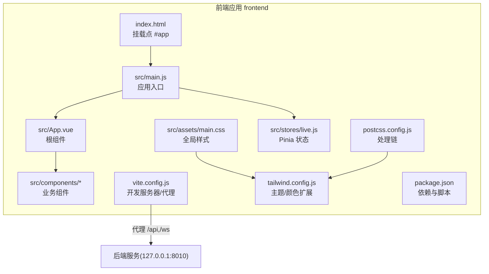
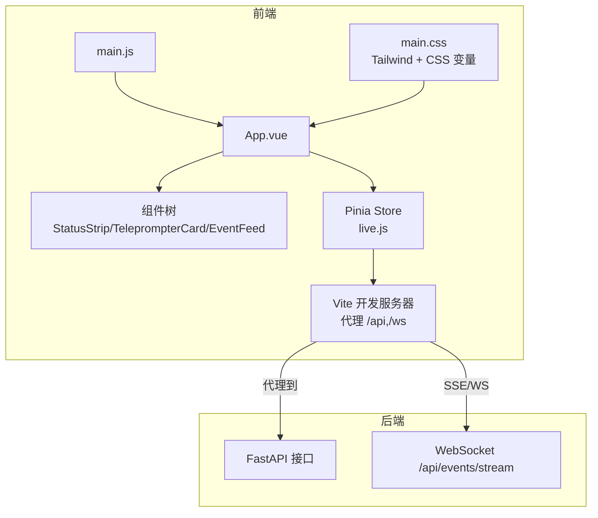
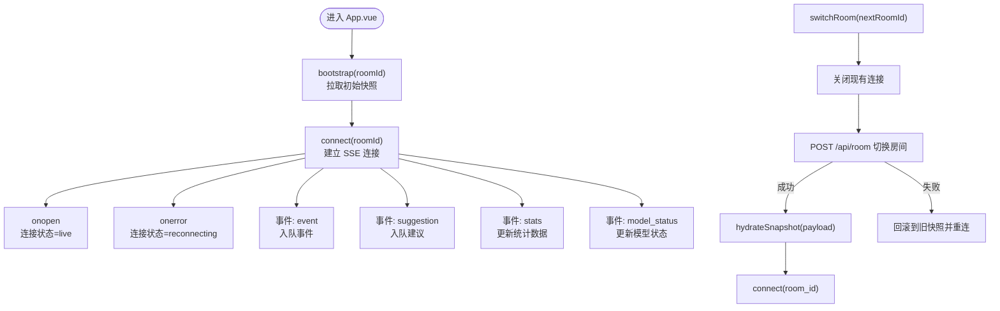
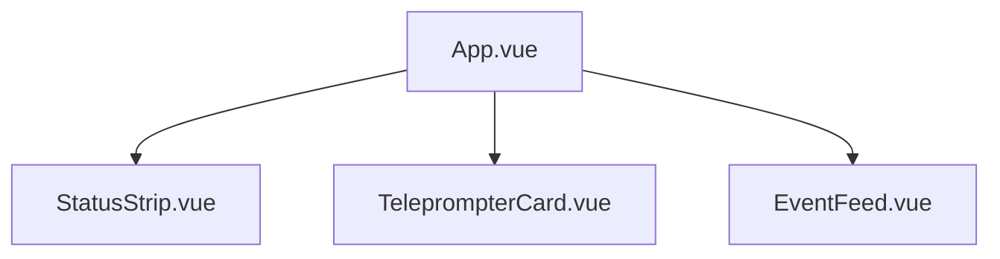
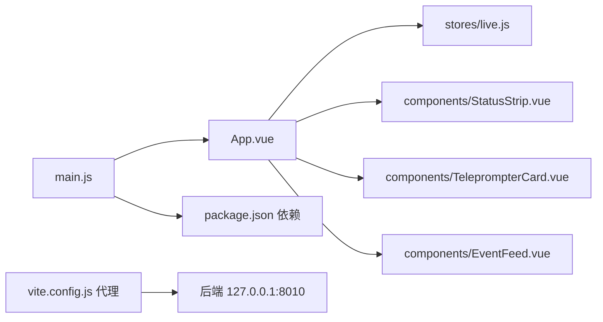

# 应用架构

<cite>
**本文引用的文件**
- [main.js](file://frontend/src/main.js)
- [App.vue](file://frontend/src/App.vue)
- [live.js](file://frontend/src/stores/live.js)
- [EventFeed.vue](file://frontend/src/components/EventFeed.vue)
- [StatusStrip.vue](file://frontend/src/components/StatusStrip.vue)
- [TeleprompterCard.vue](file://frontend/src/components/TeleprompterCard.vue)
- [main.css](file://frontend/src/assets/main.css)
- [vite.config.js](file://frontend/vite.config.js)
- [tailwind.config.js](file://frontend/tailwind.config.js)
- [postcss.config.js](file://frontend/postcss.config.js)
- [package.json](file://frontend/package.json)
- [index.html](file://frontend/index.html)
- [README.md](file://README.md)
</cite>

## 目录
1. [简介](#简介)
2. [项目结构](#项目结构)
3. [核心组件](#核心组件)
4. [架构总览](#架构总览)
5. [详细组件分析](#详细组件分析)
6. [依赖关系分析](#依赖关系分析)
7. [性能考虑](#性能考虑)
8. [故障排查指南](#故障排查指南)
9. [结论](#结论)
10. [附录](#附录)

## 简介
本项目是一个面向抖音直播场景的实时提词前端应用，采用 Vue 3 + Pinia + Tailwind CSS 技术栈，结合 Vite 构建工具与开发服务器，提供房间切换、事件筛选、实时提词展示与浅色/深色主题等核心功能。应用通过代理将前端请求转发至后端（FastAPI），后端负责事件采集、短期记忆、长期存储、向量检索、提词建议生成，并通过 SSE/WS 实时推送事件、建议、统计与模型状态到前端。

## 项目结构
前端工程位于 frontend 目录，采用“按功能模块”组织方式：
- src：源代码
  - assets：全局样式资源
  - components：可复用组件
  - stores：状态管理（Pinia）
  - App.vue：根组件
  - main.js：应用入口
- 根目录：构建与工具配置
  - index.html：HTML 模板
  - vite.config.js：Vite 开发服务器与代理配置
  - tailwind.config.js：Tailwind CSS 主题与颜色扩展
  - postcss.config.js：PostCSS 处理链（Tailwind + Autoprefixer）
  - package.json：依赖与脚本

图表来源
- [index.html:1-16](file://frontend/index.html#L1-L16)
- [main.js:1-17](file://frontend/src/main.js#L1-L17)
- [App.vue:1-66](file://frontend/src/App.vue#L1-L66)
- [live.js:1-310](file://frontend/src/stores/live.js#L1-L310)
- [main.css:1-144](file://frontend/src/assets/main.css#L1-L144)
- [vite.config.js:1-23](file://frontend/vite.config.js#L1-L23)
- [tailwind.config.js:1-23](file://frontend/tailwind.config.js#L1-L23)
- [postcss.config.js:1-9](file://frontend/postcss.config.js#L1-L9)
- [package.json:1-23](file://frontend/package.json#L1-L23)

章节来源
- [README.md:21-34](file://README.md#L21-L34)
- [package.json:1-23](file://frontend/package.json#L1-L23)

## 核心组件
- 应用入口 main.js
  - 创建 Vue 应用实例，注册 Pinia，导入全局样式，挂载到 index.html 的 #app。
- 根组件 App.vue
  - 引入三个核心子组件：状态条、提词卡片、事件流；在挂载时触发引导与连接。
- Pinia 状态 stores/live.js
  - 统一管理房间号、主题、连接状态、事件过滤器、事件与建议队列、统计数据、模型状态等。
- 业务组件
  - StatusStrip：展示房间号、连接状态、模型状态、统计数据，支持房间切换与主题切换。
  - TeleprompterCard：展示当前优先建议、来源事件与建议理由。
  - EventFeed：展示事件流、事件类型筛选、清空事件等交互。

章节来源
- [main.js:1-17](file://frontend/src/main.js#L1-L17)
- [App.vue:1-66](file://frontend/src/App.vue#L1-L66)
- [live.js:1-310](file://frontend/src/stores/live.js#L1-L310)
- [StatusStrip.vue:1-144](file://frontend/src/components/StatusStrip.vue#L1-L144)
- [TeleprompterCard.vue:1-83](file://frontend/src/components/TeleprompterCard.vue#L1-L83)
- [EventFeed.vue:1-183](file://frontend/src/components/EventFeed.vue#L1-L183)

## 架构总览
前端与后端通过 Vite 代理进行通信，前端通过 REST/SSE 获取初始快照与实时事件，通过 WebSocket 接收增量更新。Tailwind CSS 与 PostCSS 提供主题化与响应式样式，全局 CSS 通过 CSS 变量实现主题切换与视觉一致性。

图表来源
- [main.js:1-17](file://frontend/src/main.js#L1-L17)
- [App.vue:1-66](file://frontend/src/App.vue#L1-L66)
- [live.js:158-205](file://frontend/src/stores/live.js#L158-L205)
- [vite.config.js:10-22](file://frontend/vite.config.js#L10-L22)
- [main.css:1-144](file://frontend/src/assets/main.css#L1-L144)

## 详细组件分析

### 应用入口 main.js
- 职责
  - 创建 Vue 应用实例
  - 注册 Pinia，使全局共享直播状态
  - 在挂载前加载全局样式主题
  - 将应用挂载到 index.html 的 #app
- 关键点
  - 通过 import App from "./App.vue" 引入根组件
  - 通过 import "./assets/main.css" 加载全局样式
  - 通过 app.use(createPinia()) 注册状态管理
  - 通过 app.mount("#app") 完成挂载

章节来源
- [main.js:1-17](file://frontend/src/main.js#L1-L17)
- [index.html:1-16](file://frontend/index.html#L1-L16)

### 根组件 App.vue
- 设计与作用
  - 作为组件树的根容器，组织状态条、提词卡片与事件流三大区域
  - 在挂载时触发引导与连接，确保进入页面即有初始数据与实时流
- 数据绑定与事件
  - 通过 Pinia storeToRefs 解构出活跃建议、活跃事件、过滤器、统计数据等
  - 通过事件监听实现房间切换、主题切换、过滤器操作等交互

章节来源
- [App.vue:1-66](file://frontend/src/App.vue#L1-L66)
- [live.js:10-32](file://frontend/src/stores/live.js#L10-L32)

### Pinia 状态 stores/live.js
- 状态与计算属性
  - 房间号、草稿、主题、切换中状态、错误信息、连接状态、事件过滤器、选中事件类型、模型状态、统计数据、事件与建议队列
  - 计算属性：活跃建议、活跃来源事件、是否全选、过滤后的事件列表
- 生命周期与网络
  - bootstrap：拉取初始快照（最近事件、建议、统计、模型状态）
  - connect：建立 SSE 连接，订阅 event/suggestion/stats/model_status 事件
  - switchRoom：切换房间并回滚异常
  - 主题持久化与应用
- 本地存储
  - 事件类型选择与主题偏好持久化到 localStorage

图表来源
- [live.js:158-205](file://frontend/src/stores/live.js#L158-L205)
- [live.js:207-250](file://frontend/src/stores/live.js#L207-L250)

章节来源
- [live.js:1-310](file://frontend/src/stores/live.js#L1-L310)

### 组件树与交互
- StatusStrip
  - 展示房间号、连接状态、模型状态、统计数据
  - 支持输入房间号、切换房间、主题切换
- TeleprompterCard
  - 展示当前优先建议、来源事件与建议理由
  - 根据来源类型与优先级展示不同样式
- EventFeed
  - 展示事件流、事件类型筛选、清空事件
  - 支持全选/取消筛选、锁定最后一个筛选项

图表来源
- [App.vue:35-65](file://frontend/src/App.vue#L35-L65)
- [StatusStrip.vue:44-143](file://frontend/src/components/StatusStrip.vue#L44-L143)
- [TeleprompterCard.vue:34-82](file://frontend/src/components/TeleprompterCard.vue#L34-L82)
- [EventFeed.vue:88-182](file://frontend/src/components/EventFeed.vue#L88-L182)

章节来源
- [StatusStrip.vue:1-144](file://frontend/src/components/StatusStrip.vue#L1-L144)
- [TeleprompterCard.vue:1-83](file://frontend/src/components/TeleprompterCard.vue#L1-L83)
- [EventFeed.vue:1-183](file://frontend/src/components/EventFeed.vue#L1-L183)

### 样式系统与主题
- Tailwind CSS 集成
  - tailwind.config.js 扩展颜色与字体族，content 指定扫描范围
  - postcss.config.js 串联 tailwindcss 与 autoprefixer
- 全局样式 main.css
  - 通过 @tailwind base/components/utilities 引入工具类
  - 定义 CSS 变量：主题色、面板色、阴影、渐变背景、颗粒纹理等
  - 通过 :root[data-theme="dark|light"] 控制主题切换
  - 为提词卡片定义专用样式类（teleprompter-*）

章节来源
- [tailwind.config.js:1-23](file://frontend/tailwind.config.js#L1-L23)
- [postcss.config.js:1-9](file://frontend/postcss.config.js#L1-L9)
- [main.css:1-144](file://frontend/src/assets/main.css#L1-L144)

### Vite 构建与开发服务器
- 开发服务器
  - 端口：5173
  - 代理：
    - /api -> http://127.0.0.1:8010（REST 接口）
    - /ws -> ws://127.0.0.1:8010（WebSocket）
- 插件
  - @vitejs/plugin-vue：Vue SFC 支持
- 脚本
  - dev/build/preview：通过 package.json 脚本调用

章节来源
- [vite.config.js:1-23](file://frontend/vite.config.js#L1-L23)
- [package.json:6-10](file://frontend/package.json#L6-L10)

## 依赖关系分析
- 模块耦合
  - main.js 与 App.vue：入口与根组件的直接依赖
  - App.vue 与 stores/live.js：状态驱动视图
  - 组件与 store：通过 props/emits 与 store 方法交互
- 外部依赖
  - Vue 3、Pinia、Tailwind CSS、Vite
  - 开发时：@vitejs/plugin-vue、autoprefixer、postcss、tailwindcss
- 代理与后端
  - 前端通过 /api 与 /ws 与后端交互，Vite 代理到 127.0.0.1:8010

图表来源
- [main.js:1-17](file://frontend/src/main.js#L1-L17)
- [App.vue:1-66](file://frontend/src/App.vue#L1-L66)
- [live.js:1-310](file://frontend/src/stores/live.js#L1-L310)
- [vite.config.js:10-22](file://frontend/vite.config.js#L10-L22)
- [package.json:11-21](file://frontend/package.json#L11-L21)

章节来源
- [package.json:11-21](file://frontend/package.json#L11-L21)
- [vite.config.js:10-22](file://frontend/vite.config.js#L10-L22)

## 性能考虑
- 前端渲染
  - 事件与建议列表采用 slice 限制长度，避免无限增长导致的渲染压力
  - 通过 computed 计算属性减少重复计算
- 网络层
  - SSE 连接按需建立与关闭，异常时自动重连
  - 切换房间时先关闭旧连接，再发起新连接，保证状态一致
- 样式与构建
  - Tailwind 仅生成实际使用的工具类，结合 autoprefixer 提升兼容性
  - Vite 开发服务器启用热重载，提升开发效率

章节来源
- [live.js:4-6](file://frontend/src/stores/live.js#L4-L6)
- [live.js:165-171](file://frontend/src/stores/live.js#L165-L171)
- [live.js:173-205](file://frontend/src/stores/live.js#L173-L205)
- [tailwind.config.js:3-3](file://frontend/tailwind.config.js#L3-L3)
- [postcss.config.js:4-7](file://frontend/postcss.config.js#L4-L7)
- [vite.config.js:10-22](file://frontend/vite.config.js#L10-L22)

## 故障排查指南
- 无法连接后端
  - 检查 Vite 代理配置是否正确指向 127.0.0.1:8010
  - 确认后端服务已启动且端口未被占用
- 切换房间失败
  - 查看 store 中的 roomError 是否提示具体错误
  - 确认 /api/room 接口返回的 payload 正确
- 事件流不更新
  - 检查 /api/events/stream 是否正常推送 event/suggestion/stats/model_status 事件
  - 观察连接状态变化（connecting/live/reconnecting）
- 主题切换无效
  - 确认 localStorage 中的主题键值存在
  - 检查 :root[data-theme="..."] 是否正确设置

章节来源
- [vite.config.js:12-20](file://frontend/vite.config.js#L12-L20)
- [live.js:207-250](file://frontend/src/stores/live.js#L207-L250)
- [live.js:173-205](file://frontend/src/stores/live.js#L173-L205)
- [main.css:6-64](file://frontend/src/assets/main.css#L6-L64)

## 结论
该前端应用以 Vue 3 为核心，配合 Pinia 实现集中式状态管理，通过 Tailwind CSS 与 CSS 变量实现主题化与响应式布局，借助 Vite 的代理与热重载提升开发体验。组件树清晰、职责明确，状态与视图解耦良好，具备良好的可维护性与扩展性。建议后续在大型组件中引入更细粒度的状态拆分与异步加载策略，进一步优化首屏性能与交互流畅度。

## 附录
- 目录结构设计原则
  - 按功能模块划分：assets、components、stores、views（此处为 App.vue）与入口 main.js
  - 配置文件集中管理：vite、tailwind、postcss、package
  - HTML 模板最小化，仅包含挂载点与基础 meta
- 模块化组织建议
  - 将复杂组件拆分为更小的子组件，提升复用性
  - 对 store 中的方法进行分层封装，区分 UI 交互与网络请求
  - 为每个 store 定义清晰的 action/selector 分界，便于测试与调试

章节来源
- [README.md:21-34](file://README.md#L21-L34)
- [index.html:1-16](file://frontend/index.html#L1-L16)
- [package.json:1-23](file://frontend/package.json#L1-L23)