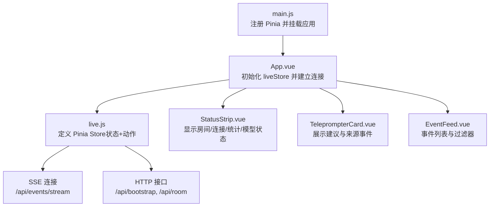
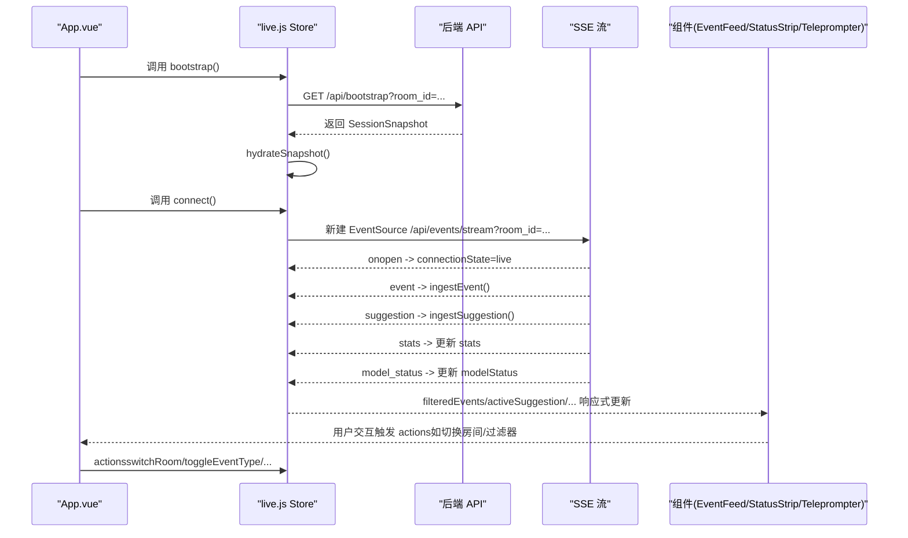
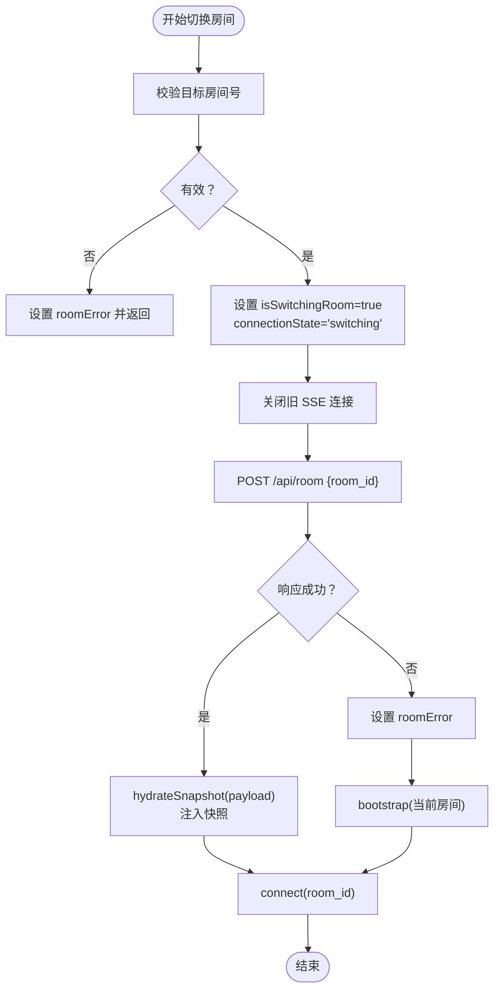
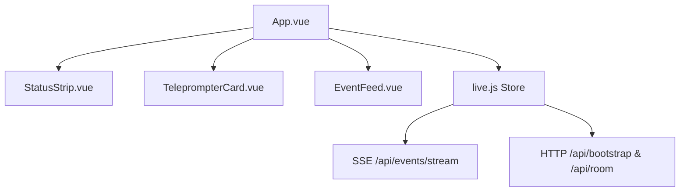
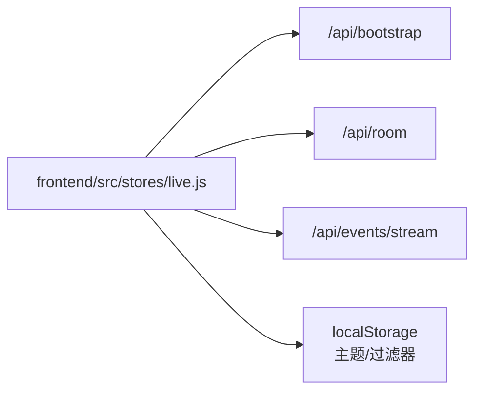

# 状态管理

<cite>
**本文引用的文件**
- [frontend/src/stores/live.js](file://frontend/src/stores/live.js)
- [frontend/src/main.js](file://frontend/src/main.js)
- [frontend/src/App.vue](file://frontend/src/App.vue)
- [frontend/src/components/EventFeed.vue](file://frontend/src/components/EventFeed.vue)
- [frontend/src/components/StatusStrip.vue](file://frontend/src/components/StatusStrip.vue)
- [frontend/src/components/TeleprompterCard.vue](file://frontend/src/components/TeleprompterCard.vue)
- [backend/schemas/live.py](file://backend/schemas/live.py)
- [frontend/package.json](file://frontend/package.json)
</cite>

## 目录
1. [简介](#简介)
2. [项目结构](#项目结构)
3. [核心组件](#核心组件)
4. [架构总览](#架构总览)
5. [详细组件分析](#详细组件分析)
6. [依赖分析](#依赖分析)
7. [性能考虑](#性能考虑)
8. [故障排查指南](#故障排查指南)
9. [结论](#结论)
10. [附录](#附录)

## 简介
本文件聚焦于前端状态管理，系统性解析基于 Pinia 的状态设计与实现，重点围绕 live.js 中的状态结构、数据流与实时同步机制。文档涵盖以下要点：
- 状态结构与数据模型：事件、统计、建议、模型状态等
- 实时状态同步：SSE 连接、事件分发、状态更新
- 单向数据流：从 WebSocket/SSE 到 UI 渲染的完整链路
- 响应式更新：computed 属性与 watch 的使用策略
- 持久化与恢复：本地存储、主题与过滤器恢复
- 调试与性能优化：最佳实践与常见问题定位

## 项目结构
前端采用 Vue 3 + Pinia 架构，状态集中于 Pinia Store，组件通过 storeToRefs 解构响应式状态并在模板中消费。入口文件注册 Pinia 并挂载应用；App.vue 作为根组件负责初始化状态与建立 SSE 连接；三个核心组件分别消费不同维度的状态数据。

图表来源
- [frontend/src/main.js:1-17](file://frontend/src/main.js#L1-L17)
- [frontend/src/App.vue:1-66](file://frontend/src/App.vue#L1-L66)
- [frontend/src/stores/live.js:70-310](file://frontend/src/stores/live.js#L70-L310)

章节来源
- [frontend/src/main.js:1-17](file://frontend/src/main.js#L1-L17)
- [frontend/src/App.vue:1-66](file://frontend/src/App.vue#L1-L66)
- [frontend/package.json:11-22](file://frontend/package.json#L11-L22)

## 核心组件
本节聚焦 live.js 中的状态与动作，梳理状态结构、计算属性、动作函数以及与后端接口的交互。

- 状态字段
  - 房间相关：房间 ID、草稿输入、切换中标志、错误信息
  - 连接状态：SSE 连接状态字符串
  - 过滤器：默认事件类型、已选事件类型、事件类型过滤器集合
  - 模型状态：模式、模型名、后端、最近结果、错误、更新时间
  - 统计：会话统计（事件总数、各类事件计数）
  - 事件与建议：事件队列、建议队列（带上限）
  - 主题：深色/浅色主题及切换
- 计算属性
  - 当前活动建议、活动建议对应的来源事件
  - 下一个主题标签
  - 是否全选事件类型
  - 已选事件类型的过滤后事件列表
- 动作函数
  - 初始化与快照注入：bootstrap、hydrateSnapshot
  - SSE 连接与断开：connect、closeStream
  - 事件与建议入队：ingestEvent、ingestSuggestion
  - 房间切换：switchRoom（含错误回退）
  - 过滤器操作：toggleEventType、selectAllEventTypes、clearEvents
  - 主题操作：setTheme、toggleTheme、persistTheme
  - 本地持久化：persistSelectedEventTypes、loadSelectedEventTypes、loadTheme、applyTheme

章节来源
- [frontend/src/stores/live.js:70-310](file://frontend/src/stores/live.js#L70-L310)

## 架构总览
Pinia Store 作为单一真相源，承载所有直播场景的状态与行为。App.vue 在挂载时调用 bootstrap 获取初始快照，并随后建立 SSE 连接以持续接收事件、建议、统计与模型状态变更。组件通过 storeToRefs 读取响应式状态，实现 UI 的自动更新。

图表来源
- [frontend/src/App.vue:29-32](file://frontend/src/App.vue#L29-L32)
- [frontend/src/stores/live.js:158-205](file://frontend/src/stores/live.js#L158-L205)
- [frontend/src/stores/live.js:165-171](file://frontend/src/stores/live.js#L165-L171)
- [frontend/src/stores/live.js:190-204](file://frontend/src/stores/live.js#L190-L204)

## 详细组件分析

### live.js 状态与动作详解
- 状态结构
  - 事件与建议：通过数组维护，限制最大长度，保证内存占用可控
  - 统计与模型状态：轻量级对象，便于快速渲染
  - 过滤器与主题：支持本地持久化，提升用户体验
- 计算属性
  - filteredEvents：基于 selectedEventTypes 的动态过滤
  - activeSuggestion/activeSourceEvent：从建议与事件中推导出当前展示的建议与来源事件
  - areAllEventTypesSelected：用于控制“全部显示”按钮的可用状态
- 动作函数
  - bootstrap：拉取初始快照，填充房间、统计、事件与建议
  - connect：建立 SSE 连接，处理 open/error 事件，订阅多类事件
  - switchRoom：房间切换流程包含校验、HTTP 请求、快照注入、重连与错误回退
  - ingestEvent/ingestSuggestion：入队并截断，维持固定上限
  - toggleEventType/selectAllEventTypes：过滤器的增删与全选
  - 主题与持久化：setTheme/toggleTheme/persistTheme/loadTheme/applyTheme

图表来源
- [frontend/src/stores/live.js:207-250](file://frontend/src/stores/live.js#L207-L250)

章节来源
- [frontend/src/stores/live.js:70-310](file://frontend/src/stores/live.js#L70-L310)

### App.vue 与组件集成
- App.vue 在挂载时执行 bootstrap 与 connect，确保进入页面即有初始数据与实时流
- 通过 storeToRefs 将响应式状态解构为模板可直接使用的引用，避免额外的包装
- 三个核心组件分别消费：
  - StatusStrip：房间号、连接状态、统计、模型状态、主题切换
  - TeleprompterCard：当前建议与来源事件
  - EventFeed：事件列表、过滤器、清空事件

图表来源
- [frontend/src/App.vue:10-32](file://frontend/src/App.vue#L10-L32)
- [frontend/src/components/StatusStrip.vue:1-144](file://frontend/src/components/StatusStrip.vue#L1-L144)
- [frontend/src/components/TeleprompterCard.vue:1-83](file://frontend/src/components/TeleprompterCard.vue#L1-L83)
- [frontend/src/components/EventFeed.vue:1-183](file://frontend/src/components/EventFeed.vue#L1-L183)

章节来源
- [frontend/src/App.vue:1-66](file://frontend/src/App.vue#L1-L66)

### 后端数据模型映射
后端提供统一的数据模型，前端通过 Pinia Store 的 hydrateSnapshot 与 SSE 事件进行对接：
- LiveEvent：标准化的直播事件，包含事件 ID、房间 ID、事件类型、时间戳、用户信息、内容与元数据
- Suggestion：建议回复，包含来源、优先级、语气、置信度、理由、关联事件 ID 等
- SessionStats：会话统计，包含各类事件计数
- ModelStatus：模型运行状态与错误信息
- SessionSnapshot：初始快照，包含最近事件、建议、统计与模型状态

章节来源
- [backend/schemas/live.py:29-95](file://backend/schemas/live.py#L29-L95)

## 依赖分析
- 前端依赖
  - Vue 3：组合式 API、响应式系统、组件化开发
  - Pinia：状态管理，提供模块化的 Store 定义与响应式状态
  - TailwindCSS：样式工具，支持主题切换
- 与后端接口契约
  - /api/bootstrap：获取初始 SessionSnapshot
  - /api/room：切换房间并返回新快照
  - /api/events/stream：SSE 事件流，推送 event/suggestion/stats/model_status

图表来源
- [frontend/src/stores/live.js:158-205](file://frontend/src/stores/live.js#L158-L205)
- [frontend/src/stores/live.js:41-60](file://frontend/src/stores/live.js#L41-L60)
- [frontend/src/stores/live.js:113-127](file://frontend/src/stores/live.js#L113-L127)

章节来源
- [frontend/package.json:11-22](file://frontend/package.json#L11-L22)
- [frontend/src/stores/live.js:158-205](file://frontend/src/stores/live.js#L158-L205)

## 性能考虑
- 状态上限控制
  - 事件与建议均设置上限，避免无限增长导致内存压力与渲染卡顿
- 计算属性优化
  - filteredEvents 基于 selectedEventTypes 动态过滤，仅在过滤器变化时重新计算
  - activeSuggestion/activeSourceEvent 通过集合查找与事件匹配，保持 O(n) 查找复杂度
- 渲染层面
  - EventFeed 对事件列表进行切片渲染，减少一次性渲染数量
  - TeleprompterCard 仅在存在建议时渲染详细面板，空状态简洁提示
- 网络与连接
  - SSE 断线自动重连，onerror 将连接状态置为“重连中”，保障 UI 反馈一致性
  - 切换房间时先关闭旧连接再发起新请求，避免资源泄漏

## 故障排查指南
- 连接状态异常
  - 现象：连接状态长时间停留在“连接中/重连中”
  - 排查：检查 /api/events/stream 是否可达；确认房间 ID 正确；观察浏览器网络面板
- 房间切换失败
  - 现象：切换房间报错或回退到旧房间
  - 排查：检查 /api/room 返回的错误信息；确认 room_id 格式；查看 switchRoom 的错误分支是否触发
- 事件不显示
  - 现象：事件列表为空或被过滤
  - 排查：检查 selectedEventTypes 是否全选；确认事件类型是否正确；查看 filteredEvents 的计算逻辑
- 主题与过滤器未生效
  - 现象：刷新后主题/过滤器恢复默认
  - 排查：确认 localStorage 是否可用；检查 persistSelectedEventTypes/persistTheme 是否执行

章节来源
- [frontend/src/stores/live.js:173-205](file://frontend/src/stores/live.js#L173-L205)
- [frontend/src/stores/live.js:207-250](file://frontend/src/stores/live.js#L207-L250)
- [frontend/src/stores/live.js:113-127](file://frontend/src/stores/live.js#L113-L127)

## 结论
该状态管理方案以 Pinia 为核心，结合 Vue 3 的响应式系统与组合式 API，实现了清晰的单向数据流与高效的实时同步。通过计算属性与动作函数的合理拆分，既保证了 UI 的即时反馈，又确保了状态的一致性与可维护性。配合本地持久化与错误回退机制，系统在异常情况下仍能保持稳定与可用。

## 附录
- 最佳实践
  - 使用 computed 代替重复计算，避免在模板中进行复杂逻辑
  - 将副作用动作集中在 store 中，组件只负责消费状态与触发动作
  - 对长列表进行分页/切片渲染，减少 DOM 压力
  - 在关键路径上增加 loading/错误状态，提升用户感知
- 常见问题
  - SSE 断线：利用 onerror 与重连策略，确保连接状态可视化
  - 内存增长：严格控制事件与建议队列长度，定期清理
  - 过滤器失效：检查本地存储与默认值回退逻辑