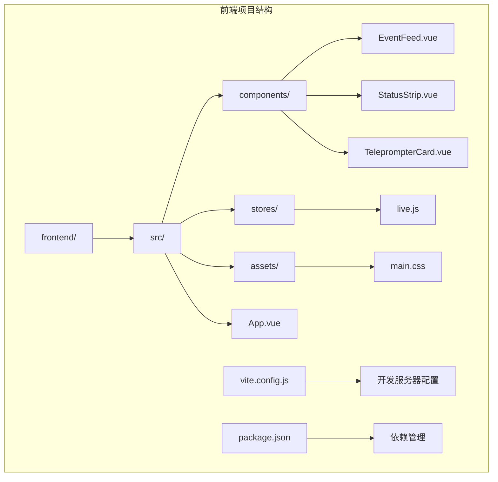
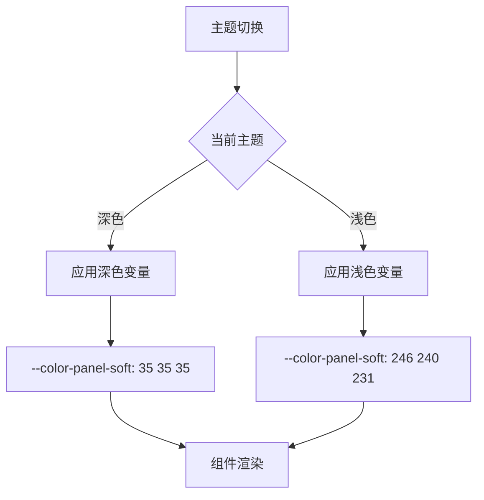
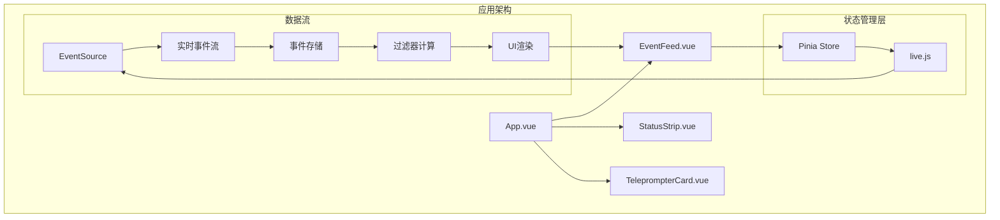
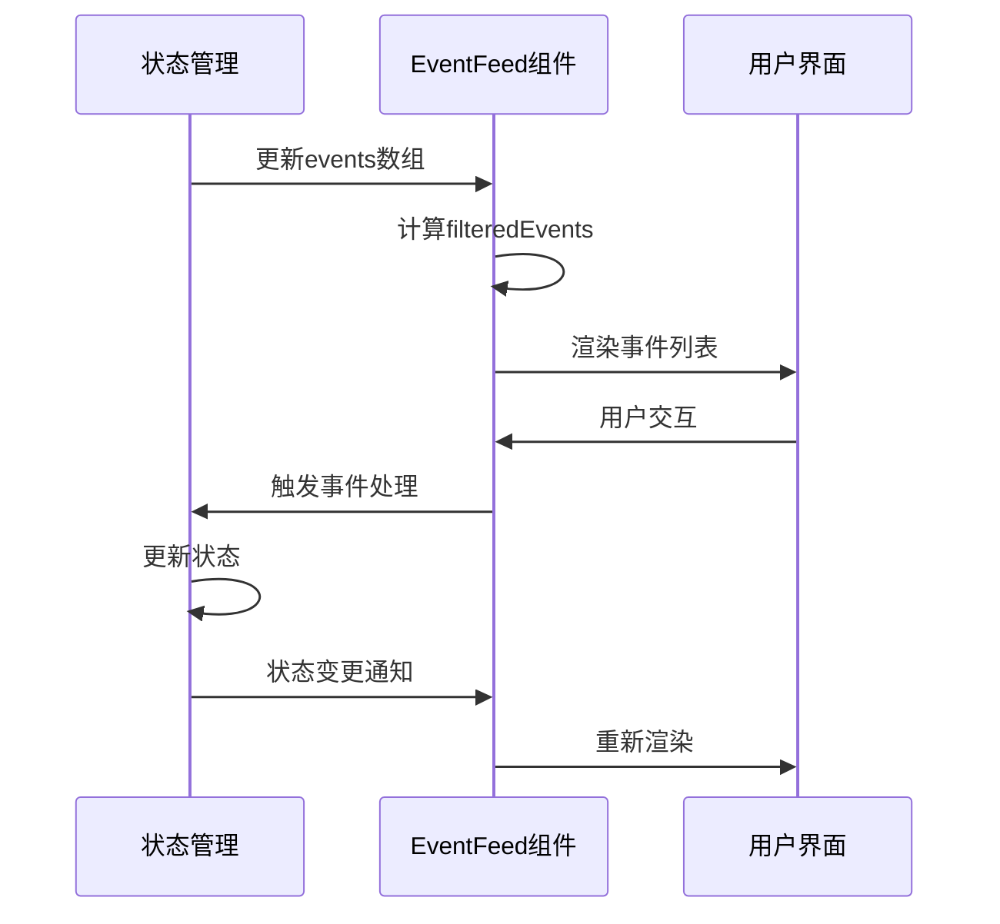
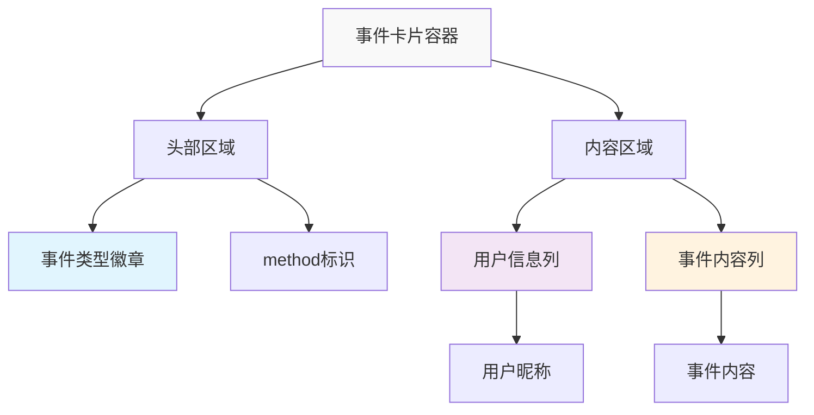
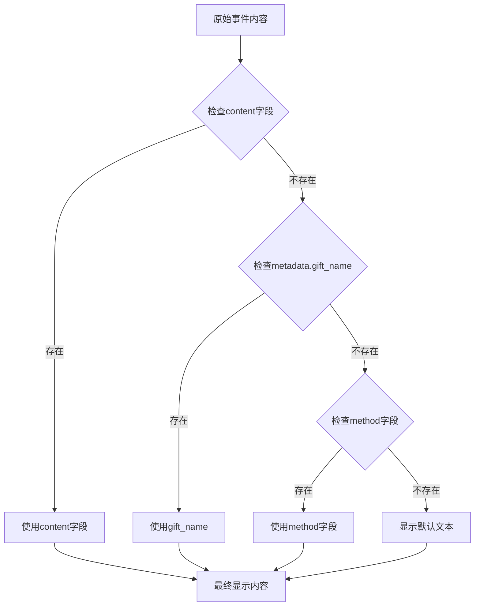
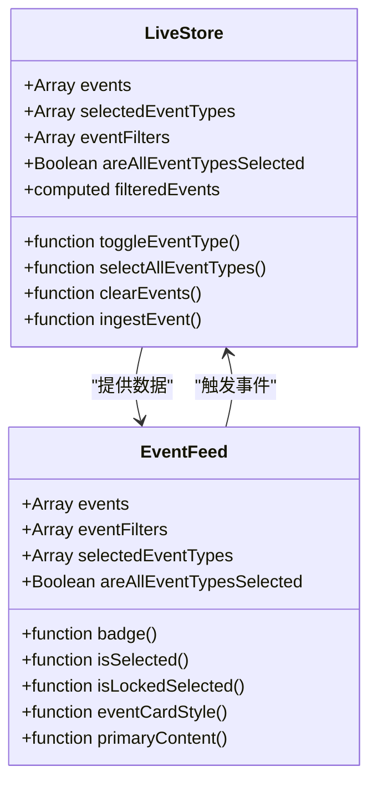
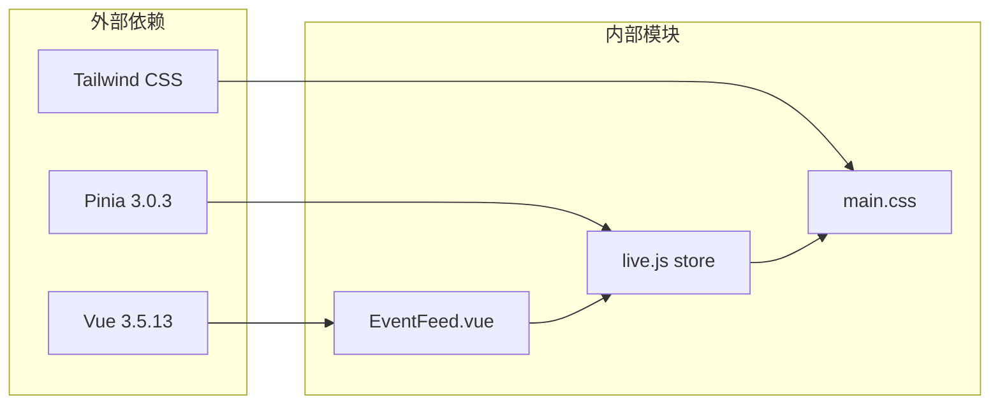

# EventFeed事件流组件

<cite>
**本文档引用的文件**
- [EventFeed.vue](file://frontend/src/components/EventFeed.vue)
- [live.js](file://frontend/src/stores/live.js)
- [App.vue](file://frontend/src/App.vue)
- [main.css](file://frontend/src/assets/main.css)
- [package.json](file://frontend/package.json)
- [vite.config.js](file://frontend/vite.config.js)
</cite>

## 目录
1. [简介](#简介)
2. [项目结构](#项目结构)
3. [核心组件](#核心组件)
4. [架构概览](#架构概览)
5. [详细组件分析](#详细组件分析)
6. [依赖关系分析](#依赖关系分析)
7. [性能考虑](#性能考虑)
8. [故障排除指南](#故障排除指南)
9. [结论](#结论)
10. [附录](#附录)

## 简介

EventFeed事件流组件是直播互动平台的核心UI组件，负责实时展示各种直播事件（如弹幕、礼物、关注、进场、点赞等）。该组件采用Vue 3 Composition API设计，结合Pinia状态管理，实现了高性能的事件流展示和交互功能。组件支持事件类型过滤、实时更新、主题切换等功能，为用户提供直观的直播互动体验。

## 项目结构

EventFeed组件位于前端项目的组件目录中，与状态管理store和应用主组件协同工作：



**图表来源**
- [EventFeed.vue:1-183](file://frontend/src/components/EventFeed.vue#L1-L183)
- [live.js:1-310](file://frontend/src/stores/live.js#L1-L310)
- [App.vue:1-66](file://frontend/src/App.vue#L1-L66)

**章节来源**
- [EventFeed.vue:1-183](file://frontend/src/components/EventFeed.vue#L1-L183)
- [live.js:1-310](file://frontend/src/stores/live.js#L1-L310)
- [App.vue:1-66](file://frontend/src/App.vue#L1-L66)

## 核心组件

EventFeed组件是一个响应式的Vue单文件组件，具有以下核心特性：

### Props接口定义

组件通过props接收四个必需的参数：

| 属性名 | 类型 | 必需 | 描述 |
|--------|------|------|------|
| events | Array | 是 | 事件数组，包含所有直播事件对象 |
| eventFilters | Array | 是 | 过滤器数组，定义可用的事件类型 |
| selectedEventTypes | Array | 是 | 已选中的事件类型数组 |
| areAllEventTypesSelected | Boolean | 是 | 是否已选择所有事件类型的布尔值 |

### 事件处理机制

组件定义了三个自定义事件：

| 事件名 | 触发条件 | 参数 | 描述 |
|--------|----------|------|------|
| toggle-filter | 用户点击事件类型按钮 | eventType | 切换指定事件类型的过滤状态 |
| select-all-filters | 用户点击"Show All"按钮 | - | 选择所有事件类型 |
| clear-events | 用户点击"Clear"按钮 | - | 清空所有事件 |

### 样式系统

组件采用基于CSS变量的主题系统，支持深色和浅色两种主题模式：



**图表来源**
- [main.css:5-64](file://frontend/src/assets/main.css#L5-L64)

**章节来源**
- [EventFeed.vue:2-19](file://frontend/src/components/EventFeed.vue#L2-L19)
- [EventFeed.vue:21](file://frontend/src/components/EventFeed.vue#L21)

## 架构概览

EventFeed组件在整个应用架构中扮演着关键角色，连接UI层和数据层：



**图表来源**
- [App.vue:54-62](file://frontend/src/App.vue#L54-L62)
- [live.js:165-205](file://frontend/src/stores/live.js#L165-L205)

**章节来源**
- [App.vue:52-65](file://frontend/src/App.vue#L52-L65)
- [live.js:70-309](file://frontend/src/stores/live.js#L70-L309)

## 详细组件分析

### 组件渲染逻辑

EventFeed组件采用响应式渲染策略，根据props动态更新界面：



**图表来源**
- [EventFeed.vue:141-180](file://frontend/src/components/EventFeed.vue#L141-L180)
- [live.js:109-111](file://frontend/src/stores/live.js#L109-L111)

### 事件类型徽章显示

组件为不同事件类型提供对应的徽章标签：

| 事件类型 | 徽章标签 | 颜色方案 |
|----------|----------|----------|
| comment | 弹幕 | 蓝色系 |
| gift | 礼物 | 橙色系 |
| follow | 关注 | 绿色系 |
| member | 进场 | 紫色系 |
| like | 点赞 | 红色系 |
| 其他 | 系统 | 中性灰色 |

### 事件卡片布局

每个事件卡片采用网格布局设计：



**图表来源**
- [EventFeed.vue:149-170](file://frontend/src/components/EventFeed.vue#L149-L170)

### 内容截取算法

组件实现了智能的内容截取逻辑：



**图表来源**
- [EventFeed.vue:48-50](file://frontend/src/components/EventFeed.vue#L48-L50)

### 滚动控制

组件采用虚拟化渲染策略，限制显示数量：

- **最大显示数量**: 10个事件
- **滚动容器**: 最大高度60vh（桌面端）
- **响应式调整**: 在大屏幕上自动调整最大高度

**章节来源**
- [EventFeed.vue:141-144](file://frontend/src/components/EventFeed.vue#L141-L144)

### 状态管理

EventFeed组件的状态管理采用Pinia store模式：



**图表来源**
- [live.js:70-309](file://frontend/src/stores/live.js#L70-L309)
- [EventFeed.vue:1-85](file://frontend/src/components/EventFeed.vue#L1-L85)

**章节来源**
- [live.js:106-111](file://frontend/src/stores/live.js#L106-L111)
- [live.js:252-268](file://frontend/src/stores/live.js#L252-L268)

### 性能优化策略

组件实现了多项性能优化措施：

1. **虚拟化渲染**: 只渲染最近的10个事件
2. **状态缓存**: 使用computed属性缓存过滤结果
3. **样式预计算**: 事件类型样式在组件内预计算
4. **懒加载**: 事件内容按需渲染

**章节来源**
- [live.js:165-167](file://frontend/src/stores/live.js#L165-L167)
- [EventFeed.vue:144](file://frontend/src/components/EventFeed.vue#L144)

## 依赖关系分析

EventFeed组件的依赖关系清晰明确：



**图表来源**
- [package.json:11-21](file://frontend/package.json#L11-L21)

**章节来源**
- [package.json:1-23](file://frontend/package.json#L1-23)

## 性能考虑

### 渲染性能

- **事件数量限制**: 通过`events.slice(0, 10)`限制渲染数量
- **计算属性缓存**: 使用computed属性避免重复计算
- **条件渲染**: 使用v-if优化空状态渲染

### 内存管理

- **事件队列长度**: 最大保留30个事件
- **建议队列长度**: 最大保留12个建议
- **自动清理**: 新事件添加时自动移除最旧事件

### 网络性能

- **SSE连接**: 使用Server-Sent Events实现实时更新
- **连接状态**: 提供连接状态指示和重连机制
- **错误处理**: 完善的错误捕获和恢复机制

**章节来源**
- [live.js:4](file://frontend/src/stores/live.js#L4-L5)
- [live.js:165-205](file://frontend/src/stores/live.js#L165-L205)

## 故障排除指南

### 常见问题及解决方案

| 问题类型 | 症状 | 解决方案 |
|----------|------|----------|
| 事件不显示 | 界面空白或提示"当前筛选下没有消息" | 检查areAllEventTypesSelected状态，尝试点击"Show All" |
| 过滤器无响应 | 点击事件类型按钮无效 | 确认selectedEventTypes状态，检查是否处于锁定状态 |
| 样式异常 | 颜色显示不正确 | 检查主题设置，确认CSS变量正确加载 |
| 性能问题 | 页面卡顿或加载缓慢 | 检查事件数量，确认虚拟化渲染正常工作 |

### 调试技巧

1. **浏览器开发者工具**: 监控事件流和状态变化
2. **Vue DevTools**: 分析组件状态和props传递
3. **网络面板**: 检查SSE连接状态
4. **控制台日志**: 查看错误信息和警告

**章节来源**
- [EventFeed.vue:173-178](file://frontend/src/components/EventFeed.vue#L173-L178)
- [live.js:186-189](file://frontend/src/stores/live.js#L186-L189)

## 结论

EventFeed事件流组件是一个设计精良的Vue 3组件，具有以下特点：

1. **模块化设计**: 清晰的职责分离和依赖管理
2. **高性能实现**: 虚拟化渲染和状态缓存优化
3. **用户体验**: 直观的交互和响应式设计
4. **可维护性**: 良好的代码结构和文档支持

该组件为直播互动平台提供了稳定可靠的基础，支持实时事件展示、灵活的过滤机制和优雅的主题切换功能。

## 附录

### 实际使用示例

```vue
<EventFeed
  :events="filteredEvents"
  :event-filters="eventFilters"
  :selected-event-types="selectedEventTypes"
  :are-all-event-types-selected="areAllEventTypesSelected"
  @toggle-filter="liveStore.toggleEventType"
  @select-all-filters="liveStore.selectAllEventTypes"
  @clear-events="liveStore.clearEvents"
/>
```

### 自定义扩展指导

1. **样式定制**: 通过修改CSS变量调整主题颜色
2. **功能扩展**: 添加新的事件类型和对应的样式映射
3. **性能调优**: 根据需求调整事件显示数量和刷新频率
4. **交互增强**: 扩展事件详情面板和操作菜单

**章节来源**
- [EventFeed.vue:52-85](file://frontend/src/components/EventFeed.vue#L52-L85)
- [live.js:7-14](file://frontend/src/stores/live.js#L7-L14)