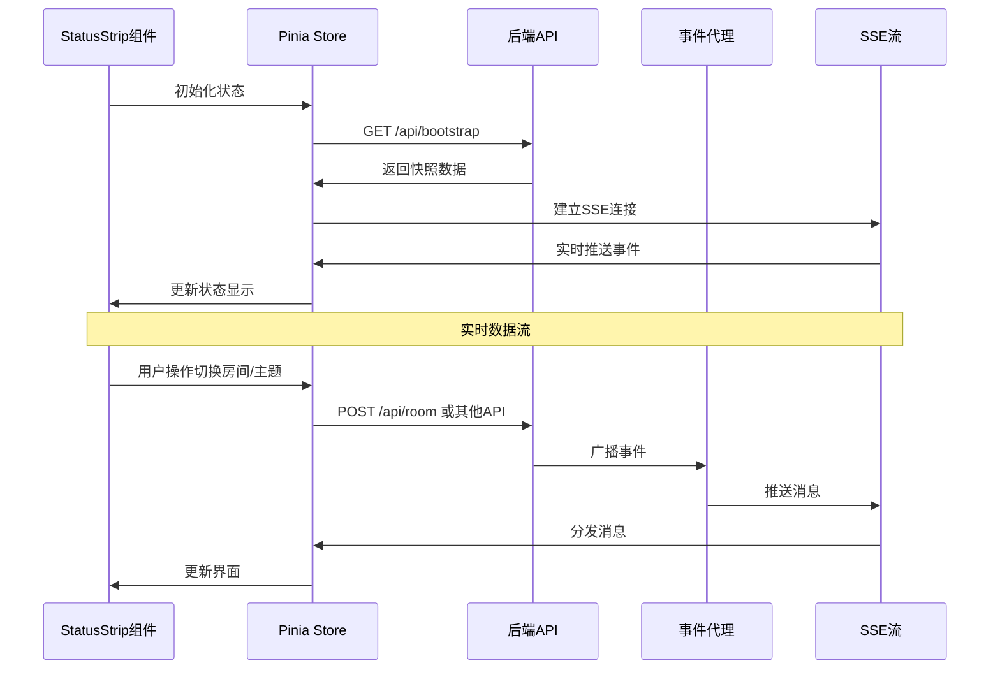
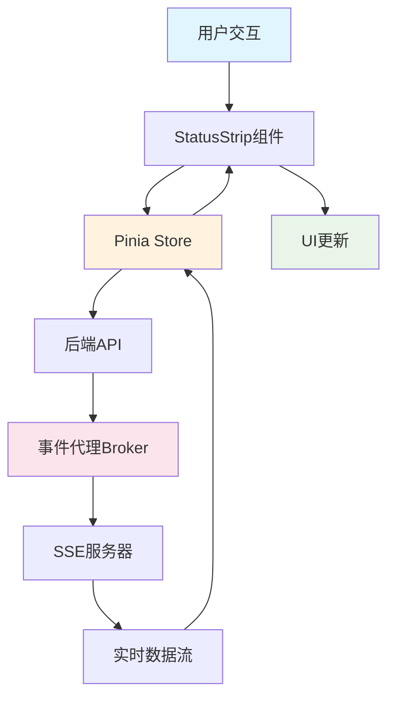
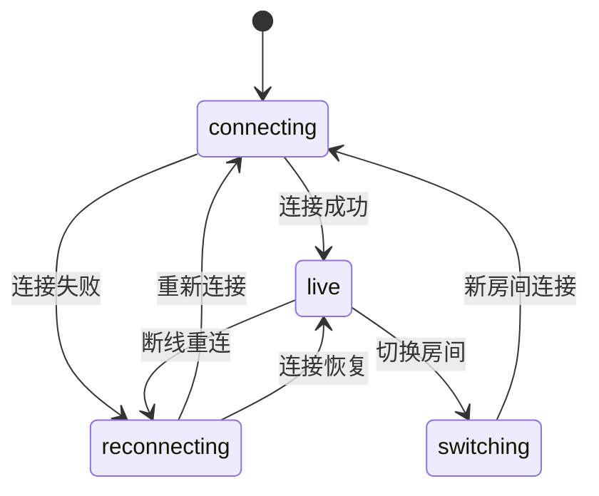
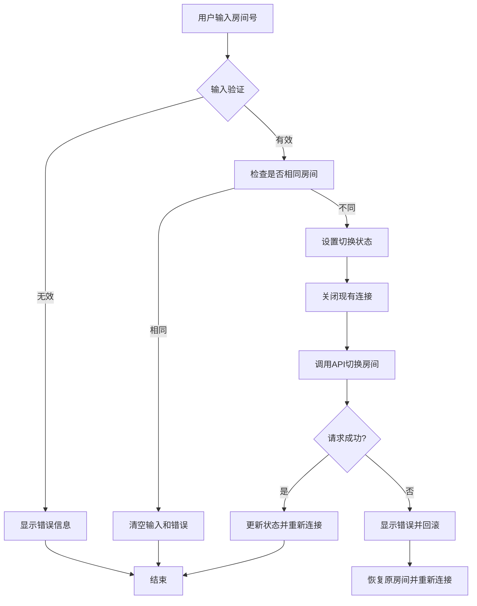
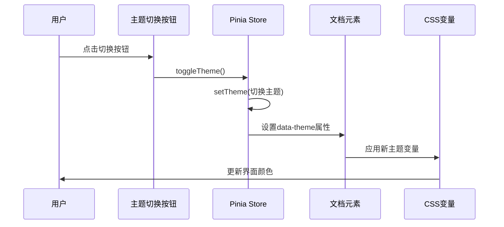
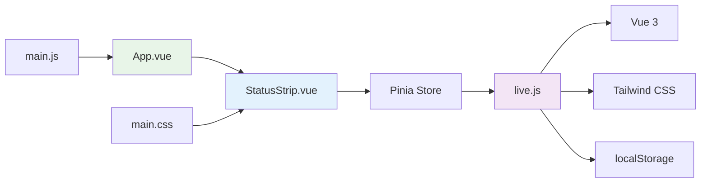
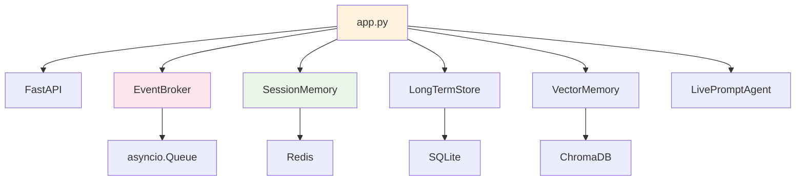
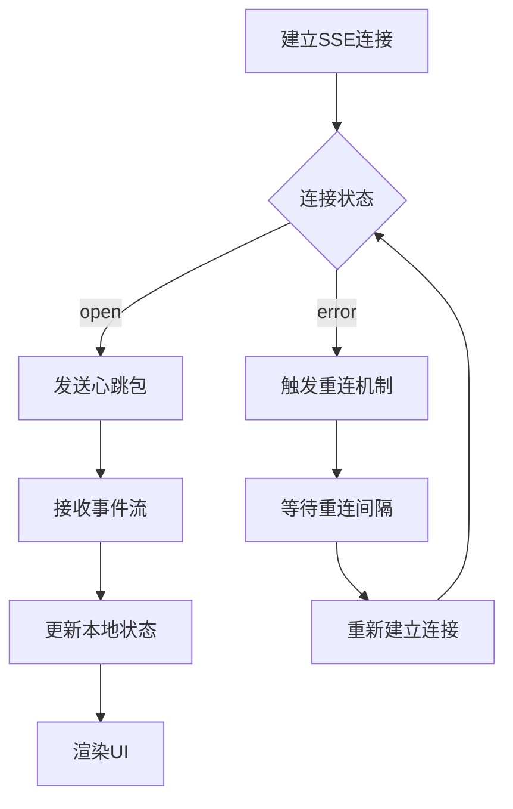
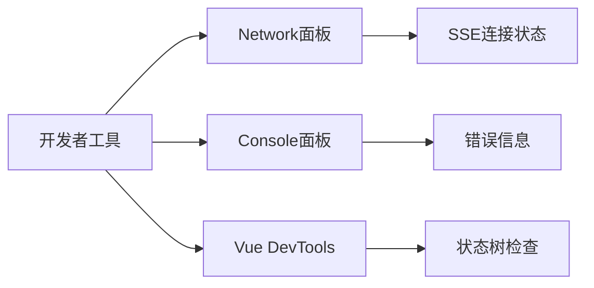

# StatusStrip状态条组件

<cite>
**本文档引用的文件**
- [StatusStrip.vue](file://frontend/src/components/StatusStrip.vue)
- [live.js](file://frontend/src/stores/live.js)
- [App.vue](file://frontend/src/App.vue)
- [main.js](file://frontend/src/main.js)
- [live.py](file://backend/schemas/live.py)
- [app.py](file://backend/app.py)
- [broker.py](file://backend/services/broker.py)
- [main.css](file://frontend/src/assets/main.css)
- [package.json](file://frontend/package.json)
- [config.py](file://backend/config.py)
</cite>

## 目录
1. [简介](#简介)
2. [项目结构](#项目结构)
3. [核心组件](#核心组件)
4. [架构概览](#架构概览)
5. [详细组件分析](#详细组件分析)
6. [依赖分析](#依赖分析)
7. [性能考虑](#性能考虑)
8. [故障排除指南](#故障排除指南)
9. [结论](#结论)
10. [附录](#附录)

## 简介

StatusStrip状态条组件是直播提示器应用中的关键UI组件，负责实时显示直播间的连接状态、模型状态、统计数据等重要信息。该组件采用现代化的Vue 3 Composition API设计，结合Pinia状态管理，实现了完整的实时数据流和响应式主题切换功能。

组件的主要功能包括：
- **连接状态指示**：实时显示与后端服务器的连接状态（connecting、live、reconnecting、switching）
- **模型状态展示**：显示AI模型的当前状态、模式和最后结果
- **统计信息显示**：展示弹幕数量、礼物数、点赞数、成员数、关注数等统计数据
- **房间管理**：支持房间号输入、切换和错误处理
- **主题适配**：支持深色/浅色主题自动切换
- **响应式设计**：适配不同屏幕尺寸的设备

## 项目结构

该项目采用前后端分离架构，前端使用Vue 3 + Pinia + Tailwind CSS，后端使用FastAPI + SSE（Server-Sent Events）。

```mermaid
graph TB
subgraph "前端 (Vue 3)"
A[App.vue] --> B[StatusStrip.vue]
A --> C[EventFeed.vue]
A --> D[TeleprompterCard.vue]
E[live.js Store] --> B
F[main.js] --> A
G[main.css] --> B
end
subgraph "后端 (FastAPI)"
H[app.py] --> I[EventBroker]
J[live.py Schemas] --> H
K[config.py] --> H
end
B < --> |"SSE Stream"| H
E < --> |"HTTP API"| H
```

**图表来源**
- [App.vue:1-66](file://frontend/src/App.vue#L1-L66)
- [StatusStrip.vue:1-144](file://frontend/src/components/StatusStrip.vue#L1-L144)
- [live.js:1-310](file://frontend/src/stores/live.js#L1-L310)
- [app.py:1-220](file://backend/app.py#L1-L220)

**章节来源**
- [main.js:1-17](file://frontend/src/main.js#L1-L17)
- [package.json:1-23](file://frontend/package.json#L1-L23)

## 核心组件

StatusStrip组件是整个直播监控界面的核心，它整合了多个状态显示区域，为用户提供完整的直播间状态概览。

### 组件属性定义

组件通过props接收以下关键属性：

| 属性名 | 类型 | 必需 | 描述 |
|--------|------|------|------|
| roomId | String | 是 | 当前直播间的房间ID |
| roomDraft | String | 是 | 用户输入的房间号草稿 |
| theme | String | 是 | 当前主题（'dark'或'light'） |
| nextThemeLabel | String | 是 | 下一个主题的标签文本 |
| isSwitchingRoom | Boolean | 是 | 房间切换状态标志 |
| roomError | String | 否 | 房间切换错误信息 |
| connectionState | String | 是 | 连接状态字符串 |
| modelStatus | Object | 是 | 模型状态对象 |
| stats | Object | 是 | 统计数据对象 |

### 数据流架构



**图表来源**
- [StatusStrip.vue:1-144](file://frontend/src/components/StatusStrip.vue#L1-L144)
- [live.js:158-205](file://frontend/src/stores/live.js#L158-L205)
- [app.py:187-206](file://backend/app.py#L187-L206)

**章节来源**
- [StatusStrip.vue:2-39](file://frontend/src/components/StatusStrip.vue#L2-L39)
- [live.js:70-90](file://frontend/src/stores/live.js#L70-L90)

## 架构概览

StatusStrip组件采用MVVM架构模式，通过Pinia进行状态管理，实现数据的单向流动和响应式更新。

### 状态管理层次



**图表来源**
- [live.js:158-205](file://frontend/src/stores/live.js#L158-L205)
- [app.py:187-206](file://backend/app.py#L187-L206)
- [broker.py:10-40](file://backend/services/broker.py#L10-L40)

### 颜色编码系统

组件实现了完整的颜色编码系统，用于直观地表示不同的状态：

| 状态类型 | 颜色变量 | 使用场景 | 示例值 |
|----------|----------|----------|--------|
| 连接状态 | `--color-accent` | 连接状态文本 | 深绿色（暗色主题）/深棕色（亮色主题） |
| 房间ID | `--color-paper` | 房间号显示 | 浅色文字 |
| 统计数据 | `--color-paper` | 数字显示 | 主要文字颜色 |
| 错误信息 | `--color-rose-500` | 房间切换错误 | 红色警告 |
| 标题文本 | `--color-muted` | 小标题显示 | 次要文字颜色 |
| 按钮文本 | `--color-accent` | 操作按钮 | 强调色 |

**章节来源**
- [main.css:5-64](file://frontend/src/assets/main.css#L5-L64)
- [StatusStrip.vue:113-115](file://frontend/src/components/StatusStrip.vue#L113-L115)

## 详细组件分析

### 连接状态指示器

连接状态指示器位于组件的第二列，实时显示与后端服务器的连接状态。状态值通过SSE流动态更新。



**图表来源**
- [live.js:173-205](file://frontend/src/stores/live.js#L173-L205)
- [StatusStrip.vue:118-121](file://frontend/src/components/StatusStrip.vue#L118-L121)

### 房间管理功能

房间管理区域包含房间号输入框、切换按钮和错误提示，支持用户快速切换直播房间。

#### 房间切换流程



**图表来源**
- [live.js:207-250](file://frontend/src/stores/live.js#L207-L250)
- [StatusStrip.vue:93-116](file://frontend/src/components/StatusStrip.vue#L93-L116)

**章节来源**
- [live.js:207-250](file://frontend/src/stores/live.js#L207-L250)
- [StatusStrip.vue:93-116](file://frontend/src/components/StatusStrip.vue#L93-L116)

### 模型状态展示

模型状态区域显示AI模型的当前工作状态，包括模型名称、最后结果和错误信息。

#### 模型状态数据结构

| 字段名 | 类型 | 描述 | 默认值 |
|--------|------|------|--------|
| mode | String | 工作模式 | "heuristic" |
| model | String | 模型名称 | "heuristic" |
| backend | String | 后端类型 | "local" |
| last_result | String | 最后一次结果 | "idle" |
| last_error | String | 最后一次错误 | "" |
| updated_at | Number | 更新时间戳 | 0 |

**章节来源**
- [live.js:79-86](file://frontend/src/stores/live.js#L79-L86)
- [live.py:76-85](file://backend/schemas/live.py#L76-L85)
- [StatusStrip.vue:128-136](file://frontend/src/components/StatusStrip.vue#L128-L136)

### 统计信息显示

统计信息区域展示了直播间的各项统计数据，包括弹幕数量、礼物数、点赞数、成员数和关注数。

#### 统计数据结构

| 统计项 | 字段名 | 描述 | 显示位置 |
|--------|--------|------|----------|
| 总事件数 | total_events | 所有事件总数 | 第四列 |
| 弹幕数 | comments | 弹幕事件数量 | 第三列 |
| 礼物数 | gifts | 礼物事件数量 | 第二列 |
| 点赞数 | likes | 点赞事件数量 | 第四列 |
| 成员数 | members | 成员进入事件数量 | 第二列 |
| 关注数 | follows | 关注事件数量 | 第三列 |

**章节来源**
- [live.js:20-30](file://frontend/src/stores/live.js#L20-L30)
- [live.py:64-74](file://backend/schemas/live.py#L64-L74)
- [StatusStrip.vue:123-141](file://frontend/src/components/StatusStrip.vue#L123-L141)

### 主题适配机制

组件支持深色和浅色两种主题，通过CSS变量实现主题切换，确保在不同环境下都有良好的视觉体验。

#### 主题切换流程



**图表来源**
- [live.js:148-156](file://frontend/src/stores/live.js#L148-L156)
- [main.css:5-64](file://frontend/src/assets/main.css#L5-L64)
- [StatusStrip.vue:48-87](file://frontend/src/components/StatusStrip.vue#L48-L87)

**章节来源**
- [live.js:148-156](file://frontend/src/stores/live.js#L148-L156)
- [main.css:5-64](file://frontend/src/assets/main.css#L5-L64)

## 依赖分析

### 前端依赖关系



**图表来源**
- [StatusStrip.vue:1-144](file://frontend/src/components/StatusStrip.vue#L1-L144)
- [live.js:1-310](file://frontend/src/stores/live.js#L1-L310)
- [App.vue:1-66](file://frontend/src/App.vue#L1-L66)
- [main.js:1-17](file://frontend/src/main.js#L1-L17)

### 后端依赖关系



**图表来源**
- [app.py:1-220](file://backend/app.py#L1-L220)
- [broker.py:10-40](file://backend/services/broker.py#L10-L40)
- [config.py:39-94](file://backend/config.py#L39-L94)

**章节来源**
- [package.json:11-21](file://frontend/package.json#L11-L21)
- [config.py:39-94](file://backend/config.py#L39-L94)

## 性能考虑

### SSE连接优化

组件使用Server-Sent Events实现高效的实时数据传输，相比WebSocket具有更低的资源消耗和更简单的实现复杂度。

#### 连接池管理



**图表来源**
- [live.js:173-205](file://frontend/src/stores/live.js#L173-L205)
- [app.py:187-206](file://backend/app.py#L187-L206)

### 内存管理策略

组件实现了智能的数据截断机制，限制事件和建议的最大数量，防止内存泄漏。

| 数据类型 | 最大容量 | 截断策略 |
|----------|----------|----------|
| 实时事件 | 30个 | 保留最新30个事件 |
| 建议内容 | 12个 | 保留最新12个建议 |
| 统计数据 | 动态更新 | 实时计算更新 |

**章节来源**
- [live.js:4-6](file://frontend/src/stores/live.js#L4-L6)
- [live.js:165-171](file://frontend/src/stores/live.js#L165-L171)

## 故障排除指南

### 常见问题及解决方案

#### 连接问题诊断

| 问题症状 | 可能原因 | 解决方案 |
|----------|----------|----------|
| 连接状态始终为connecting | 网络连接异常 | 检查网络设置，重启浏览器 |
| 连接频繁断开 | 服务器不稳定 | 等待自动重连，检查服务器日志 |
| 无法切换房间 | 房间ID无效 | 确认房间ID格式正确 |
| 主题切换失效 | localStorage权限问题 | 检查浏览器隐私设置 |

#### 调试工具



**章节来源**
- [live.js:186-188](file://frontend/src/stores/live.js#L186-L188)
- [StatusStrip.vue:113-115](file://frontend/src/components/StatusStrip.vue#L113-L115)

## 结论

StatusStrip状态条组件是一个设计精良的实时状态显示组件，它成功地将复杂的直播数据以简洁直观的方式呈现给用户。组件的主要优势包括：

1. **实时性**：通过SSE技术实现实时数据更新，用户体验流畅
2. **响应式设计**：适配多种屏幕尺寸，提供一致的使用体验
3. **主题适配**：支持深色/浅色主题自动切换，保护用户视力
4. **错误处理**：完善的错误处理机制，提升系统稳定性
5. **性能优化**：智能的数据截断和内存管理策略

该组件为直播监控系统提供了坚实的基础，开发者可以基于此组件进一步扩展功能，如添加更多的状态指示器、自定义主题选项或增强的错误报告功能。

## 附录

### 组件集成示例

#### 基本集成步骤

1. **导入组件**：在父组件中导入StatusStrip.vue
2. **传递属性**：将store中的状态作为props传递给组件
3. **绑定事件**：监听组件发出的用户操作事件
4. **初始化状态**：在组件挂载时调用store的初始化方法

#### 自定义样式指导

组件使用Tailwind CSS类名进行样式控制，开发者可以通过以下方式自定义：

1. **修改颜色变量**：在main.css中调整CSS变量值
2. **调整布局**：修改Grid布局参数以适应不同需求
3. **字体定制**：通过CSS变量自定义字体族和字号
4. **间距调整**：根据设计需求调整内边距和外边距

**章节来源**
- [main.css:66-144](file://frontend/src/assets/main.css#L66-L144)
- [StatusStrip.vue:44-143](file://frontend/src/components/StatusStrip.vue#L44-L143)