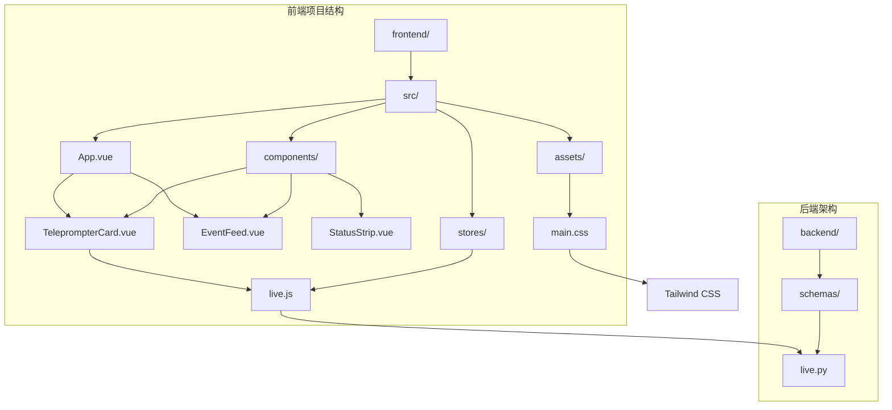
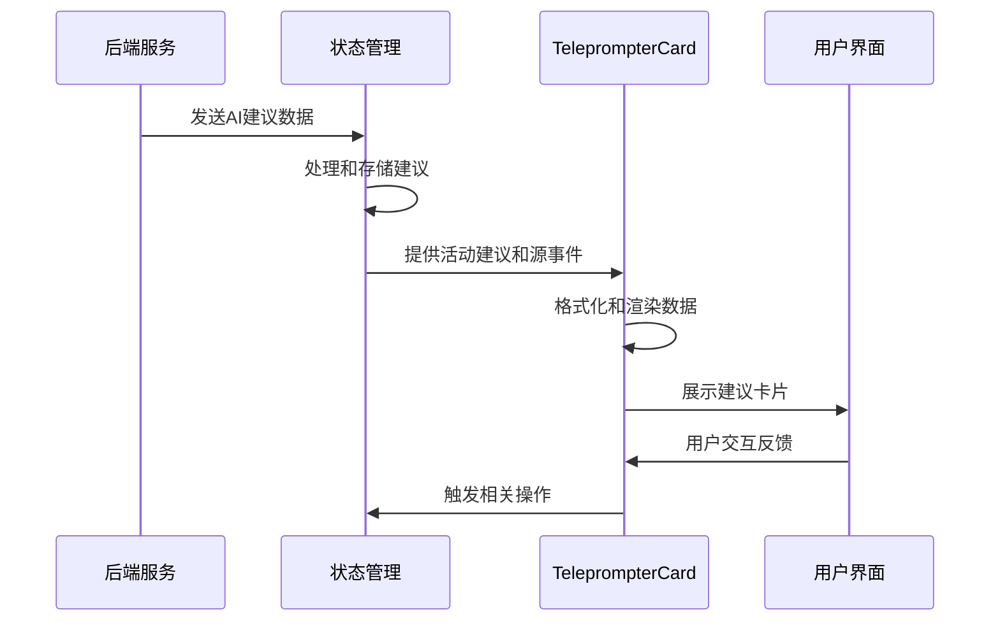
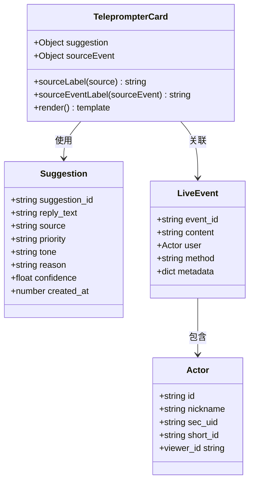
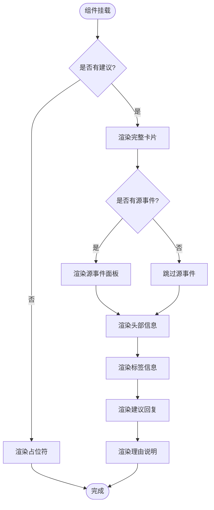
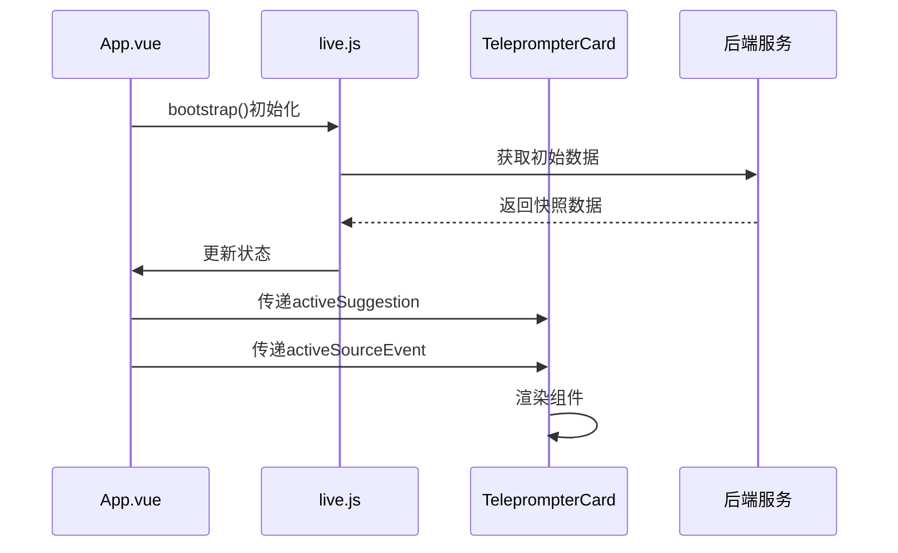
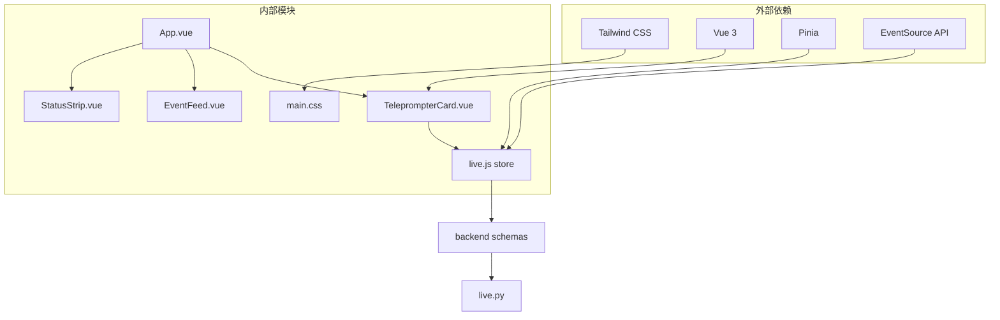

# TeleprompterCard提词卡片组件

<cite>
**本文档引用的文件**
- [TeleprompterCard.vue](file://frontend/src/components/TeleprompterCard.vue)
- [live.js](file://frontend/src/stores/live.js)
- [live.py](file://backend/schemas/live.py)
- [main.css](file://frontend/src/assets/main.css)
- [App.vue](file://frontend/src/App.vue)
- [EventFeed.vue](file://frontend/src/components/EventFeed.vue)
- [StatusStrip.vue](file://frontend/src/components/StatusStrip.vue)
- [tailwind.config.js](file://frontend/tailwind.config.js)
</cite>

## 目录
1. [简介](#简介)
2. [项目结构](#项目结构)
3. [核心组件](#核心组件)
4. [架构概览](#架构概览)
5. [详细组件分析](#详细组件分析)
6. [依赖关系分析](#依赖关系分析)
7. [性能考虑](#性能考虑)
8. [故障排除指南](#故障排除指南)
9. [结论](#结论)

## 简介

TeleprompterCard是一个专门用于展示AI建议回复的Vue 3组件，该组件在直播场景中为主播提供智能回复建议。该组件通过接收来自后端的AI建议数据，将其格式化为易于阅读的卡片式界面，并提供完整的视觉设计系统和交互功能。

该组件的核心功能包括：
- AI建议内容的优雅渲染
- 建议来源的清晰标识
- 原始事件内容的关联展示
- 多主题支持（深色/浅色模式）
- 响应式布局设计

## 项目结构

TeleprompterCard组件位于前端项目的组件目录中，与状态管理、样式系统和其他UI组件协同工作。

**图表来源**
- [TeleprompterCard.vue:1-83](file://frontend/src/components/TeleprompterCard.vue#L1-L83)
- [live.js:1-310](file://frontend/src/stores/live.js#L1-L310)
- [live.py:1-95](file://backend/schemas/live.py#L1-L95)

**章节来源**
- [TeleprompterCard.vue:1-83](file://frontend/src/components/TeleprompterCard.vue#L1-L83)
- [App.vue:1-66](file://frontend/src/App.vue#L1-L66)

## 核心组件

TeleprompterCard组件采用Vue 3 Composition API编写，具有以下核心特性：

### 组件属性定义

组件接收两个主要属性：
- `suggestion`: AI建议对象，包含建议文本、来源、优先级等信息
- `sourceEvent`: 源事件对象，提供建议生成的上下文背景

### 数据模型结构

建议对象包含以下关键字段：
- `suggestion_id`: 建议唯一标识符
- `reply_text`: AI生成的建议回复文本
- `source`: 建议来源类型（模型/规则）
- `priority`: 建议优先级
- `tone`: 建议语气
- `reason`: 建议生成原因
- `confidence`: 建议置信度
- `created_at`: 创建时间戳

**章节来源**
- [TeleprompterCard.vue:2-11](file://frontend/src/components/TeleprompterCard.vue#L2-L11)
- [live.py:47-62](file://backend/schemas/live.py#L47-L62)

## 架构概览

TeleprompterCard组件在整个应用架构中扮演着关键角色，连接着数据层、状态管理和UI展示层。

**图表来源**
- [live.js:169-171](file://frontend/src/stores/live.js#L169-L171)
- [live.js:92-104](file://frontend/src/stores/live.js#L92-L104)
- [TeleprompterCard.vue:53-81](file://frontend/src/components/TeleprompterCard.vue#L53-L81)

### 数据流架构

组件的数据流遵循单向数据流原则：

1. **数据获取**: 通过EventSource实时接收后端推送
2. **数据处理**: 在Pinia store中进行数据规范化和缓存
3. **数据传递**: 通过props向下传递给组件
4. **数据渲染**: 组件根据数据类型进行条件渲染

**章节来源**
- [live.js:173-205](file://frontend/src/stores/live.js#L173-L205)
- [live.js:165-171](file://frontend/src/stores/live.js#L165-L171)

## 详细组件分析

### 组件结构设计

TeleprompterCard采用卡片式设计，具有清晰的信息层次结构：

**图表来源**
- [TeleprompterCard.vue:1-32](file://frontend/src/components/TeleprompterCard.vue#L1-L32)
- [live.py:47-62](file://backend/schemas/live.py#L47-L62)
- [live.py:29-45](file://backend/schemas/live.py#L29-L45)
- [live.py:8-27](file://backend/schemas/live.py#L8-L27)

### 视觉设计系统

组件采用基于CSS变量的主题系统，支持深色和浅色两种模式：

#### 颜色方案

深色主题（默认）：
- 主色调：#D7FF64（绿色）
- 背景渐变：从#181B15到#10120F
- 文本颜色：#F6F2E9
- 强调色：#C7EA63

浅色主题：
- 主色调：#F0D88A（浅黄色）
- 背景渐变：从#5D544A到#494137
- 文本颜色：#FAF7F0
- 强调色：#F4E3AD

#### 字体系统

- 显示字体：IBM Plex Sans, Noto Sans SC, sans-serif
- 字体大小：标题4xl-6xl，正文sm-base
- 字体权重：标题semibold，正文medium

#### 布局结构

组件采用响应式网格布局：
- 卡片圆角：36px（shell）和30px（panel/reply）
- 内边距：8-10单位
- 间距：6-10单位
- 最大宽度：3xl（约48rem）

**章节来源**
- [main.css:5-64](file://frontend/src/assets/main.css#L5-L64)
- [main.css:105-144](file://frontend/src/assets/main.css#L105-L144)
- [tailwind.config.js:4-19](file://frontend/tailwind.config.js#L4-L19)

### 渲染逻辑分析

组件实现了条件渲染和数据格式化逻辑：

**图表来源**
- [TeleprompterCard.vue:43-81](file://frontend/src/components/TeleprompterCard.vue#L43-L81)

### 交互功能集成

组件通过父组件与全局状态管理器集成：

#### 状态管理集成

**图表来源**
- [App.vue:29-32](file://frontend/src/App.vue#L29-L32)
- [live.js:129-135](file://frontend/src/stores/live.js#L129-L135)
- [live.js:92-104](file://frontend/src/stores/live.js#L92-L104)

#### 数据处理流程

组件内部的数据处理逻辑：

1. **建议来源映射**：将内部来源代码转换为用户友好的标签
2. **源事件内容提取**：从不同类型的事件中提取可显示的内容
3. **条件渲染**：根据数据可用性动态调整界面布局

**章节来源**
- [TeleprompterCard.vue:13-31](file://frontend/src/components/TeleprompterCard.vue#L13-L31)
- [live.js:92-104](file://frontend/src/stores/live.js#L92-L104)

## 依赖关系分析

TeleprompterCard组件与其他系统组件的依赖关系如下：

**图表来源**
- [TeleprompterCard.vue:1-11](file://frontend/src/components/TeleprompterCard.vue#L1-L11)
- [live.js:1-3](file://frontend/src/stores/live.js#L1-L3)
- [main.css:1-3](file://frontend/src/assets/main.css#L1-L3)
- [App.vue:1-8](file://frontend/src/App.vue#L1-L8)

### 组件耦合度分析

- **低耦合高内聚**：组件专注于单一职责（AI建议展示）
- **单向数据流**：通过props接收数据，避免直接访问全局状态
- **松散耦合**：与状态管理器通过事件通信而非直接引用

**章节来源**
- [TeleprompterCard.vue:1-32](file://frontend/src/components/TeleprompterCard.vue#L1-L32)
- [live.js:281-309](file://frontend/src/stores/live.js#L281-L309)

## 性能考虑

### 渲染优化

1. **条件渲染**：仅在有数据时渲染完整内容
2. **计算属性**：使用computed属性优化依赖追踪
3. **虚拟滚动**：大量事件时考虑实现虚拟滚动

### 内存管理

1. **数据限制**：限制事件和建议的最大数量（30和12）
2. **自动清理**：超出限制时自动移除旧数据
3. **内存泄漏防护**：正确关闭EventSource连接

### 网络优化

1. **SSE连接复用**：单个连接同时传输多种数据类型
2. **增量更新**：只更新变化的数据
3. **错误重连**：自动处理网络中断

**章节来源**
- [live.js:4-5](file://frontend/src/stores/live.js#L4-L5)
- [live.js:165-171](file://frontend/src/stores/live.js#L165-L171)
- [live.js:173-205](file://frontend/src/stores/live.js#L173-L205)

## 故障排除指南

### 常见问题及解决方案

#### 1. 建议数据不显示

**症状**：组件显示"等待新的弹幕与建议..."

**可能原因**：
- 后端服务未启动或不可达
- EventSource连接失败
- 数据格式不符合预期

**解决步骤**：
1. 检查后端服务状态
2. 查看浏览器控制台的网络错误
3. 验证数据格式是否符合Suggestion模型

#### 2. 主题切换无效

**症状**：切换主题后界面颜色不变

**可能原因**：
- localStorage访问受限
- CSS变量未正确应用

**解决步骤**：
1. 检查浏览器localStorage设置
2. 验证CSS变量定义
3. 刷新页面重新应用主题

#### 3. 源事件内容为空

**症状**：源事件面板不显示内容

**可能原因**：
- 源事件对象缺少必要字段
- 事件类型不支持内容提取

**解决步骤**：
1. 检查源事件数据结构
2. 验证事件类型映射
3. 添加适当的默认值处理

**章节来源**
- [TeleprompterCard.vue:75-81](file://frontend/src/components/TeleprompterCard.vue#L75-L81)
- [live.js:54-60](file://frontend/src/stores/live.js#L54-L60)
- [TeleprompterCard.vue:25-31](file://frontend/src/components/TeleprompterCard.vue#L25-L31)

## 结论

TeleprompterCard组件是一个设计精良的Vue 3组件，成功地将复杂的AI建议数据转化为直观易用的用户界面。该组件的主要优势包括：

### 设计优势

1. **清晰的信息层次**：通过卡片式布局和颜色编码有效组织信息
2. **响应式设计**：适配不同屏幕尺寸和设备
3. **主题系统**：支持深色和浅色两种模式
4. **语义化HTML**：良好的可访问性和SEO友好性

### 技术优势

1. **模块化设计**：低耦合高内聚，易于维护和扩展
2. **类型安全**：使用TypeScript确保数据完整性
3. **性能优化**：合理的渲染策略和内存管理
4. **错误处理**：完善的异常处理和降级策略

### 扩展建议

1. **国际化支持**：添加多语言支持
2. **键盘导航**：增强可访问性
3. **动画效果**：添加平滑的过渡动画
4. **自定义样式**：允许主题定制

该组件为直播场景中的AI助手提供了优秀的用户界面基础，为后续的功能扩展和定制开发奠定了坚实的基础。