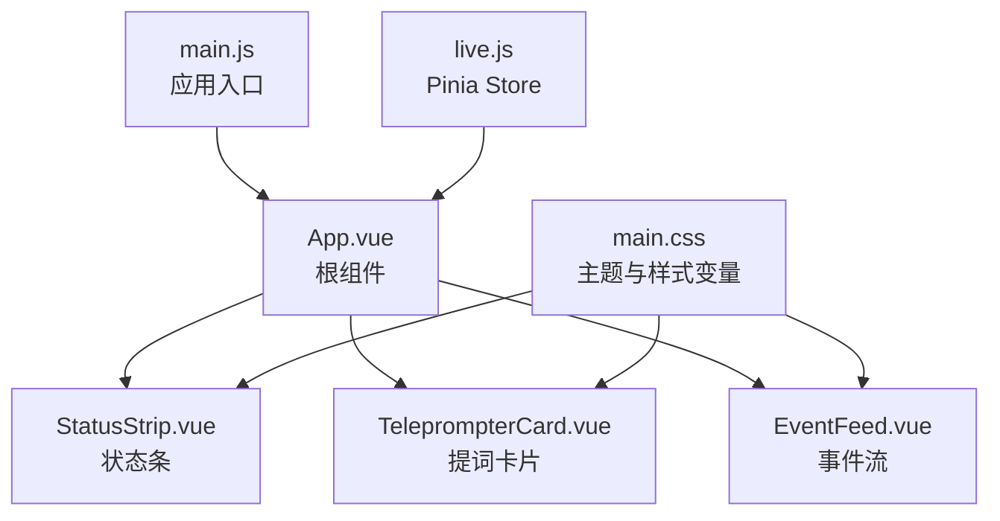
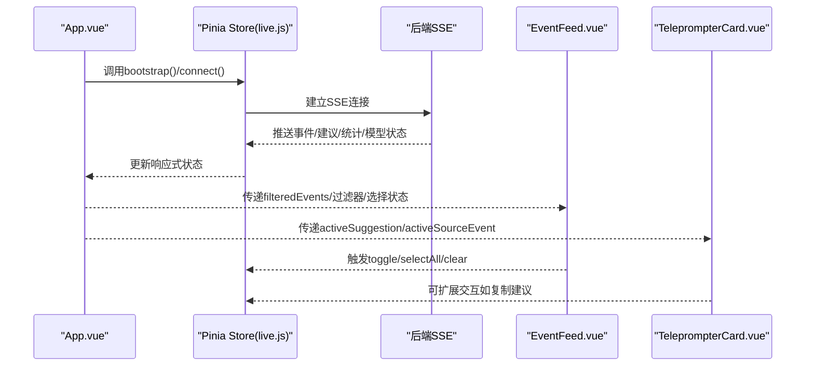
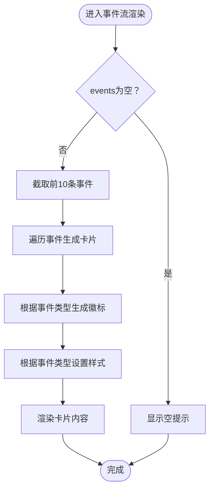
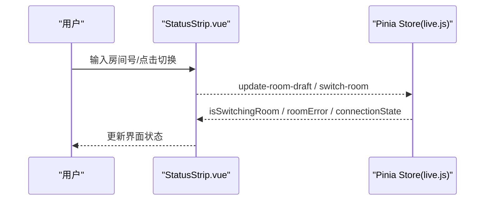
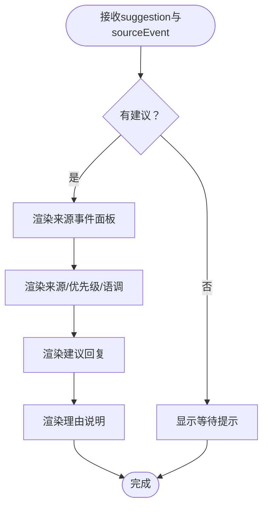
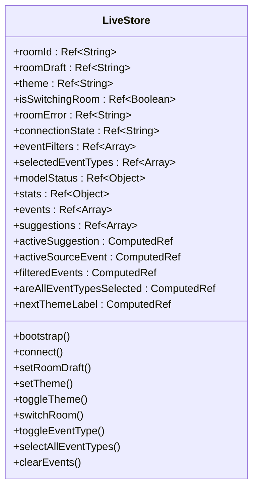
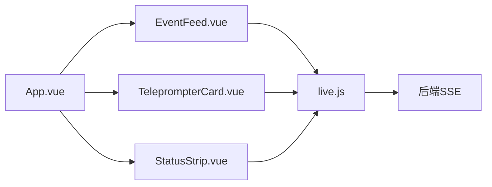

# 组件系统

<cite>
**本文引用的文件**
- [EventFeed.vue](file://frontend/src/components/EventFeed.vue)
- [StatusStrip.vue](file://frontend/src/components/StatusStrip.vue)
- [TeleprompterCard.vue](file://frontend/src/components/TeleprompterCard.vue)
- [live.js](file://frontend/src/stores/live.js)
- [App.vue](file://frontend/src/App.vue)
- [main.js](file://frontend/src/main.js)
- [main.css](file://frontend/src/assets/main.css)
- [package.json](file://frontend/package.json)
</cite>

## 目录
1. [简介](#简介)
2. [项目结构](#项目结构)
3. [核心组件](#核心组件)
4. [架构总览](#架构总览)
5. [详细组件分析](#详细组件分析)
6. [依赖关系分析](#依赖关系分析)
7. [性能考量](#性能考量)
8. [故障排查指南](#故障排查指南)
9. [结论](#结论)
10. [附录](#附录)

## 简介
本文件系统化梳理前端组件系统，聚焦三个核心Vue组件：EventFeed事件流组件、StatusStrip状态条组件、TeleprompterCard提词卡片组件。文档从架构设计、数据流、组件间通信、样式体系、可复用性与扩展性等维度进行深入解析，并提供可视化图示与实践建议，帮助开发者快速理解与定制组件。

## 项目结构
前端采用Vue 3 + Pinia + Vite + TailwindCSS技术栈，组件位于src/components目录，状态集中于Pinia store，应用入口在src/main.js，全局样式在src/assets/main.css中通过CSS变量实现主题切换。

图表来源
- [main.js:1-17](file://frontend/src/main.js#L1-L17)
- [App.vue:1-66](file://frontend/src/App.vue#L1-L66)
- [live.js:1-310](file://frontend/src/stores/live.js#L1-L310)
- [main.css:1-144](file://frontend/src/assets/main.css#L1-L144)

章节来源
- [main.js:1-17](file://frontend/src/main.js#L1-L17)
- [package.json:1-23](file://frontend/package.json#L1-L23)

## 核心组件
- EventFeed事件流组件：负责实时展示直播事件，支持事件类型过滤、全选/清空操作、滚动控制与交互反馈。
- StatusStrip状态条组件：展示房间号、连接状态、模型状态、统计数据，并提供房间切换、主题切换等交互。
- TeleprompterCard提词卡片组件：展示AI建议与来源上下文，包含来源标签、优先级、语调、建议回复与理由说明。

章节来源
- [EventFeed.vue:1-183](file://frontend/src/components/EventFeed.vue#L1-L183)
- [StatusStrip.vue:1-144](file://frontend/src/components/StatusStrip.vue#L1-L144)
- [TeleprompterCard.vue:1-83](file://frontend/src/components/TeleprompterCard.vue#L1-L83)

## 架构总览
组件系统以Pinia store为中心，承载房间状态、SSE连接、事件队列与建议队列。App.vue作为根容器，将store中的响应式数据与事件分发给子组件。EventFeed与TeleprompterCard分别消费filteredEvents与activeSuggestion/activeSourceEvent，形成“状态驱动视图”的单向数据流。

图表来源
- [App.vue:29-32](file://frontend/src/App.vue#L29-L32)
- [live.js:158-205](file://frontend/src/stores/live.js#L158-L205)
- [EventFeed.vue:21](file://frontend/src/components/EventFeed.vue#L21)
- [TeleprompterCard.vue:1-83](file://frontend/src/components/TeleprompterCard.vue#L1-L83)

## 详细组件分析

### EventFeed组件
- 设计目标：以卡片形式展示直播事件，支持按事件类型过滤、全选/清空、滚动查看。
- 关键props
  - events: Array，事件数组（已按筛选后的结果传入）
  - eventFilters: Array，可用事件类型过滤项
  - selectedEventTypes: Array，当前选中的事件类型集合
  - areAllEventTypesSelected: Boolean，是否全选
- 关键事件
  - toggle-filter(eventType): 切换某事件类型的显示
  - select-all-filters(): 全选事件类型
  - clear-events(): 清空事件列表
- 样式与交互
  - 使用颜色区分不同事件类型，提供视觉反馈
  - 支持禁用态（如仅剩一个类型时锁定）
  - 滚动区域限制高度，避免溢出
- 处理逻辑
  - badge(eventType): 将事件类型映射为中文标签
  - primaryContent(event): 提取事件主要内容（优先content，其次gift_name，最后method）
  - eventCardStyle(eventType): 为不同事件类型返回边框与背景色
  - isSelected/isLockedSelected: 控制按钮状态与禁用逻辑

图表来源
- [EventFeed.vue:141-181](file://frontend/src/components/EventFeed.vue#L141-L181)
- [EventFeed.vue:23-85](file://frontend/src/components/EventFeed.vue#L23-L85)

章节来源
- [EventFeed.vue:1-183](file://frontend/src/components/EventFeed.vue#L1-L183)

### StatusStrip组件
- 设计目标：集中展示房间号、连接状态、模型状态、统计数据，并提供房间切换与主题切换能力。
- 关键props
  - roomId: String，当前房间号
  - roomDraft: String，输入框中的房间号草稿
  - theme: String，当前主题（dark/light）
  - nextThemeLabel: String，切换主题的提示文本
  - isSwitchingRoom: Boolean，切换房间中状态
  - roomError: String，房间切换错误信息
  - connectionState: String，连接状态
  - modelStatus: Object，模型状态对象
  - stats: Object，统计数据对象
- 关键事件
  - update-room-draft(value): 输入框值变更
  - switch-room(): 切换房间
  - toggle-theme(): 切换主题
- 交互细节
  - 主题切换按钮根据当前主题显示不同图标
  - 房间号输入框支持回车触发切换
  - 切换房间时禁用按钮并显示“切换中”状态

图表来源
- [StatusStrip.vue:48-116](file://frontend/src/components/StatusStrip.vue#L48-L116)
- [StatusStrip.vue:41](file://frontend/src/components/StatusStrip.vue#L41)
- [live.js:207-250](file://frontend/src/stores/live.js#L207-L250)

章节来源
- [StatusStrip.vue:1-144](file://frontend/src/components/StatusStrip.vue#L1-L144)

### TeleprompterCard组件
- 设计目标：展示AI建议及其来源上下文，突出建议回复与来源标签，便于主播快速参考。
- 关键props
  - suggestion: Object，当前建议对象（含source/priority/tone/reply_text/reason）
  - sourceEvent: Object，建议来源的事件上下文
- 关键方法
  - sourceLabel(source): 将来源映射为中文标签
  - sourceEventLabel(sourceEvent): 从事件中提取可读内容
- 结构要点
  - 来源面板：展示原始事件的用户昵称与内容
  - 来源标签：显示来源、优先级、语调
  - 建议回复：大字号展示，强调主视觉
  - 理由说明：简要解释建议依据

图表来源
- [TeleprompterCard.vue:43-81](file://frontend/src/components/TeleprompterCard.vue#L43-L81)
- [TeleprompterCard.vue:13-31](file://frontend/src/components/TeleprompterCard.vue#L13-L31)

章节来源
- [TeleprompterCard.vue:1-83](file://frontend/src/components/TeleprompterCard.vue#L1-L83)

### 状态与样式体系
- Pinia Store(live.js)
  - 集中管理：房间号、草稿、主题、连接状态、事件过滤器、选中类型、模型状态、统计数据、事件与建议队列
  - 计算属性：activeSuggestion、activeSourceEvent、areAllEventTypesSelected、filteredEvents、nextThemeLabel
  - 数据持久化：事件类型与主题存储于localStorage
  - SSE集成：connect()建立连接，监听事件、建议、统计与模型状态事件
  - 房间切换：switchRoom()校验输入、调用后端接口、回退与重连
- 样式体系(main.css)
  - 通过CSS变量在:root与[data-theme="dark"/"light"]之间切换主题
  - Teleprompter专用类名(.teleprompter-*)统一风格，确保卡片在深浅主题下一致呈现
  - Tailwind工具类与自定义变量结合，提升可维护性

图表来源
- [live.js:70-309](file://frontend/src/stores/live.js#L70-L309)

章节来源
- [live.js:1-310](file://frontend/src/stores/live.js#L1-L310)
- [main.css:1-144](file://frontend/src/assets/main.css#L1-L144)

## 依赖关系分析
- 组件依赖
  - App.vue依赖三个子组件并通过storeToRefs解构响应式状态
  - EventFeed与TeleprompterCard直接消费store计算属性
  - StatusStrip负责房间切换与主题切换，间接影响其他组件
- 外部依赖
  - Vue 3 + Pinia + Vite + TailwindCSS
  - 浏览器原生EventSource用于SSE
- 数据流向
  - 后端SSE推送事件/建议/统计/模型状态
  - Store更新内部状态并暴露给组件
  - 组件只负责渲染与交互，不直接访问后端

图表来源
- [App.vue:35-65](file://frontend/src/App.vue#L35-L65)
- [live.js:158-205](file://frontend/src/stores/live.js#L158-L205)

章节来源
- [package.json:11-21](file://frontend/package.json#L11-L21)
- [main.js:6-16](file://frontend/src/main.js#L6-L16)

## 性能考量
- 事件与建议队列上限控制：MAX_EVENTS与MAX_SUGGESTIONS限制内存占用，避免无限增长
- 计算属性缓存：filteredEvents、activeSuggestion、activeSourceEvent基于响应式数据派生，减少重复计算
- 滚动区域限制：EventFeed对事件列表设置最大高度，避免长列表导致的重排开销
- 主题切换：通过CSS变量切换，避免DOM重建
- 建议来源查找：使用Set优化多事件ID匹配，降低查找复杂度

章节来源
- [live.js:4-5](file://frontend/src/stores/live.js#L4-L5)
- [live.js:92-111](file://frontend/src/stores/live.js#L92-L111)
- [EventFeed.vue:141-181](file://frontend/src/components/EventFeed.vue#L141-L181)

## 故障排查指南
- 房间切换失败
  - 现象：点击切换房间后出现错误提示
  - 排查：检查switchRoom流程中的错误捕获与回退逻辑，确认后端接口返回
  - 参考路径：[live.js:207-250](file://frontend/src/stores/live.js#L207-L250)
- SSE连接异常
  - 现象：连接状态变为reconnecting或无事件更新
  - 排查：检查connect()中的onerror与addEventListener回调，确认后端SSE可用
  - 参考路径：[live.js:173-205](file://frontend/src/stores/live.js#L173-L205)
- 事件类型过滤无效
  - 现象：切换过滤器后事件未变化
  - 排查：确认filteredEvents计算属性与selectedEventTypes同步，以及toggleEventType逻辑
  - 参考路径：[live.js:252-268](file://frontend/src/stores/live.js#L252-L268)
- 主题切换不生效
  - 现象：切换主题后界面未变化
  - 排查：确认applyTheme与localStorage写入，以及main.css中的主题变量
  - 参考路径：[live.js:62-68](file://frontend/src/stores/live.js#L62-L68)，[main.css:5-64](file://frontend/src/assets/main.css#L5-L64)

章节来源
- [live.js:137-142](file://frontend/src/stores/live.js#L137-L142)
- [live.js:186-188](file://frontend/src/stores/live.js#L186-L188)
- [live.js:243-247](file://frontend/src/stores/live.js#L243-L247)

## 结论
该组件系统以Pinia为核心，实现状态集中管理与组件解耦，配合TailwindCSS与CSS变量构建可维护的主题体系。EventFeed、StatusStrip、TeleprompterCard各司其职，通过props与事件实现清晰的父子通信，满足直播场景下的实时展示与交互需求。建议在后续迭代中进一步抽象通用交互行为与样式变量，增强可复用性与可扩展性。

## 附录
- 组件通信模式
  - 父子通信：App.vue通过props向下传递状态，通过事件向上接收交互
  - 兄弟协作：通过store共享状态，避免跨层级传递
  - 跨组件状态共享：Pinia store提供全局状态访问
- 可复用性与扩展性建议
  - 抽象事件类型与样式映射，便于新增事件类型
  - 将主题变量与样式常量抽取为配置模块
  - 为组件增加默认插槽与可选区域，支持灵活布局
  - 为交互事件添加参数化回调，便于上层业务接入