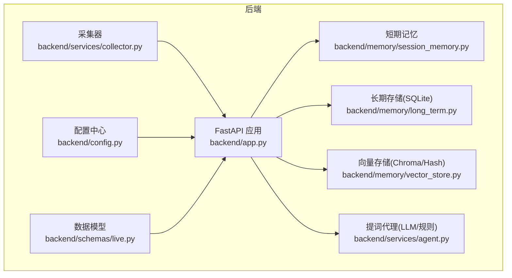
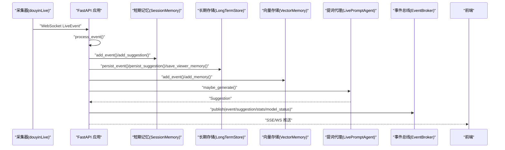
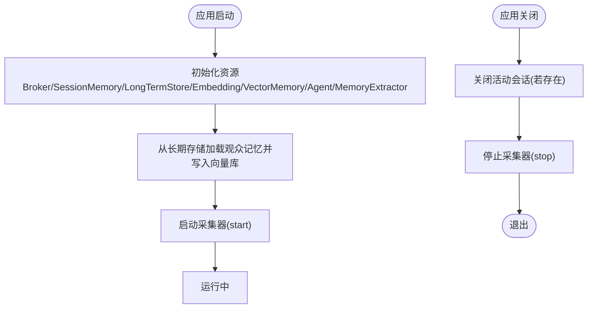
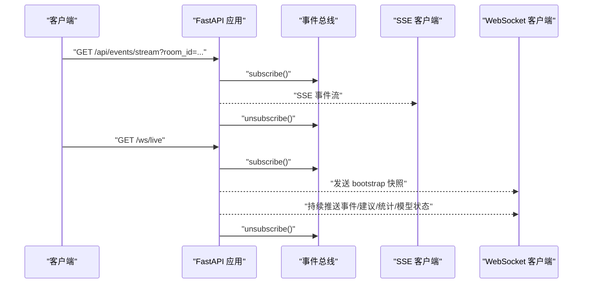
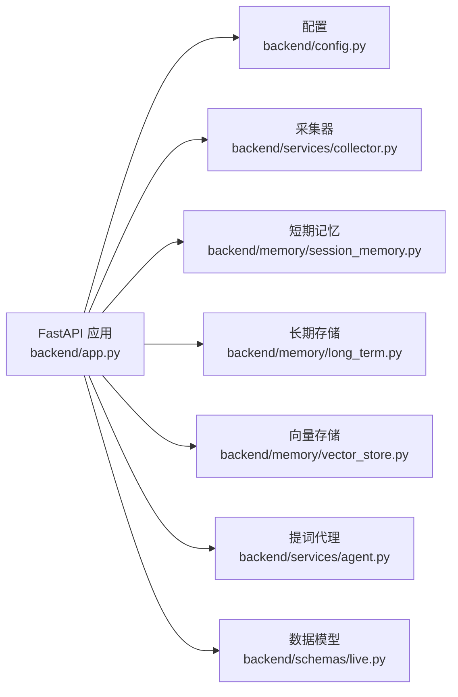
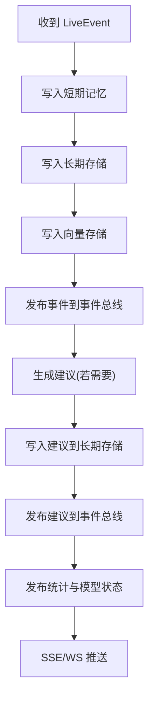

# FastAPI应用

<cite>
**本文引用的文件**
- [backend/app.py](file://backend/app.py)
- [backend/config.py](file://backend/config.py)
- [backend/schemas/live.py](file://backend/schemas/live.py)
- [backend/services/collector.py](file://backend/services/collector.py)
- [backend/memory/session_memory.py](file://backend/memory/session_memory.py)
- [backend/memory/long_term.py](file://backend/memory/long_term.py)
- [backend/memory/vector_store.py](file://backend/memory/vector_store.py)
- [backend/services/agent.py](file://backend/services/agent.py)
- [README.md](file://README.md)
- [USAGE.md](file://USAGE.md)
- [requirements.txt](file://requirements.txt)
</cite>

## 目录
1. [简介](#简介)
2. [项目结构](#项目结构)
3. [核心组件](#核心组件)
4. [架构总览](#架构总览)
5. [详细组件分析](#详细组件分析)
6. [依赖分析](#依赖分析)
7. [性能考量](#性能考量)
8. [故障排查指南](#故障排查指南)
9. [结论](#结论)
10. [附录](#附录)

## 简介
本文件为 DouYin_llm 项目的 FastAPI 应用技术文档，聚焦于应用入口点的实现细节，包括生命周期管理（lifespan）、中间件配置（尤其是 CORS）、路由定义与实时推送机制。文档还提供扩展指引（新增路由、中间件、配置行为）与性能优化建议，帮助开发者在现有基础上进行二次开发与生产部署。

## 项目结构
后端采用 FastAPI 作为入口，围绕“采集-事件归一化-短期/长期记忆-向量检索-LLM/规则生成-实时推送”的数据流组织模块：
- 应用入口与路由：backend/app.py
- 配置中心：backend/config.py
- 数据模型：backend/schemas/live.py
- 采集器：backend/services/collector.py
- 记忆层：backend/memory/session_memory.py、backend/memory/long_term.py、backend/memory/vector_store.py
- 提词代理：backend/services/agent.py

图表来源
- [backend/app.py:108-126](file://backend/app.py#L108-L126)
- [backend/config.py:40-113](file://backend/config.py#L40-L113)
- [backend/services/collector.py:38-100](file://backend/services/collector.py#L38-L100)
- [backend/memory/session_memory.py:17-113](file://backend/memory/session_memory.py#L17-L113)
- [backend/memory/long_term.py:44-200](file://backend/memory/long_term.py#L44-L200)
- [backend/memory/vector_store.py:59-200](file://backend/memory/vector_store.py#L59-L200)
- [backend/services/agent.py:23-200](file://backend/services/agent.py#L23-L200)

章节来源
- [README.md:32-44](file://README.md#L32-L44)
- [backend/app.py:108-126](file://backend/app.py#L108-L126)

## 核心组件
- 应用实例与生命周期
  - 应用实例在入口处创建，配置标题、版本与 lifespan 回调。
  - lifespan 在启动时启动采集器，在关闭时清理活动会话并停止采集器。
- 中间件
  - CORS 中间件允许任意来源、方法与头，凭据可携带。
- 路由
  - 健康检查、房间切换、事件注入、观众详情/记忆/笔记、LLM 设置、会话查询、SSE 与 WebSocket 实时流等。
- 事件处理管线
  - 采集器将原始消息标准化为 LiveEvent，交由 FastAPI 事件循环异步处理。
  - 处理流程写入短期/长期记忆、向量库，生成建议并通过 Broker 广播。

章节来源
- [backend/app.py:108-126](file://backend/app.py#L108-L126)
- [backend/app.py:129-285](file://backend/app.py#L129-L285)
- [backend/services/collector.py:61-99](file://backend/services/collector.py#L61-L99)

## 架构总览
下图展示了从采集器到前端的端到端数据流，以及 FastAPI 在其中的角色与职责。

图表来源
- [backend/app.py:73-102](file://backend/app.py#L73-L102)
- [backend/services/collector.py:145-159](file://backend/services/collector.py#L145-L159)
- [backend/memory/session_memory.py:42-64](file://backend/memory/session_memory.py#L42-L64)
- [backend/memory/long_term.py:44-200](file://backend/memory/long_term.py#L44-L200)
- [backend/memory/vector_store.py:149-171](file://backend/memory/vector_store.py#L149-L171)
- [backend/services/agent.py:105-142](file://backend/services/agent.py#L105-L142)

## 详细组件分析

### 应用入口与生命周期管理（lifespan）
- 生命周期钩子
  - 启动：启动采集器并传入当前事件循环。
  - 关闭：若存在当前房间，关闭活动会话；停止采集器。
- 初始化资源
  - 创建事件总线、短期/长期记忆、向量存储、提词代理与记忆抽取器。
  - 将长期存储中的观众记忆批量导入向量库，建立初始语义索引。
- 日志与目录
  - 初始化日志格式；确保数据目录、数据库与向量存储目录存在。

图表来源
- [backend/app.py:24-36](file://backend/app.py#L24-L36)
- [backend/app.py:108-117](file://backend/app.py#L108-L117)
- [backend/services/collector.py:61-79](file://backend/services/collector.py#L61-L79)

章节来源
- [backend/app.py:108-117](file://backend/app.py#L108-L117)
- [backend/app.py:24-36](file://backend/app.py#L24-L36)

### CORS 中间件与跨域策略
- 配置要点
  - 允许任意来源、方法与头，支持凭据。
- 影响范围
  - 适用于所有路由，包括 SSE 与 WebSocket。
- 安全建议
  - 生产环境建议限定来源、方法与头，避免使用通配符。

章节来源
- [backend/app.py:119-126](file://backend/app.py#L119-L126)

### 路由定义与实时推送
- 健康检查
  - 返回运行状态、当前房间与活动会话信息。
- 房间切换
  - 切换房间时关闭旧会话并通知采集器。
- 事件注入
  - 手动注入 LiveEvent，用于联调/回放。
- 观众数据
  - 查询观众画像、记忆与笔记；支持增删改。
- LLM 设置
  - 获取/保存当前模型与系统提示词。
- 会话查询
  - 列表与当前会话查询。
- 实时推送
  - SSE：/api/events/stream，支持按房间过滤。
  - WebSocket：/ws/live，先下发 bootstrap 快照。

图表来源
- [backend/app.py:252-271](file://backend/app.py#L252-L271)
- [backend/app.py:274-285](file://backend/app.py#L274-L285)

章节来源
- [backend/app.py:129-285](file://backend/app.py#L129-L285)

### 数据模型与事件处理
- 数据模型
  - Actor、LiveEvent、Suggestion、ViewerMemory、SessionStats、ModelStatus、SessionSnapshot。
- 事件处理
  - 写入短期/长期记忆与向量库，发布事件、建议、统计与模型状态，必要时生成建议并持久化。

章节来源
- [backend/schemas/live.py:8-111](file://backend/schemas/live.py#L8-L111)
- [backend/app.py:73-102](file://backend/app.py#L73-L102)

### 记忆与检索
- 短期记忆（SessionMemory）
  - 优先使用 Redis；否则使用进程内队列，保证本地可用性。
- 长期存储（LongTermStore）
  - SQLite 表结构覆盖事件、建议、观众画像、礼物、会话、笔记、记忆与应用设置。
- 向量存储（VectorMemory）
  - 基于 Chroma 的持久化集合；无依赖时使用哈希嵌入函数作为回退。
  - 提供事件与观众记忆的相似检索，支持按房间过滤与阈值控制。

章节来源
- [backend/memory/session_memory.py:17-113](file://backend/memory/session_memory.py#L17-L113)
- [backend/memory/long_term.py:44-200](file://backend/memory/long_term.py#L44-L200)
- [backend/memory/vector_store.py:59-200](file://backend/memory/vector_store.py#L59-L200)

### 提词代理与模型状态
- 提词代理（LivePromptAgent）
  - 根据事件类型与上下文决定是否走 LLM；失败或命中关键词时回退规则。
  - 维护模型状态（模式、模型名、后端、结果、错误、更新时间）。
- 模型设置
  - 从长期存储读取或使用默认值；支持动态更新。

章节来源
- [backend/services/agent.py:23-200](file://backend/services/agent.py#L23-L200)
- [backend/app.py:60-70](file://backend/app.py#L60-L70)

## 依赖分析
- 运行时依赖
  - FastAPI、Uvicorn、WebSocket 客户端、Redis、ChromaDB。
- 模块耦合
  - app.py 依赖配置、记忆层、向量存储、代理与采集器；各模块职责清晰，耦合度适中。
- 外部集成
  - 采集器通过本地 WebSocket 接入；向量存储可选；Redis 可选；模型后端可为 Qwen/OpenAI 兼容。

图表来源
- [backend/app.py:13-22](file://backend/app.py#L13-L22)
- [requirements.txt:1-6](file://requirements.txt#L1-L6)

章节来源
- [requirements.txt:1-6](file://requirements.txt#L1-L6)
- [backend/app.py:13-22](file://backend/app.py#L13-L22)

## 性能考量
- 事件处理
  - 异步处理与线程安全：采集器通过线程运行 WebSocket，使用 run_coroutine_threadsafe 将事件提交到 FastAPI 事件循环，避免阻塞网络 I/O。
  - 批量写入：向量存储与短期记忆在写入时进行去重与裁剪，减少冗余。
- 存储选择
  - Redis：适合跨进程共享短期记忆，具备 TTL 控制；无 Redis 时自动降级为进程内队列。
  - Chroma：适合大规模语义检索；无依赖时使用哈希嵌入函数作为回退。
- 模型调用
  - 优先使用 Qwen/OpenAI 兼容接口；失败时回退规则，降低端到端延迟。
- 实时推送
  - SSE/WS 使用订阅-发布模式，按房间过滤，避免不必要的广播。
- 建议
  - 生产环境启用 Redis 与 Chroma，合理设置 TTL 与查询阈值。
  - 对高频接口增加缓存与限流策略（可在 FastAPI 中扩展）。
  - 监控模型调用耗时与错误率，结合日志与指标系统。

章节来源
- [backend/services/collector.py:182-189](file://backend/services/collector.py#L182-L189)
- [backend/memory/session_memory.py:42-64](file://backend/memory/session_memory.py#L42-L64)
- [backend/memory/vector_store.py:149-171](file://backend/memory/vector_store.py#L149-L171)
- [backend/services/agent.py:105-142](file://backend/services/agent.py#L105-L142)

## 故障排查指南
- 启动与连接
  - 确认采集器已启动且房间 ID 正确；查看后端日志中 WebSocket 连接信息。
  - 检查 .env 配置（房间 ID、模型密钥、端口等）。
- 数据写入
  - 若无数据写入，检查采集器是否正常连接、直播是否开播、事件是否可解析。
- 模型状态
  - “fallback”表示模型调用失败，检查密钥、网络与超时设置；“heuristic”表示仅使用规则。
- 实时流
  - SSE/WS 无法接收：确认订阅逻辑与房间过滤条件；检查事件总线是否正常发布。
- 常见问题
  - 页面无建议：检查采集器、房间 ID、直播状态与后端版本。
  - 端口占用：前端默认 5173，后端默认 8010。

章节来源
- [USAGE.md:198-256](file://USAGE.md#L198-L256)
- [README.md:143-166](file://README.md#L143-L166)

## 结论
该 FastAPI 应用以清晰的模块划分与生命周期管理为基础，结合短期/长期记忆与向量检索，实现了从直播事件采集到实时提词建议的完整链路。CORS 中间件简化了跨域访问，SSE/WS 提供低延迟的前端推送。通过合理的依赖选择与性能优化建议，可在本地开发与生产环境中稳定运行，并为进一步扩展（如鉴权、多房间、可观测性）奠定基础。

## 附录

### 扩展指引：新增路由
- 新增 GET/POST/DELETE 等路由时，遵循现有模式：
  - 定义 Pydantic 模型（参考数据模型）。
  - 在应用中注册路由，处理请求参数与返回值。
  - 如需实时推送，使用事件总线发布并由 SSE/WS 广播。
- 示例路径参考
  - [新增路由模板:129-166](file://backend/app.py#L129-L166)

章节来源
- [backend/app.py:129-166](file://backend/app.py#L129-L166)

### 扩展指引：新增中间件
- 在应用创建后、路由注册前添加中间件：
  - 例如添加自定义中间件或调整 CORS 策略。
- 示例路径参考
  - [中间件注册位置:119-126](file://backend/app.py#L119-L126)

章节来源
- [backend/app.py:119-126](file://backend/app.py#L119-L126)

### 扩展指引：配置应用行为
- 修改配置项（如端口、房间 ID、模型参数、嵌入与检索阈值）：
  - 通过 .env 文件或环境变量覆盖默认值。
- 示例路径参考
  - [配置类与默认值:40-113](file://backend/config.py#L40-L113)

章节来源
- [backend/config.py:40-113](file://backend/config.py#L40-L113)

### 关键流程图：事件处理与推送

图表来源
- [backend/app.py:73-102](file://backend/app.py#L73-L102)
- [backend/app.py:252-285](file://backend/app.py#L252-L285)