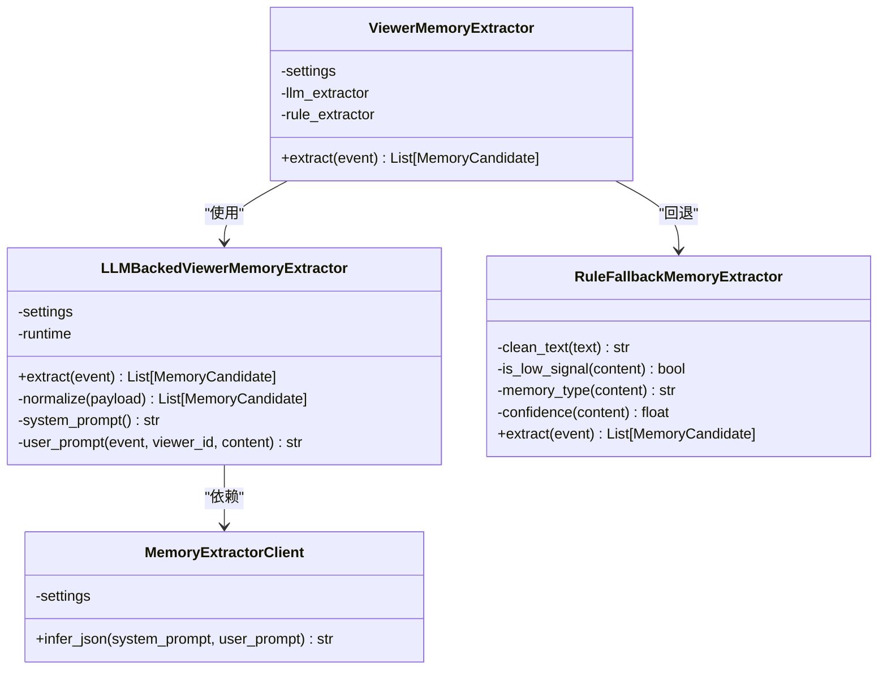
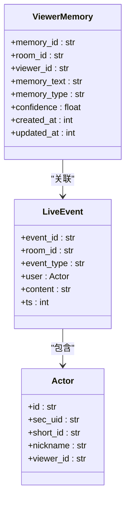
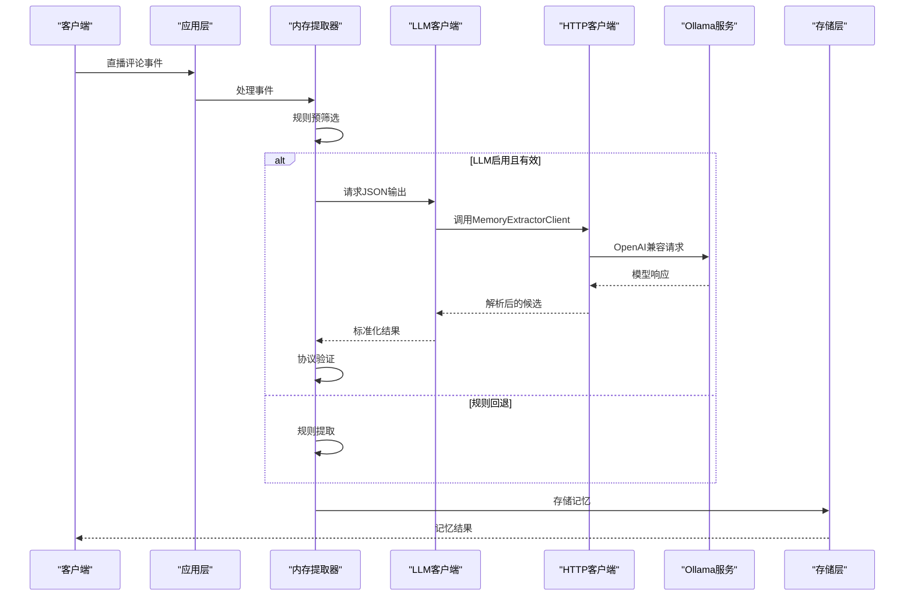
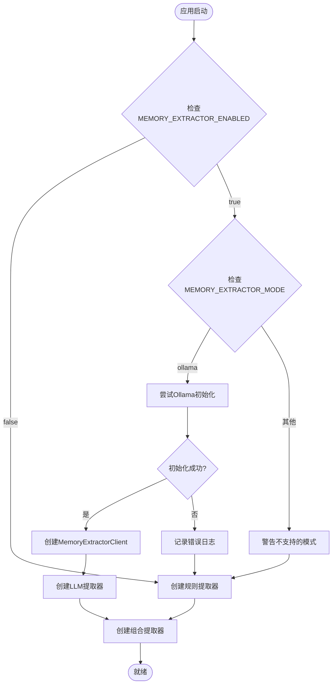
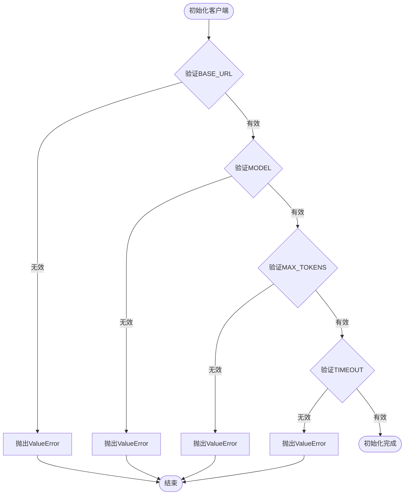
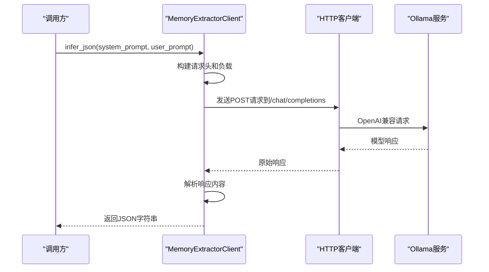
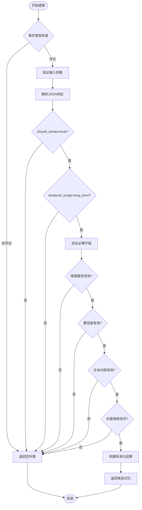
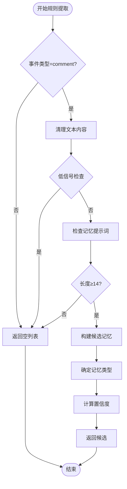
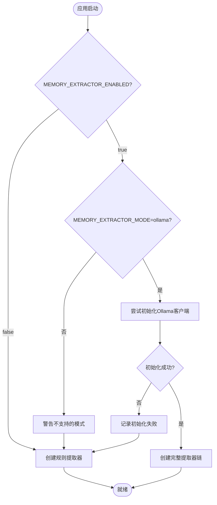
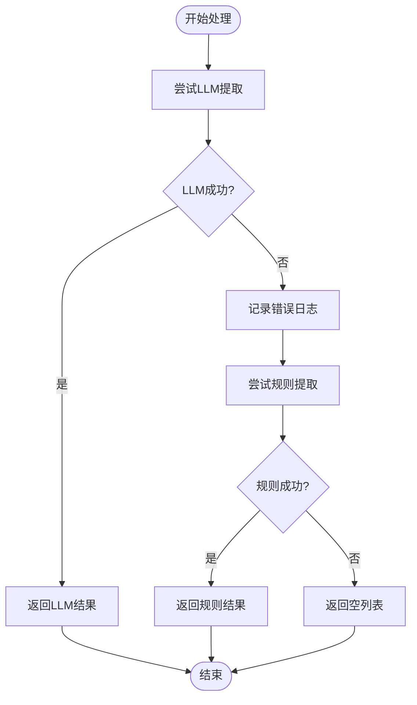

# Ollama内存提取器设计规范

<cite>
**本文档引用的文件**
- [backend/services/memory_extractor_client.py](file://backend/services/memory_extractor_client.py)
- [backend/services/memory_extractor.py](file://backend/services/memory_extractor.py)
- [backend/services/llm_memory_extractor.py](file://backend/services/llm_memory_extractor.py)
- [backend/config.py](file://backend/config.py)
- [backend/app.py](file://backend/app.py)
- [backend/schemas/live.py](file://backend/schemas/live.py)
- [backend/memory/embedding_service.py](file://backend/memory/embedding_service.py)
- [backend/memory/vector_store.py](file://backend/memory/vector_store.py)
- [.env.example](file://.env.example)
- [requirements.txt](file://requirements.txt)
- [tests/test_memory_extractor_client.py](file://tests/test_memory_extractor_client.py)
- [tests/test_llm_memory_extractor.py](file://tests/test_llm_memory_extractor.py)
</cite>

## 更新摘要
**所做更改**
- 新增了memory_extractor_mode配置参数，支持灵活的部署模式选择
- 增强了错误处理和自动回退机制，确保系统在异常情况下仍能正常运行
- 更新了应用启动流程，增加了完整的异常捕获和降级逻辑
- 改进了内存提取器初始化的安全性，防止单点故障影响整个系统
- 添加了新的测试用例，验证回退机制的正确性

## 目录
1. [简介](#简介)
2. [项目结构](#项目结构)
3. [核心组件](#核心组件)
4. [架构概览](#架构概览)
5. [详细组件分析](#详细组件分析)
6. [依赖关系分析](#依赖关系分析)
7. [性能考虑](#性能考虑)
8. [故障排除指南](#故障排除指南)
9. [结论](#结论)

## 简介

本设计规范文档详细描述了基于Ollama的Viewer Memory Extraction（观众记忆提取）系统的完整实现方案。该系统已完全从本地GGUF运行时迁移到Ollama/OpenAI兼容HTTP客户端架构，为直播场景中的观众记忆抽取提供稳定、可靠的解决方案。

系统的核心目标是：
- 提供稳定的内存提取能力，避免本地运行时的复杂性
- 保持与现有规则回退机制的兼容性
- 支持多种部署模式（本地Ollama、云端服务等）
- 确保向后兼容性和渐进式迁移
- 实现健壮的错误处理和自动回退机制

**更新** 本版本反映了从本地GGUF运行时到Ollama/OpenAI兼容HTTP客户端的完全迁移，包括新的MemoryExtractorClient实现、增强的错误处理机制、memory_extractor_mode配置参数的引入以及异常情况下的自动回退逻辑。

## 项目结构

基于代码库的实际组织，内存提取器相关的文件分布如下：

```mermaid
graph TB
subgraph "核心服务层"
ME[backend/services/memory_extractor.py<br/>规则回退提取器]
LME[backend/services/llm_memory_extractor.py<br/>LLM协议层]
MEC[backend/services/memory_extractor_client.py<br/>Ollama HTTP客户端]
END
subgraph "配置层"
CFG[backend/config.py<br/>设置管理]
ENV[.env.example<br/>环境配置示例]
END
subgraph "数据模型层"
LIVE[backend/schemas/live.py<br/>事件和记忆模型]
END
subgraph "存储层"
EMB[backend/memory/embedding_service.py<br/>嵌入服务]
VS[backend/memory/vector_store.py<br/>向量存储]
END
subgraph "应用层"
APP[backend/app.py<br/>应用启动和配置]
END
subgraph "测试层"
TEST[tests/test_memory_extractor_client.py<br/>HTTP客户端测试]
SPEC[docs/superpowers/specs/<br/>设计规范]
END
ME --> LME
LME --> MEC
CFG --> MEC
CFG --> LME
LIVE --> LME
LIVE --> ME
EMB --> VS
VS --> LME
APP --> MEC
TEST --> MEC
```

**图表来源**
- [backend/services/memory_extractor.py:1-143](file://backend/services/memory_extractor.py#L1-L143)
- [backend/services/llm_memory_extractor.py:1-134](file://backend/services/llm_memory_extractor.py#L1-L134)
- [backend/services/memory_extractor_client.py:1-115](file://backend/services/memory_extractor_client.py#L1-L115)

**章节来源**
- [backend/services/memory_extractor.py:1-143](file://backend/services/memory_extractor.py#L1-L143)
- [backend/services/llm_memory_extractor.py:1-134](file://backend/services/llm_memory_extractor.py#L1-L134)
- [backend/services/memory_extractor_client.py:1-115](file://backend/services/memory_extractor_client.py#L1-L115)

## 核心组件

### 内存提取器架构

系统采用分层架构设计，确保功能模块的职责分离和可维护性：



**图表来源**
- [backend/services/memory_extractor.py:123-143](file://backend/services/memory_extractor.py#L123-L143)
- [backend/services/llm_memory_extractor.py:35-134](file://backend/services/llm_memory_extractor.py#L35-L134)
- [backend/services/memory_extractor_client.py:19-115](file://backend/services/memory_extractor_client.py#L19-L115)

### 数据模型定义

系统使用标准化的数据模型确保各组件间的数据一致性：



**图表来源**
- [backend/schemas/live.py:29-46](file://backend/schemas/live.py#L29-L46)
- [backend/schemas/live.py:8-27](file://backend/schemas/live.py#L8-L27)
- [backend/schemas/live.py:65-86](file://backend/schemas/live.py#L65-L86)

**章节来源**
- [backend/services/memory_extractor.py:123-143](file://backend/services/memory_extractor.py#L123-L143)
- [backend/services/llm_memory_extractor.py:35-134](file://backend/services/llm_memory_extractor.py#L35-L134)
- [backend/services/memory_extractor_client.py:19-115](file://backend/services/memory_extractor_client.py#L19-L115)
- [backend/schemas/live.py:29-86](file://backend/schemas/live.py#L29-L86)

## 架构概览

### 系统整体架构



**图表来源**
- [backend/services/memory_extractor.py:129-143](file://backend/services/memory_extractor.py#L129-L143)
- [backend/services/llm_memory_extractor.py:40-54](file://backend/services/llm_memory_extractor.py#L40-L54)
- [backend/services/memory_extractor_client.py:38-100](file://backend/services/memory_extractor_client.py#L38-L100)

### 应用启动流程



**图表来源**
- [backend/app.py:152-172](file://backend/app.py#L152-L172)

**章节来源**
- [backend/config.py:80-185](file://backend/config.py#L80-L185)

## 详细组件分析

### MemoryExtractorClient HTTP客户端

MemoryExtractorClient是基于Ollama的HTTP客户端实现，提供轻量级的OpenAI兼容通信能力。

#### 核心特性

| 特性 | 实现方式 | 配置项 |
|------|----------|--------|
| OpenAI兼容API | 使用`/chat/completions`端点 | `MEMORY_EXTRACTOR_BASE_URL` |
| 认证支持 | Bearer Token认证 | `MEMORY_EXTRACTOR_API_KEY` |
| 超时控制 | 可配置的请求超时 | `MEMORY_EXTRACTOR_TIMEOUT_SECONDS` |
| 温度控制 | 固定温度值0.0 | 优化推理稳定性 |
| 错误处理 | 详细的HTTP错误包装 | 完整的异常信息 |

#### 客户端初始化流程



**图表来源**
- [backend/services/memory_extractor_client.py:22-37](file://backend/services/memory_extractor_client.py#L22-L37)

#### 请求处理流程



**图表来源**
- [backend/services/memory_extractor_client.py:38-100](file://backend/services/memory_extractor_client.py#L38-L100)

**章节来源**
- [backend/services/memory_extractor_client.py:19-115](file://backend/services/memory_extractor_client.py#L19-L115)

### LLM内存提取器协议层

LLM内存提取器作为协议层，负责处理与大语言模型的交互，确保输出格式的一致性和数据的有效性。

#### 核心功能特性

| 功能特性 | 描述 | 实现细节 |
|---------|------|----------|
| JSON输出解析 | 将LLM的JSON响应转换为标准格式 | 使用`json.loads()`进行安全解析 |
| 协议验证 | 验证必需字段的存在性和有效性 | 检查`should_extract`、`temporal_scope`等关键字段 |
| 情感极性检测 | 区分正面、负面、中性情感 | 支持情感信号词检测 |
| 置信度映射 | 将模型置信度转换为系统置信度 | 固定映射表：high→0.86, medium→0.72 |

#### 输出规范化流程



**图表来源**
- [backend/services/llm_memory_extractor.py:56-103](file://backend/services/llm_memory_extractor.py#L56-L103)

**章节来源**
- [backend/services/llm_memory_extractor.py:35-134](file://backend/services/llm_memory_extractor.py#L35-L134)

### 规则回退提取器

规则回退提取器提供基础的记忆提取能力，确保在LLM不可用或失败时系统仍能正常运行。

#### 关键规则定义

| 规则类别 | 关键词集合 | 用途 |
|---------|-----------|------|
| 低信号词汇 | 来了、收到、好的、支持、点赞等 | 过滤无意义的简短评论 |
| 交易关键词 | 多少钱、价格、链接、怎么买等 | 识别交易导向的评论 |
| 记忆提示词 | 我、我们、公司、附近、家等 | 检测可能包含个人记忆的内容 |

#### 提取逻辑



**图表来源**
- [backend/services/memory_extractor.py:102-121](file://backend/services/memory_extractor.py#L102-L121)

**章节来源**
- [backend/services/memory_extractor.py:65-121](file://backend/services/memory_extractor.py#L65-L121)

### 配置管理系统

配置管理系统提供统一的设置管理，支持多种部署场景。

#### 配置项分类

| 配置组 | 关键配置项 | 默认值 | 说明 |
|-------|-----------|--------|------|
| 基础设置 | `MEMORY_EXTRACTOR_ENABLED` | false | 启用内存提取功能 |
| | `MEMORY_EXTRACTOR_MODE` | "ollama" | 运行模式（ollama/cloud） |
| | `MEMORY_EXTRACTOR_TIMEOUT_SECONDS` | 30.0 | 请求超时时间 |
| 网络设置 | `MEMORY_EXTRACTOR_BASE_URL` | "http://127.0.0.1:11434/v1" | Ollama服务地址 |
| | `MEMORY_EXTRACTOR_MODEL` | "" | 模型名称 |
| | `MEMORY_EXTRACTOR_API_KEY` | "" | 认证密钥 |
| 性能设置 | `MEMORY_EXTRACTOR_MAX_TOKENS` | 512 | 最大令牌数 |

**章节来源**
- [backend/config.py:106-116](file://backend/config.py#L106-L116)
- [.env.example:39-47](file://.env.example#L39-L47)

### 增强的错误处理机制

系统实现了多层次的错误处理和自动回退机制，确保在各种异常情况下都能保持系统的稳定性。

#### 异常回退流程


**图表来源**
- [backend/services/memory_extractor.py:133-142](file://backend/services/memory_extractor.py#L133-L142)

#### 应用层初始化回退



**图表来源**
- [backend/app.py:152-172](file://backend/app.py#L152-L172)

**章节来源**
- [backend/services/memory_extractor.py:123-143](file://backend/services/memory_extractor.py#L123-L143)
- [backend/services/llm_memory_extractor.py:35-134](file://backend/services/llm_memory_extractor.py#L35-L134)
- [backend/app.py:152-172](file://backend/app.py#L152-L172)

## 依赖关系分析

### 组件依赖图

```mermaid
graph TB
subgraph "外部依赖"
URLLIB[urllib.request<br/>标准库HTTP客户端]
JSON[json<br/>标准库JSON处理]
LOGGING[logging<br/>标准库日志]
END
subgraph "内部组件"
EXTRACTOR[ViewerMemoryExtractor]
LLM_EXTRACTOR[LLMBackedViewerMemoryExtractor]
RULE_EXTRACTOR[RuleFallbackMemoryExtractor]
CLIENT[MemoryExtractorClient]
CONFIG[Settings]
END
subgraph "数据依赖"
LIVE_SCHEMA[LiveEvent模型]
VIEWER_MEMORY[ViewerMemory模型]
END
EXTRACTOR --> LLM_EXTRACTOR
EXTRACTOR --> RULE_EXTRACTOR
LLM_EXTRACTOR --> CLIENT
LLM_EXTRACTOR --> LIVE_SCHEMA
RULE_EXTRACTOR --> LIVE_SCHEMA
CLIENT --> CONFIG
CLIENT --> URLLIB
CLIENT --> JSON
EXTRACTOR --> LOGGING
LLM_EXTRACTOR --> LOGGING
```

**图表来源**
- [backend/services/memory_extractor.py:123-143](file://backend/services/memory_extractor.py#L123-L143)
- [backend/services/llm_memory_extractor.py:35-134](file://backend/services/llm_memory_extractor.py#L35-L134)
- [backend/services/memory_extractor_client.py:19-115](file://backend/services/memory_extractor_client.py#L19-L115)

### 错误处理依赖

系统采用分层错误处理策略，确保在不同层级出现故障时能够优雅降级：



**图表来源**
- [backend/services/memory_extractor.py:133-142](file://backend/services/memory_extractor.py#L133-L142)

**章节来源**
- [backend/services/memory_extractor.py:123-143](file://backend/services/memory_extractor.py#L123-L143)
- [backend/services/llm_memory_extractor.py:35-134](file://backend/services/llm_memory_extractor.py#L35-L134)

## 性能考虑

### 内存管理策略

系统采用多层缓存和内存管理策略以优化性能：

1. **向量存储缓存**：使用Chroma持久化存储，支持快速检索
2. **内存索引限制**：仅保留最近3000条记忆，控制内存使用
3. **批量处理**：支持批量插入和查询，提高吞吐量
4. **智能重建**：检测集合变化时自动重建索引

### 并发处理

```mermaid
graph LR
subgraph "并发控制"
THREAD_POOL[线程池管理]
BATCH_PROCESS[批量处理]
CACHE_OPT[缓存优化]
END
subgraph "性能指标"
RESPONSE_TIME[响应时间]
THROUGHPUT[吞吐量]
MEMORY_USAGE[内存使用]
END
THREAD_POOL --> RESPONSE_TIME
BATCH_PROCESS --> THROUGHPUT
CACHE_OPT --> MEMORY_USAGE
```

### 配置优化建议

| 配置项 | 推荐值 | 影响 |
|-------|--------|------|
| `MEMORY_EXTRACTOR_MAX_TOKENS` | 512 | 平衡响应质量和成本 |
| `MEMORY_EXTRACTOR_TIMEOUT_SECONDS` | 30.0 | 避免长时间阻塞 |
| `SEMANTIC_MEMORY_QUERY_LIMIT` | 6 | 控制查询复杂度 |
| `SEMANTIC_FINAL_K` | 3 | 限制返回结果数量 |

## 故障排除指南

### 常见问题诊断

#### Ollama连接问题

**症状**：内存提取失败，日志显示连接错误

**诊断步骤**：
1. 验证Ollama服务状态：`curl http://127.0.0.1:11434`
2. 检查模型可用性：`ollama list`
3. 验证网络连通性：`ping 127.0.0.1`
4. 检查防火墙设置

**解决方案**：
- 确保Ollama服务正在运行
- 验证模型名称正确
- 检查API密钥配置
- 调整超时设置

#### 配置错误

**症状**：系统无法启动或功能异常

**诊断方法**：
1. 验证`.env`文件配置
2. 检查必需配置项是否设置
3. 确认配置值格式正确

**修复措施**：
- 补充缺失的配置项
- 修正配置值格式
- 重启应用使配置生效

#### 性能问题

**症状**：响应缓慢或内存使用过高

**优化方案**：
1. 调整批量大小参数
2. 优化查询限制
3. 清理过期数据
4. 增加硬件资源

#### 回退机制问题

**症状**：LLM失败但未触发规则回退

**诊断步骤**：
1. 检查LLM提取器异常日志
2. 验证规则提取器配置
3. 确认回退逻辑触发条件

**解决方案**：
- 检查LLM客户端连接状态
- 验证规则提取器功能正常
- 确认异常处理逻辑正确执行

**章节来源**
- [.env.example:39-47](file://.env.example#L39-L47)

## 结论

Ollama内存提取器设计规范提供了一个完整、可靠的解决方案，用于在直播场景中提取和管理观众记忆。通过采用分层架构、协议验证和规则回退机制，系统确保了高可用性和可维护性。

### 主要优势

1. **可靠性**：Ollama提供稳定的OpenAI兼容接口
2. **可扩展性**：支持多种部署模式和配置选项
3. **易维护性**：清晰的分层架构便于调试和优化
4. **向后兼容**：完整的规则回退机制保证系统稳定性
5. **健壮性**：完善的错误处理和自动回退机制

### 未来发展方向

1. **性能优化**：进一步优化批量处理和缓存策略
2. **监控增强**：添加更详细的性能指标和日志记录
3. **模型支持**：扩展对更多LLM提供商的支持
4. **自动化运维**：集成模型管理和更新机制

该设计规范为开发者提供了清晰的实现指导，确保系统能够满足生产环境的严格要求。

**更新** 本版本反映了从本地GGUF运行时到Ollama/OpenAI兼容HTTP客户端的完全迁移，包括新的MemoryExtractorClient实现、增强的错误处理机制、memory_extractor_mode配置参数的引入以及异常情况下的自动回退逻辑。新架构提供了更好的可移植性和部署灵活性，同时保持了与现有系统的完全兼容性。新增的配置参数和回退机制显著提升了系统的稳定性和用户体验。