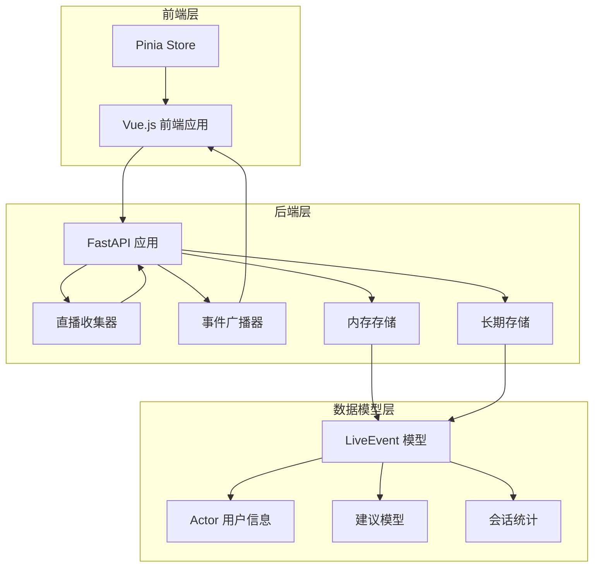
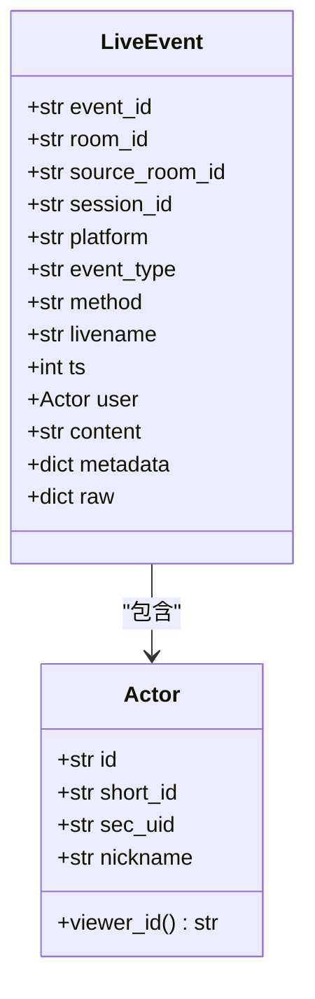
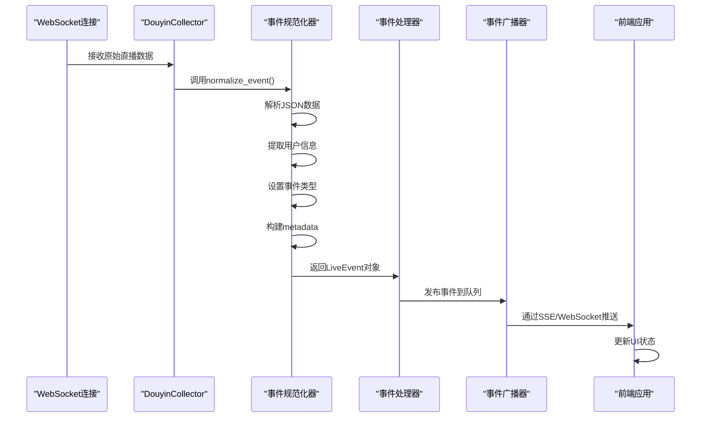
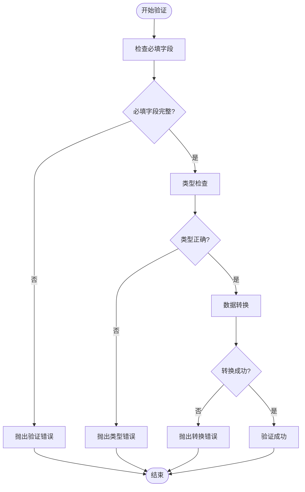
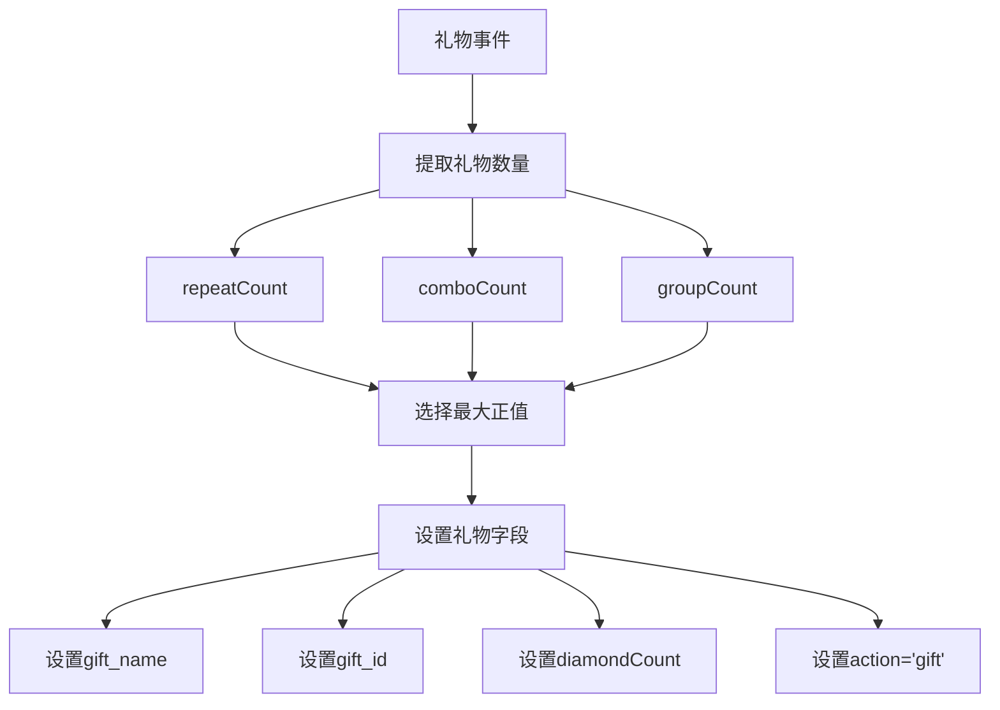
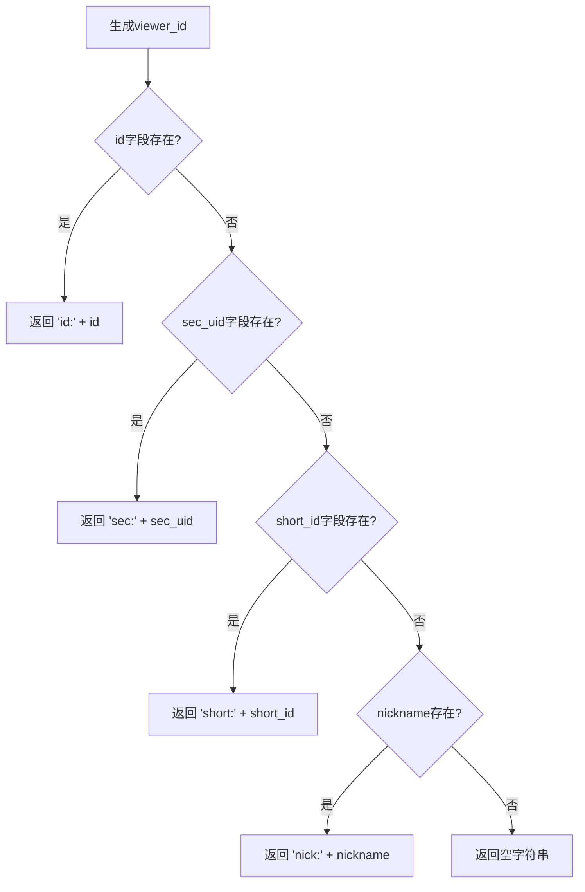
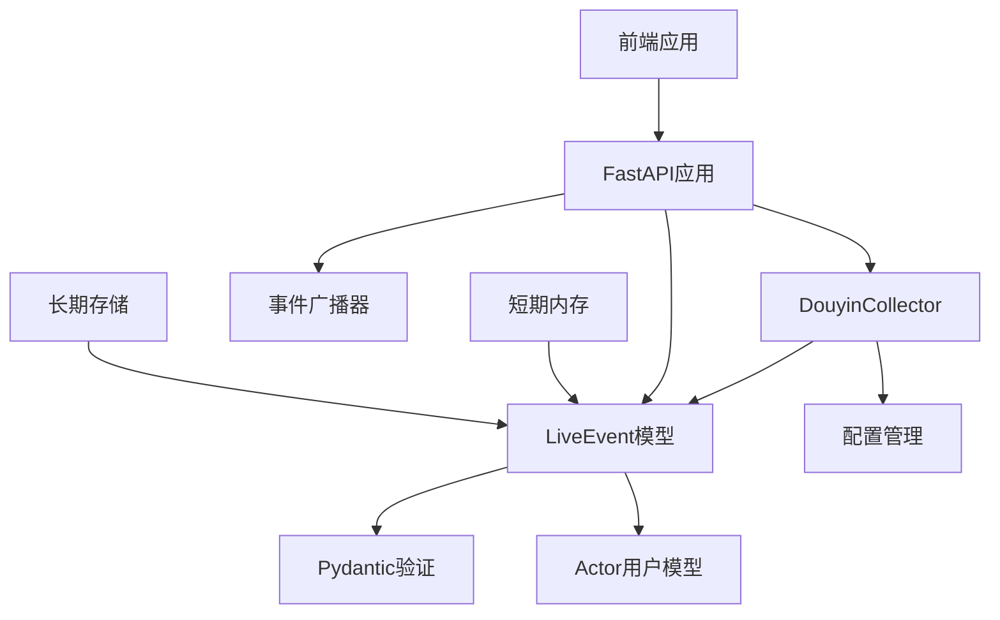

# LiveEvent数据模型

<cite>
**本文档引用的文件**
- [backend/schemas/live.py](file://backend/schemas/live.py)
- [backend/services/collector.py](file://backend/services/collector.py)
- [backend/app.py](file://backend/app.py)
- [backend/memory/session_memory.py](file://backend/memory/session_memory.py)
- [backend/memory/long_term.py](file://backend/memory/long_term.py)
- [backend/config.py](file://backend/config.py)
- [tests/test_agent.py](file://tests/test_agent.py)
- [frontend/src/stores/live.js](file://frontend/src/stores/live.js)
</cite>

## 目录
1. [简介](#简介)
2. [项目结构](#项目结构)
3. [核心组件](#核心组件)
4. [架构概览](#架构概览)
5. [详细组件分析](#详细组件分析)
6. [依赖分析](#依赖分析)
7. [性能考虑](#性能考虑)
8. [故障排除指南](#故障排除指南)
9. [结论](#结论)
10. [附录](#附录)

## 简介

LiveEvent是DouYin_llm项目中的核心数据模型，用于标准化直播平台的各种事件数据。该模型实现了跨收集、存储和API的统一事件表示，支持多种事件类型（评论、礼物、点赞、成员加入、关注等），并提供了完整的序列化和反序列化机制。

本项目采用Pydantic作为数据验证框架，确保数据的完整性和一致性。LiveEvent模型设计遵循以下原则：
- 标准化事件格式，便于跨平台兼容
- 提供丰富的元数据支持，便于后续处理和分析
- 支持灵活的扩展机制，允许添加自定义字段
- 实现完整的序列化支持，便于网络传输和持久化

## 项目结构

DouYin_llm项目采用分层架构设计，LiveEvent数据模型位于后端服务的核心位置：



**图表来源**
- [backend/app.py:108-117](file://backend/app.py#L108-L117)
- [backend/services/collector.py:38-53](file://backend/services/collector.py#L38-L53)
- [backend/memory/session_memory.py:17-31](file://backend/memory/session_memory.py#L17-L31)

**章节来源**
- [backend/app.py:1-285](file://backend/app.py#L1-L285)
- [backend/schemas/live.py:1-111](file://backend/schemas/live.py#L1-L111)

## 核心组件

### LiveEvent 类设计

LiveEvent是整个直播事件系统的中心数据模型，采用Pydantic BaseModel进行数据验证和序列化。

#### 基本属性定义

| 属性名 | 类型 | 必填 | 默认值 | 描述 |
|--------|------|------|--------|------|
| event_id | str | 是 | - | 事件唯一标识符 |
| room_id | str | 是 | - | 房间ID |
| source_room_id | str | 否 | "" | 源房间ID |
| session_id | str | 否 | "" | 会话ID |
| platform | str | 否 | "douyin" | 平台标识 |
| event_type | str | 是 | - | 事件类型 |
| method | str | 否 | "unknown" | 原始方法名 |
| livename | str | 否 | "未知直播间" | 直播间名称 |
| ts | int | 是 | - | 时间戳（毫秒） |
| user | Actor | 否 | Actor() | 用户信息对象 |
| content | str | 否 | "" | 事件内容 |
| metadata | dict[str, Any] | 否 | {} | 元数据字典 |
| raw | dict[str, Any] | 否 | {} | 原始数据 |

#### Actor 用户信息模型

Actor模型提供统一的用户身份标识，支持多种用户ID格式：



**图表来源**
- [backend/schemas/live.py:8-27](file://backend/schemas/live.py#L8-L27)
- [backend/schemas/live.py:29-44](file://backend/schemas/live.py#L29-L44)

**章节来源**
- [backend/schemas/live.py:8-44](file://backend/schemas/live.py#L8-L44)

### 事件类型映射

系统支持多种事件类型，通过METHOD_EVENT_TYPE_MAP进行映射：

| 方法名 | 事件类型 | 动作描述 |
|--------|----------|----------|
| WebcastChatMessage | comment | 用户评论 |
| WebcastGiftMessage | gift | 礼物赠送 |
| WebcastLikeMessage | like | 点赞 |
| WebcastMemberMessage | member | 成员加入 |
| WebcastSocialMessage | follow | 关注 |

**章节来源**
- [backend/services/collector.py:22-28](file://backend/services/collector.py#L22-L28)

## 架构概览

LiveEvent在整个系统中的流转过程如下：



**图表来源**
- [backend/services/collector.py:145-160](file://backend/services/collector.py#L145-L160)
- [backend/services/collector.py:207-265](file://backend/services/collector.py#L207-L265)
- [backend/app.py:73-102](file://backend/app.py#L73-L102)

## 详细组件分析

### 数据验证和类型约束

LiveEvent模型实现了严格的类型验证和约束：

#### 字段验证规则

1. **必填字段验证**
   - event_id: 必须存在且非空
   - room_id: 必须存在且非空
   - ts: 必须为整数类型

2. **类型约束**
   - 所有字符串字段使用str类型注解
   - 数值字段使用int类型注解
   - 复杂对象使用Pydantic模型类型

3. **默认值处理**
   - 可选字段提供合理的默认值
   - 空字符串用于字符串字段
   - 0用于数值字段

#### 自定义验证逻辑



**图表来源**
- [backend/schemas/live.py:29-44](file://backend/schemas/live.py#L29-L44)

**章节来源**
- [backend/schemas/live.py:29-44](file://backend/schemas/live.py#L29-L44)

### 事件规范化流程

DouyinCollector负责将原始直播数据规范化为标准的LiveEvent格式：

#### 礼物事件特殊处理



**图表来源**
- [backend/services/collector.py:197-206](file://backend/services/collector.py#L197-L206)
- [backend/services/collector.py:226-232](file://backend/services/collector.py#L226-L232)

#### 用户ID生成逻辑

Actor模型的viewer_id属性实现了智能的用户ID生成：



**图表来源**
- [backend/schemas/live.py:16-26](file://backend/schemas/live.py#L16-L26)

**章节来源**
- [backend/services/collector.py:197-239](file://backend/services/collector.py#L197-L239)

### 序列化和反序列化实现

#### JSON序列化

系统提供了多种序列化方式：

1. **Pydantic内置序列化**
   - `model_dump()`: Python字典格式
   - `model_dump_json()`: JSON字符串格式

2. **数据库序列化**
   - 使用`json.dumps()`将metadata和raw字段转换为JSON字符串
   - 支持`ensure_ascii=False`以正确处理中文字符

3. **网络传输序列化**
   - SSE流中使用`json.dumps()`进行编码
   - WebSocket中直接发送JSON对象

#### 时间戳处理

系统采用统一的时间戳格式：
- 存储格式：毫秒级时间戳（int）
- 生成逻辑：`int(time.time() * 1000)`
- 解析逻辑：确保转换为整数类型

**章节来源**
- [backend/memory/session_memory.py:46-48](file://backend/memory/session_memory.py#L46-L48)
- [backend/memory/long_term.py:250-277](file://backend/memory/long_term.py#L250-L277)

### 数据模型扩展点

LiveEvent模型设计了灵活的扩展机制：

#### 自定义字段添加方法

1. **metadata字典扩展**
   ```python
   # 添加自定义元数据
   event.metadata['custom_field'] = 'custom_value'
   ```

2. **raw原始数据保留**
   - 所有原始数据都会保留在raw字段中
   - 便于后续处理和调试

3. **继承扩展**
   - 可以通过继承LiveEvent创建特定场景的模型
   - 保持向后兼容性

#### 扩展字段的最佳实践

| 字段类型 | 命名规范 | 示例 |
|----------|----------|------|
| 平台特定字段 | platform_prefix | douyin_gift_count |
| 业务逻辑字段 | business_domain | order_amount |
| 分析统计字段 | analysis_prefix | sentiment_score |

**章节来源**
- [backend/schemas/live.py:43-44](file://backend/schemas/live.py#L43-L44)
- [backend/services/collector.py:220-224](file://backend/services/collector.py#L220-L224)

## 依赖分析

### 组件耦合关系



**图表来源**
- [backend/app.py:18-22](file://backend/app.py#L18-L22)
- [backend/services/collector.py:16-17](file://backend/services/collector.py#L16-L17)

### 外部依赖

系统主要依赖以下外部库：

1. **Pydantic**: 数据验证和序列化
2. **websocket-client**: WebSocket通信
3. **fastapi**: Web框架
4. **redis**: 可选的内存缓存
5. **sqlite3**: 数据持久化

**章节来源**
- [backend/app.py:8-22](file://backend/app.py#L8-L22)
- [backend/memory/session_memory.py:11-14](file://backend/memory/session_memory.py#L11-L14)

## 性能考虑

### 内存优化策略

1. **短期事件窗口**
   - 使用deque限制事件数量（默认120条）
   - 支持Redis分布式缓存
   - TTL机制自动清理过期数据

2. **序列化优化**
   - 避免不必要的数据复制
   - 使用生成器模式处理大量数据
   - 缓存常用的序列化结果

3. **并发处理**
   - 异步事件处理避免阻塞
   - 线程池管理WebSocket连接
   - 事件队列支持高并发

### 数据库性能

1. **索引优化**
   - 为常用查询字段建立索引
   - 优化时间范围查询性能
   - 支持复合索引查询

2. **批量操作**
   - 批量插入减少数据库往返
   - 事务处理保证数据一致性
   - 延迟提交优化写入性能

## 故障排除指南

### 常见问题诊断

#### 事件丢失问题

1. **WebSocket连接异常**
   - 检查collector_host和collector_port配置
   - 验证网络连通性
   - 查看重连机制日志

2. **事件处理失败**
   - 检查event_handler回调函数
   - 验证LiveEvent序列化是否正确
   - 查看异步任务执行状态

#### 数据不一致问题

1. **时间戳问题**
   - 确认系统时间同步
   - 检查时区设置
   - 验证毫秒级时间戳转换

2. **用户ID冲突**
   - 检查viewer_id生成逻辑
   - 验证用户标识符唯一性
   - 查看用户信息更新频率

**章节来源**
- [backend/services/collector.py:118-140](file://backend/services/collector.py#L118-L140)
- [backend/app.py:182-196](file://backend/app.py#L182-L196)

### 调试技巧

1. **启用详细日志**
   ```bash
   export LOG_LEVEL=DEBUG
   ```

2. **监控事件流**
   - 使用SSE客户端查看实时事件
   - 检查事件处理延迟
   - 监控内存使用情况

3. **数据验证**
   - 使用Pydantic的模型_validate方法
   - 检查字段类型和约束
   - 验证序列化结果

## 结论

LiveEvent数据模型为DouYin_llm项目提供了强大而灵活的数据抽象层。通过标准化的事件格式、完善的验证机制和丰富的扩展能力，该模型能够有效支撑直播场景下的各种业务需求。

关键优势包括：
- **统一的数据格式**：简化了多平台数据处理
- **强大的验证机制**：确保数据质量和完整性
- **灵活的扩展性**：支持业务需求的变化
- **高效的性能表现**：优化了内存和网络使用

未来可以考虑的改进方向：
- 增加更多的事件类型支持
- 优化大数据量场景下的性能
- 提供更丰富的数据分析工具
- 增强错误恢复和重试机制

## 附录

### 使用示例

#### 创建LiveEvent对象

```python
# 基本事件创建
event = LiveEvent(
    event_id="evt-1",
    room_id="room-1",
    ts=int(time.time() * 1000),
    user={"id": "user-1", "nickname": "用户名"},
    content="测试内容",
    event_type="comment"
)

# 礼物事件创建
gift_event = LiveEvent(
    event_id="gift-1",
    room_id="room-1",
    ts=int(time.time() * 1000),
    user={"id": "user-1", "nickname": "送礼用户"},
    content="小心心",
    event_type="gift",
    metadata={
        "gift_name": "小心心",
        "gift_count": 10,
        "combo_count": 3
    }
)
```

#### 序列化和反序列化

```python
# Python字典序列化
event_dict = event.model_dump()

# JSON字符串序列化
event_json = event.model_dump_json()

# 反序列化
restored_event = LiveEvent.model_validate(event_dict)
```

#### 事件处理流程

```python
# 处理新事件
async def handle_new_event(raw_data):
    # 规范化事件
    event = collector.normalize_event(raw_data)
    if not event:
        return
    
    # 处理事件
    await process_event(event)
    
    # 广播事件
    await broker.publish({"type": "event", "data": event.model_dump()})
```

**章节来源**
- [tests/test_agent.py:23-38](file://tests/test_agent.py#L23-L38)
- [backend/services/collector.py:207-265](file://backend/services/collector.py#L207-L265)
- [backend/app.py:73-102](file://backend/app.py#L73-L102)