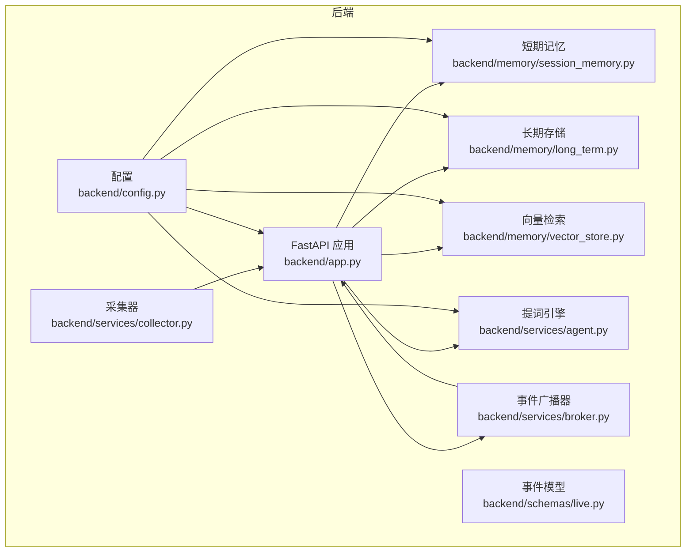
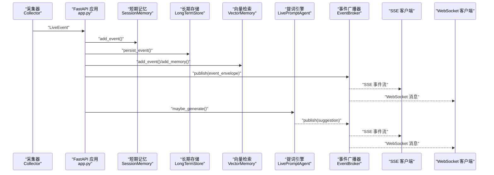
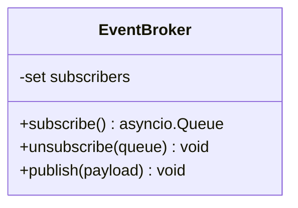
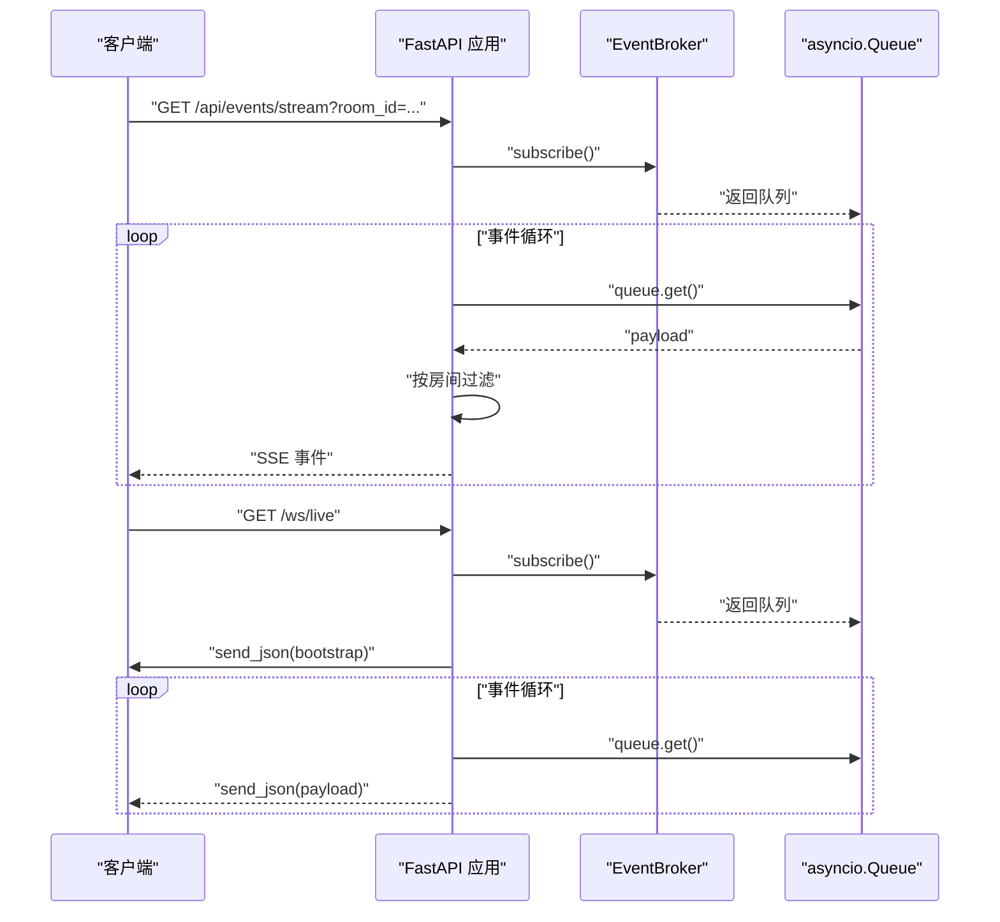
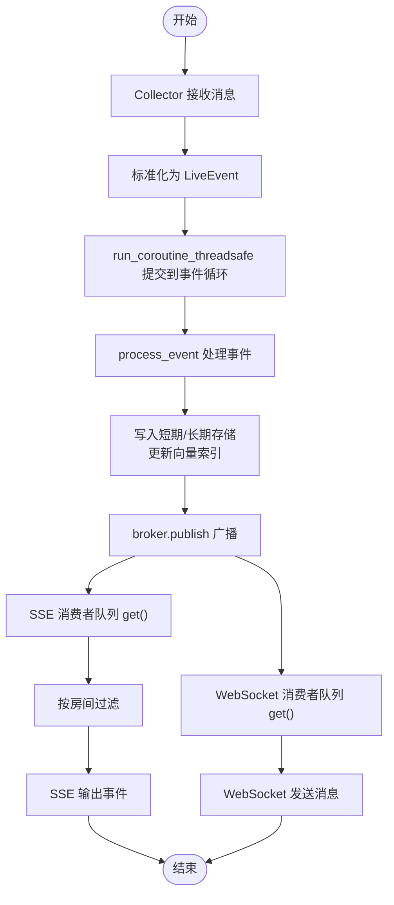
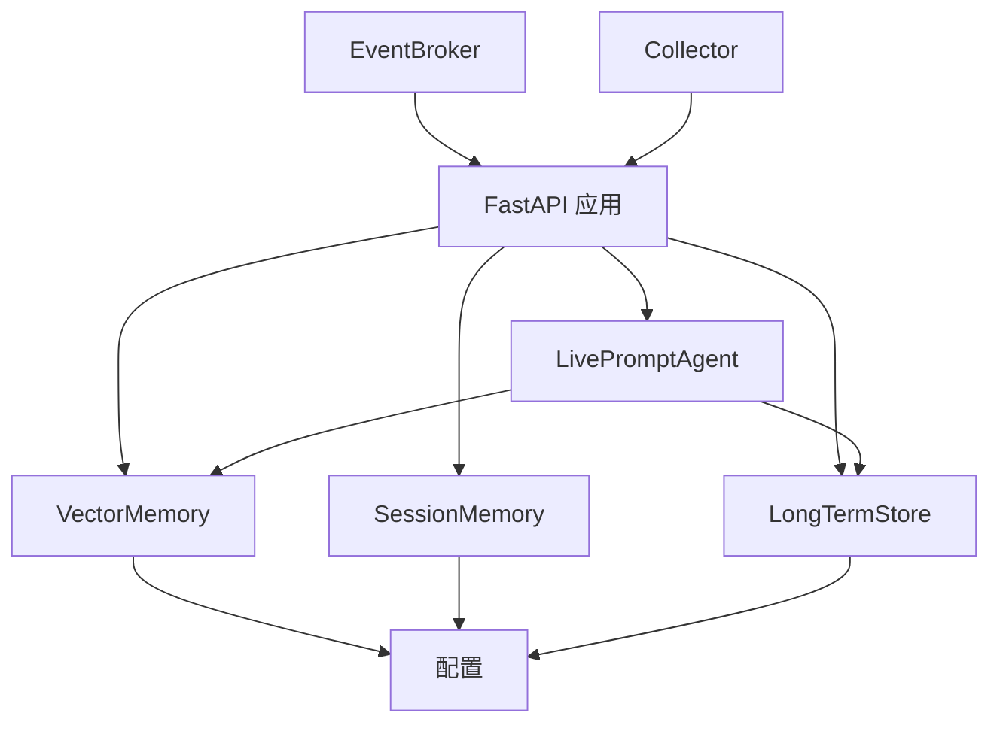

# 事件发布订阅系统

<cite>
**本文引用的文件**
- [backend/services/broker.py](file://backend/services/broker.py)
- [backend/app.py](file://backend/app.py)
- [backend/config.py](file://backend/config.py)
- [backend/schemas/live.py](file://backend/schemas/live.py)
- [backend/services/collector.py](file://backend/services/collector.py)
- [backend/services/memory_extractor.py](file://backend/services/memory_extractor.py)
- [backend/memory/session_memory.py](file://backend/memory/session_memory.py)
- [backend/memory/long_term.py](file://backend/memory/long_term.py)
- [backend/memory/vector_store.py](file://backend/memory/vector_store.py)
- [backend/services/agent.py](file://backend/services/agent.py)
- [README.md](file://README.md)
</cite>

## 目录
1. [简介](#简介)
2. [项目结构](#项目结构)
3. [核心组件](#核心组件)
4. [架构总览](#架构总览)
5. [详细组件分析](#详细组件分析)
6. [依赖关系分析](#依赖关系分析)
7. [性能考量](#性能考量)
8. [故障排查指南](#故障排查指南)
9. [结论](#结论)
10. [附录](#附录)

## 简介
本文件为 DouYin_llm 项目中的事件发布订阅系统（EventBroker）提供全面技术文档。系统采用进程内事件广播器，将后端处理完成的事件统一经由 SSE/WebSocket 推送给前端。本文重点阐述：
- 发布订阅模式的实现原理：事件队列管理、订阅者注册与消息分发机制
- 事件路由策略：按事件类型分类、按房间 ID 过滤、按用户标识定向分发
- 异步事件处理流程：事件接收、队列缓冲、并发处理与结果回调
- 订阅者管理 API 使用指南：订阅接口、取消订阅与批量操作
- 性能监控指标、队列长度限制与内存管理策略
- 完整的代码示例路径，展示如何实现事件发布与订阅功能

## 项目结构
后端采用 FastAPI 应用作为入口，内部集成事件采集、存储、记忆抽取与提词生成，并通过 EventBroker 将事件广播至 SSE/WebSocket。核心文件分布如下：
- 事件采集与处理：collector.py、app.py
- 事件模型：schemas/live.py
- 订阅与广播：services/broker.py
- 存储与检索：memory/session_memory.py、memory/long_term.py、memory/vector_store.py
- 提词引擎：services/agent.py
- 配置：config.py
- 项目说明：README.md

图表来源
- [backend/app.py:1-285](file://backend/app.py#L1-L285)
- [backend/services/collector.py:1-266](file://backend/services/collector.py#L1-L266)
- [backend/services/broker.py:1-40](file://backend/services/broker.py#L1-L40)
- [backend/schemas/live.py:1-111](file://backend/schemas/live.py#L1-L111)
- [backend/memory/session_memory.py:1-113](file://backend/memory/session_memory.py#L1-L113)
- [backend/memory/long_term.py:1-967](file://backend/memory/long_term.py#L1-L967)
- [backend/memory/vector_store.py:1-317](file://backend/memory/vector_store.py#L1-L317)
- [backend/services/agent.py:1-496](file://backend/services/agent.py#L1-L496)
- [backend/config.py:1-113](file://backend/config.py#L1-L113)

章节来源
- [README.md:1-223](file://README.md#L1-L223)
- [backend/app.py:1-285](file://backend/app.py#L1-L285)

## 核心组件
- EventBroker：进程内事件广播器，维护订阅队列集合，提供订阅、取消订阅与广播方法
- FastAPI 应用：定义 SSE 与 WebSocket 接口，负责事件封装与路由
- Collector：从本地采集器 WebSocket 接收消息，标准化为 LiveEvent 并提交到事件循环
- SessionMemory/LongTermStore/VectorMemory：短期/长期存储与向量检索
- LivePromptAgent：基于 LLM 与启发式规则生成提词建议
- 配置模块：集中管理运行参数与环境变量

章节来源
- [backend/services/broker.py:1-40](file://backend/services/broker.py#L1-L40)
- [backend/app.py:1-285](file://backend/app.py#L1-L285)
- [backend/services/collector.py:1-266](file://backend/services/collector.py#L1-L266)
- [backend/services/agent.py:1-496](file://backend/services/agent.py#L1-L496)
- [backend/memory/session_memory.py:1-113](file://backend/memory/session_memory.py#L1-L113)
- [backend/memory/long_term.py:1-967](file://backend/memory/long_term.py#L1-L967)
- [backend/memory/vector_store.py:1-317](file://backend/memory/vector_store.py#L1-L317)
- [backend/config.py:1-113](file://backend/config.py#L1-L113)

## 架构总览
系统采用“采集-处理-广播”的流水线架构。采集器将原始消息标准化为 LiveEvent，后端进行短期/长期存储与向量索引更新，同时生成提词建议并通过 EventBroker 广播到 SSE/WebSocket。

图表来源
- [backend/services/collector.py:145-160](file://backend/services/collector.py#L145-L160)
- [backend/app.py:73-102](file://backend/app.py#L73-L102)
- [backend/services/broker.py:28-40](file://backend/services/broker.py#L28-L40)
- [backend/app.py:252-271](file://backend/app.py#L252-L271)
- [backend/app.py:274-285](file://backend/app.py#L274-L285)

## 详细组件分析

### EventBroker 组件分析
EventBroker 是系统的核心广播器，负责：
- 订阅：为每个订阅者创建 asyncio.Queue 并加入集合
- 广播：遍历订阅队列，非阻塞投递消息；对满队列的订阅者进行清理
- 取消订阅：从集合中移除指定队列

图表来源
- [backend/services/broker.py:10-40](file://backend/services/broker.py#L10-L40)

章节来源
- [backend/services/broker.py:1-40](file://backend/services/broker.py#L1-L40)

### SSE 与 WebSocket 订阅接口
FastAPI 在应用层提供两类实时订阅接口：
- SSE：/api/events/stream，支持按房间过滤
- WebSocket：/ws/live，先下发 bootstrap 快照

图表来源
- [backend/app.py:252-271](file://backend/app.py#L252-L271)
- [backend/app.py:274-285](file://backend/app.py#L274-L285)
- [backend/services/broker.py:16-27](file://backend/services/broker.py#L16-L27)

章节来源
- [backend/app.py:252-285](file://backend/app.py#L252-L285)

### 事件路由策略
- 按事件类型分类：前端通过事件类型区分事件、建议、统计与模型状态
- 按房间 ID 过滤：SSE 接口支持 room_id 参数，服务端在消费队列时进行过滤
- 按用户标识定向分发：当前广播器为全局广播，未实现按用户标识定向分发

章节来源
- [backend/app.py:252-271](file://backend/app.py#L252-L271)
- [backend/app.py:274-285](file://backend/app.py#L274-L285)

### 异步事件处理流程
- 事件接收：Collector 将 WebSocket 消息标准化为 LiveEvent，通过 run_coroutine_threadsafe 提交到事件循环
- 队列缓冲：EventBroker 使用 asyncio.Queue 缓冲消息；满队列的订阅者会被识别并清理
- 并发处理：SSE/WebSocket 消费协程各自从队列获取消息，实现多路并发
- 结果回调：事件处理完成后通过 broker.publish 广播

图表来源
- [backend/services/collector.py:182-189](file://backend/services/collector.py#L182-L189)
- [backend/app.py:73-102](file://backend/app.py#L73-L102)
- [backend/services/broker.py:28-40](file://backend/services/broker.py#L28-L40)
- [backend/app.py:252-271](file://backend/app.py#L252-L271)
- [backend/app.py:274-285](file://backend/app.py#L274-L285)

章节来源
- [backend/services/collector.py:145-189](file://backend/services/collector.py#L145-L189)
- [backend/app.py:73-102](file://backend/app.py#L73-L102)
- [backend/services/broker.py:28-40](file://backend/services/broker.py#L28-L40)

### 订阅者管理 API 使用指南
- 订阅接口
  - SSE：GET /api/events/stream?room_id=...
  - WebSocket：GET /ws/live
- 取消订阅
  - SSE：客户端断开即自动取消
  - WebSocket：发生 WebSocketDisconnect 时自动取消
- 批量操作
  - 通过多个客户端连接实现多路订阅
  - 服务端不提供批量订阅/取消 API，需在客户端侧管理

章节来源
- [backend/app.py:252-285](file://backend/app.py#L252-L285)

### 事件模型与封装
- 事件模型：LiveEvent、Suggestion、ViewerMemory、SessionStats、ModelStatus
- 事件封装：event_envelope(type, data) 用于统一消息格式

章节来源
- [backend/schemas/live.py:29-111](file://backend/schemas/live.py#L29-L111)
- [backend/app.py:56-57](file://backend/app.py#L56-L57)

## 依赖关系分析
- EventBroker 依赖 asyncio.Queue 进行队列管理
- FastAPI 应用依赖 EventBroker 进行广播，依赖 SessionMemory/LongTermStore/VectorMemory/Agent 进行数据处理
- Collector 依赖 WebSocket 客户端库与配置模块
- Agent 依赖 VectorMemory 与 LongTermStore
- VectorMemory 依赖 Chroma 或本地哈希嵌入函数

图表来源
- [backend/services/broker.py:10-40](file://backend/services/broker.py#L10-L40)
- [backend/app.py:1-285](file://backend/app.py#L1-L285)
- [backend/services/collector.py:1-266](file://backend/services/collector.py#L1-L266)
- [backend/services/agent.py:1-496](file://backend/services/agent.py#L1-L496)
- [backend/memory/vector_store.py:1-317](file://backend/memory/vector_store.py#L1-L317)
- [backend/memory/session_memory.py:1-113](file://backend/memory/session_memory.py#L1-L113)
- [backend/memory/long_term.py:1-967](file://backend/memory/long_term.py#L1-L967)
- [backend/config.py:1-113](file://backend/config.py#L1-L113)

章节来源
- [backend/app.py:1-285](file://backend/app.py#L1-L285)

## 性能考量
- 队列长度与缓冲
  - asyncio.Queue 为无界队列，可能导致内存增长；满队列的订阅者会被清理
  - 建议在生产环境中引入队列长度限制与背压策略
- 并发与资源
  - SSE/WebSocket 消费协程并发运行，注意 CPU 与网络带宽占用
  - Redis/Chroma/LLM 调用可能成为瓶颈，需合理配置超时与降级策略
- 内存管理
  - SessionMemory 在 Redis 不可用时使用进程内 deque，容量有限
  - VectorMemory 维护内存与事件的本地缓存，注意上限与淘汰策略
- 监控指标
  - 建议增加以下指标：订阅者数量、队列长度、广播延迟、事件吞吐、错误率
  - 可结合日志与外部监控系统（如 Prometheus/Grafana）进行观测

章节来源
- [backend/services/broker.py:31-40](file://backend/services/broker.py#L31-L40)
- [backend/memory/session_memory.py:26-64](file://backend/memory/session_memory.py#L26-L64)
- [backend/memory/vector_store.py:149-171](file://backend/memory/vector_store.py#L149-L171)
- [backend/services/agent.py:302-437](file://backend/services/agent.py#L302-L437)

## 故障排查指南
- SSE/WebSocket 无法连接
  - 检查 Collector 是否已启动且与 ROOM_ID 匹配
  - 查看 FastAPI 日志与健康检查接口 /health
- 事件未到达前端
  - 确认 SSE/WS 订阅是否正确传入 room_id
  - 检查 EventBroker 的订阅与取消逻辑
- 广播异常
  - 满队列导致订阅者被清理，需调整订阅者数量或队列策略
- LLM 生成失败
  - 检查 LLM_MODE、API Key 与网络连通性
  - 查看 Agent 的错误状态上报

章节来源
- [backend/app.py:129-136](file://backend/app.py#L129-L136)
- [backend/services/collector.py:61-79](file://backend/services/collector.py#L61-L79)
- [backend/services/broker.py:31-40](file://backend/services/broker.py#L31-L40)
- [backend/services/agent.py:302-437](file://backend/services/agent.py#L302-L437)

## 结论
EventBroker 通过进程内广播实现了高效的事件分发，结合 SSE/WebSocket 为前端提供了低延迟的实时体验。系统在采集、存储、检索与提词生成方面形成了完整链路。为进一步提升稳定性与可观测性，建议：
- 引入队列长度限制与背压策略
- 增加订阅者数量与广播延迟的监控指标
- 在高并发场景下优化 Redis/Chroma/LLM 的资源配置
- 考虑按用户标识的定向分发能力扩展

## 附录

### 代码示例路径（事件发布与订阅）
- 订阅 SSE
  - [backend/app.py:252-271](file://backend/app.py#L252-L271)
- 订阅 WebSocket
  - [backend/app.py:274-285](file://backend/app.py#L274-L285)
- 发布事件
  - [backend/app.py:78](file://backend/app.py#L78)
  - [backend/app.py:85](file://backend/app.py#L85)
  - [backend/app.py:100](file://backend/app.py#L100)
  - [backend/app.py:101](file://backend/app.py#L101)
- 广播器实现
  - [backend/services/broker.py:16-40](file://backend/services/broker.py#L16-L40)
- 事件模型
  - [backend/schemas/live.py:29-111](file://backend/schemas/live.py#L29-L111)