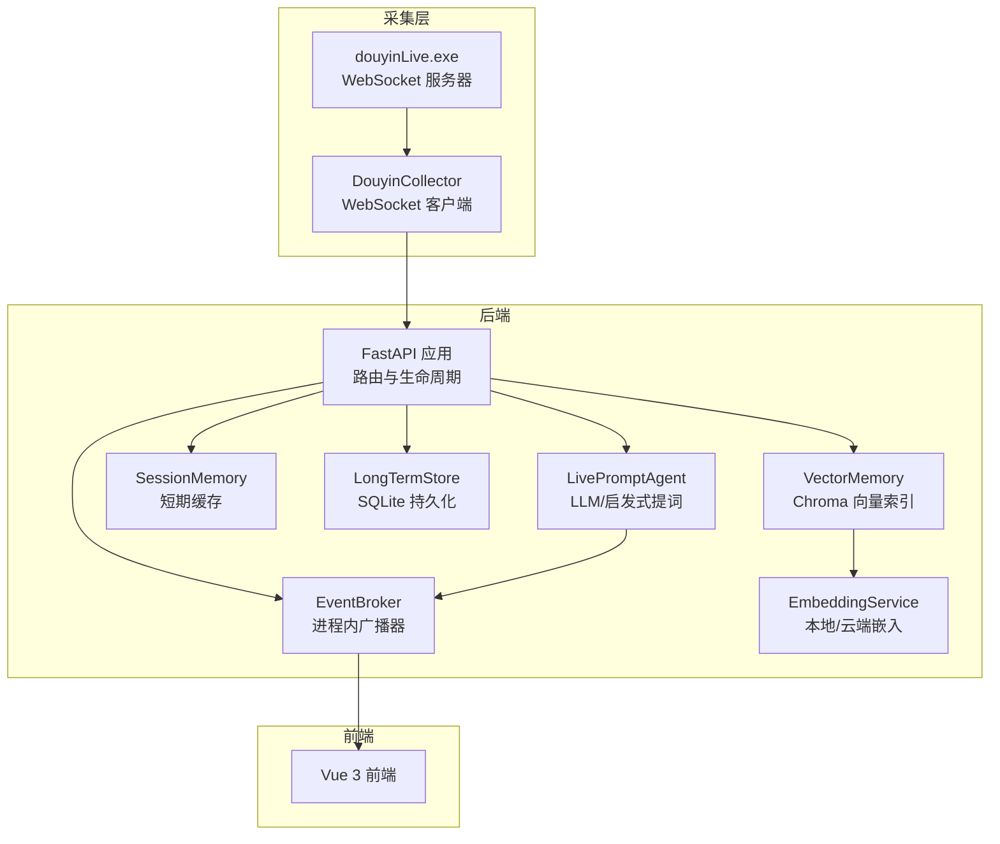
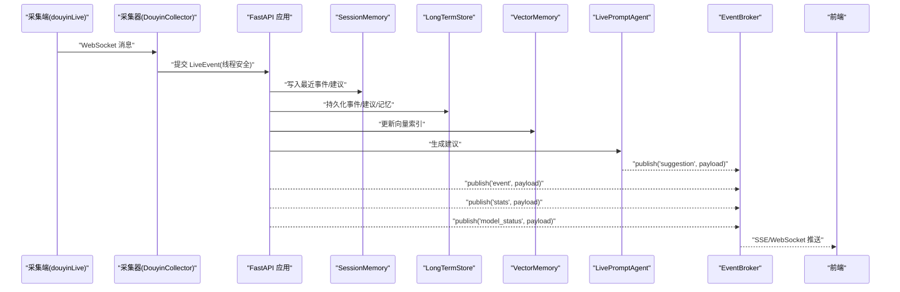
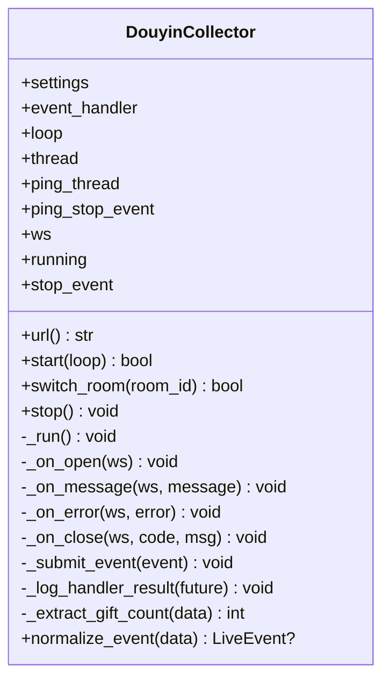
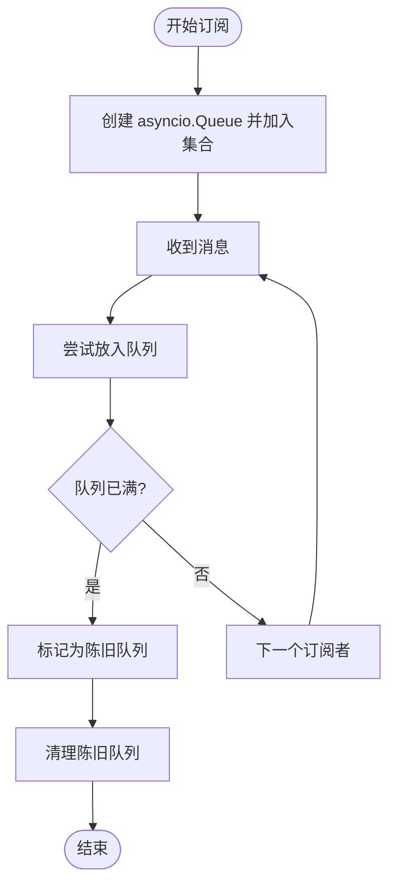
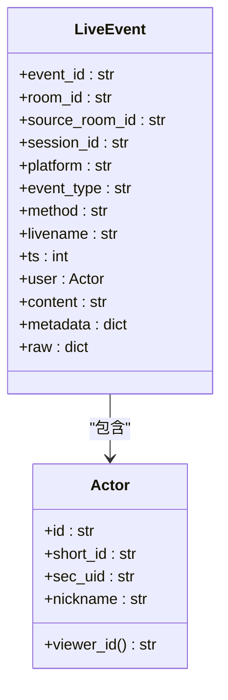
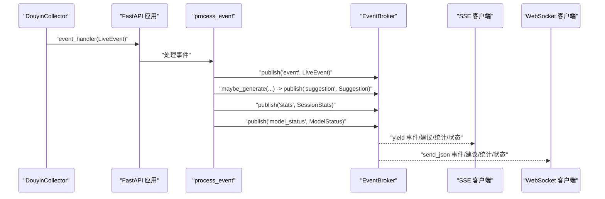
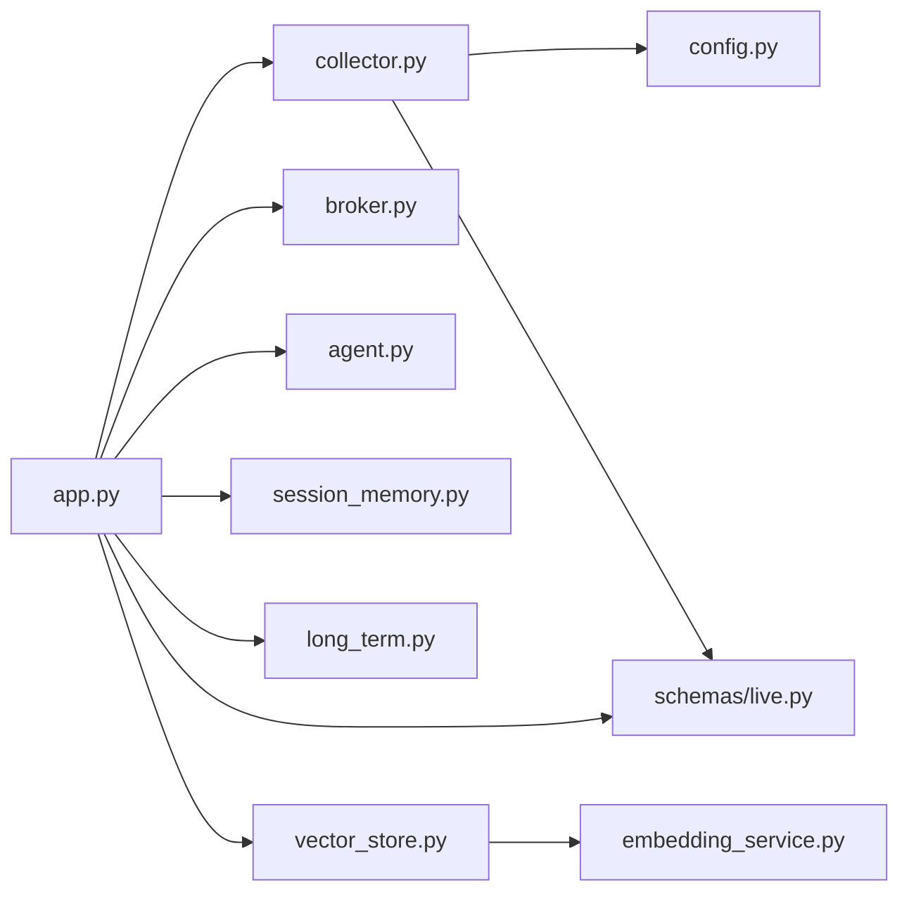

# 事件处理系统

<cite>
**本文引用的文件**
- [backend/services/collector.py](file://backend/services/collector.py)
- [backend/services/broker.py](file://backend/services/broker.py)
- [backend/schemas/live.py](file://backend/schemas/live.py)
- [backend/app.py](file://backend/app.py)
- [backend/config.py](file://backend/config.py)
- [backend/memory/session_memory.py](file://backend/memory/session_memory.py)
- [backend/memory/long_term.py](file://backend/memory/long_term.py)
- [backend/services/agent.py](file://backend/services/agent.py)
- [backend/memory/vector_store.py](file://backend/memory/vector_store.py)
- [backend/memory/embedding_service.py](file://backend/memory/embedding_service.py)
- [README.md](file://README.md)
- [requirements.txt](file://requirements.txt)
</cite>

## 目录
1. [简介](#简介)
2. [项目结构](#项目结构)
3. [核心组件](#核心组件)
4. [架构总览](#架构总览)
5. [详细组件分析](#详细组件分析)
6. [依赖关系分析](#依赖关系分析)
7. [性能考量](#性能考量)
8. [故障排除指南](#故障排除指南)
9. [结论](#结论)
10. [附录](#附录)

## 简介
本技术文档围绕 DouYin_llm 事件处理系统，聚焦以下目标：
- 解释事件采集器 DouyinCollector 的工作机制：WebSocket 连接管理、事件解析与错误处理。
- 说明事件发布订阅系统 EventBroker 的实现：消息队列、订阅管理与事件分发策略。
- 详述 LiveEvent 数据模型的设计与验证规则。
- 提供完整的事件处理流程图与代码示例路径，展示从采集到分发的全链路。
- 给出性能优化建议与故障排除指南。

该系统由三部分组成：采集端（本地可执行程序）通过 WebSocket 输出事件，后端 FastAPI 将其规范化为 LiveEvent，写入短期/长期存储与向量索引，并通过 SSE/WebSocket 推送给前端；同时根据事件生成提词建议并广播。

章节来源
- [README.md:1-223](file://README.md#L1-L223)

## 项目结构
后端采用分层设计：
- 应用入口与路由：FastAPI 应用定义生命周期、REST/SSE/WebSocket 接口与业务编排。
- 服务层：采集器、事件代理（提词引擎）、发布订阅。
- 存储层：短期会话内存（Redis/内存）、长期 SQLite、向量索引（Chroma）与嵌入服务。
- 数据模型：统一的 LiveEvent、Actor、Suggestion、ViewerMemory、SessionStats、ModelStatus、SessionSnapshot。

图表来源
- [backend/app.py:108-127](file://backend/app.py#L108-L127)
- [backend/services/collector.py:38-140](file://backend/services/collector.py#L38-L140)
- [backend/services/broker.py:10-40](file://backend/services/broker.py#L10-L40)
- [backend/services/agent.py:23-60](file://backend/services/agent.py#L23-L60)
- [backend/memory/session_memory.py:17-113](file://backend/memory/session_memory.py#L17-L113)
- [backend/memory/long_term.py:44-187](file://backend/memory/long_term.py#L44-L187)
- [backend/memory/vector_store.py:59-85](file://backend/memory/vector_store.py#L59-L85)
- [backend/memory/embedding_service.py:18-48](file://backend/memory/embedding_service.py#L18-L48)

章节来源
- [backend/app.py:108-127](file://backend/app.py#L108-L127)
- [backend/services/collector.py:38-140](file://backend/services/collector.py#L38-L140)
- [backend/services/broker.py:10-40](file://backend/services/broker.py#L10-L40)
- [backend/services/agent.py:23-60](file://backend/services/agent.py#L23-L60)
- [backend/memory/session_memory.py:17-113](file://backend/memory/session_memory.py#L17-L113)
- [backend/memory/long_term.py:44-187](file://backend/memory/long_term.py#L44-L187)
- [backend/memory/vector_store.py:59-85](file://backend/memory/vector_store.py#L59-L85)
- [backend/memory/embedding_service.py:18-48](file://backend/memory/embedding_service.py#L18-L48)

## 核心组件
- 事件采集器 DouyinCollector：负责与本地 WebSocket 服务器建立连接，解析原始消息为 LiveEvent，并通过 asyncio 线程安全地提交到后端事件循环。
- 事件发布订阅 EventBroker：维护订阅队列集合，向所有订阅者广播消息；对阻塞队列进行清理。
- LiveEvent 数据模型：标准化直播事件字段，包含用户身份、内容、元数据与原始数据，用于跨模块传递。
- FastAPI 应用：注册生命周期钩子启动采集器，定义 REST/SSE/WebSocket 接口，编排事件处理流程。
- 存储与检索：短期会话内存（SessionMemory）、长期 SQLite（LongTermStore）、向量索引（VectorMemory）与嵌入服务（EmbeddingService）。
- 提词代理 LivePromptAgent：结合上下文与语义记忆，生成建议并广播。

章节来源
- [backend/services/collector.py:38-266](file://backend/services/collector.py#L38-L266)
- [backend/services/broker.py:10-40](file://backend/services/broker.py#L10-L40)
- [backend/schemas/live.py:8-111](file://backend/schemas/live.py#L8-L111)
- [backend/app.py:73-102](file://backend/app.py#L73-L102)
- [backend/memory/session_memory.py:17-113](file://backend/memory/session_memory.py#L17-L113)
- [backend/memory/long_term.py:44-187](file://backend/memory/long_term.py#L44-L187)
- [backend/memory/vector_store.py:59-317](file://backend/memory/vector_store.py#L59-L317)
- [backend/services/agent.py:23-496](file://backend/services/agent.py#L23-L496)

## 架构总览
系统通过 WebSocket 从采集端接收事件，FastAPI 在事件到达后执行：
- 写入短期会话内存与长期数据库
- 更新向量索引
- 生成提词建议并持久化
- 广播事件、建议、统计与模型状态
- 前端通过 SSE/WebSocket 实时消费

图表来源
- [backend/services/collector.py:145-196](file://backend/services/collector.py#L145-L196)
- [backend/app.py:73-102](file://backend/app.py#L73-L102)
- [backend/services/broker.py:28-40](file://backend/services/broker.py#L28-L40)
- [backend/services/agent.py:105-142](file://backend/services/agent.py#L105-L142)
- [backend/memory/session_memory.py:42-84](file://backend/memory/session_memory.py#L42-L84)
- [backend/memory/long_term.py:454-488](file://backend/memory/long_term.py#L454-L488)
- [backend/memory/vector_store.py:149-171](file://backend/memory/vector_store.py#L149-L171)

## 详细组件分析

### 事件采集器 DouyinCollector
- WebSocket 连接管理
  - 使用 websocket.WebSocketApp 建立连接，设置 ping 间隔与回调。
  - 自动重连：断开后按配置延迟重试，避免阻塞主线程。
  - 线程安全：在独立线程中运行，通过 asyncio.run_coroutine_threadsafe 将事件提交到后端事件循环。
- 事件解析
  - 解析 JSON，忽略非 JSON 消息。
  - 将原始消息映射为 LiveEvent，填充方法、事件类型、用户信息、礼物元数据等。
  - 礼物计数提取：综合 repeatCount/comboCount/groupCount，确保正数且不小于 1。
- 错误处理
  - on_error/on_close 记录警告日志；stop() 清理资源，关闭连接并等待线程退出。
  - submit_event 失败时丢弃事件并记录异常。
- 房间切换
  - 支持动态切换房间 ID，内部停止旧连接并启动新连接。

图表来源
- [backend/services/collector.py:38-266](file://backend/services/collector.py#L38-L266)

章节来源
- [backend/services/collector.py:38-266](file://backend/services/collector.py#L38-L266)

### 事件发布订阅系统 EventBroker
- 订阅管理
  - subscribe 返回 asyncio.Queue 并加入集合；unsubscribe 移除队列。
- 广播策略
  - publish 将消息放入每个订阅队列；遇到队列满时标记为“陈旧”，随后统一清理，避免阻塞主循环。
- 适用场景
  - SSE 与 WebSocket 推送均基于此广播器，实现多消费者并行消费。

图表来源
- [backend/services/broker.py:16-40](file://backend/services/broker.py#L16-L40)

章节来源
- [backend/services/broker.py:10-40](file://backend/services/broker.py#L10-L40)

### LiveEvent 数据模型
- 字段设计
  - 事件标识、房间与来源房间、平台、事件类型、方法、直播名、时间戳、用户 Actor、内容、元数据、原始数据。
- 用户身份 Actor
  - 优先使用 id/sec_uid/short_id/nickname 生成 viewer_id，便于跨模块唯一识别。
- 校验与默认值
  - 使用 Pydantic BaseModel，字段具备默认值与类型约束；在 normalize_event 中缺失字段时提供兜底。
- 用途
  - 作为跨模块的统一数据载体，贯穿采集、存储、检索与前端展示。

图表来源
- [backend/schemas/live.py:8-44](file://backend/schemas/live.py#L8-L44)

章节来源
- [backend/schemas/live.py:8-111](file://backend/schemas/live.py#L8-L111)

### 事件处理流程（从采集到分发）
- FastAPI 生命周期
  - 应用启动时创建 EventBroker、SessionMemory、LongTermStore、EmbeddingService、VectorMemory、LivePromptAgent。
  - 注册 lifespan，在启动时启动采集器，在关闭时停止采集器并关闭活动会话。
- 事件处理函数
  - 写入短期会话内存与长期数据库。
  - 更新向量索引。
  - 生成建议并持久化，广播建议。
  - 广播统计与模型状态。
- SSE/WebSocket 推送
  - SSE：/api/events/stream，按房间过滤并持续推送。
  - WebSocket：/ws/live，先下发 bootstrap 快照，随后持续推送。

图表来源
- [backend/app.py:73-102](file://backend/app.py#L73-L102)
- [backend/services/broker.py:28-40](file://backend/services/broker.py#L28-L40)
- [backend/services/agent.py:105-142](file://backend/services/agent.py#L105-L142)
- [backend/memory/session_memory.py:86-102](file://backend/memory/session_memory.py#L86-L102)
- [backend/memory/long_term.py:538-554](file://backend/memory/long_term.py#L538-L554)

章节来源
- [backend/app.py:73-102](file://backend/app.py#L73-L102)
- [backend/services/broker.py:28-40](file://backend/services/broker.py#L28-L40)
- [backend/services/agent.py:105-142](file://backend/services/agent.py#L105-L142)
- [backend/memory/session_memory.py:86-102](file://backend/memory/session_memory.py#L86-L102)
- [backend/memory/long_term.py:538-554](file://backend/memory/long_term.py#L538-L554)

## 依赖关系分析
- 外部依赖
  - websocket-client：WebSocket 客户端。
  - fastapi/uvicorn：Web 服务框架与 ASGI 服务器。
  - redis：可选，用于 SessionMemory 分布式共享。
  - chromadb：可选，用于向量索引。
- 内部模块耦合
  - app.py 依赖 collector、broker、agent、session_memory、long_term_store、vector_memory、embedding_service。
  - collector 依赖 config 与 schemas。
  - vector_store 依赖 embedding_service。
  - long_term 依赖 schemas。

图表来源
- [backend/app.py:13-35](file://backend/app.py#L13-L35)
- [backend/services/collector.py:16-17](file://backend/services/collector.py#L16-L17)
- [backend/memory/vector_store.py:7-8](file://backend/memory/vector_store.py#L7-L8)
- [backend/memory/embedding_service.py:7](file://backend/memory/embedding_service.py#L7)

章节来源
- [backend/app.py:13-35](file://backend/app.py#L13-L35)
- [backend/services/collector.py:16-17](file://backend/services/collector.py#L16-L17)
- [backend/memory/vector_store.py:7-8](file://backend/memory/vector_store.py#L7-L8)
- [backend/memory/embedding_service.py:7](file://backend/memory/embedding_service.py#L7)
- [requirements.txt:1-6](file://requirements.txt#L1-L6)

## 性能考量
- WebSocket 连接与重连
  - ping_interval 与重连延迟可调，避免频繁抖动；断线自动恢复。
- 事件处理吞吐
  - 使用 asyncio.run_coroutine_threadsafe 将事件提交到事件循环，避免阻塞采集线程。
  - EventBroker 的队列满检测与清理，防止广播成为瓶颈。
- 存储与检索
  - SessionMemory 支持 Redis 退化，减少内存占用；SQLite 索引与列迁移保证查询效率。
  - VectorMemory 支持 Chroma 与本地/云端嵌入，提供相似度检索与重排。
- LLM 生成
  - 优先启发式规则，必要时降级；对网络错误与 JSON 解析失败进行容错与状态上报。
- 建议
  - 适当增大 collector_ping_interval_seconds 与 collector_reconnect_delay_seconds 以降低心跳与重连开销。
  - 若并发订阅较多，可考虑将 EventBroker 替换为外部消息中间件（如 Redis Streams）以提升扩展性。
  - 对长文本内容进行预裁剪或摘要，减少向量索引与 LLM 输入负担。

章节来源
- [backend/config.py:40-76](file://backend/config.py#L40-L76)
- [backend/services/collector.py:128-140](file://backend/services/collector.py#L128-L140)
- [backend/services/broker.py:31-40](file://backend/services/broker.py#L31-L40)
- [backend/memory/session_memory.py:17-31](file://backend/memory/session_memory.py#L17-L31)
- [backend/memory/long_term.py:216-229](file://backend/memory/long_term.py#L216-L229)
- [backend/memory/vector_store.py:172-230](file://backend/memory/vector_store.py#L172-L230)
- [backend/services/agent.py:302-437](file://backend/services/agent.py#L302-L437)

## 故障排除指南
- 采集端无法连接
  - 检查 ROOM_ID、collector_host/port 与 ping_interval 配置。
  - 查看 on_error/on_close 日志，确认断开原因与重连是否生效。
- 事件未到达前端
  - 确认 SSE/WebSocket 订阅是否正确过滤 room_id。
  - 检查 EventBroker 订阅队列是否被清理（队列满导致陈旧队列清理）。
- 事件解析失败
  - 检查 normalize_event 的 JSON 解析与字段提取逻辑，确认 method 映射与礼物元数据。
- LLM 生成异常
  - 查看 LivePromptAgent 的状态上报与错误分类（HTTP、网络、超时、JSON 解析、OS 错误等）。
- 存储异常
  - SQLite 表结构迁移与索引重建；向量索引可重建（配合 rebuild_embeddings 脚本）。
- Redis/Chroma 不可用
  - SessionMemory/VectorMemory 会自动退化为内存模式；确保 DATA_DIR、DATABASE_PATH、CHROMA_DIR 权限与磁盘空间。

章节来源
- [backend/services/collector.py:161-181](file://backend/services/collector.py#L161-L181)
- [backend/services/broker.py:31-40](file://backend/services/broker.py#L31-L40)
- [backend/services/agent.py:330-437](file://backend/services/agent.py#L330-L437)
- [backend/memory/long_term.py:188-214](file://backend/memory/long_term.py#L188-L214)
- [backend/memory/vector_store.py:70-84](file://backend/memory/vector_store.py#L70-L84)

## 结论
DouYin_llm 事件处理系统通过清晰的分层与模块化设计，实现了从采集、存储、检索到实时推送的完整闭环。DouyinCollector 提供稳健的 WebSocket 连接与事件解析；EventBroker 以简单高效的队列广播满足 SSE/WebSocket 推送需求；LiveEvent 数据模型统一了跨模块的数据契约；FastAPI 编排事件处理与提词生成，并通过多种存储与检索能力支撑语义记忆与上下文感知。建议在生产环境中结合外部消息中间件与可观测性方案进一步增强扩展性与稳定性。

## 附录
- 关键接口与路径
  - /health：健康检查
  - /api/bootstrap：前端初始化数据
  - /api/room：切换房间
  - /api/events：手动注入事件
  - /api/viewer*：观众画像、笔记、记忆查询
  - /api/settings/llm：模型与系统提示词
  - /api/events/stream：SSE 实时流
  - /ws/live：WebSocket 实时流
- 代码示例路径（不展示具体代码内容）
  - 采集器 WebSocket 回调与事件提交：[backend/services/collector.py:145-196](file://backend/services/collector.py#L145-L196)
  - 事件处理函数与广播：[backend/app.py:73-102](file://backend/app.py#L73-L102)
  - 发布订阅广播器：[backend/services/broker.py:28-40](file://backend/services/broker.py#L28-L40)
  - LiveEvent 模型定义：[backend/schemas/live.py:29-44](file://backend/schemas/live.py#L29-L44)
  - 提词代理生成建议：[backend/services/agent.py:105-142](file://backend/services/agent.py#L105-L142)
  - 向量索引与嵌入服务：[backend/memory/vector_store.py:59-85](file://backend/memory/vector_store.py#L59-L85), [backend/memory/embedding_service.py:18-48](file://backend/memory/embedding_service.py#L18-L48)