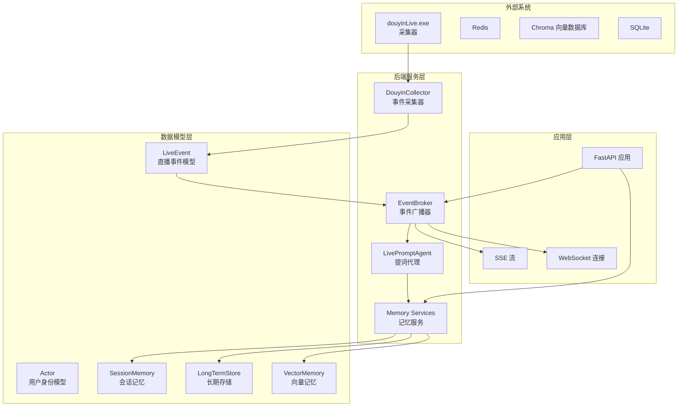
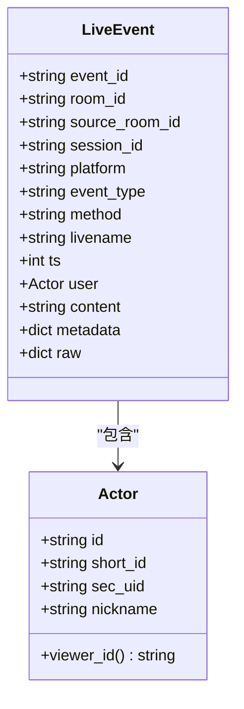
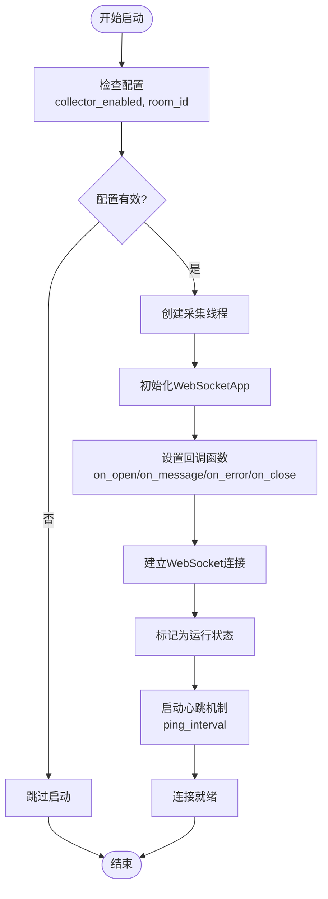
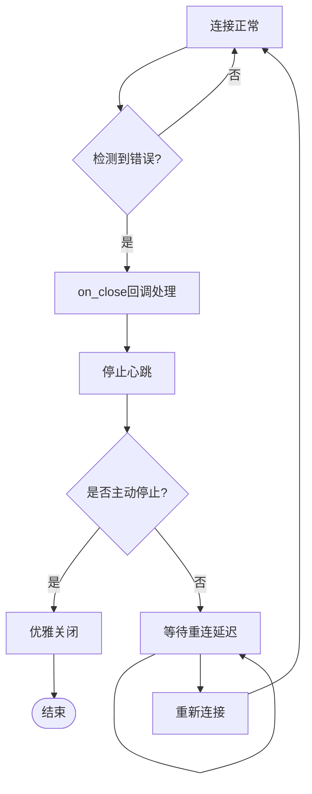
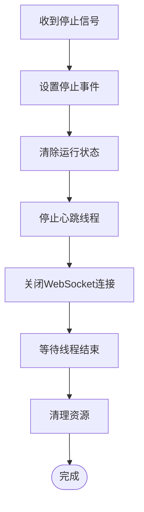
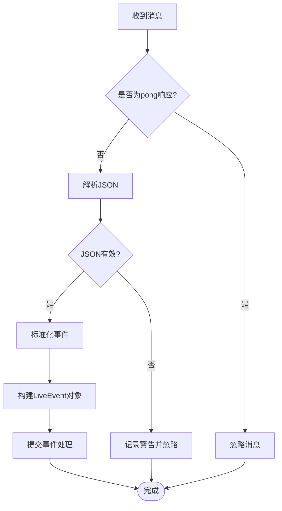
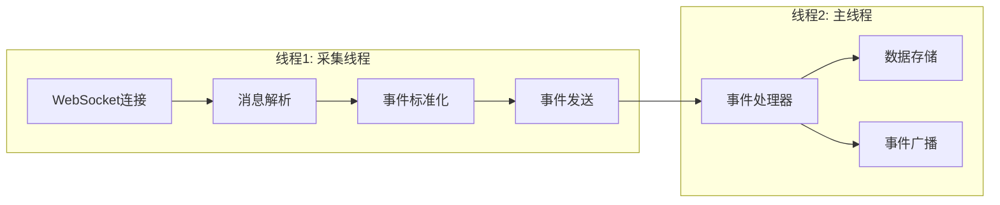
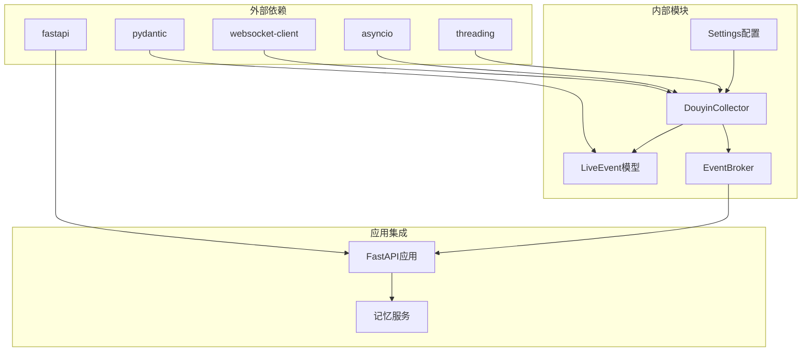

# 事件采集器

<cite>
**本文引用的文件**
- [backend/services/collector.py](file://backend/services/collector.py)
- [backend/schemas/live.py](file://backend/schemas/live.py)
- [backend/app.py](file://backend/app.py)
- [backend/config.py](file://backend/config.py)
- [backend/services/broker.py](file://backend/services/broker.py)
- [README.md](file://README.md)
- [tests/test_empty_room_bootstrap.py](file://tests/test_empty_room_bootstrap.py)
</cite>

## 目录
1. [简介](#简介)
2. [项目结构](#项目结构)
3. [核心组件](#核心组件)
4. [架构概览](#架构概览)
5. [详细组件分析](#详细组件分析)
6. [依赖关系分析](#依赖关系分析)
7. [性能考量](#性能考量)
8. [故障排除指南](#故障排除指南)
9. [结论](#结论)
10. [附录](#附录)

## 简介

DouYin_llm事件采集器(DouyinCollector)是Live Prompter Stack的核心组件之一，负责从douyinLive WebSocket服务器接收直播事件数据，将其标准化为统一的LiveEvent格式，并通过异步事件循环传递给后端处理系统。该组件采用多线程架构设计，实现了可靠的WebSocket连接管理、心跳保持、断线重连和优雅关闭机制。

该采集器主要处理以下类型的直播事件：
- 弹幕评论(WebcastChatMessage)
- 礼物赠送(WebcastGiftMessage)  
- 点赞行为(WebcastLikeMessage)
- 成员加入(WebcastMemberMessage)
- 关注行为(WebcastSocialMessage)

## 项目结构

该项目采用分层架构设计，主要包含以下核心模块：



**图表来源**
- [backend/services/collector.py:1-266](file://backend/services/collector.py#L1-L266)
- [backend/app.py:1-285](file://backend/app.py#L1-L285)

**章节来源**
- [backend/services/collector.py:1-266](file://backend/services/collector.py#L1-L266)
- [backend/app.py:1-285](file://backend/app.py#L1-L285)

## 核心组件

### DouyinCollector类

DouyinCollector是事件采集器的核心实现，负责管理WebSocket连接和事件处理逻辑。其主要特性包括：

- **多线程架构**：使用独立线程处理WebSocket连接，避免阻塞主事件循环
- **心跳管理**：通过WebSocket内置的ping_interval参数维持连接活跃
- **自动重连**：断线后按指数退避策略进行重连
- **事件标准化**：将原始消息转换为统一的LiveEvent格式

### LiveEvent数据模型

LiveEvent是系统中统一的数据模型，定义了所有直播事件的标准结构：



**图表来源**
- [backend/schemas/live.py:29-44](file://backend/schemas/live.py#L29-L44)
- [backend/schemas/live.py:8-26](file://backend/schemas/live.py#L8-L26)

**章节来源**
- [backend/services/collector.py:38-266](file://backend/services/collector.py#L38-L266)
- [backend/schemas/live.py:1-111](file://backend/schemas/live.py#L1-L111)

## 架构概览

事件采集器在整个系统中的位置和交互关系如下：

```mermaid
sequenceDiagram
participant Tool as douyinLive.exe
participant Collector as DouyinCollector
participant WS as WebSocket服务器
participant Loop as asyncio事件循环
participant Broker as EventBroker
participant Frontend as 前端应用
Tool->>WS : 发送直播事件
WS->>Collector : 建立WebSocket连接
Collector->>WS : 接收原始消息
Collector->>Collector : 解析JSON消息
Collector->>Collector : 标准化为LiveEvent
Collector->>Loop : 提交事件处理
Loop->>Broker : 转发事件
Broker->>Frontend : 推送SSE/WebSocket
Note over Collector,WS : 心跳保持和断线重连
WS-->>Collector : pong响应
Collector->>WS : 定期ping
```

**图表来源**
- [backend/services/collector.py:118-140](file://backend/services/collector.py#L118-L140)
- [backend/app.py:73-102](file://backend/app.py#L73-L102)

## 详细组件分析

### WebSocket连接管理机制

#### 连接建立流程



**图表来源**
- [backend/services/collector.py:61-79](file://backend/services/collector.py#L61-L79)
- [backend/services/collector.py:118-140](file://backend/services/collector.py#L118-L140)

#### 心跳保持机制

DouyinCollector使用WebSocket的内置心跳机制来维持连接活跃：

- **心跳间隔**：通过`collector_ping_interval_seconds`配置，默认30秒
- **心跳类型**：使用WebSocket的ping帧而非文本消息
- **心跳线程**：虽然代码中声明了ping_thread字段，但实际使用的是WebSocket的内置心跳机制

#### 断线重连策略



**图表来源**
- [backend/services/collector.py:137-140](file://backend/services/collector.py#L137-L140)
- [backend/services/collector.py:167-180](file://backend/services/collector.py#L167-L180)

#### 优雅关闭流程



**图表来源**
- [backend/services/collector.py:100-117](file://backend/services/collector.py#L100-L117)

### 事件解析和标准化过程

#### JSON消息处理

事件采集器对收到的WebSocket消息进行严格的JSON解析和验证：



**图表来源**
- [backend/services/collector.py:145-159](file://backend/services/collector.py#L145-L159)

#### 数据提取和LiveEvent构建

事件标准化过程根据不同的事件类型提取相应的数据：

| 事件类型 | 提取字段 | 特殊处理 |
|---------|---------|---------|
| WebcastChatMessage | content, user信息 | 标准弹幕内容 |
| WebcastGiftMessage | gift信息, repeatCount, comboCount, groupCount | 计算礼物数量 |
| WebcastLikeMessage | user信息 | 设置action为"like" |
| WebcastMemberMessage | user信息 | 设置action为"join" |
| WebcastSocialMessage | user信息 | 设置action为"follow" |

**章节来源**
- [backend/services/collector.py:145-266](file://backend/services/collector.py#L145-L266)

### 多线程架构设计

#### 主线程职责

DouyinCollector采用双线程架构：

- **采集线程**：专门负责WebSocket连接管理、消息接收和事件转发
- **主线程**：由FastAPI应用提供，负责事件处理和业务逻辑



**图表来源**
- [backend/services/collector.py:61-79](file://backend/services/collector.py#L61-L79)
- [backend/services/collector.py:182-188](file://backend/services/collector.py#L182-L188)

#### 线程间通信机制

事件在两个线程之间通过以下方式进行安全通信：

1. **异步事件循环**：使用`asyncio.run_coroutine_threadsafe`确保线程安全
2. **回调机制**：WebSocket回调在采集线程中触发，但事件处理在主线程中执行
3. **事件队列**：通过EventBroker进行事件广播，支持多个订阅者

**章节来源**
- [backend/services/collector.py:182-196](file://backend/services/collector.py#L182-L196)

### 配置选项详解

#### 基础配置参数

| 参数名 | 默认值 | 类型 | 作用 | 最佳实践 |
|-------|--------|------|------|----------|
| `collector_enabled` | true | bool | 是否启用采集器 | 生产环境建议启用 |
| `room_id` | "" | string | 直播间ID | 必填，与采集器配置一致 |
| `collector_host` | "127.0.0.1" | string | 采集器主机地址 | 本地开发使用127.0.0.1 |
| `collector_port` | 1088 | int | 采集器端口号 | 与采集器配置一致 |

#### 连接管理参数

| 参数名 | 默认值 | 类型 | 作用 | 最佳实践 |
|-------|--------|------|------|----------|
| `collector_ping_interval_seconds` | 30 | float | 心跳间隔(秒) | 一般保持默认值 |
| `collector_reconnect_delay_seconds` | 3 | float | 重连延迟(秒) | 根据网络状况调整 |

#### 环境变量配置

```bash
# 直播采集配置
ROOM_ID=your_room_id
COLLECTOR_ENABLED=true
COLLECTOR_HOST=127.0.0.1
COLLECTOR_PORT=1088
COLLECTOR_PING_INTERVAL_SECONDS=30
COLLECTOR_RECONNECT_DELAY_SECONDS=3

# 后端进程配置
APP_HOST=127.0.0.1
APP_PORT=8010
```

**章节来源**
- [backend/config.py:40-76](file://backend/config.py#L40-L76)
- [README.md:95-142](file://README.md#L95-L142)

## 依赖关系分析

### 组件依赖图



**图表来源**
- [backend/services/collector.py:7-17](file://backend/services/collector.py#L7-L17)
- [backend/app.py:13-35](file://backend/app.py#L13-L35)

### 关键依赖关系

1. **WebSocket客户端**：用于与douyinLive服务器建立和维护连接
2. **Pydantic模型**：提供数据验证和序列化功能
3. **asyncio事件循环**：确保线程间安全通信
4. **EventBroker**：作为事件分发中心，连接前后端组件

**章节来源**
- [backend/services/collector.py:1-266](file://backend/services/collector.py#L1-L266)
- [backend/app.py:1-285](file://backend/app.py#L1-L285)

## 性能考量

### 连接性能优化

1. **心跳优化**：合理的ping_interval可以平衡连接稳定性和资源消耗
2. **重连策略**：指数退避算法避免在网络波动时造成过多重连请求
3. **线程池管理**：使用守护线程避免影响主程序退出

### 内存和资源管理

1. **事件队列容量**：EventBroker使用固定容量队列防止内存泄漏
2. **异常处理**：完善的异常捕获机制避免资源泄露
3. **连接池**：单实例设计减少连接开销

### 监控和诊断

1. **日志级别**：INFO级别的日志便于生产环境监控
2. **状态跟踪**：running标志和stop_event提供连接状态控制
3. **性能指标**：可通过日志分析连接成功率和重连频率

## 故障排除指南

### 常见问题及解决方案

#### 连接问题

| 问题症状 | 可能原因 | 解决方案 |
|---------|---------|---------|
| 无法连接到WebSocket | 网络配置错误 | 检查collector_host和collector_port |
| 连接频繁断开 | 网络不稳定 | 调整collector_ping_interval_seconds |
| 事件丢失 | 解析失败 | 检查JSON格式和METHOD_EVENT_TYPE_MAP |

#### 性能问题

| 问题症状 | 可能原因 | 解决方案 |
|---------|---------|---------|
| CPU占用过高 | 事件处理过慢 | 优化event_handler逻辑 |
| 内存泄漏 | 异常处理不当 | 检查异常捕获和资源清理 |
| 响应延迟 | 线程阻塞 | 确保异步事件处理 |

#### 日志分析

```python
# 关键日志类型
logger.info("Douyin collector started for room %s", room_id)
logger.warning("Douyin collector websocket error: %s", error)
logger.warning("Douyin collector disconnected, retrying in %.1fs", delay)
logger.exception("Douyin collector crashed")
```

**章节来源**
- [backend/services/collector.py:141-180](file://backend/services/collector.py#L141-L180)

### 调试技巧

1. **启用详细日志**：在开发环境中增加日志级别
2. **监控连接状态**：观察running标志和连接状态变化
3. **测试重连机制**：模拟网络中断验证重连逻辑
4. **验证事件处理**：检查event_handler的执行结果

## 结论

DouYin_llm事件采集器(DouyinCollector)是一个设计精良的实时事件处理组件，具有以下特点：

1. **可靠性**：完善的连接管理、心跳保持和断线重连机制
2. **可扩展性**：清晰的架构设计支持功能扩展和性能优化
3. **易用性**：简单的配置和使用方式，便于集成到现有系统
4. **可观测性**：丰富的日志记录和状态跟踪机制

该组件成功实现了从原始直播事件到标准化数据模型的转换，为后续的记忆存储、提词生成和前端展示提供了坚实的基础。

## 附录

### 使用示例

#### 初始化和启动

```python
# 创建事件处理器
async def process_event(event: LiveEvent):
    # 事件处理逻辑
    pass

# 创建采集器实例
collector = DouyinCollector(settings, process_event)

# 启动采集器
loop = asyncio.get_running_loop()
collector.start(loop)
```

#### 房间切换

```python
# 切换到新房间
collector.switch_room("new_room_id")

# 停止当前连接
collector.stop()
```

#### 配置最佳实践

1. **生产环境配置**：
   - 确保collector_enabled=true
   - 正确设置room_id与采集器配置一致
   - 根据网络状况调整心跳间隔

2. **监控配置**：
   - 启用详细日志记录
   - 定期检查连接状态
   - 监控事件处理性能

3. **故障恢复**：
   - 验证重连机制
   - 测试异常处理
   - 准备应急预案

**章节来源**
- [backend/app.py:105-117](file://backend/app.py#L105-L117)
- [tests/test_empty_room_bootstrap.py:25-47](file://tests/test_empty_room_bootstrap.py#L25-L47)