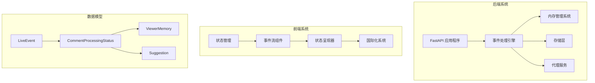
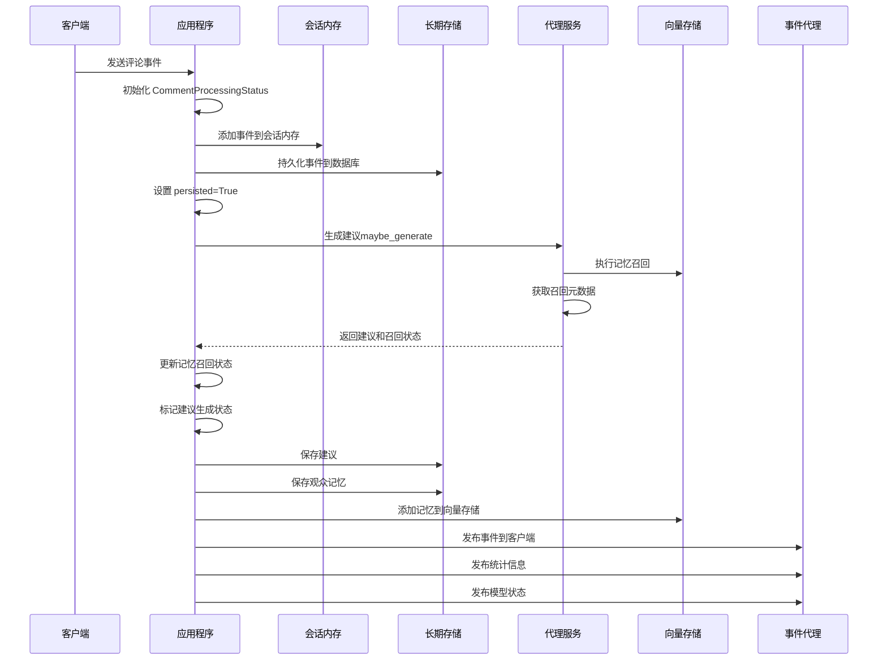
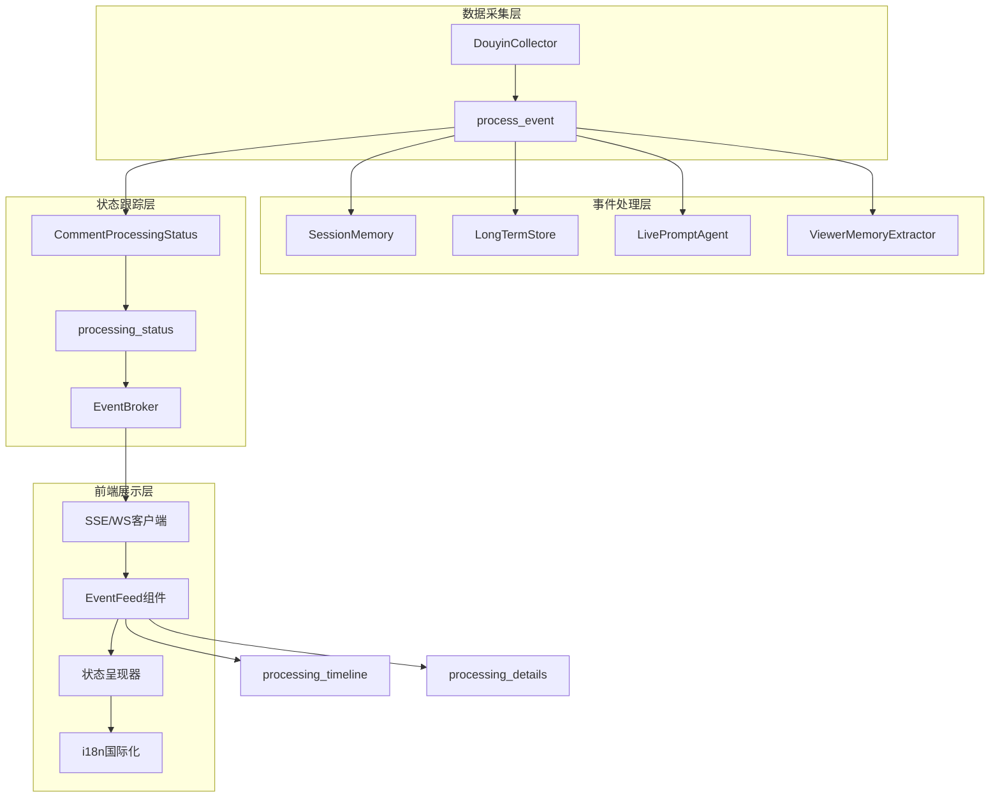
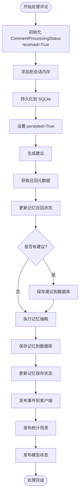
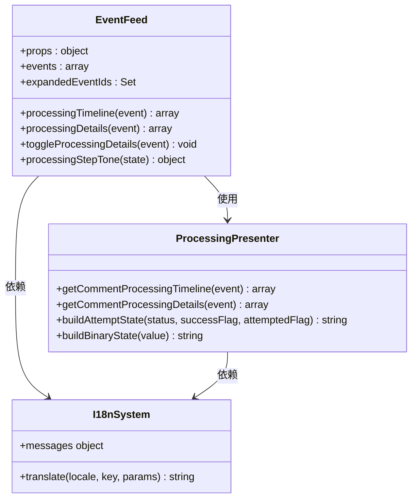
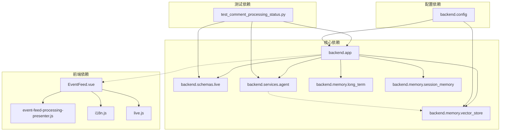

# 评论处理状态跟踪

<cite>
**本文档引用的文件**
- [backend/app.py](file://backend/app.py)
- [backend/schemas/live.py](file://backend/schemas/live.py)
- [backend/services/agent.py](file://backend/services/agent.py)
- [backend/memory/long_term.py](file://backend/memory/long_term.py)
- [backend/memory/session_memory.py](file://backend/memory/session_memory.py)
- [backend/memory/vector_store.py](file://backend/memory/vector_store.py)
- [backend/config.py](file://backend/config.py)
- [tests/test_comment_processing_status.py](file://tests/test_comment_processing_status.py)
- [frontend/src/components/EventFeed.vue](file://frontend/src/components/EventFeed.vue)
- [frontend/src/components/event-feed-processing-presenter.js](file://frontend/src/components/event-feed-processing-presenter.js)
- [frontend/src/stores/live.js](file://frontend/src/stores/live.js)
- [frontend/src/i18n.js](file://frontend/src/i18n.js)
- [docs/超能力计划/2026-04-15-评论处理状态.md](file://docs/超能力计划/2026-04-15-评论处理状态.md)
- [docs/超能力规格/2026-04-15-评论处理状态设计.md](file://docs/超能力规格/2026-04-15-评论处理状态设计.md)
</cite>

## 目录
1. [简介](#简介)
2. [项目结构](#项目结构)
3. [核心组件](#核心组件)
4. [架构概览](#架构概览)
5. [详细组件分析](#详细组件分析)
6. [依赖关系分析](#依赖关系分析)
7. [性能考虑](#性能考虑)
8. [故障排除指南](#故障排除指南)
9. [结论](#结论)

## 简介

评论处理状态跟踪是一个端到端的系统，用于在直播评论处理流程中提供实时的状态可视化。该系统能够在前端事件流中为每一条新评论显示其后端处理轨迹，包括落库、记忆抽取/保存、记忆召回、提词生成等关键步骤。

该功能采用"评论为中心"的设计理念，专注于展示单条评论在其生命周期内的处理状态，而不涉及观众整体状态的聚合视图。系统通过在现有的事件处理链路中注入状态跟踪信息，实现了对评论处理过程的透明化监控。

## 项目结构

该项目采用前后端分离的架构设计，主要分为以下几个核心模块：

**图表来源**
- [backend/app.py:73-120](file://backend/app.py#L73-L120)
- [frontend/src/components/EventFeed.vue:1-359](file://frontend/src/components/EventFeed.vue#L1-L359)

**章节来源**
- [backend/app.py:1-303](file://backend/app.py#L1-L303)
- [frontend/src/components/EventFeed.vue:1-359](file://frontend/src/components/EventFeed.vue#L1-L359)

## 核心组件

### 数据模型层

系统的核心数据模型围绕评论处理状态展开，主要包括以下关键组件：

#### CommentProcessingStatus 模型
这是评论处理状态跟踪的核心数据结构，定义了评论在整个处理流程中的各个阶段状态：

| 字段名称 | 类型 | 默认值 | 描述 |
|---------|------|--------|------|
| received | bool | False | 后端已接收并开始处理这条评论 |
| persisted | bool | False | 评论事件已成功写入 SQLite |
| memory_extraction_attempted | bool | False | 已对这条评论执行过记忆抽取 |
| memory_saved | bool | False | 这条评论至少保存出了一条观众记忆 |
| saved_memory_ids | list[str] | [] | 本条评论新保存出来的观众记忆 ID 列表 |
| memory_recall_attempted | bool | False | 提词生成过程中已尝试做观众记忆召回 |
| memory_recalled | bool | False | 这条评论在生成上下文时命中了至少一条观众记忆 |
| recalled_memory_ids | list[str] | [] | 命中的观众记忆 ID 列表 |
| suggestion_generated | bool | False | 这条评论最终生成了提词 |
| suggestion_id | str | "" | 生成的提词 ID |

#### LiveEvent 扩展
在原有的 LiveEvent 模型基础上增加了 processing_status 字段，使其能够承载完整的处理状态信息。

**章节来源**
- [backend/schemas/live.py:81-94](file://backend/schemas/live.py#L81-L94)
- [backend/schemas/live.py:29-45](file://backend/schemas/live.py#L29-L45)

### 后端处理引擎

后端的事件处理流程经过精心设计，确保每个处理步骤都能准确反映在状态跟踪中：

**图表来源**
- [backend/app.py:73-120](file://backend/app.py#L73-L120)
- [backend/services/agent.py:105-153](file://backend/services/agent.py#L105-L153)

**章节来源**
- [backend/app.py:73-120](file://backend/app.py#L73-L120)
- [backend/services/agent.py:89-131](file://backend/services/agent.py#L89-L131)

### 前端展示层

前端系统提供了直观的状态可视化界面，包括紧凑的状态标签和详细的调试信息：

#### 状态标签系统
前端为评论事件提供了四个核心状态标签：
- 已落库/未落库：显示评论是否成功写入数据库
- 已保存记忆/未产出记忆：显示是否从评论中提取并保存了观众记忆
- 命中召回/未命中召回：显示记忆召回是否成功
- 已生成提词/未生成提词：显示是否为评论生成了回复建议

#### 详细信息面板
用户可以通过展开按钮查看更详细的处理信息，包括具体的记忆 ID、召回 ID 和建议 ID。

**章节来源**
- [frontend/src/components/EventFeed.vue:272-344](file://frontend/src/components/EventFeed.vue#L272-L344)
- [frontend/src/components/event-feed-processing-presenter.js:28-71](file://frontend/src/components/event-feed-processing-presenter.js#L28-L71)

## 架构概览

系统采用事件驱动的架构模式，通过 SSE（Server-Sent Events）和 WebSocket 实现实时数据传输：

**图表来源**
- [backend/app.py:123-123](file://backend/app.py#L123-L123)
- [backend/app.py:27-35](file://backend/app.py#L27-L35)
- [frontend/src/stores/live.js:496-522](file://frontend/src/stores/live.js#L496-L522)

**章节来源**
- [backend/app.py:27-35](file://backend/app.py#L27-L35)
- [frontend/src/stores/live.js:474-523](file://frontend/src/stores/live.js#L474-L523)

## 详细组件分析

### 后端事件处理流程

#### process_event 函数分析
process_event 是整个评论处理状态跟踪的核心函数，负责协调所有处理步骤：

**图表来源**
- [backend/app.py:73-120](file://backend/app.py#L73-L120)

#### 代理服务的召回元数据机制
代理服务通过 consume_last_generation_metadata 方法提供召回状态信息：

**章节来源**
- [backend/app.py:73-120](file://backend/app.py#L73-L120)
- [backend/services/agent.py:62-65](file://backend/services/agent.py#L62-L65)
- [backend/services/agent.py:121-131](file://backend/services/agent.py#L121-L131)

### 前端状态呈现系统

#### EventFeed 组件分析
EventFeed 组件负责渲染评论事件及其处理状态：

**图表来源**
- [frontend/src/components/EventFeed.vue:115-177](file://frontend/src/components/EventFeed.vue#L115-L177)
- [frontend/src/components/event-feed-processing-presenter.js:1-129](file://frontend/src/components/event-feed-processing-presenter.js#L1-L129)

#### 状态转换逻辑
前端状态呈现器实现了智能的状态转换逻辑，能够根据不同的处理阶段显示相应的内容：

**章节来源**
- [frontend/src/components/EventFeed.vue:115-177](file://frontend/src/components/EventFeed.vue#L115-L177)
- [frontend/src/components/event-feed-processing-presenter.js:14-26](file://frontend/src/components/event-feed-processing-presenter.js#L14-L26)

### 存储层集成

#### 长期存储与会话内存的协作
系统通过长期存储（SQLite）和会话内存（Redis/内存）的协作，确保状态信息的完整性和实时性：

**章节来源**
- [backend/memory/long_term.py:454-488](file://backend/memory/long_term.py#L454-L488)
- [backend/memory/session_memory.py:42-84](file://backend/memory/session_memory.py#L42-L84)

## 依赖关系分析

系统各组件之间的依赖关系体现了清晰的关注点分离：

**图表来源**
- [backend/app.py:13-23](file://backend/app.py#L13-L23)
- [frontend/src/components/EventFeed.vue:1-8](file://frontend/src/components/EventFeed.vue#L1-L8)

**章节来源**
- [backend/app.py:13-23](file://backend/app.py#L13-L23)
- [frontend/src/components/EventFeed.vue:1-8](file://frontend/src/components/EventFeed.vue#L1-L8)

## 性能考虑

### 内存优化策略
系统采用了多种内存优化策略来确保高性能运行：

1. **会话内存限制**：短期会话内存使用固定大小的双端队列，限制最大容量为120个事件
2. **Redis 降级机制**：当 Redis 不可用时，自动降级到进程内内存存储
3. **向量存储优化**：向量存储使用本地哈希嵌入函数作为回退方案

### 数据库性能优化
- SQLite 使用事务批量操作减少磁盘 I/O
- 合理的索引设计优化查询性能
- 事件历史的分页查询避免内存溢出

### 实时通信优化
- SSE 连接池管理
- 事件过滤和路由优化
- 前端虚拟滚动提升大列表渲染性能

## 故障排除指南

### 常见问题诊断

#### 评论状态不显示
可能原因：
1. 事件不是评论类型（event_type !== "comment"）
2. processing_status 字段为空
3. 前端过滤器屏蔽了该事件

#### 状态信息不完整
可能原因：
1. 事件处理过程中途失败
2. 某些处理步骤被跳过
3. 数据库写入失败

#### 性能问题
可能原因：
1. Redis 连接异常导致降级
2. 向量存储初始化失败
3. 前端渲染大量事件

**章节来源**
- [tests/test_comment_processing_status.py:29-104](file://tests/test_comment_processing_status.py#L29-L104)

### 调试工具和方法

#### 后端调试
- 查看日志输出确认事件处理流程
- 使用单元测试验证状态跟踪逻辑
- 检查数据库状态确认持久化完整性

#### 前端调试
- 使用浏览器开发者工具检查事件流
- 验证状态呈现器的数据转换
- 检查国际化资源加载情况

## 结论

评论处理状态跟踪系统成功实现了对直播评论处理过程的全面可视化监控。通过精心设计的架构和实现，系统能够在不影响现有功能的前提下，为用户提供实时的处理状态反馈。

该系统的主要优势包括：

1. **非侵入式设计**：通过在现有事件处理链路中注入状态跟踪，避免了对核心业务逻辑的干扰
2. **实时性保障**：采用 SSE 和 WebSocket 技术确保状态信息的实时传递
3. **用户体验优化**：提供直观的状态标签和详细的调试信息
4. **性能优化**：通过多种优化策略确保系统的高效运行
5. **可扩展性**：模块化的架构设计便于未来功能扩展

该系统为直播场景下的评论处理提供了强有力的技术支撑，有助于提高运营效率和用户体验质量。