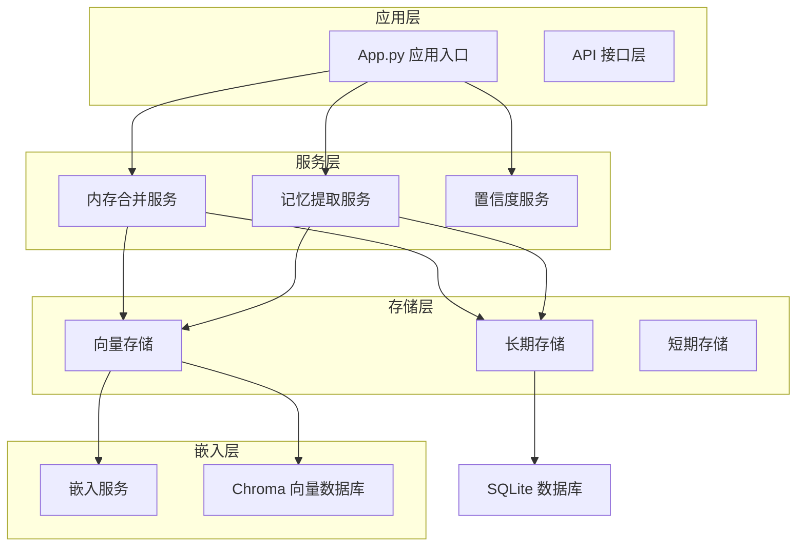
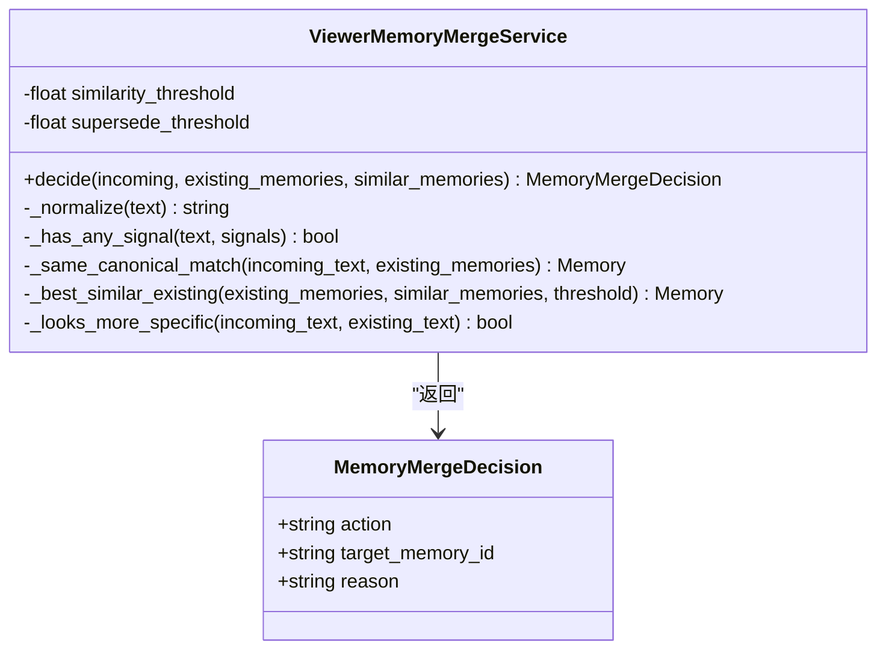
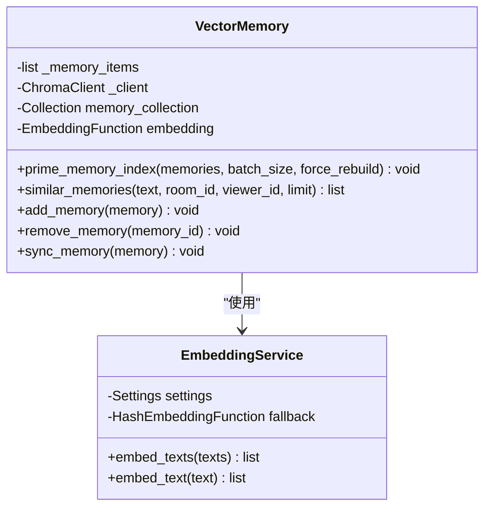
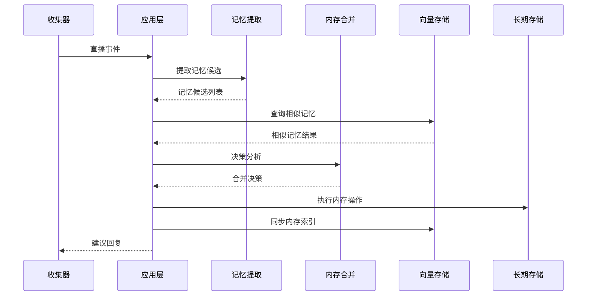
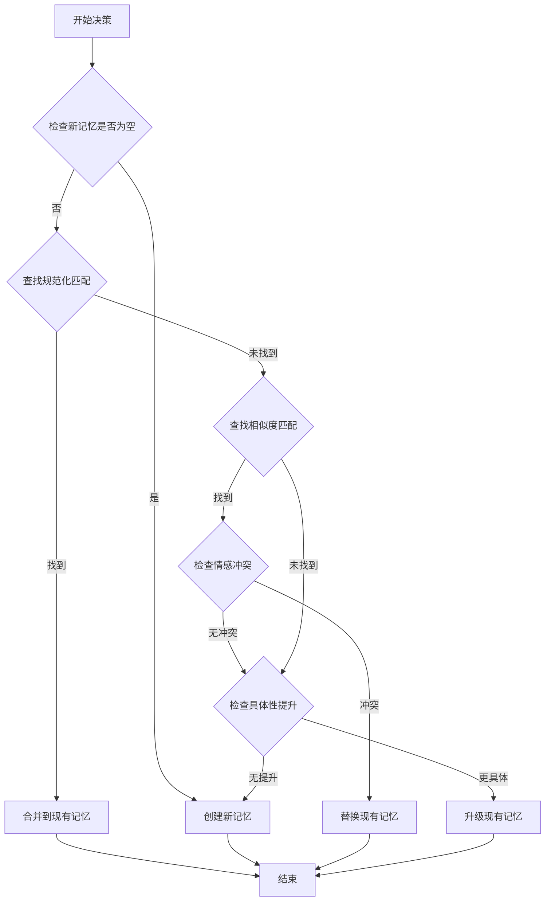
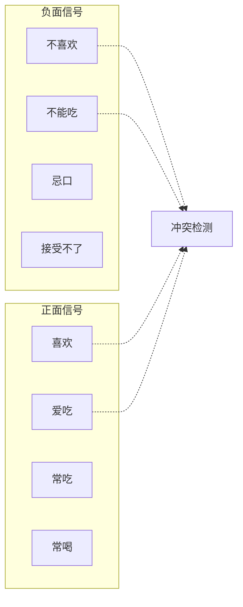
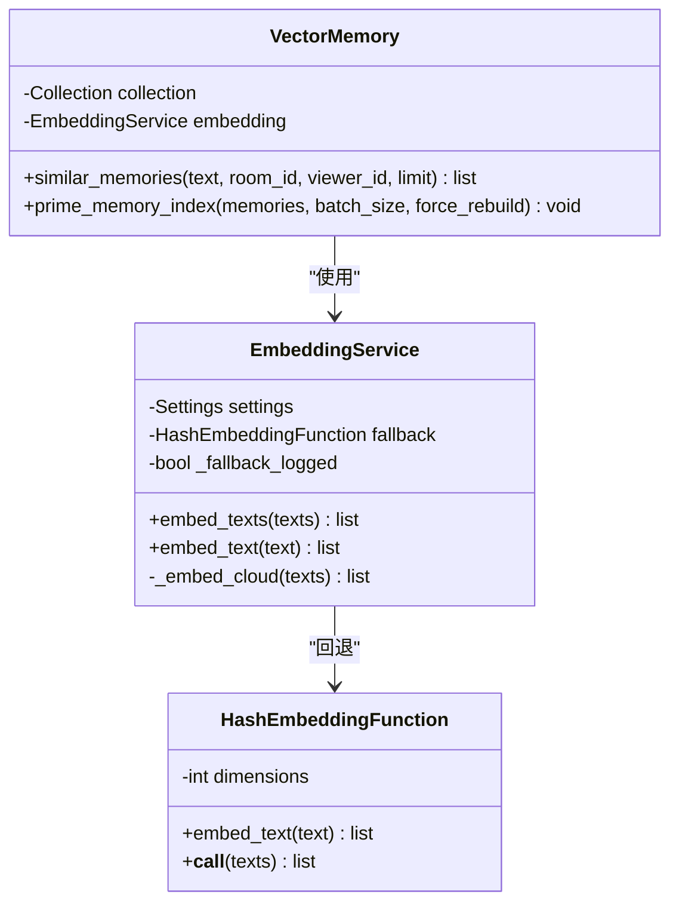
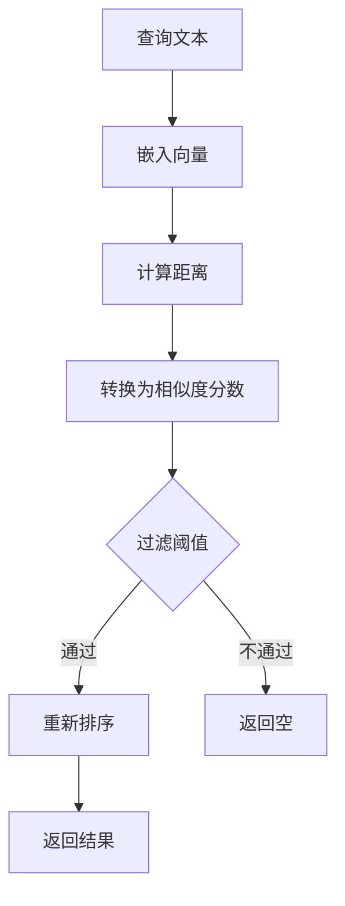
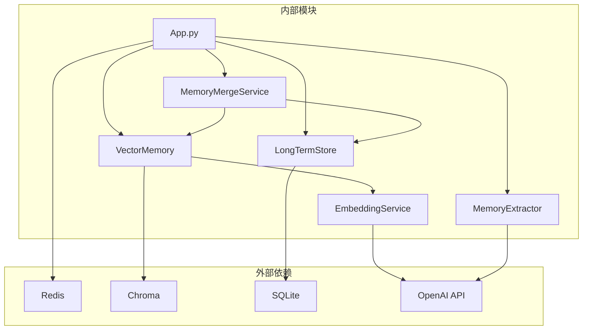

# 内存合并服务

<cite>
**本文档引用的文件**
- [memory_merge_service.py](file://backend/services/memory_merge_service.py)
- [vector_store.py](file://backend/memory/vector_store.py)
- [long_term.py](file://backend/memory/long_term.py)
- [embedding_service.py](file://backend/memory/embedding_service.py)
- [live.py](file://backend/schemas/live.py)
- [app.py](file://backend/app.py)
- [config.py](file://backend/config.py)
- [test_memory_merge_service.py](file://tests/test_memory_merge_service.py)
- [test_vector_store.py](file://tests/test_vector_store.py)
- [memory_confidence_service.py](file://backend/services/memory_confidence_service.py)
- [memory_extractor.py](file://backend/services/memory_extractor.py)
- [llm_memory_extractor.py](file://backend/services/llm_memory_extractor.py)
</cite>

## 目录
1. [简介](#简介)
2. [项目结构](#项目结构)
3. [核心组件](#核心组件)
4. [架构概览](#架构概览)
5. [详细组件分析](#详细组件分析)
6. [依赖关系分析](#依赖关系分析)
7. [性能考虑](#性能考虑)
8. [故障排除指南](#故障排除指南)
9. [结论](#结论)

## 简介

内存合并服务是抖音直播场景中用于智能管理观众记忆的核心组件。该服务通过分析新提取的记忆候选，结合现有记忆和相似记忆，自动决定是创建新记忆、合并现有记忆、升级现有记忆还是替换冲突记忆。

该系统采用多层决策机制，包括规范化文本匹配、相似度阈值比较、情感信号检测和具体性评估，确保记忆管理的准确性和一致性。

## 项目结构

该项目采用模块化架构设计，主要分为以下几个层次：

**图表来源**
- [app.py:175-229](file://backend/app.py#L175-L229)
- [memory_merge_service.py:30-120](file://backend/services/memory_merge_service.py#L30-L120)
- [vector_store.py:59-396](file://backend/memory/vector_store.py#L59-L396)

**章节来源**
- [app.py:175-229](file://backend/app.py#L175-L229)
- [config.py:65-158](file://backend/config.py#L65-L158)

## 核心组件

### 内存合并决策服务

内存合并决策服务是整个系统的核心，负责根据多种策略自动选择最佳的记忆处理方式：

**图表来源**
- [memory_merge_service.py:23-120](file://backend/services/memory_merge_service.py#L23-L120)

### 向量记忆存储

向量记忆存储提供语义搜索和相似度计算功能：

**图表来源**
- [vector_store.py:59-396](file://backend/memory/vector_store.py#L59-L396)
- [embedding_service.py:13-86](file://backend/memory/embedding_service.py#L13-L86)

**章节来源**
- [memory_merge_service.py:30-120](file://backend/services/memory_merge_service.py#L30-L120)
- [vector_store.py:59-396](file://backend/memory/vector_store.py#L59-L396)

## 架构概览

内存合并服务在整个直播系统中的位置和交互关系如下：

**图表来源**
- [app.py:249-405](file://backend/app.py#L249-L405)
- [memory_merge_service.py:82-120](file://backend/services/memory_merge_service.py#L82-L120)

## 详细组件分析

### 内存合并决策算法

内存合并服务实现了四种子决策策略：

#### 1. 规范化文本匹配
当新记忆与现有记忆在规范化后的文本完全相同时，执行合并操作：

**图表来源**
- [memory_merge_service.py:82-120](file://backend/services/memory_merge_service.py#L82-L120)

#### 2. 相似度阈值比较
使用两个不同的阈值来区分升级和替换操作：

- **升级阈值 (0.88)**: 当新记忆与现有记忆相似度达到此阈值时，如果新记忆更加具体，则升级现有记忆
- **替换阈值 (0.82)**: 当新记忆与现有记忆相似度达到此阈值时，如果存在情感方向冲突，则替换现有记忆

#### 3. 情感信号检测
系统内置正负面情感信号词典，用于检测记忆的情感方向：

**图表来源**
- [memory_merge_service.py:5-20](file://backend/services/memory_merge_service.py#L5-L20)

**章节来源**
- [memory_merge_service.py:30-120](file://backend/services/memory_merge_service.py#L30-L120)

### 向量存储和嵌入服务

#### 嵌入服务架构
嵌入服务提供了云服务和本地回退两种模式：

**图表来源**
- [embedding_service.py:13-86](file://backend/memory/embedding_service.py#L13-L86)
- [vector_store.py:34-57](file://backend/memory/vector_store.py#L34-L57)

#### 相似度计算算法
向量存储实现了基于余弦距离的相似度计算：

**图表来源**
- [vector_store.py:107-121](file://backend/memory/vector_store.py#L107-L121)
- [vector_store.py:328-396](file://backend/memory/vector_store.py#L328-L396)

**章节来源**
- [embedding_service.py:13-86](file://backend/memory/embedding_service.py#L13-L86)
- [vector_store.py:59-396](file://backend/memory/vector_store.py#L59-L396)

### 记忆置信度评分

记忆置信度服务为新创建的记忆提供初始置信度评分：

| 评分维度 | 权重 | 说明 |
|---------|------|------|
| 稳定性 (Stability) | 35% | 长期记忆 vs 短期记忆，偏好长期记忆 |
| 交互价值 (Interaction) | 35% | 记忆的重要性和实用性 |
| 清晰度 (Clarity) | 15% | 记忆表达的清晰程度 |
| 证据 (Evidence) | 15% | 记忆的证据数量和确认时间 |

**章节来源**
- [memory_confidence_service.py:4-118](file://backend/services/memory_confidence_service.py#L4-L118)

## 依赖关系分析

**图表来源**
- [app.py:175-229](file://backend/app.py#L175-L229)
- [vector_store.py:10-14](file://backend/memory/vector_store.py#L10-L14)

**章节来源**
- [app.py:175-229](file://backend/app.py#L175-L229)
- [config.py:91-104](file://backend/config.py#L91-L104)

## 性能考虑

### 缓存策略
- **短期存储**: 使用 Redis 或进程内队列缓存最近事件和建议
- **向量索引**: 预热内存索引，避免重复嵌入计算
- **配置缓存**: 配置参数缓存，减少磁盘访问

### 查询优化
- **批量处理**: 向量嵌入和索引更新采用批量模式
- **采样验证**: 集合样本验证避免全量重建
- **阈值过滤**: 早期过滤低相似度结果

### 内存管理
- **索引大小限制**: 维护最近3000条记忆的索引
- **集合重建**: 智能检测和重建过期集合
- **资源清理**: 及时清理无效和删除的记忆

## 故障排除指南

### 常见问题及解决方案

#### 1. 向量数据库连接失败
**症状**: `Chroma is unavailable` 警告
**解决方案**:
- 检查 Chroma 安装和配置
- 验证数据目录权限
- 启用严格模式或使用回退方案

#### 2. 嵌入服务调用失败
**症状**: 嵌入 API 调用异常
**解决方案**:
- 检查网络连接和 API 密钥
- 验证嵌入模型配置
- 查看严格模式设置

#### 3. 内存合并决策异常
**症状**: 记忆处理不符合预期
**解决方案**:
- 检查阈值配置 (similarity_threshold, supersede_threshold)
- 验证情感信号词典
- 审核规范化处理逻辑

**章节来源**
- [vector_store.py:86-100](file://backend/memory/vector_store.py#L86-L100)
- [embedding_service.py:22-26](file://backend/memory/embedding_service.py#L22-L26)

## 结论

内存合并服务通过智能化的决策算法和高效的存储架构，为直播场景提供了强大的观众记忆管理能力。系统的主要优势包括：

1. **多层决策机制**: 结合规范化匹配、相似度比较、情感检测和具体性评估
2. **弹性架构设计**: 支持云服务和本地回退，确保系统稳定性
3. **高性能实现**: 优化的向量索引和缓存策略
4. **可扩展性**: 模块化设计便于功能扩展和维护

该服务为直播平台的个性化推荐和智能互动提供了坚实的基础，能够有效提升用户体验和平台价值。