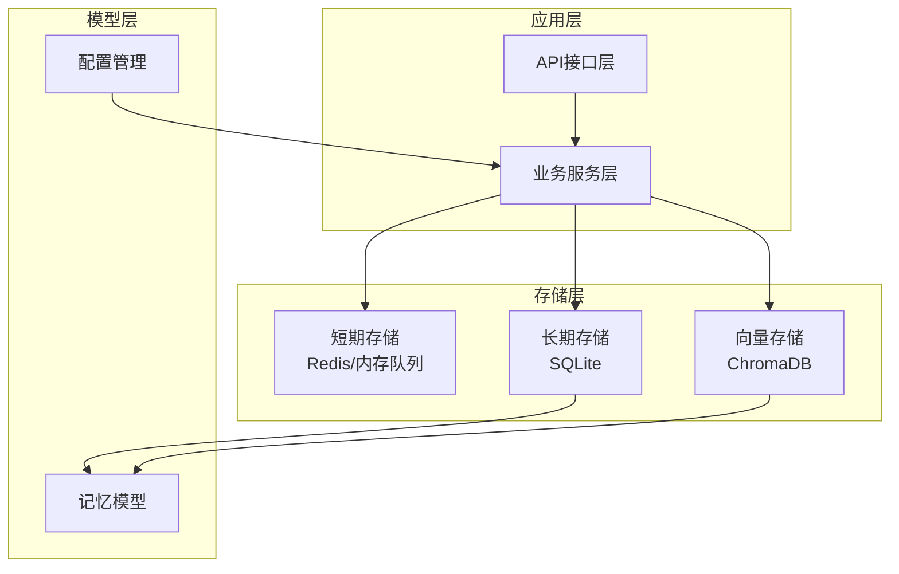
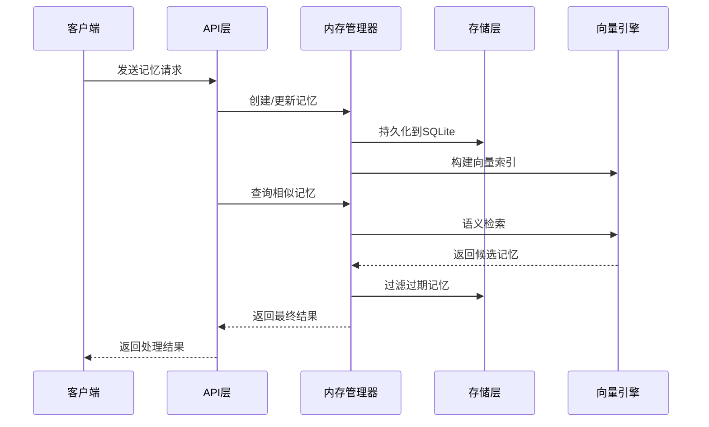
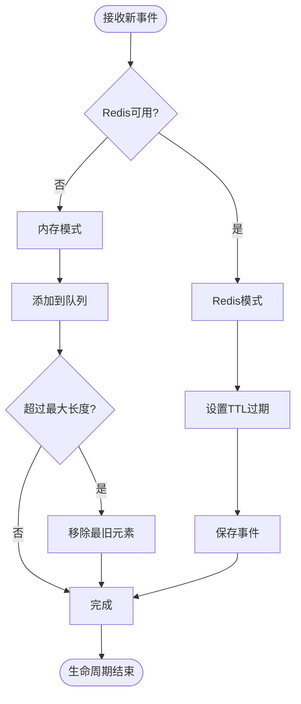
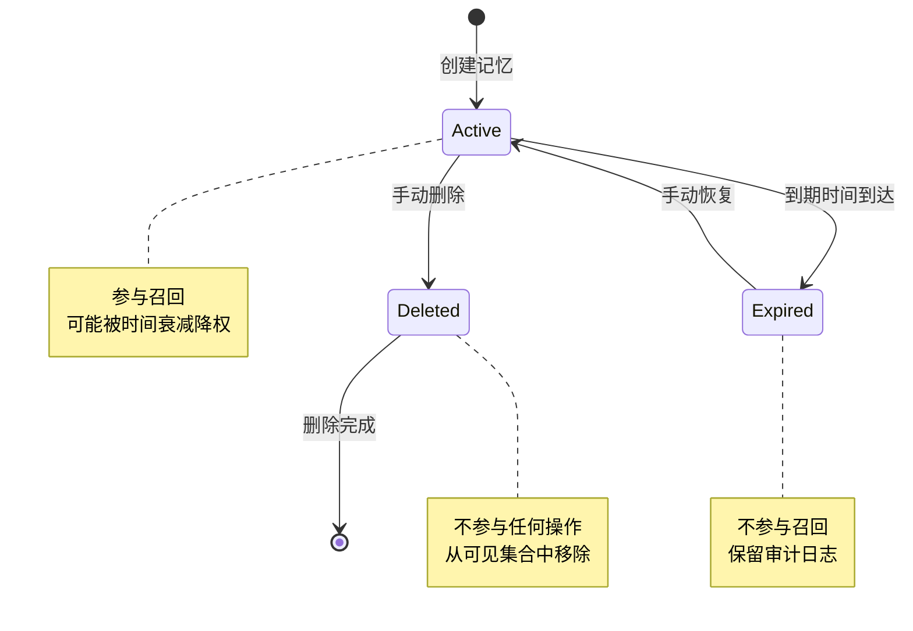
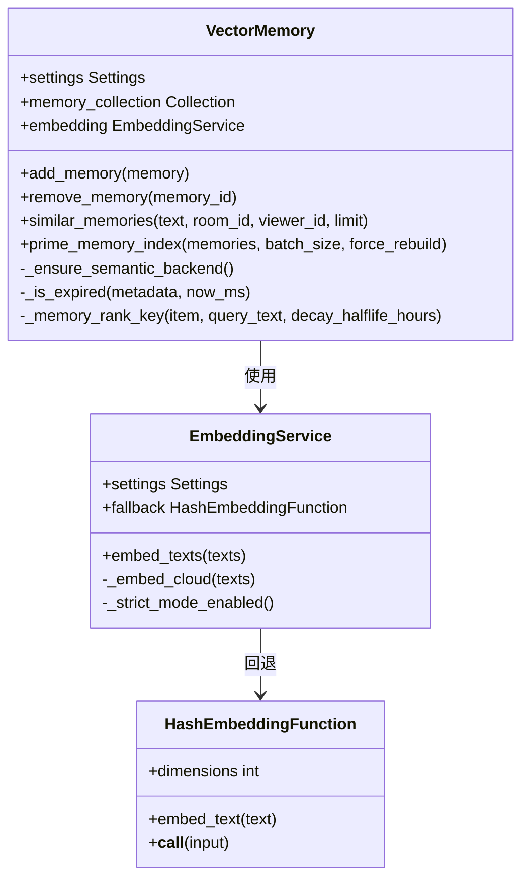
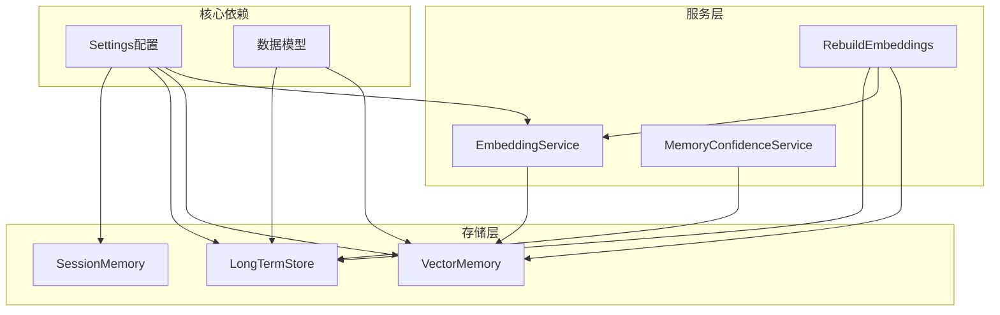

# 内存生命周期管理

<cite>
**本文档引用的文件**
- [backend/memory/session_memory.py](file://backend/memory/session_memory.py)
- [backend/memory/vector_store.py](file://backend/memory/vector_store.py)
- [backend/memory/long_term.py](file://backend/memory/long_term.py)
- [backend/memory/embedding_service.py](file://backend/memory/embedding_service.py)
- [backend/memory/rebuild_embeddings.py](file://backend/memory/rebuild_embeddings.py)
- [backend/schemas/live.py](file://backend/schemas/live.py)
- [backend/config.py](file://backend/config.py)
- [backend/services/memory_confidence_service.py](file://backend/services/memory_confidence_service.py)
- [docs/superpowers/specs/2026-04-20-memory-lifecycle-management-design.md](file://docs/superpowers/specs/2026-04-20-memory-lifecycle-management-design.md)
- [docs/superpowers/plans/2026-04-20-memory-lifecycle-management.md](file://docs/superpowers/plans/2026-04-20-memory-lifecycle-management.md)
- [tests/test_long_term.py](file://tests/test_long_term.py)
- [tests/test_vector_store.py](file://tests/test_vector_store.py)
</cite>

## 目录
1. [简介](#简介)
2. [项目结构](#项目结构)
3. [核心组件](#核心组件)
4. [架构概览](#架构概览)
5. [详细组件分析](#详细组件分析)
6. [依赖关系分析](#依赖关系分析)
7. [性能考虑](#性能考虑)
8. [故障排除指南](#故障排除指南)
9. [结论](#结论)

## 简介

本项目实现了完整的内存生命周期管理系统，专门针对直播场景下的观众记忆进行管理。系统通过多层架构设计，确保记忆数据能够在不同时间尺度上有效管理，避免短期记忆长期污染长期记忆池。

系统的核心设计理念是区分短期记忆（短期时效性）和长期记忆（稳定持久性），并通过明确的过期机制和状态管理来确保召回质量。该设计既保持了系统的向后兼容性，又为未来的双层记忆架构迁移做好了准备。

## 项目结构

项目采用分层架构设计，主要分为三个核心层次：

**图表来源**
- [backend/memory/session_memory.py:17-113](file://backend/memory/session_memory.py#L17-L113)
- [backend/memory/long_term.py:48-1613](file://backend/memory/long_term.py#L48-L1613)
- [backend/memory/vector_store.py:60-429](file://backend/memory/vector_store.py#L60-L429)

**章节来源**
- [backend/memory/session_memory.py:1-113](file://backend/memory/session_memory.py#L1-L113)
- [backend/memory/long_term.py:1-1613](file://backend/memory/long_term.py#L1-L1613)
- [backend/memory/vector_store.py:1-429](file://backend/memory/vector_store.py#L1-L429)

## 核心组件

### 1. 短期记忆管理器（SessionMemory）

短期记忆管理器负责处理直播过程中的实时事件和建议，支持Redis和内存两种存储模式：

- **Redis模式**：提供分布式缓存，支持TTL过期机制
- **内存模式**：使用deque数据结构，自动限制大小
- **事件窗口**：最多保存120条最近事件，建议窗口为40条

### 2. 长期存储管理器（LongTermStore）

长期存储管理器基于SQLite实现，提供完整的记忆持久化功能：

- **表结构设计**：包含事件、建议、观众档案、礼物记录等表
- **索引优化**：为常用查询建立复合索引
- **数据完整性**：支持事务处理和数据一致性保证

### 3. 向量存储管理器（VectorMemory）

向量存储管理器实现语义记忆检索功能：

- **嵌入服务**：支持云端和本地嵌入模型
- **索引管理**：基于ChromaDB的向量索引
- **召回算法**：结合语义相似度和时间衰减排序

**章节来源**
- [backend/memory/session_memory.py:17-113](file://backend/memory/session_memory.py#L17-L113)
- [backend/memory/long_term.py:48-1613](file://backend/memory/long_term.py#L48-L1613)
- [backend/memory/vector_store.py:60-429](file://backend/memory/vector_store.py#L60-L429)

## 架构概览

系统采用三层架构设计，每层都有明确的职责分工：

**图表来源**
- [backend/memory/long_term.py:529-563](file://backend/memory/long_term.py#L529-L563)
- [backend/memory/vector_store.py:356-429](file://backend/memory/vector_store.py#L356-L429)

## 详细组件分析

### 短期记忆生命周期管理

短期记忆通过SessionMemory类实现，具有以下特点：

#### 数据结构设计
- **事件队列**：使用`defaultdict(lambda: deque(maxlen=120))`管理每个房间的事件
- **建议队列**：使用`defaultdict(lambda: deque(maxlen=40))`管理建议
- **Redis支持**：自动检测Redis可用性并切换存储模式

#### 生命周期控制
- **TTL设置**：默认4小时（14400秒）
- **自动清理**：Redis模式下自动过期，内存模式下自动截断
- **容量限制**：超过最大长度时自动移除最旧的元素

**图表来源**
- [backend/memory/session_memory.py:17-113](file://backend/memory/session_memory.py#L17-L113)

**章节来源**
- [backend/memory/session_memory.py:17-113](file://backend/memory/session_memory.py#L17-L113)

### 长期记忆生命周期管理

长期记忆通过LongTermStore类实现，支持完整的生命周期管理：

#### 字段设计
根据设计文档，长期记忆需要增加以下字段：

| 字段名 | 类型 | 默认值 | 说明 |
|--------|------|--------|------|
| `lifecycle_kind` | TEXT | 'long_term' | 生命周期类型 |
| `expires_at` | INTEGER | 0 | 过期时间戳 |

#### 生命周期策略
1. **长期记忆**：`lifecycle_kind='long_term'`, `expires_at=0`
2. **短期记忆**：`lifecycle_kind='short_term'`, `expires_at=created_at + ttl`
3. **过期判断**：`is_expired = (expires_at > 0 and now_ms >= expires_at)`

#### 查询过滤
- `list_viewer_memories`：过滤已删除且未过期的记忆
- `list_all_viewer_memories`：默认过滤已删除且未过期的记忆
- `similar_memories`：在向量检索中排除过期记忆

**图表来源**
- [docs/superpowers/specs/2026-04-20-memory-lifecycle-management-design.md:119-132](file://docs/superpowers/specs/2026-04-20-memory-lifecycle-management-design.md#L119-L132)

**章节来源**
- [backend/memory/long_term.py:166-289](file://backend/memory/long_term.py#L166-L289)
- [docs/superpowers/specs/2026-04-20-memory-lifecycle-management-design.md:107-132](file://docs/superpowers/specs/2026-04-20-memory-lifecycle-management-design.md#L107-L132)

### 向量存储生命周期管理

向量存储通过VectorMemory类实现，支持语义记忆的生命周期管理：

#### 嵌入服务
- **云端嵌入**：支持OpenAI等云服务
- **本地回退**：使用哈希函数作为回退方案
- **严格模式**：失败时可以选择抛出异常

#### 索引管理
- **批量处理**：支持64条记录的批处理
- **增量更新**：只更新变化的数据
- **索引重建**：支持完整的索引重建流程

#### 召回过滤
在相似记忆检索中，系统会：
1. 检查记忆状态必须为`active`
2. 排除已过期的记忆
3. 应用时间衰减排序

**图表来源**
- [backend/memory/vector_store.py:60-429](file://backend/memory/vector_store.py#L60-L429)
- [backend/memory/embedding_service.py:13-86](file://backend/memory/embedding_service.py#L13-L86)

**章节来源**
- [backend/memory/vector_store.py:60-429](file://backend/memory/vector_store.py#L60-L429)
- [backend/memory/embedding_service.py:13-86](file://backend/memory/embedding_service.py#L13-L86)

### 配置管理

系统通过Settings类集中管理所有配置参数：

#### 关键配置参数
- `memory_short_term_ttl_hours`: 短期记忆TTL（默认72小时）
- `memory_decay_halflife_hours`: 时间衰减半衰期（默认168小时）
- `semantic_memory_min_score`: 最小语义分数（默认0.35）
- `semantic_memory_query_limit`: 查询限制（默认6）

#### 配置加载机制
- 支持环境变量配置
- 提供默认值保障
- 自动路径解析

**章节来源**
- [backend/config.py:65-164](file://backend/config.py#L65-L164)

## 依赖关系分析

系统各组件之间的依赖关系如下：

**图表来源**
- [backend/config.py:65-164](file://backend/config.py#L65-L164)
- [backend/memory/session_memory.py:17-113](file://backend/memory/session_memory.py#L17-L113)
- [backend/memory/long_term.py:48-1613](file://backend/memory/long_term.py#L48-L1613)
- [backend/memory/vector_store.py:60-429](file://backend/memory/vector_store.py#L60-L429)

**章节来源**
- [backend/config.py:65-164](file://backend/config.py#L65-L164)
- [backend/memory/session_memory.py:17-113](file://backend/memory/session_memory.py#L17-L113)
- [backend/memory/long_term.py:48-1613](file://backend/memory/long_term.py#L48-L1613)
- [backend/memory/vector_store.py:60-429](file://backend/memory/vector_store.py#L60-L429)

## 性能考虑

### 1. 缓存策略
- **短期记忆**：使用Redis或内存队列，支持TTL过期
- **长期记忆**：SQLite索引优化，支持批量查询
- **向量索引**：ChromaDB分布式存储，支持增量更新

### 2. 内存管理
- **队列限制**：短期记忆自动截断，避免内存无限增长
- **索引大小**：向量索引支持3000条记录的内存缓存
- **批处理**：64条记录的批量处理，平衡性能和资源消耗

### 3. 查询优化
- **复合索引**：为常用查询建立索引
- **分页查询**：限制查询结果数量
- **条件过滤**：在数据库层面过滤无效数据

## 故障排除指南

### 常见问题及解决方案

#### 1. Redis连接失败
**症状**：短期记忆无法持久化
**解决方案**：
- 检查Redis服务器状态
- 验证连接URL配置
- 确认网络连通性

#### 2. 向量索引查询失败
**症状**：语义检索功能异常
**解决方案**：
- 检查ChromaDB服务状态
- 验证嵌入模型配置
- 查看严格模式设置

#### 3. 记忆过期问题
**症状**：过期记忆仍然参与召回
**解决方案**：
- 检查`expires_at`字段设置
- 验证时间戳格式
- 确认查询过滤逻辑

**章节来源**
- [backend/memory/session_memory.py:11-30](file://backend/memory/session_memory.py#L11-L30)
- [backend/memory/vector_store.py:87-106](file://backend/memory/vector_store.py#L87-L106)
- [backend/memory/long_term.py:151-155](file://backend/memory/long_term.py#L151-L155)

## 结论

本内存生命周期管理系统通过多层次的设计，成功解决了直播场景下记忆数据的有效管理问题。系统的主要优势包括：

1. **明确的生命周期管理**：通过`lifecycle_kind`和`expires_at`字段实现精确的时间控制
2. **向后兼容性**：不破坏现有状态语义，平滑过渡到新架构
3. **性能优化**：多层缓存和索引优化，确保高并发场景下的响应速度
4. **可扩展性**：为未来的双层记忆架构迁移做好了充分准备

该系统为直播平台的智能交互提供了坚实的基础，能够有效提升用户体验和系统性能。