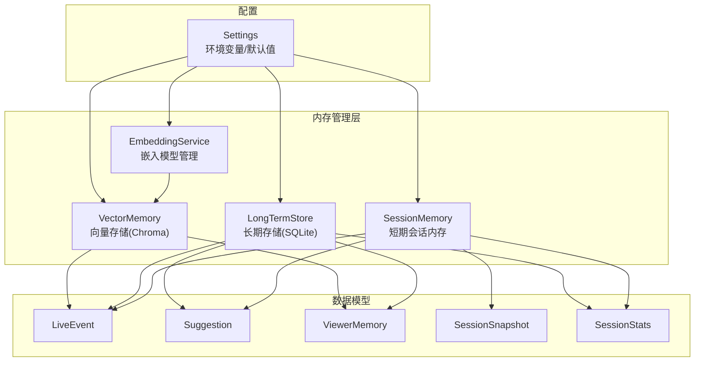
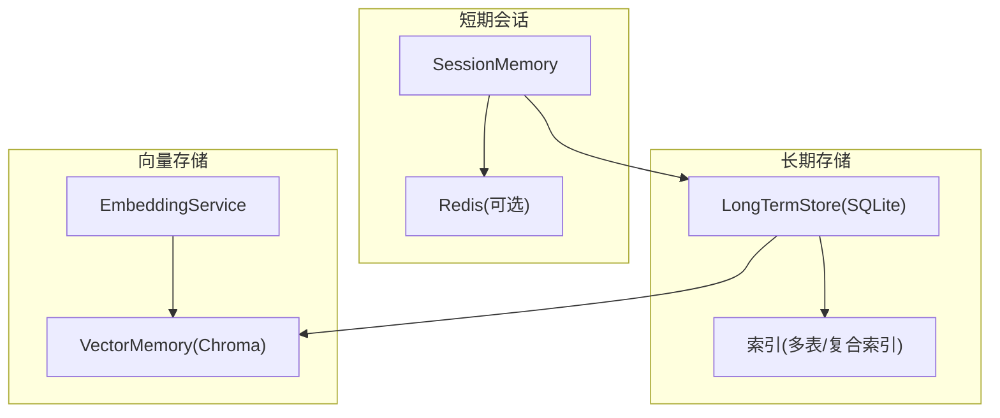
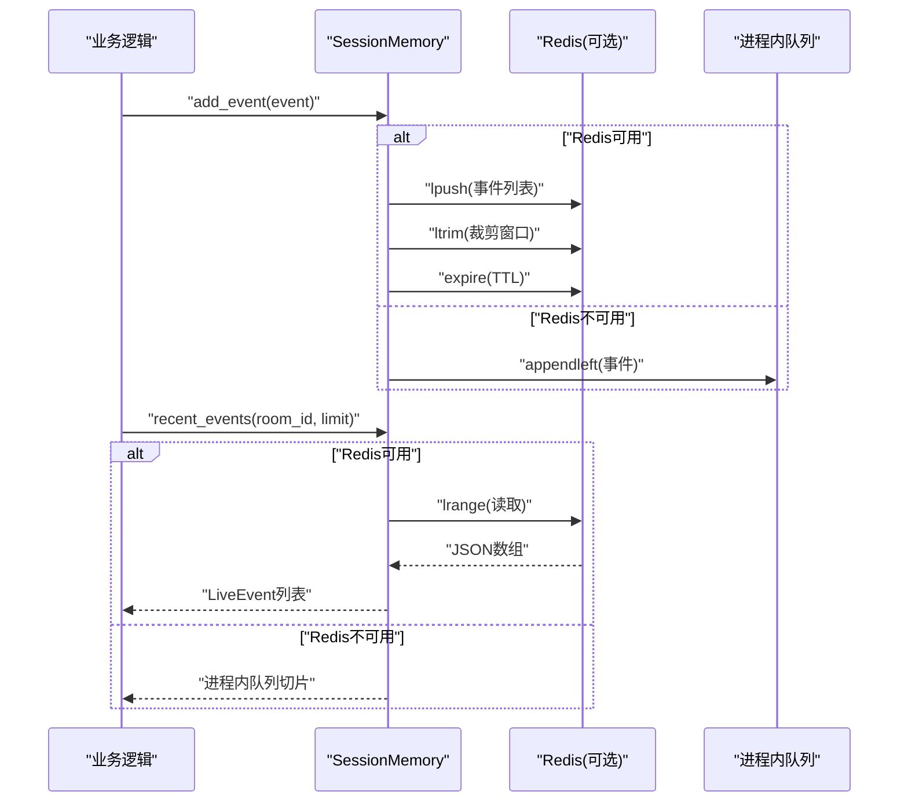
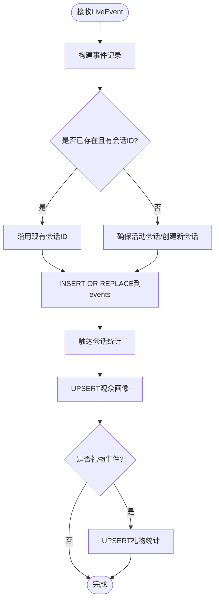
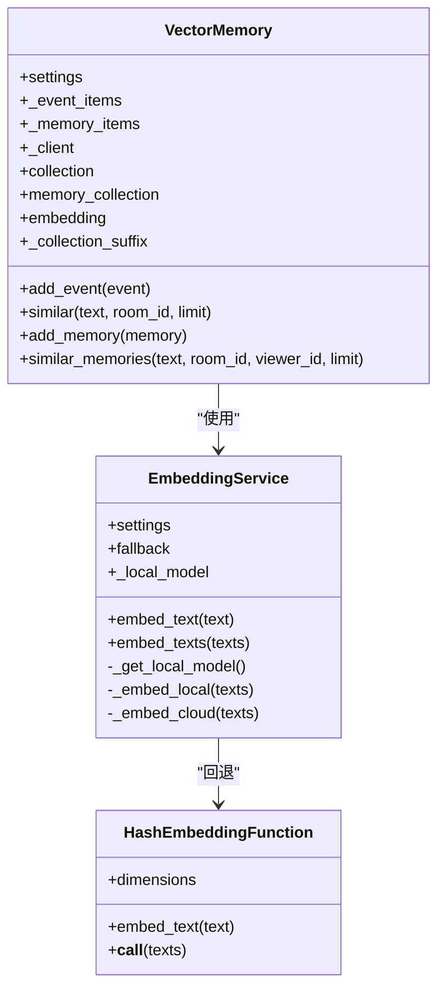
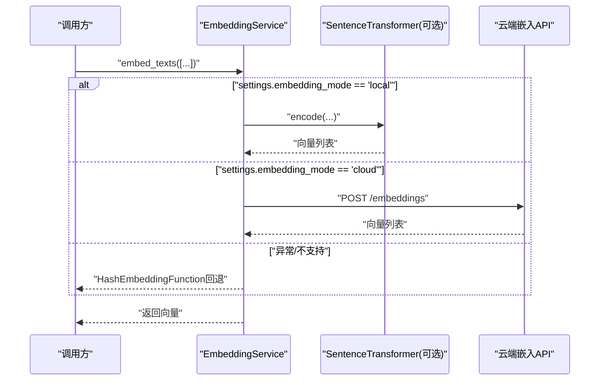
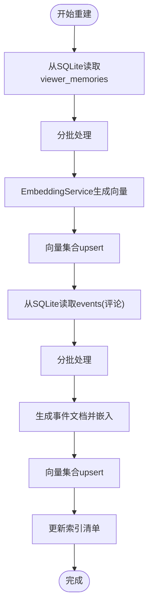
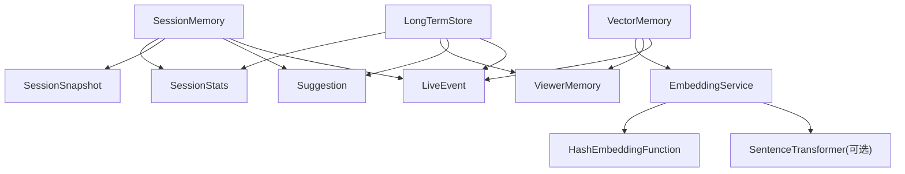

# 内存管理系统

<cite>
**本文引用的文件**
- [session_memory.py](file://backend/memory/session_memory.py)
- [long_term.py](file://backend/memory/long_term.py)
- [vector_store.py](file://backend/memory/vector_store.py)
- [embedding_service.py](file://backend/memory/embedding_service.py)
- [rebuild_embeddings.py](file://backend/memory/rebuild_embeddings.py)
- [live.py](file://backend/schemas/live.py)
- [config.py](file://backend/config.py)
- [test_vector_store.py](file://tests/test_vector_store.py)
- [test_embedding_service.py](file://tests/test_embedding_service.py)
- [test_long_term.py](file://tests/test_long_term.py)
- [README.md](file://README.md)
</cite>

## 目录
1. [简介](#简介)
2. [项目结构](#项目结构)
3. [核心组件](#核心组件)
4. [架构总览](#架构总览)
5. [详细组件分析](#详细组件分析)
6. [依赖关系分析](#依赖关系分析)
7. [性能考量](#性能考量)
8. [故障排除指南](#故障排除指南)
9. [结论](#结论)
10. [附录](#附录)

## 简介
本技术文档聚焦于 DouYin_llm 的内存管理系统，涵盖短期会话记忆（SessionMemory）、长期存储（LongTermStore）、向量存储（VectorMemory）与嵌入模型管理（EmbeddingService）。文档详细解释各模块的短期记忆管理机制（Redis 存储、TTL 过期与会话状态维护）、长期存储设计（SQLite 数据库操作、数据持久化与查询优化）、向量存储实现（ChromaDB 集成、嵌入向量管理与相似度检索），以及嵌入模型管理（模型加载、向量化处理与缓存策略）。同时提供完整的内存管理架构图与使用示例，帮助开发者快速理解与扩展系统。

## 项目结构
内存管理相关的核心文件位于 backend/memory 目录，配合 backend/schemas 定义的数据模型与 backend/config 提供的运行时配置。整体数据流从采集器产生 LiveEvent，经过短期会话内存、长期存储与向量存储，最终服务于前端展示与 LLM 提词。

图表来源
- [session_memory.py:17-113](file://backend/memory/session_memory.py#L17-L113)
- [long_term.py:44-967](file://backend/memory/long_term.py#L44-L967)
- [vector_store.py:59-317](file://backend/memory/vector_store.py#L59-L317)
- [embedding_service.py:18-102](file://backend/memory/embedding_service.py#L18-L102)
- [config.py:40-113](file://backend/config.py#L40-L113)

章节来源
- [README.md:1-223](file://README.md#L1-L223)
- [config.py:40-113](file://backend/config.py#L40-L113)

## 核心组件
- SessionMemory：短期会话内存，优先使用 Redis 保存最近事件与建议；若无 Redis，则退化为进程内队列，保证系统可用性。
- LongTermStore：长期存储，基于 SQLite 的事件、建议、观众画像、礼物、会话与记忆持久化，包含索引与增量迁移。
- VectorMemory：向量存储，集成 ChromaDB，支持事件与观众记忆的向量检索，提供本地哈希嵌入作为降级方案。
- EmbeddingService：嵌入模型管理，支持本地 SentenceTransformer 与云端 OpenAI 兼容接口，异常时自动回退至哈希嵌入。
- rebuild_embeddings：嵌入索引重建工具，从 SQLite 源数据批量生成向量索引并写入 Chroma，同时维护索引清单。

章节来源
- [session_memory.py:17-113](file://backend/memory/session_memory.py#L17-L113)
- [long_term.py:44-967](file://backend/memory/long_term.py#L44-L967)
- [vector_store.py:59-317](file://backend/memory/vector_store.py#L59-L317)
- [embedding_service.py:18-102](file://backend/memory/embedding_service.py#L18-L102)
- [rebuild_embeddings.py:1-300](file://backend/memory/rebuild_embeddings.py#L1-L300)

## 架构总览
内存管理采用“短期 + 长期 + 向量”的三层架构：
- 短期：SessionMemory 使用 Redis（可选）或进程内队列，维持最近事件与建议，支持 TTL 过期与统计聚合。
- 长期：LongTermStore 将事件与建议持久化到 SQLite，维护观众画像、礼物统计、会话状态与记忆条目，提供丰富的查询接口。
- 向量：VectorMemory 在 Chroma 中建立事件与记忆的向量索引，支持语义相似度检索与重排，嵌入由 EmbeddingService 提供。

图表来源
- [session_memory.py:17-113](file://backend/memory/session_memory.py#L17-L113)
- [long_term.py:44-967](file://backend/memory/long_term.py#L44-L967)
- [vector_store.py:59-317](file://backend/memory/vector_store.py#L59-L317)
- [embedding_service.py:18-102](file://backend/memory/embedding_service.py#L18-L102)

## 详细组件分析

### SessionMemory：短期记忆管理
- 初始化与降级：支持传入 Redis URL 与 TTL 秒数；若未安装 Redis 或未提供 URL，则使用进程内字典与双端队列作为后备。
- 键空间设计：事件与建议分别使用独立命名空间，房间维度隔离。
- 写入流程：事件与建议均采用左插入与裁剪，确保窗口大小可控；Redis 模式下设置 TTL。
- 读取与统计：支持按房间读取最近事件与建议，以及基于窗口的轻量统计（评论、礼物、点赞、成员、关注）。
- 快照：整合最近事件、建议与统计，形成前端初始化所需的数据包。

图表来源
- [session_memory.py:42-84](file://backend/memory/session_memory.py#L42-L84)

章节来源
- [session_memory.py:17-113](file://backend/memory/session_memory.py#L17-L113)

### LongTermStore：长期存储设计
- 数据库与连接：使用 SQLite，启用 TRUNCATE 日志模式以提升写入稳定性，并设置行工厂便于字典式访问。
- 表结构与索引：包含 events、suggestions、viewer_profiles、viewer_gifts、live_sessions、viewer_notes、viewer_memories 等表，配套多处复合索引以优化查询。
- 增量迁移：动态检测并添加缺失列，回填历史字段，重建聚合统计。
- 事件持久化：将 LiveEvent 转换为记录，自动维护活动会话、触达会话统计、观众画像与礼物统计。
- 查询接口：提供最近事件、最近建议、统计、观众画像与历史、会话历史、笔记与记忆等查询方法。
- 记忆管理：支持保存、读取、更新观众记忆，以及召回次数与时间戳维护。

图表来源
- [long_term.py:454-488](file://backend/memory/long_term.py#L454-L488)
- [long_term.py:310-358](file://backend/memory/long_term.py#L310-L358)
- [long_term.py:360-404](file://backend/memory/long_term.py#L360-L404)
- [long_term.py:406-436](file://backend/memory/long_term.py#L406-L436)

章节来源
- [long_term.py:44-967](file://backend/memory/long_term.py#L44-L967)

### VectorMemory：向量存储实现
- 集成与降级：当可用时创建 Chroma 持久客户端与两个集合（事件与记忆），否则使用内存中的本地索引作为后备。
- 嵌入函数：默认使用 HashEmbeddingFunction（本地哈希），也可由 EmbeddingService 提供外部嵌入。
- 事件与记忆入库：对事件与记忆分别维护内存缓冲，超过容量上限时截断；同时写入 Chroma 集合。
- 相似度检索：支持基于嵌入的向量查询与基于令牌重排的混合检索，支持房间过滤与阈值控制。
- 评分与重排：事件与记忆分别定义评分与重排规则，综合相似度、内容匹配、置信度、召回次数与更新时间等因素。

图表来源
- [vector_store.py:59-317](file://backend/memory/vector_store.py#L59-L317)
- [embedding_service.py:18-102](file://backend/memory/embedding_service.py#L18-L102)

章节来源
- [vector_store.py:59-317](file://backend/memory/vector_store.py#L59-L317)

### EmbeddingService：嵌入模型管理
- 模式选择：支持 local（SentenceTransformer）与 cloud（OpenAI 兼容）两种模式，异常时自动回退至哈希嵌入。
- 本地模型：延迟加载，支持设备选择与批大小配置。
- 云端接口：构造请求体，支持鉴权头，超时控制，返回标准化向量。
- 缓存策略：本地模型实例缓存，避免重复初始化；云端失败后记录警告并切换回退路径。

图表来源
- [embedding_service.py:25-102](file://backend/memory/embedding_service.py#L25-L102)

章节来源
- [embedding_service.py:18-102](file://backend/memory/embedding_service.py#L18-L102)

### rebuild_embeddings：嵌入索引重建
- 数据源：从 SQLite 的 events 与 viewer_memories 表中提取数据，支持房间过滤与数量限制。
- 批处理：分批读取与写入，减少内存占用与网络压力。
- 集合管理：根据嵌入签名生成集合名，支持删除旧集合后重建。
- 清单维护：记录当前激活签名与集合信息，便于版本化管理。

图表来源
- [rebuild_embeddings.py:155-275](file://backend/memory/rebuild_embeddings.py#L155-L275)

章节来源
- [rebuild_embeddings.py:1-300](file://backend/memory/rebuild_embeddings.py#L1-L300)

## 依赖关系分析
- SessionMemory 依赖 LiveEvent、Suggestion、SessionSnapshot、SessionStats 等数据模型。
- LongTermStore 依赖 SQLite 与多张表，提供事件、建议、观众画像、礼物、会话、笔记与记忆的持久化与查询。
- VectorMemory 依赖 ChromaDB（可选）与 EmbeddingService，提供事件与记忆的向量检索。
- EmbeddingService 依赖 SentenceTransformer（可选）与云端 HTTP 接口，提供本地与云端嵌入。
- rebuild_embeddings 依赖 LongTermStore、EmbeddingService 与 VectorMemory，用于批量重建向量索引。

图表来源
- [session_memory.py:9-113](file://backend/memory/session_memory.py#L9-L113)
- [long_term.py:8-967](file://backend/memory/long_term.py#L8-L967)
- [vector_store.py:8-317](file://backend/memory/vector_store.py#L8-L317)
- [embedding_service.py:7-102](file://backend/memory/embedding_service.py#L7-L102)

章节来源
- [live.py:8-111](file://backend/schemas/live.py#L8-L111)

## 性能考量
- Redis 短期存储：使用列表与过期键，窗口裁剪与 TTL 控制内存占用，适合高吞吐的实时场景。
- SQLite 长期存储：通过多处复合索引优化查询，事务与行工厂提升读写效率；TRUNCATE 日志模式增强写入稳定性。
- 向量检索：Chroma 集合按嵌入签名命名，支持房间过滤与阈值控制；内存后备在无 Chroma 时仍可工作。
- 嵌入服务：本地模型延迟加载与批处理，云端请求超时控制，异常回退至哈希嵌入，保证可用性。
- 批量重建：分批读取与写入，避免一次性内存峰值；索引清单记录版本信息，便于维护。

## 故障排除指南
- Redis 不可用：SessionMemory 自动降级为进程内队列，不影响核心功能。
- Chroma 不可用：VectorMemory 使用内存后备索引，向量检索退化为令牌匹配与重排。
- 云端嵌入失败：EmbeddingService 自动回退至哈希嵌入，记录警告日志。
- SQLite 写入问题：LongTermStore 使用 TRUNCATE 日志模式，提升写入稳定性；必要时检查磁盘权限与路径。
- 向量索引不准确：使用 rebuild_embeddings 从 SQLite 重建索引，确保嵌入签名与集合名一致。

章节来源
- [session_memory.py:11-30](file://backend/memory/session_memory.py#L11-L30)
- [vector_store.py:80-84](file://backend/memory/vector_store.py#L80-L84)
- [embedding_service.py:38-48](file://backend/memory/embedding_service.py#L38-L48)
- [long_term.py:50-54](file://backend/memory/long_term.py#L50-L54)

## 结论
DouYin_llm 的内存管理系统通过短期、长期与向量三层架构实现了高效的记忆管理：短期会话内存保证实时性与可扩展性，长期存储提供持久化与丰富查询能力，向量存储与嵌入服务支撑语义检索与智能召回。系统具备良好的降级与回退机制，能够在不同环境下稳定运行，并通过索引重建工具实现向量索引的版本化管理与持续优化。

## 附录

### 使用示例（基于测试与配置）
- 配置与目录：通过 Settings 读取环境变量，确保 data 目录、数据库与 Chroma 目录存在。
- 向量检索测试：验证集合命名使用嵌入签名、事件嵌入调用、相似度结果与阈值控制、记忆相似度重排优先级。
- 嵌入服务测试：验证云端模式请求参数、本地模式模型编码、异常回退行为。
- SQLite 连接测试：验证连接切换 SQLite 日志模式与行工厂设置。

章节来源
- [config.py:77-113](file://backend/config.py#L77-L113)
- [test_vector_store.py:20-103](file://tests/test_vector_store.py#L20-L103)
- [test_embedding_service.py:23-83](file://tests/test_embedding_service.py#L23-L83)
- [test_long_term.py:7-30](file://tests/test_long_term.py#L7-L30)