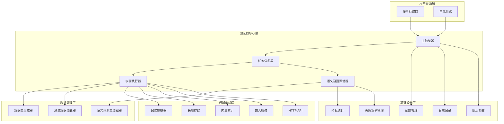
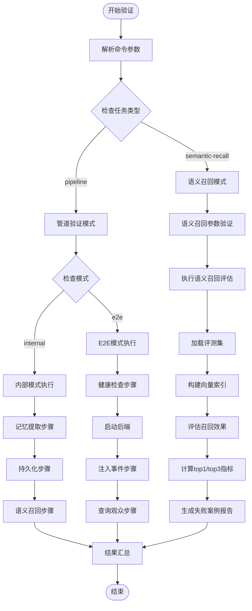
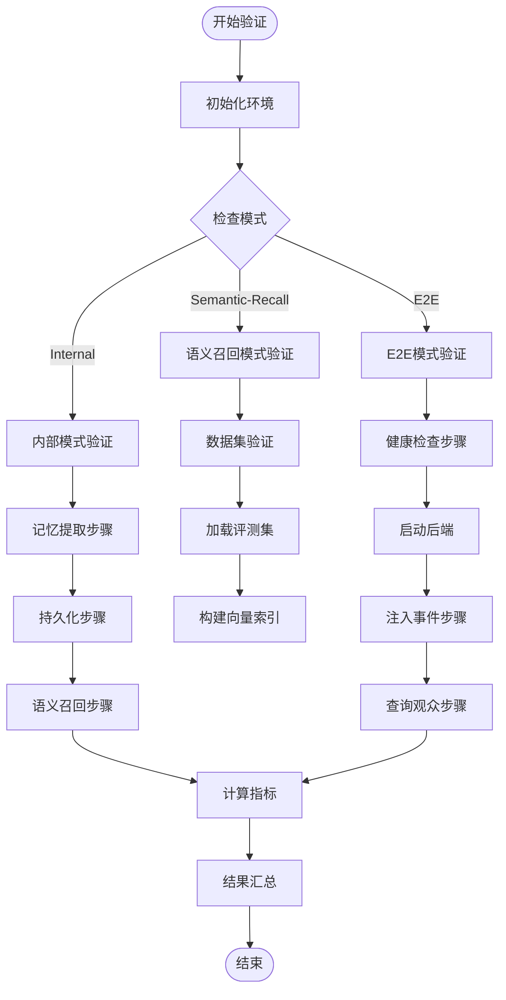
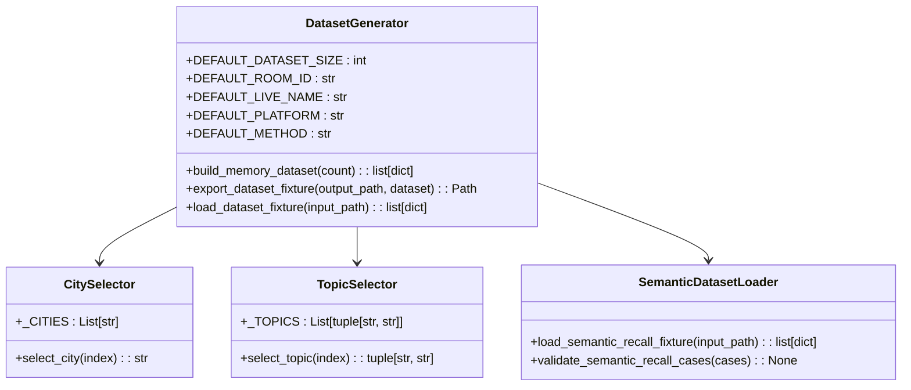
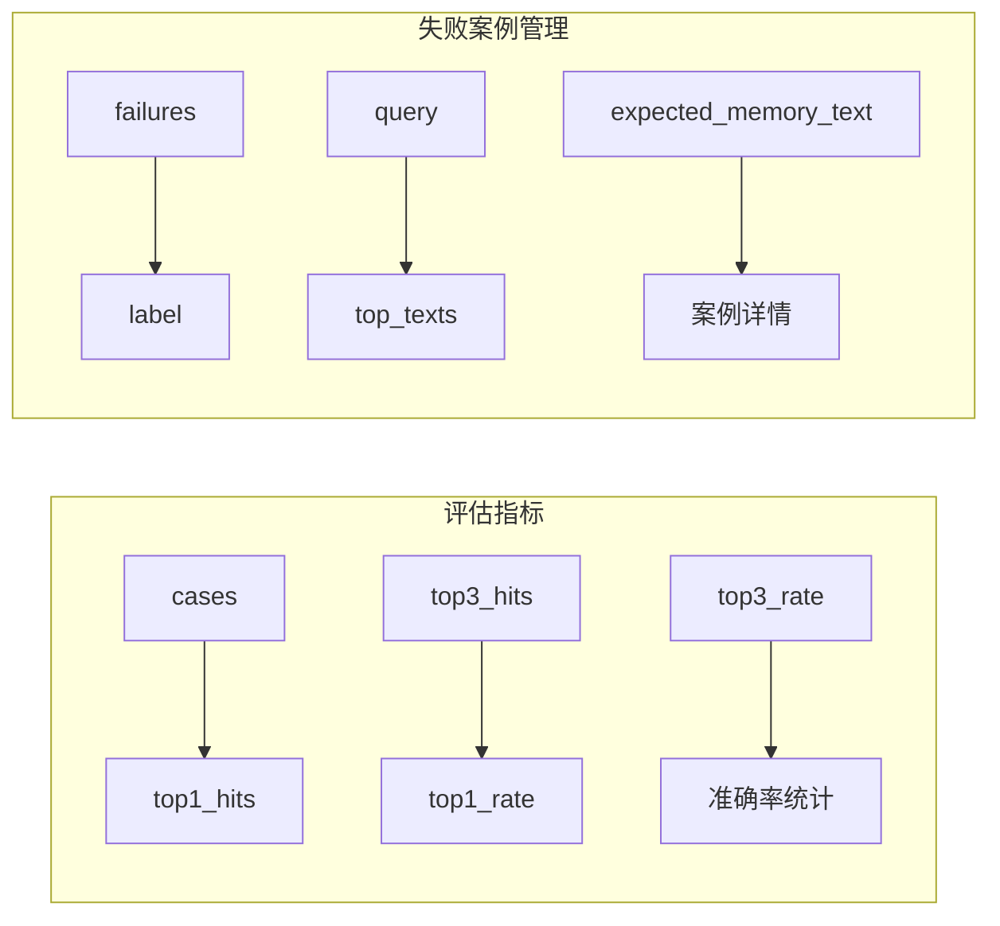
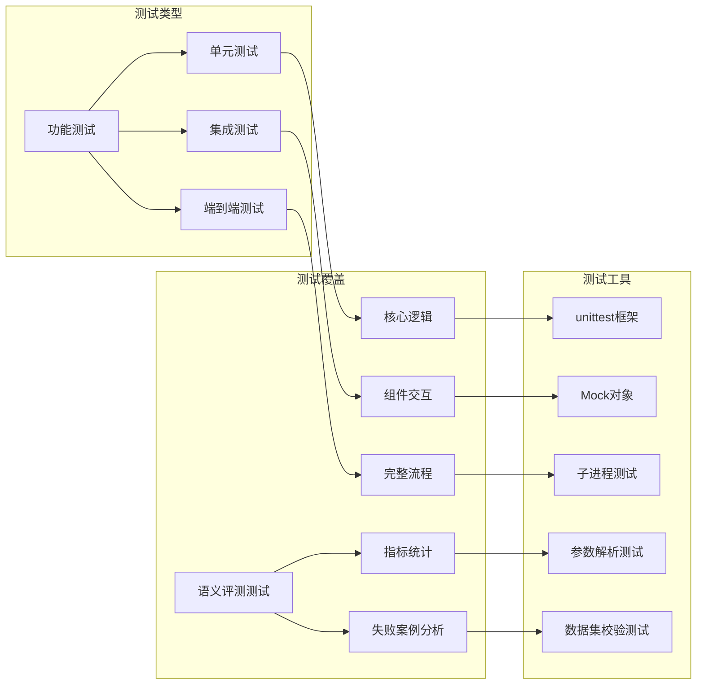
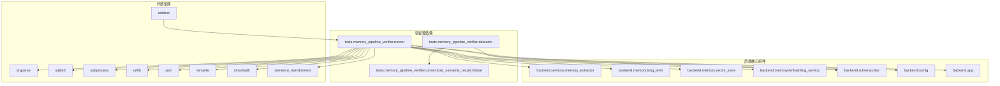
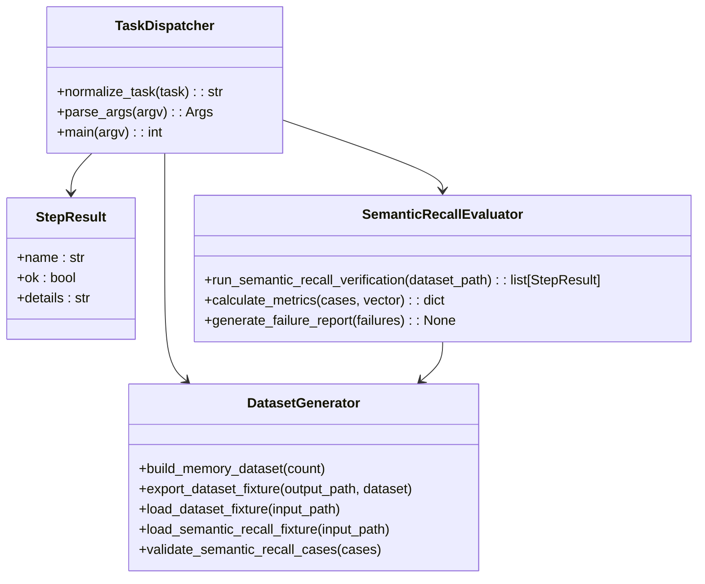

# 内存管道验证器

<cite>
**本文档引用的文件**
- [tests/verify_memory_pipeline.py](file://tests/verify_memory_pipeline.py)
- [tests/test_verify_memory_pipeline.py](file://tests/test_verify_memory_pipeline.py)
- [tests/memory_pipeline_verifier/runner.py](file://tests/memory_pipeline_verifier/runner.py)
- [tests/memory_pipeline_verifier/datasets.py](file://tests/memory_pipeline_verifier/datasets.py)
- [docs/superpowers/plans/2026-04-14-memory-pipeline-verifier.md](file://docs/superpowers/plans/2026-04-14-memory-pipeline-verifier.md)
- [docs/superpowers/specs/2026-04-14-memory-pipeline-verifier-design.md](file://docs/superpowers/specs/2026-04-14-memory-pipeline-verifier-design.md)
- [docs/superpowers/plans/2026-04-16-semantic-recall-eval.md](file://docs/superpowers/plans/2026-04-16-semantic-recall-eval.md)
- [docs/superpowers/specs/2026-04-16-semantic-recall-eval-design.md](file://docs/superpowers/specs/2026-04-16-semantic-recall-eval-design.md)
- [backend/services/memory_extractor.py](file://backend/services/memory_extractor.py)
- [backend/memory/long_term.py](file://backend/memory/long_term.py)
- [backend/memory/vector_store.py](file://backend/memory/vector_store.py)
- [backend/memory/embedding_service.py](file://backend/memory/embedding_service.py)
- [backend/schemas/live.py](file://backend/schemas/live.py)
- [backend/config.py](file://backend/config.py)
- [backend/app.py](file://backend/app.py)
- [tests/fixtures/memory_pipeline_events.json](file://tests/fixtures/memory_pipeline_events.json)
- [tests/fixtures/semantic_recall/default.json](file://tests/fixtures/semantic_recall/default.json)
- [README.md](file://README.md)
</cite>

## 更新摘要
**变更内容**
- 新增语义召回评估功能，支持语义相似度指标统计
- 增加任务分发机制，支持 pipeline 和 semantic-recall 两种任务模式
- 新增 top1/top3 指标统计和失败案例输出功能
- 扩展数据集加载和校验机制，支持语义评测集

## 目录
1. [简介](#简介)
2. [项目结构](#项目结构)
3. [核心组件](#核心组件)
4. [架构概览](#架构概览)
5. [详细组件分析](#详细组件分析)
6. [依赖关系分析](#依赖关系分析)
7. [性能考虑](#性能考虑)
8. [故障排除指南](#故障排除指南)
9. [结论](#结论)

## 简介

内存管道验证器是一个专门设计的开发者自检工具，用于验证抖音直播间的观众记忆提取、持久化和语义召回管道的完整性。该工具提供了两种验证模式：内部模式（internal）和端到端模式（e2e），能够确保从评论提炼观众记忆到向量索引召回的整个链路正常工作。

**更新** 新增语义召回评估功能，支持通过切换数据集直接输出 top1/top3 指标，提供更精确的语义相似度评估能力。

该验证器的核心目标是提供一个快速、可靠的自动化测试工具，帮助开发者在本地环境中验证内存管道的各个组件是否正确集成和工作。它不仅能够验证核心的内存提取和存储功能，还能够验证向量检索和语义匹配的准确性，并提供详细的指标统计和失败案例分析。

## 项目结构

内存管道验证器位于项目的测试目录结构中，采用了清晰的模块化组织方式：

```mermaid
graph TB
subgraph "验证器核心"
A[tests/memory_pipeline_verifier/] --> B[runner.py<br/>主验证器逻辑]
A --> C[datasets.py<br/>数据集生成器]
end
subgraph "测试入口"
D[tests/verify_memory_pipeline.py<br/>CLI入口点]
E[tests/test_verify_memory_pipeline.py<br/>单元测试]
end
subgraph "文档规范"
F[docs/superpowers/plans/]<br/>实施计划
G[docs/superpowers/specs/]<br/>设计规范
end
subgraph "语义召回评测集"
H[tests/fixtures/semantic_recall/<br/>语义评测数据集]
I[default.json<br/>默认评测集]
end
subgraph "后端组件"
J[backend/services/memory_extractor.py<br/>记忆提取器]
K[backend/memory/long_term.py<br/>长期存储]
L[backend/memory/vector_store.py<br/>向量存储]
M[backend/memory/embedding_service.py<br/>嵌入服务]
N[backend/app.py<br/>API接口]
end
D --> A
E --> A
A --> C
A --> H
A --> J
A --> K
A --> L
A --> M
A --> N
```

**图表来源**
- [tests/memory_pipeline_verifier/runner.py:1-535](file://tests/memory_pipeline_verifier/runner.py#L1-L535)
- [tests/memory_pipeline_verifier/datasets.py:1-119](file://tests/memory_pipeline_verifier/datasets.py#L1-L119)
- [tests/verify_memory_pipeline.py:1-15](file://tests/verify_memory_pipeline.py#L1-L15)
- [tests/fixtures/semantic_recall/default.json:1-63](file://tests/fixtures/semantic_recall/default.json#L1-L63)

**章节来源**
- [tests/memory_pipeline_verifier/runner.py:1-535](file://tests/memory_pipeline_verifier/runner.py#L1-L535)
- [tests/memory_pipeline_verifier/datasets.py:1-119](file://tests/memory_pipeline_verifier/datasets.py#L1-L119)
- [tests/verify_memory_pipeline.py:1-15](file://tests/verify_memory_pipeline.py#L1-L15)

## 核心组件

内存管道验证器由以下几个核心组件构成：

### 1. 主验证器（Runner）
主验证器负责协调整个验证流程，包括模式选择、步骤执行和结果汇总。它实现了内部模式和端到端模式的完整逻辑，并新增了语义召回评估任务分发功能。

### 2. 数据集生成器（Datasets）
数据集生成器提供了确定性的测试数据，确保验证结果的可重复性和一致性。它包含了预定义的城市、话题和内容模板，并新增了语义召回评测集的数据加载和校验功能。

### 3. 语义召回评估器
**新增** 专门负责语义相似度评估的组件，支持 top1/top3 指标统计、失败案例输出和评测集管理。

### 4. CLI入口点
CLI入口点提供了一个简单的命令行接口，方便开发者直接运行验证器，支持新增的任务参数。

### 5. 单元测试框架
单元测试框架确保验证器的各个功能模块都能正确工作，并提供了回归测试的能力，包括语义召回评估的测试覆盖。

**章节来源**
- [tests/memory_pipeline_verifier/runner.py:57-61](file://tests/memory_pipeline_verifier/runner.py#L57-L61)
- [tests/memory_pipeline_verifier/datasets.py:89-119](file://tests/memory_pipeline_verifier/datasets.py#L89-L119)
- [tests/verify_memory_pipeline.py:130-183](file://tests/test_verify_memory_pipeline.py#L130-L183)

## 架构概览

内存管道验证器采用分层架构设计，确保了模块间的松耦合和高内聚：



**图表来源**
- [tests/memory_pipeline_verifier/runner.py:504-535](file://tests/memory_pipeline_verifier/runner.py#L504-L535)
- [tests/memory_pipeline_verifier/datasets.py:113-119](file://tests/memory_pipeline_verifier/datasets.py#L113-L119)

该架构设计的关键特点包括：

1. **双模式支持**：同时支持内部验证和端到端验证
2. **任务分发机制**：支持 pipeline 和 semantic-recall 两种任务模式
3. **模块化设计**：每个组件都有明确的职责边界
4. **可扩展性**：新的验证步骤可以轻松添加
5. **指标统计**：内置 top1/top3 指标统计和失败案例分析
6. **错误处理**：完善的异常处理和恢复机制

## 详细组件分析

### 主验证器（Runner）

主验证器是内存管道验证器的核心组件，负责协调整个验证流程。它实现了以下关键功能：

#### 任务分发逻辑
**更新** 验证器现在支持两种任务模式：



**图表来源**
- [tests/memory_pipeline_verifier/runner.py:504-535](file://tests/memory_pipeline_verifier/runner.py#L504-L535)
- [tests/memory_pipeline_verifier/runner.py:327-412](file://tests/memory_pipeline_verifier/runner.py#L327-L412)

#### 语义召回评估执行
**新增** 语义召回评估器实现了完整的评估流程：

```mermaid
sequenceDiagram
participant User as 用户
participant Runner as 主验证器
participant Loader as 数据加载器
participant Store as 长期存储
participant Vector as 向量索引
participant Embedding as 嵌入服务
User->>Runner : 启动语义召回评估
Runner->>Loader : 加载评测集
Loader-->>Runner : 返回评测案例
Runner->>Store : 创建临时数据库
Runner->>Embedding : 初始化嵌入服务
Runner->>Vector : 创建临时向量索引
Loop 遍历每个评测案例
Runner->>Store : 保存候选记忆
Store-->>Runner : 返回存储结果
Runner->>Vector : 添加记忆到索引
Vector-->>Runner : 返回索引结果
End Loop
Runner->>Vector : 对每个查询执行召回
Vector-->>Runner : 返回召回结果
Runner->>Runner : 计算top1/top3指标
Runner->>Runner : 生成失败案例报告
Runner-->>User : 输出评估结果
```

**图表来源**
- [tests/memory_pipeline_verifier/runner.py:327-412](file://tests/memory_pipeline_verifier/runner.py#L327-L412)

#### 模式处理逻辑
验证器支持三种验证模式：

1. **内部模式（Internal）**：直接在Python进程中验证核心链路
2. **端到端模式（E2E）**：通过HTTP接口验证完整流程  
3. **语义召回模式（Semantic-Recall）**：**新增** 专门用于语义相似度评估的新模式

#### 错误处理和恢复
验证器实现了健壮的错误处理机制：



**图表来源**
- [tests/memory_pipeline_verifier/runner.py:504-535](file://tests/memory_pipeline_verifier/runner.py#L504-L535)

**章节来源**
- [tests/memory_pipeline_verifier/runner.py:504-535](file://tests/memory_pipeline_verifier/runner.py#L504-L535)
- [tests/memory_pipeline_verifier/runner.py:327-412](file://tests/memory_pipeline_verifier/runner.py#L327-L412)

### 数据集生成器（Datasets）

数据集生成器提供了确定性的测试数据，确保验证结果的一致性和可重复性：

#### 数据集策略
数据集生成器采用了轮换策略，确保测试覆盖不同的语义场景：



**图表来源**
- [tests/memory_pipeline_verifier/datasets.py:38-119](file://tests/memory_pipeline_verifier/datasets.py#L38-L119)

#### 语义评测集管理
**新增** 语义评测集具有以下特征：

1. **结构化设计**：每条样本包含 label、room_id、viewer_id、memory_texts、query、expected_memory_text 字段
2. **数据校验**：确保 expected_memory_text 必须存在于 memory_texts 中
3. **稳定性**：使用固定的种子值确保结果可重现
4. **多样性**：覆盖不同的城市、话题和语境
5. **召回友好性**：与查询语句语义接近但不完全相同

#### 测试数据特征
生成的测试数据具有以下特征：

1. **稳定性**：使用固定的种子值确保结果可重现
2. **多样性**：覆盖不同的城市、话题和语境
3. **语义丰富性**：包含上下文信息和计划状态信息
4. **召回友好性**：与查询语句语义接近但不完全相同
5. **评测友好性**：**新增** 专为语义相似度评估设计的结构化数据

**章节来源**
- [tests/memory_pipeline_verifier/datasets.py:89-119](file://tests/memory_pipeline_verifier/datasets.py#L89-L119)
- [tests/fixtures/semantic_recall/default.json:1-63](file://tests/fixtures/semantic_recall/default.json#L1-L63)

### 语义召回评估器

**新增** 专门负责语义相似度评估的组件，实现了完整的评估流程：

#### 评估指标统计
语义召回评估器支持以下指标统计：



**图表来源**
- [tests/memory_pipeline_verifier/runner.py:363-409](file://tests/memory_pipeline_verifier/runner.py#L363-L409)

#### 失败案例输出
**新增** 当语义召回评估失败时，系统会输出详细的失败案例信息：

1. **案例标识**：label 字段标识失败案例
2. **查询信息**：query 字段显示原始查询语句
3. **期望结果**：expected_memory_text 字段显示期望命中的记忆
4. **实际结果**：top_texts 字段显示实际召回的前3个记忆

#### 评测流程
语义召回评估的完整流程：

1. **数据加载**：从 JSON 文件加载评测集
2. **数据校验**：验证评测集格式和内容
3. **索引构建**：为每个评测案例构建临时向量索引
4. **召回评估**：对每个查询执行语义召回
5. **指标统计**：计算 top1 和 top3 准确率
6. **失败分析**：生成失败案例报告

**章节来源**
- [tests/memory_pipeline_verifier/runner.py:327-412](file://tests/memory_pipeline_verifier/runner.py#L327-L412)
- [tests/test_verify_memory_pipeline.py:296-356](file://tests/test_verify_memory_pipeline.py#L296-L356)

### 单元测试框架

单元测试框架确保验证器的各个功能模块都能正确工作：

#### 测试覆盖范围
单元测试涵盖了以下关键功能：

1. **默认文本验证**：确保测试数据的稳定性
2. **结果汇总逻辑**：验证失败检测和汇总
3. **模式处理**：测试内部、端到端和语义召回模式
4. **任务分发**：**新增** 测试任务参数解析和验证
5. **数据集生成**：确保批量数据的正确性
6. **HTTP接口验证**：测试端到端模式的API调用
7. **语义评测集**：**新增** 测试语义召回评测集的加载和校验
8. **指标统计**：**新增** 测试 top1/top3 指标计算逻辑

#### 测试策略
单元测试采用了以下策略：



**图表来源**
- [tests/test_verify_memory_pipeline.py:159-183](file://tests/test_verify_memory_pipeline.py#L159-L183)
- [tests/test_verify_memory_pipeline.py:296-356](file://tests/test_verify_memory_pipeline.py#L296-L356)

**章节来源**
- [tests/test_verify_memory_pipeline.py:1-366](file://tests/test_verify_memory_pipeline.py#L1-L366)

## 依赖关系分析

内存管道验证器的依赖关系相对简单，主要依赖于后端的核心组件：



**图表来源**
- [tests/memory_pipeline_verifier/runner.py:1-24](file://tests/memory_pipeline_verifier/runner.py#L1-L24)
- [tests/memory_pipeline_verifier/datasets.py:1-7](file://tests/memory_pipeline_verifier/datasets.py#L1-L7)

### 内部依赖关系

验证器内部的组件关系如下：



**图表来源**
- [tests/memory_pipeline_verifier/runner.py:35-61](file://tests/memory_pipeline_verifier/runner.py#L35-L61)
- [tests/memory_pipeline_verifier/datasets.py:89-119](file://tests/memory_pipeline_verifier/datasets.py#L89-L119)

**章节来源**
- [tests/memory_pipeline_verifier/runner.py:1-535](file://tests/memory_pipeline_verifier/runner.py#L1-L535)
- [tests/memory_pipeline_verifier/datasets.py:1-119](file://tests/memory_pipeline_verifier/datasets.py#L1-L119)

## 性能考虑

内存管道验证器在设计时充分考虑了性能因素：

### 内存使用优化
1. **批量处理**：支持批量数据集处理，减少重复初始化开销
2. **惰性加载**：测试数据按需生成，避免不必要的内存占用
3. **资源清理**：及时清理临时文件和数据库连接
4. **索引复用**：**新增** 语义召回评估中复用向量索引，避免重复计算

### 执行效率
1. **并行处理**：内部模式下可以并行处理多个事件
2. **缓存机制**：向量索引在进程内缓存，避免重复计算
3. **短路求值**：一旦某个步骤失败，立即停止后续步骤
4. **批处理优化**：**新增** 语义召回评估使用批处理方式构建索引

### 网络性能
1. **健康检查优化**：端到端模式下进行有限次数的健康检查
2. **超时控制**：所有网络请求都有适当的超时设置
3. **重试机制**：对临时性网络错误进行智能重试

### 语义评估性能
**新增** 语义召回评估的性能优化：

1. **临时存储**：使用临时数据库和向量索引，避免影响生产数据
2. **批处理索引**：一次性构建所有候选记忆的向量索引
3. **限制输出**：最多输出前5个失败案例，避免大量日志输出
4. **资源管理**：确保临时资源在完成后正确清理

## 故障排除指南

### 常见问题及解决方案

#### 1. 内存提取失败
**症状**：提取步骤显示失败
**原因**：
- 评论内容不符合提取规则
- 内存提取器配置问题
- 输入数据格式不正确

**解决方案**：
- 检查输入评论内容是否符合提取器规则
- 验证内存提取器的关键词配置
- 确认LiveEvent数据结构的完整性

#### 2. 数据库连接问题
**症状**：持久化步骤失败
**原因**：
- SQLite数据库路径不存在
- 权限不足
- 数据库文件损坏

**解决方案**：
- 确保数据库目录存在且可写
- 检查文件权限设置
- 重新初始化数据库

#### 3. 向量索引问题
**症状**：语义召回步骤失败
**原因**：
- Chroma向量数据库配置错误
- 嵌入模型不可用
- 索引数据损坏

**解决方案**：
- 检查Chroma配置参数
- 验证嵌入模型可用性
- 重建向量索引

#### 4. 端到端模式启动失败
**症状**：后端启动失败
**原因**：
- 端口被占用
- 环境变量配置错误
- 依赖包缺失

**解决方案**：
- 检查端口占用情况
- 验证环境变量设置
- 重新安装依赖包

#### 5. 语义召回评估失败
**症状**：语义召回评估步骤失败
**原因**：
- 评测集格式不正确
- 数据集路径无效
- 嵌入服务配置错误

**解决方案**：
- 检查评测集JSON格式
- 验证数据集文件路径
- 确认嵌入服务配置

#### 6. 指标统计异常
**症状**：top1/top3指标计算错误
**原因**：
- 期望记忆不在候选记忆中
- 查询文本为空
- 向量相似度计算失败

**解决方案**：
- 确保期望记忆存在于候选记忆列表
- 检查查询文本的非空性
- 验证向量相似度计算逻辑

### 调试技巧

1. **逐步验证**：使用内部模式单独验证每个步骤
2. **日志分析**：查看详细的错误日志信息
3. **数据检查**：验证中间数据的完整性和正确性
4. **环境隔离**：在干净的环境中运行验证器
5. **参数验证**：**新增** 使用 --help 参数检查命令行参数
6. **评测集验证**：**新增** 使用 validate_semantic_recall_cases 验证评测集格式

**章节来源**
- [tests/memory_pipeline_verifier/runner.py:504-535](file://tests/memory_pipeline_verifier/runner.py#L504-L535)
- [tests/test_verify_memory_pipeline.py:130-183](file://tests/test_verify_memory_pipeline.py#L130-L183)

## 结论

内存管道验证器是一个设计精良的开发者自检工具，它成功地解决了直播间观众记忆管道验证的核心需求。通过提供内部模式、端到端模式和新增的语义召回评估模式，它能够满足不同场景下的验证需求。

### 主要优势

1. **全面性**：覆盖了从记忆提取到语义召回的完整链路
2. **可靠性**：使用确定性测试数据确保结果可重现
3. **易用性**：提供简洁的命令行接口和详细的错误报告
4. **可扩展性**：模块化设计便于添加新的验证步骤
5. **精确性**：**新增** 提供 top1/top3 指标统计，支持语义相似度精确评估
6. **诊断能力**：**新增** 自动生成失败案例报告，便于问题定位

### 技术亮点

1. **双模式架构**：内部模式和端到端模式的灵活切换
2. **任务分发机制**：**新增** 支持 pipeline 和 semantic-recall 两种任务模式
3. **健壮的错误处理**：完善的异常处理和恢复机制
4. **清晰的输出格式**：详细的步骤报告和总体结果
5. **指标统计功能**：**新增** 内置 top1/top3 指标计算和分析
6. **测试驱动开发**：完整的单元测试覆盖

### 改进建议

1. **性能监控**：添加性能指标收集和报告
2. **可视化界面**：提供图形化的验证结果展示
3. **配置管理**：支持更多的验证参数配置
4. **报告生成**：生成HTML格式的详细报告
5. **评测集管理**：**新增** 支持多评测集管理和切换
6. **指标扩展**：**新增** 支持更多语义评估指标

内存管道验证器为直播间的观众记忆系统提供了一个可靠的验证基础，有助于提高系统的质量和开发效率。新增的语义召回评估功能进一步增强了工具的实用性和精确性，为语义相似度评估提供了标准化的解决方案。