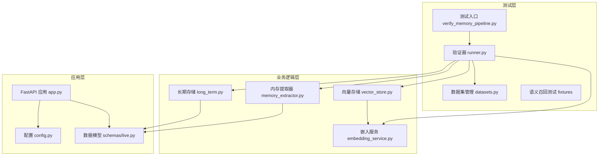
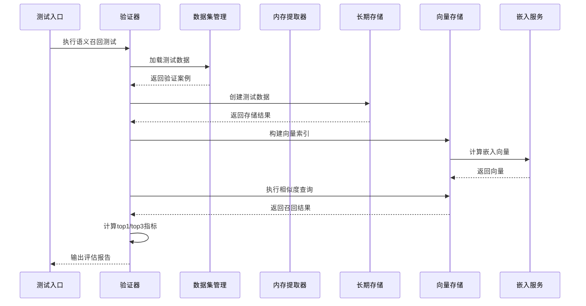
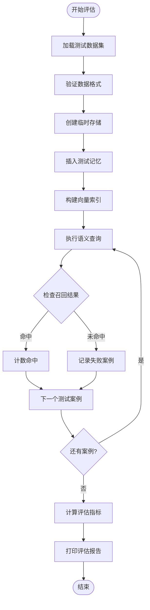
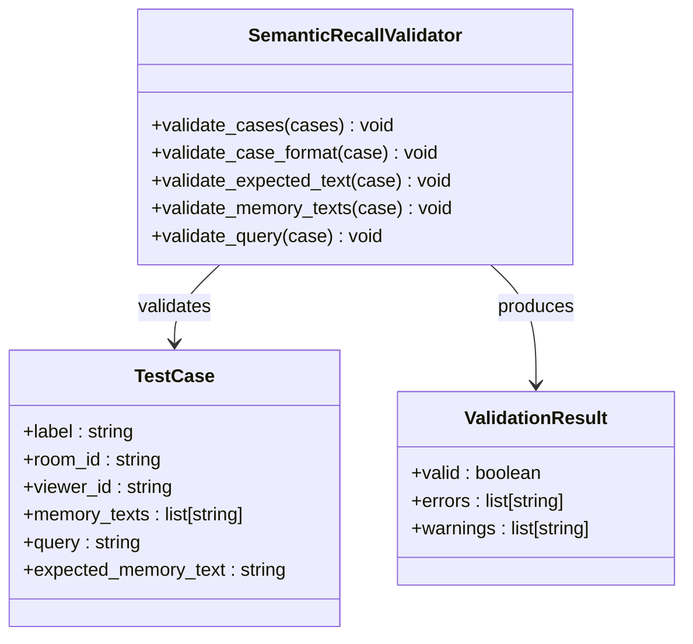
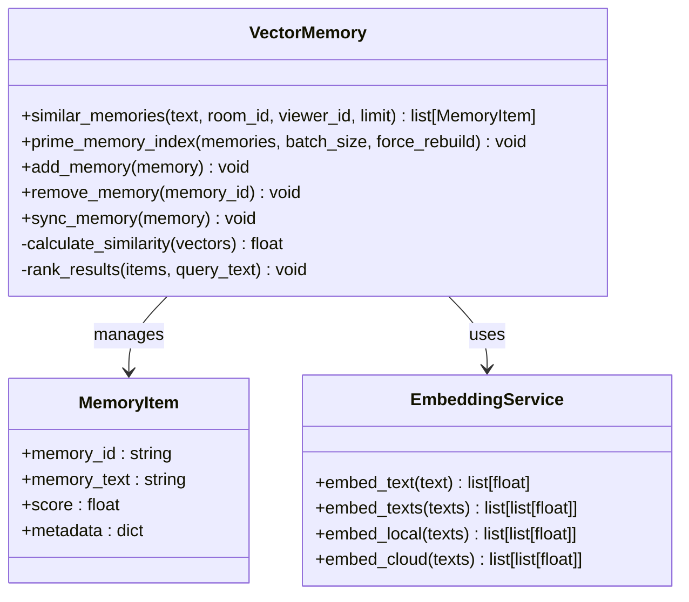
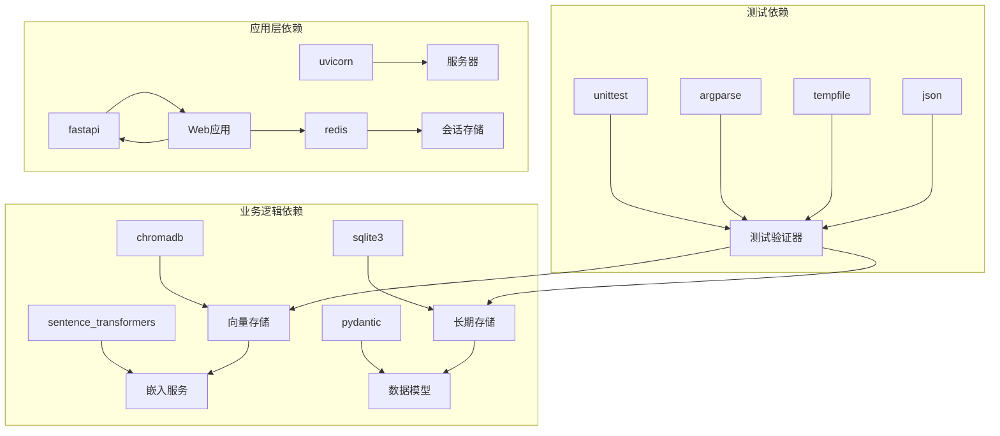

# 语义召回评估系统

<cite>
**本文档引用的文件**
- [2026-04-16-semantic-recall-eval.md](file://docs/superpowers/plans/2026-04-16-semantic-recall-eval.md)
- [runner.py](file://tests/memory_pipeline_verifier/runner.py)
- [datasets.py](file://tests/memory_pipeline_verifier/datasets.py)
- [default.json](file://tests/fixtures/semantic_recall/default.json)
- [test_verify_memory_pipeline.py](file://tests/test_verify_memory_pipeline.py)
- [verify_memory_pipeline.py](file://tests/verify_memory_pipeline.py)
- [app.py](file://backend/app.py)
- [config.py](file://backend/config.py)
- [embedding_service.py](file://backend/memory/embedding_service.py)
- [vector_store.py](file://backend/memory/vector_store.py)
- [long_term.py](file://backend/memory/long_term.py)
- [memory_extractor.py](file://backend/services/memory_extractor.py)
- [live.py](file://backend/schemas/live.py)
</cite>

## 目录
1. [简介](#简介)
2. [项目结构](#项目结构)
3. [核心组件](#核心组件)
4. [架构概览](#架构概览)
5. [详细组件分析](#详细组件分析)
6. [依赖关系分析](#依赖关系分析)
7. [性能考虑](#性能考虑)
8. [故障排除指南](#故障排除指南)
9. [结论](#结论)

## 简介

语义召回评估系统是一个专门用于评估直播场景中语义记忆召回效果的自动化测试框架。该系统基于现有的内存管道验证工具，增加了专门的语义召回评估功能，能够通过切换数据集直接输出top1/top3指标。

该系统的核心目标是：
- 为语义记忆提取提供标准化的评估方法
- 支持多种数据集格式和验证策略
- 提供详细的召回率统计和失败案例分析
- 保持与现有内存管道验证工具的兼容性

## 项目结构

项目采用模块化的三层架构设计：

**图表来源**
- [runner.py:1-535](file://tests/memory_pipeline_verifier/runner.py#L1-L535)
- [datasets.py:1-119](file://tests/memory_pipeline_verifier/datasets.py#L1-L119)
- [app.py:1-500](file://backend/app.py#L1-L500)

**章节来源**
- [runner.py:1-50](file://tests/memory_pipeline_verifier/runner.py#L1-L50)
- [datasets.py:1-36](file://tests/memory_pipeline_verifier/datasets.py#L1-L36)

## 核心组件

### 1. 语义召回评估器

语义召回评估器是系统的核心组件，负责执行语义记忆召回测试。它支持两种验证模式：

- **内部模式（Internal）**：完全在内存中运行，不依赖外部服务
- **端到端模式（E2E）**：通过HTTP接口与后端服务交互

### 2. 数据集管理器

数据集管理器负责处理和验证测试数据：

- 加载JSON格式的测试数据集
- 验证数据格式的完整性和正确性
- 提供数据集的构建和导出功能

### 3. 向量存储引擎

向量存储引擎提供语义相似度检索能力：

- 支持多种嵌入模型（本地和云端）
- 提供向量索引的构建和查询
- 实现语义相似度计算和排序

**章节来源**
- [runner.py:327-412](file://tests/memory_pipeline_verifier/runner.py#L327-L412)
- [datasets.py:89-119](file://tests/memory_pipeline_verifier/datasets.py#L89-L119)
- [vector_store.py:59-388](file://backend/memory/vector_store.py#L59-L388)

## 架构概览

系统采用分层架构设计，各层职责明确：

**图表来源**
- [runner.py:504-535](file://tests/memory_pipeline_verifier/runner.py#L504-L535)
- [datasets.py:113-119](file://tests/memory_pipeline_verifier/datasets.py#L113-L119)
- [vector_store.py:320-388](file://backend/memory/vector_store.py#L320-L388)

## 详细组件分析

### 语义召回评估流程

系统实现了完整的语义召回评估流程：

**图表来源**
- [runner.py:327-412](file://tests/memory_pipeline_verifier/runner.py#L327-L412)
- [datasets.py:89-119](file://tests/memory_pipeline_verifier/datasets.py#L89-L119)

### 数据验证机制

系统实现了严格的数据验证机制：

**图表来源**
- [datasets.py:89-119](file://tests/memory_pipeline_verifier/datasets.py#L89-L119)

**章节来源**
- [datasets.py:89-119](file://tests/memory_pipeline_verifier/datasets.py#L89-L119)
- [test_verify_memory_pipeline.py:129-151](file://tests/test_verify_memory_pipeline.py#L129-L151)

### 向量检索算法

系统实现了高效的向量检索算法：

**图表来源**
- [vector_store.py:320-388](file://backend/memory/vector_store.py#L320-L388)
- [embedding_service.py:34-119](file://backend/memory/embedding_service.py#L34-L119)

**章节来源**
- [vector_store.py:216-248](file://backend/memory/vector_store.py#L216-L248)
- [embedding_service.py:34-119](file://backend/memory/embedding_service.py#L34-L119)

## 依赖关系分析

系统依赖关系清晰，层次分明：

**图表来源**
- [runner.py:1-24](file://tests/memory_pipeline_verifier/runner.py#L1-L24)
- [vector_store.py:10-13](file://backend/memory/vector_store.py#L10-L13)
- [embedding_service.py:9-12](file://backend/memory/embedding_service.py#L9-L12)

**章节来源**
- [runner.py:1-24](file://tests/memory_pipeline_verifier/runner.py#L1-L24)
- [app.py:8-24](file://backend/app.py#L8-L24)

## 性能考虑

系统在设计时充分考虑了性能优化：

### 1. 向量索引优化
- 批量处理机制减少数据库操作次数
- 智能重建策略避免不必要的索引重建
- 内存缓存提升查询性能

### 2. 嵌入计算优化
- 支持本地和云端嵌入模型选择
- 批量嵌入计算提升效率
- 失败回退机制保证稳定性

### 3. 内存管理优化
- 临时目录自动清理
- 连接池管理数据库连接
- 资源及时释放避免内存泄漏

## 故障排除指南

### 常见问题及解决方案

| 问题类型 | 症状 | 可能原因 | 解决方案 |
|---------|------|----------|----------|
| 数据加载失败 | `FileNotFoundError` | JSON文件路径错误 | 检查文件路径是否正确 |
| 数据验证失败 | `ValueError` | 数据格式不正确 | 使用内置验证函数检查数据格式 |
| 嵌入服务不可用 | `RuntimeError` | 网络连接或API密钥问题 | 检查网络连接和API配置 |
| 向量索引失败 | `ChromaError` | Chroma数据库问题 | 检查数据库权限和磁盘空间 |
| 内存不足 | `MemoryError` | 测试数据过大 | 减少测试数据量或增加系统内存 |

### 调试建议

1. **启用详细日志**：设置日志级别为DEBUG查看详细执行过程
2. **分步调试**：逐个验证数据加载、索引构建、查询执行等步骤
3. **资源监控**：监控内存和CPU使用情况，避免资源耗尽
4. **错误重试**：对于网络相关的错误，实施适当的重试机制

**章节来源**
- [runner.py:182-234](file://tests/memory_pipeline_verifier/runner.py#L182-L234)
- [test_verify_memory_pipeline.py:357-362](file://tests/test_verify_memory_pipeline.py#L357-L362)

## 结论

语义召回评估系统是一个功能完整、设计合理的自动化测试框架。其主要特点包括：

### 优势
- **模块化设计**：清晰的分层架构便于维护和扩展
- **全面的验证**：支持多种验证模式和数据格式
- **详细的报告**：提供完整的评估指标和失败案例分析
- **易于使用**：简单的命令行接口和配置选项

### 应用价值
- 为直播场景的语义记忆系统提供了标准化的评估方法
- 支持持续集成和自动化测试流程
- 有助于提高语义召回系统的质量和稳定性
- 为系统优化提供了数据驱动的决策依据

### 发展方向
- 扩展更多的评估指标和测试场景
- 增加可视化报告和趋势分析功能
- 支持更多类型的嵌入模型和向量数据库
- 集成到CI/CD流水线中实现自动化质量保证

该系统为直播平台的记忆管理系统提供了重要的质量保障工具，有助于提升用户体验和平台价值。