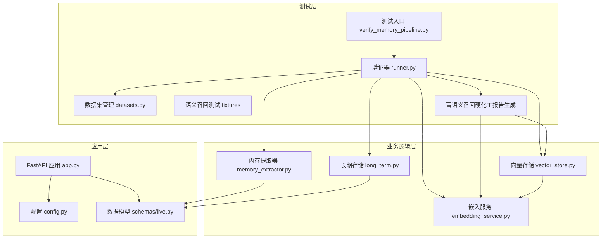
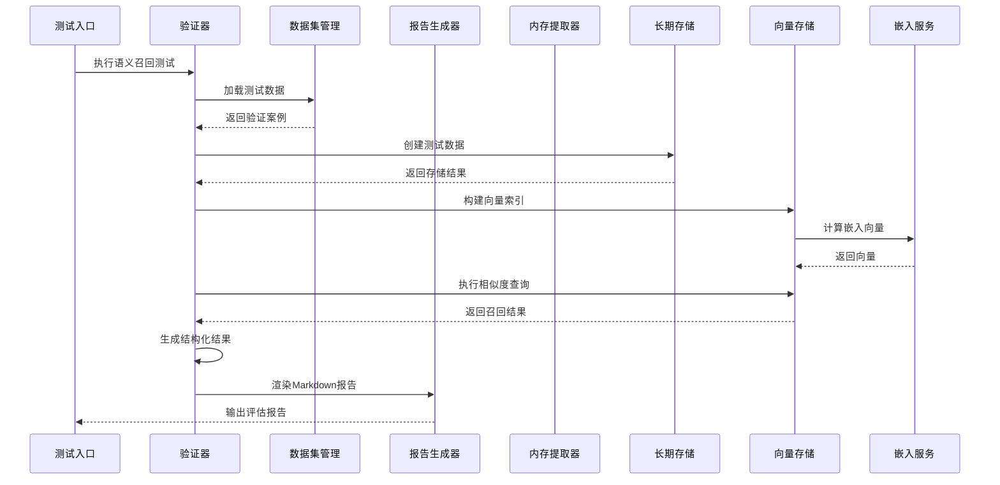
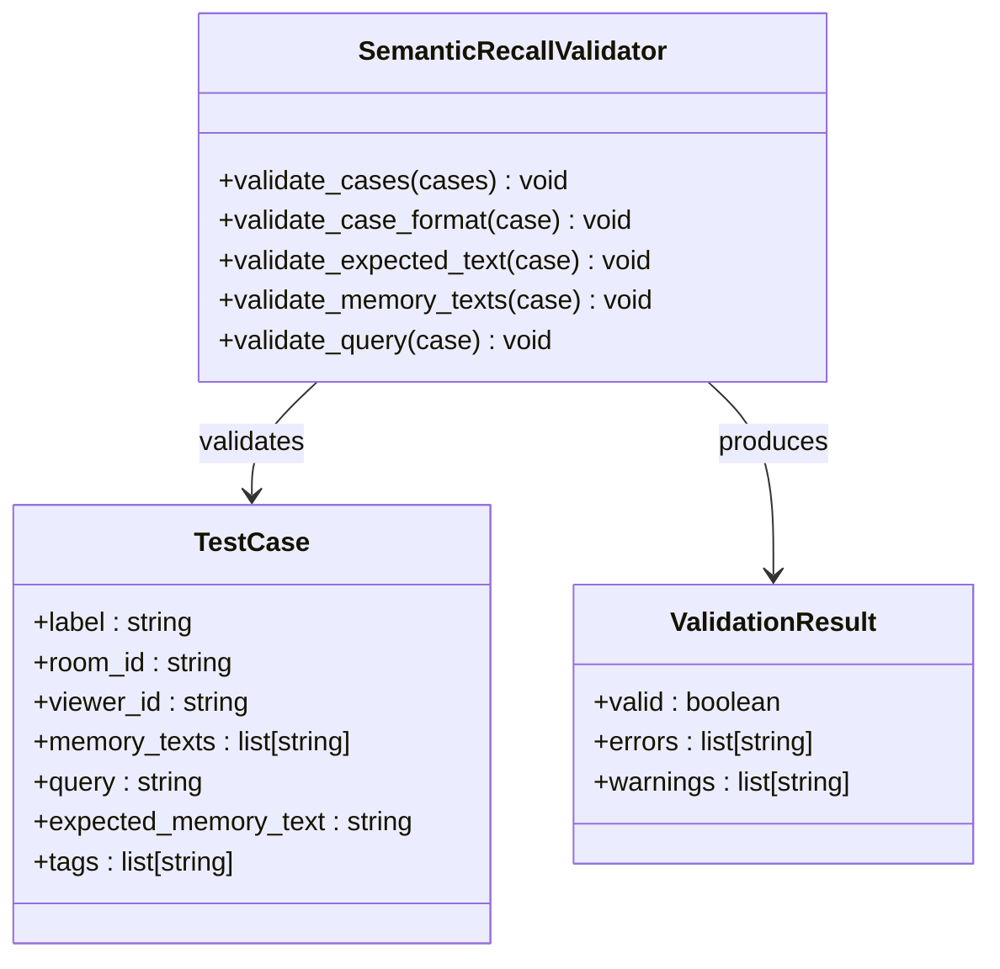
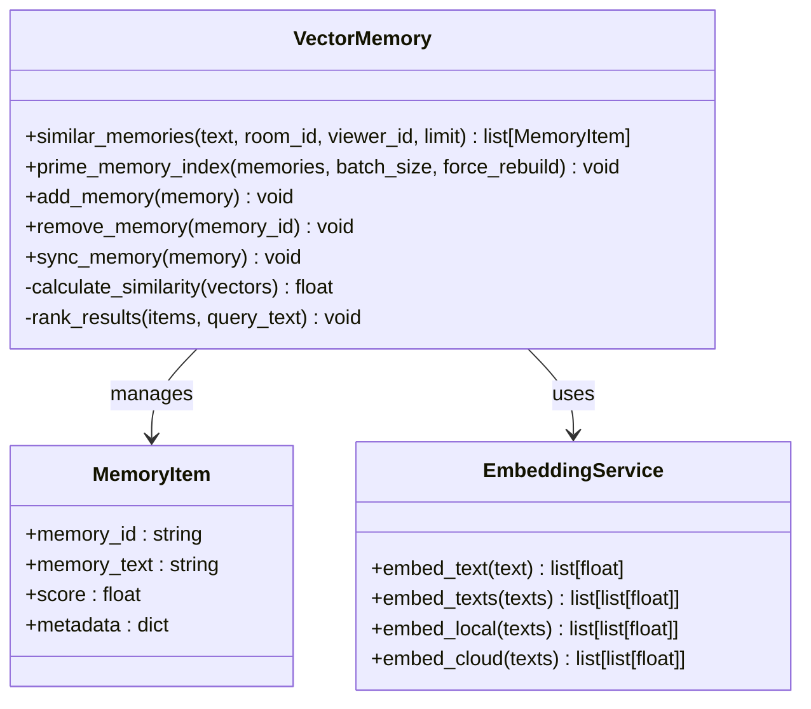
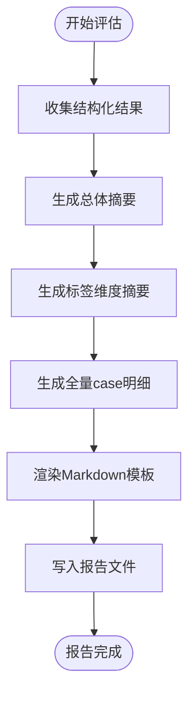
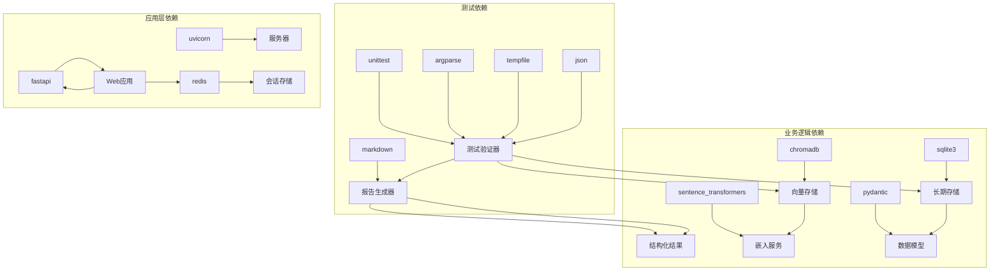

# 语义召回评估系统

<cite>
**本文档引用的文件**
- [2026-04-17-blind-100-hardening-report.md](file://docs/superpowers/plans/2026-04-17-blind-100-hardening-report.md)
- [2026-04-17-blind-100-hardening-report-design.md](file://docs/superpowers/specs/2026-04-17-blind-100-hardening-report-design.md)
- [2026-04-17-semantic-recall-blind-100-design.md](file://docs/superpowers/specs/2026-04-17-semantic-recall-blind-100-design.md)
- [runner.py](file://tests/memory_pipeline_verifier/runner.py)
- [datasets.py](file://tests/memory_pipeline_verifier/datasets.py)
- [blind_100.json](file://tests/fixtures/semantic_recall/blind_100.json)
- [test_verify_memory_pipeline.py](file://tests/test_verify_memory_pipeline.py)
- [verify_memory_pipeline.py](file://tests/verify_memory_pipeline.py)
- [app.py](file://backend/app.py)
- [config.py](file://backend/config.py)
- [embedding_service.py](file://backend/memory/embedding_service.py)
- [vector_store.py](file://backend/memory/vector_store.py)
- [long_term.py](file://backend/memory/long_term.py)
- [memory_extractor.py](file://backend/services/memory_extractor.py)
- [live.py](file://backend/schemas/live.py)
- [blind_100.md](file://artifacts/semantic_recall_reports/blind_100.md)
</cite>

## 更新摘要
**所做更改**
- 新增盲语义召回硬化工报告生成功能章节
- 更新数据集要求，从4记忆文本格式扩展到10记忆文本格式
- 增强干扰项设计，提升误召压力
- 新增Markdown报告生成和详细召回结果分析功能
- 扩展top1/top3指标统计和失败案例追踪

## 目录
1. [简介](#简介)
2. [项目结构](#项目结构)
3. [核心组件](#核心组件)
4. [架构概览](#架构概览)
5. [详细组件分析](#详细组件分析)
6. [盲语义召回硬化工报告生成](#盲语义召回硬化工报告生成)
7. [数据集升级与干扰项设计](#数据集升级与干扰项设计)
8. [依赖关系分析](#依赖关系分析)
9. [性能考虑](#性能考虑)
10. [故障排除指南](#故障排除指南)
11. [结论](#结论)

## 简介

语义召回评估系统是一个专门用于评估直播场景中语义记忆召回效果的自动化测试框架。该系统基于现有的内存管道验证工具，增加了专门的语义召回评估功能，能够通过切换数据集直接输出top1/top3指标。

**更新** 系统现已支持盲语义召回硬化工报告生成功能，包括Markdown报告生成、详细的召回结果分析、top1/top3指标统计等功能。数据集要求从原来的4记忆文本格式扩展到10记忆文本格式，增加了更严格的干扰项设计，显著提升了误召压力和评估难度。

该系统的核心目标是：
- 为语义记忆提取提供标准化的评估方法
- 支持多种数据集格式和验证策略
- 提供详细的召回率统计和失败案例分析
- 保持与现有内存管道验证工具的兼容性
- 自动生成可读的Markdown评估报告

## 项目结构

项目采用模块化的三层架构设计：



**图表来源**
- [runner.py:1-618](file://tests/memory_pipeline_verifier/runner.py#L1-L618)
- [datasets.py:1-119](file://tests/memory_pipeline_verifier/datasets.py#L1-L119)
- [app.py:1-500](file://backend/app.py#L1-L500)

**章节来源**
- [runner.py:1-50](file://tests/memory_pipeline_verifier/runner.py#L1-L50)
- [datasets.py:1-36](file://tests/memory_pipeline_verifier/datasets.py#L1-L36)

## 核心组件

### 1. 语义召回评估器

语义召回评估器是系统的核心组件，负责执行语义记忆召回测试。它支持两种验证模式：

- **内部模式（Internal）**：完全在内存中运行，不依赖外部服务
- **端到端模式（E2E）**：通过HTTP接口与后端服务交互

**更新** 评估器现已增强支持盲语义召回硬化工报告生成功能，能够自动生成包含详细召回结果分析的Markdown报告。

### 2. 数据集管理器

数据集管理器负责处理和验证测试数据：

- 加载JSON格式的测试数据集
- 验证数据格式的完整性和正确性
- 提供数据集的构建和导出功能
- 支持盲语义召回硬化工报告生成

**更新** 数据集管理器现已支持10记忆文本格式，包含更严格的干扰项设计。

### 3. 向量存储引擎

向量存储引擎提供语义相似度检索能力：

- 支持多种嵌入模型（本地和云端）
- 提供向量索引的构建和查询
- 实现语义相似度计算和排序
- 支持大规模记忆池的高效检索

**章节来源**
- [runner.py:381-492](file://tests/memory_pipeline_verifier/runner.py#L381-L492)
- [datasets.py:89-119](file://tests/memory_pipeline_verifier/datasets.py#L89-L119)
- [vector_store.py:59-388](file://backend/memory/vector_store.py#L59-L388)

## 架构概览

系统采用分层架构设计，各层职责明确：



**图表来源**
- [runner.py:587-618](file://tests/memory_pipeline_verifier/runner.py#L587-L618)
- [datasets.py:113-119](file://tests/memory_pipeline_verifier/datasets.py#L113-L119)
- [vector_store.py:320-388](file://backend/memory/vector_store.py#L320-L388)

## 详细组件分析

### 语义召回评估流程

系统实现了完整的语义召回评估流程：


**图表来源**
- [runner.py:381-492](file://tests/memory_pipeline_verifier/runner.py#L381-L492)
- [datasets.py:89-119](file://tests/memory_pipeline_verifier/datasets.py#L89-L119)

### 数据验证机制

系统实现了严格的数据验证机制：



**图表来源**
- [datasets.py:89-119](file://tests/memory_pipeline_verifier/datasets.py#L89-L119)

**章节来源**
- [datasets.py:89-119](file://tests/memory_pipeline_verifier/datasets.py#L89-L119)
- [test_verify_memory_pipeline.py:216-240](file://tests/test_verify_memory_pipeline.py#L216-L240)

### 向量检索算法

系统实现了高效的向量检索算法：



**图表来源**
- [vector_store.py:320-388](file://backend/memory/vector_store.py#L320-L388)
- [embedding_service.py:34-119](file://backend/memory/embedding_service.py#L34-L119)

**章节来源**
- [vector_store.py:216-248](file://backend/memory/vector_store.py#L216-L248)
- [embedding_service.py:34-119](file://backend/memory/embedding_service.py#L34-L119)

## 盲语义召回硬化工报告生成

**新增** 系统现已支持盲语义召回硬化工报告生成功能，提供完整的评估报告和详细的召回结果分析。

### 报告生成架构



### 报告内容结构

系统生成的Markdown报告包含以下三个主要部分：

#### 1. 总体摘要
- 数据集路径
- Case总数
- Memory总数
- Top1命中数和命中率
- Top3命中数和命中率
- 生成时间

#### 2. 标签维度摘要
按标签组合进行小结，展示每类的：
- Case数量
- Top1命中数
- Top3命中数
- Top1命中率
- Top3命中率

#### 3. 全量Case明细
每条Case都展开，包含：
- Label和Tags
- Query和Expected Memory
- 实际召回的Top3 Memory Texts
- 是否命中Top1和Top3
- 未命中Top1时的第一名错召分析
- 未命中Top3时的严重失败标记

**章节来源**
- [runner.py:208-284](file://tests/memory_pipeline_verifier/runner.py#L208-L284)
- [test_verify_memory_pipeline.py:478-531](file://tests/test_verify_memory_pipeline.py#L478-L531)
- [blind_100.md:1-200](file://artifacts/semantic_recall_reports/blind_100.md#L1-L200)

## 数据集升级与干扰项设计

**更新** 数据集已从原来的4记忆文本格式升级到10记忆文本格式，显著增加了评估难度和误召压力。

### 数据集升级设计

#### 数据文件
继续使用：
```
tests/fixtures/semantic_recall/blind_100.json
```

#### 样本规模
- 总量保持100条
- 5个标签类别，每类20条
- 类别仍为：["typo"]、["spoken"]、["fragment"]、["typo","spoken","fragment","mixed_noise"]、["distractor"]

#### 单条Case结构要求
每条Case保持现有schema，但新增约束：
- memory_texts必须达到10条
- expected_memory_text必须仍然出现在memory_texts中
- query不允许与expected_memory_text完全相同
- 10条记忆里至少要有多条与目标记忆主题非常接近的干扰项

### 干扰项设计原则

难度提升的核心是"同一个viewer的记忆池更深、干扰更近"：

1. **原有目标记忆保留**：确保评估的基准不变
2. **原有3条干扰项保留或重写**：维持基础干扰强度
3. **补充6条新干扰项**：把总数拉到10条
4. **新干扰项构造策略**：围绕同一主题、同一时间、同一生活域或同一偏好域构造

**示例**：
如果目标是"我在杭州做前端开发，最近连续两周都在加班赶需求"，新增干扰项优先使用：
- "我最近在赶一个移动端重构项目，这两周经常改到半夜。"
- "我们组这个月一直在冲版本，晚上开会和改页面都特别频繁。"
- "我白天写后台联调，晚上还得补前端交互细节。"

这样测试的重点从"能不能大致召回同类话题"提升为"能不能在多个相似选项里召对目标"。

**章节来源**
- [2026-04-17-blind-100-hardening-report-design.md:104-123](file://docs/superpowers/specs/2026-04-17-blind-100-hardening-report-design.md#L104-L123)
- [2026-04-17-semantic-recall-blind-100-design.md:108-123](file://docs/superpowers/specs/2026-04-17-semantic-recall-blind-100-design.md#L108-L123)
- [blind_100.json:1-23](file://tests/fixtures/semantic_recall/blind_100.json#L1-L23)

## 依赖关系分析

系统依赖关系清晰，层次分明：



**图表来源**
- [runner.py:1-24](file://tests/memory_pipeline_verifier/runner.py#L1-L24)
- [vector_store.py:10-13](file://backend/memory/vector_store.py#L10-L13)
- [embedding_service.py:9-12](file://backend/memory/embedding_service.py#L9-L12)

**章节来源**
- [runner.py:1-24](file://tests/memory_pipeline_verifier/runner.py#L1-L24)
- [app.py:8-24](file://backend/app.py#L8-L24)

## 性能考虑

系统在设计时充分考虑了性能优化：

### 1. 向量索引优化
- 批量处理机制减少数据库操作次数
- 智能重建策略避免不必要的索引重建
- 内存缓存提升查询性能

### 2. 嵌入计算优化
- 支持本地和云端嵌入模型选择
- 批量嵌入计算提升效率
- 失败回退机制保证稳定性

### 3. 内存管理优化
- 临时目录自动清理
- 连接池管理数据库连接
- 资源及时释放避免内存泄漏

### 4. 报告生成优化
- 结构化结果一次性收集，避免重复计算
- Markdown渲染模板化，提升生成效率
- 报告文件异步写入，不影响评估主流程

## 故障排除指南

### 常见问题及解决方案

| 问题类型 | 症状 | 可能原因 | 解决方案 |
|---------|------|----------|----------|
| 数据加载失败 | `FileNotFoundError` | JSON文件路径错误 | 检查文件路径是否正确 |
| 数据验证失败 | `ValueError` | 数据格式不正确 | 使用内置验证函数检查数据格式 |
| 嵌入服务不可用 | `RuntimeError` | 网络连接或API密钥问题 | 检查网络连接和API配置 |
| 向量索引失败 | `ChromaError` | Chroma数据库问题 | 检查数据库权限和磁盘空间 |
| 内存不足 | `MemoryError` | 测试数据过大 | 减少测试数据量或增加系统内存 |
| 报告生成失败 | `IOError` | 文件权限或磁盘空间问题 | 检查报告输出目录权限和磁盘空间 |
| 干扰项设计不当 | 评估结果异常 | 干扰项与目标记忆差异过小 | 重新设计更高相似度的干扰项 |

### 调试建议

1. **启用详细日志**：设置日志级别为DEBUG查看详细执行过程
2. **分步调试**：逐个验证数据加载、索引构建、查询执行、报告生成等步骤
3. **资源监控**：监控内存和CPU使用情况，避免资源耗尽
4. **错误重试**：对于网络相关的错误，实施适当的重试机制
5. **报告验证**：检查生成的Markdown报告内容是否符合预期格式

**章节来源**
- [runner.py:182-234](file://tests/memory_pipeline_verifier/runner.py#L182-L234)
- [test_verify_memory_pipeline.py:357-362](file://tests/test_verify_memory_pipeline.py#L357-L362)

## 结论

语义召回评估系统是一个功能完整、设计合理的自动化测试框架。其主要特点包括：

### 优势
- **模块化设计**：清晰的分层架构便于维护和扩展
- **全面的验证**：支持多种验证模式和数据格式
- **详细的报告**：提供完整的评估指标和失败案例分析
- **易于使用**：简单的命令行接口和配置选项
- **强大的报告生成功能**：自动生成可读的Markdown评估报告
- **严格的干扰项设计**：显著提升评估难度和实用性

### 应用价值
- 为直播场景的语义记忆系统提供了标准化的评估方法
- 支持持续集成和自动化测试流程
- 有助于提高语义召回系统的质量和稳定性
- 为系统优化提供了数据驱动的决策依据
- 通过硬化工报告生成，提供了可追溯的评估历史

### 发展方向
- 扩展更多的评估指标和测试场景
- 增加可视化报告和趋势分析功能
- 支持更多类型的嵌入模型和向量数据库
- 集成到CI/CD流水线中实现自动化质量保证
- 增强报告的交互性和可分享性

**更新** 该系统现已具备盲语义召回硬化工报告生成功能，为直播平台的记忆管理系统提供了更加完善和实用的质量保障工具，有助于提升用户体验和平台价值。