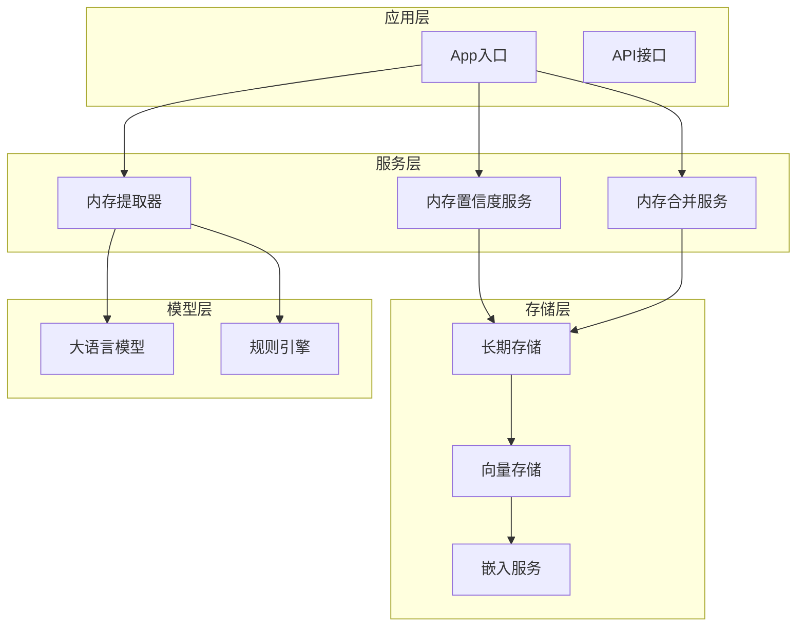
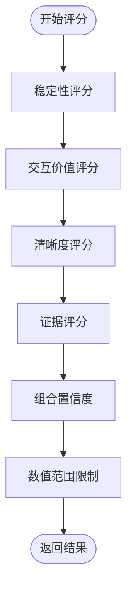
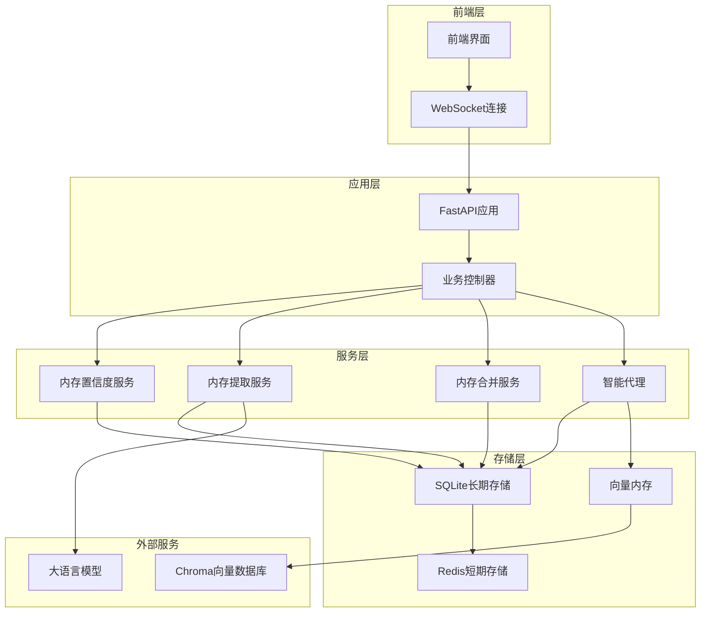
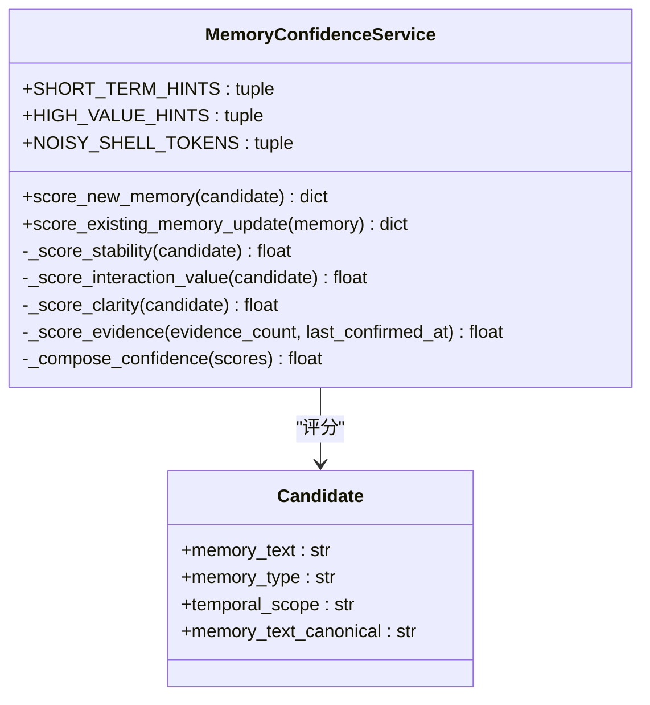
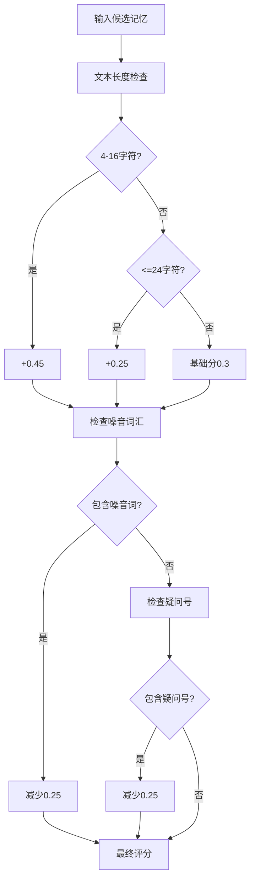
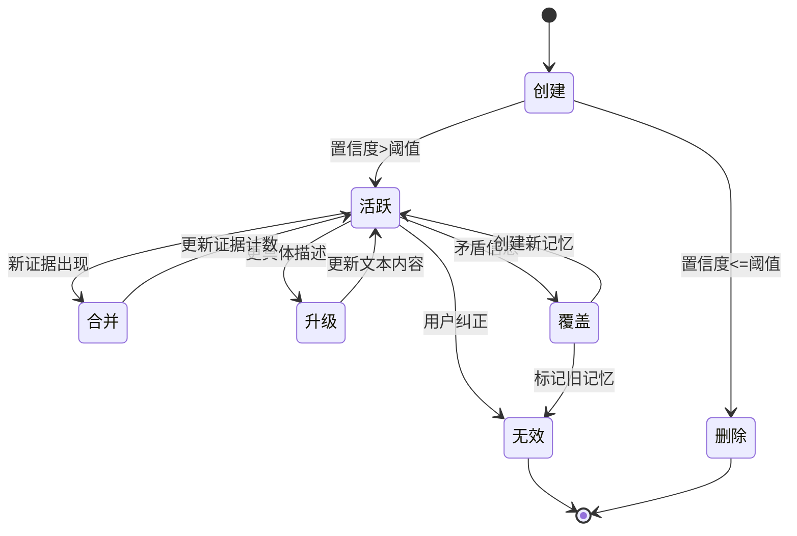
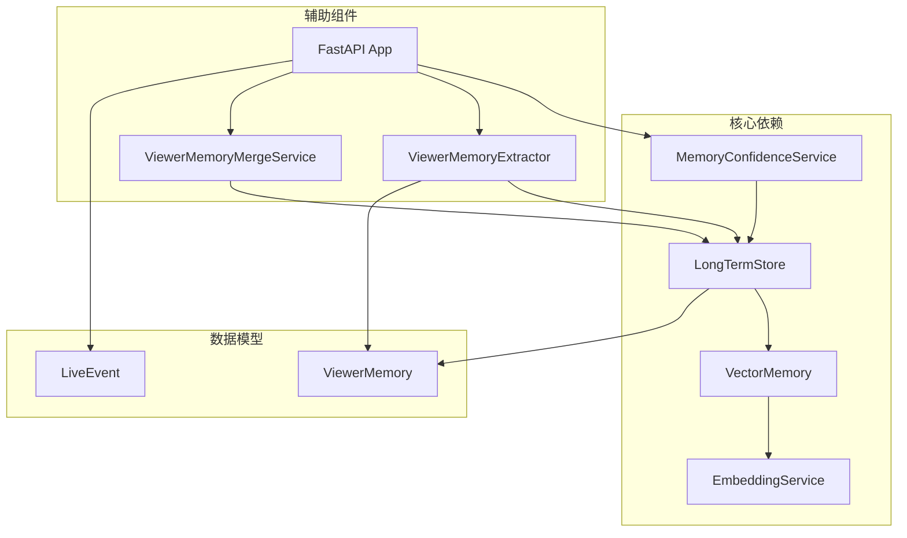
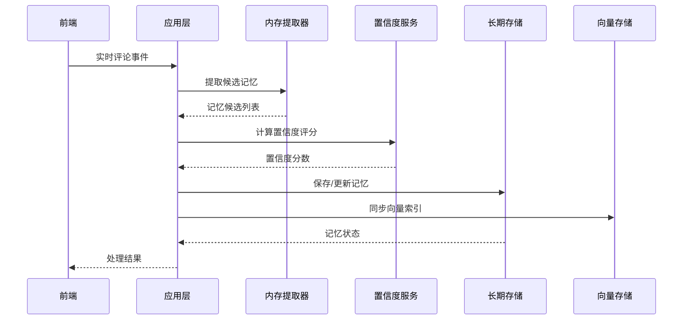

# 内存置信度评分服务

<cite>
**本文档引用的文件**
- [memory_confidence_service.py](file://backend/services/memory_confidence_service.py)
- [long_term.py](file://backend/memory/long_term.py)
- [vector_store.py](file://backend/memory/vector_store.py)
- [embedding_service.py](file://backend/memory/embedding_service.py)
- [live.py](file://backend/schemas/live.py)
- [app.py](file://backend/app.py)
- [test_memory_confidence_service.py](file://tests/test_memory_confidence_service.py)
</cite>

## 目录
1. [简介](#简介)
2. [项目结构](#项目结构)
3. [核心组件](#核心组件)
4. [架构概览](#架构概览)
5. [详细组件分析](#详细组件分析)
6. [依赖关系分析](#依赖关系分析)
7. [性能考虑](#性能考虑)
8. [故障排除指南](#故障排除指南)
9. [结论](#结论)

## 简介

内存置信度评分服务是DouYin直播内容处理系统中的关键组件，负责为用户记忆（memories）计算置信度分数。该服务通过多维度评估机制，综合考虑记忆的稳定性、交互价值、清晰度和证据强度等因素，为直播场景中的个性化推荐和智能回复提供可靠的记忆基础。

该系统特别针对抖音直播场景进行了优化，能够处理实时的用户互动数据，自动提取有价值的用户偏好信息，并为后续的建议生成和内容推荐提供支持。

## 项目结构

该项目采用模块化架构设计，主要包含以下核心模块：

**图表来源**
- [app.py:175-229](file://backend/app.py#L175-L229)
- [memory_confidence_service.py:4-118](file://backend/services/memory_confidence_service.py#L4-L118)

**章节来源**
- [app.py:1-689](file://backend/app.py#L1-L689)
- [memory_confidence_service.py:1-118](file://backend/services/memory_confidence_service.py#L1-L118)

## 核心组件

### 内存置信度服务（MemoryConfidenceService）

内存置信度服务是整个系统的核心算法组件，负责计算和更新记忆的置信度分数。该服务采用多维度评分策略，每个维度都有特定的权重和计算逻辑。

#### 主要特性

1. **多维度评分系统**：包括稳定性评分、交互价值评分、清晰度评分和证据评分四个核心维度
2. **动态权重组合**：使用加权平均算法，为不同维度分配适当的权重
3. **实时更新能力**：支持现有记忆的增量更新和证据积累
4. **鲁棒性设计**：包含数值范围限制和异常处理机制

#### 关键算法

**图表来源**
- [memory_confidence_service.py:57-64](file://backend/services/memory_confidence_service.py#L57-L64)

**章节来源**
- [memory_confidence_service.py:1-118](file://backend/services/memory_confidence_service.py#L1-L118)

## 架构概览

系统采用分层架构设计，从底层的数据存储到上层的应用接口，形成了完整的记忆管理生态系统：

**图表来源**
- [app.py:175-229](file://backend/app.py#L175-L229)
- [long_term.py:48-66](file://backend/memory/long_term.py#L48-L66)

## 详细组件分析

### 内存置信度评分算法

#### 稳定性评分（Stability Score）

稳定性评分主要评估记忆的时间持久性和重要程度：

**图表来源**
- [memory_confidence_service.py:4-118](file://backend/services/memory_confidence_service.py#L4-L118)

稳定性评分的关键因素包括：
- **时间范围权重**：长期记忆比短期记忆具有更高的稳定性分数
- **内容类型影响**：偏好类记忆比事实类记忆获得额外加分
- **时间提示词过滤**：包含短期时间提示词的内容会降低稳定性评分

#### 交互价值评分（Interaction Value Score）

交互价值评分衡量记忆对用户互动的重要性和实用性：

| 关键词类别 | 影响程度 | 示例 |
|-----------|----------|------|
| 高价值提示词 | +0.5 | "不能吃"、"忌口"、"喜欢"、"职业" |
| 文本长度奖励 | +0.1每级 | 16字符以下的简洁表达 |
| 偏好类型 | +0.1 | preference类型的记忆 |

#### 清晰度评分（Clarity Score）

清晰度评分评估记忆表达的明确性和可理解性：

**图表来源**
- [memory_confidence_service.py:38-49](file://backend/services/memory_confidence_service.py#L38-L49)

#### 证据评分（Evidence Score）

证据评分反映记忆被证实的次数和时间：

| 证据数量 | 基础分 | 计算公式 |
|---------|--------|----------|
| 1个证据 | 0.2 | 0.2 + (0.15 × 1) |
| 2个证据 | 0.35 | 0.2 + (0.15 × 2) |
| 3个证据 | 0.5 | 0.2 + (0.15 × 3) |
| 4个证据 | 0.65 | 0.2 + (0.15 × 4) |

### 内存生命周期管理

系统实现了完整的内存生命周期管理，从创建到销毁的全过程：

**图表来源**
- [long_term.py:1102-1301](file://backend/memory/long_term.py#L1102-L1301)

**章节来源**
- [memory_confidence_service.py:17-117](file://backend/services/memory_confidence_service.py#L17-L117)
- [long_term.py:1100-1301](file://backend/memory/long_term.py#L1100-L1301)

## 依赖关系分析

### 组件间依赖关系

**图表来源**
- [app.py:25-28](file://backend/app.py#L25-L28)
- [long_term.py](file://backend/memory/long_term.py#L9)

### 数据流依赖

系统中的数据流向体现了典型的流处理架构：

**图表来源**
- [app.py:249-405](file://backend/app.py#L249-L405)

**章节来源**
- [app.py:175-405](file://backend/app.py#L175-L405)
- [long_term.py:1100-1301](file://backend/memory/long_term.py#L1100-L1301)

## 性能考虑

### 算法复杂度分析

| 操作类型 | 时间复杂度 | 空间复杂度 | 说明 |
|---------|------------|------------|------|
| 新记忆评分 | O(n) | O(1) | n为关键词集合大小 |
| 现有记忆更新 | O(1) | O(1) | 常数时间更新现有分数 |
| 向量相似度查询 | O(k) | O(m) | k为候选数量，m为元数据大小 |
| 内存合并决策 | O(p) | O(1) | p为现有记忆数量 |

### 缓存策略

系统采用了多层次的缓存机制：

1. **短期缓存**：Redis存储最近的事件和建议，TTL为4小时
2. **长期缓存**：SQLite数据库存储完整的记忆历史
3. **向量缓存**：Chroma向量数据库存储语义嵌入
4. **进程内缓存**：内存中的最近记忆列表

### 性能优化建议

1. **批量处理**：对于大量内存操作，建议使用批量处理模式
2. **异步处理**：置信度计算可以异步执行，避免阻塞主流程
3. **索引优化**：合理设置数据库索引以提高查询性能
4. **内存管理**：定期清理过期的记忆条目，控制内存使用

## 故障排除指南

### 常见问题及解决方案

#### 置信度评分异常

**问题现象**：内存置信度分数异常高或低

**可能原因**：
1. 输入文本格式不正确
2. 关键词匹配逻辑异常
3. 数值范围限制导致分数被截断

**解决步骤**：
1. 检查输入候选的记忆文本格式
2. 验证关键词集合是否正确加载
3. 确认数值范围限制逻辑

#### 内存存储失败

**问题现象**：内存无法保存或更新

**可能原因**：
1. 数据库连接异常
2. 记忆状态验证失败
3. 并发访问冲突

**解决步骤**：
1. 检查数据库连接状态
2. 验证记忆状态转换的有效性
3. 实施适当的并发控制机制

#### 向量检索性能问题

**问题现象**：相似记忆查询响应缓慢

**可能原因**：
1. 向量索引未正确建立
2. 查询参数配置不当
3. 嵌入模型性能问题

**解决步骤**：
1. 重新构建向量索引
2. 调整查询限制参数
3. 优化嵌入模型配置

**章节来源**
- [test_memory_confidence_service.py:1-84](file://tests/test_memory_confidence_service.py#L1-L84)

## 结论

内存置信度评分服务为DouYin直播平台提供了强大的记忆管理能力。通过多维度评分算法和智能的内存生命周期管理，该系统能够有效识别和维护高质量的用户记忆，为个性化推荐和智能回复提供坚实的基础。

系统的主要优势包括：

1. **算法稳健性**：多维度评分确保了评分结果的可靠性
2. **实时处理能力**：支持高吞吐量的实时内存处理
3. **扩展性强**：模块化设计便于功能扩展和性能优化
4. **容错性好**：完善的错误处理和降级机制

未来可以考虑的改进方向：
- 引入机器学习模型提升评分准确性
- 增强跨房间的记忆共享能力
- 优化大规模数据处理的性能表现
- 扩展更多类型的记忆内容支持