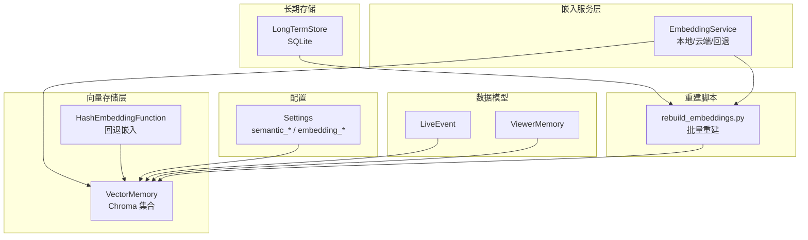
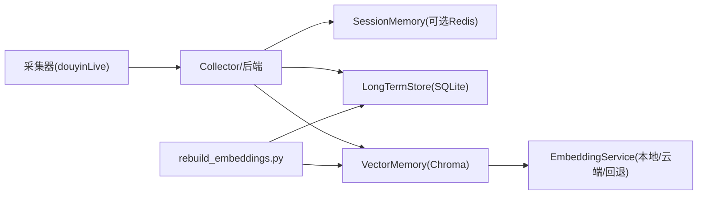
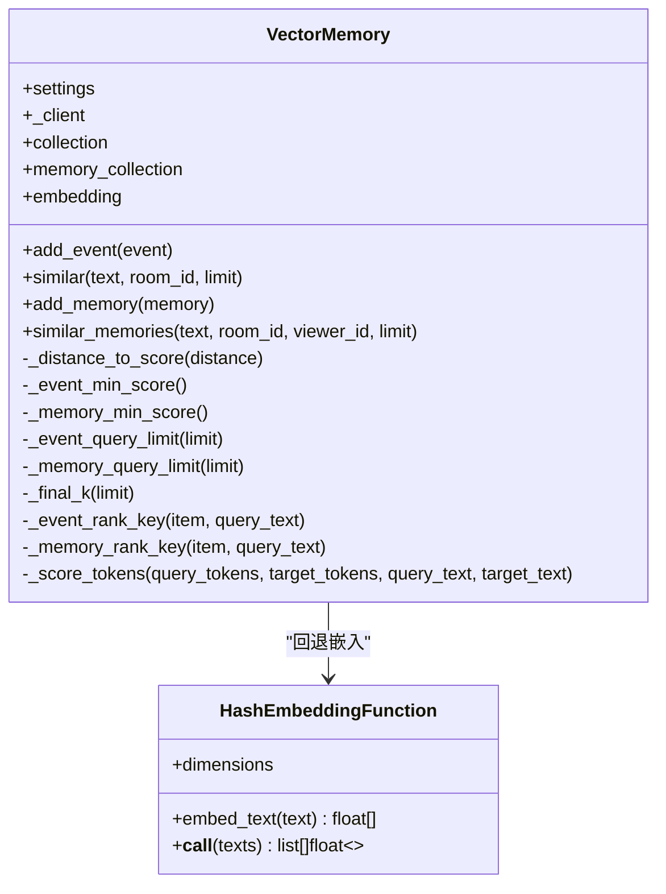
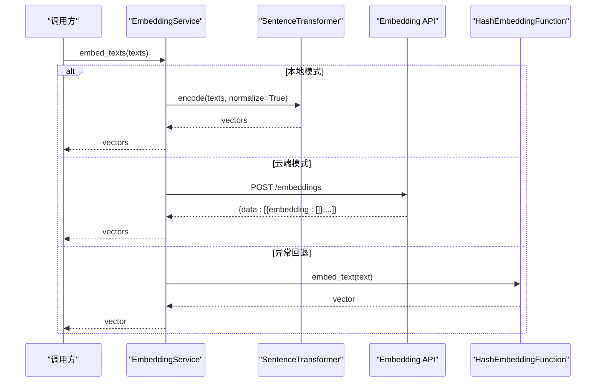
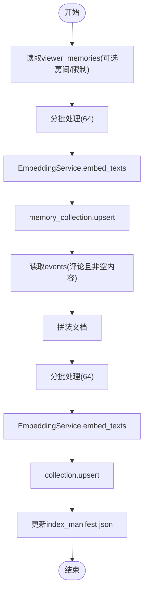
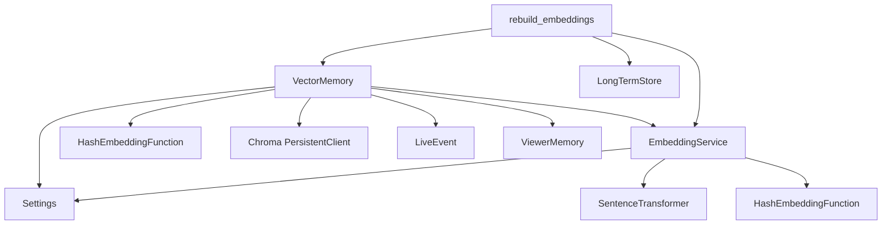

# 向量存储管理

<cite>
**本文引用的文件**
- [vector_store.py](file://backend/memory/vector_store.py)
- [embedding_service.py](file://backend/memory/embedding_service.py)
- [long_term.py](file://backend/memory/long_term.py)
- [session_memory.py](file://backend/memory/session_memory.py)
- [rebuild_embeddings.py](file://backend/memory/rebuild_embeddings.py)
- [config.py](file://backend/config.py)
- [live.py](file://backend/schemas/live.py)
- [test_vector_store.py](file://tests/test_vector_store.py)
- [test_embedding_service.py](file://tests/test_embedding_service.py)
- [README.md](file://README.md)
- [USAGE.md](file://USAGE.md)
</cite>

## 目录
1. [简介](#简介)
2. [项目结构](#项目结构)
3. [核心组件](#核心组件)
4. [架构总览](#架构总览)
5. [详细组件分析](#详细组件分析)
6. [依赖关系分析](#依赖关系分析)
7. [性能考量](#性能考量)
8. [故障排除指南](#故障排除指南)
9. [结论](#结论)
10. [附录](#附录)

## 简介
本文件面向DouYin_llm项目的向量存储管理组件，聚焦VectorMemory对ChromaDB的集成实现，系统性阐述以下方面：
- 向量数据库的初始化、连接管理与配置选项
- 嵌入向量的存储策略（维度、距离度量、索引优化）
- 相似度检索算法（余弦相似度近似、Top-K搜索优化）
- 完整的向量操作接口（插入、批量插入、查询、删除）
- 检索性能优化策略（索引构建、查询加速、内存管理）
- 与EmbeddingService的数据流转与降级机制
- 监控、维护与故障排除指南
- 实际使用示例与性能调优建议

## 项目结构
向量存储相关代码主要位于backend/memory目录，配合配置、数据模型与重建脚本协同工作：
- backend/memory/vector_store.py：VectorMemory与HashEmbeddingFunction，Chroma集成与相似度检索
- backend/memory/embedding_service.py：EmbeddingService，支持本地/云端/回退嵌入
- backend/memory/long_term.py：SQLite长期存储，支撑向量索引重建的数据源
- backend/memory/rebuild_embeddings.py：Chroma索引重建脚本，支持干运行、丢弃现有集合
- backend/config.py：Settings，提供向量检索阈值、查询上限、嵌入签名等配置
- backend/schemas/live.py：LiveEvent、ViewerMemory等数据模型
- tests/*：单元测试覆盖向量存储与嵌入服务的关键行为

图表来源
- [vector_store.py:59-317](file://backend/memory/vector_store.py#L59-L317)
- [embedding_service.py:18-102](file://backend/memory/embedding_service.py#L18-L102)
- [long_term.py:44-967](file://backend/memory/long_term.py#L44-L967)
- [rebuild_embeddings.py:155-276](file://backend/memory/rebuild_embeddings.py#L155-L276)
- [config.py:40-113](file://backend/config.py#L40-L113)
- [live.py:29-78](file://backend/schemas/live.py#L29-L78)

章节来源
- [README.md:1-223](file://README.md#L1-L223)
- [USAGE.md:1-256](file://USAGE.md#L1-L256)

## 核心组件
- VectorMemory：Chroma持久化客户端、事件与观众记忆集合、相似度检索与重排序、回退索引
- EmbeddingService：本地SentenceTransformer、云端OpenAI兼容接口、回退HashEmbeddingFunction
- HashEmbeddingFunction：无外部依赖的本地哈希嵌入回退
- LongTermStore：SQLite长期存储，提供重建脚本的数据源
- rebuild_embeddings：批量重建Chroma集合，支持干运行与清单记录
- Settings：向量检索阈值、查询上限、嵌入签名等配置项

章节来源
- [vector_store.py:34-317](file://backend/memory/vector_store.py#L34-L317)
- [embedding_service.py:18-102](file://backend/memory/embedding_service.py#L18-L102)
- [long_term.py:44-967](file://backend/memory/long_term.py#L44-L967)
- [rebuild_embeddings.py:155-276](file://backend/memory/rebuild_embeddings.py#L155-L276)
- [config.py:40-113](file://backend/config.py#L40-L113)

## 架构总览
向量存储在整体系统中的位置如下：
- 采集层产生LiveEvent，经后端规范化后写入短期内存、长期存储与向量存储
- 向量存储使用Chroma持久化，结合EmbeddingService生成的向量进行相似度检索
- 重建脚本从SQLite中抽取数据，批量写入Chroma，支持丢弃旧集合与清单记录

图表来源
- [README.md:7-17](file://README.md#L7-L17)
- [vector_store.py:59-84](file://backend/memory/vector_store.py#L59-L84)
- [rebuild_embeddings.py:233-276](file://backend/memory/rebuild_embeddings.py#L233-L276)

## 详细组件分析

### VectorMemory：ChromaDB集成与相似度检索
- 初始化与连接管理
  - 使用PersistentClient连接到指定路径，创建两个集合：live_history_{signature}与viewer_memories_{signature}
  - signature来源于Settings.embedding_signature()，确保不同嵌入模式/模型的集合隔离
  - 若未安装Chroma，记录警告并使用内存回退索引（_event_items/_memory_items）

- 嵌入与存储策略
  - 默认使用EmbeddingService；若未传入则使用HashEmbeddingFunction
  - 事件与观众记忆均通过upsert写入，包含文档、元数据与嵌入
  - 事件集合文档为“昵称 + 内容”，元数据包含房间ID、事件类型、昵称、时间戳
  - 观众记忆集合文档为记忆文本，元数据包含房间ID、观众ID、记忆类型、来源事件ID、置信度、更新时间、召回次数

- 相似度检索与重排序
  - 事件检索：先调用Chroma.query，若失败则回退到内存中的朴素TF-IDf风格重排序
  - 观众记忆检索：先调用Chroma.query，若失败则回退到内存中的朴素TF-IDf风格重排序
  - 距离到分数映射：distance_to_score = 1/(1+distance)，用于将欧氏距离近似的相似度映射到[0,1]
  - 事件重排序键：(score, 查询词包含标记, 事件类型权重, 时间戳)
  - 观众记忆重排序键：(reranked_score, 更新时间)，reranked_score综合了向量分数、置信度、查询词包含、召回次数

- 查询参数与阈值
  - 查询上限：semantic_event_query_limit/semantic_memory_query_limit
  - 最低分数：semantic_event_min_score/semantic_memory_min_score
  - 最终K：semantic_final_k，用于截断结果

- 回退索引
  - 事件与记忆分别维护固定长度的内存列表，超出容量时尾部淘汰
  - 回退检索时使用tokenize_text进行分词，计算交集/平方根分母的相似度，并叠加查询词包含奖励

图表来源
- [vector_store.py:34-317](file://backend/memory/vector_store.py#L34-L317)

章节来源
- [vector_store.py:59-317](file://backend/memory/vector_store.py#L59-L317)
- [config.py:106-113](file://backend/config.py#L106-L113)

### EmbeddingService：嵌入服务与回退机制
- 模式选择
  - local：使用SentenceTransformer，normalize_embeddings=True，batch_size来自配置
  - cloud：通过HTTP POST到embedding_base_url/embeddings，携带Authorization头
  - 回退：当本地/云端异常时，使用HashEmbeddingFunction，记录一次警告

- 本地模型加载
  - 首次调用时惰性加载，device与batch_size来自配置
  - encode返回向量列表，转换为Python原生list

- 云端请求
  - 超时由embedding_timeout_seconds控制
  - 成功后重置回退标志，避免重复警告

图表来源
- [embedding_service.py:18-102](file://backend/memory/embedding_service.py#L18-L102)

章节来源
- [embedding_service.py:18-102](file://backend/memory/embedding_service.py#L18-L102)
- [config.py:64-75](file://backend/config.py#L64-L75)

### HashEmbeddingFunction：本地哈希回退
- 将文本分词为token集合，对每个token做SHA256，按维度取模分配符号权重
- 归一化为单位向量，避免维度信息泄露
- 作为EmbeddingService的回退方案，确保在无网络/无模型时仍可工作

章节来源
- [vector_store.py:34-57](file://backend/memory/vector_store.py#L34-L57)

### rebuild_embeddings：批量重建Chroma索引
- 从SQLite读取事件/记忆数据，按批次调用EmbeddingService生成向量
- upsert写入对应集合，支持drop_existing丢弃旧集合
- 记录index_manifest.json，包含active_signature、collections、重建时间与计数

图表来源
- [rebuild_embeddings.py:155-276](file://backend/memory/rebuild_embeddings.py#L155-L276)
- [long_term.py:162-174](file://backend/memory/long_term.py#L162-L174)

章节来源
- [rebuild_embeddings.py:155-276](file://backend/memory/rebuild_embeddings.py#L155-L276)
- [long_term.py:454-488](file://backend/memory/long_term.py#L454-L488)

### 数据模型与接口定义
- LiveEvent：事件ID、房间ID、事件类型、用户信息、内容、时间戳、元数据
- ViewerMemory：记忆ID、房间ID、观众ID、来源事件ID、记忆文本、类型、置信度、时间戳
- VectorMemory接口要点
  - add_event：写入事件并同步到Chroma
  - similar：按房间过滤的事件相似度检索
  - add_memory：写入观众记忆并同步到Chroma
  - similar_memories：按房间+观众过滤的记忆相似度检索

章节来源
- [live.py:29-78](file://backend/schemas/live.py#L29-L78)
- [vector_store.py:149-317](file://backend/memory/vector_store.py#L149-L317)

## 依赖关系分析
- VectorMemory依赖
  - Settings：semantic_*阈值、查询上限、嵌入签名
  - EmbeddingService/HashEmbeddingFunction：向量生成
  - Chroma：PersistentClient、Collection、query/upsert
  - LiveEvent/ViewerMemory：数据模型
- EmbeddingService依赖
  - Settings：embedding_mode/model/base_url/api_key/timeout/device/batch_size
  - SentenceTransformer：本地模式
  - urllib：云端模式
  - HashEmbeddingFunction：回退
- rebuild_embeddings依赖
  - LongTermStore：SQLite数据源
  - EmbeddingService：批量嵌入
  - VectorMemory：写入Chroma

图表来源
- [vector_store.py:59-84](file://backend/memory/vector_store.py#L59-L84)
- [embedding_service.py:18-102](file://backend/memory/embedding_service.py#L18-L102)
- [rebuild_embeddings.py:155-276](file://backend/memory/rebuild_embeddings.py#L155-L276)
- [config.py:40-113](file://backend/config.py#L40-L113)

章节来源
- [vector_store.py:59-84](file://backend/memory/vector_store.py#L59-L84)
- [embedding_service.py:18-102](file://backend/memory/embedding_service.py#L18-L102)
- [rebuild_embeddings.py:155-276](file://backend/memory/rebuild_embeddings.py#L155-L276)
- [config.py:40-113](file://backend/config.py#L40-L113)

## 性能考量
- 向量维度与嵌入质量
  - 云端/本地嵌入由Settings.embedding_model决定，维度通常与模型一致
  - 回退HashEmbeddingFunction维度可配置，默认256维，适合无网络/无模型场景

- 距离度量与相似度映射
  - Chroma内部使用L2距离，VectorMemory将其映射为相似度分数
  - 事件与记忆检索均使用distance_to_score = 1/(1+distance)

- Top-K与阈值控制
  - 查询上限：semantic_event_query_limit/semantic_memory_query_limit
  - 最低分数：semantic_event_min_score/semantic_memory_min_score
  - 最终截断：semantic_final_k

- 查询加速与索引优化
  - Chroma集合按embedding_signature命名，避免不同嵌入配置混用
  - rebuild_embeddings支持丢弃旧集合并重建，提升检索一致性
  - 建议在高并发场景下：
    - 合理设置查询上限与最低分数，避免返回过多候选
    - 使用房间/观众ID过滤减少扫描范围
    - 定期重建索引，保持向量分布稳定

- 内存管理
  - 事件与记忆在内存中的回退索引采用固定容量队列，超出容量尾部淘汰
  - 建议根据业务规模调整回退索引容量，平衡内存与召回

- 批量写入
  - rebuild_embeddings使用64条批次批量upsert，降低网络/磁盘压力
  - 建议在重建时开启drop_existing，确保集合一致性

章节来源
- [vector_store.py:86-134](file://backend/memory/vector_store.py#L86-L134)
- [config.py:71-76](file://backend/config.py#L71-L76)
- [rebuild_embeddings.py:173-192](file://backend/memory/rebuild_embeddings.py#L173-L192)

## 故障排除指南
- Chroma不可用
  - 现象：记录警告并使用内存回退索引
  - 处理：安装Chroma或禁用向量检索功能
  - 参考：VectorMemory初始化逻辑

- 嵌入服务异常
  - 现象：云端/本地调用失败，回退到HashEmbeddingFunction
  - 处理：检查网络、API密钥、超时设置；必要时切换到本地模式
  - 参考：EmbeddingService异常捕获与回退

- 相似度检索为空
  - 现象：Chroma.query失败或结果低于阈值
  - 处理：降低semantic_*阈值；检查房间/观众ID过滤条件；回退到内存检索
  - 参考：VectorMemory.similar与similar_memories

- 索引不一致或检索不准
  - 现象：不同嵌入配置导致集合混用
  - 处理：使用rebuild_embeddings重建索引；确保Settings.embedding_signature一致
  - 参考：rebuild_embeddings与index_manifest.json

- 重建脚本使用
  - 现象：需要重建事件或记忆集合
  - 处理：使用--target/--room-id/--limit/--drop-existing/--dry-run
  - 参考：rebuild_embeddings命令行参数

章节来源
- [vector_store.py:70-84](file://backend/memory/vector_store.py#L70-L84)
- [embedding_service.py:33-48](file://backend/memory/embedding_service.py#L33-L48)
- [rebuild_embeddings.py:278-299](file://backend/memory/rebuild_embeddings.py#L278-L299)

## 结论
VectorMemory通过Chroma实现了高效的语义检索，结合EmbeddingService提供了灵活的嵌入策略与可靠的回退机制。通过Settings的阈值与查询上限控制，可在准确性与性能之间取得平衡。rebuild_embeddings为索引重建提供了自动化工具，配合index_manifest.json实现版本化管理。建议在生产环境中：
- 明确嵌入模式与模型，统一embedding_signature
- 合理设置semantic_*参数，定期评估召回效果
- 使用重建脚本维护索引一致性
- 在高负载场景下优化查询上限与过滤条件

## 附录

### 配置项参考（Settings）
- 向量检索阈值与查询上限
  - semantic_event_min_score
  - semantic_memory_min_score
  - semantic_event_query_limit
  - semantic_memory_query_limit
  - semantic_final_k
- 嵌入配置
  - embedding_mode
  - embedding_model
  - embedding_base_url
  - embedding_api_key
  - embedding_timeout_seconds
  - local_embedding_device
  - local_embedding_batch_size
- 存储路径
  - data_dir
  - database_path
  - chroma_dir

章节来源
- [config.py:64-113](file://backend/config.py#L64-L113)

### 使用示例与最佳实践
- 插入事件
  - 调用VectorMemory.add_event，自动拼装文档并写入Chroma
  - 参考：VectorMemory.add_event

- 查询事件
  - 调用VectorMemory.similar，支持房间过滤与阈值控制
  - 参考：VectorMemory.similar

- 插入观众记忆
  - 调用VectorMemory.add_memory，写入记忆文本与元数据
  - 参考：VectorMemory.add_memory

- 查询观众记忆
  - 调用VectorMemory.similar_memories，按房间+观众过滤
  - 参考：VectorMemory.similar_memories

- 重建索引
  - 使用rebuild_embeddings命令，支持目标选择、房间过滤、限制数量、丢弃旧集合、干运行
  - 参考：rebuild_embeddings命令行

- 监控与维护
  - 查看index_manifest.json，确认active_signature与collections
  - 定期重建索引，确保向量分布稳定
  - 参考：rebuild_embeddings清单记录

章节来源
- [vector_store.py:149-317](file://backend/memory/vector_store.py#L149-L317)
- [rebuild_embeddings.py:233-299](file://backend/memory/rebuild_embeddings.py#L233-L299)