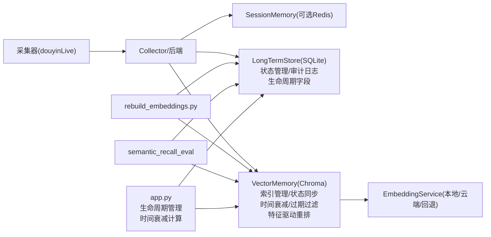
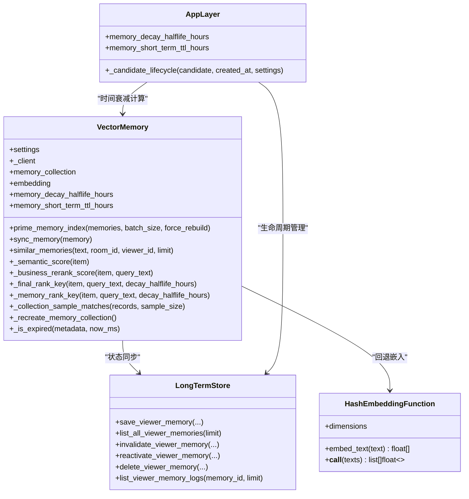
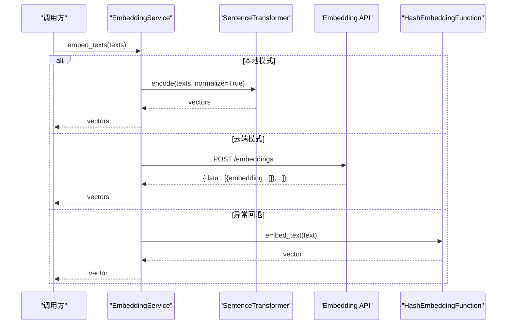
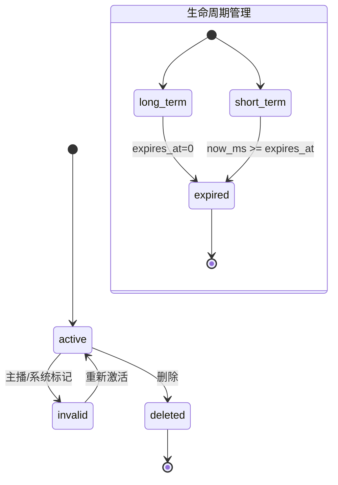
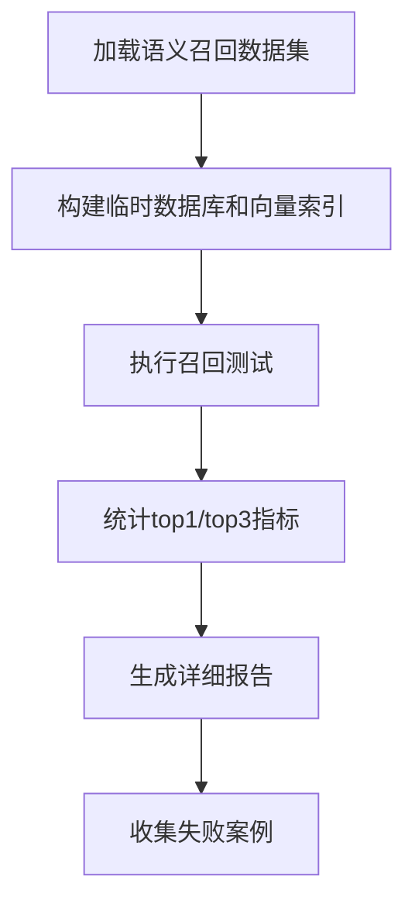
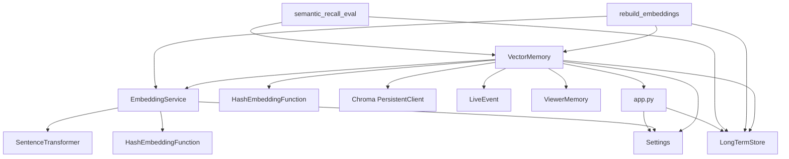

# 向量存储管理

<cite>
**本文引用的文件**
- [vector_store.py](file://backend/memory/vector_store.py)
- [embedding_service.py](file://backend/memory/embedding_service.py)
- [long_term.py](file://backend/memory/long_term.py)
- [session_memory.py](file://backend/memory/session_memory.py)
- [rebuild_embeddings.py](file://backend/memory/rebuild_embeddings.py)
- [config.py](file://backend/config.py)
- [live.py](file://backend/schemas/live.py)
- [app.py](file://backend/app.py)
- [test_vector_store.py](file://tests/test_vector_store.py)
- [test_embedding_service.py](file://tests/test_embedding_service.py)
- [README.md](file://README.md)
- [USAGE.md](file://USAGE.md)
- [semantic-recall-eval.md](file://docs/superpowers/plans/2026-04-16-semantic-recall-eval.md)
- [viewer-memory-correction.md](file://docs/superpowers/plans/2026-04-16-viewer-memory-correction.md)
- [runner.py](file://tests/memory_pipeline_verifier/runner.py)
- [test_verify_memory_pipeline.py](file://tests/test_verify_memory_pipeline.py)
- [2026-04-20-memory-lifecycle-management.md](file://docs/superpowers/plans/2026-04-20-memory-lifecycle-management.md)
- [2026-04-20-memory-lifecycle-management-design.md](file://docs/superpowers/specs/2026-04-20-memory-lifecycle-management-design.md)
- [2026-04-20-memory-rerank.md](file://docs/superpowers/plans/2026-04-20-memory-rerank.md)
</cite>

## 更新摘要
**变更内容**
- 新增特征驱动记忆重排系统：从简单的语义相似度排序升级为三阶段评分机制
- 新增 _semantic_score()、_business_rerank_score()、_final_rank_key() 三个专用方法
- 引入交互价值、证据、稳定性、置信度等多个业务质量信号的加权计算
- 实现三阶段评分机制：semantic_score + business_rerank_score + final_score
- 增强排序算法，支持业务信号权重和时间衰减的综合考虑

## 目录
1. [简介](#简介)
2. [项目结构](#项目结构)
3. [核心组件](#核心组件)
4. [架构总览](#架构总览)
5. [详细组件分析](#详细组件分析)
6. [依赖关系分析](#依赖关系分析)
7. [性能考量](#性能考量)
8. [故障排除指南](#故障排除指南)
9. [结论](#结论)
10. [附录](#附录)

## 简介
本文件面向DouYin_llm项目的向量存储管理组件，聚焦VectorMemory对ChromaDB的集成实现，系统性阐述以下方面：
- 向量数据库的初始化、连接管理与配置选项
- 嵌入向量的存储策略（维度、距离度量、索引优化）
- 特征驱动记忆重排系统（三阶段评分机制：semantic_score + business_rerank_score + final_score）
- 相似度检索算法（余弦相似度近似、Top-K搜索优化、时间衰减计算）
- 完整的向量操作接口（插入、批量插入、查询、删除、同步）
- 检索性能优化策略（索引构建、查询加速、内存管理）
- 与EmbeddingService的数据流转与降级机制
- 观众记忆纠正功能与状态管理
- 语义召回评估工具与指标统计
- 生命周期管理与过期过滤机制
- 监控、维护与故障排除指南
- 实际使用示例与性能调优建议

## 项目结构
向量存储相关代码主要位于backend/memory目录，配合配置、数据模型与重建脚本协同工作：
- backend/memory/vector_store.py：VectorMemory与HashEmbeddingFunction，Chroma集成与相似度检索
- backend/memory/embedding_service.py：EmbeddingService，支持本地/云端/回退嵌入
- backend/memory/long_term.py：SQLite长期存储，支撑向量索引重建的数据源，新增状态管理与审计日志
- backend/memory/rebuild_embeddings.py：Chroma索引重建脚本，支持干运行、丢弃现有集合
- backend/config.py：Settings，提供向量检索阈值、查询上限、嵌入签名、时间衰减配置
- backend/schemas/live.py：LiveEvent、ViewerMemory等数据模型，新增生命周期字段
- backend/app.py：应用层，实现生命周期管理与时间衰减计算
- tests/*：单元测试覆盖向量存储与嵌入服务的关键行为
- docs/superpowers/plans：新功能规划文档，包括语义召回评估、观众记忆纠正和记忆重排

```mermaid
graph TB
subgraph "向量存储层"
VM["VectorMemory<br/>Chroma 集合<br/>索引管理<br/>时间衰减<br/>特征驱动重排"]
HEF["HashEmbeddingFunction<br/>回退嵌入"]
PRIME["prime_memory_index<br/>索引预热"]
SYNC["sync_memory<br/>状态同步"]
EXPIRE["expires_at 过滤<br/>生命周期管理"]
END
subgraph "嵌入服务层"
ES["EmbeddingService<br/>本地/云端/回退"]
END
subgraph "数据模型"
LE["LiveEvent"]
VMem["ViewerMemory<br/>生命周期字段<br/>业务质量信号"]
END
subgraph "配置"
CFG["Settings<br/>semantic_* / embedding_*<br/>memory_decay_halflife_hours<br/>memory_short_term_ttl_hours"]
END
subgraph "长期存储"
LTS["LongTermStore<br/>SQLite<br/>审计日志"]
END
subgraph "重建脚本"
REB["rebuild_embeddings.py<br/>批量重建"]
END
subgraph "评估工具"
SE["semantic_recall_eval<br/>top1/top3指标"]
END
subgraph "应用层"
APP["app.py<br/>生命周期管理<br/>时间衰减计算"]
END
ES --> VM
HEF --> VM
CFG --> VM
LE --> VM
VMem --> VM
LTS --> REB
ES --> REB
REB --> VM
SE --> VM
APP --> VM
APP --> LTS
```

**图表来源**
- [vector_store.py:59-445](file://backend/memory/vector_store.py#L59-L445)
- [embedding_service.py:18-102](file://backend/memory/embedding_service.py#L18-L102)
- [long_term.py:170-369](file://backend/memory/long_term.py#L170-L369)
- [rebuild_embeddings.py:155-276](file://backend/memory/rebuild_embeddings.py#L155-L276)
- [config.py:40-126](file://backend/config.py#L40-L126)
- [live.py:29-100](file://backend/schemas/live.py#L29-L100)
- [app.py:175-180](file://backend/app.py#L175-L180)

**章节来源**
- [README.md:1-223](file://README.md#L1-L223)
- [USAGE.md:1-256](file://USAGE.md#L1-L256)

## 核心组件
- VectorMemory：Chroma持久化客户端、事件与观众记忆集合、相似度检索与重排序、回退索引、索引管理、状态同步、时间衰减计算、过期过滤、**新增**：特征驱动记忆重排系统
- EmbeddingService：本地SentenceTransformer、云端OpenAI兼容接口、回退HashEmbeddingFunction
- HashEmbeddingFunction：无外部依赖的本地哈希嵌入回退
- LongTermStore：SQLite长期存储，提供重建脚本的数据源，新增状态管理与审计日志
- rebuild_embeddings：批量重建Chroma集合，支持干运行与清单记录
- Settings：向量检索阈值、查询上限、嵌入签名、时间衰减配置等配置项
- semantic_recall_eval：语义召回评估工具，支持top1/top3指标统计
- app.py：应用层，实现生命周期管理与时间衰减计算

**章节来源**
- [vector_store.py:34-445](file://backend/memory/vector_store.py#L34-L445)
- [embedding_service.py:18-102](file://backend/memory/embedding_service.py#L18-L102)
- [long_term.py:44-967](file://backend/memory/long_term.py#L44-L967)
- [rebuild_embeddings.py:155-276](file://backend/memory/rebuild_embeddings.py#L155-L276)
- [config.py:40-126](file://backend/config.py#L40-L126)
- [app.py:175-180](file://backend/app.py#L175-L180)

## 架构总览
向量存储在整体系统中的位置如下：
- 采集层产生LiveEvent，经后端规范化后写入短期内存、长期存储与向量存储
- 应用层根据候选记忆的temporal_scope计算生命周期，设置expires_at字段
- 向量存储使用Chroma持久化，结合EmbeddingService生成的向量进行相似度检索
- VectorMemory实现时间衰减计算和过期过滤，确保召回质量
- **新增**：特征驱动记忆重排系统，通过三阶段评分机制提升召回质量
- 重建脚本从SQLite中抽取数据，批量写入Chroma，支持丢弃旧集合与清单记录
- 评估工具支持语义召回评测，提供top1/top3指标统计



**图表来源**
- [README.md:7-17](file://README.md#L7-L17)
- [vector_store.py:59-84](file://backend/memory/vector_store.py#L59-L84)
- [rebuild_embeddings.py:233-276](file://backend/memory/rebuild_embeddings.py#L233-L276)
- [app.py:175-180](file://backend/app.py#L175-L180)

## 详细组件分析

### VectorMemory：ChromaDB集成与相似度检索
- 初始化与连接管理
  - 使用PersistentClient连接到指定路径，创建viewer_memories_{signature}集合
  - signature来源于Settings.embedding_signature()，确保不同嵌入模式/模型的集合隔离
  - 若未安装Chroma，记录警告并使用内存回退索引（_event_items/_memory_items）

- 嵌入与存储策略
  - 默认使用EmbeddingService；若未传入则使用HashEmbeddingFunction
  - 事件与观众记忆均通过upsert写入，包含文档、元数据与嵌入
  - 事件集合文档为"昵称 + 内容"，元数据包含房间ID、事件类型、昵称、时间戳
  - 观众记忆集合文档为记忆文本，元数据包含房间ID、观众ID、记忆类型、来源事件ID、置信度、更新时间、召回次数、状态、来源类型、是否置顶、稳定性评分、交互价值评分、清晰度评分、证据评分、生命周期类型、过期时间

- **新增**：特征驱动记忆重排系统
  - 三阶段评分机制：semantic_score + business_rerank_score + final_score
  - _semantic_score()：提取Chroma查询得到的语义相似度分数
  - _business_rerank_score()：基于业务质量信号的综合评分，包含交互价值、证据、稳定性、置信度等加权计算
  - _final_rank_key()：最终排序键，结合语义分数、业务评分和时间衰减

- 相似度检索与重排序
  - 事件检索：先调用Chroma.query，若失败则回退到内存中的朴素TF-IDf风格重排序
  - 观众记忆检索：先调用Chroma.query，若失败则回退到内存中的朴素TF-IDf风格重排序
  - 距离到分数映射：distance_to_score = 1/(1+distance)，用于将欧氏距离近似的相似度映射到[0,1]
  - 事件重排序键：(score, 查询词包含标记, 事件类型权重, 时间戳)
  - **更新**：观众记忆重排序键：(_final_rank_key(item, query_text, decay_halflife_hours), updated_at)

- 时间衰减计算
  - halflife衰减模型：time_decay = 2^(-age_hours / halflife_hours)
  - decay_halflife_hours配置项控制衰减速度，0表示禁用时间衰减
  - last_recalled_at字段用于加速衰减，最近被召回的记忆衰减更慢
  - 置顶记忆不受时间衰减影响

- 过期过滤机制
  - expires_at字段存储记忆的过期时间戳（毫秒）
  - _is_expired方法检查记忆是否已过期：expires_at > 0 且 now_ms >= expires_at
  - 在查询和召回过程中自动过滤过期记忆
  - 生命周期管理支持短期记忆（72小时默认TTL）和长期记忆

- 查询参数与阈值
  - 查询上限：semantic_event_query_limit/semantic_memory_query_limit
  - 最低分数：semantic_event_min_score/semantic_memory_min_score
  - 最终K：semantic_final_k，用于截断结果

- 回退索引
  - 事件与记忆分别维护固定长度的内存列表，超出容量时尾部淘汰
  - 回退检索时使用tokenize_text进行分词，计算交集/平方根分母的相似度，并叠加查询词包含奖励

- 索引管理功能
  - prime_memory_index：预热索引，支持批量重建和一致性检查
  - _collection_sample_matches：检查集合样本匹配度，确保索引一致性
  - _recreate_memory_collection：重建集合，处理集合不一致的情况

- 状态同步功能
  - add_memory：添加记忆时包含状态、来源类型、置顶等元数据
  - sync_memory：同步记忆状态，自动移除无效状态的记忆
  - remove_memory：删除指定ID的记忆



**图表来源**
- [vector_store.py:59-445](file://backend/memory/vector_store.py#L59-L445)

**章节来源**
- [vector_store.py:59-445](file://backend/memory/vector_store.py#L59-L445)
- [config.py:106-126](file://backend/config.py#L106-L126)

### **新增**：特征驱动记忆重排系统详解
- **三阶段评分机制**
  - 第一阶段：语义相似度评分（semantic_score）
    - 来源于Chroma查询结果的距离转换，使用distance_to_score = 1/(1+distance)
    - 衡量记忆与查询的语义相似程度
  
  - 第二阶段：业务质量信号评分（business_rerank_score）
    - 交互价值评分（interaction_value_score）：0.35权重，衡量记忆对直播互动的价值
    - 证据评分（evidence_score）：0.20权重，衡量记忆的证据强度
    - 稳定性评分（stability_score）：0.15权重，衡量记忆的稳定性
    - 置信度（confidence）：0.10权重，衡量记忆的可信度
    - 手动标记奖励（manual_bonus）：0.08权重，鼓励人工标注的记忆
    - 置顶奖励（pin_bonus）：0.07权重，优先置顶的记忆
    - 回忆次数奖励（recall_bonus）：0.05权重，基于recall_count的线性奖励
    - 查询词包含奖励（contains_query）：0.02权重，查询词出现在记忆中的额外奖励
  
  - 第三阶段：最终综合评分（final_score）
    - final_score = (0.55 × semantic_score + 0.45 × business_rerank_score) × time_decay
    - time_decay：时间衰减因子，受halflife模型控制

- **排序算法实现**
  - _semantic_score()：直接提取Chroma查询结果中的score字段
  - _business_rerank_score()：计算业务质量信号的加权和，包含各种奖励机制
  - _final_rank_key()：组合语义分数、业务评分和时间衰减，返回(最终分数, 更新时间)的排序键

- **业务信号权重设计原理**
  - 语义分数权重较高（0.55），确保语义相关性仍是主导因素
  - 业务评分权重适中（0.45），确保业务质量信号能够有效提升召回质量
  - 时间衰减保持原有机制，置顶记忆完全豁免

**章节来源**
- [vector_store.py:271-333](file://backend/memory/vector_store.py#L271-L333)
- [2026-04-20-memory-rerank.md:79-95](file://docs/superpowers/plans/2026-04-20-memory-rerank.md#L79-L95)

### EmbeddingService：嵌入服务与回退机制
- 模式选择
  - local：使用SentenceTransformer，normalize_embeddings=True，batch_size来自配置
  - cloud：通过HTTP POST到embedding_base_url/embeddings，携带Authorization头
  - 回退：当本地/云端异常时，使用HashEmbeddingFunction，记录一次警告

- 本地模型加载
  - 首次调用时惰性加载，device与batch_size来自配置
  - encode返回向量列表，转换为Python原生list

- 云端请求
  - 超时由embedding_timeout_seconds控制
  - 成功后重置回退标志，避免重复警告



**图表来源**
- [embedding_service.py:18-102](file://backend/memory/embedding_service.py#L18-L102)

**章节来源**
- [embedding_service.py:18-102](file://backend/memory/embedding_service.py#L18-L102)
- [config.py:64-75](file://backend/config.py#L64-L75)

### HashEmbeddingFunction：本地哈希回退
- 将文本分词为token集合，对每个token做SHA256，按维度取模分配符号权重
- 归一化为单位向量，避免维度信息泄露
- 作为EmbeddingService的回退方案，确保在无网络/无模型时仍可工作

**章节来源**
- [vector_store.py:34-57](file://backend/memory/vector_store.py#L34-L57)

### rebuild_embeddings：批量重建Chroma索引
- 从SQLite读取事件/记忆数据，按批次调用EmbeddingService生成向量
- upsert写入对应集合，支持drop_existing丢弃旧集合
- 记录index_manifest.json，包含active_signature、collections、重建时间与计数


**图表来源**
- [rebuild_embeddings.py:155-276](file://backend/memory/rebuild_embeddings.py#L155-L276)
- [long_term.py:162-174](file://backend/memory/long_term.py#L162-L174)

**章节来源**
- [rebuild_embeddings.py:155-276](file://backend/memory/rebuild_embeddings.py#L155-L276)
- [long_term.py:454-488](file://backend/memory/long_term.py#L454-L488)

### 数据模型与接口定义
- LiveEvent：事件ID、房间ID、事件类型、用户信息、内容、时间戳、元数据
- ViewerMemory：记忆ID、房间ID、观众ID、来源事件ID、记忆文本、类型、置信度、时间戳
  - 新增字段：source_kind（来源类型）、status（状态）、is_pinned（是否置顶）、correction_reason（纠正原因）、corrected_by（纠正者）
  - 新增生命周期字段：lifecycle_kind（生命周期类型）、expires_at（过期时间戳）
  - **新增**：多维评分字段：stability_score、interaction_value_score、clarity_score、evidence_score
- VectorMemory接口要点
  - add_event：写入事件并同步到Chroma
  - similar：按房间过滤的事件相似度检索
  - add_memory：写入观众记忆并同步到Chroma，包含状态元数据
  - similar_memories：按房间+观众过滤的记忆相似度检索，支持时间衰减和过期过滤
  - prime_memory_index：预热索引，支持批量重建和一致性检查
  - sync_memory：同步记忆状态，自动移除无效状态的记忆
  - remove_memory：删除指定ID的记忆

**章节来源**
- [live.py:29-100](file://backend/schemas/live.py#L29-L100)
- [vector_store.py:149-445](file://backend/memory/vector_store.py#L149-L445)

### 生命周期管理与时间衰减
- 生命周期管理
  - _candidate_lifecycle函数根据temporal_scope计算生命周期
  - short_term：设置lifecycle_kind='short_term'，expires_at=created_at + TTL
  - long_term：设置lifecycle_kind='long_term'，expires_at=0（不过期）
  - 默认TTL为72小时（可通过memory_short_term_ttl_hours配置）

- 时间衰减计算
  - _memory_rank_key方法实现halflife衰减模型
  - time_decay = 2^(-age_hours / halflife_hours)
  - halflife_hours配置项控制衰减速度，默认168小时（一周）
  - last_recalled_at字段用于加速衰减，最近被召回的记忆衰减更慢
  - 置顶记忆不受时间衰减影响

- 过期过滤机制
  - _is_expired方法检查记忆是否已过期
  - expires_at > 0 且 now_ms >= expires_at时记忆过期
  - 在similar_memories查询中自动过滤过期记忆
  - 在prime_memory_index构建索引时也过滤过期记忆



**图表来源**
- [long_term.py:170-369](file://backend/memory/long_term.py#L170-L369)
- [app.py:175-180](file://backend/app.py#L175-L180)

**章节来源**
- [long_term.py:170-369](file://backend/memory/long_term.py#L170-L369)
- [vector_store.py:250-267](file://backend/memory/vector_store.py#L250-L267)
- [app.py:175-180](file://backend/app.py#L175-L180)

### 语义召回评估工具
- 功能概述
  - 支持top1和top3召回率统计
  - 提供详细的召回结果报告
  - 支持失败案例收集和分析

- 使用流程
  - 加载语义召回数据集
  - 构建临时数据库和向量索引
  - 执行召回测试并统计指标
  - 输出详细的结果报告

- 指标统计
  - cases：测试案例总数
  - top1：top1命中数/总数
  - top3：top3命中数/总数
  - top1_rate：top1命中率
  - top3_rate：top3命中率



**图表来源**
- [runner.py:327-412](file://tests/memory_pipeline_verifier/runner.py#L327-L412)

**章节来源**
- [runner.py:327-412](file://tests/memory_pipeline_verifier/runner.py#L327-L412)
- [semantic-recall-eval.md:212-322](file://docs/superpowers/plans/2026-04-16-semantic-recall-eval.md#L212-L322)

## 依赖关系分析
- VectorMemory依赖
  - Settings：semantic_*阈值、查询上限、嵌入签名、memory_decay_halflife_hours、memory_short_term_ttl_hours
  - EmbeddingService/HashEmbeddingFunction：向量生成
  - Chroma：PersistentClient、Collection、query/upsert
  - LiveEvent/ViewerMemory：数据模型
  - LongTermStore：状态同步
  - app.py：生命周期管理
- EmbeddingService依赖
  - Settings：embedding_mode/model/base_url/api_key/timeout/device/batch_size
  - SentenceTransformer：本地模式
  - urllib：云端模式
  - HashEmbeddingFunction：回退
- rebuild_embeddings依赖
  - LongTermStore：SQLite数据源
  - EmbeddingService：批量嵌入
  - VectorMemory：写入Chroma
- 语义召回评估依赖
  - LongTermStore：测试数据源
  - VectorMemory：召回测试
  - 测试框架：unittest



**图表来源**
- [vector_store.py:59-84](file://backend/memory/vector_store.py#L59-L84)
- [embedding_service.py:18-102](file://backend/memory/embedding_service.py#L18-L102)
- [rebuild_embeddings.py:155-276](file://backend/memory/rebuild_embeddings.py#L155-L276)
- [config.py:40-126](file://backend/config.py#L40-L126)
- [app.py:175-180](file://backend/app.py#L175-L180)

**章节来源**
- [vector_store.py:59-84](file://backend/memory/vector_store.py#L59-L84)
- [embedding_service.py:18-102](file://backend/memory/embedding_service.py#L18-L102)
- [rebuild_embeddings.py:155-276](file://backend/memory/rebuild_embeddings.py#L155-L276)
- [config.py:40-126](file://backend/config.py#L40-L126)
- [app.py:175-180](file://backend/app.py#L175-L180)

## 性能考量
- 向量维度与嵌入质量
  - 云端/本地嵌入由Settings.embedding_model决定，维度通常与模型一致
  - 回退HashEmbeddingFunction维度可配置，默认256维，适合无网络/无模型场景

- 距离度量与相似度映射
  - Chroma内部使用L2距离，VectorMemory将其映射为相似度分数
  - 事件与记忆检索均使用distance_to_score = 1/(1+distance)

- Top-K与阈值控制
  - 查询上限：semantic_event_query_limit/semantic_memory_query_limit
  - 最低分数：semantic_event_min_score/semantic_memory_min_score
  - 最终截断：semantic_final_k

- 查询加速与索引优化
  - Chroma集合按embedding_signature命名，避免不同嵌入配置混用
  - rebuild_embeddings支持丢弃旧集合并重建，提升检索一致性
  - prime_memory_index提供索引预热功能，减少首次查询延迟
  - _collection_sample_matches检查集合一致性，避免重复重建

- 内存管理
  - 事件与记忆在内存中的回退索引采用固定容量队列，超出容量尾部淘汰
  - 建议根据业务规模调整回退索引容量，平衡内存与召回

- 批量写入
  - rebuild_embeddings使用64条批次批量upsert，降低网络/磁盘压力
  - 建议在重建时开启drop_existing，确保集合一致性

- **新增**：特征驱动重排性能优化
  - 三阶段评分机制在排序前完成，避免重复计算
  - 业务信号权重预设，减少运行时配置开销
  - 时间衰减计算复杂度较低，主要为指数运算
  - last_recalled_at字段可显著减少不必要的衰减计算
  - 置顶记忆跳过衰减计算，提升性能

- 排序优化
  - 新增置顶、手动标记、置信度权重，提升重要记忆的召回质量
  - 支持状态过滤，避免无效状态的记忆参与排序
  - **更新**：时间衰减权重因子，根据halflife模型动态调整记忆权重
  - **更新**：过期过滤，自动排除已过期的记忆参与召回
  - **新增**：业务质量信号加权计算，提升召回质量

- 时间衰减性能
  - halflife衰减计算复杂度较低，主要为指数运算
  - last_recalled_at字段可显著减少不必要的衰减计算
  - 置顶记忆跳过衰减计算，提升性能

- 生命周期管理
  - expires_at字段存储过期时间戳，查询时可快速过滤
  - 短期记忆默认72小时TTL，平衡时效性和召回质量
  - 长期记忆不过期，确保重要信息的持久可用

**章节来源**
- [vector_store.py:86-134](file://backend/memory/vector_store.py#L86-L134)
- [config.py:71-76](file://backend/config.py#L71-L76)
- [rebuild_embeddings.py:173-192](file://backend/memory/rebuild_embeddings.py#L173-L192)
- [app.py:175-180](file://backend/app.py#L175-L180)

## 故障排除指南
- Chroma不可用
  - 现象：记录警告并使用内存回退索引
  - 处理：安装Chroma或禁用向量检索功能
  - 参考：VectorMemory初始化逻辑

- 嵌入服务异常
  - 现象：云端/本地调用失败，回退到HashEmbeddingFunction
  - 处理：检查网络、API密钥、超时设置；必要时切换到本地模式
  - 参考：EmbeddingService异常捕获与回退

- 相似度检索为空
  - 现象：Chroma.query失败或结果低于阈值
  - 处理：降低semantic_*阈值；检查房间/观众ID过滤条件；回退到内存检索
  - 参考：VectorMemory.similar与similar_memories

- 索引不一致或检索不准
  - 现象：不同嵌入配置导致集合混用
  - 处理：使用rebuild_embeddings重建索引；确保Settings.embedding_signature一致
  - 参考：rebuild_embeddings与index_manifest.json

- 状态记忆不参与召回
  - 现象：无效状态的记忆不参与召回
  - 处理：检查记忆状态；使用sync_memory同步最新状态
  - 参考：VectorMemory.sync_memory与状态过滤逻辑

- **新增**：过期记忆不参与召回
  - 现象：记忆虽然存在但已过期，不参与召回
  - 处理：检查expires_at字段；确认生命周期管理配置；使用list_all_viewer_memories查看过期记忆
  - 参考：VectorMemory._is_expired与生命周期管理

- **新增**：时间衰减异常
  - 现象：记忆权重计算异常或排序结果不符合预期
  - 处理：检查memory_decay_halflife_hours配置；验证last_recalled_at字段；确认置顶记忆不受衰减影响
  - 参考：VectorMemory._memory_rank_key与halflife衰减模型

- **新增**：生命周期管理问题
  - 现象：短期记忆过早过期或长期记忆不过期
  - 处理：调整memory_short_term_ttl_hours配置；检查temporal_scope设置；验证候选记忆的生命周期计算
  - 参考：app.py._candidate_lifecycle与生命周期管理

- **新增**：特征驱动重排异常
  - 现象：业务质量信号未生效或排序结果异常
  - 处理：检查业务信号权重配置；验证memory_text中的业务信号字段；确认排序键计算逻辑
  - 参考：VectorMemory._business_rerank_score与_sort_key

- 语义召回评估失败
  - 现象：语义召回评测工具无法正常工作
  - 处理：检查数据集格式；确保临时目录权限；验证向量索引状态
  - 参考：semantic_recall_eval工具链

- 重建脚本使用
  - 现象：需要重建事件或记忆集合
  - 处理：使用--target/--room-id/--limit/--drop-existing/--dry-run
  - 参考：rebuild_embeddings命令行参数

**章节来源**
- [vector_store.py:70-84](file://backend/memory/vector_store.py#L70-L84)
- [embedding_service.py:33-48](file://backend/memory/embedding_service.py#L33-L48)
- [rebuild_embeddings.py:278-299](file://backend/memory/rebuild_embeddings.py#L278-L299)

## 结论
VectorMemory通过Chroma实现了高效的语义检索，结合EmbeddingService提供了灵活的嵌入策略与可靠的回退机制。通过Settings的阈值与查询上限控制，可在准确性与性能之间取得平衡。rebuild_embeddings为索引重建提供了自动化工具，配合index_manifest.json实现版本化管理。

**新增功能总结**
- **时间衰减计算**：实现halflife衰减模型，支持memory_decay_halflife_hours配置
- **过期记忆过滤**：新增expires_at字段和生命周期管理，确保召回质量
- **生命周期管理**：支持短期记忆（72小时默认TTL）和长期记忆的差异化管理
- **增强排序算法**：在原有权重基础上增加时间衰减权重因子
- **应用层集成**：app.py实现生命周期计算和时间衰减逻辑
- **特征驱动记忆重排**：实现三阶段评分机制，系统利用多维业务质量信号
- **业务信号权重**：交互价值、证据、稳定性、置信度等信号的加权计算
- **观众记忆纠正**：支持手动编辑、状态管理、审计日志，确保召回质量
- **语义召回评估**：提供top1/top3指标统计，便于评估召回效果
- **索引管理增强**：支持索引预热、一致性检查、批量重建
- **排序算法改进**：增加置顶、手动标记、置信度等权重因子

建议在生产环境中：
- 明确嵌入模式与模型，统一embedding_signature
- 合理设置semantic_*参数，定期评估召回效果
- 使用重建脚本维护索引一致性
- 在高负载场景下优化查询上限与过滤条件
- 利用状态管理功能提升召回质量
- 定期运行语义召回评估工具监控系统性能
- **新增**：根据业务需求调整memory_decay_halflife_hours和memory_short_term_ttl_hours配置
- **新增**：监控业务质量信号的权重配置，确保重排效果符合预期
- **新增**：定期评估特征驱动重排的效果，根据实际召回质量调整权重系数

## 附录

### 配置项参考（Settings）
- 向量检索阈值与查询上限
  - semantic_event_min_score
  - semantic_memory_min_score
  - semantic_event_query_limit
  - semantic_memory_query_limit
  - semantic_final_k
- 嵌入配置
  - embedding_mode
  - embedding_model
  - embedding_base_url
  - embedding_api_key
  - embedding_timeout_seconds
  - local_embedding_device
  - local_embedding_batch_size
- **新增**：时间衰减配置
  - memory_decay_halflife_hours（默认168小时，即一周）
  - memory_short_term_ttl_hours（默认72小时，即三天）
- 存储路径
  - data_dir
  - database_path
  - chroma_dir

**章节来源**
- [config.py:64-126](file://backend/config.py#L64-L126)

### 使用示例与最佳实践
- 插入事件
  - 调用VectorMemory.add_event，自动拼装文档并写入Chroma
  - 参考：VectorMemory.add_event

- 查询事件
  - 调用VectorMemory.similar，支持房间过滤与阈值控制
  - 参考：VectorMemory.similar

- 插入观众记忆
  - 调用VectorMemory.add_memory，写入记忆文本与元数据
  - **新增**：自动包含业务质量信号（stability_score、interaction_value_score、evidence_score）
  - 参考：VectorMemory.add_memory

- 查询观众记忆
  - 调用VectorMemory.similar_memories，按房间+观众过滤
  - **新增**：自动应用时间衰减和过期过滤
  - **新增**：使用特征驱动重排系统进行排序
  - 参考：VectorMemory.similar_memories

- 预热索引
  - 调用VectorMemory.prime_memory_index，支持批量重建和一致性检查
  - **新增**：自动过滤过期记忆
  - 参考：VectorMemory.prime_memory_index

- 同步记忆状态
  - 调用VectorMemory.sync_memory，自动移除无效状态的记忆
  - 参考：VectorMemory.sync_memory

- 删除记忆
  - 调用VectorMemory.remove_memory，删除指定ID的记忆
  - 参考：VectorMemory.remove_memory

- **新增**：生命周期管理
  - 使用app.py._candidate_lifecycle计算记忆的生命周期
  - 设置expires_at字段控制过期时间
  - 参考：app.py._candidate_lifecycle

- **新增**：时间衰减配置
  - 调整memory_decay_halflife_hours控制衰减速度
  - 使用last_recalled_at加速衰减
  - 参考：VectorMemory._memory_rank_key

- **新增**：特征驱动重排配置
  - 业务信号权重：交互价值0.35、证据0.20、稳定性0.15、置信度0.10
  - 奖励机制：手动标记0.08、置顶0.07、回忆次数0.05、查询词包含0.02
  - 综合公式：final_score = (0.55 × semantic + 0.45 × business) × time_decay
  - 参考：VectorMemory._business_rerank_score与_final_rank_key

- 重建索引
  - 使用rebuild_embeddings命令，支持目标选择、房间过滤、限制数量、丢弃旧集合、干运行
  - 参考：rebuild_embeddings命令行

- 语义召回评估
  - 使用semantic_recall_eval工具，支持top1/top3指标统计
  - 参考：semantic_recall_eval工具链

- 监控与维护
  - 查看index_manifest.json，确认active_signature与collections
  - 定期重建索引，确保向量分布稳定
  - **新增**：监控过期记忆的生命周期状态
  - **新增**：评估特征驱动重排的召回效果
  - 参考：rebuild_embeddings清单记录

**章节来源**
- [vector_store.py:149-445](file://backend/memory/vector_store.py#L149-L445)
- [rebuild_embeddings.py:233-299](file://backend/memory/rebuild_embeddings.py#L233-L299)
- [runner.py:327-412](file://tests/memory_pipeline_verifier/runner.py#L327-L412)
- [app.py:175-180](file://backend/app.py#L175-L180)