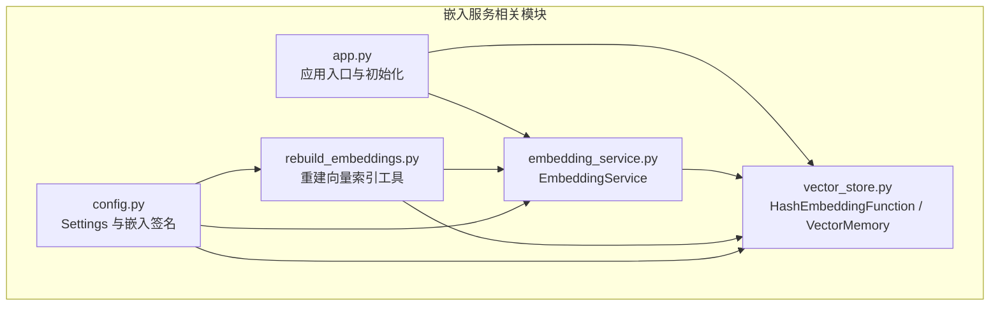
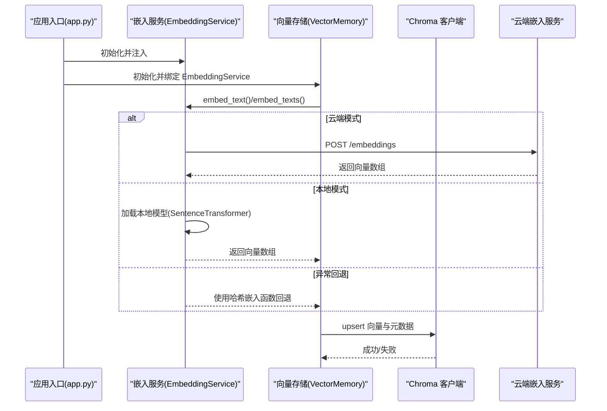
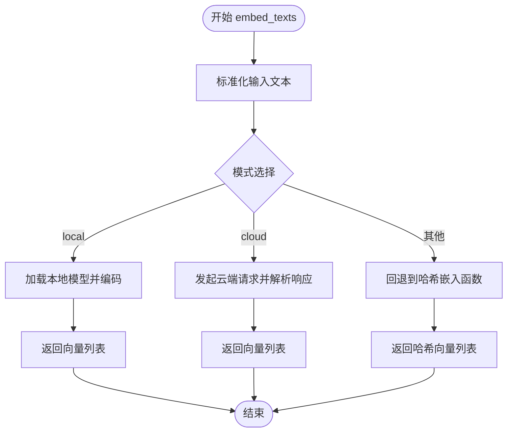
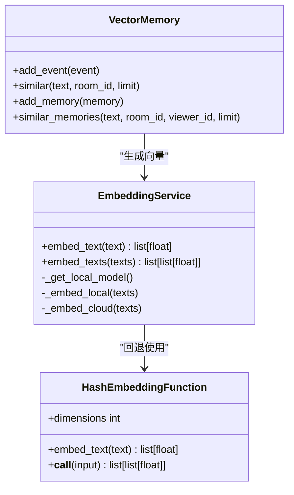
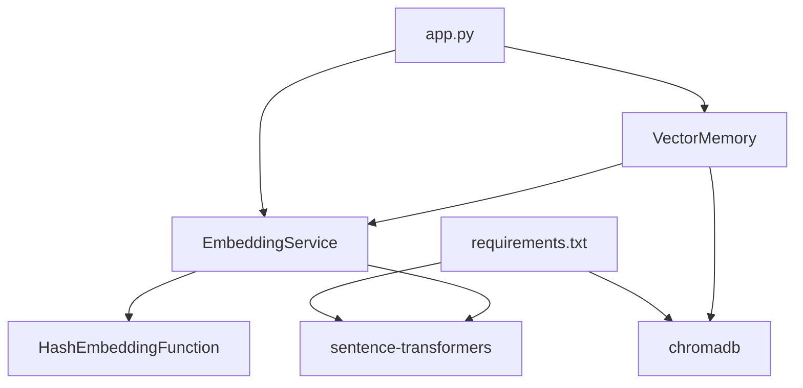

# 嵌入模型服务

<cite>
**本文引用的文件**
- [backend/memory/embedding_service.py](file://backend/memory/embedding_service.py)
- [backend/memory/vector_store.py](file://backend/memory/vector_store.py)
- [backend/memory/rebuild_embeddings.py](file://backend/memory/rebuild_embeddings.py)
- [backend/config.py](file://backend/config.py)
- [backend/app.py](file://backend/app.py)
- [tests/test_embedding_service.py](file://tests/test_embedding_service.py)
- [requirements.txt](file://requirements.txt)
- [README.md](file://README.md)
</cite>

## 目录
1. [简介](#简介)
2. [项目结构](#项目结构)
3. [核心组件](#核心组件)
4. [架构总览](#架构总览)
5. [详细组件分析](#详细组件分析)
6. [依赖关系分析](#依赖关系分析)
7. [性能考量](#性能考量)
8. [故障排查指南](#故障排查指南)
9. [结论](#结论)
10. [附录](#附录)

## 简介
本文件为 DouYin_llm 项目中的嵌入模型服务组件提供深入技术文档，重点围绕 EmbeddingService 的模型管理机制、向量化处理流程、缓存与回退策略、接口与配置管理、错误处理与降级机制、性能监控与调优建议，以及实际使用示例与最佳实践进行系统化阐述。该服务同时支持本地与云端两种嵌入模式，并在不可用时自动回退至哈希嵌入函数，确保系统在复杂环境下仍具备稳定可用的向量化能力。

## 项目结构
与嵌入服务相关的后端模块主要位于 backend/memory 目录，核心文件如下：
- backend/memory/embedding_service.py：嵌入服务主实现，负责本地/云端模式切换、异常回退与日志记录。
- backend/memory/vector_store.py：向量存储与回退嵌入函数，提供哈希嵌入与向量检索辅助逻辑。
- backend/memory/rebuild_embeddings.py：从 SQLite 数据重建 Chroma 向量索引的工具脚本。
- backend/config.py：运行时配置聚合，包含嵌入相关参数与签名生成。
- backend/app.py：应用入口，初始化嵌入服务并将其注入向量存储。
- tests/test_embedding_service.py：嵌入服务单元测试，覆盖云端模式、本地模式与回退行为。
- requirements.txt：运行依赖清单，包含可选的 chromadb、sentence-transformers 等。
- README.md：项目总体说明与接口概览。

图表来源
- [backend/app.py:24-35](file://backend/app.py#L24-L35)
- [backend/memory/embedding_service.py:18-102](file://backend/memory/embedding_service.py#L18-L102)
- [backend/memory/vector_store.py:34-317](file://backend/memory/vector_store.py#L34-L317)
- [backend/memory/rebuild_embeddings.py:1-300](file://backend/memory/rebuild_embeddings.py#L1-L300)
- [backend/config.py:40-113](file://backend/config.py#L40-L113)

章节来源
- [backend/app.py:24-35](file://backend/app.py#L24-L35)
- [backend/memory/embedding_service.py:18-102](file://backend/memory/embedding_service.py#L18-L102)
- [backend/memory/vector_store.py:34-317](file://backend/memory/vector_store.py#L34-L317)
- [backend/memory/rebuild_embeddings.py:1-300](file://backend/memory/rebuild_embeddings.py#L1-L300)
- [backend/config.py:40-113](file://backend/config.py#L40-L113)

## 核心组件
- EmbeddingService：统一的嵌入服务接口，支持本地与云端两种模式，异常时自动回退至哈希嵌入函数。
- HashEmbeddingFunction：本地哈希回退嵌入函数，提供固定维度向量输出，避免外部依赖。
- VectorMemory：向量存储与检索组件，内部使用 EmbeddingService 生成向量，支持 Chroma 与内存回退。
- Settings：集中式配置对象，提供嵌入模式、模型名、超时、设备与批大小等参数，并生成嵌入签名用于索引命名。
- rebuild_embeddings：重建向量索引工具，从 SQLite 读取数据，批量调用 EmbeddingService 生成向量并写入 Chroma。

章节来源
- [backend/memory/embedding_service.py:18-102](file://backend/memory/embedding_service.py#L18-L102)
- [backend/memory/vector_store.py:34-317](file://backend/memory/vector_store.py#L34-L317)
- [backend/config.py:40-113](file://backend/config.py#L40-L113)
- [backend/memory/rebuild_embeddings.py:155-275](file://backend/memory/rebuild_embeddings.py#L155-L275)

## 架构总览
嵌入服务在应用启动时被初始化，并注入到向量存储中。事件进入后端处理链路时，会通过 EmbeddingService 生成向量并写入 VectorMemory；当 Chroma 不可用时，VectorMemory 使用内存回退索引继续工作。重建工具可按需重建向量索引，确保索引与数据一致性。

图表来源
- [backend/app.py:24-35](file://backend/app.py#L24-L35)
- [backend/memory/embedding_service.py:28-102](file://backend/memory/embedding_service.py#L28-L102)
- [backend/memory/vector_store.py:59-317](file://backend/memory/vector_store.py#L59-L317)

## 详细组件分析

### EmbeddingService：模型管理与向量化流程
- 模式选择与初始化
  - 通过 settings.embedding_mode 判断模式：local 或 cloud；其他值将触发回退。
  - 本地模式：延迟加载 SentenceTransformer，支持设备与批大小配置。
  - 云端模式：构造 HTTP 请求，携带 Authorization 头与超时设置。
- 文本预处理
  - 将输入列表标准化为空字符串占位与去空白，避免空输入导致异常。
- 推理与后处理
  - 本地：调用 encode，convert_to_numpy=False，normalize_embeddings=True，输出为浮点向量列表。
  - 云端：解析 JSON 响应，提取 data[...].embedding 字段。
- 回退策略
  - 任一异常发生时，记录警告日志并切换至哈希嵌入函数，后续不再重复记录相同模式的回退日志。
- 日志与可观测性
  - 记录模型加载、请求计数、回退触发等关键事件，便于问题定位。

图表来源
- [backend/memory/embedding_service.py:28-102](file://backend/memory/embedding_service.py#L28-L102)

章节来源
- [backend/memory/embedding_service.py:18-102](file://backend/memory/embedding_service.py#L18-L102)
- [tests/test_embedding_service.py:23-83](file://tests/test_embedding_service.py#L23-L83)

### HashEmbeddingFunction：哈希回退嵌入
- 作用：在无外部嵌入模型可用时提供稳定的向量输出，避免系统中断。
- 算法要点：
  - 文本分词与 Unicode 中文字符切片增强。
  - 使用 SHA-256 对 token 哈希，按维度取模确定索引，符号位由第二字节决定。
  - 向量归一化，确保向量长度为 1。
- 参数：dimensions（默认 256），可按需调整以匹配下游索引需求。

章节来源
- [backend/memory/vector_store.py:34-56](file://backend/memory/vector_store.py#L34-L56)

### VectorMemory：向量存储与检索
- 初始化与集合命名
  - 使用 settings.embedding_signature() 作为集合后缀，确保不同嵌入配置对应独立集合。
  - 若 chromadb 可用，则创建 live_history 与 viewer_memories 两个集合；否则记录警告并使用内存回退。
- 写入流程
  - add_event/add_memory：去重、拼接文档、写入内存缓冲与 Chroma（若可用）。
  - 使用 EmbeddingService 生成向量，upsert 写入。
- 查询流程
  - similar/similar_memories：优先使用 Chroma query，失败时回退到内存回退索引。
  - 排序与筛选：基于距离/分数、包含查询词、事件类型、置信度、召回次数等综合排序。
- 性能参数
  - 查询限制、最小分数阈值、最终 K 值等由 settings 控制，支持按房间过滤。

图表来源
- [backend/memory/embedding_service.py:18-102](file://backend/memory/embedding_service.py#L18-L102)
- [backend/memory/vector_store.py:34-317](file://backend/memory/vector_store.py#L34-L317)

章节来源
- [backend/memory/vector_store.py:59-317](file://backend/memory/vector_store.py#L59-L317)

### rebuild_embeddings：重建向量索引
- 数据源：从 SQLite 读取事件与观众记忆，支持按房间与限制条数过滤。
- 批处理：每批 64 条，减少网络/IO 压力。
- 写入：调用 EmbeddingService 生成向量，批量 upsert 到 Chroma。
- 清理与命名：可选择删除旧集合后重建；集合命名包含嵌入签名，避免冲突。
- 清单管理：生成 index_manifest.json，记录活动签名、重建时间与集合信息，便于运维核对。

章节来源
- [backend/memory/rebuild_embeddings.py:155-275](file://backend/memory/rebuild_embeddings.py#L155-L275)

### 配置管理：模型选择、参数与版本兼容
- 嵌入模式与模型
  - EMBEDDING_MODE：cloud/local/其他（回退到哈希）。
  - EMBEDDING_MODEL：云端/本地模型名。
  - EMBEDDING_BASE_URL/EMBEDDING_API_KEY：云端接口地址与鉴权。
- 本地嵌入
  - LOCAL_EMBEDDING_DEVICE：cpu/cuda 等。
  - LOCAL_EMBEDDING_BATCH_SIZE：批大小。
- 超时与安全
  - EMBEDDING_TIMEOUT_SECONDS：云端请求超时。
- 嵌入签名
  - embedding_signature：将模式与模型名规范化为短标识，用于集合命名与索引隔离。

章节来源
- [backend/config.py:64-76](file://backend/config.py#L64-L76)
- [backend/config.py:106-113](file://backend/config.py#L106-L113)

### 错误处理与降级机制
- 云端异常回退
  - 任何异常（网络、HTTP、JSON 解析等）均触发回退至哈希嵌入函数，并记录一次警告日志，避免重复刷屏。
- 本地依赖缺失
  - 未安装 sentence-transformers 时，本地模式抛出运行时错误，提示安装依赖。
- Chroma 不可用
  - VectorMemory 在初始化阶段检测 chromadb，不可用时记录警告并使用内存回退索引。
- LLM 侧错误处理参考
  - 虽非嵌入服务，但 LLM 侧同样采用统一的错误分类与状态标记，可借鉴其错误处理模式。

章节来源
- [backend/memory/embedding_service.py:38-48](file://backend/memory/embedding_service.py#L38-L48)
- [backend/memory/embedding_service.py:52-53](file://backend/memory/embedding_service.py#L52-L53)
- [backend/memory/vector_store.py:70-84](file://backend/memory/vector_store.py#L70-L84)

## 依赖关系分析
- 运行时依赖
  - chromadb：可选，用于持久化向量索引。
  - sentence-transformers：可选，用于本地嵌入模型加载。
- 应用耦合
  - app.py 初始化 EmbeddingService 并注入 VectorMemory，形成闭环。
  - VectorMemory 依赖 Settings 的嵌入签名，确保集合命名唯一性。
- 测试覆盖
  - 单元测试覆盖云端模式请求路径、本地模式调用路径与回退行为。

图表来源
- [requirements.txt:1-6](file://requirements.txt#L1-L6)
- [backend/app.py:24-35](file://backend/app.py#L24-L35)
- [backend/memory/embedding_service.py:18-102](file://backend/memory/embedding_service.py#L18-L102)
- [backend/memory/vector_store.py:59-317](file://backend/memory/vector_store.py#L59-L317)

章节来源
- [requirements.txt:1-6](file://requirements.txt#L1-L6)
- [backend/app.py:24-35](file://backend/app.py#L24-L35)

## 性能考量
- 推理延迟
  - 云端模式受网络与服务端响应影响，建议合理设置 EMBEDDING_TIMEOUT_SECONDS。
  - 本地模式受设备与批大小影响，适当增大 LOCAL_EMBEDDING_BATCH_SIZE 可提升吞吐，但需注意显存/CPU占用。
- 吞吐量
  - 批处理：VectorMemory 与 rebuild_embeddings 均采用批处理策略，减少 IO/网络往返。
  - 向量写入：upsert 批量写入，避免逐条写入带来的性能损耗。
- 资源利用率
  - Chroma：持久化索引，重启后复用，减少重复计算。
  - 内存回退：在无 chromadb 时，使用内存回退索引，避免完全离线。
- 搜索质量
  - 通过 SEMANTIC_* 系列参数控制最小分数、查询上限与最终返回条数，平衡召回与相关性。

章节来源
- [backend/memory/rebuild_embeddings.py:173-192](file://backend/memory/rebuild_embeddings.py#L173-L192)
- [backend/memory/vector_store.py:172-230](file://backend/memory/vector_store.py#L172-L230)
- [backend/config.py:71-76](file://backend/config.py#L71-L76)

## 故障排查指南
- 云端模式失败
  - 检查 EMBEDDING_BASE_URL 与 EMBEDDING_API_KEY 是否正确。
  - 查看日志中“回退到哈希嵌入”的警告，确认是否为网络或服务端异常。
- 本地模式失败
  - 确认已安装 sentence-transformers；若未安装，本地模式将抛出运行时错误。
  - 检查 LOCAL_EMBEDDING_DEVICE 与 LOCAL_EMBEDDING_BATCH_SIZE 是否合理。
- 向量索引异常
  - 若 Chroma 不可用，系统会使用内存回退索引；可在日志中查看相关警告。
  - 使用 rebuild_embeddings 工具重建索引，必要时删除旧集合后重建。
- 单元测试验证
  - 使用测试用例验证云端/本地/回退路径，确保预期行为符合预期。

章节来源
- [tests/test_embedding_service.py:23-83](file://tests/test_embedding_service.py#L23-L83)
- [backend/memory/embedding_service.py:38-48](file://backend/memory/embedding_service.py#L38-L48)
- [backend/memory/vector_store.py:70-84](file://backend/memory/vector_store.py#L70-L84)
- [backend/memory/rebuild_embeddings.py:155-275](file://backend/memory/rebuild_embeddings.py#L155-L275)

## 结论
EmbeddingService 通过灵活的模式选择与完善的回退机制，在云端与本地之间实现了高可用的向量化能力；结合 VectorMemory 的索引与检索逻辑，以及 rebuild_embeddings 的重建工具，形成了从数据到索引再到查询的完整闭环。通过合理的配置与批处理策略，可在保证性能的同时提升稳定性与可维护性。

## 附录

### 接口定义与使用示例
- 单个文本向量化
  - 调用 EmbeddingService.embed_text(text) 获取向量。
  - 适用于一次性少量文本处理场景。
- 批量文本向量化
  - 调用 EmbeddingService.embed_texts(texts) 获取向量列表。
  - 适用于批量事件或记忆写入场景。
- 模型信息查询
  - 通过 settings.embedding_mode、settings.embedding_model、settings.embedding_signature() 获取当前嵌入配置与签名。
- 重建向量索引
  - 使用命令行工具 rebuild_embeddings，支持目标选择（memories/events/all）、房间过滤、限制条数、干跑与丢弃现有集合等选项。

章节来源
- [backend/memory/embedding_service.py:25-26](file://backend/memory/embedding_service.py#L25-L26)
- [backend/memory/embedding_service.py:28-31](file://backend/memory/embedding_service.py#L28-L31)
- [backend/config.py:106-113](file://backend/config.py#L106-L113)
- [backend/memory/rebuild_embeddings.py:278-296](file://backend/memory/rebuild_embeddings.py#L278-L296)

### 最佳实践
- 优先使用云端模式以获得更高质量的向量，本地模式用于离线或低延迟场景。
- 合理设置 EMBEDDING_TIMEOUT_SECONDS 与 LOCAL_EMBEDDING_BATCH_SIZE，平衡延迟与吞吐。
- 定期使用 rebuild_embeddings 重建索引，确保向量与数据一致性。
- 在生产环境中启用 Chroma 并持久化存储，避免重启丢失索引。
- 通过日志与单元测试持续验证回退路径，确保系统在异常情况下仍可稳定运行。